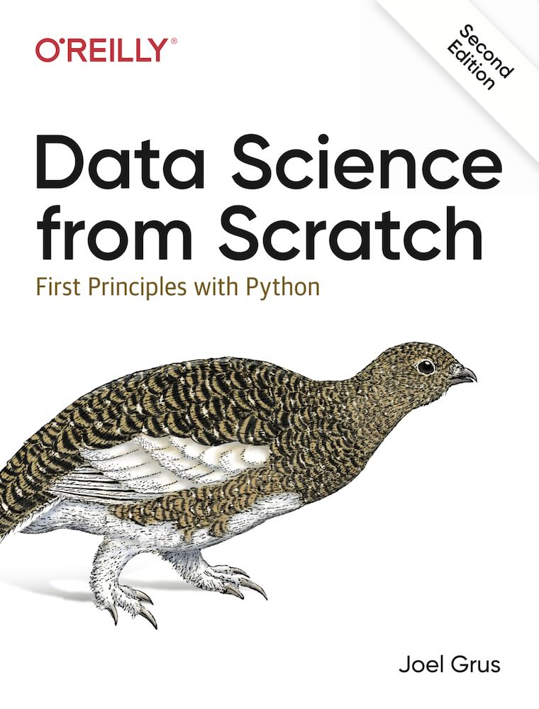
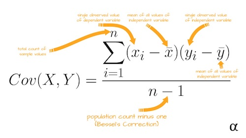
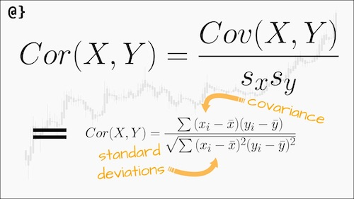

# Statistics
Statistics refers to the mathematics and techniques with which we understand data.

## Describing a Single Set of Data
We use statistics to distill and communicate relevant features of our data.

## Central Tendencies
Usually, we’ll want some notion of where our data is centered. Most commonly we’ll use the *mean* (or average).
### Mean
As you add more points, the mean shifts around, but it always depends on the value of every point. For example, if you have 10 data points, and you increase the value of any of them by 1, you increase the mean by 0.1.

If we have n data points and one of them increases by some small amount e, then necessarily the mean will increase by e / n.

The mean is very sensitive to outliers in our data.
If outliers are likely to be bad data, then **the mean can sometimes give us a misleading picture**.

### Median
The median, which is the middle-most value (if the number of data points is *odd*) or the average of the two middle-most values (if the number of data points is *even*).

Unlike the mean, the median doesn’t fully depend on every value in your data.

### Quantile
A generalization of the median is the quantile, which represents the value under which a certain percentile of the data lies (the median represents the value under which 50% of the data lies)

## Dispersion
**Dispersion refers to measures of how spread out our data is**. Values near zero signify not spread out at all and for which large values (whatever that means) signify very spread out. For instance, a very simple measure is **the range**, which is just the difference between the largest and smallest elements.

### Variance
A more complex measure of dispersion is the variance

#### Bias correction
This looks like variance is almost the average squared deviation from the mean, except that we’re dividing by n - 1 instead of n. In fact, when we’re dealing with a sample from a larger population, x_bar is only an estimate of the actual mean, which means that **on average (x_i - x_bar) ** 2 is an underestimate of x_i’s squared deviation from the mean, which is why we divide by n - 1 instead of n**.

It is important to keep in mind this correction only produces an unbiased estimator for *normally and independently distributed* X.

### Standard deviation
The variance has units that are the square of the original units (e.g., “friends squared”). As it can be hard to make sense of these, we often look instead at the *standard deviation*.

### Interquartile range
Both the range and the standard deviation have the same outlier problem that we saw earlier for the mean.

A more robust alternative computes the difference between the 75th percentile value and the 25th percentile value, which is quite plainly ***unaffected by a small number of outliers***:

`quantile(xs, 0.75) - quantile(xs, 0.25)`

Here is the recipe:
1) Put the data in numerical order.
2) Divide the data into two equal high and low groups at the median (if the median is a data point, include it in both the high and low groups).
3) Find the median of the low group. This is called the first quartile, or Q1.
4) The median of the high group is the third quartile, or Q3.

Now the Interquartile range (IQR) is the distance (or difference) between them:

IQR = Q3 - Q1

**IQR is the difference between the median heavy group and the median light one**

## Covariance and Correlation

Covariance is the paired analogue of variance. Whereas variance measures how a single variable deviates from its mean, **covariance measures how two variables vary in tandem from their means**

Recall that dot sums up the products of corresponding pairs of elements. When corresponding elements of x and y are either both above their means or both below their means, a positive number enters the sum. When one is above its mean and the other below, a negative number enters the sum. Accordingly, a "large" positive covariance means that x tends to be large when y is large and small when y is small. A "large" negative covariance means the opposite. A covariance close to zero means that no such relationship exists.

Nonetheless, this number can be hard to interpret: its units can be hard to make sense of, it’s hard to say what counts as a "large" covariance.

For this reason, it’s more common to look at the **correlation, which divides out the standard deviations of both variables**:

The correlation is unitless and always lies between –1 (perfect anticorrelation) and 1 (perfect correlation). A number like 0.25 represents a relatively weak positive corre‐ lation.

Correlation can be very sensitive to outliers.