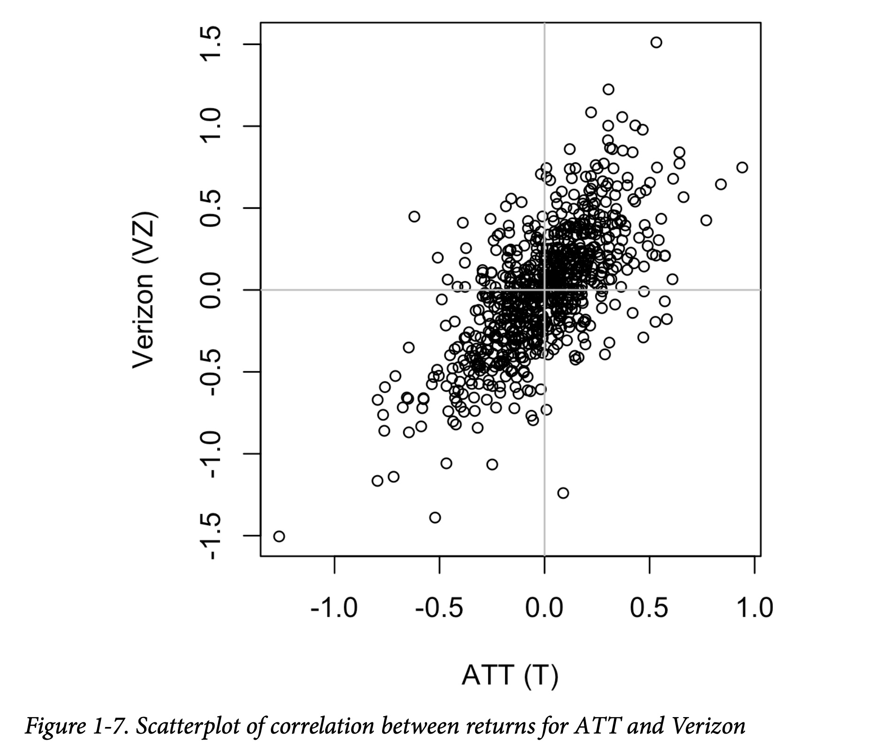
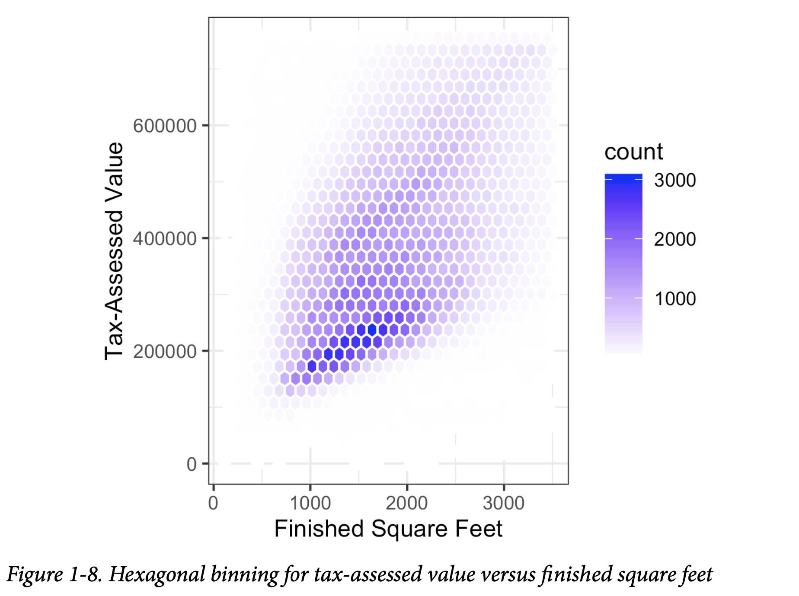

# Exploratory Data Analysis

## Elements of Structured Data
There are **two basic types of structured data: numeric and categorical**.
**Numeric data** comes in two forms: **continuous and discrete**.
*Categorical data* takes only a fixed set of values.
*Binary* data is an important special case of categorical data.
**Ordinal** data in which the categories are **ordered**.
For the purposes of data analysis and predictive modeling, the data type is important to help determine the type of visual display, data analysis, or statistical model. The data type for a variable determines how software will handle computations for that variable.

Explicit identification of data as **categorical**, as distinct from text, does offer some **advantages**:
- Tell software how statistical procedures, such as producing a chart or fitting a model, should behave.
- Storage and indexing can be optimized.
- Possible values a given categorical variable can take are enforced.

## Rectangular Data
Two-dimensional matrix with rows indicating records (cases) and columns indicating features (variables): **data frame**.

### Data Frames and Indexes
For a statistician, *predictor variables* are used in a model to predict a *response* or *dependent variable*. For a data scientist, *features* are used to predict a *target*.

### Nonrectangular Data Structures
There are other data structures besides rectangular data.
- *Time series* data records successive measurements of the same variable.
- *Spatial* data structures, which are used in mapping and location analytics.
- *Graph* (or network) data structures are used to represent physical, social, and abstract relationships.

## Estimates of Location
A basic step in exploring your data is getting a “**typical value**” for each feature (variable): an estimate of where **most of the data is located**.

### Mean
The mean is **the sum of all values divided by the number of values**.
N (or n), in statistics it is capitalized if it is referring to a population, and lower‐case if it refers to a sample from a population.

**Trimmed mean**, which you calculate by **dropping a fixed number of sorted values** at each end and then taking an average of the remaining values. **A trimmed mean eliminates the influence of extreme values**.

**Weighted mean**, which you calculate by multiplying each data value xi by a user-specified weight wi and dividing their sum by the sum of the weights.
There are two main motivations for using a weighted mean:
- Some values are intrinsically more variable than others, and *highly variable observations are given a lower weight*.
- The data collected does not equally represent the different groups that we are interested in measuring. To correct that, we can **give a higher weight to the values from the groups that were underrepresented**.

### Median and Robust Estimates
**The median is the middle number on a sorted list of the data**. Compared to the mean, which uses all observations, the median depends only on the values in the center of the sorted data.

#### Outliers
**The median** is referred to as a robust estimate of location since it **is not influenced by outliers** (extreme cases) that could skew the results. An outlier is any value that is **very distant from the other values in a data set**.
Trimming the bottom and top 10% (a common choice) of the data will provide protection against outliers in all but the smallest data sets. The trimmed mean can be thought of as a compromise between the median and the mean: it is robust to extreme values in the data, but uses more data to calculate the estimate for location.

## Estimates of VariabilityEstimates of Variability
Variability, also referred to as **dispersion**, measures whether the data **values are tightly clustered or spread out**.

### Standard Deviation and Related Estimates
Based on the differences, or **deviations, between the estimate of location and the observed data**. These deviations tell us **how dispersed the data is around the central value**.
One way to measure variability is to estimate a typical value for these deviations. A simple approach is to take the average of the absolute values of the deviations from the mean. This is known as the **mean absolute deviation**:


**Variance and the standard deviation, which are based on squared deviations**. The variance is an average of the squared deviations, and the standard deviation is the square root of the variance:


The standard deviation is much easier to interpret than the variance since it is on the same scale as the original data. **Standard deviation is preferred in statistics over the mean absolute deviation**: mathematically, working with squared values is much more convenient than absolute values, especially for statistical models.

#### Degrees of Freedom, and n or n – 1?
If you use the intuitive denominator of n in the variance formula, you will underestimate the true value of the variance and the standard deviation in the population. This is referred to as a biased estimate. However, if you divide by n – 1 instead of n, the variance becomes an *unbiased estimate*. In this case, there are n – 1 degrees of freedom since there is one constraint: the standard deviation depends on calculating the sample mean. For most problems, data scientists do not need to worry about degrees of freedom.


The variance and standard deviation are especially **sensitive to outliers** since they are based on the squared deviations.

A robust estimate of variability is the **median absolute deviation from the median or MAD**:


where m is the median.

### Estimates Based on Percentiles
Based on looking at the **spread of the sorted data**. Statistics based on sorted (ranked) data are referred to as **order statistics**.
The most basic measure is the **range**: the difference between the largest and smallest numbers. The range is **extremely sensitive to outliers** and not very useful as a general measure of dispersion in the data.
To avoid the sensitivity to outliers, we can look at the range of the data after dropping values from each end. Formally, these types of estimates are based on differences between **percentiles**. In a data set, **the Pth percentile is a value such that at least P percent of the values take on this value or less and at least (100 – P) percent of the values take on this value or more**.
**The median is the same thing as the 50th percentile**. The percentile is essentially the same as a *quantile*, with quantiles indexed by fractions.

A common measurement of variability is **the difference between the 25th percentile and the 75th percentile**, called the **interquartile range (or IQR)**.

## Exploring the Data Distribution
### Percentiles and Boxplots
Percentiles are also valuable for summarizing the entire distribution. It is common to report the quartiles (25th, 50th, and 75th percentiles). Percentiles are especially **valuable for summarizing the tails** (the outer range) of the distribution.

**Boxplots are based on percentiles and give a quick way to visualize the distribution of data**.


**The top and bottom of the box are the 75th and 25th percentiles, respectively. The median is shown by the horizontal line in the box. The dashed lines, referred to as whiskers, extend from the top and bottom of the box to indicate the range for the bulk of the data**.
By default the *whiskers* extends to the furthest point beyond the box, except that it will not go beyond *1.5 times the IQR*.
Any data **outside of the whiskers** is plotted as single points or circles (often considered **outliers**).

### Frequency Tables and Histograms
A frequency table of a variable divides up the variable range into equally spaced segments and tells us **how many values fall within each segment**.

Both frequency tables and percentiles summarize the data by creating **bins**. In general, **quartiles and deciles will have the same count in each bin (equal-count bins), but the bin sizes will be different**. **The frequency table, by contrast, will have different counts in the bins (equal-size bins), and the bin sizes will be the same.**

A **histogram is a way to visualize a frequency table**.


### Density Plots and Estimates
A density plot shows the distribution of data values as a continuous line.
The total area under the density curve = 1, and instead of counts in bins you calculate areas under the curve between any two points on the x-axis, which correspond to the proportion of the distribution lying between those two points.


## Exploring Binary and Categorical Data
**Bar charts**: categories are listed on the x-axis, and frequencies or proportions on the y-axis.


Note that a bar chart resembles a histogram; in a bar chart the x-axis represents different categories of a factor variable, while in a histogram the x-axis represents values of a single variable on a numeric scale.
Converting numeric data to categorical data is an important and widely used step in data analysis since it reduces the complexity (and size) of the data.

### Mode
The mode is the value —or values in case of a tie— that **appears most often in the data**. The mode is a simple **summary statistic for categorical data**.

### Expected Value
When the categories can be associated with a numeric value, this gives an **average value based on a category’s probability of occurrence**.

A special type of categorical data is data in which **the categories represent or can be mapped to discrete values on the same scale**.
Expected value is a form of weighted mean, in which the weights are probabilities.
The expected value is calculated as follows:
1. Multiply each outcome by its probability of occurrence.
2. Sum these values.

The expected value is really a form of weighted mean: it adds the ideas of future expectations and probability weights, often based on subjective judgment.


### Probability
For our purposes, the probability that an event will happen is the proportion of times it will occur if the situation could be repeated over and over, countless times.

## Correlation
Variables X and Y (each with measured data) are said to be positively correlated if high values of X go with high values of Y, and low values of X go with low values of Y. If high values of X go with low values of Y, and vice versa, the variables are negatively correlated.
Values produced by this metric, though, are not that meaningful.

More useful is a standardized variant: **the correlation coefficient (Pearson’s correlation coefficient), which gives an estimate of the correlation between two variables that always lies on the same scale**.


**The correlation coefficient always lies between +1 (perfect positive correlation) and –1 (perfect negative correlation); 0 indicates no correlation**.


The correlation coefficient measures the extent to which two paired variables (e.g., height and weight for individuals) are **associated with one another**.

Variables can have an association that is not linear, in which case the correlation coefficient may not be a useful metric.
Like the mean and standard deviation, the **correlation coefficient is sensitive to outliers in the data**.

### Scatterplots
The standard way to visualize the relationship between two measured data variables is with a scatterplot. The x-axis represents one variable and the y-axis another, and **each point on the graph is a record**.



The returns have a positive relationship: while they cluster around zero, on most days, the stocks go up or go down in tandem (upper-right and lower-left quadrants). There are fewer days where one stock goes down significantly while the other stock goes up, or vice versa (lower-right and upper-left quadrants).

## Exploring Two or More Variables
Correlation analysis is an important method that **compares two variables** (bivariate analysis).

### Hexagonal Binning and Contours (Plotting Numeric Versus Numeric Data)
For data sets with hundreds of thousands or millions of records, a scatterplot will be too dense.
**Hexagonal binning**: rather than plotting points, which would appear as a monolithic dark cloud, we **grouped the records into hexagonal bins and plotted the hexagons with a color indicating the number of records in that bin**.



Next plot uses contours overlaid onto a scatterplot to visualize the relationship between two numeric variables. The contours are essentially a topographical map to two variables; each contour band represents a specific density of points, increasing as one nears a “peak.”


Heat maps, hexagonal binning, and contour plots all give a visual representation of a two-dimensional density.

### Two Categorical Variables

A useful way to summarize two categorical variables is a **contingency table** —a table of counts by category.
A contingency table (also known as a cross tabulation or crosstab) is a type of **table in a matrix format that displays the frequency distribution of the variables**.


### Categorical and Numeric Data
**Boxplots are a simple way to visually compare the distributions of a numeric variable grouped according to a categorical variable**.


A **violin plot** is an enhancement to the boxplot and **plots the density estimate with the density on the y-axis**. The density is mirrored and flipped over, and the resulting shape is filled in, creating an image resembling a violin. The advantage of a violin plot is that it **can show nuances in the distribution that aren’t perceptible in a boxplot**. On the other hand, the boxplot more clearly shows the outliers in the data.


The violin plot shows a concentration in the distribution near zero for Alaska and, to a lesser extent, Delta. This phenomenon is not as obvious in the boxplot.

# Data and Sampling Distributions

The lefthand side in the next figure represents a **population** that, in statistics, is assumed to follow an **underlying but unknown distribution**. All that is available is the sample data and **its empirical distribution**, shown on the right-hand side. To get from the lefthand side to the righthand side, **a sampling procedure is used** (represented by an arrow). Traditional statistics focused very much on the left‐hand side, using theory based on strong assumptions about the population. **Modern statistics has moved to the righthand side, where such assumptions are not needed**.


Data scientists need not worry about the theoretical nature of the lefthand side and instead should focus on the sampling procedures and the data at hand. We can gain additional insight by using our understanding of the population.

## Random Sampling and Sample Bias
**A sample is a subset of data from a larger data set**; statisticians call this larger data set the **population**.

**Random sampling** is a process in which each available member of the population being sampled has an **equal chance of being chosen** for the sample at each draw. The sample that results is called a simple random sample.
Sampling **with replacement**: observations are put back in the population after each draw.
Sampling **without replacement**: observations, once selected, are unavailable for future draws.

**Data quality often matters more than data quantity** when making an estimate or a model based on a sample. Data quality in data science involves **completeness, consistency of format, cleanliness, and accuracy of individual data points**. Statistics adds the notion of **representativeness**.

**Sample bias**: the **sample was different** in some meaningful and nonrandom way **from the larger population** it was meant to represent. Sample bias occurs when the difference is meaningful, and it can be expected to continue for other samples drawn in the same way as the first.

**Self-Selection Sampling Bias**: the people motivated to write reviews may have had poor experiences, may have an association with the establishment, or may simply be a different type of person from those who do not write reviews.

### Bias
Statistical bias refers to measurement or sampling errors that are **systematic** and produced by the measurement or **sampling process**.
The results shown in Figure 2-3 show a biased process—there is still random error in both the x and y direction, but there is also a bias. Shots tend to fall in the upper-right quadrant.


### Random Selection
Random sampling is not always easy. Proper definition of an accessible population is key.
In **stratified sampling**, the population is divided up into strata, and random samples are taken from each stratum.

### Size Versus Quality: When Does Size Matter?
In the era of big data, it is sometimes surprising that smaller is better.

So when are massive amounts of data needed?
The classic scenario for the value of big data is when the data is not only big but **sparse** as well.

The real value of modern search technology lies in the ability to return detailed and useful results for a huge variety of search queries, including those that occur with a frequency, say, of only one in a million.
The number of actual pertinent records —ones in which this exact search query, or something very similar, appears (together with information on what link people ultimately clicked on)— might need only be in the thousands to be effective. However, many trillions of data points are needed to obtain these pertinent records.

### Sample Mean Versus Population Mean
The symbol x (pronounced “x-bar”) is used to represent the mean of a sample from a population, whereas μ is used to represent the mean of a population.

- Even in the era of big data, **random sampling remains an important arrow** in the data scientist’s quiver.
- **Bias occurs when measurements or observations are systematically in error because they are not representative of the full population**.
- **Data quality is often more important than data quantity, and random sampling can reduce bias**.

## Selection Bias
Selection bias refers to the practice of **selectively choosing data** —consciously or unconsciously— **in a way that leads to a conclusion that is misleading or ephemeral**.

- Selection bias: Bias resulting from **the way in which observations are selected**.
- Data snooping: Extensive **hunting through data** in search of something interesting.
- Vast search effect: If you repeatedly run different models and ask different questions with a large data set, you are bound to find something interesting. But is the result you found **truly something interesting, or is it the chance outlier?**

### Regression to the Mean
Regression to the mean refers to a phenomenon involving successive measurements on a given variable: **extreme observations tend to be followed by more central ones**.
Among the athletes there is always one who performs better than all the rest. Generally, this “rookie of the year” does not do as well in his second year.

- Specifying a hypothesis and then collecting data following randomization and random sampling principles ensures against bias.
- All other forms of data analysis run the risk of bias resulting from the data collection/analysis process.

## Sampling Distribution of a Statistic
The term sampling distribution of a statistic refers to the **distribution of some sample statistic over many samples drawn from the same population**.

**Sample statistic**: A metric calculated for a sample of data drawn from a larger population.
**Data distribution**: The frequency distribution of individual values in a data set.
**Sampling distribution**: The frequency distribution of a sample statistic over many samples or resamples.
**Central limit theorem**: The tendency of the sampling distribution to take on a normal shape as sample size rises

Typically, a sample is drawn with the goal of measuring something (with a sample statistic) or modeling something. Since our estimate or model is based on a sample, it might be in error; it might be different if we were to draw a different sample. We are therefore interested in how different it might be—a key concern is **sampling variability**.

It is important to distinguish between the distribution of the individual data points, known as the data distribution, and **the distribution of a sample statistic, known as the sampling distribution**.

**The distribution of a sample statistic such as the mean is likely to be more regular and bell-shaped than the distribution of the data itself. The larger the sample the statistic is based on, the more this is true. Also, the larger the sample, the narrower the distribution of the sample statistic.**

Take three samples from this data: a sample of 1,000 values, a sample of 1,000 means of 5 values, and a sample of 1,000 means of 20 values:


```python
import pandas as pd

sample_data = pd.DataFrame({
    'income': loans_income.sample(1000),
    'type': 'Data',
})
sample_mean_05 = pd.DataFrame({
    'income': [loans_income.sample(5).mean() for _ in range(1000)],
    'type': 'Mean of 5',
})
sample_mean_20 = pd.DataFrame({
    'income': [loans_income.sample(20).mean() for _ in range(1000)],
    'type': 'Mean of 20',
})
results = pd.concat([sample_data, sample_mean_05, sample_mean_20])
```

### Central Limit Theorem
It says that the means drawn from multiple samples will resemble the familiar bell-shaped normal curve, even if the source population is not normally distributed.
The central limit theorem underlies the machinery of hypothesis tests and confidence intervals.

### Standard Error
Sums up the variability in the sampling distribution for a statistic.


Where `s` is the standard deviation of the sample values, and `n` is the sample size.

As the sample size increases, the standard error decreases.
**In modern statistics, the bootstrap has become the standard way to estimate standard error**. It can be used for virtually any statistic and does not rely on the central limit theorem or other distributional assumptions.

## The Bootstrap
An easy and effective way to **estimate the sampling distribution of a statistic**, or of model parameters, is to **draw additional samples, with replacement**, from the sample itself and **recalculate the statistic or model for each resample**.
Replace each observation after each draw; that is, we **sample with replacement**. In this way we effectively create an infinite population in which the probability of an element being drawn remains unchanged from draw to draw. The algorithm for a bootstrap resampling of the mean, for a sample of size n, is as follows:

1. Draw a sample value, record it, and then replace it.
2. Repeat n times.
3. Record the mean of the n resampled values.
4. Repeat steps 1–3 R times.
5. Use the R results to:
    a. Calculate their standard deviation (this estimates sample mean standard error).
    b. Produce a histogram or boxplot.
    c. Find a confidence interval.

The more iterations you do, the more accurate the estimate of the standard error, or the confidence interval. The result from this procedure is a bootstrap set of sample statistics or estimated model parameters, which you can then examine to see **how variable they are**.

With classification and regression trees (also called decision trees), running multiple trees on bootstrap samples and then averaging their predictions (or, with classification, taking a majority vote) **generally performs better than using a single tree**. This process is called **bagging** (short for “bootstrap aggregating”).

The bootstrap can be used for sample size determination; experiment with different values for n to see how the sampling distribution is affected.

The bootstrap does not compensate for a small sample size; it does not create new data, nor does it fill in holes in an existing data set. **It merely informs us about how lots of additional samples would behave when drawn from a population like our original sample**.

**The awesome thing about bootstrapping is that we can apply it to any statistic to create a histogram of what might happen if we repeated the experiment a bunch of times and we can use that histogram to calculate stuff like standard errors and confidence intervals without having to worry about whether or not there is a nice formula**.

The bootstrap (sampling with replacement from a data set) is a powerful tool for **assessing the variability of a sample statistic**.
It also allows us to estimate sampling distributions for statistics where no mathematical approximation has been developed.
When applied to predictive models, **aggregating multiple bootstrap sample predictions (bagging) outperforms the use of a single model**.

## Confidence Intervals
Confidence intervals are another way to understand the **potential error in a sample estimate**.
Confidence intervals **present an estimate not as a single number but as a range**, in a manner grounded in statistical sampling principles.
Confidence intervals always come with a coverage level, expressed as a (high) percentage, say 90% or 95%. One way to think of a 90% confidence interval is as follows: it is **the interval that encloses the central 90% of the bootstrap sampling distribution of a sample statistic**. More generally, an x% confidence interval around a sample estimate should, on average, contain similar sample estimates x% of the time (when a similar sampling procedure is followed).


Of course, what we are really interested in when we have a sample result is, “What is the probability that the true value lies within a certain interval?” **This is not really the question that a confidence interval answers**, but it ends up being how most people interpret the answer.

The percentage associated with the confidence interval is termed the **level of confidence**. The higher the level of confidence, the wider the interval. Also, the **smaller the sample, the wider the interval (i.e., the greater the uncertainty)**.

A confidence interval is a tool that can be used to get an idea of **how variable a sample result might be**, in order to communicate the **potential error in an estimate**, and perhaps to learn whether a larger sample is needed.

Key Ideas:
- Confidence intervals are the typical way to **present estimates as an interval range**.
- **The more data you have, the less variable a sample estimate will be**.
- The lower the level of confidence you can tolerate, the narrower the confidence interval will be.
- The **bootstrap** is an effective way to construct confidence intervals.

## Normal Distribution
In a normal distribution, 68% of the data lies within one standard deviation of the mean, and 95% lies within two standard deviations.
Most of the variables used in a typical data science project—in fact, most raw data as a whole—are not normally distributed. **The utility of the normal distribution derives from the fact that many statistics are normally distributed in their sampling distribution**. Even so, assumptions of normality are generally a last resort, used when empirical probability distributions, or bootstrap distributions, are not available.


### Standard Normal and QQ-Plots
A standard normal distribution is one in which the units on the **x-axis are expressed in terms of standard deviations away from the mean**. To compare data to a standard normal distribution, you **subtract the mean and then divide by the standard deviation**; this is also called **normalization or standardization**.
The transformed value is termed a **z-score**, and the normal distribution is sometimes called the **z-distribution**.

**A QQ-Plot is used to visually determine how close a sample is to a specified distribution—in this case, the normal distribution**. The QQ-Plot orders the z-scores from low to high and plots each value’s z-score on the y-axis; the x-axis is the corresponding quantile of a normal distribution for that value’s rank. Since the data is normalized, the units correspond to the number of standard deviations away from the mean. **If the points roughly fall on the diagonal line, then the sample distribution can be considered close to normal**.


Converting data to z-scores just puts the data on the same scale as the standard normal distribution, often for **comparison purposes**.

The following figure compares the distribution of a dataset with the normal distribution and the uniform distribution, to see with which one it matches better:


Key Ideas:
- While raw data is typically not **normally distributed, errors often are**, as are averages and totals in large samples.
- To convert data to z-scores, you subtract the mean of the data and divide by the standard deviation; you can then **compare the data to a normal distribution**.

## Long-Tailed Distributions
While the normal distribution is often appropriate and useful with respect to the distribution of errors and sample statistics, it typically does not characterize the distribution of raw data. Sometimes, the distribution is highly skewed (asymmetric). The tails of a distribution correspond to the extreme values (small and large).

In the next figure, the points are far below the line for low values and far above the line for high values, indicating the data are not normally distributed. **This means that we are much more likely to observe extreme values than would be expected if the data had a normal distribution**.

