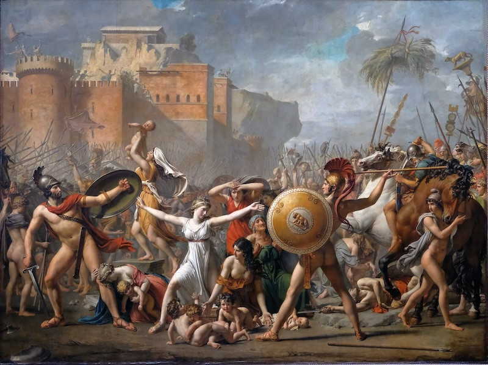

# Temario

No solo busca relatar batallas, sino entender el "alma" de Roma: su organización social, su ingenio técnico y la psique de sus protagonistas.

### **Módulo I: La Infancia de la Urbe (753 a.C. - 509 a.C.)**
*En este bloque exploraremos cómo una aldea de pastores y fugitivos se convirtió en la dueña del Lacio bajo el mando de siete reyes legendarios.*

1.  **Mito vs. Arqueología:** ¿Rómulo o una fusión de tribus en el Septimontium?.
2.  **La Herencia Etrusca:** Los "reyes mercaderes" y el salto técnico (la *Cloaca Máxima* y el urbanismo).
3.  **Personaje Clave:** **Servio Tulio**, el rey que inventó el censo y organizó a los romanos no por su sangre, sino por su riqueza.
4.  **El fin de la Monarquía:** La tragedia de Lucrecia y el nacimiento del odio eterno a la palabra *Rex*.

### **Módulo II: La Forja del Carácter Republicano (509 a.C. - 264 a.C.)**
*Analizaremos la lucha interna por la libertad y la conquista de la península itálica.*

1.  **El Conflicto de los Órdenes:** Patricios contra Plebeyos. La invención de la Ley (las XII Tablas) y el concepto de *Libertas*.
2.  **Personaje Clave:** **Camilo**, el "segundo Rómulo" que salvó a Roma tras el saqueo de los galos y profesionalizó la soldada.
3.  **Ingeniería para la Guerra:** La Vía Appia y el primer acueducto (Aqua Appia) de **Apio Claudio el Ciego**.
4.  **La Legión Manipular:** Cómo Roma adaptó su ejército para vencer a los samnitas y a Pirro.

### **Módulo III: El Mare Nostrum y el Brillo de los Escipiones (264 a.C. - 133 a.C.)**
*El enfrentamiento total contra Cartago y el descubrimiento del mundo griego.*

1.  **Duelo de Titanes:** La Segunda Guerra Púnica. El genio táctico de Aníbal frente a la testarudez romana.
2.  **Personaje Clave:** **Escipión el Africano**. Entenderemos su carisma, su "conexión divina" y por qué fue el primer romano en ser tratado casi como un rey en vida.
3.  **Cultura y Resistencia:** La llegada del helenismo y la literatura. El choque entre el "Círculo de los Escipiones" (modernizadores) y **Catón el Viejo** (conservador radical).
4.  **Avance Social:** Roma como estado libre de impuestos tras la caída de Macedonia.

### **Módulo IV: La Revolución y el Caos Civil (133 a.C. - 27 a.C.)**
*Cuando las instituciones crujen y el poder pasa de las urnas a las espadas.*

1.  **Los Gracos:** El primer intento de reforma agraria y el nacimiento de la violencia política.
2.  **Personaje Clave:** **Cayo Mario**. Su reforma del ejército (las "mulas de Mario") que vinculó la lealtad del soldado a su general y no al Estado.
3.  **Sila y Pompeyo:** La dictadura como método de orden y la expansión hacia Oriente.
4.  **Personaje Clave:** **Julio César**. El aristócrata popular, su conquista de las Galias (etnografía y genocidio) y el cruce del Rubicón.
5.  **Cultura:** El siglo de **Cicerón**: la oratoria y la filosofía como herramientas políticas.

### **Módulo V: El Orden de Augusto y la Pax Romana (27 a.C. - 180 d.C.)**
*Roma se convierte en mármol y el "Princeps" en el centro de todo.*

1.  **Augusto, el Camaleón:** Cómo restauró la República para destruirla y gobernar solo.
2.  **La Vida en el Imperio:** Avances técnicos (cemento, termas, anfiteatros) y el sistema de "Pan y Circo".
3.  **Dinastías y Locura:** De los excesos de Calígula y Nerón a la eficiencia administrativa de los Flavios.
4.  **Los Cinco Emperadores Buenos:** Trajano (máxima extensión) y **Marco Aurelio** (el estoicismo en el trono).

### **Módulo VI: La Larga Agonía y el Cambio de Era (180 d.C. - 476 d.C.)**
*La crisis del siglo III, la cristianización y el colapso de Occidente.*

1.  **Anarquía Militar:** Cuando cualquiera podía ser emperador si tenía el apoyo de las legiones.
2.  **Personaje Clave:** **Caracalla** y su decreto de ciudadanía universal: ¿generosidad o necesidad fiscal?.
3.  **Reformas de Supervivencia:** Diocleciano (la Tetrarquía) y Constantino (la nueva capital y el triunfo de la Cruz).
4.  **La Caída:** Las invasiones bárbaras, la batalla de Adrianópolis (el fin de la infantería) y el último emperador, Rómulo Augústulo.

---

# La Infancia de la Urbe (753 a.C. - 509 a.C.)

El **Módulo I** nos sumerge en esa neblina donde la fantasía de los poetas y la evidencia de los picos de los arqueólogos se encuentran. Es el nacimiento de una ciudad que, según los propios romanos, estaba destinada a ser la "cabeza del mundo".

>los papas romanos quisieron durante muchos siglos que les fuesen contadas a sus hijos: un poco, porque creían en ellas y otro poco, porque, grandes patriotas, les halagaba mucho el hecho de poder mezclar los dioses influyentes como Venus y Marte y personalidades de elevada posición como Eneas, al nacimiento de su Urbe. Sentían oscuramente que era muy importante educar a sus hijos en la convicción de que pertenecían a una patria edificada con el concurso de seres sobrenaturales, que seguramente no se hubiesen prestado a ello de no haberles propuesto asignarle un gran destino. Esto dio un fundamento religioso a toda la historia de Roma, que, en efecto, se derrumbó cuando se prescindió de él. La Urbe fue caput mundi , **capital del Mundo, mientras sus habitantes supieron pocas cosas y fueron lo bastante ingenuos para creer en aquéllas, legendarias, que les habían enseñado papas y magistri** ; mientras estuvieron convencidos de ser descendientes de Eneas, de que corría por sus venas sangre divina y de ser «ungidos de Señor», aunque en aquellos tiempos se llamase Júpiter. Fue **cuando comenzaron a dudar de ello cuando su imperio se hizo añicos y el caput mundi convirtióse en colonia**.

## Mito vs. Arqueología

### 1. El Linaje de los Dioses: De Troya al Tíber
Para los romanos, su historia no empezaba con un simple pastor, sino con el colapso de una civilización: **Troya**.
*   **Eneas y el destino:** Tras la caída de Troya, el príncipe **Eneas** (hijo de la diosa Venus) huyó con su padre a cuestas y su hijo Ascanio de la mano. La leyenda dice que vagó por el Mediterráneo —incluyendo un tormentoso romance con la reina Dido en Cartago— hasta desembarcar en el Lacio.

>¿De dónde procedían esas creencias?
Cuando los griegos destruyeron la ciudad de Troya (siglo – XI ), uno de los troyanos fugitivos, el príncipe Eneas, escapó de la matanza, llevando a su anciano padre Anquises a la espalda.
Anquises es uno de los hombres más afortunados de los que existe memoria. Cuando era joven, la diosa del amor, Venus, lo encontró en el monte pastoreando ganado y se prendó de él.
Como es sabido, a los dioses les está prohibido aparearse con mortales, pero, incapaz de resistirse, Venus se le apareció desnuda y le dijo «sírvase usted mismo». Anquises elevó los ojos al cielo, agradeció a los dioses que le brindaran aquellas suculencias e introdujo sus carnes mortales en las de la beldad.

>Eneas, fugitivo de Troya con el venerable Anquises a cuestas, Eneas arribó primero a Cartago, pero la ciudad no terminó de convencerlo. Se hizo de nuevo a la mar, dejando atrás a una reina Dido que, despechada de amor no correspondido, se suicidó clavándose una daga e incinerándose en una pira.
Algún lector habrá deducido una justificación de la mortal enemistad de cartagineses y romanos.
Eneas arribó finalmente a la península itálica, en la desembocadura del Tíber, se casó con la princesa Lavinia, hija del rey Latino, y tuvo un hijo, Ascanio, que andando el tiempo fundaría la ciudad de Alba Longa

*   **Alba Longa:** Ascanio fundó Alba Longa, la ciudad "madre" de la que, generaciones después, nacerían los gemelos más famosos de la historia.

>Se dice que un rey posterior de Alba Longa fue arrojado del trono por su hermano menor. La hija del verdadero rey dio a luz a dos hermanos gemelos, a quienes el usurpador ordenó matar para que no le disputasen el gobierno de la ciudad cuando crecieran. Por ello, los niños fueron colocados en una cesta, que fue lanzada al río Tíber. El usurpador supuso que morirían sin que él tuviese que matarlos realmente.
Pero la cesta encalló en la costa, a unos 20 kilómetros de la desembocadura del río, al pie del que más tarde sería llamado el Monte Palatino. Allí los encontró una loba, que se hizo cargo de ellos.
Algún tiempo más tarde, un pastor halló a los gemelos, se los quitó a la loba, se los llevó a su hogar y los crió como hijos suyos, llamándolos **Rómulo y Remo**.

*   **El sentido del mito:** Mary Beard señala que esta leyenda de Eneas permitía a los romanos **presentarse como "forasteros" desde el inicio**, una cultura que, a diferencia de los griegos (que se creían nacidos de su propia tierra), siempre estuvo abierta a integrar a otros.

>Allí donde Rómulo recibe con agrado a todos los que acuden a su ciudad, la historia de Eneas va más lejos y asegura que en realidad los «romanos» eran originalmente «extranjeros». Es una paradoja de identidad nacional, que constituye un notorio contraste con los mitos fundacionales de muchas ciudades griegas, como Atenas, cuya población original surgió milagrosamente del suelo de su tierra natal.

### 2. El Fratricidio Sagrado: Rómulo y Remo
La historia de la fundación (fijada tradicionalmente el **21 de abril de 753 a.C.**) es una mezcla de crueldad y milagro.

>Remo sostuvo que había ganado porque sus aves habían aparecido primero; pero Rómulo señaló que sus aves eran más numerosas. En la lucha que sobrevino, Rómulo mató a Remo, y luego comenzó a construir en el Palatino las murallas de su nueva ciudad, sobre la cual iba a gobernar y que llamó Roma en su propio honor.

*   **La Loba y la "Lupa":** Abandonados en el Tíber por un tío usurpador, los gemelos fueron amamantados por una loba. Montanelli y Eslava Galán, con su agudeza habitual, nos recuerdan que *lupa* era también el término latino para "prostituta", sugiriendo que quien realmente los salvó fue **Acca Laurentia**, la mujer de un pastor.

>Una loba, Luperca, a la que los cazadores habían matado su reciente camada, percibió el llanto de los hambrientos pequeñuelos y, colocándose encima de ellos, permitió que mamasen de sus hinchadas ubres. Luego, con maternal instinto, los crio y ellos crecieron robustos y lobunos hasta que se hicieron hombres.

>Los maliciosos dicen que aquella loba no era en modo alguno una bestia, sino una mujer de verdad, Acca Laurentia, llamada Loba a causa de su carácter selvático y por las muchas infidelidades que le hacía a su marido, un pobre pastor, yéndose a hacer el amor en el bosque con todos los jovenzuelos de los contornos. Mas acaso todo eso no son más que chismorreos.

>Eligieron el sitio donde su almadía había encallado, en medio de las colinas entre las que discurre el Tíber, cuando está a puntó de desembocar en el mar. En aquel lugar, como a menudo sucede entre hermanos, litigaron sobre el nombre que dar a la ciudad. Luego decidieron que ganaría el que hubiese visto más pájaros. Remo vio seis sobre el Aventino. Rómulo, sobre el Palatino, vio doce: la ciudad se llamaría, pues, Roma. Uncieron dos blancos bueyes, excavaron un surco y construyeron las murallas jurando matar a quienquiera las cruzase. Remo, malhumorado por la derrota, dijo que eran frágiles y rompió un trozo de un puntapié. Y Rómulo, fiel al juramento, le mató de un badilazo.

*   **El muro de sangre:** La disputa por el nombre de la ciudad se decidió por el vuelo de los pájaros (augurios). Remo vio seis buitres; Rómulo, doce. Cuando Rómulo trazaba el surco sagrado (*pomerium*), Remo saltó sobre él en son de burla; Rómulo lo mató allí mismo sentenciando: *"Así muera cualquiera que salte mis murallas"*.
*   **Visión de los autores:** Horacio y otros poetas veían en este fratricidio original una "maldición genética" que condenaba a Roma a sufrir guerras civiles eternas.

> Horacio escribió, después de la década de luchas que siguió a la muerte de César, lamentándose: «Un amargo destino persigue a los romanos, y el crimen de dar muerte a un hermano, desde que la sangre del inocente Remo fue derramada en la tierra, una maldición que recayó sobre sus descendientes». Podríamos decir que la guerra civil estaba en los genes de los romanos.

### 3. La Ciudad del Asilo: ¿Quiénes eran los primeros romanos?
Rómulo no fundó una ciudad de aristócratas, sino un refugio.
*   **El Asilo:** Para poblar la colina del Palatino, Rómulo declaró a Roma "ciudad asilo", recibiendo a criminales, esclavos fugitivos y desterrados de otras tribus. Les dijo que "nada importaba la vida anterior, pero que allí se cumplirían las leyes".
*   **El Rapto de las Sabinas:** Al no tener mujeres, los romanos las robaron durante una fiesta a sus vecinos sabinos. Esto dio lugar a la primera guerra, que terminó no con una masacre, sino con una fusión: las mujeres se interpusieron entre sus padres (sabinos) y sus maridos (romanos), logrando que ambos pueblos se unieran bajo un mando conjunto de Rómulo y el rey sabino **Tito Tacio**.

>Necesitaba más ciudadanos. Por lo tanto, Rómulo declaró Roma una ciudad «asilo» y animó a la chusma y a los desposeídos del resto de Italia a unirse a ellos: esclavos fugitivos, criminales convictos, exiliados y refugiados. Esto atrajo a un buen número de hombres. Pero para conseguir mujeres, así prosigue la historia de Livio, Rómulo tuvo que recurrir a una treta, y a la violación. Invitó a los pueblos vecinos, a los sabinos y a los latinos, de la zona que rodea Roma conocida como el Lacio, a acudir a una fiesta religiosa y a disfrutar de las diversiones con sus familias. En plenos actos, dio una señal para que sus hombres raptasen a las mujeres jóvenes que había entre los visitantes y se las llevasen para convertirlas en sus esposas.

>Al final, las hostilidades cesaron gracias a las propias mujeres, que ahora se conformaban con su suerte como esposas y madres romanas. Entraron con arrojo en el campo de batalla y rogaron a sus esposos de una parte y a sus padres de la otra que dejaran de luchar. «Preferimos morir —explicaron— que vivir sin uno de vosotros, como viudas o como huérfanas.»

### 4. La Arqueología: ¿Qué dicen las piedras?
Bajo los templos de mármol de la época de Cicerón, los arqueólogos han encontrado una realidad distinta, pero igual de fascinante:
*   **El Septimontium:** La arqueología sugiere que Roma no nació de un solo acto, sino de la fusión paulatina de pequeñas aldeas dispersas en las siete colinas (Palatino, Esquilino, Quirinal, etc.) hacia el siglo VIII a.C..

>Romanos y samnitas se disputaron el control de Italia central en tres guerras sucesivas (entre el –343 y el –290). Al final prevalecieron los romanos. En torno al monte Palatino existieron hacia el siglo – VI tres poblados diferenciados por su origen: etruscos, latinos y sabinos. Con el tiempo se unieron para formar la comunidad Septimontium (‘de los Siete Montes’), con predominio de la tribu sabina.

>Lo que sí es cierto es que en el siglo VI a.C. Roma era una comunidad urbana, con un centro y algunos edificios públicos. Antes de esto, en cuanto a las primeras fases, tenemos suficientes hallazgos dispersos de lo que se conoce como Edad del Bronce Medio (entre más o menos 1700 y 1300 a. C.) para pensar que había personas viviendo en aquel emplazamiento, más que «de paso». Durante el período intermedio, podemos estar bastante seguros de que se desarrollaron pueblos más grandes, probablemente (a juzgar por lo hallado en las tumbas) con un grupo de familias de élite cada vez más rico y de que en un determinado momento se unieron formando una única comunidad cuyo carácter urbano era evidente en el siglo VI a. C. No podemos saber con seguridad cuándo se sintieron por primera vez los habitantes de aquellos asentamientos separados como una única comunidad. Y no tenemos la menor idea de cuándo pensaron, o se refirieron por primera vez a aquella comunidad con el nombre de Roma.

*   **Cabañas y Cenizas:** Se han hallado rastros de chozas de madera y barro en el Palatino que coinciden asombrosamente con las fechas de la leyenda (750-700 a.C.). En el Foro, lo que hoy son ruinas imperiales, antes fue un cementerio con urnas en forma de chozas.
*   **El "Lapis Niger":** Uno de los hallazgos más impactantes fue el **Lapis Niger** (Piedra Negra) en el Foro. Debajo, hay una inscripción en latín arcaico que incluye la palabra **RECEI** (al rey), confirmando que, a pesar de los mitos, Roma sí tuvo reyes reales que dejaron su marca en la piedra.
*   **El nombre de Roma:** Algunos sostienen que no viene de Rómulo, sino de la palabra etrusca *Rumon* (río), definiéndola simplemente como la "Ciudad del Río".

>Parece, en efecto, que «Roma» proviene de «Rumón», que en etrusco quiere decir «río». Y si esto es verdad, hay que deducir que la primera población de la Urbe la integraban no solamente latinos y sabinos, pueblos de la misma sangre y del mismo tronco como haría creer la historia del famoso «rapto», sino también etruscos gente de raza, lengua y religión muy diferentes. Es más: según ciertos historiadores, el propio Rómulo había sido etrusco.

>Cuando el poder etrusco decayó, los romanos se independizaron y dominaron las ciudades vecinas, unas por pacto de sumisión y otras por acuerdos de hermandad, primero las de su entorno y después las más lejanas.

## La Herencia Etrusca

Continuando con nuestro recorrido por el **Módulo I**, nos adentramos ahora en la etapa en que Roma dejó de ser un simple conjunto de cabañas para transformarse en una verdadera ciudad. Este cambio no fue casual, sino el resultado de la profunda **influencia y dominación etrusca**, un pueblo misterioso y técnicamente avanzado que los romanos, más tarde, se esforzarían en borrar de sus crónicas oficiales mientras conservaban casi todos sus inventos.

Detalles

>Después de haber soportado muchas humillaciones de los etruscos, sintiéronse lo bastante fuertes para poder desafiarles. Fue una lucha prolongada y sin exclusión de golpes, pero al vencido no le dejaron ni ojos para llorar. Rara vez se ha visto en la Historia desaparecer a un pueblo de la faz de la Tierra y a otro borrar todas sus huellas con tan obstinada ferocidad. Y a esto se debe el hecho que de toda la civilización etrusca no haya quedado casi nada. Sólo se han conservado algunas obras de arte y unos miles de inscripciones, de las que solamente pocas palabras han sido descifradas.
Los romanos, una vez hubieron oprimido a los etruscos, tras haber seguido un poco su escuela y haber soportado su superioridad sobre todo en el campo técnico y de organización, no sólo destruyeron a este pueblo, sino que procuraron borrar toda huella de su civilización. La consideraban enferma y corruptora. Copiaron todo lo que les acomodó. Mandaron a las escuelas de Veyes y de Tarquinia a sus jóvenes para instruirles sobre todo en medicina e ingeniería. Imitaron la toga. Adoptaron el uso de la moneda. Y tal vez tomaron prestada también la organización política, que, sin embargo, los etruscos tuvieron en común con todos los demás pueblos de la antigüedad y que pasó, también en su caso, de un régimen monárquico a otro republicano, regido por un lucumón , magistrado electivo, y, por fin, a una forma de democracia dominada por las clases ricas. Pero las propias costumbres, basadas en el sacrificio y la disciplina social, Roma quiso preservarlas de la molicie etrusca. Comprendió instintivamente que no bastaba vencer en la guerra al enemigo y ocupar sus tierras, si después se le daba la oportunidad de contaminar la casa del amo, asimilándolo en calidad de esclavo o de preceptor, como solía hacerse en aquellos tiempos con los vencidos. No sólo destruyó al pueblo etrusco, sino que empeñóse en sepultar todos sus documentos y monumentos.

>El quinto rey de Roma fue un etrusco. Su nombre era Lucio Tarquinio Prisco. La leyenda trató de suavizar las cosas haciendo del quinto rey el hijo de un refugiado griego que emigró de Etruria y se casó con una mujer nativa. Su ciudad natal era Tarquinia, situada sobre la costa marina de Etruria.

### 1. ¿Quiénes eran los Etruscos? (Los *Rasena*)
Los etruscos, que se llamaban a sí mismos *Rasena*, habitaban la región al norte del Tíber (la actual Toscana). Aunque su lengua sigue siendo un enigma no descifrado, sabemos que para el siglo VII a.C. eran la civilización más poderosa de Italia, organizada en una confederación de ciudades-estado laxamente unidas.
*   **Origen:** Los antiguos (y autores como Asimov) sugerían que procedían de **Asia Menor**, huyendo de invasiones bárbaras hacia el año 1000 a.C..
*   **Superioridad Técnica:** Eran maestros metalúrgicos que explotaban el hierro de la isla de Elba y destacaban en artes impensables para los rudos latinos, como la **odontología** (se han hallado cráneos con sofisticados puentes dentales de oro).

### 2. El Salto Técnico: Del barro a la piedra
Bajo los reyes etruscos (los Tarquinos), Roma vivió una auténtica revolución urbanística.
*   **Ingeniería Hidráulica:** Los etruscos drenaron las zonas pantanosas del valle entre las colinas. El resultado más famoso fue la **Cloaca Máxima**, un sistema de alcantarillado que permitió que el Foro dejara de ser un lodazal para convertirse en el corazón de la vida pública.
*   **Arquitectura:** Introdujeron el uso del **arco**, un elemento que los griegos no utilizaban en sus templos y que permitiría a los romanos construir estructuras mucho más grandes y resistentes.
*   **El Capitolio:** Comenzaron la construcción del gran **Templo de Júpiter Optimus Maximus** en la colina Capitolina, que se convirtió en el símbolo del poder estatal y religioso.

### 3. La Religión y los Símbolos de Poder
Roma no solo copió las piedras de Etruria, sino también su "alma" ritual.
*   **Adivinación:** Los romanos heredaron la **haruspicia**, el arte de predecir el futuro estudiando las entrañas de animales sacrificados, el vuelo de las aves o el rayo.
*   **Insignias Reales:** Elementos que hoy asociamos con Roma, como los **fasces** (haces de varas con un hacha, símbolo de autoridad), la silla curul y la toga pretexta, son de origen etrusco.
*   **El Triunfo y el Circo:** La costumbre de que un general victorioso desfilara con gran pompa (el triunfo) y la construcción del **Circo Máximo** para carreras de carros fueron aportaciones de esta cultura.

### 4. Una Sociedad más "Moderna" y la aparición de la Plebe
La dominación etrusca cambió la estructura social de Roma de forma irreversible.
*   **El Papel de la Mujer:** A diferencia de las mujeres latinas, condenadas a la ignorancia y la reclusión doméstica, las etruscas eran educadas y participaban activamente en la vida social. Un ejemplo claro es **Tanaquila**, esposa de Tarquinio Prisco, descrita como una "intelectual" experta en matemáticas y política que manejó los hilos de la sucesión al trono.
*   **Nacimiento de la Plebe:** Montanelli señala que el impulso comercial e industrial etrusco atrajo a Roma a una masa de artesanos, comerciantes y esclavos. Esta multitud forastera (el *plenum*) formó la base de lo que conoceríamos como la **Plebe**, que pronto chocaría con la vieja aristocracia terrateniente latina (los patricios).

### 5. ¿Reyes o "Señores de la Guerra"?
Aunque la leyenda habla de una monarquía formal, la arqueología y fuentes alternativas sugieren algo más dinámico.
*   **La inscripción RECEI:** Hallada bajo la "Piedra Negra" del Foro, confirma que existía una autoridad llamada *rex*, aunque en esa época probablemente se refería más a un **caudillo o jefe** de una milicia privada que a un rey constitucional en el sentido moderno.
*   **El caso de Mastarna:** El emperador Claudio reveló en un discurso que en las tradiciones etruscas, el rey **Servio Tulio** era en realidad un aventurero llamado **Mastarna**, que se apoderó del monte Celio con los restos de la milicia de su jefe Celio Vivenna. Esto nos muestra un mundo de señores de la guerra itinerantes que "conquistaban" Roma desde dentro.

---

**¿Qué te parece este panorama?** Es fascinante ver cómo Roma fue, en esencia, una "colonia de éxito" etrusca que acabó superando a sus maestros.

Si estás listo, el siguiente paso del **Módulo I** sería profundizar en la figura de **Servio Tulio**, el rey que, según Livio, "fundó la ciudad por segunda vez" al inventar el **censo** y organizar a los romanos no por su sangre, sino por su dinero. ¿Te gustaría ver cómo este cambio técnico sentó las bases de toda la estructura social romana posterior?.