# Regression

## Simple linear regression
### Gradient descent summary
We have a linear model that predicts $f_{w,b}(x^{(i)})$:

$$ f_{w,b}(x^{(i)}) = wx^{(i)} + b $$

In linear regression, you utilize input training data to fit the parameters $w$, $b$ by minimizing a measure of the error between our predictions $f_{w,b}(x^{(i)})$ and the actual data $y^{(i)}$. The measure is called the $cost$, $J(w,b)$. In training you measure the cost over all of our training samples $x^{(i)},y^{(i)}$

$$ J(w,b) = \frac{1}{2m} \sum\limits_{i = 0}^{m-1} (f_{w,b}(x^{(i)}) - y^{(i)})^2 $$

*Gradient descent* is described as:

$$
\begin{align*} \text{repeat until convergence:} \lbrace \newline
w = w - \alpha \frac{\partial J(w,b)}{\partial w} \newline
b = b - \alpha \frac{\partial J(w,b)}{\partial b} \newline
\rbrace
\end{align*}
$$

where, parameters $w$, $b$ are updated simultaneously.
The gradient is defined as:
$$
\begin{align}
\frac{\partial J(w,b)}{\partial w}  &= \frac{1}{m} \sum\limits_{i = 0}^{m-1} (f_{w,b}(x^{(i)}) - y^{(i)})x^{(i)} \\
  \frac{\partial J(w,b)}{\partial b}  &= \frac{1}{m} \sum\limits_{i = 0}^{m-1} (f_{w,b}(x^{(i)}) - y^{(i)}) \\
\end{align}
$$

Here *simultaniously* means that you calculate the partial derivatives for all the parameters before updating any of the parameters.

#### An intuition
The following is ChatGPT5's response to the question of why the gradient of the cost function for a specific weight $w_j$ is weighted by the value of the feature $x_{ij}$ associated with that weight for a specific example:

The “why” boils down to **how much a tiny nudge in a weight actually moves the predictions of each training point**. In linear regression,

$$
\hat y_i=\sum_j w_j x_{ij}+b,
$$

so if you bump just one weight $w_j$ by a small $\delta$, the prediction for example $i$ changes by

$$
\Delta \hat y_i \approx \delta\,x_{ij}.
$$

That’s the whole story: **example $i$ is $\lvert x_{ij}\rvert$ times more sensitive to $w_j$ than an example where that feature is small**. If a feature is zero for an example, changing $w_j$ doesn’t affect that example’s prediction at all—so that example shouldn’t tug on $w_j$.

From this sensitivity, the gradient pops out:

* Loss per example is $\tfrac12 e_i^2$ with $e_i=\hat y_i-y_i$.
* A tiny change $\delta$ to $w_j$ changes that example’s loss by

  $$
  \Delta(\tfrac12 e_i^2)\approx e_i \cdot \Delta e_i \;=\; e_i \cdot (\Delta \hat y_i) \;=\; e_i \cdot (\delta\,x_{ij}).
  $$
* Summing over examples and dividing by $m$ gives

  $$
  \frac{\partial J}{\partial w_j}=\frac{1}{m}\sum_{i=1}^m e_i\,x_{ij}.
  $$

So the gradient is an **error-weighted average of feature values** because each example’s “vote” for changing $w_j$ should be scaled by how much a change in $w_j$ would have affected that example’s prediction in the first place (its sensitivity $x_{ij}$).

Here are a few ways to feel this:

* **Leverage intuition.** Think of $x_{ij}$ as a lever arm on weight $w_j$. Big $|x_{ij}|$ ⇒ that example has long leverage on $w_j$; small $|x_{ij}|$ ⇒ short leverage. Examples with no leverage ($x_{ij}=0$) don’t move the weight.

* **Sign logic.**

  * If $e_i>0$ (you overpredicted) and $x_{ij}>0$, increasing $w_j$ would increase $\hat y_i$ further—bad—so the product $e_i x_{ij}$ is positive and gradient descent pushes $w_j$ **down**.
  * If $e_i>0$ but $x_{ij}<0$, increasing $w_j$ actually **reduces** $\hat y_i$ (because $x_{ij}$ is negative), so $e_i x_{ij}<0$ and the update pushes $w_j$ **up**.
    The $x_{ij}$ factor captures not just “how much” but also **which way** that example wants $w_j$ to move.

* **Correlation view (vector form).** The full gradient is $ \nabla_w J=\tfrac{1}{m}X^\top e$. The $j$-th component is proportional to the **correlation between feature $j$** (the $j$-th column of $X$) **and the residuals** $e$. If residuals and feature $j$ line up (positive correlation), you must move $w_j$ negative to decorrelate them; if they’re anti-aligned, move it positive. At the optimum, $X^\top e=0$: residuals are orthogonal to every feature—no feature can “explain” what’s left.

* **Finite-difference sanity check.** Suppose two examples both have error $e=+1$, but one has $x_{ij}=100$ and the other $x_{ij}=1$. A small step $\delta$ in $w_j$ changes their losses by $100\delta$ vs $1\delta$. It’d be wrong for them to pull equally on $w_j$; the gradient weights them 100:1, exactly matching their sensitivities.

* **Units check.** If feature $j$ is measured in big units (e.g., thousands of dollars), a unit change in $w_j$ produces a big change in $\hat y$. The $x_{ij}$ factor ensures the gradient respects these units. (Practically, this is why we **standardize features**—so gradients aren’t dominated by arbitrary measurement scales.)

In short: the $x_{ij}$ factor appears because **the effect of $w_j$ on prediction $i$ is proportional to $x_{ij}$**. Gradient descent always weights each example’s error by its **sensitivity** to the parameter being updated, and for linear models that sensitivity is exactly the feature value.

The following figure illustrates how a small change in weight $w_j$ (i.e., in the slope of the function) differently affects the change in error produced by three examples ($x_{ij}$) with different values, which initially generated the same error value from the original prediction (black line) with respect to the actual values (blue dots). The gray line represents the function once a small change is made to the weight $w_j$.
The figure shows how, depending on its value, each example $x_{ij}$ has a different contribution to the error function (proportional to its value) once the adjustment of $w_j$ has been made, and that the higher values (more distant from the y-axis) have a greater contribution to the change in the error function.

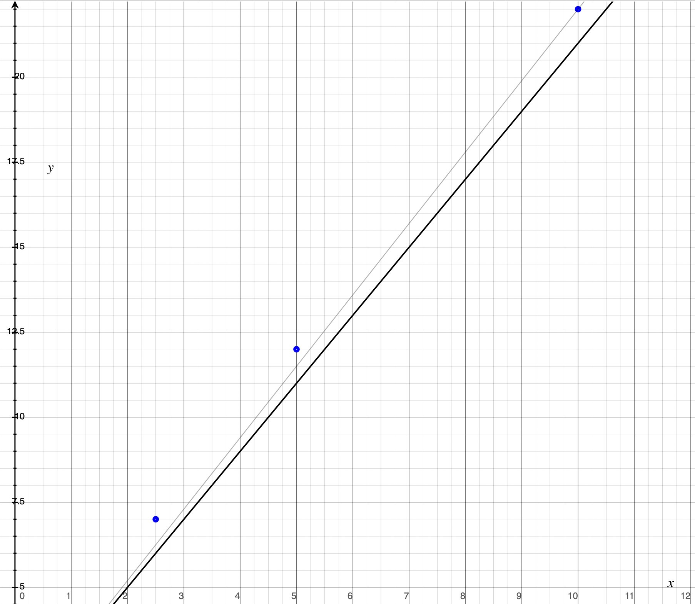

Similarly, the following figure shows how a small change in bias $b$ has the same contribution to the change in the error function, regardless of the value of the feature in each example $x_{ij}$.

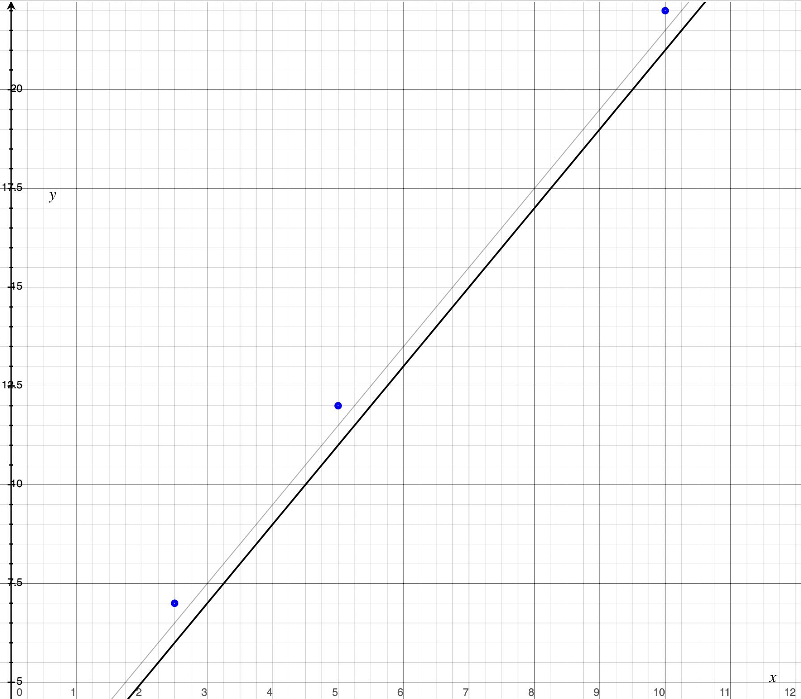

### Implementation

```python
#Function to calculate the cost
def compute_cost(x, y, w, b):
    """
    Computes the cost for the specified values of w and b, considering all the values of x and y
    """
    m = x.shape[0]
    cost = 0

    for i in range(m):
        f_wb = w * x[i] + b
        cost = cost + (f_wb - y[i])**2
    total_cost = 1 / (2 * m) * cost

    return total_cost

def compute_gradient(x, y, w, b):
    """
    Computes the gradient for the specified values of w and b, considering all the values of x and y
    Args:
      x (ndarray (m,)): Data, m examples
      y (ndarray (m,)): target values
      w,b (scalar)    : model parameters
    Returns
      dj_dw (scalar): The gradient of the cost w.r.t. the parameters w
      dj_db (scalar): The gradient of the cost w.r.t. the parameter b
     """

    # Number of training examples
    m = x.shape[0]
    dj_dw = 0
    dj_db = 0

    for i in range(m):
        f_wb = w * x[i] + b
        dj_dw_i = (f_wb - y[i]) * x[i]
        dj_db_i = f_wb - y[i]
        dj_db += dj_db_i
        dj_dw += dj_dw_i
    dj_dw = dj_dw / m
    dj_db = dj_db / m

    return dj_dw, dj_db

def gradient_descent(x, y, w_in, b_in, alpha, num_iters, cost_function, gradient_function):
    """
    Performs gradient descent to fit w,b. Updates w,b by taking
    num_iters gradient steps with learning rate alpha

    Args:
      x (ndarray (m,))  : Data, m examples
      y (ndarray (m,))  : target values
      w_in,b_in (scalar): initial values of model parameters
      alpha (float):     Learning rate
      num_iters (int):   number of iterations to run gradient descent
      cost_function:     function to call to produce cost
      gradient_function: function to call to produce gradient

    Returns:
      w (scalar): Updated value of parameter after running gradient descent
      b (scalar): Updated value of parameter after running gradient descent
      J_history (List): History of cost values
      p_history (list): History of parameters [w,b]
      """

    w = copy.deepcopy(w_in) # avoid modifying global w_in
    # An array to store cost J and w's at each iteration primarily for graphing later
    J_history = []
    p_history = []
    b = b_in
    w = w_in

    for i in range(num_iters):
        # Calculate the gradient and update the parameters using gradient_function
        dj_dw, dj_db = gradient_function(x, y, w , b)

        # Update Parameters using equation (3) above
        b = b - alpha * dj_db
        w = w - alpha * dj_dw

        # Save cost J at each iteration
        J_history.append( cost_function(x, y, w , b))
        p_history.append([w,b])
        # Print cost every at intervals 10 times or as many iterations if < 10
        if i% math.ceil(num_iters/10) == 0:
            print(f"Iteration {i:4}: Cost {J_history[-1]:0.2e}")

    return w, b, J_history, p_history #return w and J,w history for graphing
```

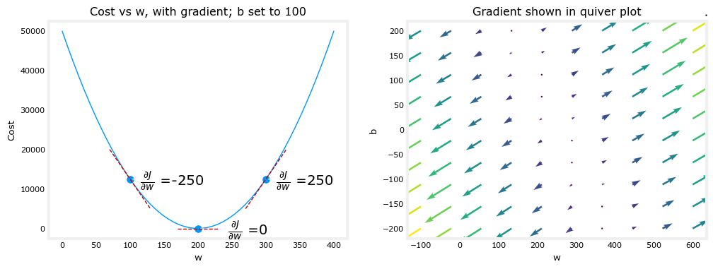

Above, the left plot shows $\frac{\partial J(w,b)}{\partial w}$ or the slope of the cost curve relative to $w$ at three points. On the right side of the plot, the derivative is positive, while on the left it is negative. Due to the 'bowl shape', the derivatives will always lead gradient descent toward the bottom where the gradient is zero. On the right side of the plot, where the slope is positive, the gradient descent process will direct the change in the value of $w$ to the left, since subtracting from $w$ a positive value of the gradient multiplied by a positive constant $α$ will give a new value of $w$ that is *smaller* than the original. This is **how gradient descent *directs* the weights toward the state with the lowest possible cost function value in the neighborhood**.

The 'quiver plot' on the right provides a means of viewing the gradient of both parameters. The arrow sizes reflect the magnitude of the gradient at that point. The direction and slope of the arrow reflects the ratio of $\frac{\partial J(w,b)}{\partial w}$ and $\frac{\partial J(w,b)}{\partial b}$ at that point.
Note that the gradient points *away* from the minimum. The scaled gradient is *subtracted* from the current value of $w$ or $b$. This moves the parameter in a direction that will reduce cost.

Notice that the above graphs would vary slightly for a different set of x and y values.

## Multiple linear regression
### Intuition

Let's think a bit about how you might interpret these parameters: if the model is trying to predict the price of the house in thousands of dollars you can think of this $b$ equals 80 as saying that the **base price** of a house starts off at maybe eighty thousand dollars assuming has no size no bedrooms no floor and no age and you can think of this **0.1** as saying that maybe **for every additional square foot the price will increase by 0.1 thousand dollars** or by a hundred dollars because we're saying that for each square foot the price increases by 0.1 you know times a thousand dollars which is a hundred dollars and maybe **for each additional bathroom the price increases by four thousand dollars and for each additional four the price may increase by ten thousand dollars and for each additional year of the houses age the price may decrease by two thousand dollars** because the parameter is negative two.

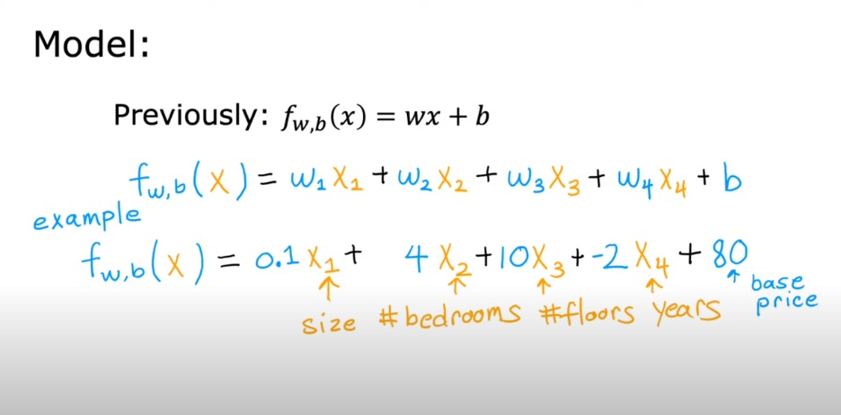


### Matrix X containing our examples
Each row of the matrix represents one example. When you have $m$ training examples, and there are $n$ features, $\mathbf{X}$ is a matrix with dimensions ($m$, $n$) (m rows, n columns).


$$ \mathbf{X} =
\begin{pmatrix}
 x^{(0)}_0 & x^{(0)}_1 & \cdots & x^{(0)}_{n-1} \\
 x^{(1)}_0 & x^{(1)}_1 & \cdots & x^{(1)}_{n-1} \\
 \cdots \\
 x^{(m-1)}_0 & x^{(m-1)}_1 & \cdots & x^{(m-1)}_{n-1}
\end{pmatrix}
$$
notation:
- $\mathbf{x}^{(i)}$ is vector containing example i. $\mathbf{x}^{(i)}$ $ = (x^{(i)}_0, x^{(i)}_1, \cdots,x^{(i)}_{n-1})$
- $x^{(i)}_j$ is element j in example i. The superscript in parenthesis indicates the example number while the subscript represents an element.

### Parameter vector w, b
* $\mathbf{w}$ is a vector with $n$ elements.
  - Each element contains the parameter associated with one feature.

$$ \mathbf{w} = \begin{pmatrix}
w_0 \\
w_1 \\
\cdots\\
w_{n-1}
\end{pmatrix}
$$
* $b$ is a scalar parameter.

### Model Prediction With Multiple Variables
The model's prediction with multiple variables is given by the linear model:

$$ f_{\mathbf{w},b}(\mathbf{x}) =  w_0x_0 + w_1x_1 +... + w_{n-1}x_{n-1} + b  $$
or in vector notation:
$$ f_{\mathbf{w},b}(\mathbf{x}) = \mathbf{w} \cdot \mathbf{x} + b  $$
where $\cdot$ is a vector `dot product`

```python
def predict(x, w, b):
    """
    single predict using linear regression
    Args:
      x (ndarray): Shape (n,) example with multiple features
      w (ndarray): Shape (n,) model parameters
      b (scalar):             model parameter

    Returns:
      p (scalar):  prediction
    """
    p = np.dot(x, w) + b
    return p
```

### Compute Cost With Multiple Variables
The equation for the cost function with multiple variables $J(\mathbf{w},b)$ is:
$$ J(\mathbf{w},b) = \frac{1}{2m} \sum\limits_{i = 0}^{m-1} (f_{\mathbf{w},b}(\mathbf{x}^{(i)}) - y^{(i)})^2 $$
where:
$$ f_{\mathbf{w},b}(\mathbf{x}^{(i)}) = \mathbf{w} \cdot \mathbf{x}^{(i)} + b $$


In contrast to the simple case of regression, $\mathbf{w}$ and $\mathbf{x}^{(i)}$ are vectors rather than scalars supporting multiple features.

```python
def compute_cost(X, y, w, b):
    """
    compute cost
    Args:
      X (ndarray (m,n)): Data, m examples with n features
      y (ndarray (m,)) : target values
      w (ndarray (n,)) : model parameters
      b (scalar)       : model parameter

    Returns:
      cost (scalar): cost
    """
    m = X.shape[0]
    cost = 0.0
    for i in range(m):
        f_wb_i = np.dot(X[i], w) + b           #(n,)(n,) = scalar (see np.dot)
        cost = cost + (f_wb_i - y[i])**2       #scalar
    cost = cost / (2 * m)                      #scalar
    return cost
```

### Gradient Descent With Multiple Variables
Gradient descent for multiple variables:

$$ \begin{align*} \text{repeat}&\text{ until convergence:} \; \lbrace \newline\;
& w_j = w_j -  \alpha \frac{\partial J(\mathbf{w},b)}{\partial w_j}  \; & \text{for j = 0..n-1}\newline
&b\ \ = b -  \alpha \frac{\partial J(\mathbf{w},b)}{\partial b}  \newline \rbrace
\end{align*} $$

where, n is the number of features, parameters $w_j$,  $b$, are updated simultaneously and where

$$
\begin{align}
\frac{\partial J(\mathbf{w},b)}{\partial w_j}  &= \frac{1}{m} \sum\limits_{i = 0}^{m-1} (f_{\mathbf{w},b}(\mathbf{x}^{(i)}) - y^{(i)})x_{j}^{(i)} \\
\frac{\partial J(\mathbf{w},b)}{\partial b}  &= \frac{1}{m} \sum\limits_{i = 0}^{m-1} (f_{\mathbf{w},b}(\mathbf{x}^{(i)}) - y^{(i)})
\end{align}
$$
* m is the number of training examples in the data set


*  $f_{\mathbf{w},b}(\mathbf{x}^{(i)})$ is the model's prediction, while $y^{(i)}$ is the target value

#### Compute Gradient with Multiple Variables
An implementation for calculating the equations (6) and (7) is below. There are many ways to implement this. In this version, there is an
- outer loop over all m examples.
    - $\frac{\partial J(\mathbf{w},b)}{\partial b}$ for the example can be computed directly and accumulated
    - in a second loop over all n features:
        - $\frac{\partial J(\mathbf{w},b)}{\partial w_j}$ is computed for each $w_j$.

```python
def compute_gradient(X, y, w, b):
    """
    Computes the gradient for multiple linear regression
    Args:
      X (ndarray (m,n)): Data, m examples with n features
      y (ndarray (m,)) : target values
      w (ndarray (n,)) : model parameters
      b (scalar)       : model parameter

    Returns:
      dj_dw (ndarray (n,)): The gradient of the cost w.r.t. the parameters w.
      dj_db (scalar):       The gradient of the cost w.r.t. the parameter b.
    """
    m,n = X.shape           #(number of examples, number of features)
    dj_dw = np.zeros((n,))
    dj_db = 0.

    for i in range(m):  # for all the examples
        err = (np.dot(X[i], w) + b) - y[i]
        for j in range(n):  # for all the features
            dj_dw[j] = dj_dw[j] + err * X[i, j]
        dj_db = dj_db + err
    dj_dw = dj_dw / m
    dj_db = dj_db / m

    return dj_db, dj_dw
```

```python
def gradient_descent(X, y, w_in, b_in, cost_function, gradient_function, alpha, num_iters):
    """
    Performs batch gradient descent to learn theta. Updates theta by taking
    num_iters gradient steps with learning rate alpha

    Args:
      X (ndarray (m,n))   : Data, m examples with n features
      y (ndarray (m,))    : target values
      w_in (ndarray (n,)) : initial model parameters
      b_in (scalar)       : initial model parameter
      cost_function       : function to compute cost
      gradient_function   : function to compute the gradient
      alpha (float)       : Learning rate
      num_iters (int)     : number of iterations to run gradient descent

    Returns:
      w (ndarray (n,)) : Updated values of parameters
      b (scalar)       : Updated value of parameter
      """

    # An array to store cost J and w's at each iteration primarily for graphing later
    J_history = []
    w = copy.deepcopy(w_in)  #avoid modifying global w within function
    b = b_in

    for i in range(num_iters):

        # Calculate the gradient and update the parameters
        dj_db,dj_dw = gradient_function(X, y, w, b)   ##None

        # Update Parameters using w, b, alpha and gradient
        w = w - alpha * dj_dw               ##None
        b = b - alpha * dj_db               ##None

        # Save cost J at each iteration
        if i<100000:      # prevent resource exhaustion
            J_history.append( cost_function(X, y, w, b))

        # Print cost every at intervals 10 times or as many iterations if < 10
        if i% math.ceil(num_iters / 10) == 0:
            print(f"Iteration {i:4d}: Cost {J_history[-1]:8.2f}   ")

    return w, b, J_history #return final w,b and J history for graphing
```


## Feature scaling

### Using a dataset with features with different scales

Dataset:
| Size (sqft) | Number of Bedrooms  | Number of floors | Age of  Home | Price (1000s dollars)  |
| ----------------| ------------------- |----------------- |--------------|----------------------- |
| 952             | 2                   | 1                | 65           | 271.5                  |
| 1244            | 3                   | 2                | 64           | 232                    |
| 1947            | 3                   | 2                | 17           | 509.8                  |
| ...             | ...                 | ...              | ...          | ...                    |

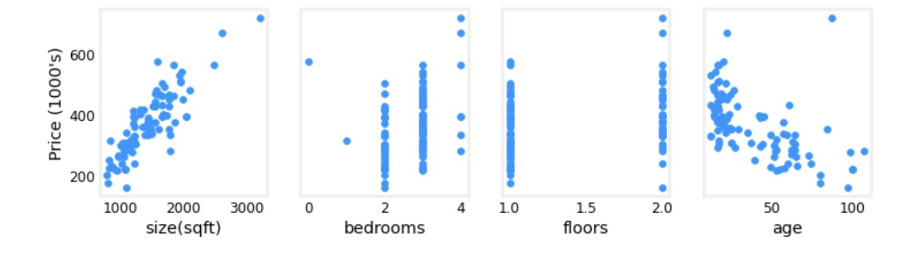

Increasing size also increases price. Bedrooms and floors don't seem to have a strong impact on price. Newer houses have higher prices than older houses.

Let's run gradient descent and try a few settings of $\alpha$ on our data set

#### $\alpha$ = 9.9e-7
```bash
Iteration Cost          w0       w1       w2       w3       b       djdw0    djdw1    djdw2    djdw3    djdb
---------|-----------|--------|--------|--------|--------|--------|--------|--------|--------|--------|--------|
        0 9.55884e+04  5.5e-01  1.0e-03  5.1e-04  1.2e-02  3.6e-04 -5.5e+05 -1.0e+03 -5.2e+02 -1.2e+04 -3.6e+02
        1 1.28213e+05 -8.8e-02 -1.7e-04 -1.0e-04 -3.4e-03 -4.8e-05  6.4e+05  1.2e+03  6.2e+02  1.6e+04  4.1e+02
        2 1.72159e+05  6.5e-01  1.2e-03  5.9e-04  1.3e-02  4.3e-04 -7.4e+05 -1.4e+03 -7.0e+02 -1.7e+04 -4.9e+02
        3 2.31358e+05 -2.1e-01 -4.0e-04 -2.3e-04 -7.5e-03 -1.2e-04  8.6e+05  1.6e+03  8.3e+02  2.1e+04  5.6e+02
        4 3.11100e+05  7.9e-01  1.4e-03  7.1e-04  1.5e-02  5.3e-04 -1.0e+06 -1.8e+03 -9.5e+02 -2.3e+04 -6.6e+02
        5 4.18517e+05 -3.7e-01 -7.1e-04 -4.0e-04 -1.3e-02 -2.1e-04  1.2e+06  2.1e+03  1.1e+03  2.8e+04  7.5e+02
        6 5.63212e+05  9.7e-01  1.7e-03  8.7e-04  1.8e-02  6.6e-04 -1.3e+06 -2.5e+03 -1.3e+03 -3.1e+04 -8.8e+02
        7 7.58122e+05 -5.8e-01 -1.1e-03 -6.2e-04 -1.9e-02 -3.4e-04  1.6e+06  2.9e+03  1.5e+03  3.8e+04  1.0e+03
        8 1.02068e+06  1.2e+00  2.2e-03  1.1e-03  2.3e-02  8.3e-04 -1.8e+06 -3.3e+03 -1.7e+03 -4.2e+04 -1.2e+03
        9 1.37435e+06 -8.7e-01 -1.7e-03 -9.1e-04 -2.7e-02 -5.2e-04  2.1e+06  3.9e+03  2.0e+03  5.1e+04  1.4e+03


w,b found by gradient descent: w: [-0.87 -0.   -0.   -0.03], b: -0.00
```

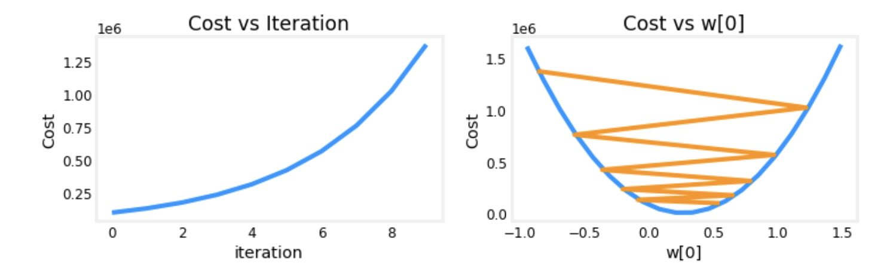

It appears the learning rate is too high.  The solution does not converge. Cost is *increasing* rather than decreasing.
The plot on the right shows the value of one of the parameters, $w_0$. At each iteration, it is overshooting the optimal value and as a result, cost ends up *increasing* rather than approaching the minimum.

#### $\alpha$ = 9e-7
Let's try a bit smaller value and see what happens.

```bash
Iteration Cost          w0       w1       w2       w3       b       djdw0    djdw1    djdw2    djdw3    djdb
---------------------|--------|--------|--------|--------|--------|--------|--------|--------|--------|--------|
        0 6.64616e+04  5.0e-01  9.1e-04  4.7e-04  1.1e-02  3.3e-04 -5.5e+05 -1.0e+03 -5.2e+02 -1.2e+04 -3.6e+02
        1 6.18990e+04  1.8e-02  2.1e-05  2.0e-06 -7.9e-04  1.9e-05  5.3e+05  9.8e+02  5.2e+02  1.3e+04  3.4e+02
        2 5.76572e+04  4.8e-01  8.6e-04  4.4e-04  9.5e-03  3.2e-04 -5.1e+05 -9.3e+02 -4.8e+02 -1.1e+04 -3.4e+02
        3 5.37137e+04  3.4e-02  3.9e-05  2.8e-06 -1.6e-03  3.8e-05  4.9e+05  9.1e+02  4.8e+02  1.2e+04  3.2e+02
        4 5.00474e+04  4.6e-01  8.2e-04  4.1e-04  8.0e-03  3.2e-04 -4.8e+05 -8.7e+02 -4.5e+02 -1.1e+04 -3.1e+02
        5 4.66388e+04  5.0e-02  5.6e-05  2.5e-06 -2.4e-03  5.6e-05  4.6e+05  8.5e+02  4.5e+02  1.2e+04  2.9e+02
        6 4.34700e+04  4.5e-01  7.8e-04  3.8e-04  6.4e-03  3.2e-04 -4.4e+05 -8.1e+02 -4.2e+02 -9.8e+03 -2.9e+02
        7 4.05239e+04  6.4e-02  7.0e-05  1.2e-06 -3.3e-03  7.3e-05  4.3e+05  7.9e+02  4.2e+02  1.1e+04  2.7e+02
        8 3.77849e+04  4.4e-01  7.5e-04  3.5e-04  4.9e-03  3.2e-04 -4.1e+05 -7.5e+02 -3.9e+02 -9.1e+03 -2.7e+02
        9 3.52385e+04  7.7e-02  8.3e-05 -1.1e-06 -4.2e-03  8.9e-05  4.0e+05  7.4e+02  3.9e+02  1.0e+04  2.5e+02


w,b found by gradient descent: w: [ 7.74e-02  8.27e-05 -1.06e-06 -4.20e-03], b: 0.00
```

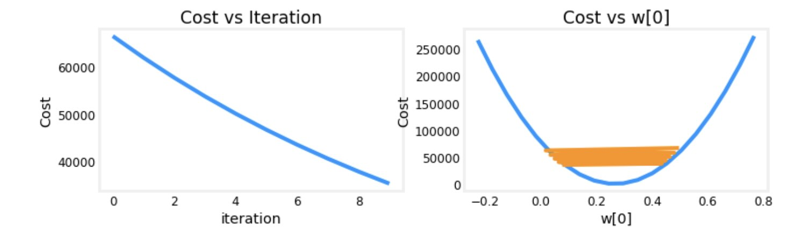

On the left, you see that cost is decreasing as it should. On the right, you can see that $w_0$ is still oscillating around the minimum, but it is decreasing each iteration rather than increasing. Note above that `dj_dw0` changes sign with each iteration as `w0` jumps over the optimal value.

Note that `dj_dw0` is significantly larger than `dj_dw1-3` and `dj_dwb`. Its clear that $w_0$ is making more rapid progress than the other parameters **due to its much larger gradient**.

The graphic below shows the result of a very long run with $\alpha$ = 9e-7. This takes several hours.


Above, you can see cost decreased slowly after its initial reduction. Notice the difference between `w0` and `w1`,`w2`,`w3` as well as  `dj_dw0` and `dj_dw1-3`. `w0` reaches its near final value very quickly and `dj_dw0` has quickly decreased to a small value showing that `w0` is near the final value. The other parameters were reduced much more slowly.


The figure above shows why $w$'s are updated unevenly.
- $\alpha$ is shared by all parameter updates ($w$'s and $b$).
- the common **error term is multiplied by the features** for the $w$'s. (not $b$).
- the features vary significantly in magnitude **making some features update much faster than others**. In this case, $w_0$ is multiplied by 'size(sqft)', which is generally > 1000,  while $w_1$ is multiplied by 'number of bedrooms', which is generally 2-4.

The solution is Feature Scaling.

#### $\alpha$ = 1e-7
Let's try a bit smaller value for $\alpha$ and see what happens.

```bash
Iteration Cost          w0       w1       w2       w3       b       djdw0    djdw1    djdw2    djdw3    djdb
---------------------|--------|--------|--------|--------|--------|--------|--------|--------|--------|--------|
        0 4.42313e+04  5.5e-02  1.0e-04  5.2e-05  1.2e-03  3.6e-05 -5.5e+05 -1.0e+03 -5.2e+02 -1.2e+04 -3.6e+02
        1 2.76461e+04  9.8e-02  1.8e-04  9.2e-05  2.2e-03  6.5e-05 -4.3e+05 -7.9e+02 -4.0e+02 -9.5e+03 -2.8e+02
        2 1.75102e+04  1.3e-01  2.4e-04  1.2e-04  2.9e-03  8.7e-05 -3.4e+05 -6.1e+02 -3.1e+02 -7.3e+03 -2.2e+02
        3 1.13157e+04  1.6e-01  2.9e-04  1.5e-04  3.5e-03  1.0e-04 -2.6e+05 -4.8e+02 -2.4e+02 -5.6e+03 -1.8e+02
        4 7.53002e+03  1.8e-01  3.3e-04  1.7e-04  3.9e-03  1.2e-04 -2.1e+05 -3.7e+02 -1.9e+02 -4.2e+03 -1.4e+02
        5 5.21639e+03  2.0e-01  3.5e-04  1.8e-04  4.2e-03  1.3e-04 -1.6e+05 -2.9e+02 -1.5e+02 -3.1e+03 -1.1e+02
        6 3.80242e+03  2.1e-01  3.8e-04  1.9e-04  4.5e-03  1.4e-04 -1.3e+05 -2.2e+02 -1.1e+02 -2.3e+03 -8.6e+01
        7 2.93826e+03  2.2e-01  3.9e-04  2.0e-04  4.6e-03  1.4e-04 -9.8e+04 -1.7e+02 -8.6e+01 -1.7e+03 -6.8e+01
        8 2.41013e+03  2.3e-01  4.1e-04  2.1e-04  4.7e-03  1.5e-04 -7.7e+04 -1.3e+02 -6.5e+01 -1.2e+03 -5.4e+01
        9 2.08734e+03  2.3e-01  4.2e-04  2.1e-04  4.8e-03  1.5e-04 -6.0e+04 -1.0e+02 -4.9e+01 -7.5e+02 -4.3e+01


w,b found by gradient descent: w: [2.31e-01 4.18e-04 2.12e-04 4.81e-03], b: 0.00
```

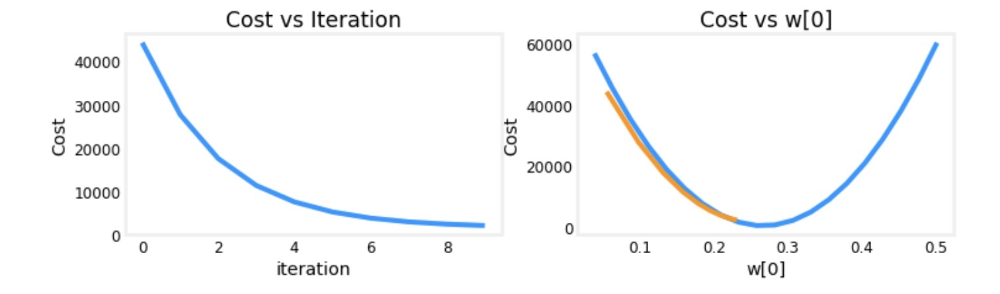

On the left, you see that cost is decreasing as it should. On the right you can see that $w_0$ is decreasing without crossing the minimum. Note above that `dj_w0` is negative throughout the run. This solution will also converge, though not quite as quickly as the previous example.

### Using a dataset with features with the same scales using z-score normalization

After z-score normalization, all features will have a mean of 0 and a standard deviation of 1.

To implement z-score normalization, adjust your input values as shown in this formula:

$$
x^{(i)}_j = \dfrac{x^{(i)}_j - \mu_j}{\sigma_j}
$$
where $j$ selects a feature or a column in the $\mathbf{X}$ matrix. $µ_j$ is the mean of all the values for feature (j) and $\sigma_j$ is the standard deviation of feature (j).
$$
\begin{align}
\mu_j &= \frac{1}{m} \sum_{i=0}^{m-1} x^{(i)}_j \\
\sigma^2_j &= \frac{1}{m} \sum_{i=0}^{m-1} (x^{(i)}_j - \mu_j)^2
\end{align}
$$


>**Implementation Note:** it is important to store the values used for normalization. Given a new x value, we must first normalize x using the mean and standard deviation that we had previously computed from the training set.

```python
def zscore_normalize_features(X):
    """
    Args:
      X (ndarray (m,n))     : input data, m examples, n features
    """
    # find the mean of each column/feature
    mu     = np.mean(X, axis=0)                 # mu will have shape (n,)
    # find the standard deviation of each column/feature
    sigma  = np.std(X, axis=0)                  # sigma will have shape (n,)
    # element-wise, subtract mu for that column from each example, divide by std for that column
    X_norm = (X - mu) / sigma

    return (X_norm, mu, sigma)
```

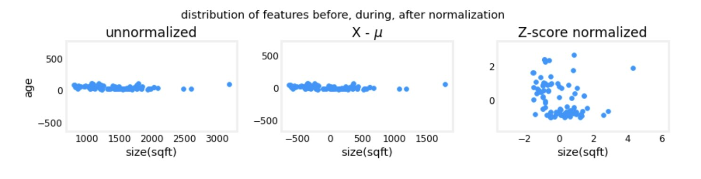

The plot above shows the relationship between two of the training set parameters.

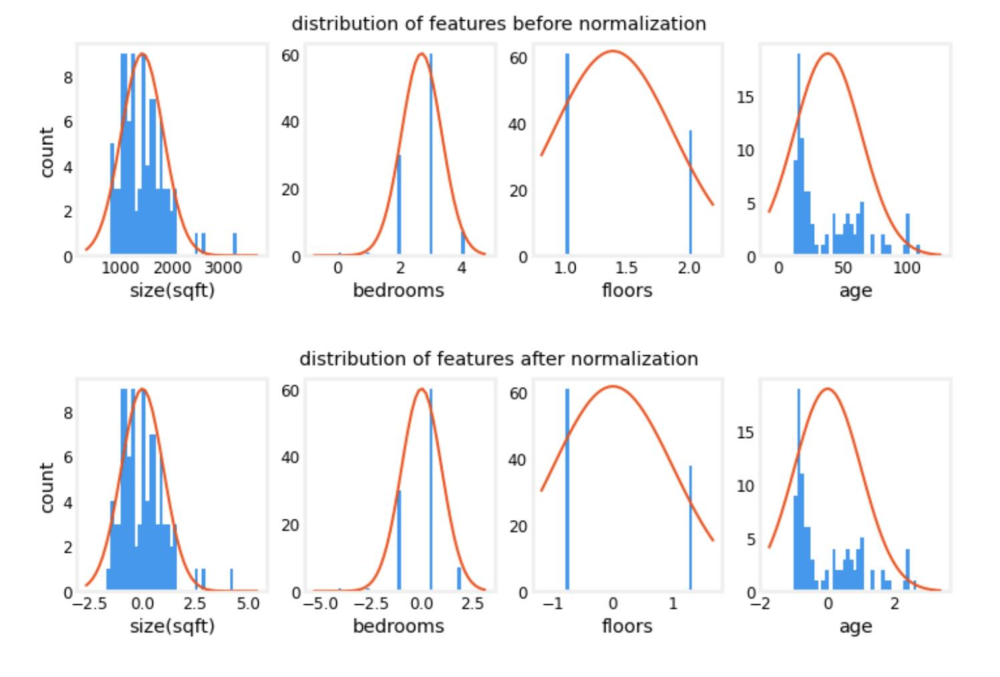

Notice, above, the range of the normalized data (x-axis) is centered around zero and roughly +/- 2. Most importantly, the range is similar for each feature.

Let's re-run our gradient descent algorithm with normalized data. Note the **vastly larger value of alpha**. This will speed up gradient descent.

```bash
Iteration Cost          w0       w1       w2       w3       b       djdw0    djdw1    djdw2    djdw3    djdb
---------------------|--------|--------|--------|--------|--------|--------|--------|--------|--------|--------|
        0 5.76170e+04  8.9e+00  3.0e+00  3.3e+00 -6.0e+00  3.6e+01 -8.9e+01 -3.0e+01 -3.3e+01  6.0e+01 -3.6e+02
      100 2.21086e+02  1.1e+02 -2.0e+01 -3.1e+01 -3.8e+01  3.6e+02 -9.2e-01  4.5e-01  5.3e-01 -1.7e-01 -9.6e-03
      200 2.19209e+02  1.1e+02 -2.1e+01 -3.3e+01 -3.8e+01  3.6e+02 -3.0e-02  1.5e-02  1.7e-02 -6.0e-03 -2.6e-07
      300 2.19207e+02  1.1e+02 -2.1e+01 -3.3e+01 -3.8e+01  3.6e+02 -1.0e-03  5.1e-04  5.7e-04 -2.0e-04 -6.9e-12
      400 2.19207e+02  1.1e+02 -2.1e+01 -3.3e+01 -3.8e+01  3.6e+02 -3.4e-05  1.7e-05  1.9e-05 -6.6e-06 -2.7e-13
      500 2.19207e+02  1.1e+02 -2.1e+01 -3.3e+01 -3.8e+01  3.6e+02 -1.1e-06  5.6e-07  6.2e-07 -2.2e-07 -2.7e-13
      600 2.19207e+02  1.1e+02 -2.1e+01 -3.3e+01 -3.8e+01  3.6e+02 -3.7e-08  1.9e-08  2.1e-08 -7.3e-09 -2.6e-13
      700 2.19207e+02  1.1e+02 -2.1e+01 -3.3e+01 -3.8e+01  3.6e+02 -1.2e-09  6.2e-10  6.9e-10 -2.4e-10 -2.6e-13
      800 2.19207e+02  1.1e+02 -2.1e+01 -3.3e+01 -3.8e+01  3.6e+02 -4.1e-11  2.1e-11  2.3e-11 -8.1e-12 -2.6e-13
      900 2.19207e+02  1.1e+02 -2.1e+01 -3.3e+01 -3.8e+01  3.6e+02 -1.4e-12  6.9e-13  7.7e-13 -2.7e-13 -2.6e-13


w,b found by gradient descent: w: [110.56 -21.27 -32.71 -37.97], b: 363.16
```

The scaled features get very accurate results **much, much faster!**. Notice the gradient of each parameter is tiny by the end of this fairly short run. A learning rate of 0.1 is a good start for regression with normalized features.
Let's plot our predictions versus the target values. Note, the prediction is made using the normalized feature while the plot is shown using the original feature values.

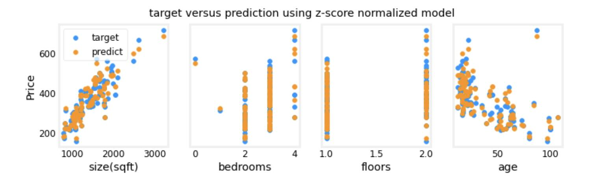

Another way to view feature scaling is in terms of the cost contours. When feature scales do not match, the plot of cost versus parameters in a contour plot is asymmetric.


In the plot below, the scale of the parameters is matched. The left plot is the cost contour plot of w[0], the square feet versus w[1], the number of bedrooms before normalizing the features. The plot is so asymmetric, the curves completing the contours are not visible. In contrast, when the features are normalized, the cost contour is much more symmetric. The result is that **updates to parameters during gradient descent can make equal progress for each parameter**.

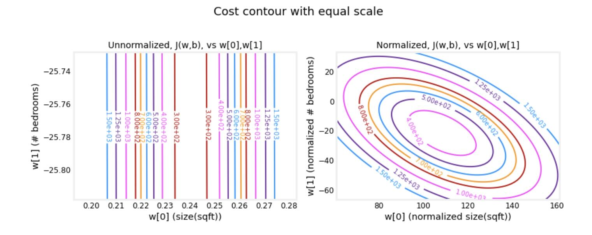

## Feature Engineering and Polynomial Regression

### Polynomial Features

What if your features/data are non-linear or are combinations of features?

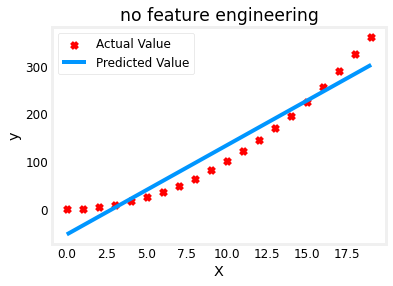

No amount of adjusting of $\mathbf{w}$,$\mathbf{b}$ in linear regression will achieve a fit to a non-linear curve.
What is needed is something like $y= w_0x_0^2 + b$, or a **polynomial feature**.
To accomplish this, you can modify the *input data* to *engineer* the needed features. If you swap the original data with a version that squares the $x$ value, then you can achieve $y= w_0x_0^2 + b$. Let's try it. Swap `X` for `X**2` below:
```python
# create target data
x = np.arange(0, 20, 1)
y = 1 + x**2

# Engineer features
X = x**2      #<-- added engineered feature

X = X.reshape(-1, 1)  #X should be a 2-D Matrix
model_w, model_b = run_gradient_descent_feng(X, y, iterations=10000, alpha = 1e-5)
```

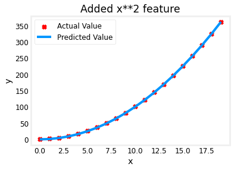

Great! near perfect fit. Notice the values of $\mathbf{w}$ and b printed right above the graph: `w,b found by gradient descent: w: [1.], b: 0.0490`. Gradient descent modified our initial values of $\mathbf{w},b $ to be (1.0,0.049) or a model of $y=1*x_0^2+0.049$, very close to our target of $y=1*x_0^2+1$. If you ran it longer, it could be a better match.

#### Selecting Features
Above, we knew that an $x^2$ term was required. It may not always be obvious which features are required. One could add a variety of potential features to try and find the most useful. For example, what if we had instead tried : $y=w_0x_0 + w_1x_1^2 + w_2x_2^3+b$ ?

```python
# create target data
x = np.arange(0, 20, 1)
y = x**2

# engineer features .
X = np.c_[x, x**2, x**3]   #<-- added engineered feature

model_w,model_b = run_gradient_descent_feng(X, y, iterations=10000, alpha=1e-7)
```

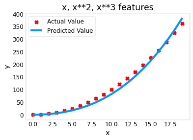

Note the value of $\mathbf{w}$, `[0.08 0.54 0.03]` and b is `0.0106`.This implies the model after fitting/training is:
$$ 0.08x + 0.54x^2 + 0.03x^3 + 0.0106 $$
Gradient descent has **emphasized the data that is the best fit** to the $x^2$ data by increasing the $w_1$ term relative to the others.  If you were to run for a very long time, it would continue to reduce the impact of the other terms.
>Gradient descent is picking the 'correct' features for us by emphasizing its associated parameter

Let's review this idea:
- Initially, the features were re-scaled so they are comparable to each other
- less weight value implies less important/correct feature.
- above, after fitting, the weight associated with the $x^2$ feature is much larger than the weights for $x$ or $x^3$ as it **is the most useful in fitting the data**.

#### An Alternate View
Another way to think about this is to note that we are still using linear regression once we have created new features. Given that, the best features will be linear relative to the target. This is best understood with an example.
```python
x = np.arange(0, 20, 1)
y = x**2
# engineer features .
X = np.c_[x, x**2, x**3]   #<-- added engineered feature

fig,ax=plt.subplots(1, 3, figsize=(12, 3), sharey=True)
for i in range(len(ax)):
    ax[i].scatter(X[:,i],y)
```

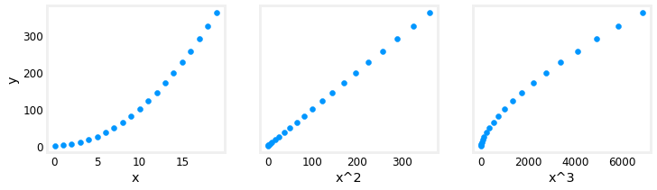

Above, it is clear that the $x^2$ feature mapped against the target value $y$ is linear. Linear regression can then easily generate a model using that feature.

#### Scaling features
In the example above, there is $x$, $x^2$ and $x^3$ which will naturally have very different scales. Let's apply Z-score normalization to our example.
```python
x = np.arange(0,20,1)
y = x**2

X = np.c_[x, x**2, x**3]
X = zscore_normalize_features(X)

model_w, model_b = run_gradient_descent_feng(X, y, iterations=100000, alpha=1e-1)

plt.scatter(x, y, marker='x', c='r', label="Actual Value"); plt.title("Normalized x x**2, x**3 feature")
plt.plot(x,X@model_w + model_b, label="Predicted Value"); plt.xlabel("x"); plt.ylabel("y"); plt.legend(); plt.show()```
```
```bash
Iteration         0, Cost: 9.42147e+03
Iteration     10000, Cost: 3.90938e-01
Iteration     20000, Cost: 2.78389e-02
Iteration     30000, Cost: 1.98242e-03
Iteration     40000, Cost: 1.41169e-04
Iteration     50000, Cost: 1.00527e-05
Iteration     60000, Cost: 7.15855e-07
Iteration     70000, Cost: 5.09763e-08
Iteration     80000, Cost: 3.63004e-09
Iteration     90000, Cost: 2.58497e-10

w,b found by gradient descent: w: [5.27e-05 1.13e+02 8.43e-05], b: 123.5000
```

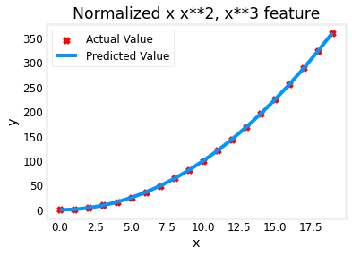

Feature scaling allows this to converge much faster.
Note again the values of $\mathbf{w}$. The $w_1$ term, which is the $x^2$ term is the most emphasized. Gradient descent has all but eliminated the $x^3$ term.

#### Complex Functions
With feature engineering, even quite complex functions can be modeled:
```python
x = np.arange(0,20,1)
y = np.cos(x/2)

X = np.c_[x, x**2, x**3,x**4, x**5, x**6, x**7, x**8, x**9, x**10, x**11, x**12, x**13]
X = zscore_normalize_features(X)

model_w,model_b = run_gradient_descent_feng(X, y, iterations=1000000, alpha = 1e-1)

plt.scatter(x, y, marker='x', c='r', label="Actual Value"); plt.title("Normalized x x**2, x**3 feature")
plt.plot(x,X@model_w + model_b, label="Predicted Value"); plt.xlabel("x"); plt.ylabel("y"); plt.legend(); plt.show()
```
```bash
Iteration         0, Cost: 2.20188e-01
Iteration    100000, Cost: 1.70074e-02
Iteration    200000, Cost: 1.27603e-02
Iteration    300000, Cost: 9.73032e-03
Iteration    400000, Cost: 7.56440e-03
Iteration    500000, Cost: 6.01412e-03
Iteration    600000, Cost: 4.90251e-03
Iteration    700000, Cost: 4.10351e-03
Iteration    800000, Cost: 3.52730e-03
Iteration    900000, Cost: 3.10989e-03

w,b found by gradient descent: w: [ -1.34 -10.    24.78   5.96 -12.49 -16.26  -9.51   0.59   8.7   11.94   9.27   0.79 -12.82], b: -0.0073
```

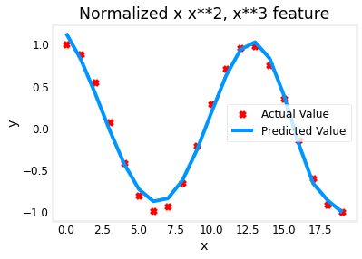

## Regularization
Is a way to more gently **reduce the impacts of some of the features** without doing something as harsh as eliminating it outright what regularization does is **encourage the learning algorithm to shrink the values of the parameters without necessarily demanding that the parameter is set to exactly zero** and it turns out that even if you fit a higher order polinomial like this so long as you can get the algorith to use smaller parameter values W1 W2 W3 W4 you end up with a curve that ends up fitting the training data much better so **what regularization does is it lets you keep all of your features but it just prevents the features from having a overly large effect which is what sometimes can cause overfitting**

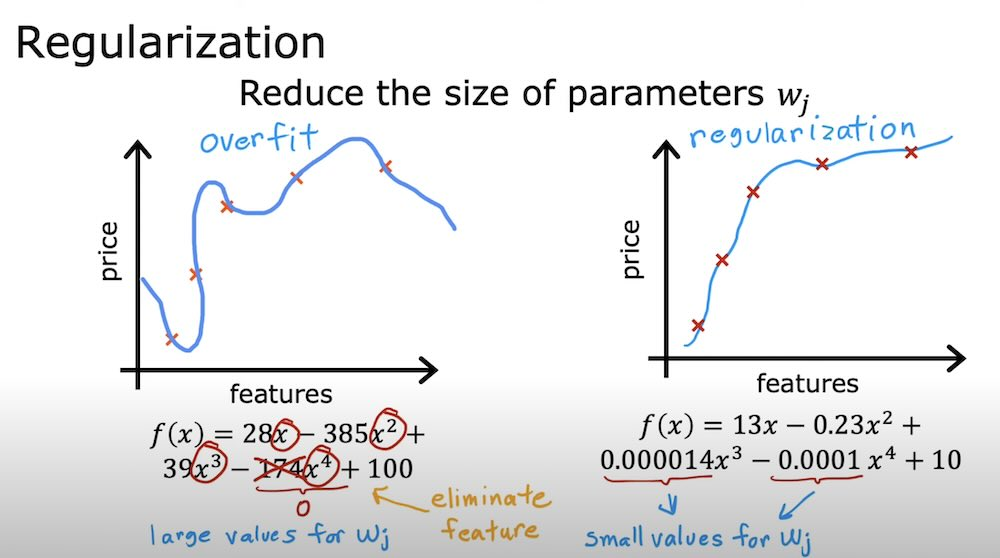


# Classification

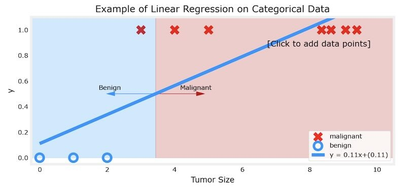

The example above demonstrates that the **linear model is insufficient to model categorical data**.

## Sigmoid or Logistic Function
We would like the predictions of our classification model to be between 0 and 1 since our output variable $y$ is either 0 or 1.

### Formula for Sigmoid function

The formula for a sigmoid function is as follows:

$$ g(z) = \frac{1}{1+e^{-z}} $$

In the case of logistic regression, $z$ (the input to the sigmoid function), is the output of a linear regression model.

The `sigmoid` function is implemented in python as shown in the cell below.
```python
def sigmoid(z):
    """
    Compute the sigmoid of z

    Args:
        z (ndarray): A scalar, numpy array of any size.

    Returns:
        g (ndarray): sigmoid(z), with the same shape as z

    """

    g = 1 / (1 + np.exp(-z))

    return g
```

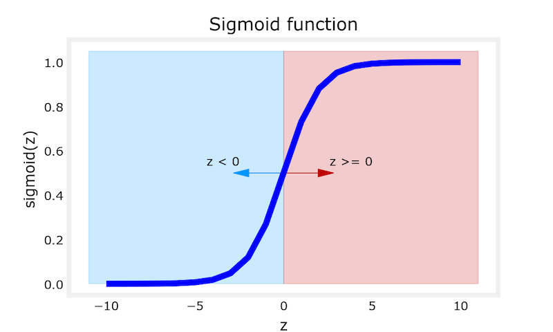

As you can see, the sigmoid function approaches  `0` as `z` goes to large negative values and approaches `1` as `z` goes to large positive values.

### Logistic Regression

A logistic regression model **applies the sigmoid to the familiar linear regression model**:

$$
f_{\mathbf{w},b}(\mathbf{x}^{(i)}) = g(\mathbf{w} \cdot \mathbf{x}^{(i)} + b )
$$

  where

  $$ g(z) = \frac{1}{1+e^{-z}} $$

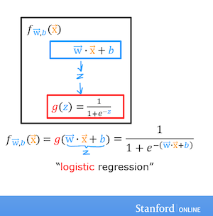

In the figure below, note how the function $z = w \cdot x + b$ (the familiar linear regression) moves and defines the shape of the sigmoid function, which in turn performs the classification of the elements by applying a threshold.

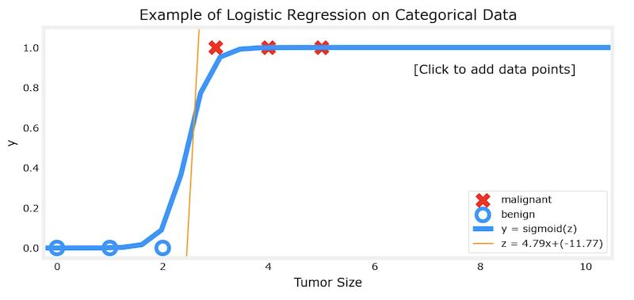

### Decision Boundary

* In eq. (2) we interpret the output of the model ($f_{\mathbf{w},b}(x)$) as the probability that $y=1$ given $\mathbf{x}$ and parameterized by $\mathbf{w}$ and $b$.
* Therefore, to get a final prediction ($y=0$ or $y=1$) from the logistic regression model, we can use the following heuristic:

  if $f_{\mathbf{w},b}(x) >= 0.5$, predict $y=1$

  if $f_{\mathbf{w},b}(x) < 0.5$, predict $y=0$

* For a logistic regression model, $z = \mathbf{w} \cdot \mathbf{x} + b$. Therefore,

  if $\mathbf{w} \cdot \mathbf{x} + b >= 0$, the model predicts $y=1$

  if $\mathbf{w} \cdot \mathbf{x} + b < 0$, the model predicts $y=0$

#### Example
* Let's say that you trained the model and get the parameters as $b = -3, w_0 = 1, w_1 = 1$. That is,

  $f(x) = g(x_0+x_1-3)$

Let's try to understand what this trained model is predicting by plotting its decision boundary.

* Our logistic regression model has the form

  $f(\mathbf{x}) = g(-3 + x_0+x_1)$


* From what you've learnt above, you can see that this model predicts $y=1$ if $-3 + x_0+x_1 >= 0$

Let's see what this looks like graphically. We'll start by plotting $-3 + x_0+x_1 = 0$, which is equivalent to $x_1 = 3 - x_0$.

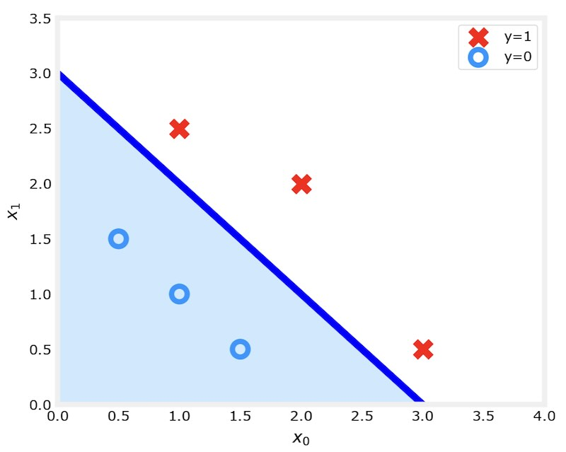

* In the plot above, the blue line represents the line $x_0 + x_1 - 3 = 0$ and it should intersect the x1 axis at 3 (if we set $x_1$ = 3, $x_0$ = 0) and the x0 axis at 3 (if we set $x_1$ = 0, $x_0$ = 3).
* The shaded region represents $-3 + x_0+x_1 < 0$. The region above the line is $-3 + x_0+x_1 > 0$.
* Any point in the shaded region (under the line) is classified as $y=0$.  Any point on or above the line is classified as $y=1$. This line is known as the "decision boundary".
* We can say that, **for every combination of values $x_0$ and $x_1$ which meet the condition given by the equation $-3 + x_0+x_1 < 0$, the result will lie in the shaded region, so they will be classified as $y=0$**.

By using higher order polynomial terms (eg: $f(x) = g( x_0^2 + x_1 -1)$, we can come up with more complex non-linear boundaries.