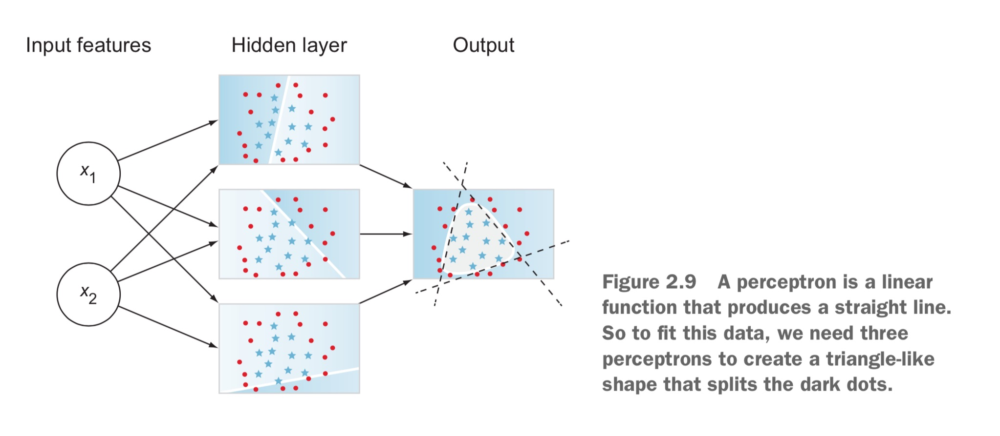
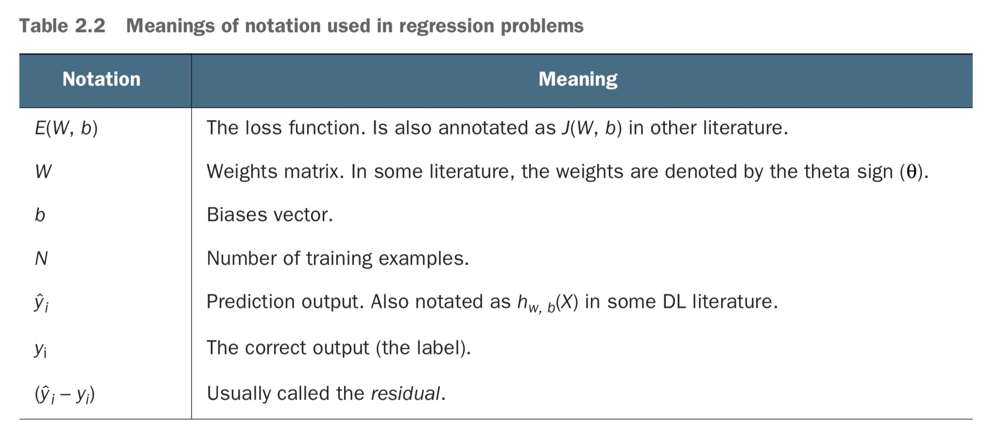
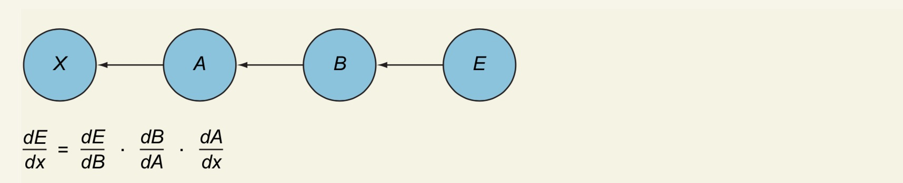
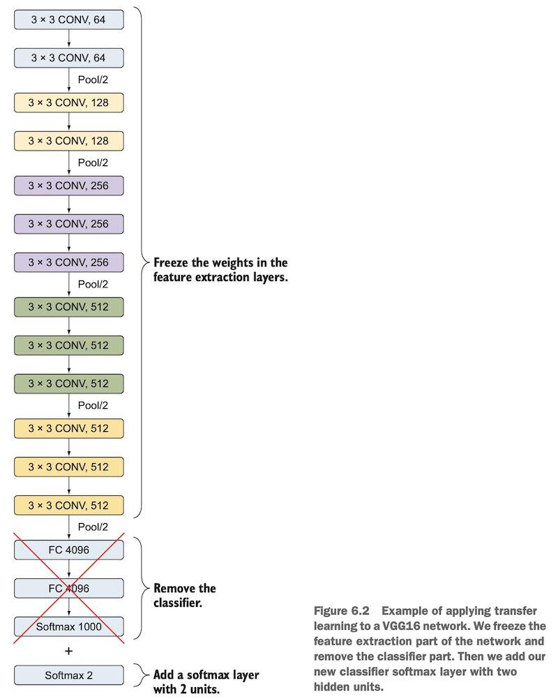
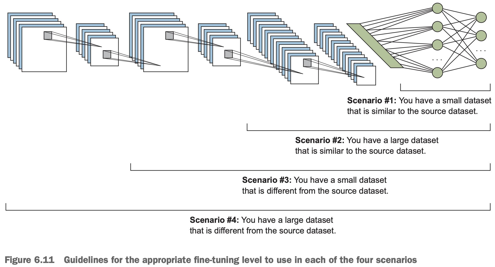

# Welcome to computer vision

## Computer vision pipeline: The big picture

1. A computer receives visual input from an imaging device like a camera.

2. Common preprocessing steps include resizing an image, blurring, rotating, changing its shape, or transforming the image from one color to another, such as from color to grayscale. *Only by standardizing the images—for example, making them the same size—can you then compare them and further analyze them.*
3. We extract **features**,  they are usually **information about object shape or color**. The output of this process is a feature vector that is a list of unique shapes that identify the object.
4. **Classification model**. This step looks at the feature vector from the previous step and predicts the class of the image.

## Image preprocessing
In order to feed a dataset of images to a convolutional network, the images all have to be the same size. **Preprocessing is used to conduct steps that will reduce the complexity and increase the accuracy of the applied algorithm**.

Unlike traditional machine learning, *DL algorithms require minimum data preprocessing* because, as you will see soon, *neural networks do most of the heavy lifting in processing an image and extracting features*.

## Feature extraction
A feature in machine learning is an individual measurable property or characteristic of an observed phenomenon.

### What is a feature in computer vision?
In CV, **a feature is a measurable piece of data** in your image that is unique to that specific object.
In ML projects, we want to transform the raw data (image) into a feature vector to show to our learning algorithm, which can learn the characteristics of the object.


*When the feature extractor sees thousands of images of motorcycles, it recognizes patterns that define wheels in general*


### What makes a good (useful) feature?

Machine learning models are only as good as the features you provide.

In machine learning, we almost always need multiple features, where each feature captures a different type of information.

We then feed the produced features to a classifier like a support vector machine (SVM) or AdaBoost to predict the output.

#### DEEP LEARNING USING AUTOMATICALLY EXTRACTED FEATURES
**The network extracts features automatically and learns their importance on the output by applying weights to its connections.**
**Neural networks can be thought of as feature extractors plus classifiers that are end-to-end trainable**


*How do neural networks distinguish useful features from non-useful features?*
During the training process, the neural network adjusts these weights to reflect their **importance** and how they should impact the output prediction. The **patterns with the highest appearance frequency will have higher weights** and are considered more useful features.

#### WHY USE FEATURES?
By extracting important colors or image segments, we can transform complex and large image data into smaller sets of features. This makes the task of classifying images based on their features simpler and faster.
We lose all the unnecessary data that is not important to identify motorcycles, and we only keep a consolidated list of useful features that can be fed directly to the classifier.


## Classifier learning algorithm
Feed the extracted feature vector to the classifier to output a class label for the images.
CNNs truly shine in processing and classifying images in the most complex problems.
**Neural networks automatically extract useful features from your dataset, and they act as a classifier to output class labels for your images.**
The deeper your network is (the more layers), the more it will learn the features of the dataset.


# Deep learning and neural networks
In deep learning (DL), neural networks act as both the feature extractor and the classifier. A neural network automatically recognizes patterns and extracts features from the image and classifies them into labels.


- The **perceptron**: a neural network that contains only one neuron.
- **Multilayer perceptron** (MLP): where neurons are stacked in hidden layers.

## Understanding perceptrons
Both terms, MLP and ANN, are used interchangeably to describe this neural network architecture.

### What is a perceptron?
The perceptron consists of a single neuron.
The artificial neuron performs two consecutive functions: it calculates the *weighted sum* of the inputs to represent the total strength of the input signals, and it applies a *step function* to the result to determine whether to fire the output 1 if the signal exceeds a certain threshold or 0 if the signal doesn’t exceed the threshold.

Not all input features are equally **useful or important**. To represent that, each input node is assigned a weight value, called its **connection weight, to reflect its importance**.


### Connection weights
Each input feature (x<sub>1</sub>) is assigned its own weight (w<sub>1</sub>) that reflects its importance in the decision-making process. Inputs assigned greater weight have a greater effect on the output. **If the weight is high, it amplifies the input signal; and if the weight is low, it diminishes the input signal**.

- *Neuron functions*: The calculations performed within the neuron to modulate the input signals: the weighted sum and step activation function.
- *Output*: Controlled by the type of activation function. For a step function, the output is either 0 or 1. Other activation functions produce probability output or float numbers.


### WEIGHTED SUM FUNCTION
**Linear combination**: the weighted sum function is the sum of all inputs multiplied by their weights, and then added to a bias term.


### STEP ACTIVATION FUNCTION
**Activation function**: this is the decision-making unit of the brain. In ANNs, the activation function takes the same weighted sum input from before (z = Σxi · wi + b) and activates (fires) the neuron if the weighted sum is higher than a certain threshold.


### How does the perceptron learn?
The perceptron uses trial and error to learn from its mistakes.


The perceptron’s learning logic goes like this:
1. The **feedforward process**:

2. It **compares** the output prediction with the correct label to calculate the error:

3. It then **updates the weight**. If the prediction is too high, it adjusts the weight to make a lower prediction the next time, and vice versa.
4. Repeat.

The neuron continues to update the weights to improve its predictions until step 2 produces a very small error (close to zero), which means the neuron’s prediction is very close to the correct value.

### Is one neuron enough to solve complex problems?


The single perceptron works fine because our data was linearly separable.

the more neurons we add, the better the network will fit our training data. In fact, if we add too many neurons, this will make the network overfit the training data (not good).
**The more complex our network is, the better it learns the features of our data.**

## Multilayer perceptrons

### Linear vs. nonlinear problems



### Multilayer perceptron architecture


**Depending on the setup of the neural network, the final output may be a real-valued output (regression problem) or a set of probabilities (classification problem).** This is determined by the type of activation function we use in the neurons in the output layer.

### What are hidden layers?
Early layers detect simple patterns to learn low-level features (straight lines). Later layers detect patterns within patterns to learn more complex features and shapes, then patterns within patterns within patterns, and so on.

In neural networks, we stack hidden layers to learn complex features from each other until we fit our data. If your network is not fitting the data, the solution could be adding more hidden layers.

### How many layers, and how many nodes in each layer?
When we have two or more hidden layers, we call this a deep neural network. **The general rule is this: the deeper your network is, the more it will fit the training data**. But too much depth is not a good thing, because the network can fit the training data so much that it fails to generalize when you show it new data (overfitting);

Maybe three to five layers (if you are training on a CPU), and observe the network performance. If it is performing poorly (underfitting), add more layers. If you see signs of overfitting (discussed later), then decrease the number of layers.

- *Activation function*: It is recommended that you **use ReLU activation in the hidden layers and *Softmax* for the output layer**.
- *Error function*: *Mean square error* is common for regression problems, and **cross-entropy is common for classification problems**.
- *Learning rate*: Theoretically, a learning rate that is too small is guaranteed to reach the minimum error (if you train for infinity time). A learning rate that is too big speeds up the learning but is not guaranteed to find the minimum error.

*In general, the best way to tune hyperparameters is by trial and error.*

## Activation functions
Also referred to as transfer functions or nonlinearities because they transform the linear combination of a weighted sum into a nonlinear model. An activation function is placed at the end of each perceptron to decide whether to activate this neuron.

**The purpose of the activation function is to introduce nonlinearity into the network. Without it, a multilayer perceptron will perform similarly to a single perceptron no matter how many layers we add.**

### Linear transfer function
The composition of two linear functions is a linear function, so unless you throw a nonlinear activation function in your neural network, you are not computing any interesting functions no matter how deep you make your network. No learning here!

The derivative of a linear function is constant: it does not depend on the input value x. This means that every time we do a backpropagation, the gradient will be the same. And this is a big problem: **we are not really improving the error, since the gradient is pretty much the same.**

### Heaviside step function (binary classifier)

It is mainly used in **binary classification problems**.


### Sigmoid/logistic function
It is often used in binary classifiers to predict the probability of a class when you have two classes.**The sigmoid squishes all the values to a probability between 0 and 1, which reduces extreme values or outliers in the data without removing them**. Sigmoid or logistic functions convert infinite continuous variables (range between –∞ to +∞) into simple probabilities between 0 and 1.


### Softmax function
**The softmax function is a generalization of the sigmoid function. It is used to obtain classification probabilities when we have more than two classes**. It forces the outputs of a neural network to sum to 1 (to predict a single class out of many options).


### Hyperbolic tangent function (tanh)
Tanh almost always works better than the sigmoid function in hidden layers because **it has the effect of centering your data so that the mean of the data is close to zero** rather than 0.5, which makes learning for the next layer a little bit easier:


One of the downsides of both sigmoid and tanh functions is that if (z) is very large or very small, then the gradient (or derivative or slope) of this function becomes very small (close to zero), which will slow down gradient descent.


### ReLU (Rectified linear unit)
ReLU is considered the state-of-the-art activation function because it works well in many different situations, and it tends to train better than sigmoid and tanh in hidden layers.


### Leaky ReLU
One disadvantage of ReLU activation is that the derivative is equal to zero when (x) is negative. *It usually works better than the ReLU function, although it’s not used as much in practice*.


### Hyperparameter alert
- *For hidden layers*: In most cases, you can **use the ReLU** activation function. It is a bit faster to compute than other activation functions. More importantly, it reduces the likelihood of the gradient vanishing because it does not saturate for large input values.
- *For the output layer*: The **softmax** activation function is generally a good choice for most classification problems when the classes are mutually exclusive. For regression problems, you can simply use no activation function at all.

## The feedforward process
**This process happens through the implementation of two consecutive functions: the weighted sum and the activation function**. In short, the forward pass is the calculations through the layers to make a prediction.

### Feedforward calculations
It is more efficient to use matrices to pass through multiple inputs at once. Doing this allows for big computational speedups.


The intuitive way to read this equation is from the right to the left:
- We stack all the inputs together in one vector (row, column), in this case (3, 1).
- We multiply the input vector by the weights matrix from layer 1 (W(<sup>1</sup>)) and then
apply the sigmoid function.
- We multiply the result for layer 2 ⇒ σ · W(<sup>2</sup>) and layer 3 ⇒ σ · W(<sup>3</sup>).
- If we have a fourth layer, you multiply the result from step 3 by σ · W(<sup>4</sup>), and so
on, until we get the final prediction output yˆ!


### Feature learning
The nodes in the hidden layers (a<sub>i</sub>) are the new features that are learned after each layer. After computing the forward pass in the first layer, the network learns patterns, and these features are transformed to three new features with different values (a<sub>1</sub><sup>(1)</sup>, a<sub>2</sub><sup>(1)</sup>, a<sub>3</sub><sup>(1)</sup>). Then, in the next layer, the network learns patterns within the patterns and produces new features (a<sub>1</sub><sup>(2)</sup>, a<sub>2</sub><sup>(2)</sup>, a<sub>3</sub><sup>(2)</sup> , and a<sub>4</sub><sup>(2)</sup>, and so forth). That’s why they are called hidden layers.

That is how a neural network learns new features: via the network’s hidden layers. First, they recognize patterns in the data. Then, *they recognize patterns within patterns; then patterns within patterns within patterns, and so on*. The deeper the network is, the more it learns about the training data.


## Error functions
Error functions can also be referred to as **cost functions** or **loss functions**, and these terms are used interchangeably in DL literature.

### What is the error function?
**The error function is a measure of how “wrong” the neural network prediction is with respect to the expected output (the label)**. It quantifies *how far we are from the correct solution*. **The smaller the loss, the better the job the model is doing**. The larger the loss, the more our model needs to be trained to increase its accuracy.

### Why do we need an error function?
Calculating error is an optimization problem. Optimization problems focus on defining an error function and trying to optimize its parameters to get the minimum error.
**In optimization problems, our ultimate goal is to find the optimum variables (weights) that would minimize the error function as much as we can**. If we don’t know how far from the target we are, how will we know what to change in the next iteration? The process of minimizing this error is called **error function optimization**.

### Error is always positive
Different loss functions will give different errors for the same prediction, and thus have a considerable effect on the performance of the model. The two most commonly used loss functions: **mean squared error usually used for regression problems, and cross-entropy, used for classification problems**.

### Mean square error
Mean squared error (MSE) is commonly used in regression problems that require the output to be a real value.


MSE is a good choice for a few reasons. The square ensures the error is always positive, and **larger errors are penalized more than smaller errors**.

MSE is quite sensitive to outliers.

A variation error function of MSE called mean absolute error (**MAE**) was developed just for this purpose. It averages the absolute error over the entire dataset without taking the square of the error:




### Cross-entropy
Cross-entropy is commonly used in classification problems because it **quantifies the difference between two probability distributions**.


So that is **how “wrong” or “far away” our prediction is from the true distribution**.

### A final note on errors and weights
If we want to get to the minimum error, which variable can we play with? Correct: the weight! The weight acts as a knob that the network needs to adjust up and down until it gets the minimum error. **This is how the network learns: by adjusting weight**.


The process of finding the goal weights of the neural network happens by adjusting the weight values in an iterative process using an *optimization algorithm*.

## Optimization algorithms
### What is optimization?
Optimization is a way of framing a problem to maximize or minimize some value.
Changing the parameters to minimize (or maximize) a value is called optimization.
**The most popular optimization algorithm for neural networks: gradient descent**. Gradient descent has several variations: **batch gradient descent** (BGD), **stochastic gradient descent** (SGD), and **mini-batch GD** (MB-GD).

### Batch gradient descent
The general definition of a **gradient** (also known as a **derivative**) is that it is the function that tells you the slope or rate of change of the line that is tangent to the curve at any given point.


**Gradient descent simply means updating the weights iteratively to descend the slope of the error curve until we get to the point with minimum error**.


#### HOW DOES GRADIENT DESCENT WORK?
In order to descend the error mountain, we need to determine two things for each step:
- The step **direction** (gradient).
- The step **size** (learning rate).


#### THE DIRECTION (GRADIENT)
So if you are standing on top of that mountain, you need to look at all the directions around you and find out which direction will result in the deepest descent.
This process is called gradient descent: by taking the derivative of the error with respect to the weight (dE/dw), we get the direction that we should take.

#### THE STEP SIZE (LEARNING RATE α)
The learning rate is the size of each step the network takes when it descends the error mountain. **A larger learning rate means the network will learn faster, and smaller steps mean slower learning**.


The error will keep oscillating and will never descend. if you use a very small learning rate, the network will eventually descend the mountain and will get to the minimum error. On the other hand, if you use a very large learning rate, the network might keep oscillating and never train.

#### PUTTING DIRECTION AND STEP TOGETHER


This formula shows how much the total error will change when we change the weight.

By multiplying the direction (derivative) by the step size (learning rate), we get the change of the weight for each step:


We add the minus sign because the derivative always calculates the slope in the upward direction. Since we need to descend the mountain, we go in the opposite direction of the slope:


#### PITFALLS OF BATCH GRADIENT DESCENT
Batch gradient descent **uses the entire training set** to compute the gradients at every step. That is computationally very expensive and slow. And this is why this algorithm is also called batch gradient descent: **because it uses the entire training data in one batch**.

### Stochastic gradient descent
In stochastic gradient descent, the algorithm **randomly selects data points and goes through the gradient descent one data point at a time**. This provides many different weight starting points and **descends all the mountains** to calculate their local minimas. **Then the minimum value of all these local minimas is the global minima**.


Stochastic gradient descent is probably the **most-used optimization algorithm** for machine learning in general and for deep learning in particular.

SGD randomly picks **one instance in the training set** for each one step and calculates the gradient based only on that single instance.


Because we take a step after we compute the gradient for the entire training data in batch GD, you can see that the path down the error is smooth and almost a straight line. In contrast, due to the stochastic (random) nature of SGD, you see the path toward the global cost minimum is not direct but may zigzag if we visualize the cost surface in a 2D space. **That is because in SGD, every iteration tries to better fit just a single training example, which makes it a lot faster but does not guarantee that every step takes us a step down the curve**. It will arrive close to the global minimum and, once it gets there, it will continue to bounce around, never settling down. In practice, this isn’t a problem because ending up very close to the global minimum is good enough for most practical purposes. **SGD almost always performs better and faster than batch GD**.

### Mini-batch gradient descent
Mini-batch gradient descent (MB-GD) is a compromise between BGD and SGD. We **divide the training sample into mini-batches** from which to compute the gradient. MB-GD converges in fewer iterations than BGD because we update the weights more frequently; MB-GD lets us use vectorized operations, which typically result in a computational performance gain over SGD.

### Gradient descent takeaways
- The lower you set your learning rate, the more guaranteed you are to descend to the minimum error.
- Batch GD updates the weights after computing the gradient of all the training data. It doesn’t scale well.
- Stochastic GD updates the weights after computing the gradient of a single instance of the training data. SGD is faster than BGD and usually reaches very close to the global minimum.
- Mini-batch GD is a compromise between batch and stochastic. It takes a group of training instances (called a mini-batch), computes the gradient on them and updates the weights. *In most cases, MB-GD is a good starting point*.

Variations to gradient descent:
- Nesterov accelerated gradient
- RMSprop
- Adam
- Adagrad

## Backpropagation


### What is backpropagation?
Backpropagation, or backward pass, means **propagating derivatives of the error with respect to each specific weight** from the last layer (output) back to the first layer (inputs) to adjust weights.


To compute the derivatives of the total error with respect to the weights all the way back to the input, we need a calculus rule called the **chain rule**.

#### Chain rule in derivatives
The chain rule says, “When composing functions, the derivatives just multiply”, feed-forwarding is just composing a bunch of functions, and backpropagation is taking the derivative at each piece of this function.
To implement the chain rule in backpropagation, all we are going to do is multiply
a bunch of partial derivatives to get the effect of errors all the way back to the input.




All we are doing really is multiplying the partial derivative of the edges starting from the output node all the way backward to the input node.

### Backpropagation takeaways
- For each layer, the goal is to find a set of weights that ensures that for each input vector, the output vector produced is the same as (or close to) the desired output vector. The difference in values between the produced and desired outputs is called the error function.
- The goal of a typical neural network problem is to discover a model that best fits our data. Ultimately, we want to minimize the cost or loss function by choosing the best set of weight parameters.


# 7. Object detection with R-CNN, SSD, and YOLO
We are interested in multiple targets in the image. We want to not only classify them, but also obtain their specific positions in the image. In computer vision, we refer to such tasks as object detection.
Object detection is a CV task that involves **both main tasks: localizing one or more objects within an image and classifying each object** in the image.
This is done by drawing a **bounding box** around the identified object with its predicted class.
Requires both successful object localization, in order to locate and draw a bounding box around each object in an image, and object classification to predict the correct class of object that was localized.

## General object detection framework
An object detection framework has four components:
- **Region proposal**: generate regions of interest (**RoIs**) to be further processed by the system. These are regions that the network believes might contain an object; the output is a large number of bounding boxes, each of which has an objectness score.
- Feature extraction and network predictions
- **Non-maximum suppression** (NMS): helps avoid repeated detection of the same instance by combining overlapping boxes into a single bounding box for each object.
- Evaluation metrics: the most popular metrics, like mean average precision (*mAP*), precision-recall curve (**PR curve**), and intersection over union (**IoU**).

### Region proposals
In this step, the system looks at the image and proposes RoIs for further analysis.
Originally, the **selective search** algorithm was used to generate object proposals; this step produces a lot (thousands) of bounding boxes to be further analyzed and classified by the network.
If the objectness score is above a certain **threshold**, then this region is considered a foreground and pushed forward in the network.
The right approach is to use problem-specific information to reduce the number of RoIs.

### Network predictions
Includes the pretrained CNN network that is used for feature extraction to extract features from the input image that are representative for the task at hand and to use these features to determine the class of the image.
A model trained on the MS COCO or ImageNet dataset is able to extract fairly generic features.
The network analyzes all the regions that have been identified as having a high likelihood of containing an object and makes two predictions for each region:
- **Bounding-box prediction**: The coordinates that locate the box surrounding the object.
- **Class prediction**: The classic softmax function that predicts the class probability for each object.

### Non-maximum suppression (NMS)
NMS is a technique that makes sure the detection algorithm **detects each object only once**. NMS looks at all the boxes surrounding an object to find the box that has the maximum prediction probability, and it suppresses or eliminates the other boxes.

- Discard all bounding boxes that have predictions that are less than the **confidence threshold**.
- Select the bounding box with the highest probability.
- Bounding boxes that have high overlap with each other and that predict the same class are averaged together. This overlap metric is called **intersection over union (IoU)**.
- Suppress any box that has an IoU value smaller than the **NMS threshold** (usually 0.5).


### Object-detector evaluation metrics
#### FRAMES PER SECOND (FPS) TO MEASURE DETECTION SPEED
Metric used to measure detection speed.

#### MEAN AVERAGE PRECISION (MAP) TO MEASURE NETWORK PRECISION
Higher values are typically better, but its value is different from the accuracy metric used in classification.

#### INTERSECTION OVER UNION (IOU)
Evaluates the overlap between two bounding boxes: the ground truth bounding box (B<sub>ground truth</sub>) and the predicted bounding box (B<sub>predicted</sub>).


The higher the overlap between the two bounding boxes (IoU value), the better.


IoU is used to define a correct prediction, meaning a prediction (True Positive) that has an IoU greater than some threshold (**0.5** is a standard value).

If the IoU value is above this threshold, the prediction is considered a True Positive (TP); and if it is below the threshold, it is considered a False Positive (FP).

#### PRECISION-RECALL CURVE (PR CURVE)
A detector is considered good if its precision stays high as recall increases, which means if you vary the confidence threshold, the precision and recall will still be high. On the other hand, a poor detector needs to increase the number of FPs (lower precision) in order to achieve a high recall. That’s why the PR curve usually starts with high precision values, decreasing as recall increases.

Average precision (AP) by calculating the area under the curve (AUC).  Finally, the **mAP** for object detection is the average of the AP calculated for all the classes.


## Region-based convolutional neural networks (R-CNNs)
**R-CNNs**, which is short for region-based convolutional neural networks.

### R-CNN
It was one of the first large, successful applications of convolutional neural networks to the problem of object detection and localization.


The R-CNN model consists of four components:

- Extract **regions of interest** (*region proposals*). These regions have a high probability of containing an object. An algorithm called **selective search** scans the input image to find regions that contain blobs, and proposes them as RoIs.
- **Feature extraction** module: We run a pretrained convolutional network on top of the region proposals to extract features from each candidate region. This is the typical CNN feature extractor.
- **Classification** module: traditional machine learning algorithm, to classify candidate detections based on the extracted features from the previous step.
- Localization module (**bounding-box regressor**): the regressor predicts the four real-valued numbers that define the bounding box as the following tuple: `(x, y, w, h)`.

#### Selective search
Is a greedy search algorithm that is used to provide region proposals that potentially contain objects. **It tries to find areas that might contain an object by combining similar pixels and textures into rectangular boxes.**
Combines the strength of both the **exhaustive search algorithm** (which examines all possible locations in the image) and the **bottom-up segmentation algorithm** (which hierarchically groups similar regions).
Works by applying a **segmentation algorithm** to find blobs in an image, in order to figure out what could be an object.


Bottom-up segmentation recursively combines these groups of regions together into larger ones to create about 2,000 areas to be investigated.

1. The similarities between all neighboring regions are calculated.
2. The two most similar regions are grouped together, and new similarities are calculated between the resulting region and its neighbors.
3. This process is repeated until the entire object is covered in a single region.

You can treat the selective search algorithm as a black box that intelligently scans the image and proposes RoI locations for us to use.


In essence, we have *turned object detection into an image classification problem*.


#### TRAINING R-CNNS
All of the R-CNN modules need to be trained except the selective search algorithm.

1. Train the *feature extractor CNN*. This is a typical CNN training process. (fine-tune a pretrained network).
2. Train the *SVM* classifier.
3. Train the *bounding-box regressors*.

Training an R-CNN model is **expensive and slow**. Training three separate modules without much **shared computation**. This multistage pipeline training is one of the disadvantages of R-CNNs.

#### DISADVANTAGES OF R-CNN
It is not actually a single end-to-end system that learns to localize via a deep neural network. Rather, it is a combination of standalone algorithms, added together to perform object detection.

- Object detection is **very slow**. For each image, 2,000 RoIs to be examined by the entire pipeline. It performs a ConvNet forward pass for each object proposal without sharing computation.
- Training is a multi-stage pipeline. R-CNNs require the **training of three modules**: *CNN feature extractor, SVM classifier, and bounding-box regressors*.
- Training is expensive in terms of space and time.

### Fast R-CNN
Improved on its detection speed while also increasing detection accuracy through two main changes:
- Apply the CNN feature extractor first to the entire input image and then propose regions. **Run only one ConvNet over the entire image instead of 2,000 ConvNets**.
- It extends the ConvNet’s job to do the classification part as well, by *replacing the traditional SVM machine learning algorithm with a softmax layer*. This way, we have a **single model to perform both tasks: feature extraction and object classification**.

#### FAST R-CNN ARCHITECTURE
The architecture of Fast R-CNN consists of the following modules:
1. **Feature extractor** module: The network starts with a ConvNet to extract features from the full image.
2. *RoI extractor*: The **selective search** algorithm proposes about 2,000 region candidates per image.
3. *RoI pooling layer*: uses max pooling to convert the features inside any valid RoI into a small feature map with a fixed spatial extent of `height × width`. Its goal is to extract **fixed-size RoIs** to feed to the fully connected layers.
4. *Two-head output layer*:
– A **softmax** classifier layer.
– A **bounding-box regressor** layer to predict offsets relative to the original RoI.


Since Fast R-CNN is an end-to-end learning architecture to learn the class of an object as well as the associated bounding box position and size, the loss is **multi-task loss**. With multi-task loss, the output has the softmax classifier and bounding-box regressor.

In object detection problems, our goal is to optimize for two goals: object classification and object localization. Therefore, we have two loss functions in this problem: L<sub>cls</sub> for the classification loss and L<sub>loc</sub> for the bounding box prediction.

Two loss functions:
- *Classification*: a discrete probability distribution (per RoI) over `K + 1` categories (we add one class for the background). A softmax over the `K + 1` outputs of a fully connected layer.
- *Regression*: outputs bounding box regression offsets `v = (x, y, w, h)` for each of the `K` object classes.

#### DISADVANTAGES OF FAST R-CNN
Training is also faster because all the components are in one CNN network. Bottleneck remaining: the **selective search algorithm for generating region proposals is very slow and is generated separately by another model**.

### Faster R-CNN
Instead of using a selective search algorithm on the feature map to identify the region proposals, a **region proposal network (RPN)** is used to predict the region proposals as part of the training process.
These improvements both reduce the number of region proposals and **accelerate the test-time operation of the model to near real-time**.

#### FASTER R-CNN ARCHITECTURE
The architecture of Faster R-CNN can be described using two main networks:
- Region proposal network (*RPN*): Selective search is replaced by a **ConvNet that proposes RoIs** from the last feature maps of the feature extractor. The RPN has two outputs: the objectness score (object or no object) and the box location.
- *Fast R-CNN* (typical components of Fast R-CNN):
    – Base network for the feature extractor
    – RoI pooling layer
    – Output layer that contains two fully connected layers: a softmax classifier and a bounding box regression.

This architecture achieves an **end-to-end trainable**, complete object detection pipeline where all of the required components are inside the network.


#### BASE NETWORK TO EXTRACT FEATURES
The first step is to use a pretrained CNN and slice off its classification part (used to extract features from the input image). You can use any of the popular CNN architectures based on the problem you are trying to solve.

*ResNet makes it easy to train deep models with the use of residual connections and batch normalization, which was not invented when VGG was first released.*

#### REGION PROPOSAL NETWORK (RPN)
The RPN identifies regions that could potentially contain objects of interest, based on the last feature map of the pretrained convolutional neural network. A.k.a. *attention network* because it guides the network’s attention to interesting regions in the image.

The architecture of the RPN is composed of two layers:


##### Fully convolutional networks (FCNs)
A fully convolutional neural network means that the network does not contain any fully connected layers.
- It is faster because it contains only convolution operations.
- It can accept images of any spatial resolution.
Being an FCN makes the network invariant to the size of the input image.

The 3 × 3 convolutional layer is applied on the last feature map. The output is then passed to two 1 × 1 convolutional layers: a classifier and a bounding-box regressor. Note that the classifier and the regressor of the RPN are not trying to predict the class of the object. The goal of the RPN is to determine whether the region has an object to be investigated afterward by the fully connected layers. In the RPN, we use a binary classifier to predict the objectness score of the region, to determine the probability of this region being a foreground (contains an object) or a background (doesn’t contain an object). It basically looks at the region and asks, “Does this region contain an object?”


## You only look once (YOLO)
- YOLOv1 is a single-detection network that unifies the two components of a detector: object detector and class predictor.
- YOLOv2 has been trained on ImageNet and COCO datasets and has achieved 16% mAP, which is not good; but it was very fast during test time.
- YOLOv3 Significantly larger than previous models and has achieved a mAP of 57.9%.

The YOLO family is the first attempts to build a fast real-time object detector. Although the accuracy of the models is close but not as good as R-CNNs, they are popular for object detection because of their detection speed.

YOLO does not undergo the region proposal step like R-CNNs. Instead, it **only predicts over a limited number of bounding boxes by splitting the input into a grid of cells**; each cell directly predicts a bounding box and object classification. The result is a large number of candidate bounding boxes that are consolidated into a final prediction using NMS.


YOLOv1 proposed the general architecture, YOLOv2 refined the design and made use of predefined **anchor boxes** to improve bounding-box proposals, and YOLOv3 further refined the model architecture and training process.


# Transfer learning
You can download an open source model that someone else has already trained and tuned and use their optimized parameters (weights) as a starting point to train your model on a smaller dataset for a given task. This way, you can train your network a lot faster and achieve higher results.

**This is transfer learning: the transfer of knowledge from a pretrained network in one domain to your own problem in a different domain.**

## What problems does transfer learning solve?
It enables you to train deep neural networks with comparatively little data in a short training time. The importance of transfer learning comes from the fact that in most real-world problems, we typically do not have millions of labeled images to train such complex models.

During the training process, the network extracts a large number of useful features that can be used to detect objects in this dataset.

In practice, very few people train an entire convolutional network from scratch. This is due to two main problems:
- Data problem: Training a network from scratch requires a lot of data in order to get decent results.
- Computation problem: it is computationally very expensive to train a deep neural network on millions of images because doing so usually requires weeks of training on multiple GPUs, which will make the project very costly.

An important benefit of using transfer learning is that it helps the model generalize its learnings and avoid overfitting.

The model is asked to perform well on many tasks that are related to but not exactly similar to the task it was trained for.

Since it is not realistic to account for all the cases the model may face in the wild, **transfer learning can help us deal with novel scenarios**.

**Transferring features extracted from another network that has seen millions of images will make our model less prone to overfit and help it generalize better when faced with novel scenarios.**

## What is transfer learning?
Transfer learning is the transfer of the knowledge (feature maps) that the network has acquired from one task, where we have a large amount of data, to a new task where data is not abundantly available. One or more layers from the trained model are then used in a new model trained on the problem of interest.

This means you should never have to train an image classifier from scratch again, unless you have an exceptionally large dataset and a very large computation budget to train everything from scratch by yourself. Even if that is the case, you might be better off using transfer learning to fine-tune the pretrained network on your large dataset.

The intuition behind transfer learning is that if a model is trained on a large and general enough dataset, **this model will effectively serve as a generic representation of the visual world**. We can then use the feature maps it has learned, without having to train on a large dataset, by transferring what it learned to our model and using that as a base starting model for our own task.

**This process will tend to work if the features are general, meaning suitable to both base and target tasks, instead of specific to the base task.**

To adapt the VGG16 network to our problem, we are going to download it with the pretrained weights, remove the classifier part, add our own classifier, and then retrain the new network. **This is called using a pretrained network as a feature extractor**.

The classifier here could be one or more dense layers or even traditional ML algorithms like support vector machines (SVMs).



```python
from keras.applications.vgg16 import VGG16
from keras.layers import Dense, Flatten
from keras.models import Model

base_model = VGG16(weights = "imagenet", include_top=False, input_shape = (224,224, 3))
base_model.summary()

# Iterates through layers and locks them to make them non-trainable
for layer in base_model.layers:
    layer.trainable = False

# Uses the get_layer method to save the last layer of the network
last_layer = base_model.get_layer('block5_pool')
# Saves the output of the last layer to be the input of the next layer
last_output = last_layer.output

# Flattens the classifier input, which is the output of the last layer of the VGG16 model
x = Flatten()(last_output)
# Adds our new softmax layer with two hidden units
x = Dense(2, activation='softmax', name='softmax')(x)

new_model = Model(inputs=base_model.input, outputs=x)

```

The new model is composed of all the feature extraction layers in VGGNet with the pretrained weights, plus our new, untrained, softmax layer. In other words, **when we train the model, we are only going to train the softmax layer in this example to detect the specific features of our new problem**.

These “non-trainable” parameters are already trained on a large dataset, and we froze them to use the extracted features in our problem. With this new model, we don’t have to train the entire VGGNet from scratch because we only have to deal with the newly added softmax layer.
**This allows the network to understand the finer details of object nuances, which in turn makes it generalize better on new, previously unseen images**.

## How transfer learning works
1. What is really being learned by the network during training? The short answer is: **feature maps**.
2. During the backpropagation process, the weights are updated until we get to the **optimized weights** that minimize the error function.
3. A feature map is **the result of passing the weights filter on the input image during the convolution process**.
4. To transfer features, we download the optimized weights of the pretrained network. **These weights are then reused as the starting point for the training process and retrained to adapt to the new problem**.


When we’re training a convolutional neural network, **the network extracts features from an image in the form of feature maps: outputs of each layer in a neural network after applying the weights filter**. They are representations of the features that exist in the training set. **They are called feature maps because they map where a certain kind of feature is found in the image**.
CNNs look for features such as straight lines, edges, and even objects. *Whenever they spot these features, they report them to the feature map*. **Each weight filter is looking for something different** that is reflected in the feature maps: one filter could be looking for straight lines, another for curves, and so on.


We say the network has been trained when we go through a series of training iterations and hyperparameter tuning until the network yields satisfactory results.
When we say that we are going to use a *pretrained network*, we mean that we will download **the network architecture together with the weights**.
But when we download large models (like Inception) that have been trained on huge numbers of datasets (like ImageNet), **all the features that have already been extracted from these large datasets are now available for us to use**.
These pretrained models have **spotted other features that weren’t in our dataset and will help us build better convolutional networks**.
By using a pretrained network, we can basically download all this knowledge into our neural network to give it a huge and much faster start with even higher performance levels.

### How do neural networks learn features?
A neural network learns the features in a dataset step by step in increasing levels of complexity, one layer after another. These are called feature maps. The deeper you go through the network layers, the more image-specific features are learned. The output of the first layer becomes input to the second layer, which produces higher-level features like semicircles and squares. **The next layer assembles the output of the previous layer into parts of familiar objects, and a subsequent layer detects the objects**. As we go through more layers, the network yields an activation map that represents more complex features. As we go deeper into the network, the filters begin to be more responsive to a larger region of the pixel space. **Higher-level layers amplify aspects of the received inputs that are important for discrimination and suppress irrelevant variations**.


The low-level features appear not to be specific to a particular dataset or task; they are general features that are applicable to many data- sets and tasks. The mid-level layers assemble those lines to be able to recognize shapes, corners, and circles. Notice that the extracted features start to get a little more specific to our task (human faces): mid-level features contain combinations of shapes that form objects in the human face like eyes and noses. As we go deeper through the network, we notice that features eventually transition from general to specific and, by the last layer of the network, form high-level features that are very specific to our task.
Let’s take this example and compare the feature maps extracted from four models that are trained to classify faces, cars, elephants, and chairs (see figure 6.7). Notice that the earlier layers’ features are very similar for all the models. They represent low-level features like edges, lines, and blobs. This means models that are trained on one task capture similar relations in the data types in the earlier layers of the net- work and can easily be reused for different problems in other domains. **The lower-level features are almost always transferable from one task to another because they contain generic information like the structure and nature of how images look.**


### Transferability of features extracted at later layers
The idea is that all images must have shapes and edges, so the early layers are usually transferable between different domains. **Based on the similarity of the source and target domains, we can decide whether to transfer only the low-level features from the source domain, or the high-level features, or somewhere in between**.

## Transfer learning approaches

### Using a pretrained network as a classifier
Doesn’t involve freezing any layers or doing extra model training. Instead, we just take a network that was trained on a similar problem and deploy it directly to our task. The pretrained model is used directly to classify new images with **no changes applied to it and no extra training**.

### Using a pretrained network as a feature extractor
We take a pretrained CNN on ImageNet, freeze its feature extraction part, remove the classifier part, and add our own new, dense classifier layers.
**We usually go with this scenario when our new task is similar to the original dataset that the pretrained network was trained on**.
This means we can use the high-level features that were extracted from the ImageNet dataset in this new task.
**This approach is called using a pretrained network as a feature extractor because we freeze the feature extractor part to transfer all the learned feature maps to our new problem**. We only add a new classifier, which will be trained from scratch.
In our new problem, let’s say cats versus dogs, we have only two classes. So, it is a lot more effective to train a new classifier from scratch to overfit these two classes.


### Fine-tuning
Transfer learning works great even when the domains are very different. We just need to extract the *correct* feature maps from the source domain and *fine-tune* them to fit the target domain.

**Fine-tuning is freezing a few of the network layers that are used for feature extraction, and jointly training both the non-frozen layers and the newly added classifier layers of the pretrained model**. It is called fine-tuning because when we retrain the feature extraction layers, we fine-tune the higher-order feature representations to make them more relevant for the new task dataset.


Based on the similarity of the two domains, we can decide to freeze the network at the appropriate level of feature maps:
- If the domains are similar, we might want to freeze the network up to the last feature map level (feature maps 4, in the example).
- If the domains are very different, we might decide to freeze the pretrained network after feature maps 1 and retrain all the remaining layers.

We typically decide the appropriate level of fine-tuning by trial and error.
**The decision is a function of two factors: the amount of data we have and the level of similarity between the source and target domains**.

#### WHY IS FINE-TUNING BETTER THAN TRAINING FROM SCRATCH?
When we use a pretrained network in our problem, we start with the weight values that it ended with. So, the network converges much faster than if it had to randomly initialize the weights.
Even if we decide to retrain the entire pretrained network, starting with the trained weights will converge faster than having to train the network from scratch with randomly initialized weights.

#### USING A SMALLER LEARNING RATE WHEN FINE-TUNING
It’s common to **use a smaller learning rate for ConvNet weights** that are being finetuned, in comparison to the (randomly initialized) weights for the new linear classifier that computes the class scores of a new dataset. This is because **we expect that the ConvNet weights are relatively good, so we don’t want to distort them too quickly and too much**.

## Choosing the appropriate level of transfer learning
Choosing the appropriate level for transfer learning is a function of two important factors:
- **Size of the target dataset** (small or large): When **we have a small dataset, the network probably won’t learn much from training more layers, so it will tend to overfit the new data**. In this case, we most likely want **to do less fine-tuning** and rely more on the source dataset.
- Domain similarity of the source and target datasets

### Scenario 1: Target dataset is small and similar to the source dataset
It might be best to freeze the feature extraction part of the network and only retrain the classifier.
If we fine-tune the feature extraction layers on a small dataset, that will force the network to overfit to our data.
In this case, the more fine-tuning we do, the more the network is prone to overfit the new data.
**If you have a small amount of data, be careful of overfitting when you fine-tune your pretrained network**.

### Scenario 2: Target dataset is large and similar to the source dataset
A good start is to **freeze approximately 60–80% of the pretrained network** and retrain the rest on the new data.

### Scenario 3: Target dataset is small and different from the source dataset
A good start is to **freeze approximately the first third or half of the pretrained network**.

### Scenario 4: Target dataset is large and different from the source dataset
In practice, it is often still very **beneficial to initialize weights from a pretrained model. Doing so makes the model converge faster**. In this case, we have a large dataset that provides us with the confidence to fine-tune through the entire network without having to worry about overfitting.

