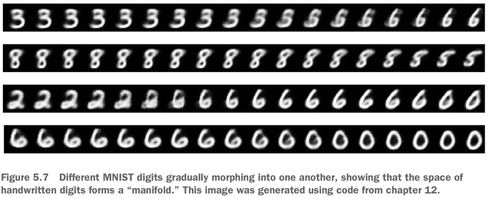
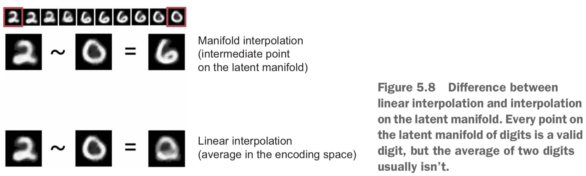
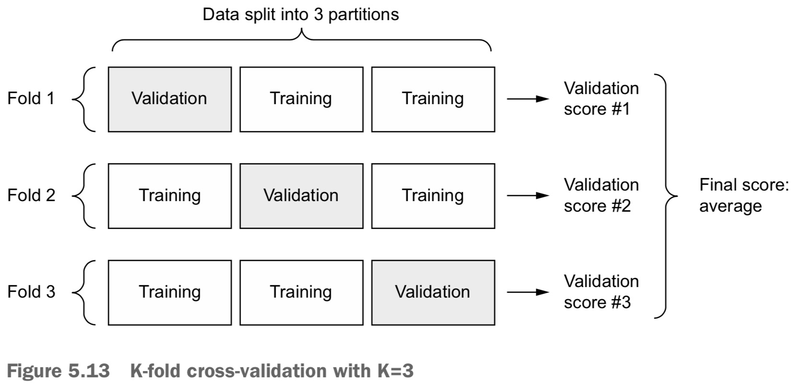
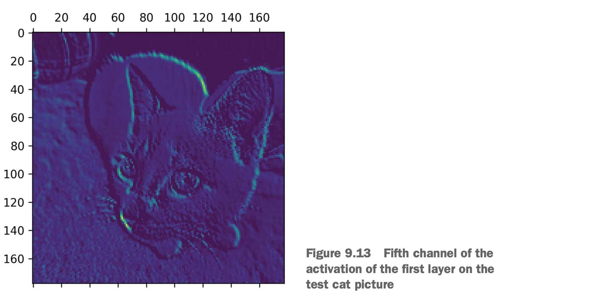

# The mathematical building blocks of neural networks
## A first look at a neural network


In machine learning, a *category* in a classification problem is called a **class**. Data points are called **samples**. The class associated with a specific sample is called a **label**.

The core building block of neural networks is *the layer*, a data-processing module that you can think of as **a filter for data**. Some data goes in, and it comes out in a more useful form. Specifically, **layers extract representations out of the data** fed into them — hopefully, representations that are *more meaningful* for the problem at hand. Most of deep learning consists of *chaining together simple layers that will implement a form of progressive data distillation*. A deep-learning model is like a **sieve for data processing**, made of a succession of increasingly refined data filters — the layers.

```python
from tensorflow import keras
from tensorflow.keras import layers

model = keras.Sequential([
    layers.Dense(512, activation="relu"),
    layers.Dense(10, activation="softmax")
])
```
Here, our model consists of a sequence of two *Dense layers*, which are densely connected (also called **fully connected**) neural layers. The second (and last) layer is a 10-way **softmax classification layer**, which means it will return an array of 10 *probability scores* (summing to 1). Each score will be the probability that the current digit image belongs to one of our 10 digit classes.

Compilation step:
- An **optimizer**: The mechanism through which **the model will update** itself based on the training data it sees, so as to improve its performance.
- A **loss function**: How the model will be able to measure its performance on the training data, and thus how it will be able to steer itself in the right direction.
- **Metrics** to monitor during training and testing
```python
model.compile(optimizer="rmsprop",
              loss="sparse_categorical_crossentropy",
              metrics=["accuracy"])
```
Previously, our trainng images were stored in an array of shape `(60000, 28, 28)` of type `uint8` with values in the `[0, 255]` interval.
Now we transform the data into a `float32` array of shape (60000, 28 * 28) with values between 0 and 1.
```python
train_images = train_images.reshape((60000, 28 * 28))
train_images = train_images.astype("float32") / 255
```

Let's train the model and computing average accuracy over the entire test set.
```python
model.fit(train_images, train_labels, epochs=5, batch_size=128)

test_loss, test_acc = model.evaluate(test_images, test_labels)
```

## Data representations for neural networks
Multidimensional NumPy arrays, also called **tensors**. In general, all current machine-learning systems use tensors as their basic data structure.

A tensor is a container for data — usually numerical data. So, it’s a container for numbers.

The number of axes of a tensor is also called its **rank**. You can display the number of axes of a NumPy tensor via the `ndim` attribute.

Rank-0 tensor is a scalar, rank-1 tensor is a vector, rank-2 tensor is a matrix. Rank-3 tensor can visually interpret as a cube of numbers.

In deep learning, you’ll generally manipulate tensors with ranks 0 to 4.

A tensor is defined by three key attributes:
- Number of axes (rank)
- Shape: how many dimensions the tensor has along each axis.
- Data type

### Manipulating tensors in NumPy
Selecting specific elements in a tensor is called **tensor slicing**.
```python
# All three are aquivalents
my_slice = train_images[10:100]
my_slice = train_images[10:100, :, :]
my_slice = train_images[10:100, 0:28, 0:28]
```
Negative indices indicate a position relative to the end of the current axis.
```python
# Select 14 × 14 pixels in the bottom-right corner of all images
my_slice = train_images[:, 14:, 14:]

# Crop the images to patches of 14 × 14 pixels centered in the middle
my_slice = train_images[:, 7:-7, 7:-7]
```

In general, the first axis in all data tensors you’ll come across in deep learning will be the samples axis (sometimes called the **samples dimension**).
When considering such a batch tensor, the first axis (axis 0) is called the batch axis or **batch dimension**.

### Image data
By convention image tensors are always rank-3, with a one-dimensional color channel for grayscale images.
There are two conventions for shapes of images tensors: the **channels-last convention** (samples, height, width, color_depth) i.e., (128, 256, 256, 3) (which is standard in TensorFlow) and the **channels-first convention** (samples, color_depth, height, width) i.e., (128, 3, 256, 256).

### Video data
A video can be understood as a sequence of frames, each frame being a color image. A batch of different videos can be stored in a rank-5 tensor of shape (samples, frames, height, width, color_depth). I.e., a batch of four 240 frame video clips would be stored in a tensor of shape (4, 240, 144, 256, 3).

## The gears of neural networks: tensor operations
All transformations learned by deep neural networks can be reduced to a handful of tensor operations applied to tensors of numeric data, i.e., add tensors, multiply tensors, and so on.
```python
keras.layers.Dense(512, activation='relu')
```
This layer can be interpreted as a function, which takes as input a matrix and returns another matrix — a new representation for the input tensor. The function is as follows:
```python
output = relu(dot(W, input) + b)
```
We have three tensor operations here: a dot product (dot) between the input tensor and a tensor named `W`; an addition (+) between the resulting matrix and a vector `b`; and, finally, a relu operation. `relu(x)` is `max(x, 0)`.

### Element-wise operations
Operations that are applied independently to each entry in the tensors being considered. This means these operations are highly amenable to massively parallel implementations (**vectorized implementations**).

When dealing with NumPy arrays, these operations are available as well-optimized built-in NumPy functions, which themselves delegate the heavy lifting to a Basic Linear Algebra Subprograms (BLAS). BLAS are low-level, highly parallel, efficient tensor-manipulation routines that are typically implemented in Fortran or C.

When running TensorFlow code on a GPU, elementwise operations are executed via **fully-vectorized CUDA implementations** that can best utilize the highly-parallel GPU chip architecture.

### Broadcasting
When possible, and if there’s no ambiguity, the smaller tensor will be broadcasted to match the shape of the larger tensor. Broadcasting consists of two steps:
1. Axes (called broadcast axes) are added to the smaller tensor to match the `ndim` of the larger tensor.
2. The smaller tensor is repeated alongside these new axes to match the full shape of the larger tensor.

Consider `X` with shape `(32, 10)` and `y` with shape `(10,)`. First, we add an empty first axis to `y`, whose shape becomes `(1, 10)`. Then, we repeat y 32 times alongside this new axis, so that we end up with a tensor `Y` with shape `(32, 10)`, where `Y[i, :] == y for i in range(0, 32)`. At this point, we can proceed to add `X` and `Y`, because they have the same shape.

Because that would be terribly inefficient, the repetition operation is entirely virtual: it happens at the algorithmic level rather than at the memory level.

### Tensor product
In NumPy, a tensor product is done using the `np.dot` function.

The dot product between two vectors is a scalar.
The dot product between a matrix `x` and a vector `y`, which returns a vector where the coefficients are the dot products between `y` and the rows of `x`.

The dot product between two matrices, where the coefficients are the vector products between the rows of `x` and the columns of `y`.


The width of `x` must match the height of `y`.

### Tensor reshaping
Reshaping a tensor means rearranging its rows and columns to match a target shape. Naturally, the reshaped tensor has the same total number of coefficients as the initial tensor.
```python
x = np.array([[0., 1.],
             [2., 3.],
             [4., 5.]])
x.shape

(3, 2)

x = x.reshape((6, 1))
print(x)

[[0.]
 [1.]
 [2.]
 [3.]
 [4.]
 [5.]]

x = x.reshape((2, 3))
print(x)

[[0. 1. 2.]
 [3. 4. 5.]]
```

### Geometric interpretation of tensor operations
- **Translation**: adding a vector to a point will move the point by a fixed amount in a fixed direction. Applied to a set of points (such as a 2D object), this is called a "translation".

- **Rotation**: can be achieved via a dot product with a `2 × 2` matrix `R = [[cos(theta), sin(theta)], [-sin(theta), cos(theta)]]`.

- **Scaling**: A vertical and horizontal scaling of the image can be achieved via a dot product with a `2 × 2` matrix `S=[[horizontal_factor,0], [0, vertical_factor]]` (diagonal matrix)

- **Linear transform**: A *dot product* with an arbitrary matrix implements a linear transform. *Scaling* and *rotation* are by definition linear transforms.
- **Affine transform**: is the combination of a **linear transform** (dot product) **and a translation** (vector addition). That’s exactly the `y = W • x + b` computation implemented by the Dense layer! A Dense layer without an activation function is an *affine layer*.

- **Dense layer with relu activation**: a multi-layer neural network made entirely of Dense layers without activations would be equivalent to a single Dense layer. This "deep" neural network would just be a linear model in disguise! This is why we need activation functions, like *relu*. **Thanks to activation functions, a chain of Dense layer can be made to implement very complex, non-linear geometric transformation, resulting in very rich hypothesis spaces for your deep neural networks.**


### A geometric interpretation of deep learning
You can interpret a neural network as a very complex geometric transformation in a high-dimensional space, implemented via a series of simple steps.

Imagine two sheets of colored paper: one red and one blue. Put one on top of the other. Now crumple them together into a small ball. That crumpled paper ball is your input data, and each sheet of paper is a class of data in a classification problem. What **a neural network (or any other machine-learning model) is meant to do is figure out a transformation of the paper ball that would uncrumple it, so as to make the two classes cleanly separable again**. With deep learning, this would be implemented as a series of simple transformations of the 3D space, such as those you could apply on the paper ball with your fingers, one movement at a time.

***What machine learning is about: finding neat representations for complex, highly folded data manifolds***.

It takes the approach of incrementally decomposing a complicated geometric transformation into a long chain of elementary ones, which is pretty much the strategy a human would follow to uncrumple a paper ball. **Each layer in a deep network applies a transformation that disentangles the data a little — and a deep stack of layers makes tractable an extremely complicated disentanglement process**.

## The engine of neural networks: gradient-based optimization
Gradually adjust these weights, based on a feedback signal. This gradual adjustment, also called **training**, is basically the learning that machine learning is all about.

Training loop, until the loss seems sufficiently low:
1. Draw a *batch of training samples* `x` and corresponding targets `y_true`.
2. Run the model on `x` (a step called the **forward pass**) to obtain predictions `y_pred`.
3. Compute the loss of the model on the batch, a *measure of the mismatch between `y_pred` and `y_true`*.
4. **Update all weights of the model in a way that slightly reduces the loss on this batch**.

The difficult part is step 4: updating the model’s weights. Given an individual weight coefficient in the model, how can you compute whether the coefficient should be increased or decreased, and by how much?

A good approach is to take advantage of the fact that all operations used in the model are **differentiable**, and compute the **gradient** of the loss with regard to the model’s coefficients. You can then move the coefficients (all at once in a single update, rather than one at a time) in the opposite direction from the gradient, thus decreasing the loss.

### What’s a derivative?
Because a function is continuous, a small change in `x` can only result in a small change in `y`. Let’s say you increase `x` by a small factor `epsilon_x`: this results in a small `epsilon_y` change to `y`:
```python
f(x + epsilon_x) = y + epsilon_y
```
Because a function is smooth, when `epsilon_x` is small enough, around a certain point p, it’s possible to approximate f as a linear function of slope a, so that `epsilon_y` becomes `a * epsilon_x`:
```python
f(x + epsilon_x) = y + a * epsilon_x
```
This linear approximation is valid only when `x` is close enough to `p`.

**The slope a is called the derivative of f in p**. If `a` is negative, it means a small change of `x` around `p` will result in a decrease of `f(x)`; and if `a` is positive, a small change in `x` will result in an increase of `f(x)`. The absolute value of `a` tells you how quickly this increase or decrease will happen.


For every differentiable function `f(x)`, there exists a derivative function `f'(x)` that maps values of `x` to the slope of the local linear approximation of `f` in those points.

If you’re trying to update `x` by a factor `epsilon_x` in order to minimize `f(x)`, and you know the derivative of `f`, then your job is done: the derivative completely describes how `f(x)` evolves as you change `x`. **If you want to reduce the value of `f(x)`, you just need to move `x` a little in the opposite direction from the derivative**.

### Derivative of a tensor operation: the gradient
**A gradient is the derivative of a tensor operation**. It’s the generalization of the concept of derivatives to functions of multidimensional inputs: that is, to functions that take tensors as inputs.

Consider an input vector `x`, a matrix `W`, a target `y_true`, and a loss function `loss`:
```python
y_pred = dot(W, x)      # We use the model weights W, to make a prediction for x
loss_value = loss(y_pred, y_true)
```
Given fixed inputs `x` and `y_true`, the preceding operations can be interpreted as a function mapping values of `W` (the model’s weights) to loss values:
```python
# f describes the curve (or high-dimensional surface)
# formed by loss values when W varies
loss_value = f(W)
```
Let’s say the current value of `W` is `W0`. Then the derivative of `f` in the point `W0` is a tensor `grad(loss_value, W0)` with the same shape as `W`, where each coefficient `grad(loss_value, W0)[i, j]` indicates the direction and magnitude of the change in `loss_value` you observe when modifying `W0[i, j]`. That tensor `grad(loss_value, W0)` is the gradient of the function `f(W) = loss_value` in `W0`.

Note that the tensor function `grad(f(W), W)` (which takes as input a matrix `W`) can be expressed as a combination of scalar functions `grad_ij(f(W), w_ij)`, each of which would return the derivative of `loss_value = f(W)` with respect to the coefficient `W[i, j]` of `W`, assuming all other coefficients are constant. `grad_ij` is called the **partial derivative** of `f` with respect to `W[i, j]`.

`grad(loss_value, W0)` can be interpreted as the tensor describing the **curvature** of `loss_value = f(W)` around `W0`.

For this reason, in much the same way that, for a function `f(x)`, you can reduce the value of `f(x)` by moving `x` a little in the opposite direction from the derivative, with a function `f(W)` of a tensor, you can **reduce `loss_value = f(W)` by moving W in the opposite direction from the gradient**: for example, `W1 = W0 - step * grad(f(W0), W0)` (where step is a small scaling factor). That means going against the curvature, which intuitively should put you lower on the curve. Note that the scaling factor step is needed because `grad(loss_value, W0)` only approximates the curvature when you’re close to `W0`, so you don’t want to get too far from `W0`.

We only know, at a single point, the direction towards which the funcion increases, through getting the current gradient.

### Stochastic gradient descent

1. Draw a batch of training samples `x` and corresponding targets `y_true`.
2. Run the model on `x` to obtain predictions `y_pred` (this is called the **forward pass**).
3. Compute the **loss** of the model on the batch, a measure of the mismatch between `y_pred` and `y_true`.
4. Compute the gradient of the loss with regard to the model’s parameters (this is called the **backward pass**).
5. Move the parameters a little in the opposite direction from the gradient — for example `W -= learning_rate * gradient` — thus reducing the loss on the batch a bit. The **learning rate** would be a scalar factor modulating the "speed" of the gradient descent process.

What we just described is called mini-batch stochastic gradient descent (**mini-batch SGD**).

Note that a variant of the mini-batch SGD algorithm would be to draw *a single sample and target at each iteration*, rather than drawing a batch of data. This would be **true SGD** (as opposed to mini-batch SGD). Alternatively, going to the opposite extreme, you could *run every step on all data available*, which is called **batch SGD**. *Each update would then be more accurate, but far more expensive*. **The efficient compromise between these two extremes is to use mini-batches of reasonable size**.


There exist multiple variants of SGD that differ by *taking into account previous weight updates when computing the next weight update, rather than just looking at the current value of the gradients*.
SGD with momentum, as well as Adagrad, RMSProp, and several others. Such variants are known as **optimization methods or optimizers**. Momentum addresses two issues with SGD: *convergence speed and local minima*.

A useful mental image here is to think of the optimization process as a small ball rolling down the loss curve. If it has enough momentum, the ball won’t get stuck in a ravine and will end up at the global minimum. Momentum is implemented by moving the ball at each step based not only on the current slope value (current acceleration) but also on the current velocity (resulting from past acceleration). In practice, this means *updating the parameter `w` based not only on the current gradient value but also on the previous parameter update*.


### Chaining derivatives: the Backpropagation algorithm
#### THE CHAIN RULE

**Backpropagation** is a way to use the derivative of simple operations (such as addition, relu, or tensor product) to easily compute the gradient of arbitrarily complex combinations of these atomic operations.

Consider a two-layer model, involving the atomic operations `dot`, `relu`, `softmax`, and `+`, as well as our loss function `loss`, which are all easily differentiable:
```python
loss_value = loss(y_true, softmax(dot(W2, relu(dot(W1, inputs) + b1)) + b2))
```
Calculus tells us that such a chain of functions can be derived using the following identity, called the chain rule:
```python
grad(y, x) == grad(y, x1) * grad(x1, x).
```
This enables you to *compute the derivative of `fg` as long as you know the derivatives of `f` and `g`*.

#### AUTOMATIC DIFFERENTIATION WITH COMPUTATION GRAPHS
They enable us to treat computation as data: a computable expression is encoded as a machine-readable data structure that can be used as the input or output of another program.

Since we want to update `w` and `b` in a way that would minimize `loss_val`, we are interested in computing `grad(loss_val, b)` and `grad(loss_val, w)`.

Let’s set at concrete values for the "input nodes" and propagate these values to all nodes in the graph (**forward pass**):


For each edge in the graph going from `a` to `b`, we will create an opposite edge from `b` to `a`, and ask "how much does `b` vary when `a` vary"? (what is `grad(b, a)`?) This backward graph represents the **backward pass**.

- `grad(loss_val, x2) = 1`, because as `x2` varies by an amount `epsilon`, `loss_val = abs(4 - x2)` varies by the same amount. (**Derivative of a constant line with slope = 1**)
- `grad(x2, x1) = 1`, because as `x1` varies by an amount `epsilon`, `x2 = x1 + b = x1 + 1` varies by the same amount.
- `grad(x2, b) = 1`, because as `b` varies by an amount `epsilon`, `x2 = x1 + b = 6 + b` varies by the same amount.
- `grad(x1, w) = 2`, because as `w` varies by an amount epsilon, `x1 = x * w = 2 * w` varies by `2 * epsilon`.

**You can obtain the derivative of a node with respect to another node by multiplying the derivatives for each edge along the path linking the two nodes**. For instance, `grad(loss_val, w) = grad(loss_val, x2) * grad(x2, x1) * grad(x1, w)`.


By applying the chain rule to our graph, we obtain what we were looking for:
- `grad(loss_val, w) = 1 * 1 * 2 = 2`
- `grad(loss_val, b) = 1 * 1 = 1`

Backpropagation is simply the application of the chain rule to a computation graph. Backpropagation starts with the final loss value and works backward from the top layers to the bottom layers, **computing the contribution that each parameter had in the loss value**. We "back propagate" the loss contributions of different nodes in a computation graph.

### THE GRADIENT TAPE IN TENSORFLOW
`GradientTape` is a Python scope that will "record" the tensor operations that run inside it, in the form of a computation graph (sometimes called a "tape").
```python
import tensorflow as tf
x = tf.Variable(0.)
with tf.GradientTape() as tape:
    y = 2 * x + 3
# Use the tape to retrieve the gradient of the output y with respect to our variable x
grad_of_y_wrt_x = tape.gradient(y, x)

print(grad_of_y_wrt_x)

tf.Tensor(2.0, shape=(), dtype=float32)
```
`GradientTape` works with tensor operations
```python
x = tf.Variable(tf.random.uniform((2, 2)))
with tf.GradientTape() as tape:
    y = 2 * x + 3
grad_of_y_wrt_x = tape.gradient(y, x)

print(grad_of_y_wrt_x)

# Tensor of shape (2, 2) (like x) describing the curvature of y = 2 * a + 3 around x = [[0, 0], [0, 0]]
tf.Tensor(
[[2. 2.]
 [2. 2.]], shape=(2, 2), dtype=float32)
```
It also works with lists of variables:
```python
W = tf.Variable(tf.random.uniform((2, 2)))
b = tf.Variable(tf.zeros((2,)))
x = tf.random.uniform((2, 2))
with tf.GradientTape() as tape:
    y = tf.matmul(x, W) + b
grad_of_y_wrt_W_and_b = tape.gradient(y, [W, b])

print(grad_of_y_wrt_W_and_b)

[<tf.Tensor: shape=(2, 2), dtype=float32, numpy=
array([[0.66226685, 0.66226685],
       [0.69323826, 0.69323826]], dtype=float32)>, <tf.Tensor: shape=(2,), dtype=float32, numpy=array([2., 2.], dtype=float32)>]
```

## Looking back at our first example
The model, composed of layers that are chained together, maps the input data to predictions. The loss function then compares these predictions to the targets, producing a loss value: a measure of how well the model’s predictions match what was expected. The optimizer uses this loss value to update the model’s weights.


Weight tensors, which are attributes of the layers, are where the *knowledge* of the model persists.
```python
 model.compile(optimizer='rmsprop',
               loss='sparse_categorical_crossentropy',
               metrics=['accuracy'])
```
`sparse_categorical_crossentropy` is the loss function that’s used as a feedback signal for learning the weight tensors, and which the training phase will attempt to minimize. The exact rules governing a specific use of gradient descent are defined by the `rmsprop` optimizer passed as the first argument.
```python
model.fit(train_images, train_labels, epochs=5, batch_size=128)
```
When you call `fit`: the model will start to iterate on the training data in mini-batches of 128 samples, 5 times over (each iteration over all the training data is called an **epoch**). ***For each batch, the model will compute the gradient of the loss with regard to the weights, and move the weights in the direction that will reduce the value of the loss for this batch***.

**The loss is the quantity you’ll attempt to minimize during training, so it should represent a measure of success for the task you’re trying to solve**.

**The optimizer specifies the exact way in which the gradient of the loss will be used to update parameters: for instance, it could be the RMSProp optimizer, SGD with momentum, and so on**.

### Reimplementing our first example from scratch in TensorFlow
#### A SIMPLE DENSE CLASS
Let’s implement a simple Python class `NaiveDense` that creates two TensorFlow variables `W` and `b`, and exposes a call method that applies the above transformation:
```python
import tensorflow as tf

class NaiveDense:
    def __init__(self, input_size, output_size, activation):
        self.activation = activation

        w_shape = (input_size, output_size)
        w_initial_value = tf.random.uniform(w_shape, minval=0, maxval=1e-1)
        self.W = tf.Variable(w_initial_value)

        b_shape = (output_size,)
        b_initial_value = tf.zeros(b_shape)
        self.b = tf.Variable(b_initial_value)

    def __call__(self, inputs):
        # Apply the forward pass
        return self.activation(tf.matmul(inputs, self.W) + self.b)

    # Convenience method for retrieving the layer’s weights.
    @property
    def weights(self):
        return [self.W, self.b]
```
#### A SIMPLE SEQUENTIAL CLASS
Now, let’s create a `NaiveSequential` class to chain these layers. It wraps a list of layers, and exposes a call methods that simply call the underlying layers on the inputs, in order.
```python
class NaiveSequential:
    def __init__(self, layers):
        self.layers = layers

    def __call__(self, inputs):
        x = inputs
        for layer in self.layers:
           x = layer(x)
        return x

    @property
    def weights(self):
       weights = []
       for layer in self.layers:
           weights += layer.weights
       return weights
```
We can create a mock Keras model:
```python
model = NaiveSequential([
    NaiveDense(input_size=28 * 28, output_size=512, activation=tf.nn.relu),
    NaiveDense(input_size=512, output_size=10, activation=tf.nn.softmax)
])
assert len(model.weights) == 4
```
#### A BATCH GENERATOR
```python
import math

class BatchGenerator:
    def __init__(self, images, labels, batch_size=128):
        assert len(images) == len(labels)
        self.index = 0
        self.images = images
        self.labels = labels
        self.batch_size = batch_size
        self.num_batches = math.ceil(len(images) / batch_size)

    def next(self):
        images = self.images[self.index : self.index + self.batch_size]
        labels = self.labels[self.index : self.index + self.batch_size]
        self.index += self.batch_size
        return images, labels
```
### Running one training step
```python
def one_training_step(model, images_batch, labels_batch):
    with tf.GradientTape() as tape:
        # Run the "forward pass"
        predictions = model(images_batch)
        per_sample_losses = tf.keras.losses.sparse_categorical_crossentropy(
            labels_batch, predictions)
        average_loss = tf.reduce_mean(per_sample_losses)
    # Compute the gradient of the loss with regard to the weights
    # The output gradients is a list where each entry corresponds to a weight from the model.weights list
    gradients = tape.gradient(average_loss, model.weights)
    # Update the weights using the gradients
    update_weights(gradients, model.weights)
    return average_loss
```
The simplest way to implement the `update_weights` function is to subtract `gradient * learning_rate` from each weight:
```python
learning_rate = 1e-3

def update_weights(gradients, weights):
    for g, w in zip(gradients, weights):
        w.assign_sub(g * learning_rate)
```
In practice, you will almost never implement a weight update step like this by hand. Instead, you would use an **Optimizer** instance from Keras. Like this:
```python
from tensorflow.keras import optimizers

optimizer = optimizers.SGD(learning_rate=1e-3)

def update_weights(gradients, weights):
    optimizer.apply_gradients(zip(gradients, weights))
```
### The full training loop
```python
def fit(model, images, labels, epochs, batch_size=128):
    for epoch_counter in range(epochs):
        print(f"Epoch {epoch_counter}")
        batch_generator = BatchGenerator(images, labels)
        for batch_counter in range(batch_generator.num_batches):
            images_batch, labels_batch = batch_generator.next()
            loss = one_training_step(model, images_batch, labels_batch)
            if batch_counter % 100 == 0:
                print(f"loss at batch {batch_counter}: {loss:.2f}")
```
Let’s test-drive it:
```python
from tensorflow.keras.datasets import mnist
(train_images, train_labels), (test_images, test_labels) = mnist.load_data()

train_images = train_images.reshape((60000, 28 * 28))
train_images = train_images.astype("float32") / 255
test_images = test_images.reshape((10000, 28 * 28))
test_images = test_images.astype("float32") / 255

fit(model, train_images, train_labels, epochs=10, batch_size=128)
```
### Evaluating the model
```python
predictions = model(test_images)
predictions = predictions.numpy()
predicted_labels = np.argmax(predictions, axis=1)
matches = predicted_labels == test_labels
print(f"accuracy: {matches.mean():.2f}")

accuracy: 0.81
```

## Summary
- Tensors form the foundation of modern machine learning systems. They come in various flavors of `dtype`, `rank`, and `shape`.
- You can manipulate numerical tensors via tensor operations (such as addition, tensor product, or element-wise multiplication), which **can be interpreted as encoding geometric transformations**. In general, everything in deep learning is amenable to a geometric interpretation.
- Deep learning models consist of chains of simple tensor operations, parameterized by weights, which are themselves tensors. **The weights of a model are where its "knowledge" is stored**.
- **Learning means finding a set of values for the model’s weights that minimizes a loss function for a given set of training data** samples and their corresponding targets.
- Learning happens by drawing random batches of data samples and their targets, and computing the gradient of the model parameters with respect to the loss on the batch. The model parameters are then moved a bit (the magnitude of the move is defined by the learning rate) in the opposite direction from the gradient. This is called **mini-batch stochastic gradient descent**.
- The entire learning process is made possible by the fact that all tensor operations in neural networks are *differentiable*, and thus it’s possible to apply the chain rule of derivation to find the gradient function mapping the current parameters and current batch of data to a gradient value. This is called **backpropagation**.
- Two key concepts you’ll see frequently in future chapters are **loss** and **optimizers**. These are the two things you need to define before you begin feeding data into a model.
- The **loss** is the quantity you’ll attempt to minimize during training, so it should represent **a measure of success** for the task you’re trying to solve.
- **The optimizer specifies the exact way in which the gradient of the loss will be used to update parameters**: for instance, it could be the `RMSProp` optimizer, `SGD` with momentum, and so on.

# Introduction to Keras and TensorFlow
## What’s TensorFlow?
- Can automatically compute the gradient of any differentiable expression.
- It can run not only on CPU, but also on GPUs and TPUs, highly-parallel hardware accelerators.
- Can be easily distributed across many machines.
- Can be exported to other runtimes, such as C++, JavaScript (for browser-based applications), or TFLite (for applications running on mobile devices or embedded devices)

*TF-Agents* for reinforcement learning research, *TFX* for industry-strength machine learning workflow management, *TF-Serving* for production deployment, there’s the TF-Hub repository of pretrained models.

## What’s Keras?
Keras is a deep-learning API for Python, built on top of TensorFlow, that provides a convenient way to define and train any kind of deep-learning model.


You can think of Keras as the Python of deep learning: a user-friendly deep learning language that offers a variety of workflows to different user profiles.

## Keras and TensorFlow: a brief history
Keras was originally built on top of Theano, that pioneered the idea of using static computation graphs for automatic differentiation and for compiling code to both CPU and GPU.

In late 2015 it became possible to use Keras with either Theano or TensorFlow.
Keras is back to being a single-backend API — on top of TensorFlow.
In 2018, the TensorFlow leadership picked Keras as TensorFlow’s official high-level API. As a result, the Keras API is front and center in TensorFlow 2.0, released in September 2019.

## First steps with TensorFlow
### Constant tensors and Variables
```python
import tensorflow as tf
x = tf.ones(shape=(2, 1))           # Equivalent to np.ones(shape=(2, 1))
print(x)

tf.Tensor(
[[1.]
 [1.]], shape=(2, 1), dtype=float32)

x = tf.zeros(shape=(2, 1))          # Equivalent to np.zeros(shape=(2, 1))
print(x)

tf.Tensor(
[[0.]
 [0.]], shape=(2, 1), dtype=float32)
```
Random tensors:
```python
x = tf.random.normal(shape=(3, 1), mean=0., stddev=1.)
print(x)                            # Eq to np.random.normal(size=(3, 1), loc=0., scale=1.)

tf.Tensor(
[[-0.5716891 ]
 [ 0.8098634 ]
 [ 0.43683395]], shape=(3, 1), dtype=float32)

x = tf.random.uniform(shape=(3, 1), minval=0., maxval=1.)
print(x)                            # Eq to np.random.uniform(size=(3, 1), low=0., high=1.)

tf.Tensor(
[[0.13896203]
 [0.6494765 ]
 [0.18377256]], shape=(3, 1), dtype=float32)
```
A significant difference between NumPy arrays and TensorFlow tensors is that *TensorFlow tensors aren’t assignable: they’re constant*.

That’s where **variables** come in. `tf.Variable` is the class meant to manage modifiable state in TensorFlow.

To create a variable, you need to provide some initial value:
```python
v = tf.Variable(initial_value=tf.random.normal(shape=(3, 1)))
print(v)

<tf.Variable 'Variable:0' shape=(3, 1) dtype=float32, numpy=
array([[-0.00714316],
       [ 0.45630848],
       [-2.6568942 ]], dtype=float32)>
```
The state of a variable **can be modified via its `assign` method**:
```python
v.assign(tf.ones((3, 1)))

<tf.Variable 'UnreadVariable' shape=(3, 1) dtype=float32, numpy=
array([[1.],
       [1.],
       [1.]], dtype=float32)>

v[0, 0].assign(3.)

<tf.Variable 'UnreadVariable' shape=(3, 1) dtype=float32, numpy=
array([[3.],
       [1.],
       [1.]], dtype=float32)>
```
`assign_add` and `assign_sub` are efficient equivalents of += and -=:
```python
v.assign_add(tf.ones((3, 1)))

<tf.Variable 'UnreadVariable' shape=(3, 1) dtype=float32, numpy=
array([[4.],
       [2.],
       [2.]], dtype=float32)>
```
### Tensor operations: doing math in TensorFlow
```python
a = tf.ones((2, 2))
a *= 2
b = tf.square(a)
c = tf.sqrt(a)
d = b + c
e = tf.matmul(a, b)
e *= d

print(a)

tf.Tensor(
[[2. 2.]
 [2. 2.]], shape=(2, 2), dtype=float32)

print(b)

tf.Tensor(
[[4. 4.]
 [4. 4.]], shape=(2, 2), dtype=float32)

print(c)

tf.Tensor(
[[1.4142135 1.4142135]
 [1.4142135 1.4142135]], shape=(2, 2), dtype=float32)

print(d)

tf.Tensor(
[[5.4142137 5.4142137]
 [5.4142137 5.4142137]], shape=(2, 2), dtype=float32)

print(e)

tf.Tensor(
[[86.62742 86.62742]
 [86.62742 86.62742]], shape=(2, 2), dtype=float32)
```
Each operation we just wrote gets executed on the fly: at any point, you can print what the current result is, just like in NumPy. We call this **eager execution**.

### A second look at the GradientTape API
Here’s something NumPy can’t do: retrieve the gradient of any differentiable expression with respect to any of its inputs.

`GradientTape` is most commonly used to retrieve the gradients of the weights of a model with respect to its loss: `gradients = tape.gradient(loss, weights)`.

Only trainable variables are being tracked by default.

The gradient tape is even capable of computing second-order gradients, that is to say, the gradient of a gradient:
```python
time = tf.Variable(0.)
with tf.GradientTape() as outer_tape:
    with tf.GradientTape() as inner_tape:
        position =  4.9 * time ** 2
    speed = inner_tape.gradient(position, time)
acceleration = outer_tape.gradient(speed, time)

print(acceleration)

# We use the outer tape to compute the gradient of the gradient from the inner tape. Naturally, the answer is 4.9 * 2 = 9.8.
tf.Tensor(9.8, shape=(), dtype=float32)
```

### An end-to-end example: a linear classifier in pure TensorFlow
Let's implement a linear classifier from scratch in TensorFlow.

Generating two classes of random points in a 2D plane:
```python
num_samples_per_class = 1000
negative_samples = np.random.multivariate_normal(
    mean=[0, 3],
    cov=[[1, 0.5],[0.5, 1]],
    size=num_samples_per_class)
positive_samples = np.random.multivariate_normal(
    mean=[3, 0],
    cov=[[1, 0.5],[0.5, 1]],
    size=num_samples_per_class)

print(negative_samples.shape)

(1000, 2)

# Stack them into a single array with shape (2000, 2):
inputs = np.vstack((negative_samples, positive_samples)).astype(np.float32)

# Let’s generate the corresponding target labels
targets = np.vstack((np.zeros((num_samples_per_class, 1), dtype="float32"),
                     np.ones((num_samples_per_class, 1), dtype="float32")))
```
Intuitively, the "covariance matrix" describes the shape of the point cloud pictured in the figure below, and the "mean" describes its position in the plane. `cov=[[1, 0.5],[0.5, 1]]` corresponds to "an oval-like point cloud oriented from bottom left to top right", (point cloud with a different position and the same shape).

Plot our data with Matplotlib
```python
import matplotlib.pyplot as plt
plt.scatter(inputs[:, 0], inputs[:, 1], c=targets[:, 0])
plt.show()
```


A linear classifier is an **affine transformation** (`prediction = W • input + b`) trained to minimize the square of the difference between predictions and the targets.

Let’s create our variables `W` and `b`, initialized with random values and with zeros respectively:
```python
input_dim = 2
output_dim = 1
W = tf.Variable(initial_value=tf.random.uniform(shape=(input_dim, output_dim)))
b = tf.Variable(initial_value=tf.zeros(shape=(output_dim,)))
```
The output predictions will be a single score per sample (close to 0 if the sample is predicted to be in class 0, and close to 1 if the sample is predicted to be in class 1).

Here’s our forward pass function:
```python
def model(inputs):
    return tf.matmul(inputs, W) + b
```

`W` is really just two scalar coefficients, `w1` and `w2`: `W = [[w1], [w2]]`. For given input point `[x, y]`, its prediction value is: `prediction = [[w1], [w2]] • [x, y] + b = w1 * x + w2 * y + b`.

Here’s our loss function:
```python
def square_loss(targets, predictions):
    # A tensor of with the same shape as targets and predictions,
    # containing per-sample loss scores
    per_sample_losses = tf.square(targets - predictions)
    # We need to average these per-sample loss scores into a single scalar
    # loss value: this is what reduce_mean does.
    return tf.reduce_mean(per_sample_losses)
```
Now, the training step, which receives some training data and updates the weights W and b so as to minimize the loss on the data:
```python
learning_rate = 0.1

def training_step(inputs, targets):
    with tf.GradientTape() as tape:
        predictions = model(inputs)
        loss = square_loss(predictions, targets)
    # Retrieve the gradient of the loss with regard to weights
    grad_loss_wrt_W, grad_loss_wrt_b = tape.gradient(loss, [W, b])
    # Update the weights
    W.assign_sub(grad_loss_wrt_W * learning_rate)
    b.assign_sub(grad_loss_wrt_b * learning_rate)
    return loss
```
We’ll do batch training instead of mini-batch training: **each gradient update will be much more effective at reducing the loss on the training data**, since it will encompass information from all training samples instead of, say, only 128 random samples. As a result, **we will need much fewer steps of training, and we should use a larger learning rate** than what we would typically use for mini-batch training.

The batch training loop:
```python
for step in range(40):
    loss = training_step(inputs, targets)
    print(f"Loss at step {step}: {loss:.4f}")
```
Because our targets are zeros and ones, a given input point will be classified as "0" if its prediction value is below 0.5, and as "1" if it is above 0.5:
```python
predictions = model(inputs)

x = np.linspace(-1, 4, 100)
y = - W[0] /  W[1] * x + (0.5 - b) / W[1]
plt.plot(x, y, "-r")
plt.scatter(inputs[:, 0], inputs[:, 1], c=predictions[:, 0] > 0.5)
```
What you’re looking at is really the equation of a line in the 2D plane: `w1 * x + w2 * y + b = 0.5`. Above the line, class 1, below the line, class 0. Our line becomes: `y = - w1 / w2 * x + (0.5 - b) / w2`.


This is really what a linear classifier is all about: **finding the parameters of a line (or, in higher-dimensional spaces, a hyperplane) neatly separating two classes of data**.

## Anatomy of a neural network: understanding core Keras APIs
It’s now time to move on to a more productive, more robust path to deep learning: the Keras API.

### Layers: the building blocks of deep learning
The fundamental data structure in neural networks is the **layer**. Frequently layers have a state: the layer’s weights, one or several tensors learned with stochastic gradient descent, which together contain the network’s knowledge.

Different types of layers are appropriate for different tensor formats and different types of data processing. For instance, simple vector data, stored in 2D tensors of shape (samples, features), is often processed by densely connected layers, also called fully connected or dense layers (the Dense class in Keras). Sequence data, stored in 3D tensors of shape (samples, timesteps, features), is typically processed by recurrent layers, such as an LSTM layer, or 1D convolution layers (Conv1D). Image data, stored in 4D tensors, is usually processed by **2D convolution layers** (Conv2D).

Building deep-learning models in Keras is done by clipping together compatible layers to form useful data-transformation pipelines.

#### THE BASE `LAYER` CLASS IN KERAS
A `Layer` is an object that encapsulates some state (weights) and some computation (a forward pass).
```python
from tensorflow import keras

# All Keras layers inherit from the base Layer class.
class SimpleDense(keras.layers.Layer):

    def __init__(self, units, activation=None):
        super().__init__()
        self.units = units
        self.activation = activation

    # Weight creation takes place in the build() method
    def build(self, input_shape):
        input_dim = input_shape[-1]
        # add_weight is a shortcut method for creating weights
        self.W = self.add_weight(shape=(input_dim, self.units),
                                 initializer="random_normal")
        self.b = self.add_weight(shape=(self.units,),
                                 initializer="zeros")

    # We define the forward pass computation in the call() method
    def call(self, inputs):
        y = tf.matmul(inputs, self.W) + self.b
        if self.activation is not None:
            y = self.activation(y)
        return y
```

```python
# Instantiate our layer, defined previously
my_dense = SimpleDense(units=32, activation=tf.nn.relu)
# Create some test inputs
input_tensor = tf.ones(shape=(2, 784))
# Call the layer on the inputs, just like a function
output_tensor = my_dense(input_tensor)
print(output_tensor.shape)

(2, 32)
```
#### AUTOMATIC SHAPE INFERENCE: BUILDING LAYERS ON THE FLY
Just like with LEGO bricks, you can only "clip" together layers that are compatible. The notion of layer compatibility here refers specifically to the fact that *every layer will only accept input tensors of a certain shape and will return output tensors of a certain shape*.

The layers didn’t receive any information about the shape of their inputs — instead, they automatically inferred their input shape as being the shape of the first inputs they see.

In `SimpleDense`, we no longer create weights in the constructor like in the `NaiveDense` example, instead, we create them in a dedicated state-creation method `build()`, which receives as argument the first input shape seen by the layer. The `build()` method is called automatically the first time the layer is called (via its call method).
The `__call__` method of the base layer schematically looks like this:
```python
def __call__(self, inputs):
    if not self.built:
         self.build(inputs.shape)
         self.built = True
    return self.call(inputs)
```
With automatic shape inference, our previous example becomes simple and neat:
```python
model = keras.Sequential([
    SimpleDense(32, activation="relu"),
    SimpleDense(64, activation="relu"),
    SimpleDense(32, activation="relu"),
    SimpleDense(10, activation="softmax")
])
```
Just remember: *when implementing your own layers, put the forward pass in the call method*.

### From layers to models
A deep-learning model is a graph of layers. In Keras, that’s the `Model` class.
The topology of a model defines a *hypothesis space*. By choosing a network topology, you constrain your space of possibilities (hypothesis space) to a specific series of tensor operations, mapping input data to output data. What you’ll then be searching for is a good set of values for the weight tensors involved in these tensor operations.
To learn from data, you have to make assumptions about it. These assumptions define what can be learned. As such, the structure of your hypothesis space — the architecture of your model — is extremely important. It encodes the assumptions you make about your problem, the prior knowledge that the model starts with. For instance, if you’re working on a two-class classification problem with a model made of a single Dense layer with no activation (a pure affine transformation), you are assuming that your two classes are linearly separable.

### The "compile" step: configuring the learning process
Once the model architecture is defined, you still have to choose three more things:
- **Loss function** (objective function) — The quantity that will be minimized during training. It represents a measure of success for the task at hand.
- **Optimizer** — Determines how the network will be updated based on the loss function. It implements a specific variant of stochastic gradient descent (SGD).
- **Metrics** — The measures of success you want to monitor during training and validation.
```python
model = keras.Sequential([keras.layers.Dense(1)])
model.compile(optimizer="rmsprop",
              loss="mean_squared_error",
              metrics=["accuracy"])
```
We passed the optimizer, loss, and metrics as strings, but it’s also possible to specify these arguments as object instances:
```python
model.compile(optimizer=keras.optimizers.RMSprop(),
              loss=keras.losses.MeanSquaredError(),
              metrics=[keras.metrics.BinaryAccuracy()])
```
This is useful if you want to pass your own custom losses or metrics, or if you want to further configure the objects you’re using (i.e., `learning_rate` argument to the optimizer).

### Picking a loss function
Choosing the right loss function for the right problem is extremely important: your network will take any shortcut it can to minimize the loss.
There are simple guidelines you can follow to choose the correct loss. For instance, you’ll **use binary crossentropy for a two-class classification problem**, **categorical crossentropy for a many-class classification problem**, and so on.

### Understanding the "fit" method
The fit method implements the training loop itself. Its key arguments are:
- The **data** (inputs and targets) to train on. It will typically be passed either in the form of NumPy arrays, of a TensorFlow Dataset object.
- The number of **epochs** to train for.
- The **batch size** to use within each epoch of mini-batch gradient descent.
```python
history = model.fit(
    inputs,
    targets,
    epochs=5,
    batch_size=128
)
```
The call to `fit` returns a `History` object. This object contains a history field which is a dict mapping keys such as "`loss`" or specific metric names to the list of their per-epoch values.
```python
history.history
{'binary_accuracy': [0.855, 0.9565, 0.9555, 0.95, 0.951],
 'loss': [0.6573270302042366,
  0.07434618508815766,
  0.07687718723714351,
  0.07412414988875389,
  0.07617757616937161]}
```

### Monitoring loss & metrics on validation data
The goal is to obtain models that perform well in general, in particular on data points that the model has never encountered before. Just because a model performs well on its training data doesn’t mean it will perform well on data it has never seen!

It’s standard practice to reserve a subset of the training data as "**validation data**": you won’t be training the model on this data, but you will use it to compute a loss value and metrics value.
```python
model = keras.Sequential([keras.layers.Dense(1)])
model.compile(optimizer=keras.optimizers.RMSprop(learning_rate=0.1),
              loss=keras.losses.MeanSquaredError(),
              metrics=[keras.metrics.BinaryAccuracy()])

indices_permutation = np.random.permutation(len(inputs))
shuffled_inputs = inputs[indices_permutation]
shuffled_targets = targets[indices_permutation]

num_validation_samples = int(0.3 * len(inputs))
val_inputs = shuffled_inputs[:num_validation_samples]
val_targets = shuffled_targets[:num_validation_samples]
training_inputs = shuffled_inputs[num_validation_samples:]
training_targets = shuffled_targets[num_validation_samples:]
model.fit(
    training_inputs,
    training_targets,
    epochs=5,
    batch_size=16,
    validation_data=(val_inputs, val_targets)
)
```
The value of the loss on the validation data is called the "*validation loss*". The purpose of validation is to monitor whether what the model is learning is actually useful on new data.

If you want to compute the validation loss and metrics after training is complete, you can call the `evaluate` method:
```python
loss_and_metrics = model.evaluate(val_inputs, val_targets, batch_size=128)
```
Return a list of scalars, where the first entry is the validation loss and the following entries are the validation metrics.

### Inference: using a model after training
Once you’ve trained your model, you’re going to want to use it to make predictions on new data. This is called "**inference**".

A way to do inference is to use the `predict()` method. It will iterate over the data in small batches, and return a NumPy array of predictions. And it can also process TensorFlow Dataset objects.
```python
predictions = model.predict(val_inputs, batch_size=128)
```
## Summary
- TensorFlow can run on CPU, GPU, or TPU. It can automatically compute the gradient of any differentiable expression, it can be distributed to many devices, and it can export programs to various external runtimes—even JavaScript.
- Keras is the standard API for doing deep learning with TensorFlow.
- Key TensorFlow objects include tensors, variables, tensor operations, and the gradient tape.
- The central class of Keras is the `Layer`. A layer encapsulates some weights and some computation. Layers are assembled into models.
- Before you start training a model, you need to pick **an optimizer, a loss, and some metrics**, which you specify via the `model.compile()` method.
- To train a model, you can use **the `fit()` method, which runs mini-batch gradient descent** for you. You can also use it to monitor your loss and metrics on validation data, a set of inputs that the model doesn’t see during training.
- Once your model is trained, you use **the `model.predict()` method to generate predictions on new inputs**.

# Getting started with neural networks: classification and regression
## Classifying movie reviews: a binary classification example
### The IMDB dataset
IMDB dataset: a set of 50,000 highly polarized reviews from the Internet Movie Database. They’re split into 25,000 reviews for training and 25,000 reviews for testing, each set consisting of 50% negative and 50% positive reviews.
It has already been preprocessed: the reviews (sequences of words) have been turned into sequences of integers, where each integer stands for a specific word in a dictionary.
```python
from tensorflow.keras.datasets import imdb
(train_data, train_labels), (test_data, test_labels) = imdb.load_data(
    num_words=10000) # Only keep the top 10,000 most frequently occurring words
```
`train_labels` and `test_labels` are lists of 0s and 1s, where 0 stands for negative and 1 stands for positive:
```python
train_data[0][:10]

[1, 14, 22, 16, 43, 530, 973, 1622, 1385, 65]

train_labels[0]

1
```
Here’s how you can quickly decode one of these reviews back to English words:
```python
word_index = imdb.get_word_index()
reverse_word_index = dict(
    [(value, key) for (key, value) in word_index.items()])
decoded_review = " ".join(
    [reverse_word_index.get(i - 3, "?") for i in train_data[0]])
# The indices are offset by 3 because 0, 1, and 2 are reserved indices for
# "padding," "start of sequence," and "unknown.".
print(decoded_review)

? this film was just brilliant casting location scenery story direction everyone...
```

### Preparing the data
You can’t directly feed lists of integers into a neural network. They all have different lengths.

**Multi-hot encode** your lists to turn them into vectors of 0s and 1s (turning the sequence `[8, 5]` into a 10,000-dimensional vector that would be all 0s except for indices 8 and 5, which would be 1s). Then you could use a Dense layer, capable of handling floating-point vector data, as the first layer in your model.
```python
print(x_train[0])
len(x_train[0])

[0. 1. 1. ... 0. 0. 0.]
10000
```

### Building your model
The input data is vectors, and the labels are scalars (1s and 0s): this is one of the simplest problem setups you’ll ever encounter. *A type of model that performs well on such a problem is a plain stack of densely connected (Dense) layers with relu activations*.

There are two key architecture decisions:
- How many layers to use
- How many units to choose for each layer

We take the following architecture choices:
- Two intermediate layers with 16 units each
- A third layer that will output the scalar prediction


```python
from tensorflow import keras
from tensorflow.keras import layers

model = keras.Sequential([
    layers.Dense(16, activation="relu"),
    layers.Dense(16, activation="relu"),
    layers.Dense(1, activation="sigmoid")
])
```
The number of units in the layer is **the dimensionality of representation space of the layer**.

Having 16 units means the weight matrix `W` will have shape `(input_dimension, 16)`: the dot product with `W` will project the input data onto a 16-dimensional representation space. **You can intuitively understand the dimensionality of your representation space as "how much freedom you’re allowing the model to have when learning internal representations."** Having more units (a higher-dimensional representation space) allows your **model to learn more-complex representations**, but it makes the model more computationally expensive and *may lead to learning unwanted patterns* (patterns that will improve performance on the training data but not on the test data).

A **relu** (rectified linear unit) is a function meant to zero out negative values, whereas a **sigmoid** "squashes" arbitrary values into the `[0, 1]` interval, outputting something that can be interpreted as a probability (a score between 0 and 1 indicating how likely the sample is to have the target "1": **how likely the review is to be positive**).


Because you’re facing a binary classification problem and the output of your model is a probability it’s best to use the **`binary_crossentropy`** loss. Crossentropy is usually the best choice when you’re dealing with models that output probabilities. **Crossentropy is a quantity from the field of information theory that measures the distance between probability distributions or, in this case, between the ground-truth distribution and your predictions**.

For the choice of the *optimizer*, we’ll go with **rmsprop**, which is a **usually a good default choice for virtually any problem**.

Without an activation function like relu, the layer could only learn linear transformations (*affine transformations*) of the input data: the hypothesis space of the layer would be the set of all possible linear transformations of the input data into a 16-dimensional space. Because a deep stack of linear layers would still implement a linear operation: adding more layers wouldn’t extend the hypothesis space.
**In order to get access to a much richer hypothesis space that will benefit from deep representations, you need a non-linearity, or activation function**.
```python
model.compile(optimizer="rmsprop",
              loss="binary_crossentropy",
              metrics=["accuracy"])
```

### Validating your approach
A model that performs better on the training data isn’t necessarily a model that will do better on data it has never seen before. In precise terms, what you’re seeing is overfitting: after the fourth epoch, you’re overoptimizing on the training data, and you end up learning representations that are specific to the training data and don’t generalize to data outside of the training set.

### Wrapping up
- You usually need to do quite a bit of preprocessing on your raw data in order to be able to feed it —as tensors— into a neural network. Sequences of words can be encoded as binary vectors, but there are other encoding options too.
- Stacks of Dense layers with relu activations can solve a wide range of problems (including sentiment classification), and you’ll likely use them frequently.
- **In a binary classification problem (two output classes), your model should end with a Dense layer with one unit and a sigmoid activation**: the output of your model should be a scalar between 0 and 1, encoding a probability.
- With such a scalar sigmoid output on a binary classification problem, the loss function you should use is **`binary_crossentropy`**.
- The `rmsprop` optimizer is generally a good enough choice, whatever your problem. That’s one less thing for you to worry about.
- As they get better on their training data, neural networks **eventually start overfitting** and end up obtaining increasingly worse results on data they’ve never seen before. Be sure to always monitor performance on data that is outside of the training set.

## Classifying newswires: A multiclass classification example
Let's build a model to classify Reuters newswires into 46 mutually exclusive topics. Because we have many classes, this problem is an instance of multiclass classification, and because each data point should be classified into only one category, the problem is more specifically an instance of **single-label multiclass classification**.

### The Reuters dataset
```python
from tensorflow.keras.datasets import reuters
(train_data, train_labels), (test_data, test_labels) = reuters.load_data(
    num_words=10000)

len(train_data)

8982

len(test_data)

2246
```

### Preparing the data
**One-hot encoding** is a widely used format for categorical data, also called categorical encoding. In this case, one-hot encoding of the labels consists of embedding each label as an all-zero vector with a 1 in the place of the label index.
```python
from tensorflow.keras.utils import to_categorical
y_train = to_categorical(train_labels)
y_test = to_categorical(test_labels)
```

### Building your model
The number of output classes has gone from 2 to 46. The dimensionality of the output space is much larger.
In a stack of Dense layers like those we’ve been using, each layer can only access information present in the output of the previous layer. If one layer drops some information relevant to the classification problem, this information can never be recovered by later layers: **each layer can potentially become an information bottleneck**. A 16-dimensional space may be too limited to learn to separate 46 different classes: such small layers may act as information bottlenecks, permanently dropping relevant information.
```python
model = keras.Sequential([
    layers.Dense(64, activation="relu"),
    layers.Dense(64, activation="relu"),
    layers.Dense(46, activation="softmax")
])

model.compile(optimizer="rmsprop",
              loss="categorical_crossentropy",
              metrics=["accuracy"])
```
We end the model with a Dense layer of size 46. This means for each input sample, the network will output a 46-dimensional vector. Each entry in this vector
(each dimension) will encode a different output class.

The last layer uses a *softmax* activation, it means the model will output a probability distribution over the 46 different output classes—for every input sample, the model will produce a 46-dimensional output vector, where `output[i]` is the probability that the sample belongs to class `i`. The 46 scores will sum to 1.

The best loss function to use in this case is `categorical_crossentropy`. It **measures the distance between two probability distributions: here, between the probability distribution output by the model and the true distribution of the labels**. By minimizing the distance between these two distributions, you train the model to output something as close as possible to the true labels.

With **integer labels**, you should use `sparse_categorical_crossentropy`.

### The importance of having sufficiently large intermediate layers
Let’s see what happens when we introduce an information bottleneck by having intermediate layers that are significantly less than 46-dimensional: for example, 4-dimensional.
```python
model = keras.Sequential([
    layers.Dense(64, activation="relu"),
    layers.Dense(4, activation="relu"),
    layers.Dense(46, activation="softmax")
])
model.compile(optimizer="rmsprop",
              loss="categorical_crossentropy",
              metrics=["accuracy"])
model.fit(partial_x_train,
          partial_y_train,
          epochs=20,
          batch_size=128,
          validation_data=(x_val, y_val))
```
The model now peaks at ~71% validation accuracy, an 8% absolute drop. **This drop is mostly due to the fact that we’re trying to compress a lot of information (enough information to recover the separation hyperplanes of 46 classes) into an intermediate space that is too low-dimensional**. The model is able to cram most of the necessary information into these four-dimensional representations, but not all of it.

### Wrapping up
- If you’re trying to classify data points **among N classes**, your model should end with a **Dense layer of size N**.
- Your model should end with a **softmax activation** so that it will output a probability distribution over the N output classes.
- **Categorical crossentropy** is almost always the loss function you should use for such problems. It minimizes the distance between the probability distributions output by the model and the true distribution of the targets.
- There are two ways to handle labels in multiclass classification:
    - **One-hot encoding** and using **`categorical_crossentropy`** as a loss function
    - **Integers** and using the **`sparse_categorical_crossentropy`** loss function
- If you need to classify data into a large number of categories, you should avoid creating information bottlenecks in your model due to intermediate layers that are too small.

## Predicting house prices: A regression example
Another common type of machine learning problem is **regression**, which consists of **predicting a continuous value** instead of a discrete label: for instance, predicting the temperature tomorrow.

**Note**: Don’t confuse regression and the **logistic regression algorithm**. Confusingly, logistic regression isn’t a regression algorithm, it’s a classification algorithm.

### The Boston housing price dataset
The dataset has relatively few data points: only 506, split between 404 training samples and 102 test samples. And each feature in the input data (for example, the crime rate) has a different scale.
```python
from tensorflow.keras.datasets import boston_housing
(train_data, train_targets), (test_data, test_targets) = boston_housing.load_data()

train_data.shape

(404, 13)

test_data.shape

(102, 13)
```

### Preparing the data
A widespread best practice for dealing with such data is to do **feature-wise normalization**: for each feature in the input data (a column in the input data matrix), we subtract the mean of the feature and divide by the standard deviation, so that *the feature is centered around 0 and has a unit standard deviation*.
```python
mean = train_data.mean(axis=0)
train_data -= mean
std = train_data.std(axis=0)
train_data /= std
test_data -= mean
test_data /= std
```
Note that the quantities used for normalizing the test data are computed using the training data. *You should never use any quantity computed on the test data* in your workflow, even for something as simple as data normalization.

### Building your model
In general, the less training data you have, the worse overfitting will be, and **using a small model is one way to mitigate overfitting**.
```python
def build_model():
    model = keras.Sequential([
        layers.Dense(64, activation="relu"),
        layers.Dense(64, activation="relu"),
        layers.Dense(1)
    ])
    model.compile(optimizer="rmsprop", loss="mse", metrics=["mae"])
    return model
```
The model ends with a single unit and no activation (it will be a linear layer). **This is a typical setup for scalar regression**.

Because the last layer is purely linear, the model is free to learn to predict values in any range.

**Mean squared error** (MSE) is a widely used loss function for regression problems.

**Mean absolute error** (MAE). It’s the absolute value of the difference between the predictions and the targets.

### Validating your approach using K-fold validation
Because we have so few data points, the validation set would end up being very small. As a consequence, *the validation scores might change a lot depending on which data points we chose for validation and which we chose for training*: **the validation scores might have a high variance with regard to the validation split**. This would prevent us from reliably evaluating our model.

The best practice in such situations is to use K-fold cross-validation:


It consists of splitting the available data into K partitions (typically K = 4 or 5), instantiating K identical models, and training each one on K – 1 partitions while evaluating on the remaining partition. **The validation score for the model used is then the average of the K validation scores obtained**. In terms of code, this is straightforward.

```python
num_epochs = 500
all_mae_histories = []
for i in range(k):
    print(f"Processing fold #{i}")
    val_data = train_data[i * num_val_samples: (i + 1) * num_val_samples]
    val_targets = train_targets[i * num_val_samples: (i + 1) * num_val_samples]
    partial_train_data = np.concatenate(
        [train_data[:i * num_val_samples],
         train_data[(i + 1) * num_val_samples:]],
        axis=0)
    partial_train_targets = np.concatenate(
        [train_targets[:i * num_val_samples],
         train_targets[(i + 1) * num_val_samples:]],
        axis=0)
    model = build_model()
    history = model.fit(partial_train_data, partial_train_targets,
                        validation_data=(val_data, val_targets),
                        epochs=num_epochs, batch_size=16, verbose=0)
    mae_history = history.history["val_mae"]
    all_mae_histories.append(mae_history)
```

The average (2.6) is a much more reliable metric than any single score—that’s the entire point of K-fold cross-validation.

Once you’re finished tuning other parameters of the model (in addition to the number of epochs, you could also adjust the size of the intermediate layers), you can train a final production model on all of the training data, with the best parameters, and then look at its performance on the test data.

### Generating predictions on new data
With this scalar regression model, `predict()` returns the model’s guess for the sample’s price in thousands of dollars:
```python
predictions = model.predict(test_data)
predictions[0]

array([8.748171], dtype=float32)
```

### Wrapping up
- Regression is done using different loss functions than we used for classification. **Mean squared error (MSE) is a loss function commonly used for regression**.
- Similarly, evaluation metrics to be used for regression differ from those used for classification; naturally, the concept of accuracy doesn’t apply for regression. **A common regression metric is mean absolute error (MAE)**.
- When features in the input data have values in different ranges, **each feature should be scaled independently** as a preprocessing step.
- When there is little data available, using **K-fold validation** is a great way to reliably evaluate a model.
- When little training data is available, **it’s preferable to use a small model with few intermediate layers** (typically only one or two), in order to avoid severe overfitting.

## Summary

- The three most common kinds of machine learning tasks on vector data are **binary classification, multiclass classification, and scalar regression**.
- Regression uses different loss functions and different evaluation metrics than classification.
- You’ll usually need to preprocess raw data before feeding it into a neural network.
- When your data has features with different ranges, scale each feature independently as part of preprocessing.
- As training progresses, neural networks eventually begin to overfit and obtain worse results on never-before-seen data.
- If you don’t have much training data, use a small model with only one or two intermediate layers, to avoid severe overfitting.
- If your data is divided into many categories, you may cause information bottlenecks if you make the intermediate layers too small.
- When you’re working with little data, K-fold validation can help reliably evaluate your model.

# Fundamentals of machine learning

## Generalization: The goal of machine learning
After just a few epochs, performance on never-before-seen data started diverging from performance on the training data, which always improves as training progresses. The models started to overfit. **Overfitting happens in every machine learning problem.**

**The fundamental issue in machine learning is the tension between optimization and generalization**. **Optimization** refers to the process of adjusting a model to get *the best performance possible on the training data* (the learning in machine learning), whereas **generalization** refers to how well the trained model performs on *data it has never seen before*.

If you do that too well, overfitting kicks in and generalization suffers.

### Underfitting and overfitting
Performance on the held-out validation data started improving as training went on and then inevitably peaked after a while. *This pattern is universal. You’ll see it with any model type and any dataset*.


At the beginning of training, optimization and generalization are correlated: the lower the loss on training data, the lower the loss on test data. While this is happening, your model is said to be *underfit*: there is still progress to be made; the network hasn’t yet modeled all relevant patterns in the training data. But after a certain number of iterations on the training data, **generalization stops improving, validation metrics stall and then begin to degrade: the model is starting to overfit**. That is, *it’s beginning to learn patterns that are specific to the training data* but that are misleading or irrelevant when it comes to new data.

Overfitting is particularly likely to occur when your data is noisy, if it involves uncertainty, or if it includes rare features.

#### AMBIGUOUS FEATURES
A model could overfit to such probabilistic data by being too confident about ambiguous regions of the feature space. **A more robust fit would ignore individual data points and look at the bigger picture**.


#### RARE FEATURES AND SPURIOUS CORRELATIONS
Machine learning models trained on datasets that include rare feature values are highly susceptible to overfitting.

Consider a word that occurs in 100 samples in your training data and that’s associated with a positive sentiment 54% of the time and with a negative sentiment 46% of the time. That difference may well be a complete statistical fluke, yet your model is likely to learn to leverage that feature for its classification task. This is one of the most common sources of overfitting.

The more noise channels you add, the further accuracy will degrade.
Noisy features inevitably lead to overfitting. As such, in cases where you aren’t sure whether the features you have are informative or distracting, it’s common to do feature selection before training. The typical way to do feature selection is to compute some usefulness score for each feature available—a measure of how informative the feature is with respect to the task, such as the mutual information between the feature and the labels—and only keep features that are above some threshold.

### The nature of generalization in deep learning
A remarkable fact about deep learning models is that they can be trained to fit anything, as long as they have enough representational power.

You could just generate white noise inputs and random labels. You could fit a model on that, as long as it has enough parameters. It would just end up memorizing specific inputs, much like a Python dictionary.

The nature of generalization in deep learning has rather little to do with deep learning models themselves, and much to do with the structure of information in the real world.

#### THE MANIFOLD HYPOTHESIS
In MNIST samples, actual handwritten digits only occupy a tiny *subspace* of the parent space of all possible 28 × 28 uint8 arrays. What’s more, this subspace isn’t just a set of points sprinkled at random in the parent space: **it is highly structured**.

The subspace of valid handwritten digits is **continuous**: if you take a sample and modify it a little, it will still be recognizable as the same handwritten digit. Further, all samples in the valid subspace are **connected** by smooth paths that run through the subspace. This means that if you take two random MNIST digits A and B, there exists a sequence of "intermediate" images that morph A into B, such that two consecutive digits are very close to each other:



In technical terms, you would say that handwritten digits form a ***manifold*** within the space of possible 28 × 28 uint8 arrays.

A "manifold" is a lower-dimensional subspace of some parent space that is locally similar to a linear (Euclidian) space. For instance, a smooth curve in the plane is a 1D manifold within a 2D space, because for every point of the curve, you can draw a tangent (the curve can be approximated by a line at every point). A smooth surface within a 3D space is a 2D manifold. And so on.

More generally, the **manifold hypothesis** posits that *all natural data lies on a low-dimensional manifold within the high-dimensional space where it is encoded*. That’s a pretty strong statement about *the structure of information in the universe*. As far as we know, it’s accurate, and **it’s the reason why deep learning works**.

The manifold hypothesis implies that
- Machine learning models only have to fit relatively simple, low-dimensional, highly structured subspaces within their potential input space (latent manifolds).
- Within one of these manifolds, it’s always possible to interpolate between two inputs, that is to say, morph one into another via a continuous path along which all points fall on the manifold.

***The ability to interpolate between samples is the key to understanding generalization in deep learning.***

[Here](https://www.youtube.com/watch?v=BePQBWPnYuE) is a nice video that explains the intuition behind manifolds in Machine Learning.

#### INTERPOLATION AS A SOURCE OF GENERALIZATION
If you work with data points that can be interpolated, you can start making sense of points you’ve never seen before by *relating them to other points that lie close on the manifold*. In other words, **you can make sense of the totality of the space using only a sample of the space**. You can use interpolation to fill in the blanks.

Note that interpolation on the latent manifold is different from linear interpolation in the parent space:



While deep learning achieves generalization via interpolation on a learned approximation of the data manifold, it would be a mistake to assume that interpolation is *all* there is to generalization. It’s the tip of the iceberg. **Interpolation can only help you make sense of things that are very close to what you’ve seen before: it enables *local* generalization**.

Humans are capable of extreme generalization, which is enabled by cognitive mechanisms other than interpolation: abstraction, symbolic models of the world, reasoning, logic, common sense, innate priors about the world—what we generally call reason, as opposed to intuition and pattern recognition.

#### WHY DEEP LEARNING WORKS
A deep learning model is a tool for uncrumpling paper balls, that is, for disentangling *latent manifolds*.


Deep learning is about taking a big, complex curve—a manifold—and incrementally adjusting its parameters until it fits some training data points.

Your data forms a highly structured, low-dimensional manifold within the input space, and because fitting your model curve to this data happens gradually and smoothly over time as gradient descent progresses, there will be an intermediate point during training at which the model roughly approximates the natural manifold of the data.


Moving along the curve learned by the model at that point will come close to moving along the actual latent manifold of the data—as such, the model will be capable of making sense of never-before-seen inputs via interpolation between training inputs.

There are a few properties of deep learning models that make them particularly well-suited to learning latent manifolds:

- The smoothness of the mapping from their inputs to their outputs helps approximate latent manifolds, which follow the same properties.
- Deep learning models tend to be structured in a way that mirrors the "shape" of the information in their training data. More generally, deep neural networks structure their learned representations in a hierarchical and modular way, which echoes the way natural data is organized.


"""
because different groups of neurons are being activated deep in our mind depending on what cluster it belongs to and these clusters can also be thought of as connected regions or *manifolds* and so perceptions representing the written digit 6 would fall on one manifold and the digit 3 would fall on another and so manifolds are spatial regions which represent the patterns essential to a concept these patterns are defined by the connection patterns or strength across the neuron layers but so far we have only modeled how intuition works that is a rapid interpretation of some impulse such as when you recognize someone's voice by a single syllable this is what a single pass through a neural network simulates the other big challenge is problems which require reasoning interactive problems such as having a conversation or playing a game these problems are sequential in nature and require things like a form of working memory this leads us to the cutting edge of neural network research how will a neural network learn to reason
"""

#### TRAINING DATA IS PARAMOUNT
While deep learning is indeed well suited to manifold learning, the power to generalize is more a consequence of the natural structure of your data than a consequence of any property of your model. *You’ll only be able to generalize if your data forms a manifold where points can be interpolated*. *The more informative and the less noisy your features are, the better you will be able to generalize, since your input space will be simpler and better structured.* Data curation and feature engineering are essential to generalization.

For a model to perform well it needs **to be trained on a dense sampling of its input space**. A "dense sampling" in this context means that the training data should densely cover the entirety of the input data manifold. This is especially true near decision boundaries. With a sufficiently dense sampling, it becomes possible to make sense of new inputs by interpolating between past training inputs.


***As such, you should always keep in mind that the best way to improve a deep learning model is to train it on more data or better data.***

A denser coverage of the input data manifold will yield a model that generalizes better. You should never expect a deep learning model to perform anything more than crude interpolation between its training samples, and thus you should do everything you can to make interpolation as easy as possible. *The only thing you will find in a deep learning model is what you put into it: the priors encoded in its architecture and the data it was trained on*.

If a network can only afford to memorize a small number of patterns, or very regular patterns, the optimization process will **force it to focus on the most prominent patterns**, which have a better chance of generalizing well. The process of fighting overfitting this way is called **regularization**.

## Evaluating machine learning models
It’s essential to be able to reliably measure the generalization power of your model.

### Training, validation, and test sets
Splitting the available data into three sets: **training**, **validation**, and **test**. You train on the training data and evaluate your model on the validation data. Once your model is ready for prime time, you test it one final time on the test data, which is meant to be as similar as possible to production data.

Tuning the hyperparameters of the model is a form of *learning: a search for a good configuration in some parameter space*. As a result, tuning the configuration of the model based on its performance on the validation set can quickly result in overfitting to the validation set, even though your model is never directly trained on it.

Central to this phenomenon is the notion of **information leaks**. Every time you tune a hyperparameter of your model based on the model’s performance on the validation set, some information about the validation data leaks into the model.
You’ll end up with a model that performs artificially well on the validation data, because that’s what you optimized it for.

**You need to use a completely different, never-before-seen dataset to evaluate the model: the test dataset.**
Your model shouldn’t have had access to any information about the test set, even indirectly.

Let’s review three classic evaluation recipes: simple holdout validation, K-fold validation, and iterated K-fold validation with shuffling.

#### SIMPLE HOLDOUT VALIDATION
Set apart some fraction of your data as your **test set**. Train on the remaining data and therefore you should also reserve a **validation set**.


Evaluation protocol:
- Shuffling the data is usually appropriate.
- Defines the validation set
- Defines the training set
- Trains a model on the training data, and evaluates it on the validation data
- **At this point you can tune your model, retrain it, evaluate it, tune it again**.
- Once you’ve tuned your hyperparameters, it’s common to train your final model from scratch on all non-test data available.

This protocol suffers from one flaw: if **little data is available**, then your validation and test sets may contain too few samples to be statistically representative of the data at hand. This is easy to recognize: if different random shuffling rounds of the data before splitting end up yielding very different measures of model performance, then you’re having this issue.

#### K-FOLD VALIDATION
With this approach, you split your data into `K` partitions of equal size. For each partition `i`, train a model on the remaining `K - 1` partitions, and evaluate it on partition `i`. Your final score is then the averages of the `K` scores obtained.



Evaluation protocol:
- Selects the validation data partition
- Uses the remainder of the data as training data.
- Creates a brand-new instance of the model (untrained)
- Validation score: average of the validation scores of the `k` folds
- Trains the final model on all non-test data available

#### ITERATED K-FOLD VALIDATION WITH SHUFFLING
It consists of applying K-fold validation multiple times, shuffling the data every time before splitting it K ways. The final score is the average of the scores obtained at each run of K-fold validation (you end up training and evaluating `P * K` models).

### Beating a common-sense baseline
Before you start working with a dataset, you should always pick a trivial baseline that you’ll try to beat. This baseline could be the performance of a random classifier, or the performance of the simplest non-machine learning technique you can imagine.

## Improving model fit
The first big milestone of a machine learning project: getting a model that has some generalization power (it can beat a trivial baseline) and that is able to overfit.

### Tuning key gradient descent parameters
Sometimes training doesn’t get started, or it stalls too early. Your loss is stuck. This is always something you can overcome: remember that you can fit a model to random data.

When this happens, **it’s always a problem with the configuration of the gradient descent process**: your choice of optimizer, the distribution of initial values in the weights of your model, your learning rate, or your batch size.

If you find yourself in a similar situation, try:
- Lowering or increasing the **learning rate**. A learning rate that is too high may lead to updates that vastly overshoot a proper fit, like in the preceding example, and a learning rate that is too low may make training so slow that it appears to stall.
- Increasing the **batch size**. A batch with more samples will lead to gradients that are more informative and less noisy (lower variance).

### Leveraging better architecture priors
Your model trains but doesn’t generalize.
It indicates that *something is fundamentally wrong with your approach*.
First, it may be that the input data you’re using simply doesn’t contain sufficient information to predict your targets: the problem as formulated is not solvable.
It may also be that the kind of model you’re using is not suited for the problem at hand.
Using a model that makes the right assumptions about the problem is essential to achieve generalization: you should leverage the right architecture priors.

### Increasing model capacity
If you manage to get to a model that fits, where validation metrics are going down, and that seems to achieve at least some level of generalization power, then you need to get your model to start overfitting.

If you can’t seem to be able to overfit, it’s likely a problem with the **representational power of your model**: you’re going to **need a bigger model**, one with more capacity, that is to say, one able to store more information. You can increase representational power *by adding more layers, using bigger* layers (layers with more parameters), *or using kinds of layers that are more appropriate for the problem* at hand (better architecture priors).


## Improving generalization
Once your model has shown itself to have some generalization power and to be able to overfit, it’s time to switch your focus to maximizing generalization.

### Dataset curation
If your data makes it possible to smoothly interpolate between samples, you will be able to train a deep learning model that generalizes.
Spending more effort and money on data collection almost always yields a much greater return on investment than spending the same on developing a better model.
- Make sure you have enough data.
- Minimize labeling errors.
- Clean your data and deal with missing values.
- If you have many features and you aren’t sure which ones are actually useful, do feature selection.

### Feature engineering
Feature engineering is the process of using your own knowledge about the data and about the machine learning algorithm at hand (in this case, a neural network) to make the algorithm work better by applying hardcoded (non-learned) transformations to the data before it goes into the model.
The data needs to be presented to the model in a way that will make the model’s job easier.

**That’s the essence of feature engineering: making a problem easier by expressing it in a simpler way**. Make the latent manifold smoother, simpler, better organized. Doing so usually requires understanding the problem in depth.

Fortunately, modern deep learning removes the need for most feature engineering, because neural networks are capable of automatically extracting useful features from raw data.

- Good features still allow you to solve problems more elegantly while using fewer resources.
- Good features let you solve a problem with far less data.

### Using early stopping
Finding the exact point during training where you’ve reached the most generalizable fit—the exact boundary between an underfit curve and an overfit curve—is one of the most effective things you can do to improve generalization.

You can save your model at the end of each epoch, and once you’ve found the best epoch, reuse the closest saved model you have. In Keras, it’s typical to do this with an **`EarlyStopping`** callback, which will interrupt training as soon as validation metrics have stopped improving, while remembering the best known model state.

### Regularizing your model
Regularization techniques are a set of best practices that actively impede the model’s ability to fit perfectly to the training data, with the goal of making the model perform better during validation. This is called "regularizing" the model, because it tends to make the model simpler, more "regular," its curve smoother, more "generic"; thus **it is less specific to the training set and better able to generalize by more closely approximating the latent manifold of the data**.

#### REDUCING THE NETWORK’S SIZE
The simplest way to mitigate overfitting is to reduce the size of the model (the number of learnable parameters in the model, determined by the number of layers and the number of units per layer). **If the model has limited memorization resources, it won’t be able to simply memorize its training data; thus, in order to minimize its loss, it will have to resort to learning compressed representations that have predictive power regarding the targets**—precisely the type of representations we’re interested in.
There is a compromise to be found between too much capacity and not enough capacity.

You must evaluate an array of different architectures (on your validation set, not on your test set, of course) in order to find the correct model size for your data.


The more capacity the model has, the more quickly it can model the training data (resulting in a low training loss), but the more susceptible it is to overfitting (resulting in a large difference between the training and validation loss).

#### ADDING WEIGHT REGULARIZATION
Principle of Occam’s razor: given two explanations for something, the explanation most likely to be correct is the simplest one—the one that makes fewer assumptions. Simpler models are less likely to overfit than complex ones.

A simple model in this context is a model where the distribution of parameter values has less entropy (or a model with fewer parameters.

A common way to mitigate overfitting is to put constraints on the complexity of a model by **forcing its weights to take only small values, which makes the distribution of weight values more regular**. This is called weight regularization, and it’s done by **adding to the loss function of the model a cost associated with having large weights**. This cost comes in two flavors:

- **L1 regularization**: The cost added is proportional to the absolute value of the weight coefficients (the L1 norm of the weights).
- **L2 regularization**: The cost added is proportional to the square of the value of the weight coefficients (the L2 norm of the weights). L2 regularization is also called weight decay in the context of neural networks. Don’t let the different name confuse you: weight decay is mathematically the same as L2 regularization.

In Keras, weight regularization is added by passing weight regularizer instances to layers as keyword arguments.
```python
from tensorflow.keras import regularizers
model = keras.Sequential([
    layers.Dense(16,
                 kernel_regularizer=regularizers.l2(0.002),
                 activation="relu"),
    layers.Dense(16,
                 kernel_regularizer=regularizers.l2(0.002),
                 activation="relu"),
    layers.Dense(1, activation="sigmoid")
])
model.compile(optimizer="rmsprop",
              loss="binary_crossentropy",
              metrics=["accuracy"])
history_l2_reg = model.fit(
    train_data, train_labels,
    epochs=20, batch_size=512, validation_split=0.4)
```
In the preceding listing, `l2(0.002)` means every coefficient in the weight matrix of the layer will add `0.002 * weight_coefficient_value ** 2` to the total loss of the model.


Weight regularization is more typically used for smaller deep learning models. **For large deep learning models a different regularization technique is preferred: dropout**.

#### ADDING DROPOUT
Dropout is one of the most effective and most commonly used regularization techniques for neural networks. Dropout, applied to a layer, consists of randomly dropping out (setting to zero) a number of output features of the layer during training.  The dropout rate is the fraction of the features that are zeroed out; it’s usually set between 0.2 and 0.5. At test time, no units are dropped out; instead, the layer’s output values are scaled down by a factor equal to the dropout rate, to balance for the fact that more units are active than at training time.

Note that this process can be implemented by doing both operations at training time and leaving the output unchanged at test time, which is often the way it’s implemented in practice:
```python
layer_output *= np.random.randint(0, high=2, size=layer_output.shape)
# Note that we’re scaling up rather than scaling down in this case.
layer_output /= 0.5
```


The core idea is that introducing noise in the output values of a layer can break up happenstance patterns that aren’t significant (what Hinton refers to as *conspiracies*), which the model will start memorizing if no noise is present.

In Keras, you can introduce dropout in a model via the Dropout layer, which is applied to the output of the layer right before it.
```python
model = keras.Sequential([
    layers.Dense(16, activation="relu"),
    layers.Dropout(0.5),
    layers.Dense(16, activation="relu"),
    layers.Dropout(0.5),
    layers.Dense(1, activation="sigmoid")
])
model.compile(optimizer="rmsprop",
              loss="binary_crossentropy",
              metrics=["accuracy"])
history_dropout = model.fit(
    train_data, train_labels,
    epochs=20, batch_size=512, validation_split=0.4)
```


This is a clear improvement over the reference model—it also seems to be working much better than L2 regularization.

To recap, these are the most common ways to maximize generalization and prevent overfitting in neural networks:
- Get more training data, or better training data.
- Develop better features.
- Reduce the capacity of the model.
- Add weight regularization (for smaller models).
- Add dropout.

## Summary
- The purpose of a machine learning model is to **generalize**: to perform accurately on never-before-seen inputs. It’s harder than it seems.
- A deep neural network achieves generalization by learning a parametric model that can successfully **interpolate** between training samples—such a model can be said to have learned the "**latent manifold**" of the training data. This is why deep learning models can only make sense of inputs that are very close to what they’ve seen during training.
- The fundamental problem in machine learning is the **tension between optimization and generalization**: to attain generalization, you must first achieve a good fit to the training data, but improving your model’s fit to the training data will inevitably start hurting generalization after a while. *Every single deep learning best practice deals with managing this tension*.
- The ability of deep learning models to generalize comes from the fact that they manage to learn to approximate the latent manifold of their data, and can thus **make sense of new inputs via interpolation**.
- It’s essential to be able to accurately evaluate the generalization power of your model while you’re developing it. You have at your disposal an array of evaluation methods, from simple holdout validation to K-fold cross-validation and iterated K-fold cross-validation with shuffling. Remember to always **keep a completely separate test set for final model evaluation, since information leaks from your validation data to your model may have occurred**.
- When you start working on a model, **your goal is first to achieve a model that has some generalization power and that can overfit**. Best practices for doing this include tuning your learning rate and batch size, leveraging better architecture priors, increasing model capacity, or simply training longer.
- **As your model starts overfitting, your goal switches to improving generalization through model regularization**. You can reduce your model’s capacity, add **dropout** or **weight regularization**, and use *early stopping*. And naturally, *a larger or better dataset is always the number one way to help a model generalize*.

# The universal workflow of machine learning
In the real world you don’t start from a dataset, you start from a problem.

The universal workflow of machine learning is broadly structured in three parts:
1. **Define the task**: Understand the problem domain and the business logic underlying what the customer asked for. **Collect a dataset**, understand what the data represents, and choose how you will measure success on the task.
2. **Develop a model**: Prepare your data so that it can be processed by a machine learning model, select a model **evaluation protocol** and a simple baseline to beat, train a first model that has generalization power and that can overfit, and then regularize and tune your model until you achieve the best possible generalization performance.
3. **Deploy the model**: Present your work to stakeholders, ship the model to a web server, a mobile app, a web page, or an embedded device, monitor the model’s performance in the wild, and start collecting the data you’ll need to build the
next-generation model.

## Define the task

### Frame the problem
- What will your input data be? What are you trying to predict? data availability is usually the limiting factor at this stage.
- What type of machine learning task are you facing? In some cases, it may be that machine learning isn’t even the best way to make sense of the data.
- What do existing solutions look like? You should make sure you understand what systems are already in place and how they work.
- Are there particular constraints you will need to deal with?

Not all problems can be solved with machine learning; just because you’ve assembled examples of inputs X and targets Y doesn’t mean X contains enough information to predict Y.

### Collect a dataset
It’s time for data collection—the most arduous, time-consuming, and costly part of most machine learning projects.

You need to manually tag hundreds of thousands of your past user-uploaded images with labels from this set.

A model’s ability to generalize comes almost entirely from the properties of the data it is trained on—the number of data points you have, the reliability of your labels, the quality of your features. A good dataset is an asset worthy of care and investment.

If you’re doing supervised learning, then once you’ve collected inputs (such as images) you’re going to need annotations for them (such as tags for those images)— the targets you will train your model to predict. Sometimes, annotations can be retrieved automatically, but often you have to annotate your data by hand. This is a labor-heavy process.

#### INVESTING IN DATA ANNOTATION INFRASTRUCTURE
Carefully consider the options you have available:
Outsourcing can potentially save you time and money, but it takes away control. Using something like Mechanical Turk is likely to be inexpensive and to scale well, but your annotations may end up being quite noisy.

Do the data labelers need to be subject matter experts, or could anyone annotate the data?

#### BEWARE OF NON-REPRESENTATIVE DATA
It’s critical that the data used for training should be representative of the production data.

*Your training data wasn’t representative of the production data.*

If possible, collect data directly from the environment where your model will be used.

**Concept drift** occurs when the properties of the production data change over time, causing model accuracy to gradually decay.
Dealing with fast concept drift requires constant data collection, annotation, and model retraining.

**Sampling bias** occurs when your data collection process interacts with what you are trying to predict, resulting in biased measurements.

### Understand your data
- Take a look at a few samples (and their labels) directly.
- Numerical features, it’s a good idea to plot the histogram of feature values.
- If your data includes location information, plot it on a map. Do any clear patterns emerge?
- Are the classes roughly equally represented? If not, you will need to account for this imbalance.
- Check for target leaking: the presence of features in your data that provide information about the targets and which may not be available in production. Always ask yourself, is every feature in your data something that will be available in the same form in production?

### Choose a measure of success
Define what you mean by success. Accuracy? Precision and recall?

For balanced classification problems, where every class is equally likely, accuracy and the area under a receiver operating characteristic (ROC) curve, abbreviated as ROC AUC, are common metrics. For **class-imbalanced problems**, ranking problems, or multilabel classification, you can use **precision and recall**, as well as a weighted form of accuracy or ROC AUC.

## Develop a model
### Prepare the data
This includes vectorization, normalization, or handling missing values.

#### VECTORIZATION
Whatever data you need to process—sound, images, text—you must first turn into tensors, a step called data vectorization.

#### VALUE NORMALIZATION
In general, it isn’t safe to feed into a neural network data that takes relatively large values (for example, multi-digit integers, which are much larger than the initial values taken by the weights of a network) or data that is heterogeneous (for example, data where one feature is in the range 0–1 and another is in the range 100–200). Doing so can trigger large gradient updates that will prevent the network from converging. To make learning easier for your network, your data should have the following characteristics:

- **Take small values**: Typically, most values should be in the 0–1 range.
- **Be homogenous**: All features should take values in roughly the same range.

Additionally, the following stricter normalization practice is common and can help:

- Normalize each feature independently to have a mean of 0.
- Normalize each feature independently to have a standard deviation of 1.
```python
x -= x.mean(axis=0)
x /= x.std(axis=0)
```
#### HANDLING MISSING VALUES
- If the feature is categorical, it’s safe to create a new category that means "the value is missing."
- If the feature is numerical, avoid inputting an arbitrary value like "0". Instead, consider **replacing the missing value with the average or median value for the feature in the dataset**. You could also train a model to predict the feature value given the values of other features.

### Choose an evaluation protocol
The model development process will be guided by validation metrics that seek to measure generalization performance. The goal of your validation protocol is to accurately estimate what your success metric of choice (such as accuracy) will be on actual *production data*.

- Maintaining a holdout validation set: This is the way to go when you have plenty of data.
- Doing K-fold cross-validation: This is the right choice when you have too few samples for holdout validation to be reliable.
- Doing iterated K-fold validation: This is for performing highly accurate model evaluation when little data is available.

Always be mindful of the representativity of your validation set, and be careful not to have redundant samples between your training set and your validation set.

### Beat a baseline
**Statistical power**: that is, to develop a small model that is capable of beating a simple baseline.

These are the three most important things you should focus on:
- Feature engineering
- Selecting the correct architecture priors
- Selecting a good-enough training configuration

#### Picking the right loss function
The widely used classification metric ROC AUC can’t be directly optimized. Hence, in classification tasks, it’s common to optimize for a proxy metric of ROC AUC, such as crossentropy. In general, you can hope that the lower the crossentropy gets, the higher the ROC AUC will be.


Note that it’s not always possible to achieve statistical power. If you can’t beat a simple baseline after trying multiple reasonable architectures, it may be that the answer to the question you’re asking isn’t present in the input data.

### Scale up: Develop a model that overfits
The ideal model is one that stands right at the border between underfitting and overfitting, between undercapacity and overcapacity.

You must develop a model that overfits:

1. Add layers.
2. Make the layers bigger.
3. Train for more epochs.

When you see that the model’s performance on the validation data begins to degrade, you’ve achieved overfitting.

### Regularize and tune your model
Once you’ve achieved statistical power and you’re able to overfit, your goal becomes to maximize generalization performance.

You’ll repeatedly modify your model, train it, evaluate on your validation data (not the test data at this point), modify it again, and repeat, until the model is as good as it can get.

- Try different architectures; add or remove layers.
- Add dropout.
- If your model is small, add L1 or L2 regularization.
- Try different hyperparameters (such as the number of units per layer or the learning rate of the optimizer) to find the optimal configuration.
- Optionally, iterate on data curation or feature engineering: collect and annotate more data, develop better features, or remove features that don’t seem to be informative.

It’s possible to automate a large chunk of this work by using automated hyperparameter tuning software, such as *KerasTuner*.

Be mindful of the following: Every time you use feedback from your validation process to tune your model, you **leak information about the validation process** into the model. Repeated just a few times, this is innocuous; done systematically over many iterations, it will eventually cause your model to **overfit to the validation process**.

Once you’ve developed a satisfactory model configuration, you can train your final production model on all the available data (training and validation) and evaluate it one last time on the test set.

## Deploy the model
### Explain your work to stakeholders and set expectations
Consider showing some examples of the failure modes of your model.
Avoid using abstract statements like "The model has 98% accuracy" (which most people mentally round up to 100%), and prefer talking, for instance, about *false negative rates* and *false positive rates*.

Clearly relate the model’s performance metrics to business goals.

You should also make sure to discuss with stakeholders the choice of key launch parameters—for instance, the probability threshold.
Such decisions involve trade-offs that can only be handled with a deep understanding of the business context.

### Ship an inference model
- Your production environment may not support Python at all.
- If the rest of the app isn’t in Python.

#### DEPLOYING A MODEL AS A REST API
This is perhaps the common way to turn a model into a product: install TensorFlow on a server or cloud instance, and query the model’s predictions via a REST API.

Using something like Flask or use TensorFlow’s own library for shipping models as APIs, called **TensorFlow Serving**.

You should use this deployment setup when
- The application that will consume the model’s prediction will have reliable access to the internet.
- The application does not have strict **latency requirements**.
- The input data sent for inference is not highly sensitive.

Use a fully managed third-party cloud service. For instance, **Cloud AI Platform**, a Google product, lets you simply upload your TensorFlow model to Google Cloud Storage (GCS), and it gives you an API endpoint to query it.

#### DEPLOYING A MODEL ON A DEVICE
Maybe a smartphone, an embedded ARM CPU on a robot, or a microcontroller on a tiny device.
You should use this setup when
- Your model has strict latency constraints or needs to run in a low-connectivity environment.
- Your model can be made sufficiently small that it can run under the memory and power constraints of the target device.
- Getting the highest possible accuracy isn’t mission critical for your task.
- The input data is strictly sensitive.

To deploy a Keras model on a smartphone or embedded device, your go-to solution is **[TensorFlow Lite](https://www.tensorflow.org/lite)**. It includes a converter that can straightforwardly turn your Keras model into the TensorFlow Lite format.

#### DEPLOYING A MODEL IN THE BROWSER
Use this setup when
- You want to offload compute to the end user, which can dramatically reduce server costs.
- The input data needs to stay on the end user’s computer or phone.
- Your application has strict latency constraints (you don’t have the extra 100 ms of network round trip).
- You need your app to keep working without connectivity, after the model has been downloaded and cached.

It is usually possible to recover some information about the training data: better not to make your trained model public if it was trained on sensitive data.

To deploy a model in JavaScript, the TensorFlow ecosystem includes **[TensorFlow.js](https://www.tensorflow.org/js)**

#### INFERENCE MODEL OPTIMIZATION
There are two popular optimization techniques you can apply:
- **Weight pruning**: lower the number of parameters by only keeping the most significant ones. This reduces the memory and compute footprint of your model, at a small cost in performance metrics (trade-off between size and accuracy).
- **Weight quantization**: to quantize weights to 8-bit signed integers (`int8`) to get an inference-only model that’s a quarter the size but remains near the accuracy of the original model.

The TensorFlow ecosystem includes a weight pruning and [quantization toolkit](https://www.tensorflow.org/model_optimization) that is deeply integrated with the Keras API.

### Monitor your model in the wild
Once you’ve deployed a model, you need to keep monitoring its behavior, its performance on new data, its interaction with the rest of the application, and its eventual impact on business metrics.

- Consider using randomized **A/B testing** to isolate the impact of the model itself from other changes: a subset of cases should go through the new model, while another control subset should stick to the old process.
- Send some fraction of the production data to be manually annotated, and compare the model’s predictions to the new annotations.
- Alternative evaluation avenues such as user surveys.

### Maintain your model
**Concept drift**: over time, the characteristics of your production data will change, gradually degrading the performance and relevance of your model.

Getting ready to train the next generation that will replace it:

- Watch out for changes in the production data.
- Pay special attention to collecting samples that seem to be difficult for your current model to classify—such samples are the most likely to help improve performance.

## Summary
- When you take on a new machine learning project, first **define the problem at hand**:
    - Understand the broader **context** of what you’re setting out to do: what’s the end goal and what are the constraints?
    - **Collect and annotate a dataset**; make sure you understand your data in depth.
    - Choose how you’ll measure success for your problem: what **metrics** will you monitor on your validation data?
- Once you understand the problem and you have an appropriate dataset, develop a model:
    - **Prepare your data**.
    - Pick your **evaluation protocol**: holdout validation? K-fold validation? Which portion of the data should you use for validation?
    - Achieve statistical power: **beat a simple baseline**.
    - Scale up: develop a model that can **overfit**.
    - **Regularize** your model and tune its hyperparameters, based on performance on the validation data. A lot of machine learning research tends to focus only on this step, but keep the big picture in mind.
- When your model is ready and yields good performance on the test data, it’s time for deployment:
    - First, make sure you set appropriate **expectations** with stakeholders.
    - Optimize a final model for inference, and ship a model to the **deployment** environment of choice: web server, mobile, browser, embedded device, etc.
    - **Monitor** your model’s performance in production, and keep collecting data so you can develop the next generation of the model.

# Working with Keras: A deep dive
## A spectrum of workflows
The design of the Keras API is guided by the principle of progressive disclosure of complexity: make it easy to get started, yet make it possible to handle high-complexity use cases, only requiring incremental learning at each step.

Because all the workflows are based on shared APIs, such as Layer and Model, components from any workflow can be used in any other workflow—they can all talk to each other.

## Different ways to build Keras models
There are three APIs for building models in Keras:
- **The Sequential model**: it’s basically a Python list. As such, it’s limited to simple stacks of layers.
- **The Functional API**: which focuses on graph-like model architectures. It’s the most commonly used model-building API.
- **Model subclassing**: a low-level option where you write everything yourself from scratch.


### The Sequential model
```python
from tensorflow import keras
from tensorflow.keras import layers

model = keras.Sequential([
    layers.Dense(64, activation="relu"),
    layers.Dense(10, activation="softmax")
])

# The add() method is similar to the append() method of a Python list
model = keras.Sequential()
model.add(layers.Dense(64, activation="relu"))
model.add(layers.Dense(10, activation="softmax"))
```
Layers only get built (which is to say, create their weights) when they are called for the first time.
As such, the preceding Sequential model does not have any weights until you actually call it on some data, or call its `build()` method with an input shape.

After the model is built, you can display its contents via the `summary()` method:
```python
model.summary()

Model: "sequential_1"
_________________________________________________________________
Layer (type)                 Output Shape              Param #
=================================================================
dense_2 (Dense)              (None, 64)                256
_________________________________________________________________
dense_3 (Dense)              (None, 10)                650
=================================================================
Total params: 906
Trainable params: 906
Non-trainable params: 0
_________________________________________________________________
```
There’s actually a way to have your Sequential built on the fly: just declare the shape of the model’s inputs in advance. You can do this via the `Input` class.

### The Functional API
The Functional API is what most Keras models you’ll encounter in the wild use. It’s fun and powerful, it feels like playing with LEGO bricks.

#### A SIMPLE EXAMPLE
The Functional API version of the last example looks like the following listing:
```python
inputs = keras.Input(shape=(3,), name="my_input")
features = layers.Dense(64, activation="relu")(inputs)
outputs = layers.Dense(10, activation="softmax")(features)
model = keras.Model(inputs=inputs, outputs=outputs)
```
We started by declaring an `Input`
```python
inputs = keras.Input(shape=(3,), name="my_input")
```
This inputs object holds information about the `shape` and `dtype` of the data that the model will process:
```python
#  The number of samples per batch is variable (indicated by the None batch size).
inputs.shape

TensorShape([None, 3])

inputs.dtype

tf.float32
```
We call such an object a **symbolic tensor**. It doesn’t contain any actual data, but it stands for future tensors of data.

Next, we created a layer and called it on the input:
```python
features = layers.Dense(64, activation="relu")(inputs)
```
All Keras layers can be called both on real tensors of data and on these symbolic tensors. In the latter case, they return a new symbolic tensor.

After obtaining the final outputs, we instantiated the model by specifying its inputs and outputs in the `Model` constructor:
```python
outputs = layers.Dense(10, activation="softmax")(features)
model = keras.Model(inputs=inputs, outputs=outputs)

model.summary()

Model: "model_1"
_________________________________________________________________
Layer (type)                 Output Shape              Param #
=================================================================
my_input (InputLayer)        [(None, 3)]               0
_________________________________________________________________
dense_8 (Dense)              (None, 64)                256
_________________________________________________________________
dense_9 (Dense)              (None, 10)                650
=================================================================
Total params: 906
Trainable params: 906
Non-trainable params: 0
_________________________________________________________________
```
#### MULTI-INPUT, MULTI-OUTPUT MODELS
Unlike this toy model, most deep learning models don’t look like lists—they look like graphs.
Suppose an example where your model has three inputs and two outputs:
```python
vocabulary_size = 10000
num_tags = 100
num_departments = 4

# Define model inputs
title = keras.Input(shape=(vocabulary_size,), name="title")
text_body = keras.Input(shape=(vocabulary_size,), name="text_body")
tags = keras.Input(shape=(num_tags,), name="tags")

# Combine input features into a single tensor, features, by concatenating them
features = layers.Concatenate()([title, text_body, tags])
# Apply an intermediate layer to recombine input features into richer representations
features = layers.Dense(64, activation="relu")(features)

# Define model outputs
priority = layers.Dense(1, activation="sigmoid", name="priority")(features)
department = layers.Dense(
    num_departments, activation="softmax", name="department")(features)

# Create the model by specifying its inputs and outputs
model = keras.Model(inputs=[title, text_body, tags], outputs=[priority, department])
```
#### TRAINING A MULTI-INPUT, MULTI-OUTPUT MODEL
You can train your model by calling `fit()` **with lists of input and output data**. These lists of data should be in the same order as the inputs you passed to the `Model` constructor.
```python
import numpy as np

num_samples = 1280

# Dummy input data
title_data = np.random.randint(0, 2, size=(num_samples, vocabulary_size))
text_body_data = np.random.randint(0, 2, size=(num_samples, vocabulary_size))
tags_data = np.random.randint(0, 2, size=(num_samples, num_tags))

# Dummy target data
priority_data = np.random.random(size=(num_samples, 1))
department_data = np.random.randint(0, 2, size=(num_samples, num_departments))

model.compile(optimizer="rmsprop",
              loss=["mean_squared_error", "categorical_crossentropy"],
              metrics=[["mean_absolute_error"], ["accuracy"]])
model.fit([title_data, text_body_data, tags_data],
          [priority_data, department_data],
          epochs=1)
model.evaluate([title_data, text_body_data, tags_data],
               [priority_data, department_data])
priority_preds, department_preds = model.predict([title_data, text_body_data, tags_data])
```
#### THE POWER OF THE FUNCTIONAL API: ACCESS TO LAYER CONNECTIVITY
A Functional model is an explicit graph data structure. This enables two important use cases: model visualization and feature extraction.
You can plot a Functional model as a graph with the `plot_model()` utility.
```python
keras.utils.plot_model(model, "ticket_classifier.png")
# You can add to this plot the input and output shapes
keras.utils.plot_model(model, "ticket_classifier_with_shape_info.png", show_shapes=True)
```


The "`None`" in the tensor shapes represents the batch size: this model allows batches of any size.
Access to layer connectivity also means that you can inspect and reuse individual nodes (layer calls) in the graph. The `model.layers` model property provides the list of layers that make up the model, and for each layer you can query `layer.input` and `layer.output`.
```python
model.layers

[<keras.engine.input_layer.InputLayer at 0x150a58898>,
 <keras.engine.input_layer.InputLayer at 0x150a588d0>,
 <keras.engine.input_layer.InputLayer at 0x150a58c18>,
 <keras.layers.merge.Concatenate at 0x150a58f28>,
 <keras.layers.core.Dense at 0x150a3a1d0>,
 <keras.layers.core.Dense at 0x150a3a2e8>,
 <keras.layers.core.Dense at 0x150a29198>]


 model.layers[3].input

 [<KerasTensor: shape=(None, 10000) dtype=float32 (created by layer 'title')>,
 <KerasTensor: shape=(None, 10000) dtype=float32 (created by layer 'text_body')>,
 <KerasTensor: shape=(None, 100) dtype=float32 (created by layer 'tags')>]


 model.layers[3].output

 <KerasTensor: shape=(None, 20100) dtype=float32 (created by layer 'concatenate_1')>
```
This enables you to do feature extraction, creating models that reuse intermediate features from another model.
Let’s say you want **to add another output to the previous model**, a kind of difficulty rating. You can start from the intermediate features of your previous model, since you have access to them.

```python
# layers[4] is our intermediate Dense layer
features = model.layers[4].output
difficulty = layers.Dense(3, activation="softmax", name="difficulty")(features)

new_model = keras.Model(
    inputs=[title, text_body, tags],
    outputs=[priority, department, difficulty])

keras.utils.plot_model(new_model, "updated_ticket_classifier.png", show_shapes=True)
```


### Subclassing the Model class
The last model-building pattern you should know about is the most advanced one: `Model` subclassing, which is pretty similar to subclassing the `Layer` class to create custom layers.
- In the `__init__()` method, define the **layers** the model will use.
- In the `call()` method, define the **forward pass** of the model.
- **Instantiate** your subclass, and call it on data to create its weights.

#### REWRITING OUR PREVIOUS EXAMPLE AS A SUBCLASSED MODEL
```python
class CustomerTicketModel(keras.Model):

    # Define the layers the model will use
    def __init__(self, num_departments):
        # Don’t forget to call the super() constructor!
        super().__init__()
        # Define sublayers in the constructor
        self.concat_layer = layers.Concatenate()
        self.mixing_layer = layers.Dense(64, activation="relu")
        self.priority_scorer = layers.Dense(1, activation="sigmoid")
        self.department_classifier = layers.Dense(
            num_departments, activation="softmax")

    # Define the forward pass
    def call(self, inputs):
        title = inputs["title"]
        text_body = inputs["text_body"]
        tags = inputs["tags"]

        features = self.concat_layer([title, text_body, tags])
        features = self.mixing_layer(features)
        priority = self.priority_scorer(features)
        department = self.department_classifier(features)
        return priority, department
```
Once you’ve defined the model, you can instantiate it. Note that it will only create its weights the first time you call it on some data:
```python
model = CustomerTicketModel(num_departments=4)

priority, department = model(
    {"title": title_data, "text_body": text_body_data, "tags": tags_data})
```
A "model" is the top-level object that you will actually train, export for inference, etc. In short, a Model has `fit()`, `evaluate()`, and `predict()` methods.
You can compile and train a Model subclass just like a `Sequential` or `Functional` model:
```python
# The structure of what you pass as the loss and metrics arguments must match exactly
# what gets returned by call(); here, a list of two elements
model.compile(optimizer="rmsprop",
              loss=["mean_squared_error", "categorical_crossentropy"],
              metrics=[["mean_absolute_error"], ["accuracy"]])

# The structure of the input data must match exactly what is expected by the call()
# method; here, a dict with keys title, text_body, and tags
# The structure of the target data must match exactly what is returned by the call()
# method; here, a list of two elements
model.fit({"title": title_data,
           "text_body": text_body_data,
           "tags": tags_data},
          [priority_data, department_data],
          epochs=1)
model.evaluate({"title": title_data,
                "text_body": text_body_data,
                "tags": tags_data},
               [priority_data, department_data])
priority_preds, department_preds = model.predict({"title": title_data,
                                                  "text_body": text_body_data,
                                                  "tags": tags_data})
```
The `Model` subclassing workflow is the most flexible way to build a model. It enables you to build models that cannot be expressed as directed acyclic graphs of layers.

#### BEWARE: WHAT SUBCLASSED MODELS DON’T SUPPORT
A Functional model is an explicit data structure: a graph of layers, which you can view, inspect, and modify. A subclassed model is a piece of bytecode, a Python class with a `call()` method that contains raw code.

Because the way layers are connected to each other is hidden inside the body of the `call()` method, you cannot access that information. Calling `summary()` will not display layer connectivity, and you cannot plot the model topology via `plot_model()`. Likewise, if you have a subclassed model, **you cannot access the nodes of the graph of layers to do feature extraction** because there is simply no graph. Once the model is instantiated, its forward pass becomes a complete black box.

### Mixing and matching different components
All models in the Keras API can smoothly interoperate with each other, whether they’re Sequential models, Functional models, or subclassed models written from scratch. They’re all part of the same spectrum of workflows.

For instance, you can use a subclassed layer or model in a Functional model:
```python
class Classifier(keras.Model):

    def __init__(self, num_classes=2):
        super().__init__()
        if num_classes == 2:
            num_units = 1
            activation = "sigmoid"
        else:
            num_units = num_classes
            activation = "softmax"
        self.dense = layers.Dense(num_units, activation=activation)

    def call(self, inputs):
        return self.dense(inputs)

inputs = keras.Input(shape=(3,))
features = layers.Dense(64, activation="relu")(inputs)
outputs = Classifier(num_classes=10)(features)
model = keras.Model(inputs=inputs, outputs=outputs)

model.summary()

Model: "model_6"
_________________________________________________________________
Layer (type)                 Output Shape              Param #
=================================================================
input_3 (InputLayer)         [(None, 3)]               0
_________________________________________________________________
dense_17 (Dense)             (None, 64)                256
_________________________________________________________________
classifier_1 (Classifier)    (None, 10)                650
=================================================================
Total params: 906
Trainable params: 906
Non-trainable params: 0
_________________________________________________________________
```
Inversely, you can use a Functional model as part of a subclassed layer or model:
```python
inputs = keras.Input(shape=(64,))
outputs = layers.Dense(1, activation="sigmoid")(inputs)
binary_classifier = keras.Model(inputs=inputs, outputs=outputs)

class MyModel(keras.Model):

    def __init__(self, num_classes=2):
        super().__init__()
        self.dense = layers.Dense(64, activation="relu")
        self.classifier = binary_classifier

    def call(self, inputs):
        features = self.dense(inputs)
        return self.classifier(features)

model = MyModel()
```
### Remember: Use the right tool for the job
In general, the Functional API provides you with a pretty good trade-off between ease of use and flexibility. It also gives you direct access to layer connectivity, which is very powerful for use cases such as model plotting or *feature extraction*. If you can use the Functional API — that is, **if your model can be expressed as a directed acyclic graph of layers, I recommend using it over model subclassing**.

In general, using Functional models that include subclassed layers provides the best of both worlds: high development flexibility while retaining the advantages of the Functional API.

## Using built-in training and evaluation loops
Keras provides you with different workflows for training models. They can be as simple as calling `fit()` on your data, or as advanced as writing a new training algorithm from scratch.
```python
from tensorflow.keras.datasets import mnist

def get_mnist_model():
    inputs = keras.Input(shape=(28 * 28,))
    features = layers.Dense(512, activation="relu")(inputs)
    features = layers.Dropout(0.5)(features)
    outputs = layers.Dense(10, activation="softmax")(features)
    model = keras.Model(inputs, outputs)
    return model

# Load your data, reserving some for validation
(images, labels), (test_images, test_labels) = mnist.load_data()
images = images.reshape((60000, 28 * 28)).astype("float32") / 255
test_images = test_images.reshape((10000, 28 * 28)).astype("float32") / 255
train_images, val_images = images[10000:], images[:10000]
train_labels, val_labels = labels[10000:], labels[:10000]

model = get_mnist_model()
model.compile(optimizer="rmsprop",
              loss="sparse_categorical_crossentropy",
              metrics=["accuracy"])
model.fit(train_images, train_labels,
          epochs=3,
          validation_data=(val_images, val_labels))
test_metrics = model.evaluate(test_images, test_labels)
predictions = model.predict(test_images)
```

There are a couple of ways you can customize this simple workflow:
- Provide your own **custom metrics**.
- Pass **callbacks** to the `fit()` method.

### Writing your own metrics
Commonly used metrics for classification and regression are already part of the built-in `keras.metrics` module, and most of the time that’s what you will use. But if you’re doing anything out of the ordinary, you will need to be able to write your own metrics.
A Keras metric is a subclass of the `keras.metrics.Metric` class. A metric has an internal state stored in TensorFlow variables. You have to write the state-update logic yourself, which happens in the `update_state()` method.
```python
import tensorflow as tf

# Subclass the Metric class
class RootMeanSquaredError(keras.metrics.Metric):

    # Define the state variables in the constructor. Like for layers, you have
    # access to the add_weight() method
    def __init__(self, name="rmse", **kwargs):
        super().__init__(name=name, **kwargs)
        self.mse_sum = self.add_weight(name="mse_sum", initializer="zeros")
        self.total_samples = self.add_weight(
            name="total_samples", initializer="zeros", dtype="int32")

    # Implement the state update logic in update_state(). The y_true argument is the
    # targets (or labels) for one batch, while y_pred represents the corresponding
    # predictions from the model
    def update_state(self, y_true, y_pred, sample_weight=None):
        # To match our MNIST model, we expect categorical predictions and
        # integer labels
        y_true = tf.one_hot(y_true, depth=tf.shape(y_pred)[1])
        mse = tf.reduce_sum(tf.square(y_true - y_pred))
        self.mse_sum.assign_add(mse)
        num_samples = tf.shape(y_pred)[0]
        self.total_samples.assign_add(num_samples)
```
You use the `result()` method to return the current value of the metric:
```python
    def result(self):
        return tf.sqrt(self.mse_sum / tf.cast(self.total_samples, tf.float32))
```
You also need to expose a way to reset the metric state without having to reinstantiate it; this enables the same metric objects to be used **across different epochs of training or across both training and evaluation**. You do this with the `reset_state()` method:
```python
    def reset_state(self):
        self.mse_sum.assign(0.)
        self.total_samples.assign(0)
```
Custom metrics can be used just like built-in ones. Let’s test-drive our own metric:
```python
model = get_mnist_model()
model.compile(optimizer="rmsprop",
              loss="sparse_categorical_crossentropy",
              metrics=["accuracy", RootMeanSquaredError()])
model.fit(train_images, train_labels,
          epochs=3,
          validation_data=(val_images, val_labels))
test_metrics = model.evaluate(test_images, test_labels)
```
### Using callbacks
The Keras callbacks API will help you transform your call to `model.fit()` from a paper airplane into a smart, autonomous drone that can self-introspect and dynamically take action.
A callback is an object (a class instance implementing specific methods) that is passed to the model in the call to `fit()` and that is called by the model at various points during training. It has access to all the available data about the state of the model and its performance, and it can take action: interrupt training, save a model, load a different weight set, or otherwise alter the state of the model.

Here are some examples of ways you can use callbacks:
- Model checkpointing
- Early stopping
- Dynamically adjusting the value of certain parameters during training
- Logging training and validation metrics during training, or visualizing the representations learned by the model as they’re updated

Some of the built-in callbacks are:
```python
keras.callbacks.ModelCheckpoint
keras.callbacks.EarlyStopping
keras.callbacks.LearningRateScheduler
keras.callbacks.ReduceLROnPlateau
keras.callbacks.CSVLogger
```

#### THE EARLYSTOPPING AND MODELCHECKPOINT CALLBACKS
To stop training when you measure that the validation loss is no longer improving. This can be achieved using the `EarlyStopping` callback.
The EarlyStopping callback interrupts training once a target metric being monitored has stopped improving for a fixed number of epochs.
`ModelCheckpoint` lets you continually save the model during training (and, optionally, save only the current best model so far: the version of the model that achieved the best performance at the end of an epoch).
```python
# Callbacks are passed to the model via the callbacks argument in fit(),
# which takes a list of callbacks. You can pass any number of callbacks
callbacks_list = [
    # Interrupts training when improvement stops
    keras.callbacks.EarlyStopping(
        # Monitors the model’s validation accuracy
        monitor="val_accuracy",
        # Interrupts training when accuracy has stopped improving for two epochs
        patience=2,
    ),
    # Saves the current weights after every epoch
    keras.callbacks.ModelCheckpoint(
        # Path to the destination model file
        filepath="checkpoint_path.keras",
        # These two arguments mean you won’t overwrite the model file unless val_loss
        # has improved, which allows you to keep the best model seen during training
        monitor="val_loss",
        save_best_only=True,
    )
]
model = get_mnist_model()
model.compile(optimizer="rmsprop",
              loss="sparse_categorical_crossentropy",
              # You monitor accuracy, so it should be part of the model’s metrics
              metrics=["accuracy"])
# Note that because the callback will monitor validation loss and validation accuracy,
# you need to pass validation_data to the call to fit()
model.fit(train_images, train_labels,
          epochs=10,
          callbacks=callbacks_list,
          validation_data=(val_images, val_labels))
```
### Writing your own callbacks
Callbacks are implemented by subclassing the `keras.callbacks.Callback` class. You can then implement any number of the following transparently named methods, which are called at various points during training:
```python
on_epoch_begin(epoch, logs)
on_epoch_end(epoch, logs)
on_batch_begin(batch, logs)
on_batch_end(batch, logs)
on_train_begin(logs)
on_train_end(logs)
```
`logs` argument is a dictionary containing information about the previous batch, epoch, or training run—training and validation metrics, and so on. The `on_epoch_*` and `on_batch_*` methods also take the epoch or batch index as their first argument (an integer).
Here’s a simple example that saves a list of per-batch loss values during training and saves a graph of these values at the end of each epoch.
```python
from matplotlib import pyplot as plt

class LossHistory(keras.callbacks.Callback):
    def on_train_begin(self, logs):
        self.per_batch_losses = []

    def on_batch_end(self, batch, logs):
        self.per_batch_losses.append(logs.get("loss"))

    def on_epoch_end(self, epoch, logs):
        plt.clf()
        plt.plot(range(len(self.per_batch_losses)), self.per_batch_losses,
                 label="Training loss for each batch")
        plt.xlabel(f"Batch (epoch {epoch})")
        plt.ylabel("Loss")
        plt.legend()
        plt.savefig(f"plot_at_epoch_{epoch}")
        self.per_batch_losses = []

model = get_mnist_model()
model.compile(optimizer="rmsprop",
              loss="sparse_categorical_crossentropy",
              metrics=["accuracy"])
model.fit(train_images, train_labels,
          epochs=10,
          callbacks=[LossHistory()],
          validation_data=(val_images, val_labels))
```
### Monitoring and visualization with TensorBoard
What about processing the experiment’s results? That’s where TensorBoard comes in.


The easiest way to use TensorBoard with a Keras model and the `fit()` method is to use the `keras.callbacks.TensorBoard` **callback**.
```python
model = get_mnist_model()
model.compile(optimizer="rmsprop",
              loss="sparse_categorical_crossentropy",
              metrics=["accuracy"])

tensorboard = keras.callbacks.TensorBoard(
    log_dir="/full_path_to_your_log_dir",
)
model.fit(train_images, train_labels,
          epochs=10,
          validation_data=(val_images, val_labels),
          callbacks=[tensorboard])
```
You can then launch the local TensorBoard server using the following command:
```
tensorboard --logdir /full_path_to_your_log_dir
```
In the TensorBoard interface, you will be able to monitor live graphs of your training and evaluation metrics.


## Writing your own training and evaluation loops
the built-in `fit()` workflow is solely focused on supervised learning. Whenever you find yourself in a situation where the built-in `fit()` is not enough, you will need to write your own custom training logic.
The contents of a typical training loop look like this:
1. Run the forward pass.
2. Retrieve the gradients of the loss with regard to the model’s weights.
3. Update the model’s weights.

### Training versus inference
Some Keras layers, such as the Dropout layer, have different behaviors during training and during inference. Such layers expose a training Boolean argument in their `call()` method. Calling `dropout(inputs, training=True)` will drop some activation entries, while calling `dropout(inputs, training=False)` does nothing. By extension, `Functional` and `Sequential` models also expose this training argument in their `call()` methods. Our forward pass thus becomes `predictions = model(inputs, training=True)`.
In addition, note that when you retrieve the gradients of the weights of your model, you should not use `tape.gradients(loss, model.weights)`, but rather `tape.gradients(loss, model.trainable_weights)`.
- **Trainable weights**: These are meant to be updated via backpropagation to minimize the loss of the model.
- **Non-trainable weights**: For instance, if you wanted a custom layer to keep a counter of how many batches it has processed so far, that information would be stored in a non-trainable weight.

Among Keras built-in layers, the only layer that features non-trainable weights is the `BatchNormalization` layer.

A supervised-learning training step ends up looking like this:
```python
def train_step(inputs, targets):
    with tf.GradientTape() as tape:
        predictions = model(inputs, training=True)
        loss = loss_fn(targets, predictions)
        gradients = tape.gradients(loss, model.trainable_weights)
        optimizer.apply_gradients(zip(model.trainable_weights, gradients))
```
### Low-level usage of metrics
In a low-level training loop, you will probably want to leverage Keras metrics. Simply call `update_state(y_true, y_pred)` for each batch of targets and predictions, and then use `result()` to query the current metric value:
```python
metric = keras.metrics.SparseCategoricalAccuracy()
targets = [0, 1, 2]
predictions = [[1, 0, 0], [0, 1, 0], [0, 0, 1]]
metric.update_state(targets, predictions)
current_result = metric.result()
print(f"result: {current_result:.2f}")
```
You may also need to track the average of a scalar value, such as the model’s loss.
```python
values = [0, 1, 2, 3, 4]
mean_tracker = keras.metrics.Mean()
for value in values:
    mean_tracker.update_state(value)
print(f"Mean of values: {mean_tracker.result():.2f}")
```
Remember to use `metric.reset_state()` when you want to reset the current results (at the start of a training epoch or at the start of evaluation).

### A complete training and evaluation loop
Let’s combine the forward pass, backward pass, and metrics tracking into a `fit()`-like training step function that takes a batch of data and targets and returns the logs that would get displayed by the `fit()` progress bar.
```python
model = get_mnist_model()

loss_fn = keras.losses.SparseCategoricalCrossentropy()
optimizer = keras.optimizers.RMSprop()
metrics = [keras.metrics.SparseCategoricalAccuracy()]
# Prepare a Mean metric tracker to keep track of the loss average
loss_tracking_metric = keras.metrics.Mean()

def train_step(inputs, targets):
    with tf.GradientTape() as tape:
        # Run the forward pass. Note that we pass training=True
        predictions = model(inputs, training=True)
        loss = loss_fn(targets, predictions)
    # Run the backward pass. Note that we use model.trainable_weights
    gradients = tape.gradient(loss, model.trainable_weights)
    optimizer.apply_gradients(zip(gradients, model.trainable_weights))

    # Keeptrack of metrics
    logs = {}
    for metric in metrics:
        metric.update_state(targets, predictions)
        logs[metric.name] = metric.result()

    # Keep track of the loss average
    loss_tracking_metric.update_state(loss)
    logs["loss"] = loss_tracking_metric.result()
    # Return the current values of the metrics and the loss
    return logs

def reset_metrics():
    for metric in metrics:
        metric.reset_state()
    loss_tracking_metric.reset_state()
```
We can now lay out our complete **training loop**. Note that we use a `tf.data.Dataset` object to turn our NumPy data into an iterator that iterates over the data in batches of size 32.
```python
training_dataset = tf.data.Dataset.from_tensor_slices((train_images, train_labels))
training_dataset = training_dataset.batch(32)
epochs = 3
for epoch in range(epochs):
    reset_metrics()
    for inputs_batch, targets_batch in training_dataset:
        logs = train_step(inputs_batch, targets_batch)
    print(f"Results at the end of epoch {epoch}")
    for key, value in logs.items():
        print(f"...{key}: {value:.4f}")
```
And here’s the evaluation loop: a simple `for` loop that repeatedly calls a `test_step()` function.
The `test_step()` function is just a subset of the logic of `train_step()`:
```python
def test_step(inputs, targets):
    # Note that we pass training=False
    predictions = model(inputs, training=False)
    loss = loss_fn(targets, predictions)

    logs = {}
    for metric in metrics:
        metric.update_state(targets, predictions)
        logs["val_" + metric.name] = metric.result()

    loss_tracking_metric.update_state(loss)
    logs["val_loss"] = loss_tracking_metric.result()
    return logs

val_dataset = tf.data.Dataset.from_tensor_slices((val_images, val_labels))
val_dataset = val_dataset.batch(32)
reset_metrics()
for inputs_batch, targets_batch in val_dataset:
    logs = test_step(inputs_batch, targets_batch)
print("Evaluation results:")
for key, value in logs.items():
    print(f"...{key}: {value:.4f}")
```
### Make it fast with tf.function
By default, TensorFlow code is executed line by line, eagerly, much like NumPy code or regular Python code. Eager execution makes it easier to debug your code, but it is far from optimal from a performance standpoint.
It’s more performant to compile your TensorFlow code into a computation graph that can be globally optimized in a way that code interpreted line by line cannot. The syntax to do this is very simple: just **add a `@tf.function` to any function you want to compile before executing**.
```python
# This is the only line that changed
@tf.function
def test_step(inputs, targets):
    predictions = model(inputs, training=False)
    loss = loss_fn(targets, predictions)

    logs = {}
    for metric in metrics:
        metric.update_state(targets, predictions)
        logs["val_" + metric.name] = metric.result()

    loss_tracking_metric.update_state(loss)
    logs["val_loss"] = loss_tracking_metric.result()
    return logs

val_dataset = tf.data.Dataset.from_tensor_slices((val_images, val_labels))
val_dataset = val_dataset.batch(32)
reset_metrics()
for inputs_batch, targets_batch in val_dataset:
    logs = test_step(inputs_batch, targets_batch)
print("Evaluation results:")
for key, value in logs.items():
    print(f"...{key}: {value:.4f}")
```
Remember, while you are debugging your code, prefer running it eagerly, without any `@tf.function` decorator. It’s easier to track bugs this way. Once your code is working and you want to make it fast, add a `@tf.function` decorator to your training step and your evaluation step—or any other performance-critical function.

### Leveraging fit() with a custom training loop
There’s actually a middle ground between `fit()` and a training loop written from scratch: you can provide a custom training step function and let the framework do the rest.
You can do this by overriding the `train_step()` method of the `Model` class. This is the function that is called by `fit()` for every batch of data. You will then be able to call `fit()` as usual, and it will be running your own learning algorithm under the hood.

- We override the method `train_step(self, data)`. Its contents are nearly identical to what we used in the previous section. It returns a dictionary mapping
metric names (including the loss) to their current values.
- We implement a metrics property that tracks the model’s Metric instances.
This enables the model to automatically call `reset_state()` on the model’s metrics at the start of each epoch and at the start of a call to `evaluate()`
```python
loss_fn = keras.losses.SparseCategoricalCrossentropy()
loss_tracker = keras.metrics.Mean(name="loss")

class CustomModel(keras.Model):
    # You don’t need to use a @tf.function decorator when you override train_step
    # the framework does it for you
    def train_step(self, data):
        inputs, targets = data
        with tf.GradientTape() as tape:
            predictions = self(inputs, training=True)
            loss = loss_fn(targets, predictions)
        gradients = tape.gradient(loss, model.trainable_weights)
        optimizer.apply_gradients(zip(gradients, model.trainable_weights))

        loss_tracker.update_state(loss)
        return {"loss": loss_tracker.result()}

    @property
    def metrics(self):
        return [loss_tracker]
```
We can now instantiate our custom model, compile it (we only pass the optimizer, since the loss is already defined outside of the model), and train it using `fit()` as usual:
```python
inputs = keras.Input(shape=(28 * 28,))
features = layers.Dense(512, activation="relu")(inputs)
features = layers.Dropout(0.5)(features)
outputs = layers.Dense(10, activation="softmax")(features)
model = CustomModel(inputs, outputs)

model.compile(optimizer=keras.optimizers.RMSprop())
model.fit(train_images, train_labels, epochs=3)
```


Now, what about metrics, and what about configuring the loss via `compile()`? After you’ve called `compile()`, you get access to the following:
- `self.compiled_loss`: The loss function you passed to `compile()`.
- `self.compiled_metrics`: A wrapper for the list of metrics you passed, which allows you to call `self.compiled_metrics.update_state()` to update all of your metrics at once.
- `self.metrics`: The actual list of metrics you passed to `compile()`. Note that it
also includes a metric that tracks the loss, similar to what we did manually with our `loss_tracking_metric` earlier.
```python
class CustomModel(keras.Model):
    def train_step(self, data):
        inputs, targets = data
        with tf.GradientTape() as tape:
            predictions = self(inputs, training=True)
            # Compute the loss via self.compiled_loss
            loss = self.compiled_loss(targets, predictions)
        gradients = tape.gradient(loss, model.trainable_weights)
        optimizer.apply_gradients(zip(gradients, model.trainable_weights))
        # Update the model’s metrics via self.compiled_metrics
        self.compiled_metrics.update_state(targets, predictions)
        # Return a dict mapping metric names to their current value
        return {m.name: m.result() for m in self.metrics}
```
Let’s try it:
```python
inputs = keras.Input(shape=(28 * 28,))
features = layers.Dense(512, activation="relu")(inputs)
features = layers.Dropout(0.5)(features)
outputs = layers.Dense(10, activation="softmax")(features)
model = CustomModel(inputs, outputs)

model.compile(optimizer=keras.optimizers.RMSprop(),
              loss=keras.losses.SparseCategoricalCrossentropy(),
              metrics=[keras.metrics.SparseCategoricalAccuracy()])
model.fit(train_images, train_labels, epochs=3)
```
## Summary
- Keras offers a spectrum of **different workflows**, based on the principle of progressive disclosure of complexity. They all smoothly inter-operate together.
- You can build models via the `Sequential` class, via the *Functional API*, or by subclassing the `Model` class. **Most of the time, you’ll be using the Functional API**.
- The **simplest way** to train and evaluate a model is via the default `fit()` and `evaluate()` methods.
- Keras **callbacks** provide a simple way to monitor models during your call to `fit()` and automatically take action based on the state of the model.
- You can also fully **take control of what `fit()` does** by overriding the `train_step()` method.
- Beyond `fit()`, you can also write your own **training loops entirely from scratch**. This is useful for researchers implementing brand-new training algorithms.

# Introduction to deep learning for computer vision
Computer vision is the problem domain that led to the initial rise of deep learning between 2011 and 2015. A type of deep learning model called convolutional neural networks started getting remarkably good results on image classification competitions around that time. More notably in fall 2012 with Hinton’s group winning the high-profile **ImageNet** large-scale visual recognition challenge. It was only in 2016 that it finally became dominant.

This chapter introduces convolutional neural networks, also known as **convnets, the type of deep learning model that is now used almost universally in computer vision applications**.

## Introduction to convnets
The following listing shows what a basic convnet looks like. **It’s a stack of `Conv2D` and `MaxPooling2D` layers**.
```python
from tensorflow import keras
from tensorflow.keras import layers
inputs = keras.Input(shape=(28, 28, 1))
x = layers.Conv2D(filters=32, kernel_size=3, activation="relu")(inputs)
x = layers.MaxPooling2D(pool_size=2)(x)
x = layers.Conv2D(filters=64, kernel_size=3, activation="relu")(x)
x = layers.MaxPooling2D(pool_size=2)(x)
x = layers.Conv2D(filters=128, kernel_size=3, activation="relu")(x)
x = layers.Flatten()(x)
outputs = layers.Dense(10, activation="softmax")(x)
model = keras.Model(inputs=inputs, outputs=outputs)
```
Importantly, a convnet takes as input tensors of shape `(image_height, image_width, image_channels)`, not including the batch dimension.
```python
model.summary()

Model: "model"
_________________________________________________________________
Layer (type)                 Output Shape              Param #
=================================================================
input_1 (InputLayer)         [(None, 28, 28, 1)]       0
_________________________________________________________________
conv2d (Conv2D)              (None, 26, 26, 32)        320
_________________________________________________________________
max_pooling2d (MaxPooling2D) (None, 13, 13, 32)        0
_________________________________________________________________
conv2d_1 (Conv2D)            (None, 11, 11, 64)        18496
_________________________________________________________________
max_pooling2d_1 (MaxPooling2 (None, 5, 5, 64)          0
_________________________________________________________________
conv2d_2 (Conv2D)            (None, 3, 3, 128)         73856
_________________________________________________________________
flatten (Flatten)            (None, 1152)              0
_________________________________________________________________
dense (Dense)                (None, 10)                11530
=================================================================
Total params: 104,202
Trainable params: 104,202
Non-trainable params: 0
_________________________________________________________________
```
You can see that the output of every `Conv2D` and `MaxPooling2D` layer is a rank-3 tensor of shape `(height, width, channels)`. The width and height dimensions tend to shrink as you go deeper in the model.
After the last `Conv2D` layer, we end up with an output of shape `(3, 3, 128)` — a 3 × 3 feature map of 128 channels. The next step is to feed this output into a densely connected classifier like those you’re already familiar with: a stack of `Dense` layers. These classifiers process vectors, which are 1D, whereas the current output is a rank-3 tensor. To bridge the gap, **we flatten the 3D outputs to 1D with a `Flatten` layer** before adding the Dense layers.
Finally, we do 10-way classification, so our last layer has 10 outputs and a softmax activation.
Now, let’s train the convnet on the MNIST digits. We’ll use the categorical crossentropy loss, and **because our labels are integers, we’ll use the sparse version, `sparse_categorical_crossentropy`**.
```python
from tensorflow.keras.datasets import mnist

(train_images, train_labels), (test_images, test_labels) = mnist.load_data()
train_images = train_images.reshape((60000, 28, 28, 1))
train_images = train_images.astype("float32") / 255
test_images = test_images.reshape((10000, 28, 28, 1))
test_images = test_images.astype("float32") / 255
model.compile(optimizer="rmsprop",
    loss="sparse_categorical_crossentropy",
    metrics=["accuracy"])
model.fit(train_images, train_labels, epochs=5, batch_size=64)

test_loss, test_acc = model.evaluate(test_images, test_labels)
print(f"Test accuracy: {test_acc:.3f}")

Test accuracy: 0.991
```
### The convolution operation
The fundamental difference between a densely connected layer and a convolution layer is this: *Dense layers learn global patterns in their input feature space* (patterns involving all pixels), whereas **convolution layers learn local patterns—in the case of images, patterns found in small 2D windows of the inputs**


This key characteristic gives convnets two interesting properties:
- **The patterns they learn are translation-invariant**. After learning a certain pattern in the lower-right corner of a picture, a convnet can recognize it anywhere: for example, in the upper-left corner. *A densely connected model would have to learn the pattern anew if it appeared at a new location*. This makes convnets data-efficient when processing images (because the visual **world is fundamentally translation-invariant**): *they need fewer training samples* to learn representations that have generalization power.
- **They can learn spatial hierarchies of patterns**. A first convolution layer will learn small local patterns such as edges, a second convolution layer will learn larger patterns made of the features of the first layers, and so on. This allows convnets to efficiently learn increasingly complex and abstract visual concepts, because the visual world is fundamentally spatially hierarchical.


Convolutions operate over rank-3 tensors called ***feature maps***, with two **spatial axes** (height and width) as well as **a depth axis** (also called the channels axis). The convolution operation extracts patches from its input feature map and **applies the same transformation to all of these patches**, producing an **output feature map**. This output feature map is still a rank-3 tensor. Its depth can be arbitrary, because the output depth is a parameter of the layer, and the different channels in that depth axis no longer stand for specific colors as in RGB input; rather, they stand for *filters*. **Filters encode specific aspects of the input data**: at a high level, a single filter could encode the concept "presence of a face in the input," for instance.

In the MNIST example, the first convolution layer takes a feature map of size (28, 28, 1) and outputs a feature map of size (26, 26, 32): it computes 32 filters over its input. Each of these 32 output channels contains a 26 × 26 grid of values, which is a **response map** of the filter over the input, **indicating the response of that filter pattern at different locations in the input**.


That is what the term feature map means: every dimension in the depth axis is a feature (or filter), and the rank-2 tensor output[:, :, n] is the 2D **spatial map of the response of this filter over the input**.

Convolutions are defined by two key parameters:
- **Size of the patches extracted from the inputs**: These are typically 3 × 3 or 5 × 5. In the example, they were 3 × 3, which is a common choice.
- **Depth of the output feature map**: This is the number of filters computed by the convolution. The example started with a depth of 32 and ended with a depth of 64.

A convolution works by sliding these windows of size 3 × 3 or 5 × 5 over the 3D input feature map, stopping at every possible location, and extracting the 3D patch of surrounding features (shape `(window_height, window_width, input_depth)`). **Each such 3D patch is then transformed into a 1D vector of shape `(output_depth,)`, which is done via a tensor product with a learned weight matrix, called the convolution kernel** - the same kernel is reused across every patch. All of these vectors (one per patch) are then spatially reassembled into a 3D output map of shape `(height, width, output_depth)`. Every spatial location in the output feature map corresponds to the same location in the input feature map (for example, the lower-right corner of the output contains information about the lower-right corner of the input). For instance, with 3 × 3 windows, the vector `output[i, j, :]` comes from the 3D patch `input[i-1:i+1, j-1:j+1, :]`.


[Stanford - CS231n Convolutional Neural Networks for Visual Recognition](https://cs231n.github.io/convolutional-networks/#conv)
[An Intuitive Explanation of Convolutional Neural Networks](https://ujjwalkarn.me/2016/08/11/intuitive-explanation-convnets/)
[Quora - Translation invariant property in CNNs](https://qr.ae/pGzQh0)

#### UNDERSTANDING BORDER EFFECTS AND PADDING
Consider a 5 × 5 feature map (25 tiles total). There are only 9 tiles around which you can center a 3 × 3 window, forming a 3 × 3 grid. Hence, the output feature map will be 3 × 3. It shrinks a little: by exactly two tiles alongside each dimension, in this case. You can see this border effect in action in the earlier example: you start with 28 × 28 inputs, which become 26 × 26 after the first convolution layer.


If you want to get an output feature map with the same spatial dimensions as the input, you can use padding. **Padding consists of adding an appropriate number of rows and columns on each side of the input feature map so as to make it possible to fit center convolution windows around every input tile**. For a 3 × 3 window, you add one column on the right, one column on the left, one row at the top, and one row at the bottom. For a 5 × 5 window, you add two rows.


In `Conv2D` layers, padding is configurable via the `padding` argument, which takes two values: "`valid`", which means **no padding** (only valid window locations will be used), and "`same`", which means "**pad in such a way as to have an output with the same width and height as the input**." The padding argument defaults to "`valid`".

#### UNDERSTANDING CONVOLUTION STRIDES
Our description of convolution so far has assumed that the center tiles of the convolution windows are all contiguous. But the distance between two successive windows is a parameter of the convolution, called its *stride*, which defaults to 1. You can see the patches extracted by a 3 × 3 convolution with stride 2 over a 5 × 5 input (without padding).


Using stride 2 means the width and height of the feature map are **downsampled** by a factor of 2 (in addition to any changes induced by border effects). Strided convolutions are rarely used in classification models, but they come in handy for some types of models.

**In classification models, instead of strides, we tend to use the max-pooling operation to downsample feature maps**.

### The max-pooling operation
That’s the role of max pooling: *to aggressively downsample feature maps, much like strided convolutions*.

**Max pooling consists of extracting windows from the input feature maps and outputting the max value of each channel**. *It’s conceptually similar to convolution, except that instead of transforming local patches via a learned linear transformation (the convolution kernel), they’re transformed via a hardcoded max tensor operation*. A big difference from convolution is that max pooling is usually done with 2 × 2 windows and stride 2, in order to downsample the feature maps by a factor of 2.

Why not remove the max-pooling layers and keep fairly large feature maps all the way up? Let’s look at this option.
```python
inputs = keras.Input(shape=(28, 28, 1))
x = layers.Conv2D(filters=32, kernel_size=3, activation="relu")(inputs)
x = layers.Conv2D(filters=64, kernel_size=3, activation="relu")(x)
x = layers.Conv2D(filters=128, kernel_size=3, activation="relu")(x)
x = layers.Flatten()(x)
outputs = layers.Dense(10, activation="softmax")(x)
model_no_max_pool = keras.Model(inputs=inputs, outputs=outputs)

model_no_max_pool.summary()

Model: "model_1"
_________________________________________________________________
Layer (type)                 Output Shape              Param #
=================================================================
input_2 (InputLayer)         [(None, 28, 28, 1)]       0
_________________________________________________________________
conv2d_3 (Conv2D)            (None, 26, 26, 32)        320
_________________________________________________________________
conv2d_4 (Conv2D)            (None, 24, 24, 64)        18496
_________________________________________________________________
conv2d_5 (Conv2D)            (None, 22, 22, 128)       73856
_________________________________________________________________
flatten_1 (Flatten)          (None, 61952)             0
_________________________________________________________________
dense_1 (Dense)              (None, 10)                619530
=================================================================
Total params: 712,202
Trainable params: 712,202
Non-trainable params: 0
_________________________________________________________________
```
What’s wrong with this setup? Two things:

- **It isn’t conducive to learning a spatial hierarchy of features**. *The 3 × 3 windows in the third layer will only contain information coming from 7 × 7 windows in the initial input*. **The high-level patterns learned by the convnet will still be very small with regard to the initial input**, which may not be enough to learn to classify digits (*try recognizing a digit by only looking at it through windows that are 7 × 7 pixels!*). *We need the features from the last convolution layer to contain information about the totality of the input*.
- The final feature map has 22 × 22 × 128 = 61,952 total coefficients per sample. This is huge. When you flatten it to stick a Dense layer of size 10 on top, that layer would have over half a million parameters. This is far too large for such a small model and **would result in intense overfitting**.

The reason to use downsampling is to **reduce the number of feature-map coefficients** to process, as well as to **induce spatial-filter hierarchies by making successive convolution layers look at increasingly large windows** (in terms of the fraction of the original input they cover).

You can use *average pooling* instead of max pooling, where each local input patch is transformed by taking the average value of each channel over the patch, rather than the max. But **max pooling tends to work better** than these alternative solutions. The reason is that **features tend to encode the spatial presence of some pattern or concept over the different tiles of the feature map (hence the term feature map), and it’s more informative to look at the maximal presence of different features than at their average presence**. The most reasonable subsampling strategy is to first produce dense maps of features (via unstrided convolutions) and then look at the maximal activation of the features over small patches, rather than looking at sparser windows of the inputs (via strided convolutions) or averaging input patches, which could cause you to miss or dilute feature-presence information.

## Training a convnet from scratch on a small dataset
A "few" samples can mean anywhere from a few hundred to a few tens of thousands of images. As a practical example, we’ll focus on classifying images as dogs or cats in a dataset containing 5,000 pictures of cats and dogs (2,500 cats, 2,500 dogs). We’ll use 2,000 pictures for training, 1,000 for validation, and 2,000 for testing.

**Data augmentation**, a powerful technique for mitigating overfitting in computer vision.

Together, these three strategies: **training a small model from scratch, doing feature extraction using a pretrained model, and fine-tuning a pretrained model**, will constitute your future toolbox for tackling the problem of performing image classification with small datasets.

### The relevance of deep learning for small-data problems
**What qualifies as "enough samples" to train a model is relative: Relative to the size and depth of the model you’re trying to train**, for starters. It isn’t possible to train a convnet to solve a complex problem with just a few tens of samples, but a few hundred can potentially suffice if the model is small and well regularized and the task is simple. Because convnets learn local, translation-invariant features, they’re highly data-efficient on perceptual problems. Training a convnet from scratch on a very small image dataset will yield reasonable results despite a relative lack of data, without the need for any custom feature engineering.

In the case of computer vision, many pretrained models (usually trained on the ImageNet dataset) are now publicly available for download and can be used to bootstrap powerful vision models out of very little data. This is one of the greatest strengths of deep learning: **feature reuse**.

### Building the model
We will reuse the same general model structure you saw in the first example.
But because we’re dealing with bigger images and a more complex problem, we’ll make our model larger, accordingly: it will have two more `Conv2D` and `MaxPooling2D` stages. This serves both **to augment the capacity of the model and to further reduce the size of the feature maps** so they aren’t overly large when we reach the `Flatten` layer. Here, because we start from inputs of size 180 pixels × 180 pixels, we end up with feature maps of size 7 × 7 just before the `Flatten` layer.

NOTE: The depth of the feature maps progressively increases in the model (from 32 to 256), whereas the size of the feature maps decreases (from 180 × 180 to 7 × 7). **This is a pattern you’ll see in almost all convnets**.

Because we’re looking at a binary-classification problem, we’ll end the model with a single unit (a `Dense` layer of size 1) and a sigmoid activation. This unit will encode the probability that the model is looking at one class or the other.
One last small difference: we will start the model with a `Rescaling` layer, which will rescale image inputs (whose values are originally in the `[0, 255]` range) to the `[0, 1]` range.

Because we ended the model with a single sigmoid unit, we’ll use binary crossentropy as the loss.
```python
from tensorflow import keras
from tensorflow.keras import layers

inputs = keras.Input(shape=(180, 180, 3))
x = layers.Rescaling(1./255)(inputs)
x = layers.Conv2D(filters=32, kernel_size=3, activation="relu")(x)
x = layers.MaxPooling2D(pool_size=2)(x)
x = layers.Conv2D(filters=64, kernel_size=3, activation="relu")(x)
x = layers.MaxPooling2D(pool_size=2)(x)
x = layers.Conv2D(filters=128, kernel_size=3, activation="relu")(x)
x = layers.MaxPooling2D(pool_size=2)(x)
x = layers.Conv2D(filters=256, kernel_size=3, activation="relu")(x)
x = layers.MaxPooling2D(pool_size=2)(x)
x = layers.Conv2D(filters=256, kernel_size=3, activation="relu")(x)
x = layers.Flatten()(x)
outputs = layers.Dense(1, activation="sigmoid")(x)
model = keras.Model(inputs=inputs, outputs=outputs)

model.compile(loss="binary_crossentropy",
              optimizer="rmsprop",
              metrics=["accuracy"])
```

### Data preprocessing
Keras has utilities to take care of convert into floating-point tensors decoded content of RGB grids of pixels, resize and pack them into batches, automatically. In particular, Keras features the utility function `image_dataset_from_directory()`, which lets you quickly set up a data pipeline that can automatically turn image files on disk into batches of preprocessed tensors.
Calling `image_dataset_from_directory(directory)` will first list the subdirectories of directory and assume each one contains images from one of our classes. It will then index the image files in each subdirectory. Finally, it will create and return a `tf.data.Dataset` object configured to read these files, shuffle them, decode them to tensors, resize them to a shared size, and pack them into batches.
```python
from tensorflow.keras.utils import image_dataset_from_directory

train_dataset = image_dataset_from_directory(
    new_base_dir / "train",
    image_size=(180, 180),
    batch_size=32)
validation_dataset = image_dataset_from_directory(
    new_base_dir / "validation",
    image_size=(180, 180),
    batch_size=32)
test_dataset = image_dataset_from_directory(
    new_base_dir / "test",
    image_size=(180, 180),
    batch_size=32)
```
#### Understanding TensorFlow Dataset objects

**A `Dataset` object is an iterator: you can use it in a for loop. It will typically return batches of input data and labels. You can pass a `Dataset` object directly to the `fit()` method of a Keras model**.

The `Dataset` class handles many key features, i.e., asynchronous data prefetching (preprocessing the next batch of data while the previous one is being handled by the model, which keeps execution flowing without interruptions).

The `from_tensor_slices()` class method can be used to create a Dataset from a NumPy array, or a tuple or dict of NumPy arrays:
```python
import numpy as np
import tensorflow as tf
random_numbers = np.random.normal(size=(1000, 16))
dataset = tf.data.Dataset.from_tensor_slices(random_numbers)

for i, element in enumerate(dataset):
    print(element.shape)
    if i >= 2:
        break

(16,)
(16,)
(16,)
```
We can use the `.batch()` method to batch the data:
```python
batched_dataset = dataset.batch(32)
for i, element in enumerate(batched_dataset):
    print(element.shape)
    if i >= 2:
        break

(32, 16)
(32, 16)
(32, 16)
```
More broadly, we have access to a range of useful dataset methods, such as
- `.shuffle(buffer_size)`: Shuffles elements within a buffer
- `.prefetch(buffer_size)`: Prefetches a buffer of elements in GPU memory to achieve better device utilization.
- `.map(callable)`: Applies an arbitrary transformation to each element of the dataset (the function callable, which expects to take as input a single element yielded by the dataset).

Here’s an example. We’ll use it to reshape the elements in our toy dataset from shape `(16,)` to shape `(4, 4)`:
```python
reshaped_dataset = dataset.map(lambda x: tf.reshape(x, (4, 4)))
for i, element in enumerate(reshaped_dataset):
    print(element.shape)
    if i >= 2:
        break

(4, 4)
(4, 4)
(4, 4)


# Let’s look at the output of one of these Dataset objects
for data_batch, labels_batch in train_dataset:
    print("data batch shape:", data_batch.shape)
    print("labels batch shape:", labels_batch.shape)
    break

data batch shape: (32, 180, 180, 3)
labels batch shape: (32,)
```
Let’s fit the model on our dataset. Use the `validation_data` and also use a `ModelCheckpoint` callback. Arguments `save_best_only=True` and `monitor="val_loss"`: they tell the callback to only save a new file (overwriting any previous one) when the current value of the `val_loss` metric is lower than at any previous time during training.
```python
callbacks = [
    keras.callbacks.ModelCheckpoint(
        filepath="convnet_from_scratch.keras",
        save_best_only=True,
        monitor="val_loss")
]
history = model.fit(
    train_dataset,
    epochs=30,
    validation_data=validation_dataset,
    callbacks=callbacks)
```
Let’s plot the loss and accuracy of the model
```python
import matplotlib.pyplot as plt
accuracy = history.history["accuracy"]
val_accuracy = history.history["val_accuracy"]
loss = history.history["loss"]
val_loss = history.history["val_loss"]
epochs = range(1, len(accuracy) + 1)
plt.plot(epochs, accuracy, "bo", label="Training accuracy")
plt.plot(epochs, val_accuracy, "b", label="Validation accuracy")
plt.title("Training and validation accuracy")
plt.legend()
plt.figure()
plt.plot(epochs, loss, "bo", label="Training loss")
plt.plot(epochs, val_loss, "b", label="Validation loss")
plt.title("Training and validation loss")
plt.legend()
plt.show()
```


```python
test_model = keras.models.load_model("convnet_from_scratch.keras")
test_loss, test_acc = test_model.evaluate(test_dataset)
print(f"Test accuracy: {test_acc:.3f}")
```
You already know about a number of techniques that can help mitigate overfitting, such as *dropout* and weight decay (*L2 regularization*). We’re now going to work with a new one, **specific to computer vision and used almost universally when processing images with deep learning models: data augmentation**.

### Using data augmentation
Overfitting is caused by having too few samples to learn from, rendering you unable to train a model that can generalize to new data. Data augmentation takes the approach of **generating more training data from existing training samples by augmenting the samples via a number of random transformations that yield believable-looking images**. The goal is that, at training time, your model will never see the exact same picture twice. This helps expose the model to more aspects of the data so it can generalize better.
In Keras, this can be done by adding a number of data augmentation layers at the start of your model. In our model, we’d include it right before the Rescaling layer.
```python
data_augmentation = keras.Sequential(
    [
        layers.RandomFlip("horizontal"),
        layers.RandomRotation(0.1),
        layers.RandomZoom(0.2),
    ]
)
```
Let’s look at the augmented images
```python
plt.figure(figsize=(10, 10))
# We can use take(N) to only sample N batches from the dataset.
# This is equivalent to inserting a break in the loop after the Nth batch
for images, _ in train_dataset.take(1):
    for i in range(9):
        # Apply the augmentation stage to the batch of images
        augmented_images = data_augmentation(images)
        ax = plt.subplot(3, 3, i + 1)
        # Display the first image in the output batch. For each of the nine
        # iterations, this is a different augmentation of the same image
        plt.imshow(augmented_images[0].numpy().astype("uint8"))
        plt.axis("off")
```


If we train a new model using this data-augmentation configuration, the model will never see the same input twice. But the inputs it sees are still heavily intercorrelated because they come from a small number of original images. To further fight overfitting, we’ll also add a `Dropout` layer to our model right before the densely connected classifier.

**Image augmentation layers: just like Dropout, they’re inactive during inference** (when we call `predict()` or `evaluate()`).

Let’s train the model using data augmentation and dropout.
```python
inputs = keras.Input(shape=(180, 180, 3))
x = data_augmentation(inputs)
x = layers.Rescaling(1./255)(x)
x = layers.Conv2D(filters=32, kernel_size=3, activation="relu")(x)
x = layers.MaxPooling2D(pool_size=2)(x)
x = layers.Conv2D(filters=64, kernel_size=3, activation="relu")(x)
x = layers.MaxPooling2D(pool_size=2)(x)
x = layers.Conv2D(filters=128, kernel_size=3, activation="relu")(x)
x = layers.MaxPooling2D(pool_size=2)(x)
x = layers.Conv2D(filters=256, kernel_size=3, activation="relu")(x)
x = layers.MaxPooling2D(pool_size=2)(x)
x = layers.Conv2D(filters=256, kernel_size=3, activation="relu")(x)
x = layers.Flatten()(x)
x = layers.Dropout(0.5)(x)
outputs = layers.Dense(1, activation="sigmoid")(x)
model = keras.Model(inputs=inputs, outputs=outputs)

model.compile(loss="binary_crossentropy",
              optimizer="rmsprop",
              metrics=["accuracy"])

callbacks = [
    keras.callbacks.ModelCheckpoint(
        filepath="convnet_from_scratch_with_augmentation.keras",
        save_best_only=True,
        monitor="val_loss")
]
history = model.fit(
    train_dataset,
    epochs=100,
    validation_data=validation_dataset,
    callbacks=callbacks)
```


Thanks to data augmentation and dropout, we start overfitting much later, around epochs 60–70. The validation accuracy ends up consistently in the 80–85% range

Let’s check the test accuracy.
```python
test_model = keras.models.load_model(
    "convnet_from_scratch_with_augmentation.keras")
test_loss, test_acc = test_model.evaluate(test_dataset)
print(f"Test accuracy: {test_acc:.3f}")
```
We get a test accuracy of 83.5%.
As a next step to improve our accuracy on this problem, we’ll have to use a **pretrained model**.

## Leveraging a pretrained model
A common and highly effective approach to deep learning on small image datasets is to use a *pretrained model*. *A pretrained model is a model that was previously trained on a large dataset*, typically on a large-scale image-classification task. If this original dataset is **large enough and general enough, the spatial hierarchy of features learned by the pretrained model can effectively act as a generic model of the visual world, and hence, its features can prove useful for many different computer vision problems**, even though these new problems may involve completely different classes than those of the original task.

Such portability of learned features across different problems is a key advantage and it makes deep learning very effective for small-data problems.

There are two ways to use a pretrained model: **feature extraction** and **fine-tuning**.

### Feature extraction with a pretrained model
Feature extraction consists of using the representations learned by a previously trained model to extract interesting features from new samples. These features are then run through a new classifier, which is trained from scratch.
Convnets used for image classification comprise two parts: they start with a series of pooling and convolution layers, and they end with a densely connected classifier. The first part is called the **convolutional base** of the model. In the case of convnets, **feature extraction consists of taking the convolutional base of a previously trained network, running the new data through it, and training a new classifier on top of the output**.


The representations learned by the convolutional base are likely to be more generic and, therefore, more reusable: the feature maps of a convnet are presence maps of generic concepts over a picture, which are likely to be useful regardless of the computer vision problem at hand. But the representations learned by the classifier will necessarily be specific to the set of classes on which the model was trained; they will only contain information about the presence probability of this or that class in the entire picture. Additionally, **representations found in densely connected layers no longer contain any information about where objects are located in the input image; these layers get rid of the notion of space, whereas the object location is still described by convolutional feature maps**.

*If your new dataset differs a lot from the dataset on which the original model was trained, you may be better off using only the first few layers of the model to do feature extraction, rather than using the entire convolutional base*.

The VGG16 model, among others (Xception, ResNet, MobileNet, EfficientNet, DenseNet, etc.), comes prepackaged with Keras. You can import it from the `keras.applications` module.

```python
conv_base = keras.applications.vgg16.VGG16(
    weights="imagenet",
    # Including the densely connected classifier on top of the network
    # (1,000 classes from ImageNet)
    include_top=False,
    # optional: if we don’t pass it, the network will be able to process
    # inputs of any size.
    input_shape=(180, 180, 3))
```

At this point, there are two ways we could proceed:
#### FAST FEATURE EXTRACTION WITHOUT DATA AUGMENTATION
Run the convolutional base over our dataset, record its output to a NumPy array on disk, and then use this data as input to a standalone, densely connected classifier. This solution is fast and cheap to run, because it **only requires running the convolutional base once for every input image**, and the convolutional base is by far the most expensive part of the pipeline. But for the same reason, this technique **won’t allow us to use data augmentation**.

We’ll start by extracting features as NumPy arrays by calling the `predict()` method of the `conv_base` model on our training, validation, and testing datasets.
Let’s iterate over our datasets to extract the VGG16 features.
```python
import numpy as np

def get_features_and_labels(dataset):
    all_features = []
    all_labels = []
    for images, labels in dataset:
        # The VGG16 model expects inputs that are preprocessed with this function
        # which scales pixel values to an appropriate range
        preprocessed_images = keras.applications.vgg16.preprocess_input(images)
        features = conv_base.predict(preprocessed_images)
        all_features.append(features)
        all_labels.append(labels)
    return np.concatenate(all_features), np.concatenate(all_labels)

train_features, train_labels =  get_features_and_labels(train_dataset)
val_features, val_labels =  get_features_and_labels(validation_dataset)
test_features, test_labels =  get_features_and_labels(test_dataset)
```

At this point, we can define our densely connected classifier (note the use of dropout for regularization) and train it on the data and labels that we just recorded.

```python
# The extracted features are currently of shape (samples, 5, 5, 512)
inputs = keras.Input(shape=(5, 5, 512))
x = layers.Flatten()(inputs)
x = layers.Dense(256)(x)
x = layers.Dropout(0.5)(x)
outputs = layers.Dense(1, activation="sigmoid")(x)
model = keras.Model(inputs, outputs)
model.compile(loss="binary_crossentropy",
              optimizer="rmsprop",
              metrics=["accuracy"])

callbacks = [
    keras.callbacks.ModelCheckpoint(
      filepath="feature_extraction.keras",
      save_best_only=True,
      monitor="val_loss")
]
history = model.fit(
    train_features, train_labels,
    epochs=20,
    validation_data=(val_features, val_labels),
    callbacks=callbacks)


import matplotlib.pyplot as plt
acc = history.history["accuracy"]
val_acc = history.history["val_accuracy"]
loss = history.history["loss"]
val_loss = history.history["val_loss"]
epochs = range(1, len(acc) + 1)
plt.plot(epochs, acc, "bo", label="Training accuracy")
plt.plot(epochs, val_acc, "b", label="Validation accuracy")
plt.title("Training and validation accuracy")
plt.legend()
plt.figure()
plt.plot(epochs, loss, "bo", label="Training loss")
plt.plot(epochs, val_loss, "b", label="Validation loss")
plt.title("Training and validation loss")
plt.legend()
plt.show()
```


We’re overfitting almost from the start, despite using dropout with a fairly large rate. That’s because this technique doesn’t use data augmentation, which is essential for preventing overfitting with small image datasets.

#### FEATURE EXTRACTION TOGETHER WITH DATA AUGMENTATION
Extend the model we have (`conv_base`) by adding Dense layers on top, and run the whole thing from end to end on the input data. **This will allow us to use data augmentation**, because every input image goes through the convolutional base every time it’s seen by the model. But for the same reason, this technique is far more expensive than the first.

In order to do this, we will first freeze the convolutional base. **Freezing a layer or set of layers means preventing their weights from being updated during training**. If we don’t do this, the representations that were previously learned by the convolutional base will be modified during training. Because the Dense layers on top are randomly initialized, very large weight updates would be propagated through the network, effectively destroying the representations previously learned.
In Keras, we freeze a layer or model by setting its trainable attribute to False.
```python
conv_base  = keras.applications.vgg16.VGG16(
    weights="imagenet",
    include_top=False)
print(len(conv_base.trainable_weights))
# 26
conv_base.trainable = False
print(len(conv_base.trainable_weights))
# 0
```
Now we can create a new model that chains together
1. A data augmentation stage
2. Our frozen convolutional base
3. A dense classifier
```python
data_augmentation = keras.Sequential(
    [
        layers.RandomFlip("horizontal"),
        layers.RandomRotation(0.1),
        layers.RandomZoom(0.2),
    ]
)

inputs = keras.Input(shape=(180, 180, 3))
x = data_augmentation(inputs)
x = keras.applications.vgg16.preprocess_input(x)
x = conv_base(x)
x = layers.Flatten()(x)
x = layers.Dense(256)(x)
x = layers.Dropout(0.5)(x)
outputs = layers.Dense(1, activation="sigmoid")(x)
model = keras.Model(inputs, outputs)
model.compile(loss="binary_crossentropy",
              optimizer="rmsprop",
              metrics=["accuracy"])
```
With this setup, only the weights from the two Dense layers that we added will be trained. Note that in order for these changes to take effect, you must first compile the model. *If you ever modify weight trainability after compilation, you should then recompile the model, or these changes will be ignored*.
Let’s train our model. Thanks to data augmentation, it will take much longer for the model to start overfitting.
```python
callbacks = [
    keras.callbacks.ModelCheckpoint(
        filepath="feature_extraction_with_data_augmentation.keras",
        save_best_only=True,
        monitor="val_loss")
]
history = model.fit(
    train_dataset,
    epochs=50,
    validation_data=validation_dataset,
    callbacks=callbacks)
```


```python
test_model = keras.models.load_model(
    "feature_extraction_with_data_augmentation.keras")
test_loss, test_acc = test_model.evaluate(test_dataset)
print(f"Test accuracy: {test_acc:.3f}")

# 0.975
```

### Fine-tuning a pretrained model
Fine-tuning consists of unfreezing a few of the top layers of a frozen model base used for feature extraction, and **jointly training both the newly added part of the model** (in this case, the fully connected classifier) **and these top layers**. This is called fine-tuning because it **slightly adjusts the more abstract representations of the model** being reused in order to make them more relevant for the problem at hand.

**It’s only possible to fine-tune the top layers of the convolutional base once the classifier on top has already been trained**. If the classifier isn’t already trained, the error signal propagating through the network during training will be too large, and the representations previously learned by the layers being fine-tuned will be destroyed. Thus the steps for fine-tuning a network are as follows:
1. Add our custom network on top of an already-trained base network.
2. Freeze the base network.
3. Train the part we added.
4. **Unfreeze some layers in the base network.**
5. **Jointly train both these layers and the part we added.**

You already completed the first three steps when doing feature extraction. Let’s proceed with step 4: we’ll unfreeze our `conv_base` and then freeze individual layers inside it.


All layers up to `block 4 MaxPooling2D` should be frozen, and the layers `block 5 conv1-conv3` should be trainable.

Why not fine-tune the entire convolutional base?
- It’s more useful to fine-tune the more specialized features, because these are the ones that need to be repurposed on your new problem.
- The more parameters you’re training, the more you’re at risk of overfitting.

Let’s set this up, starting from where we left off in the previous example
```python
conv_base.trainable = True
for layer in conv_base.layers[:-4]:
    layer.trainable = False
```
The reason for **using a low learning rate** is that we want to limit the magnitude of the modifications we make to the representations of the three layers we’re fine-tuning. **Updates that are too large may harm these representations**.
```python
model.compile(loss="binary_crossentropy",
              optimizer=keras.optimizers.RMSprop(learning_rate=1e-5),
              metrics=["accuracy"])

callbacks = [
    keras.callbacks.ModelCheckpoint(
        filepath="fine_tuning.keras",
        save_best_only=True,
        monitor="val_loss")
]
history = model.fit(
    train_dataset,
    epochs=30,
    validation_data=validation_dataset,
    callbacks=callbacks)

model = keras.models.load_model("fine_tuning.keras")
test_loss, test_acc = model.evaluate(test_dataset)
print(f"Test accuracy: {test_acc:.3f}")

# 0.985
```

## Summary
- **Convnets are the best type of machine learning models for computer vision tasks**. It’s possible to train one from scratch even on a very small dataset, with decent results.
- Convnets work by **learning a hierarchy of modular patterns and concepts** to represent the visual world.
- On a small dataset, overfitting will be the main issue. **Data augmentation is a powerful way to fight overfitting** when you’re working with image data.
- It’s easy to **reuse an existing convnet on a new dataset via feature extraction**. This is a valuable technique for working with small image datasets.
- As a complement to feature extraction, you can use **fine-tuning, which adapts to a new problem some of the representations previously learned by an existing model**. This pushes performance a bit further.

# Advanced deep learning for computer vision
## Three essential computer vision tasks
- ***Image classification***: Where the goal is to assign one or more labels to an image. It may be either **single-label** classification or **multi-label** classification (tagging all categories that an image belongs to.
- ***Image segmentation***: Where the goal is to "segment" or "partition" an image into **different areas, with each area usually representing a category**.
- ***Object detection***: Where the goal is to draw rectangles (called **bounding boxes**) around objects of interest in an image, and **associate each rectangle with a class**.

Other computer vision tasks: image *similarity scoring* (estimating how visually similar two images are), *keypoint detection* (pinpointing attributes of interest in an image, such as facial features), *pose estimation*, *3D mesh estimation*, etc.

You can check out the **[RetinaNet](https://keras.io/examples/vision/retinanet/)** example on `keras.io`, which shows how to build and train an object detection model from scratch in Keras in around 450 lines of code.

## An image segmentation example

Image segmentation with deep learning is about using a model to **assign a class to each pixel in an image**, thus segmenting the image into different zones (such as "background" and "foreground," or "road," "car," and "sidewalk").

There are two different flavors of image segmentation that you should know about:
- **Semantic segmentation**, where each pixel is independently classified into a semantic category, like "cat." If there are two cats in the image, the corresponding pixels are all mapped to the same generic "cat" category.
- **Instance segmentation**, which seeks not only to classify image pixels by category, but **also to parse out individual object instances**. In an image with two cats in it, instance segmentation would treat "cat 1" and "cat 2" as two separate classes of pixels.


In this example, we’ll focus on *semantic segmentation*.

We’ll work with the [Oxford-IIIT Pets dataset](http://www.robots.ox.ac.uk/~vgg/data/pets/), which contains 7,390 pictures of various breeds of cats and dogs, together with foreground-background segmentation masks for each picture. A **segmentation mask** is the image-segmentation equivalent of a label: **it’s an image the same size as the input image, with a single color channel where each integer value corresponds to the class of the corresponding pixel in the input image**. In our case, the pixels of our segmentation masks can take one of three integer values:
- 1 (foreground)
- 2 (background)
- 3 (contour)

```python
from tensorflow import keras
from tensorflow.keras import layers

def get_model(img_size, num_classes):
    inputs = keras.Input(shape=img_size + (3,))
    x = layers.Rescaling(1./255)(inputs)

    # Note how we use padding="same" everywhere to avoid the influence of border
    # padding on feature map size.
    x = layers.Conv2D(64, 3, strides=2, activation="relu", padding="same")(x)
    x = layers.Conv2D(64, 3, activation="relu", padding="same")(x)
    x = layers.Conv2D(128, 3, strides=2, activation="relu", padding="same")(x)
    x = layers.Conv2D(128, 3, activation="relu", padding="same")(x)
    x = layers.Conv2D(256, 3, strides=2, padding="same", activation="relu")(x)
    x = layers.Conv2D(256, 3, activation="relu", padding="same")(x)

    x = layers.Conv2DTranspose(256, 3, activation="relu", padding="same")(x)
    x = layers.Conv2DTranspose(256, 3, activation="relu", padding="same", strides=2)(x)
    x = layers.Conv2DTranspose(128, 3, activation="relu", padding="same")(x)
    x = layers.Conv2DTranspose(128, 3, activation="relu", padding="same", strides=2)(x)
    x = layers.Conv2DTranspose(64, 3, activation="relu", padding="same")(x)
    x = layers.Conv2DTranspose(64, 3, activation="relu", padding="same", strides=2)(x)

    # We end the model with a per-pixel three-way softmax to classify each output
    # pixel into one of our three categories
    outputs = layers.Conv2D(num_classes, 3, activation="softmax", padding="same")(x)

    model = keras.Model(inputs, outputs)
    return model

model = get_model(img_size=img_size, num_classes=3)
model.summary()
```

The purpose of this first half is to encode the images into smaller feature maps, where each spatial location (or pixel) contains information about a large spatial chunk of the original image. You can understand it as a kind of **compression**.
We downsample by adding strides to every other convolution layer. We do this because, in the case of image segmentation, we care a lot about the spatial location of information in the image, since we need to produce per-pixel target masks as output of the model. **When you do 2 × 2 max pooling, you are completely destroying location information within each pooling window**: you return one scalar value per window, with zero knowledge of which of the four locations in the windows the value came from.
**Strided convolutions do a better job at downsampling feature maps while retaining location information**.

The second half of the model is a stack of `Conv2DTranspose` layers. What are those? Well, the output of the first half of the model is a feature map of shape `(25, 25, 256)`, but we want our final output to have the same shape as the target masks, `(200, 200, 3)`. Therefore, we need to apply a kind of inverse of the transformations we’ve applied so far; something that will upsample the feature maps instead of downsampling them. That’s the purpose of the `Conv2DTranspose` layer: you can think of it as a kind of **convolution layer that learns to upsample**. If you have an input of shape `(100, 100, 64)`, and you run it through the layer `Conv2D(128, 3, strides=2, padding="same")`, you get an output of shape `(50, 50, 128)`. If you run this output through the layer `Conv2DTranspose(64, 3, strides=2, padding="same")`, you get back an output of shape `(100, 100, 64)`, the same as the original. So after compressing our inputs into feature maps of shape `(25, 25, 256)` via a stack of `Conv2D` layers, we can simply apply the corresponding sequence of `Conv2DTranspose` layers to get back to images of shape `(200, 200, 3)`.

We can now compile and fit our model:
```python
model.compile(optimizer="rmsprop", loss="sparse_categorical_crossentropy")

callbacks = [
    keras.callbacks.ModelCheckpoint("oxford_segmentation.keras",
                                    save_best_only=True)
]

history = model.fit(train_input_imgs, train_targets,
                    epochs=50,
                    callbacks=callbacks,
                    batch_size=64,
                    validation_data=(val_input_imgs, val_targets))

epochs = range(1, len(history.history["loss"]) + 1)
loss = history.history["loss"]
val_loss = history.history["val_loss"]
plt.figure()
plt.plot(epochs, loss, "bo", label="Training loss")
plt.plot(epochs, val_loss, "b", label="Validation loss")
plt.title("Training and validation loss")
plt.legend()
```


Let's to use it to predict a segmentation mask:
```python

from tensorflow.keras.utils import array_to_img

model = keras.models.load_model("oxford_segmentation.keras")

i = 4
test_image = val_input_imgs[i]
plt.axis("off")
plt.imshow(array_to_img(test_image))

mask = model.predict(np.expand_dims(test_image, 0))[0]

def display_mask(pred):
    mask = np.argmax(pred, axis=-1)
    mask *= 127
    plt.axis("off")
    plt.imshow(mask)

display_mask(mask)
```


## Modern convnet architecture patterns
A model’s "architecture" is the sum of the choices that went into creating it: which layers to use, how to configure them, and in what arrangement to connect them. These choices define the **hypothesis space of your model: the space of possible functions that gradient descent can search over, parameterized by the model’s weights**. Like feature engineering, a good hypothesis space encodes prior knowledge that you have about the problem at hand and its solution. For instance, using convolution layers means that you know in advance that the relevant patterns present in your input images are translation-invariant. In order to effectively learn from data, you need to make assumptions about what you’re looking for.

A good model architecture will accelerate learning and will enable your model to make efficient use of the training data available, reducing the need for large datasets. **A good model architecture is one that reduces the size of the search space or otherwise makes it easier to converge to a good point of the search space**. Model architecture is all about making the problem simpler for gradient descent to solve.

### Modularity, hierarchy, and reuse
If you want to make a complex system simpler, there’s a universal recipe you can apply: just structure your amorphous soup of complexity into **modules**, organize the modules into a **hierarchy**, and start **reusing** the same modules in multiple places as appropriate ("reuse" is another word for **abstraction** in this context).

An effective codebase is one that is modular, hierarchical, and where you don’t reimplement the same thing twice, but instead rely on reusable classes and functions.

Deep learning itself is simply the application of this recipe to continuous optimization via gradient descent: you take a classic **optimization technique** (gradient descent over a continuous function space), and you **structure the search space into modules (layers)**, organized into a **deep hierarchy** (often just a stack, the simplest kind of hierarchy), where you **reuse** whatever you can (for instance, **convolutions are all about reusing the same information in different spatial locations**).

Likewise, deep learning model architecture is primarily about making clever use of modularity, hierarchy, and reuse. You’ll notice that all popular convnet architectures are not only structured into layers, they’re **structured into repeated groups of layers (called "blocks" or "modules"**).

Further, most convnets often feature pyramid-like structures (**feature hierarchies**).


Deeper hierarchies are intrinsically good because they encourage **feature reuse**, and therefore **abstraction**. **In general, a deep stack of narrow layers performs better than a shallow stack of large layers**. However, there’s a limit to how deep you can stack layers, due to the problem of **vanishing gradients**. This leads us to our first essential model architecture pattern: **residual connections**.

#### On the importance of ablation studies in deep learning research
Deep learning architectures are often more evolved than designed—they were developed by repeatedly trying things and selecting what seemed to work. Much like in biological systems.

The goal of research shouldn’t be merely to publish, but to generate reliable knowledge. Crucially, understanding causality in your system is the most straightforward way to generate reliable knowledge. And there’s a very low-effort way to look into causality: **ablation studies. Ablation studies consist of systematically trying to remove parts of a system—making it simpler—to identify where its performance actually comes from**.

Do ablation studies for your models. Always ask, "Could there be a simpler explanation? Is this added complexity really necessary? Why?"

### Residual connections
You probably know about the game of Telephone. The final message ends up bearing little resemblance to its original version. It’s a fun metaphor for the cumulative errors that occur in sequential transmission over a noisy channel.
As it happens, *backpropagation in a sequential deep learning model is pretty similar to the game of Telephone*. You’ve got a chain of functions, like this one:
```python
y = f4(f3(f2(f1(x))))
```
To adjust f1, you’ll need to percolate error information through f2, f3, and f4. However, each successive function in the chain introduces some amount of noise. If your function chain is too deep, **this noise starts overwhelming gradient information, and backpropagation stops working**. Your model won’t train at all. This is the vanishing gradients problem.

The fix is simple: just *force each function in the chain to be nondestructive*; to retain a noiseless version of the information contained in the previous input. The easiest way to implement this is to use a **residual connection**. It’s dead easy: **just add the input of a layer or block of layers back to its output**. The residual connection *acts as an information shortcut around destructive or noisy blocks* (such as blocks that contain relu activations or dropout layers), enabling error gradient information from early layers to propagate noiselessly through a deep network. This technique was introduced in 2015 with the **ResNet family of models**.


Adding the input back to the output of a block implies that the *output should have the same shape as the input*. However, this is not the case if your block includes convolutional layers with an increased number of filters, or a max pooling layer. In such cases, **use a 1 × 1 Conv2D layer** with no activation to linearly project the residual to the desired output shape.
```python
from tensorflow import keras
from tensorflow.keras import layers

inputs = keras.Input(shape=(32, 32, 3))
x = layers.Conv2D(32, 3, activation="relu")(inputs)
# Set aside the residual
residual = x
# This is the layer around which we create a residual connection: it increases
# the number of output filers from 32 to 64. Note that we use padding="same"
# to avoid downsampling due to padding
x = layers.Conv2D(64, 3, activation="relu", padding="same")(x)
# The residual only had 32 filters, so we use a 1 × 1 Conv2D to project it
# to the correct shape
residual = layers.Conv2D(64, 1)(residual)
# Now the block output and the residual have the same shape and can be added
x = layers.add([x, residual])
```
You’d typically **use `padding= "same"`** in the convolution layers in your target block so as to **avoid spatial downsampling due to padding**, and you’d **use strides in the residual projection to match any downsampling caused by a max pooling layer**.
```python
inputs = keras.Input(shape=(32, 32, 3))
x = layers.Conv2D(32, 3, activation="relu")(inputs)
# Set aside the residual
residual = x
# This is the block of two layers around which we create a residual connection: it
# includes a 2 × 2 max pooling layer. Note that we use padding="same" in both the
# convolution layer and the max pooling layer to avoid downsampling due to padding
x = layers.Conv2D(64, 3, activation="relu", padding="same")(x)
x = layers.MaxPooling2D(2, padding="same")(x)
# We use strides=2 in the residual projection to match the downsampling created
# by the max pooling layer
residual = layers.Conv2D(64, 1, strides=2)(residual)
# Now the block output and the residual have the same shape and can be added
x = layers.add([x, residual])
```

Here’s an example of a simple convnet structured into a series of blocks:
```python
inputs = keras.Input(shape=(32, 32, 3))
x = layers.Rescaling(1./255)(inputs)

# Utility function to apply a convolutional block with a residual connection,
# with an option to add max pooling
def residual_block(x, filters, pooling=False):
    residual = x
    x = layers.Conv2D(filters, 3, activation="relu", padding="same")(x)
    x = layers.Conv2D(filters, 3, activation="relu", padding="same")(x)
    if pooling:
        x = layers.MaxPooling2D(2, padding="same")(x)
        # If we use max pooling, we add a strided convolution to project the
        # residual to the expected shape
        residual = layers.Conv2D(filters, 1, strides=2)(residual)
    elif filters != residual.shape[-1]:
        # If we don’t use max pooling, we only project the residual if the
        # number of channels has changed
        residual = layers.Conv2D(filters, 1)(residual)
    x = layers.add([x, residual])
    return x

# First block
x = residual_block(x, filters=32, pooling=True)
# Second block; note the increasing filter count in each block
x = residual_block(x, filters=64, pooling=True)
# The last block doesn’t need a max pooling layer, since we will apply global
# average pooling right after it
x = residual_block(x, filters=128, pooling=False)

x = layers.GlobalAveragePooling2D()(x)
outputs = layers.Dense(1, activation="sigmoid")(x)
model = keras.Model(inputs=inputs, outputs=outputs)
model.summary()

Model: "model"
__________________________________________________________________________________________________
Layer (type)                    Output Shape         Param #     Connected to
==================================================================================================
input_2 (InputLayer)            [(None, 32, 32, 3)]  0
__________________________________________________________________________________________________
rescaling (Rescaling)           (None, 32, 32, 3)    0           input_2[0][0]
__________________________________________________________________________________________________
conv2d_3 (Conv2D)               (None, 32, 32, 32)   896         rescaling[0][0]
__________________________________________________________________________________________________
conv2d_4 (Conv2D)               (None, 32, 32, 32)   9248        conv2d_3[0][0]
__________________________________________________________________________________________________
max_pooling2d (MaxPooling2D)    (None, 16, 16, 32)   0           conv2d_4[0][0]
__________________________________________________________________________________________________
conv2d_5 (Conv2D)               (None, 16, 16, 32)   128         rescaling[0][0]
__________________________________________________________________________________________________
add_1 (Add)                     (None, 16, 16, 32)   0           max_pooling2d[0][0]
                                                                 conv2d_5[0][0]
__________________________________________________________________________________________________
conv2d_6 (Conv2D)               (None, 16, 16, 64)   18496       add_1[0][0]
__________________________________________________________________________________________________
conv2d_7 (Conv2D)               (None, 16, 16, 64)   36928       conv2d_6[0][0]
__________________________________________________________________________________________________
max_pooling2d_1 (MaxPooling2D)  (None, 8, 8, 64)     0           conv2d_7[0][0]
__________________________________________________________________________________________________
conv2d_8 (Conv2D)               (None, 8, 8, 64)     2112        add_1[0][0]
__________________________________________________________________________________________________
add_2 (Add)                     (None, 8, 8, 64)     0           max_pooling2d_1[0][0]
                                                                 conv2d_8[0][0]
__________________________________________________________________________________________________
conv2d_9 (Conv2D)               (None, 8, 8, 128)    73856       add_2[0][0]
__________________________________________________________________________________________________
conv2d_10 (Conv2D)              (None, 8, 8, 128)    147584      conv2d_9[0][0]
__________________________________________________________________________________________________
conv2d_11 (Conv2D)              (None, 8, 8, 128)    8320        add_2[0][0]
__________________________________________________________________________________________________
add_3 (Add)                     (None, 8, 8, 128)    0           conv2d_10[0][0]
                                                                 conv2d_11[0][0]
__________________________________________________________________________________________________
global_average_pooling2d (Globa (None, 128)          0           add_3[0][0]
__________________________________________________________________________________________________
dense (Dense)                   (None, 1)            129         global_average_pooling2d[0][0]
==================================================================================================
Total params: 297,697
Trainable params: 297,697
Non-trainable params: 0
__________________________________________________________________________________________________

```
With residual connections, you can build networks of arbitrary depth, **without having to worry about vanishing gradients**.


#### External articles
[Residual blocks — Building blocks of ResNet](https://towardsdatascience.com/residual-blocks-building-blocks-of-resnet-fd90ca15d6ec) (towardsdatascience)

But why call it residual? Where is the residue? It’s time we let the mathematicians within us come to the surface. Let us consider a neural network block whose input is x, and we would like to learn the true distribution H(x). Let us denote the difference (or the residual) between this as:
```python
R(x) = Output — Input = H(x) — x

H(x) = R(x) + x
```
Our residual block is overall trying to learn the true output, H(x). If you look closely at the image above, you will realize that since we have an identity connection coming from x, the layers are actually trying to learn the residual, R(x). So to summarize, the layers in a traditional network are learning the true output (H(x)), whereas the layers in a residual network are learning the residual (R(x)). Hence, the name: Residual Block.

### Batch normalization
Normalization is a broad category of methods that **seek to make different samples seen by a machine learning model more similar to each other, which helps the model learn and generalize well to new data**. The most common form of data normalization is one you’ve already seen several times in this book: centering the data on zero by subtracting the mean from the data, and giving the data a unit standard deviation by dividing the data by its standard deviation.

Data normalization may be of interest **after every transformation** operated by the network: even if the data entering a Dense or Conv2D network has a 0 mean and unit variance, there’s no reason to expect a priori that this will be the case for the data coming out.

Batch normalization does just that. It’s a type of layer (`BatchNormalization` in Keras). It can adaptively normalize data even as the mean and variance change over time during training. **During training, it uses the mean and variance of the current batch of data to normalize samples, and during inference it uses an exponential moving average of the batch-wise mean and variance of the data seen during training**.

Although the original paper stated that *batch normalization operates by "reducing internal covariate shift,"* no one really knows for sure why batch normalization helps.


**In practice, the main effect of batch normalization appears to be that it helps with gradient propagation, much like residual connections, and thus allows for deeper networks**. Some very deep networks can only be trained if they include multiple `BatchNormalization` layers.

Because the normalization step will take care of centering the layer’s output on zero, **the bias vector is no longer needed** when using `BatchNormalization`. So, set `use_bias=False` in the calling of the layer (i.e., `Conv2D`).

Even though the `BatchNormalization` layer can be used after any layer (`Dense`, `Conv2D`, etc), I would generally recommend placing the previous layer’s activation after the batch normalization layer.

```python
# How not to use batch normalization
x = layers.Conv2D(32, 3, activation="relu")(x)
x = layers.BatchNormalization()(x)

# How to use batch normalization: the activation comes last
# Note the lack of activation here. Note use_bias=False
x = layers.Conv2D(32, 3, use_bias=False)(x)
x = layers.BatchNormalization()(x)
# We place the activation after the BatchNormalization layer
x = layers.Activation("relu")(x)
```

The intuitive reason for this approach is that batch normalization will center your inputs on zero, while your relu activation uses zero as a pivot for keeping or dropping activated channels: **doing normalization before the activation maximizes the utilization of the relu**.

When fine-tuning a model that includes `BatchNormalization` layers, I recommend **leaving these layers frozen** (set their trainable attribute to False). Otherwise they will keep updating their internal mean and variance, which can interfere with the very small updates applied to the surrounding `Conv2D` layers.

### Depthwise separable convolutions
There’s a layer you can use as a drop-in replacement for `Conv2D` that will **make your model smaller** (fewer trainable weight parameters) **and leaner** (fewer floating-point operations) and cause it to perform a few percentage points better on its task. That is precisely what the *depthwise separable convolution* layer does (`SeparableConv2D` in Keras). This layer **performs a spatial convolution on each channel of its input, independently**, before mixing output channels via a pointwise convolution (a 1 × 1 convolution).


This is equivalent to **separating the learning of spatial features and the learning of channel-wise features**. In much the same way that convolution relies on the assumption that the patterns in images are not tied to specific locations, depthwise separable convolution relies on the assumption that **spatial locations in intermediate activations are highly correlated, but different channels are highly independent**.

A model with stronger priors about the structure of the information it will have to process is a better model, as long as the priors are accurate.
Depthwise separable convolution requires **significantly fewer parameters and involves fewer computations** compared to regular convolution, while having comparable representational power. It results in **smaller models that converge faster and are less prone to overfitting**.

Depthwise separable convolutions are the basis of the *Xception* architecture.

A side effect of the extreme micro-optimization in the cuDNN kernel is that alternative approaches have little chance to compete on performance, even approaches that have significant intrinsic advantages, like depthwise separable convolutions.

Note, though, that using depthwise separable convolutions remains a good idea even if it does not result in a speedup: their lower parameter count means that you are **less at risk of overfitting**, and their assumption that channels should be uncorrelated leads to **faster model convergence and more robust representations**.

### Putting it together: A mini Xception-like model
Let’s bring these ideas together into a single model. Its architecture will resemble a smaller version of Xception, and we’ll apply it to the dogs vs. cats task.

```python
inputs = keras.Input(shape=(180, 180, 3))
# We use the same data augmentation configuration as before
x = data_augmentation(inputs)
# Don’t forget input rescaling!
x = layers.Rescaling(1./255)(x)
# Note that the assumption that underlies separable convolution, "feature
# channels are largely independent," does not hold for RGB images! Red, green,
# and blue color channels are actually highly correlated in natural images.
# As such, the first layer in our model is a regular Conv2D layer. We’ll start
# using SeparableConv2D afterwards
x = layers.Conv2D(filters=32, kernel_size=5, use_bias=False)(x)

# We apply a series of convolutional blocks with increasing feature depth.
# Each block consists of two batch-normalized depthwise separable convolution
# layers and a max pooling layer, with a residual connection around the
# entire block
for size in [32, 64, 128, 256, 512]:
    residual = x

    x = layers.BatchNormalization()(x)
    x = layers.Activation("relu")(x)
    x = layers.SeparableConv2D(size, 3, padding="same", use_bias=False)(x)

    x = layers.BatchNormalization()(x)
    x = layers.Activation("relu")(x)
    x = layers.SeparableConv2D(size, 3, padding="same", use_bias=False)(x)

    x = layers.MaxPooling2D(3, strides=2, padding="same")(x)

    residual = layers.Conv2D(
        size, 1, strides=2, padding="same", use_bias=False)(residual)
    x = layers.add([x, residual])

# In the original model, we used a Flatten layer before the Dense layer.
# Here, we go with a GlobalAveragePooling2D layer
x = layers.GlobalAveragePooling2D()(x)
# Like in the original model, we add a dropout layer for regularization
x = layers.Dropout(0.5)(x)
outputs = layers.Dense(1, activation="sigmoid")(x)
model = keras.Model(inputs=inputs, outputs=outputs)

model.compile(loss="binary_crossentropy",
              optimizer="rmsprop",
              metrics=["accuracy"])
history = model.fit(
    train_dataset,
    epochs=100,
    validation_data=validation_dataset)
```

This convnet has a trainable parameter count of 721,857, slightly lower than the 991,041 trainable parameters of the original model.


Our new model achieves a test accuracy of 90.8%, compared to 83.5% for the naive model in the last chapter. As you can see, following architecture best practices does have an immediate, sizable impact on model performance!
These architecture best practices are relevant to computer vision in general, not just image classification.

## Interpreting what convnets learn
Different techniques for visualizing what convnets learn and understanding the decisions they make.
The representations learned by convnets are highly amenable to visualization, in large part because they’re representations of visual concepts.

### Visualizing intermediate activations
Visualizing intermediate activations consists of displaying the values returned by various convolution and pooling layers in a model, given a certain input (the output of a layer is often called its activation). This gives a view into how an input is decomposed into the different filters learned by the network. Each channel encodes relatively independent features, so the proper way to visualize these feature maps is by independently plotting the contents of every channel as a 2D image.



This channel appears to encode a diagonal edge detector—but note that your own channels may vary, because the specific filters learned by convolution layers aren’t deterministic.

Now, let’s plot a complete visualization of all the activations in the network.


There are a few things to note here:
- The first layer acts as a collection of various edge detectors. At that stage, the activations retain almost all of the information present in the initial picture.
- As you go deeper, the activations become increasingly abstract and less visually
interpretable. They begin to encode higher-level concepts such as “cat ear” and “cat eye.” Deeper presentations carry increasingly less information about the visual contents of the image, and increasingly more information related to the class of the image.
- The sparsity of the activations increases with the depth of the layer: in the first layer, almost all filters are activated by the input image, but in the following layers, more and more filters are blank. This means the pattern encoded by the filter isn’t found in the input image.

The activations of higher layers carry less and less information about the specific input being seen, and more and more information about the target (in this case, the class of the image: cat or dog). **A deep neural network effectively acts as an information distillation pipeline, with raw data going in (in this case, RGB pictures) and being repeatedly transformed so that irrelevant information is filtered out (for example, the specific visual appearance of the image), and useful information is magnified and refined (for example, the class of the image)**.

This is analogous to the way humans and animals perceive the world: after observing a scene for a few seconds, a human can remember which abstract objects were present in it (bicycle, tree) but can’t remember the specific appearance of these objects.

# Deep learning for timeseries
## Different kinds of timeseries tasks
A *timeseries* can be any data obtained via measurements at regular intervals. Working with timeseries involves understanding the dynamics of a system, its periodic cycles, how it trends over time, its regular regime and its sudden spikes.
The most common timeseries-related task is ***forecasting***: *predicting what will happen next in a series*.
But there’s actually a wide range of other things you can do with timeseries:
- *Classification*: Assign one or more categorical labels to a timeseries (classify whether the visitor is a bot or a human).
- *Event detection*: Identify the occurrence of a specific expected event within a continuous data stream (a model monitors an audio stream and detects utterances like "Ok Google" or "Hey Alexa").
- *Anomaly detection*: Detect anything unusual happening within a continuous datastream (typically done via unsupervised learning).

### Fourier transform
Consists of expressing a series of values in terms of a superposition of waves of different frequencies. The Fourier transform **can be highly valuable when preprocessing any data that is primarily characterized by its cycles and oscillations**.
In the context of deep learning, Fourier analysis and other domain-specific representations can be **useful as a form of feature engineering**, a way to prepare data before training a model on it, to make the job of the model easier.

## A temperature-forecasting example
Predicting the temperature 24 hours in the future, given a timeseries of hourly measurements of quantities such as atmospheric pressure and humidity.
Densely connected networks and convolutional networks aren’t well-equipped to deal with this kind of dataset, while a different kind of machine learning technique: **recurrent neural networks (RNNs)**, really shines on this type of problem.
In this dataset, 14 different quantities (such as temperature, pressure, humidity, wind direction, and so on) were recorded every 10 minutes over several years.

**Periodicity** over multiple timescales is an important and very common property of timeseries data.

When working with timeseries data, it’s important to **use validation and test data that is more recent than the training data**, because you’re trying to predict the future given the past, not the reverse, and your validation/test splits should reflect that.

### Preparing the data
We’ll **normalize** each timeseries independently so that they all take small values on a similar scale.
We’ll compute the mean and standard deviation **only on training data**.
```python
mean = raw_data[:num_train_samples].mean(axis=0)
raw_data -= mean
std = raw_data[:num_train_samples].std(axis=0)
raw_data /= std
```

Next, let’s create a Dataset object that yields batches of data from the past five days along with a target temperature 24 hours in the future.
Because the samples in the dataset are *highly redundant* we’ll generate the **samples on the fly**. There’s a built-in dataset utility in Keras that does just that: `timeseries_dataset_from_array()`. The general idea is that you provide an array of timeseries data, and `timeseries_dataset_from_array()` gives you **windows** (sequences) extracted from the original timeseries.

The first entry of the targets array should match the desired target for the first sequence that will be generated from the data array. So *if you’re doing timeseries forecasting, targets should be the same array as `data`, offset by some amount*.

For instance, with `data=[0 1 2 3 4 5 6 ...]`and `sequence_length=3`, you could create a `dataset` to predict the next step in the series by passing `targets=[3 4 5 6 ...]`:
```python
[0, 1, 2] 3
[1, 2, 3] 4
[2, 3, 4] 5
[3, 4, 5] 6
[4, 5, 6] 7
```

```python
sampling_rate = 6  # One data point per hour: only keep one data point out of 6.
sequence_length = 120  # Observations will go back 5 days (120 hours).
# The target for a sequence will be the temperature 24 hours after the end of the sequence
delay = sampling_rate * (sequence_length + 24 - 1)
batch_size = 256

train_dataset = keras.utils.timeseries_dataset_from_array(
    raw_data[:-delay],
    # targets should be the same array as data, offset by some amount (delay)
    targets=temperature[delay:],
    sampling_rate=sampling_rate,
    sequence_length=sequence_length,
    shuffle=True,
    batch_size=batch_size,
    start_index=0,
    end_index=num_train_samples)

val_dataset = keras.utils.timeseries_dataset_from_array(
    ...
    start_index=num_train_samples,
    end_index=num_train_samples + num_val_samples)

test_dataset = keras.utils.timeseries_dataset_from_array(
    ...
    start_index=num_train_samples + num_val_samples)
```
### A common-sense, non-machine learning baseline
A classic example is that of unbalanced classification tasks, where some classes are much more common than others. If your dataset contains 90% instances of class A and 10% instances of class B, then a common-sense approach to the classification task is to always predict "A" when presented with a new sample. Such a classifier is 90% accurate overall, and any learning-based approach should therefore beat this 90% score in order to demonstrate usefulness.

A common-sense approach is to always predict that the temperature 24 hours from now will be equal to the temperature right now.

```python
def evaluate_naive_method(dataset):
    total_abs_err = 0.
    samples_seen = 0
    for samples, targets in dataset:
        """The temperature feature is at column 1, so samples[:, -1, 1] is the last
        temperature measurement in the input sequence. Recall that we normalized our
        features, so to retrieve a temperature in degrees Celsius, we need to
        un-normalize it by multiplying it by the standard deviation and adding back
        the mean at position 1 (temperature)."""
        preds = samples[:, -1, 1] * std[1] + mean[1]
        total_abs_err += np.sum(np.abs(preds - targets))
        samples_seen += samples.shape[0]
    return total_abs_err / samples_seen
```
This common-sense baseline achieves a validation MAE of 2.44 degrees Celsius and a test MAE of 2.62 degrees Celsius, so you will be off by *two and a half degrees on average*.

### Let’s try a basic machine learning model
It’s useful to try simple, cheap machine learning models, this is the best way to make sure any further complexity you throw at the problem is legitimate and delivers real benefits.
```python
from tensorflow import keras
from tensorflow.keras import layers

inputs = keras.Input(shape=(sequence_length, raw_data.shape[-1]))
x = layers.Flatten()(inputs)
x = layers.Dense(16, activation="relu")(x)
outputs = layers.Dense(1)(x)
model = keras.Model(inputs, outputs)

callbacks = [
    keras.callbacks.ModelCheckpoint("jena_dense.keras",
                                    save_best_only=True)
]
# Unlike MAE, MSE smooth around zero, which is a useful property for gradient descent
model.compile(optimizer="rmsprop", loss="mse", metrics=["mae"])
history = model.fit(train_dataset,
                    epochs=10,
                    validation_data=val_dataset,
                    callbacks=callbacks)

model = keras.models.load_model("jena_dense.keras")

model.summary()

Model: "model"
_________________________________________________________________
Layer (type)                 Output Shape              Param #
=================================================================
input_1 (InputLayer)         [(None, 120, 14)]         0
_________________________________________________________________
flatten (Flatten)            (None, 1680)              0
_________________________________________________________________
dense (Dense)                (None, 16)                26896
_________________________________________________________________
dense_1 (Dense)              (None, 1)                 17
=================================================================
Total params: 26,913
Trainable params: 26,913
Non-trainable params: 0
_________________________________________________________________
```


```python
print(f"Test MAE: {model.evaluate(test_dataset)[1]:.2f}")

Test MAE: 2.61
```


It turns out to be not easy to outperform the baseline. *Your common sense contains a lot of valuable information to which a machine learning model doesn’t have access*.
That’s a pretty significant limitation of machine learning in general: unless the learning algorithm is hardcoded to look for a specific kind of simple model, **it can sometimes fail to find a simple solution to a simple problem**.

### Let’s try a 1D convolutional model
Since our input sequences feature daily cycles, perhaps a convolutional model could work. **A temporal convnet could reuse the same representations across different days, much like a spatial convnet can reuse the same representations across different locations in an image**.
The **`Conv1D`** layer relies on 1D windows that slide across input sequences.  They’re a great fit for any sequence data that follows the **translation invariance assumption**.
```python
inputs = keras.Input(shape=(sequence_length, raw_data.shape[-1]))
x = layers.Conv1D(8, 24, activation="relu")(inputs)
x = layers.MaxPooling1D(2)(x)
x = layers.Conv1D(8, 12, activation="relu")(x)
x = layers.MaxPooling1D(2)(x)
x = layers.Conv1D(8, 6, activation="relu")(x)
x = layers.GlobalAveragePooling1D()(x)
outputs = layers.Dense(1)(x)
model = keras.Model(inputs, outputs)

callbacks = [
    keras.callbacks.ModelCheckpoint("jena_conv.keras",
                                    save_best_only=True)
]
model.compile(optimizer="rmsprop", loss="mse", metrics=["mae"])
history = model.fit(train_dataset,
                    epochs=10,
                    validation_data=val_dataset,
                    callbacks=callbacks)

model = keras.models.load_model("jena_conv.keras")

model.summary()

Model: "model_1"
_________________________________________________________________
Layer (type)                 Output Shape              Param #
=================================================================
input_2 (InputLayer)         [(None, 120, 14)]         0
_________________________________________________________________
conv1d (Conv1D)              (None, 97, 8)             2696
_________________________________________________________________
max_pooling1d (MaxPooling1D) (None, 48, 8)             0
_________________________________________________________________
conv1d_1 (Conv1D)            (None, 37, 8)             776
_________________________________________________________________
max_pooling1d_1 (MaxPooling1 (None, 18, 8)             0
_________________________________________________________________
conv1d_2 (Conv1D)            (None, 13, 8)             392
_________________________________________________________________
global_average_pooling1d (Gl (None, 8)                 0
_________________________________________________________________
dense_2 (Dense)              (None, 1)                 9
=================================================================
Total params: 3,873
Trainable params: 3,873
Non-trainable params: 0
```
```python
print(f"Test MAE: {model.evaluate(test_dataset)[1]:.2f}")

Test MAE: 3.18
```


This model performs even worse than the densely connected one.
What went wrong here? Two things:
- Weather data is **only translation-invariant for a very specific timescale** (data from a morning follows different properties than data from an evening).
- Order in our data matters, a lot. *The recent past is far more informative* for predicting the next day’s temperature than data from five days ago. Our max pooling and global **average pooling layers are largely destroying order information**.

### A first recurrent baseline
The **densely connected** approach first flattened the timeseries, which **removed the notion of time** from the input data. The **convolutional** approach treated every segment of the data in the same way, even applying pooling, which **destroyed order information**. *Let’s instead look at the data as what it is: a sequence, where causality and order matter*.

There’s a family of neural network architectures designed specifically for this use case: recurrent neural networks. Among them, the **Long Short Term Memory (LSTM)** layer has long been very popular.
```python
inputs = keras.Input(shape=(sequence_length, raw_data.shape[-1]))
x = layers.LSTM(16)(inputs)
outputs = layers.Dense(1)(x)
model = keras.Model(inputs, outputs)

callbacks = [
    keras.callbacks.ModelCheckpoint("jena_lstm.keras",
                                    save_best_only=True)
]
model.compile(optimizer="rmsprop", loss="mse", metrics=["mae"])
history = model.fit(train_dataset,
                    epochs=10,
                    validation_data=val_dataset,
                    callbacks=callbacks)

model = keras.models.load_model("jena_lstm.keras")
print(f"Test MAE: {model.evaluate(test_dataset)[1]:.2f}")
```
Much better! We achieve a **validation MAE as low as 2.36 degrees and a test MAE of 2.55 degrees**.


## Understanding recurrent neural networks
### Feedforward Networks
**Densely connected networks and convnets have no memory**. Each input shown to them is processed independently, with *no state kept between inputs*. With such networks, in order to process a sequence or a temporal series of data points, **you have to show the entire sequence to the network at once: turn it into a single data point**. For instance, this is what we did in the densely connected network example: we flattened our five days of data into a single large vector and processed it in one go. Such networks are called **feedforward networks**.

### Recurrent Neural Network (RNN)
In contrast, as you’re reading the present sentence, you’re processing it word by word, while keeping memories of what came before.
Biological intelligence processes information incrementally while maintaining an *internal model* of what it’s processing, built from past information and constantly updated as new information comes in.
A recurrent neural network (RNN) adopts the same principle, **processes sequences by iterating through the sequence elements and maintaining a state that contains information relative to what it has seen so far. In effect, an RNN is a type of neural network that has an internal loop**


The state of the RNN is reset between processing two different, independent sequences (such as two samples in a batch), so you still **consider one sequence to be a single data point: a single input to the network**. What changes is that this data point is no longer processed in a single step; rather, **the network internally loops over sequence elements**.

### Example of a toy RNN
This RNN takes as input a sequence of vectors, which we’ll encode as a rank-2 tensor of size `(timesteps, input_features)`. It loops over timesteps, and at each timestep, it considers **its current state at `t` and the input at `t` of shape `(input_features,)`, and combines them to obtain the output at `t`**. We’ll then set the state for the next step to be this previous output.
The activation function is the transformation of the input and state into an output will be parameterized by two matrices, `W` and `U`, and a bias vector. It’s similar to the transformation operated by a densely connected layer in a feedforward network.

```python
import numpy as np
timesteps = 100  # Number of timesteps in the input sequence
input_features = 32  # Dimensionality of the input feature space
output_features = 64  # Dimensionality of the output feature space
inputs = np.random.random((timesteps, input_features))  # Input data: random noise
state_t = np.zeros((output_features,))  # Initial state: an all-zero vector
# Creates random weight matrices
W = np.random.random((output_features, input_features))
U = np.random.random((output_features, output_features))
b = np.random.random((output_features,))
successive_outputs = []
for input_t in inputs:  # input_t is a vector of shape (input_features,)
    # Combines the input with the current state (the previous output) to obtain the current output.
    # We use tanh to add non-linearity (we could use any other activation function).
    output_t = np.tanh(np.dot(W, input_t) + np.dot(U, state_t) + b)
    successive_outputs.append(output_t)
    # Updates the state of the network for the next timestep
    state_t = output_t
# The final output is a rank-2 tensor of shape (timesteps, output_features).
final_output_sequence = np.stack(successive_outputs, axis=0)
```

**An RNN is a for loop that reuses quantities computed during the previous iteration of the loop**, nothing more. RNNs are characterized by their step function (`np.tanh(...)` in this case).


**Note**: You don’t need this full sequence of outputs (as in the example); you just need the last output (`output_t` at the end of the loop), because it already contains information about the entire sequence.

### A recurrent layer in Keras
The `SimpleRNN` layer takes inputs of shape `(batch_size, timesteps, input_features)`, but you can set the timesteps entry to `None`, which enables your network to process sequences of arbitrary length; this is useful if your model is meant to process sequences of variable length. If all of your sequences have the same length, I recommend specifying a complete input shape, so it can unlock some performance optimizations.

All recurrent layers in Keras (`SimpleRNN`, `LSTM`, and `GRU`) can be run in two different modes: return either full sequences of successive outputs for each time-step (rank-3 tensor), or return only the last output for each input sequence (rank-2 tensor) controlled by the `return_sequences` constructor argument.

It’s sometimes useful to stack several recurrent layers one after the other in order to increase the representational power of a network. In such a setup, you have to get all of the intermediate layers to return a full sequence of outputs.
```python
inputs = keras.Input(shape=(steps, num_features))
x = layers.SimpleRNN(16, return_sequences=True)(inputs)
x = layers.SimpleRNN(16, return_sequences=True)(x)
outputs = layers.SimpleRNN(16)(x)
```
`SimpleRNN` has a major issue: although it should theoretically be able to retain at time t information about inputs seen many timesteps before, such long-term dependencies prove impossible to learn in practice. This is due to the **vanishing gradient** problem.
`LSTM` and `GRU`, which were designed to address these issues.

#### Long Short-Term Memory (LSTM)
LSTM adds a way to carry information across many timesteps. Imagine a conveyor belt running parallel to the sequence you’re processing. Information from the sequence can jump onto the conveyor belt at any point, be transported to a later timestep, and jump off, intact, when you need it. **This is essentially what LSTM does: it saves information for later**, thus preventing older signals from gradually vanishing during processing.

Let’s add to the picture of fig. 10.7 an additional data flow that carries information across time-steps. It will be combined with the input connection and the recurrent connection (via a dense transformation: a dot product with a weight matrix followed by a bias add and the application of an activation function), and it will affect the state being sent to the next timestep (via an activation function and a multiplication operation). **Conceptually, the carry dataflow is a way to modulate the next output and the next state**.

Now the subtlety, the way **the next value of the carry dataflow is computed**. It **involves three distinct transformations**. All three have the form of a `SimpleRNN` cell:
```python
y = activation(dot(state_t, U) + dot(input_t, W) + b)
```
But all three transformations have their own weight matrices, which we’ll index with the letters `i`, `f`, and `k`.
```python
output_t = activation(dot(state_t, Uo) + dot(input_t, Wo) + dot(c_t, Vo) + bo)

i_t = activation(dot(state_t, Ui) + dot(input_t, Wi) + bi)
f_t = activation(dot(state_t, Uf) + dot(input_t, Wf) + bf)
k_t = activation(dot(state_t, Uk) + dot(input_t, Wk) + bk)

# We obtain the new carry state (the next `c_t`) by combining `i_t`, `f_t`, and `k_t`.
c_t+1 = i_t * k_t + c_t * f_t
```


What these operations *actually* do is determined by the contents of the weights parameterizing them; and the weights are learned in an end-to-end fashion, starting over with each training round, **making it impossible to credit this or that operation with a specific purpose**.

You don’t need to understand anything about the specific architecture of an LSTM cell; as a human, it shouldn’t be your job to understand it. Just keep in mind what the LSTM cell is meant to do: **allow past information to be reinjected at a later time, thus fighting the vanishing-gradient problem**.

## Advanced use of recurrent neural networks
### Using recurrent dropout to fight overfitting
Dropout randomly zeros out input units of a layer in order to break happenstance correlations in the training data that the layer is exposed to.

The proper way to use dropout with a recurrent network: *the same dropout mask* (the same pattern of dropped units) *should be applied at every timestep*, instead of using a dropout mask that varies randomly from timestep to timestep. What’s more, in order to regularize the representations formed by the recurrent gates of layers such as GRU and LSTM, *a temporally constant dropout mask should be applied to the inner recurrent activations of the layer* (a recurrent dropout mask). Using the same dropout mask at every timestep allows the network to properly propagate its learning error through time; a temporally random dropout mask would disrupt this error signal and be harmful to the learning process.

Every recurrent layer in Keras has two dropout-related arguments: `dropout`, a `float` specifying the dropout rate for input units of the layer, and `recurrent_dropout`, specifying the dropout rate of the recurrent units.
Thanks to dropout, we won’t need to rely as much on network size for regularization, so we can use an `LSTM` layer with **twice as many units**, which should, hopefully, be **more expressive**.

```python
inputs = keras.Input(shape=(sequence_length, raw_data.shape[-1]))
x = layers.LSTM(32, recurrent_dropout=0.25)(inputs)
x = layers.Dropout(0.5)(x)
# To regularize the Dense layer, we also add a Dropout layer after the LSTM
outputs = layers.Dense(1)(x)
model = keras.Model(inputs, outputs)

callbacks = [
    keras.callbacks.ModelCheckpoint("jena_lstm_dropout.keras",
                                    save_best_only=True)
]
model.compile(optimizer="rmsprop", loss="mse", metrics=["mae"])
# Networks being regularized with dropout always take much longer to fully converge
history = model.fit(train_dataset,
                    epochs=50,
                    validation_data=val_dataset,
                    callbacks=callbacks)
```


We're no longer overfitting during the first 20 epochs, and we had 7% improvement over the no-learning baseline and 6.5% improvement over the baseline.

### Stacking recurrent layers
It’s generally a good idea to increase the capacity of your model until overfitting becomes the primary obstacle. **As long as you aren’t overfitting too badly, you’re likely under capacity.**

Increasing network capacity is typically done by increasing the number of units in the layers or adding more layers. Recurrent layer stacking is a classic way to build more-powerful recurrent networks.
To stack recurrent layers on top of each other in Keras, all intermediate layers should return their full sequence of outputs by specifying `return_sequences=True`.
Gated Recurrent Unit (**GRU**) is a slightly simpler, streamlined version of the LSTM architecture.
```python
inputs = keras.Input(shape=(sequence_length, raw_data.shape[-1]))
x = layers.GRU(32, recurrent_dropout=0.5, return_sequences=True)(inputs)
x = layers.GRU(32, recurrent_dropout=0.5)(x)
x = layers.Dropout(0.5)(x)
outputs = layers.Dense(1)(x)
model = keras.Model(inputs, outputs)

callbacks = [
    keras.callbacks.ModelCheckpoint("jena_stacked_gru_dropout.keras",
                                    save_best_only=True)
]
model.compile(optimizer="rmsprop", loss="mse", metrics=["mae"])
history = model.fit(train_dataset,
                    epochs=50,
                    validation_data=val_dataset,
                    callbacks=callbacks)
model = keras.models.load_model("jena_stacked_gru_dropout.keras")
print(f"Test MAE: {model.evaluate(test_dataset)[1]:.2f}")
```
Added layer does improve the results a bit, though not dramatically. You may be seeing diminishing returns from increasing network capacity at this point.


### Using bidirectional RNNs
A bidirectional RNN is a common RNN variant that can offer greater performance than a regular RNN on certain tasks. It’s frequently used in natural language processing.
RNNs are notably order-dependent: they process the timesteps of their input sequences in order, and shuffling or reversing the timesteps can completely change the representations the RNN extracts from the sequence.

**A bidirectional RNN exploits the order sensitivity of RNNs: it uses two regular RNNs, such as the GRU and LSTM layers you’re already familiar with, each of which processes the input sequence in one direction (chronologically and antichronologically), and then merges their representations.**

By processing a sequence both ways, a bidirectional RNN can catch patterns that may be overlooked by a unidirectional RNN.

On text data, reversed-order processing works just as well as chronological processing.
Importantly, an RNN trained on reversed sequences will learn different representations than one trained on the original sequences, much as you would have different mental models if time flowed backward in the real world.

A bidirectional RNN exploits this idea to improve on the performance of chronological-order RNNs. It looks at its input sequence both ways, obtaining potentially richer representations and capturing patterns that may have been missed by the chronological-order version alone.


To instantiate a bidirectional RNN in Keras, you use the `Bidirectional` layer.
```python
inputs = keras.Input(shape=(sequence_length, raw_data.shape[-1]))
x = layers.Bidirectional(layers.LSTM(16))(inputs)
outputs = layers.Dense(1)(x)
model = keras.Model(inputs, outputs)

model.compile(optimizer="rmsprop", loss="mse", metrics=["mae"])
history = model.fit(train_dataset,
                    epochs=10,
                    validation_data=val_dataset)
```
Bidirectional RNNs are a great fit for text data, or any other kind of data where order matters.

### Going even further
In my experience, improving on the no-learning baseline by about 10% is likely the best you can do with this dataset. This isn’t so great, but these results make sense: **while near-future weather is highly predictable if you have access to data from a wide grid of different locations, it’s not very predictable if you only have measurements from a single location. The evolution of the weather where you are depends on current weather patterns in surrounding locations**.

## Summary
* It’s good to first establish common-sense **baselines** for your metric of choice.
* Try **simple models** before expensive ones.
* When you have data where **ordering matters**, and in particular for timeseries data, **recurrent networks** are a great fit. The two essential RNN layers available in Keras are the **LSTM** layer and the **GRU** layer.
* Stacked RNNs provide more representational power than a single RNN layer.

# Deep learning for text
## Natural language processing: The bird’s eye view
With human language, it’s the reverse: usage comes first, rules arise later. Natural language is messy—ambiguous, chaotic, sprawling, and constantly in flux.

In the late 1980s, we started seeing machine learning approaches to natural language processing. The earliest ones were based on decision trees. Then statistical approaches started gaining speed, starting with logistic regression.
That’s what modern NLP is about: using machine learning and large datasets to give computers the ability not to understand language, which is a more lofty goal, but to ingest a piece of language as input and return something useful, like: text classification, content filtering, sentiment analysis, language modeling, translation, summarization, etc.

The text-processing models you will train won’t possess a human-like understanding of language; rather, they simply look for statistical regularities in their input data, which turns out to be sufficient to perform well on many simple tasks. In much the same way that computer vision is pattern recognition applied to pixels, NLP is pattern recognition applied to words, sentences, and paragraphs.

From 2015 to 2017, recurrent neural networks dominated the booming NLP scene. Bidirectional LSTM models, in particular, set the state of the art on many important tasks. Around 2017–2018, a new architecture rose to replace RNNs: the **Transformer**, which unlocked considerable progress across the field in a short period of time, and today most NLP systems are based on them.

## Preparing text data
Deep learning models can’t take raw text as input. **Vectorizing text is the process of transforming text into numeric tensors**. Text vectorization follow the same template:
* **Standardize** the text to make it easier to process, such as by converting it to lowercase or removing punctuation.
* You split the text into units (called tokens), such as characters, words, or groups of words. This is called **tokenization**.
* You convert each such token into a numerical vector. This will usually involve first **indexing** all tokens present in the data.


### Text standardization
Text standardization is a basic form of feature engineering that aims to erase encoding differences that you don't want your model to have to deal with.
**One of the simplest and most widespread standardization schemes is "convert to lowercase and remove punctuation characters."**

**Stemming**: converting variations of a term (such as different conjugated forms of a verb) into a single shared representation.

With these standardization techniques, your model will require less training data and will generalize better. Of course, **standardization may also erase some amount of information**, so always keep the context in mind.

### Text splitting (tokenization)

You could do *tokenization* this in three different ways:
* **Word-level tokenization**: Where tokens are space-separated (or punctuation-separated) substrings.
* **N-gram tokenization**: Where tokens are groups of N consecutive words.
* Character-level tokenization: Where each character is its own token.

In general, you’ll always use either word-level or N-gram tokenization. There are *two kinds of text-processing models*:
- **Sequence models** (use *word-level* tokenization): *care about word order*.
- **Bag-of-words models** (use *N-gram* tokenization): *treat input words as a set, discarding their original order*.

N-grams are a way to artificially inject a small amount of local word order information into the model.

Extracting N-grams is a form of feature engineering, and *deep learning sequence models do away with this manual approach*, replacing it with *hierarchical feature learning*. One-dimensional convnets, recurrent neural networks, and Transformers are capable of learning representations for groups of words and characters without being explicitly told about the existence of such groups, by looking at continuous word or character sequences.

### Vocabulary indexing
In practice, the way you’d go about it is to build an index of all terms found in the training data (the "**vocabulary**"), and assign a unique integer to each entry in the vocabulary.

At this step it’s common to restrict the vocabulary to only the top 20,000 or 30,000 most common words found in the training data.

There are **two special tokens** that you will commonly use: the **OOV** (*out of vocabulary*) token (`index 1`), and the **mask token** (`index 0`) (used in particular to pad sequence data).

### Using the TextVectorization layer
In practice, you’ll work with the Keras `TextVectorization` layer, which is fast and efficient and can be dropped directly into a `tf.data` pipeline or a Keras model.
```python
from tensorflow.keras.layers import TextVectorization
text_vectorization = TextVectorization(
    # Configures the layer to return sequences of words encoded as integer indices.
    output_mode="int",
)
```
You can provide custom functions for standardization and tokenization.
```python
import re
import string
import tensorflow as tf

def custom_standardization_fn(string_tensor):
    lowercase_string = tf.strings.lower(string_tensor)
    return tf.strings.regex_replace(
        lowercase_string, f"[{re.escape(string.punctuation)}]", "")

def custom_split_fn(string_tensor):
    return tf.strings.split(string_tensor)

text_vectorization = TextVectorization(
    output_mode="int",
    standardize=custom_standardization_fn,
    split=custom_split_fn,
)
```
To index the vocabulary of a text corpus, just call the `adapt()` method of the layer with a `Dataset` object that yields strings, or just with a list of Python strings:
```python
dataset = [
    "I write, erase, rewrite",
    "Erase again, and then",
    "A poppy blooms.",
]
text_vectorization.adapt(dataset)
```
Entries in the vocabulary list are sorted by frequency.
**Displaying the vocabulary**
```python
text_vectorization.get_vocabulary()

["", "[UNK]", "erase", "write", ...]

vocabulary = text_vectorization.get_vocabulary()
test_sentence = "I write, rewrite, and still rewrite again"
encoded_sentence = text_vectorization(test_sentence)
print(encoded_sentence)

tf.Tensor([ 7 3 5 9 1 5 10], shape=(7,), dtype=int64)

inverse_vocab = dict(enumerate(vocabulary))
decoded_sentence = " ".join(inverse_vocab[int(i)] for i in encoded_sentence)
print(decoded_sentence)

"i write rewrite and [UNK] rewrite again"
```
If you’re training your model on a GPU, your `TextVectorization` layer will run on the CPU before sending its output to the GPU. This has important performance implications.
There are two ways we could use our `TextVectorization` layer. The first option is to put it in the `tf.data pipeline`.
```python
# string_dataset would be a dataset that yields string tensors.
int_sequence_dataset = string_dataset.map(
    text_vectorization,
    # Used to parallelize the map() call across multiple CPU cores
    num_parallel_calls=4)
```
The second option is to make it part of the model.
```python
# Create a symbolic input that expects strings
text_input = keras.Input(shape=(), dtype="string")
# Apply the text vectorization layer to it
vectorized_text = text_vectorization(text_input)
# You can keep chaining new layers on top, just your regular Functional API model
embedded_input = keras.layers.Embedding(...)(vectorized_text)
output = ...
model = keras.Model(text_input, output)
```
Putting the layer in the `tf.data` pipeline enables you to do asynchronous preprocessing of your data on CPU: while the GPU runs the model on one batch of vectorized data, the CPU stays busy by vectorizing the next batch of raw strings.

## Two approaches for representing groups of words: Sets and sequences
In machine learning models *individual words* are **categorical features**, and they should be encoded as dimensions in a feature space, or as **category vectors**.

The problem of order in natural language is an interesting one: unlike the steps of a timeseries, words in a sentence don't have a natural, canonical order. Order is clearly important, but its relationship to meaning isn't straightforward.

In NLP architectures you could do:
1. Discard order and treat text as an **unordered set of words (bag-of-words models)**.
2. Process words strictly in the order in which they appear (like steps in a timeseries).
3. A hybrid approach: the Transformer architecture is technically order-agnostic, yet it injects word-position information into the representations it processes, which enables it to simultaneously look at different parts of a sentence (unlike RNNs) while still being order-aware. Because they take into account word order, both RNNs and Transformers are called **sequence models**.

### Preparing the IMDB movie reviews data
Utility to create a batched Dataset of text files using the `text_dataset_from_directory`
```python
from tensorflow import keras
batch_size = 32

train_ds = keras.utils.text_dataset_from_directory(
    "aclImdb/train", batch_size=batch_size
)
val_ds = keras.utils.text_dataset_from_directory(
    "aclImdb/val", batch_size=batch_size
)
test_ds = keras.utils.text_dataset_from_directory(
    "aclImdb/test", batch_size=batch_size
)
```
These datasets yield inputs that are TensorFlow `tf.string` tensors and targets that are `int32` tensors encoding the value `0` or `1`.

### Processing words as a set: The bag-of-words approach
Discard order and treat a piece of text as a set (a "bag") of tokens, either look at **individual words (unigrams)**, or looking at groups of **consecutive token (N-grams)**.

#### SINGLE WORDS (UNIGRAMS) WITH BINARY ENCODING
If you use a bag of single words, the sentence "the cat sat on the mat" becomes
```bash
{"cat", "mat", "on", "sat", "the"}
```
Represent an entire text as a single vector, where each entry is a presence indicator for a given word (e.g., `[1. 1. 1. ... 0. 0. 0.]`)
```python
from tensorflow import keras
from tensorflow.keras import layers

text_vectorization = TextVectorization(
    # 20,000 is the right vocabulary size for text classification
    max_tokens=20000,
    output_mode="multi_hot",
)
text_only_train_ds = train_ds.map(lambda x, y: x)
text_vectorization.adapt(text_only_train_ds)

binary_1gram_train_ds = train_ds.map(
    # text_vectorization(x) returns the binary vector of the text x in vocabulary
    lambda x, y: (text_vectorization(x), y),
    num_parallel_calls=4)
binary_1gram_val_ds = val_ds.map(
    lambda x, y: (text_vectorization(x), y),
    num_parallel_calls=4)
binary_1gram_test_ds = test_ds.map(
    lambda x, y: (text_vectorization(x), y),
    num_parallel_calls=4)


def get_model(max_tokens=20000, hidden_dim=16):
    inputs = keras.Input(shape=(max_tokens,))
    x = layers.Dense(hidden_dim, activation="relu")(inputs)
    x = layers.Dropout(0.5)(x)
    outputs = layers.Dense(1, activation="sigmoid")(x)
    model = keras.Model(inputs, outputs)
    model.compile(optimizer="rmsprop",
                  loss="binary_crossentropy",
                  metrics=["accuracy"])
    return model


model = get_model()
model.summary()
callbacks = [
    keras.callbacks.ModelCheckpoint("binary_1gram.keras",
                                    save_best_only=True)
]
# Use cache() for doing the preprocessing only once, during the first epoch.
# This can only be done if the data is small enough to fit in memory.
model.fit(binary_1gram_train_ds.cache(),
          validation_data=binary_1gram_val_ds.cache(),
          epochs=10,
          callbacks=callbacks)
model = keras.models.load_model("binary_1gram.keras")
print(f"Test acc: {model.evaluate(binary_1gram_test_ds)[1]:.3f}")

Test acc: 0.888
```
This gets us to a test accuracy of `88.8%`: not bad!, the "naive baseline" only be `50%`.

#### BIGRAMS WITH BINARY ENCODING
You will usually end up re-injecting local order information into your bag-of-words representation by looking at N-grams rather than single words (most commonly, **bigrams**).

With bigrams, our sentence becomes
```bash
{"the", "the cat", "cat", "cat sat", "sat",
 "sat on", "on", "on the", "the mat", "mat"}
```
```python
text_vectorization = TextVectorization(
    # bigrams
    ngrams=2,
    max_tokens=20000,
    output_mode="multi_hot",
)


text_vectorization.adapt(text_only_train_ds)
binary_2gram_train_ds = train_ds.map(
    lambda x, y: (text_vectorization(x), y),
    num_parallel_calls=4)
binary_2gram_val_ds = val_ds.map(
    lambda x, y: (text_vectorization(x), y),
    num_parallel_calls=4)
binary_2gram_test_ds = test_ds.map(
    lambda x, y: (text_vectorization(x), y),
    num_parallel_calls=4)

model = get_model()
model.summary()
callbacks = [
    keras.callbacks.ModelCheckpoint("binary_2gram.keras",
                                    save_best_only=True)
]
model.fit(binary_2gram_train_ds.cache(),
          validation_data=binary_2gram_val_ds.cache(),
          epochs=10,
          callbacks=callbacks)
model = keras.models.load_model("binary_2gram.keras")
print(f"Test acc: {model.evaluate(binary_2gram_test_ds)[1]:.3f}")

Test acc: 0.902
```
We’re now getting `90.2%` test accuracy, a marked improvement! **Turns out local order is pretty important**.

#### BIGRAMS WITH TF-IDF ENCODING

You can also add a bit more information to this representation by counting how many times each word or N-gram occurs, that is to say, by taking **the histogram of the words over the text**:
```python
{"the": 2, "the cat": 1, "cat": 1, "cat sat": 1, "sat": 1,
 "sat on": 1, "on": 1, "on the": 1, "the mat: 1", "mat": 1}
```
Knowing how many times a word occurs in a sample is critical.

The words "the," "a," "is," and "are" will always dominate your word count histograms, drowning out other words.
The best practice is to go with something called **TF-IDF normalization**, TF-IDF stands for "term frequency, inverse document frequency.".

TF-IDF is a metric that fuses two ideas: **it weights a given term by taking "term frequency," how many times the term appears in the current document, and dividing it by a measure of "document frequency," which estimates how often the term comes up across the dataset**.
```python
def tfidf(term, document, dataset):
    term_freq = document.count(term)
    doc_freq = math.log(sum(doc.count(term) for doc in dataset) + 1)
    return term_freq / doc_freq
```
It is a numerical statistic that **is intended to reflect how important a word is to a document in a collection or corpus**.
The goal of using TF-IDF instead of the raw frequencies of occurrence of a token in a given document is to *scale down the impact of tokens that occur very frequently* in a given corpus and that are hence empirically *less informative than features that occur in a small fraction of the training corpus*

```python
text_vectorization = TextVectorization(
    ngrams=2,
    max_tokens=20000,
    output_mode="tf_idf",
)
```
Let’s train a new model with this scheme.
```python
text_vectorization.adapt(text_only_train_ds)

tfidf_2gram_train_ds = train_ds.map(
    lambda x, y: (text_vectorization(x), y),
    num_parallel_calls=4)
tfidf_2gram_val_ds = val_ds.map(
    lambda x, y: (text_vectorization(x), y),
    num_parallel_calls=4)
tfidf_2gram_test_ds = test_ds.map(
    lambda x, y: (text_vectorization(x), y),
    num_parallel_calls=4)

model = get_model()
model.summary()
callbacks = [
    keras.callbacks.ModelCheckpoint("tfidf_2gram.keras",
                                    save_best_only=True)
]
model.fit(tfidf_2gram_train_ds.cache(),
          validation_data=tfidf_2gram_val_ds.cache(),
          epochs=10,
          callbacks=callbacks)
model = keras.models.load_model("tfidf_2gram.keras")
print(f"Test acc: {model.evaluate(tfidf_2gram_test_ds)[1]:.3f}")

Test acc:  .898
```
It doesn’t seem to be particularly helpful in this case. However, for many text-classification datasets, it would be typical to see a one-percentage-point increase when using TF-IDF compared to plain binary encoding.

#### Exporting a model that processes raw strings
Just create a new model that reuses your `TextVectorization` layer and adds to it the model you just trained:
```python
# One input sample would be one string.
inputs = keras.Input(shape=(1,), dtype="string")
# Apply text preprocessing
processed_inputs = text_vectorization(inputs)
# Apply the previously trained model
outputs = model(processed_inputs)
# Instantiate the end-to-end model
inference_model = keras.Model(inputs, outputs)

# The resulting model can process batches of raw strings:

import tensorflow as tf
raw_text_data = tf.convert_to_tensor([["That was an excellent movie, I loved it."], ])
predictions = inference_model(raw_text_data)
print(f"{float(predictions[0] * 100):.2f} percent positive")
```

### Processing words as a sequence: The sequence model approach
Instead of manually crafting order-based features (e.g. bigrams), we exposed the model to raw word sequences and let it figure out such features on its own. This is what sequence models are about.
To implement a sequence model, you’d start by representing your input samples as sequences of integer indices (one integer standing for one word). Then, you’d map each integer to a vector to obtain vector sequences. Finally, you’d feed these sequences of vectors into a stack of layers that could cross-correlate features from adjacent vectors, such as a 1D convnet, a RNN, or a Transformer.
**Nowadays sequence modeling is almost universally done with Transformers**.

#### A FIRST PRACTICAL EXAMPLE
```python
from tensorflow.keras import layers

max_length = 600
max_tokens = 20000
text_vectorization = layers.TextVectorization(
    max_tokens=max_tokens,
    output_mode="int",
    # In order to keep a manageable input size, we’ll truncate
    # the inputs after the first 600 words.
    output_sequence_length=max_length,
)
text_vectorization.adapt(text_only_train_ds)

int_train_ds = train_ds.map(
    lambda x, y: (text_vectorization(x), y),
    num_parallel_calls=4)
...
```
The simplest way to convert our integer sequences to vector sequences is to one-hot encode the integers (each dimension would represent one possible term in the vocabulary).
```python
import tensorflow as tf
# One input is a sequence of integers
inputs = keras.Input(shape=(None,), dtype="int64")
# Encode the integers into binary 20,000-dimensional vectors
embedded = tf.one_hot(inputs, depth=max_tokens)
# Add a bidirectional LSTM
x = layers.Bidirectional(layers.LSTM(32))(embedded)
x = layers.Dropout(0.5)(x)
# Add a classification layer
outputs = layers.Dense(1, activation="sigmoid")(x)
model = keras.Model(inputs, outputs)
model.compile(optimizer="rmsprop",
              loss="binary_crossentropy",
              metrics=["accuracy"])
model.summary()
```
This model trains very slowly (each input sample is encoded as a matrix of size `(600, 20000)` that is 12,000,000 floats for a single movie review) and only gets to 87% test accuracy.

#### UNDERSTANDING WORD EMBEDDINGS
When you encode something via one-hot encoding, you’re injecting into your model a *fundamental assumption, that the different tokens you’re encoding are all independent from each other*: indeed, one-hot vectors are all orthogonal to one another. And in the case of words, that assumption is clearly wrong. **Words form a structured space: they share information with each other**. (E.g., the vector that represents "movie" should not be orthogonal to the vector that represents "film", they should be the same vector, or close enough).

*The geometric relationship between two word vectors should reflect the semantic relationship between these words.* In general, you would expect the geometric distance (such as the cosine distance or L2 distance) between any two word vectors to relate to the "semantic distance" between the associated words. Words that mean different things should lie far away from each other, whereas related words should be closer.
**Word embeddings are vector representations of words that map human language into a structured geometric space.**


Word embeddings are low-dimensional floating-point vectors (that is, dense vectors, as opposed to sparse vectors) (e.g., commonly 256-, 512-, or 1.024-dimensional). So, word embeddings pack more information into far fewer dimensions.

Word embeddings are also structured representations, and their **structure is learned from data**. Similar words get embedded in close locations, and further, *specific directions in the embedding space are meaningful*.

For instance, the same vector allows us to go *from cat to tiger* and *from dog to wolf* (*from pet to wild animal* vector), another vector lets us go *from dog to cat* and *from wolf to tiger* (*from canine to feline* vector).


Common examples of meaningful geometric transformations are "gender" vectors and "plural" vectors (e.g., by adding a "female" vector to the vector "king," we obtain the vector "queen." By adding a "plural" vector, we obtain "kings.")

There are two ways to obtain word embeddings:
- Learn word embeddings jointly with the main task you care about, in the same way you learn the weights of a neural network.
- *Pretrained word embeddings*: Load into your model word embeddings that were precomputed using a different machine learning task.

#### LEARNING WORD EMBEDDINGS WITH THE EMBEDDING LAYER
There is no such a thing as human language, there are many different languages, and they aren’t isomorphic to one another, because a language is the reflection of a specific culture and a specific context.
It’s thus reasonable to learn a new embedding space with every new task. It’s about learning the weights of a layer: the `Embedding` layer.
```python
# Takes at least two arguments: the number of possible tokens and the dimensionality of the embeddings
embedding_layer = layers.Embedding(input_dim=max_tokens, output_dim=256)
```
**The `Embedding` layer is best understood as a dictionary that maps integer indices (which stand for specific words) to dense vectors**. It takes integers as input, looks up these integers in an internal dictionary, and returns the associated vectors.
```python
Word index -> Embedding layer -> Corresponding word vector
```
The `Embedding` layer takes as input a rank-2 tensor of integers, of shape `(batch_size, sequence_length)`, where each entry is a sequence of integers. The layer then returns a 3D floating-point tensor of shape `(batch_size, sequence_length, embedding_dimensionality)`.
During training, these word vectors are **gradually adjusted via backpropagation**, structuring the space into something the downstream model can exploit.
```python
inputs = keras.Input(shape=(None,), dtype="int64")
embedded = layers.Embedding(input_dim=max_tokens, output_dim=256)(inputs)
x = layers.Bidirectional(layers.LSTM(32))(embedded)
x = layers.Dropout(0.5)(x)
outputs = layers.Dense(1, activation="sigmoid")(x)
model = keras.Model(inputs, outputs)
model.compile(optimizer="rmsprop",
              loss="binary_crossentropy",
              metrics=["accuracy"])
model.summary()

callbacks = [
    keras.callbacks.ModelCheckpoint("embeddings_bidir_gru.keras",
                                    save_best_only=True)
]
model.fit(int_train_ds, validation_data=int_val_ds, epochs=10, callbacks=callbacks)
model = keras.models.load_model("embeddings_bidir_gru.keras")
print(f"Test acc: {model.evaluate(int_test_ds)[1]:.3f}")
```
The test accuracy is 87%, we’re still some way off from the results of our basic *bigram model*.

#### UNDERSTANDING PADDING AND MASKING
With `output_sequence_length=600` option in `TextVectorization` sentences will be truncated or padded with zeros to a sentence lenght of 600.

We need some way to tell the RNN that it should skip iterations onto 0's (which gradually fade out the information stored in the internal state of the RNN). There’s an API for that: **masking**.

This mask is a tensor of ones and zeros (or `True`/`False` booleans), of shape (batch_size, sequence_length), where the entry `mask[i, t]` indicates where time-step `t` of sample `i` should be skipped or not.

Using `embedded = layers.Embedding(input_dim=max_tokens, output_dim=256, mask_zero=True)(inputs)` in our model we get to 88% test accuracy, a small but noticeable improvement.

#### USING PRETRAINED WORD EMBEDDINGS
If you have so little training data available to learn an appropriate task-specific embedding of your vocabulary, you can load embedding vectors from a precomputed embedding space that you know is highly structured and exhibits useful properties (much the same as for using pretrained convnets in image classification).
###### Word2Vec and GloVe
One of the most famous and successful word-embedding schemes: the **Word2Vec** algorithm. Word2Vec dimensions capture specific semantic properties, such as gender.
Another popular one is called Global Vectors for Word Representation (**GloVe**), which is based on factorizing a matrix of word co-occurrence statistics. Its developers have made available precomputed embeddings for millions of English tokens, obtained from Wikipedia data and Common Crawl data.

After downloading the GloVe word embeddings, parse the text file to build an index that maps words (as strings) to their vector representation and build an embedding matrix, we use a `Constant` initializer to load the pretrained embeddings in an `Embedding` layer and train a new model, identical to our previous model, but leveraging the 100-dimensional pretrained GloVe embeddings instead of 128-dimensional learned embeddings.
```python
embedding_layer = layers.Embedding(
    max_tokens,
    embedding_dim,
    embeddings_initializer=keras.initializers.Constant(embedding_matrix),
    trainable=False,
    mask_zero=True,
)

inputs = keras.Input(shape=(None,), dtype="int64")
embedded = embedding_layer(inputs)
x = layers.Bidirectional(layers.LSTM(32))(embedded)
x = layers.Dropout(0.5)(x)
outputs = ...
...
```
On this particular task, pretrained embeddings aren’t very helpful, however, leveraging pretrained embeddings can be very helpful when you’re working with a smaller dataset.

## The Transformer architecture
As it turned out, a simple mechanism called "**neural attention**" could be used to build powerful sequence models that didn’t feature any recurrent layers or convolution layers.
Neural attention has fast become one of the most influential ideas in deep learning.


### Understanding self-attention
Not all input information seen by a model is equally important to the task at hand, so **models should "pay more attention" to some features** and "pay less attention" to other features.
There are many different forms of attention you could imagine, but they all start by *computing importance scores* for a set of features, with **higher scores for more relevant features** and lower scores for less relevant ones.

This can be used to make features *context-aware: the meaning of a word is usually context-specific*.

A smart embedding space would provide a different vector representation for a word depending on the other words surrounding it. That’s where self-attention comes in. **The purpose of self-attention is to modulate the representation of a token by using the representations of related tokens in the sequence**. This produces *context-aware token representations*.

*Step 1* is to compute relevancy scores between the vector for "station" and every other word in the sentence. These are our "attention scores." We’re simply going to use the **dot product between two word vectors as a measure of the strength of their relationship**. Scores will also go through a scaling function and a softmax.


*Step 2* is to compute **the sum of all word vectors in the sentence, weighted by our relevancy scores**. Words closely related to "station" will contribute more to the sum.
**The resulting vector is our new representation for "station": a representation that incorporates the surrounding context**. (E.g., It includes part of the *"train" vector*, clarifying that it is, in fact, a "train station").

Keras has a built-in layer to handle it: the `MultiHeadAttention` layer:
```python
num_heads = 4
embed_dim = 256
mha_layer = MultiHeadAttention(num_heads=num_heads, key_dim=embed_dim)
outputs = mha_layer(inputs, inputs, inputs)
```

#### GENERALIZED SELF-ATTENTION: THE QUERY-KEY-VALUE MODEL
A Transformer is a *sequence-to-sequence* model: it was designed to convert one sequence into another.
The self-attention mechanism as we’ve introduced it performs the following, schematically:
```python
outputs = sum(inputs_C * pairwise_scores(inputs_A, inputs_B))
```
For each token in `inputs_A`, compute how much the token is related to every token in `inputs_B`, and use these scores to weight a sum of tokens from `inputs_C`.

In the general case, you could be doing this with three different sequences. **We’ll call them "query" "keys", and "values"** (terminology comes from search engines and recommender systems). The operation becomes "for each element in the query, compute how much the element is related to every key, and use these scores to weight a sum of values":
```python
outputs = sum(values * pairwise_scores(query, keys))
```
Conceptually, this is what Transformer-style attention is doing. You’ve got a **reference sequence that describes something you’re looking for**: **the query**. You’ve got a **body of knowledge that you’re trying to extract information from**: **the values**. Each value is assigned a **key** that **describes the value in a format that can be readily compared to a query**. **You simply match the query to the keys. Then you return a weighted sum of values**.


In machine translation, for instance, the query would be the target sequence, and the source sequence would play the roles of both keys and values, but if you’re just doing sequence classification, then query, keys, and values are all the same: you’re comparing a sequence to itself, to enrich each token with context from the whole sequence.

[Video dot csv](https://youtu.be/aL-EmKuB078?t=444)

### Multi-head attention
The "multi-head" moniker refers to the fact that the output space of the self-attention layer gets factored into a set of independent subspaces, learned separately: the initial query, key, and value are sent through three independent sets of dense projections, resulting in three separate vectors. Each vector is processed via neural attention, and the three outputs are concatenated back together into a single output sequence. Each such subspace is called a "head."

The presence of the learnable dense projections enables the layer to actually learn something. Having independent heads helps the layer learn different groups of features for each token, where features within one group are correlated with each other but are mostly independent from features in a different group.


Multi-head attention is simply the application of the idea of **depthwise separable convolutions** to self-attention: the output space of the convolution is factored into many subspaces (one per input channel) that get learned independently.

### The Transformer encoder
Factoring outputs into multiple independent spaces, adding residual connections, adding normalization layers—all of these are standard architecture patterns that one would be wise to leverage in any complex model. Together, these bells and whistles form the Transformer encoder—one of two critical parts that make up the Transformer architecture.


The original Transformer architecture consists of two parts: a **Transformer encoder** that processes the source sequence, and a **Transformer decoder** that uses the source sequence to generate a translated version.

**The encoder part** can be used for text classification—**it’s a very generic module that ingests a sequence and learns to turn it into a more useful representation**.

----

**Saving custom layers**
The `get_config` method enables the layer to be reinstantiated from its config `dict`, which is useful during model saving and loading.
```python
config = layer.get_config()
# The config does not contain weight values,
# so all weights in the layer get initialized from scratch.
new_layer = layer.__class__.from_config(config)

layer = PositionalEmbedding(sequence_length, input_dim, output_dim)
config = layer.get_config()
new_layer = PositionalEmbedding.from_config(config)
```
When saving a model that contains custom layers, the savefile will contain these config dicts. When loading the model from the file, you should provide the custom layer classes to the loading process, so that it can make sense of the config objects:
```python
model = keras.models.load_model(
    filename, custom_objects={"PositionalEmbedding": PositionalEmbedding})
```

----

We’re using the `LayerNormalization` layer, which normalizes each sequence independently from other sequences in the batch.
While `BatchNormalization` collects information from many samples to obtain accurate statistics for the feature means and variances, `LayerNormalization` pools data within each sequence separately, which is more appropriate for sequence data.

The Transformer encoder you just saw in action wasn’t a sequence model at all. You could change the order of the tokens in a sequence, and you’d get the exact same pairwise attention scores and the exact same context-aware representations. **Self-attention is a set-processing mechanism**, focused on the relationships between pairs of sequence elements, it’s blind to whether these elements occur at the beginning, at the end, or in the middle of a sequence.

This is the missing ingredient! It’s called **positional encoding**.


#### USING POSITIONAL ENCODING TO RE-INJECT ORDER INFORMATION
The idea behind positional encoding is very simple: *to give the model access to wordorder information*, we’re going to add the word’s position in the sentence to each word embedding. Our input word embeddings will have two components: the usual word vector, which represents the word independently of any specific context, and **a position vector, which represents the position of the word in the current sentence**. Hopefully, the model will then figure out how to best leverage this additional information.

The original “Attention is all you need” paper used an **interesting trick to encode word positions: it added to the word embeddings a vector containing values in the range `[-1, 1]` that varied cyclically depending on the position** (it used **cosine functions** to achieve this).

But we’ll do something simpler and more effective: **we’ll learn *position-embedding* vectors** the same way we learn to embed word indices. We’ll then proceed to add our position embeddings to the corresponding word embeddings, to obtain a *position-aware word embedding*. This technique is called "**positional embedding**."

#### PUTTING IT ALL TOGETHER: A TEXT-CLASSIFICATION TRANSFORMER
```python
vocab_size = 20000
sequence_length = 600
embed_dim = 256
num_heads = 2
dense_dim = 32

inputs = keras.Input(shape=(None,), dtype="int64")
# Look here!
x = PositionalEmbedding(sequence_length, vocab_size, embed_dim)(inputs)
x = TransformerEncoder(embed_dim, dense_dim, num_heads)(x)
x = layers.GlobalMaxPooling1D()(x)
x = layers.Dropout(0.5)(x)
outputs = layers.Dense(1, activation="sigmoid")(x)
model = keras.Model(inputs, outputs)
model.compile(optimizer="rmsprop",
              loss="binary_crossentropy",
              metrics=["accuracy"])
model.summary()

callbacks = [
    keras.callbacks.ModelCheckpoint("full_transformer_encoder.keras",
                                    save_best_only=True)
]
model.fit(int_train_ds, validation_data=int_val_ds, epochs=20, callbacks=callbacks)
model = keras.models.load_model(
    "full_transformer_encoder.keras",
    custom_objects={"TransformerEncoder": TransformerEncoder,
                    "PositionalEmbedding": PositionalEmbedding})
print(f"Test acc: {model.evaluate(int_test_ds)[1]:.3f}")
```
We get to 88.3% test accuracy, a solid improvement that clearly demonstrates **the value of word order information for text classification**.

### When to use sequence models over bag-of-words models
When approaching a new text-classification task, you should pay close attention to the ratio between the number of samples in your training data and the mean number of words per sample. If that ratio is small—less than 1,500—then the bag-of-bigrams model will perform better (and as a bonus, it will be much faster to train and to iterate on too). If that ratio is higher than 1,500, then you should go with a sequence model. In other words, sequence models work best when lots of training data is available and when each sample is relatively short.


This intuitively makes sense: the input of a sequence model represents a richer and more complex space, and thus it takes more data to map out that space; meanwhile, a plain set of terms is a space so simple that you can train a logistic regression on top using just a few hundreds or thousands of samples. In addition, the shorter a sample is, the less the model can afford to discard any of the information it contains— in particular, word order becomes more important, and discarding it can create ambiguity.

**When it comes to machine translation, for instance, Transformer shines especially for very long sequences, compared to RNNs**.

## Beyond text classification: Sequence-to-sequence learning
A sequence-to-sequence model takes a sequence as input (often a sentence or paragraph) and translates it into a different sequence. This is the task at the heart of many of the most successful applications of NLP:
- Machine translation
- Text summarization
- Question answering
- Chatbots
- Text generation

The general template behind sequence-to-sequence models is:

**During training**:
- An **encoder** model turns the source sequence into an **intermediate representation**.
- A **decoder** is trained to **predict the next token** `i` in the target sequence by **looking at both previous tokens** (`0` to `i - 1`) **and the encoded source sequence**.

**During inference**, we don’t have access to the target sequence:
1. We obtain the encoded source sequence from the encoder.
2. The decoder starts by looking at the encoded source sequence as well as an initial “seed” token (such as the string "`[start]`"), and uses them to predict the first real token in the sequence.
3. The predicted sequence so far is fed back into the decoder, which generates the next token, and so on, until it generates a stop token (such as the string "`[end]`").


### A machine translation example
**Machine translation is precisely what Transformer was developed for**!

### Sequence-to-sequence learning with RNNs
Recurrent neural networks dominated sequence-to-sequence learning from 2015–2017 before being overtaken by Transformer.
Google Translate circa 2017 was powered by a stack of seven large LSTM layers. It’s still worth learning about this approach today, as it provides an easy entry point to understanding sequence-to-sequence models.
```python
inputs = keras.Input(shape=(sequence_length,), dtype="int64")
x = layers.Embedding(input_dim=vocab_size, output_dim=128)(inputs)
x = layers.LSTM(32, return_sequences=True)(x)
outputs = layers.Dense(vocab_size, activation="softmax")(x)
model = keras.Model(inputs, outputs)
```
However, there are two major issues with this approach:
- The target sequence must always be the same length as the source sequence.
- Due to the step-by-step nature of RNNs, the model will only be looking at tokens `0...N` in the source sequence in order to predict token `N` in the target sequence. Consider translating “The weather is nice today” to French—that would be “Il fait beau aujourd’hui.” You’d need to be able to predict “Il” from just “The,” “Il fait” from just “The weather,” etc., which is simply impossible.

You’d start by reading the entire source sentence before starting to translate it.
In a proper sequence-to-sequence setup, you would first **use an RNN (the encoder) to turn the entire source sequence into a single vector**. This could be the last output of the RNN, or alternatively, its final internal state vectors. Then you would use this vector (or vectors) as the **initial state** of another RNN (the decoder), which would look at elements `0...N` in the target sequence, and try to predict step `N+1` in the target sequence.


### Sequence-to-sequence learning with Transformer
**Sequence-to-sequence learning is the task where Transformer really shines**. Neural attention enables Transformer models to successfully process sequences that are considerably longer and more complex than those RNNs can handle.
As a human translating English to Spanish you’ll probably want to go back and forth between the source sentence and your translation in progress, and **pay attention to different words in the source** as you’re writing down different parts of your translation.
The Transformer encoder uses self-attention to produce context-aware representations of each token in an input sequence. In a sequence-to-sequence Transformer, the Transformer encoder would naturally play the role of the encoder, which **reads the source sequence and produces an encoded representation of it**. It’s a sequence of context-aware embedding vectors.
The second half of the model is the Transformer decoder. Just like the RNN decoder, it reads tokens `0...N` in the target sequence and tries to predict token N+1. Crucially, while doing this, it uses neural attention to **identify which tokens in the encoded source sentence are most closely related to the target token** it’s currently trying to predict. Recall the query-key-value model: in a Transformer decoder, the **target sequence serves as an attention “query”** that is used to to **pay closer attention to different parts of the source sequence** (the source sequence plays the roles of both keys and values).

#### THE TRANSFORMER DECODER


**Causal padding** is absolutely critical to successfully training a sequence-to-sequence Transformer. It masks the upper half of the pairwise attention matrix to prevent the model from paying any attention to information from the future—only information from tokens `0...N` in the target sequence should be used when generating target token `N+1`.

# Best practices for the real world

## Getting the most out of your models
