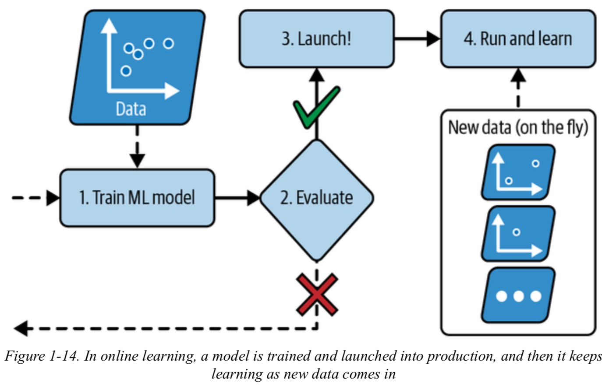
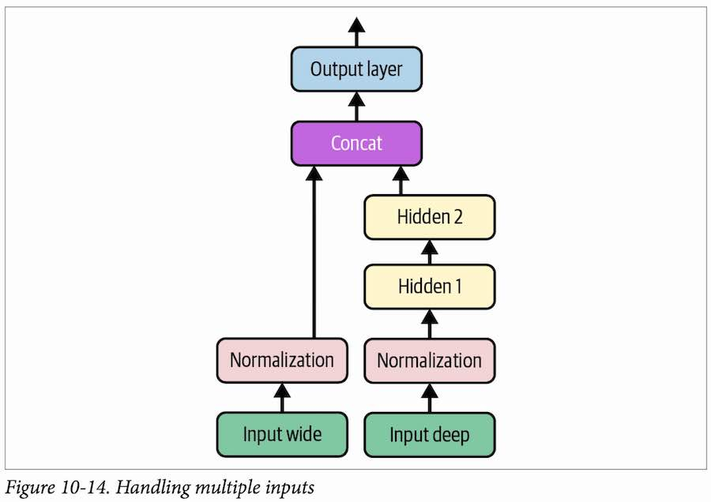
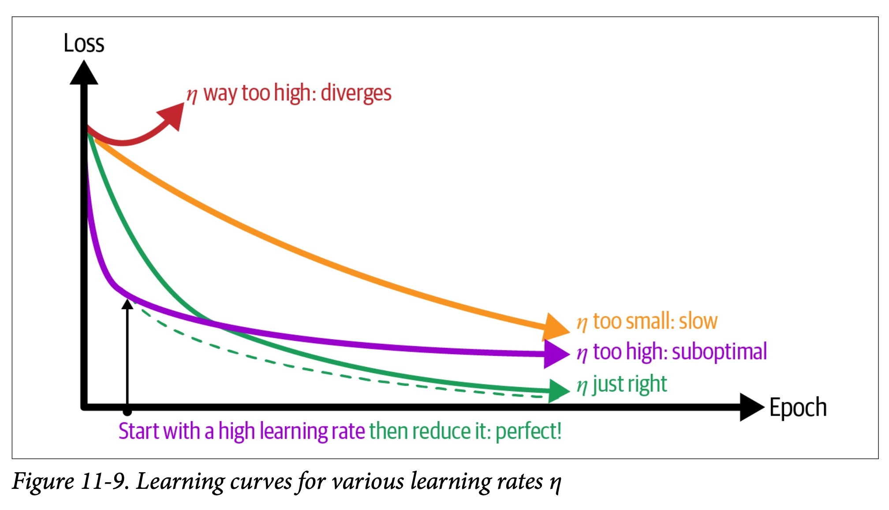
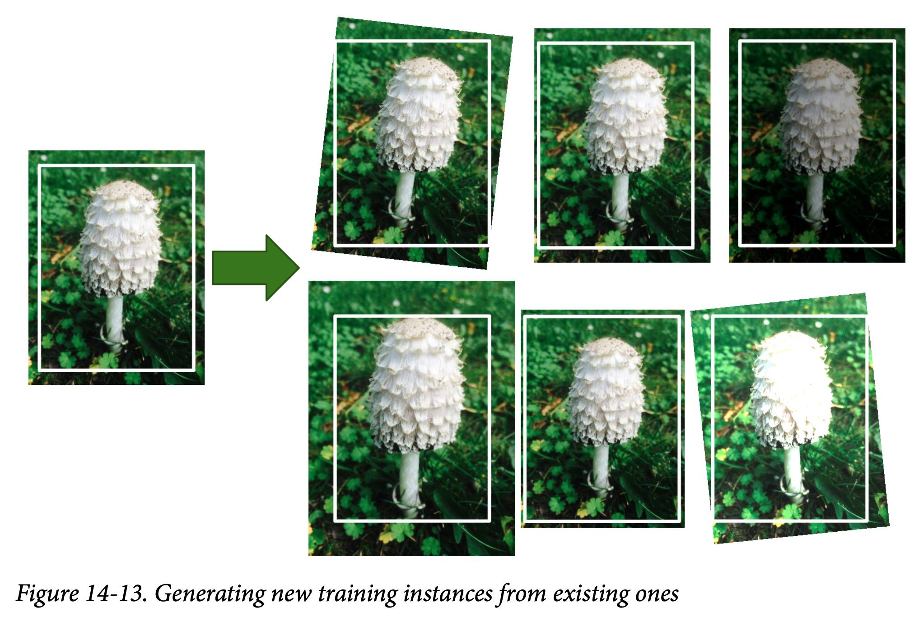
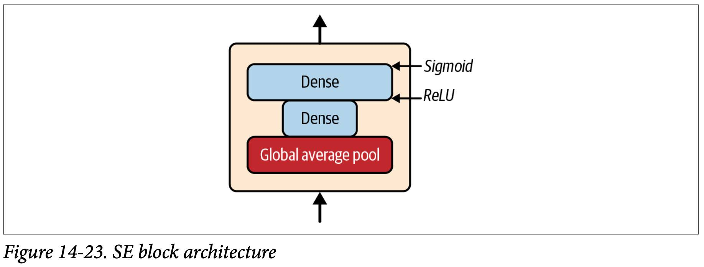

# The Machine Learning Landscape
## What Is Machine Learning?
"[Machine Learning is the] field of study that gives computers the ability to **learn** without being explicitly programmed."

"A computer program is said to learn from experience E with respect to some task T and some performance measure P, if its performance on T, as measured by P, improves with experience E."


The examples that the system uses to learn are called the **training set**. Each training example is called a training instance (or *sample*). The part of a machine learning system that learns and makes predictions is called a **model**.


ML models can be inspected to see what they have learned. Sometimes this will reveal unsuspected correlations or new trends, and thereby lead to a better understanding of the problem. Digging into large amounts of data to discover hidden patterns is called **data mining**, and machine learning excels at it.


Machine learning is great for:
- Problems for which existing solutions require a lot of fine-tuning or long lists of rules.
- *Fluctuating* environments.
- Getting insights about *complex problems and large amounts of data*.

## Examples of Applications
- Analyzing images of products on a production line to automatically *classify* them: CNNs or sometimes **transformers**.
- Detecting tumors in brain scans: CNNs or transformers.
- Automatically classifying news articles: NLP, text classification using RNNs and CNNs, but transformers work even better.
- Automatically flagging offensive comments on discussion forums: NLP tools.
- **Summarizing** long documents automatically: text summarization, using the same tools.
- Creating a **chatbot** or a personal assistant: natural language understanding (NLU).
- **Forecasting** your company’s revenue next year: regression model, use RNNs, CNNs, or transformers.
- Making your app react to **voice commands**: RNNs, CNNs, or transformers.
- Detecting credit card fraud: *anomaly detection*, using isolation forests, Gaussian mixture models. or autoencoders.
- Segmenting clients based on their purchases: **clustering**, using *k-means*, *DBSCAN*.
- Representing a complex, high-dimensional dataset in a clear and insightful diagram: data visualization, often involving **dimensionality reduction** techniques.
- Recommending a product: recommender system, ANNs.
- Intelligent bot for a game: reinforcement learning (RL) that trains agents (such as bots) to pick the actions that will maximize their rewards over time. The famous *AlphaGo* program that beat the world champion at the game of Go was built using RL.

## Types of Machine Learning Systems
- How they are **supervised during training** (*supervised*, *unsupervised*, *semi-supervised*, *self-supervised*, and others).
- Whether or not they can **learn incrementally on the fly** (*online* versus *batch* learning).
- Whether they work by simply *comparing new data points to known data points*, or instead by *detecting patterns* in the training data and building a predictive model, much like scientists do (*instance-based* versus *model-based* learning)

### Training Supervision
ML systems can be classified according to the amount and type of supervision they get during training.
#### Supervised learning
**The training set you feed to the algorithm includes the desired solutions, called labels**.
A typical supervised learning task is classification. The *spam filter* is a good example of this.


Another typical task is to predict a target numeric value. This sort of task is called **regression**. To train the system, you need to give it many examples of cars, including both their **features** and their **targets** (i.e., their prices).


**Logistic regression** is commonly used for **classification**, as it can output a value that corresponds to the *probability* of belonging to a given class.


The term **target** is more common in regression tasks and label is more common in classification tasks. Moreover, features are sometimes called **predictors** or **attributes**.

#### Unsupervised learning
In unsupervised learning the training data is unlabeled. **The system tries to learn without a teacher**.
You may want to run a clustering algorithm to try to detect groups of similar visitors. At no point do you tell the algorithm which group a visitor belongs to: **it finds those connections without your help**.

If you use a *hierarchical clustering* algorithm, it may also subdivide each group into smaller groups.


**Visualization algorithms** are also good examples of unsupervised learning: you feed them a lot of complex and unlabeled data, and they output a 2D or 3D representation of your data that can easily be plotted.


A related task is **dimensionality reduction**, in which the goal is to **simplify the data without losing too much information**. One way to do this is to *merge several correlated features into one*.

*Tip*: It is often a good idea to try to reduce the number of dimensions in your training data using a dimensionality reduction algorithm **before you feed it to another machine learning algorithm**. It will run much *faster*, the data will take up *less disk and memory space*, and in some cases it may also **perform better**.

**Anomaly detection**: prevent fraud, catching manufacturing defects, automatically removing outliers from a dataset. The system is *shown mostly normal instances during training*, so it learns to recognize them; then, when it sees a new instance, it can tell whether it looks like a normal one or whether it is likely an anomaly. A very similar task is **novelty detection**: it aims to detect new instances that look different from all instances in the training set. This requires having a very "clean" training set.


Another common unsupervised task is **association rule learning**, in which the goal is to dig into large amounts of data and *discover interesting relations between attributes*.

#### Semi-supervised learning
You will often have plenty of unlabeled instances, and few labeled instances. Some algorithms can deal with data that’s **partially labeled**. This is called semi-supervised learning.


I.e., in your photo album the same person A shows up in photos 1, 5, and 11, while another person B shows up in photos 2, 5, and 7. Now all the system needs is for you to tell it who these people are. Just add one label per person and it is able to name everyone in every photo.

A clustering algorithm may be used to group similar instances together, and then every unlabeled instance can be labeled with the most common label in its cluster. Once the whole dataset is labeled, it is possible to use any supervised learning algorithm.

#### Self-supervised learning
Involves actually **generating a fully labeled dataset from a fully unlabeled one**. Once the whole dataset is labeled, any supervised learning algorithm can be used.

If you have a large dataset of unlabeled images, you can *randomly mask a small part of each image* and then train a model to recover the original image. **During training, the masked images are used as the inputs to the model, and the original images are used as the labels**.


More often than not, a model trained using self-supervised learning is not the final goal. If you have a large dataset of unlabeled photos of pets, you can start by training an image-repairing model using self-supervised learning. Once it’s performing well, it should be able to distinguish different pet species. It is then possible to tweak the model so that it predicts pet species instead of repairing images. The final step consists of fine-tuning the model on a labeled dataset: the model already knows what species look like, so this step is only needed so **the model can learn the mapping between the species it already knows and the labels we expect from it**.

Self-supervised learning focuses on the same tasks as supervised learning: *mainly classification and regression*.

#### Reinforcement learning
The learning system, called an agent in this context, can observe the environment, select and perform actions, and get rewards in return (or penalties in the form of negative rewards. **It must then learn by itself what is the best strategy, called a policy, to get the most reward over time**.


Many robots implement reinforcement learning algorithms to learn how to walk. *DeepMind’s AlphaGo* program is also a good example of reinforcement learning.

### Batch Versus Online Learning
Another criterion used to classify machine learning systems is **whether or not the system can learn incrementally from a stream of incoming data**.

#### Batch learning
In batch learning, the system is **incapable of learning incrementally: it must be trained using all the available data**. This will generally take a lot of time and computing resources, so it is typically done offline. First the system is trained, and then it is launched into production and runs without learning anymore; it just applies what it has learned. This is called **offline learning**.

A model’s performance tends to decay slowly over time, simply because the world continues to evolve while the model remains unchanged. This phenomenon is often called *model rot* or *data drift*.

Simply update the data and train a new version of the system from scratch as often as needed.

If you have a lot of data and you automate your system to train from scratch every day, it will end up costing you a lot of money. If the amount of data is huge, it may even be impossible to use a batch learning algorithm.

A better option in all these cases is to use algorithms that are capable of learning incrementally.

#### Online learning (incremental learning)
You train the system *incrementally* by feeding it data instances sequentially, either individually or in small groups called mini-batches. Each learning step is fast and cheap, so the system can learn about new data on the fly, as it arrives.



Online learning is useful for systems that need to adapt to change extremely rapidly or if you have limited computing resources.
Can be used to train models on huge datasets that cannot fit in one machine’s main memory (this is called *out-of-core learning*).


How fast they should adapt to changing data: this is called the **learning rate**.
If you set a low learning rate, the system will have more inertia; that is, it will learn more slowly, but it will also be less sensitive to noise in the new data or to sequences of nonrepresentative data points (outliers).

### Instance-Based Versus Model-Based Learning
One more way to categorize machine learning systems is by how they **generalize**. The true goal is to perform well on new instances.

There are two main approaches to generalization: *instance-based* learning and *model-based* learning.

#### Instance-based learning
Your spam filter could be programmed to also flag emails that are very similar to known spam emails. This requires a measure of similarity between two emails.

Instance-based learning: **the system learns the examples by heart, then generalizes to new cases by using a similarity measure to compare them to the learned examples**.

Instead of performing explicit generalization, compare new problem instances with instances seen in training, which have been stored in memory. Because computation is postponed until a new instance is observed, these algorithms are sometimes referred to as "*lazy*."
Examples of instance-based learning algorithms are the **k-nearest neighbors algorithm**, kernel machines and RBF networks.


#### Model-based learning and a typical machine learning workflow
Build a model of these examples and then use that model to make predictions.


For example, you see the plot in fig. 1-18 and then you decide to model life satisfaction as a linear function of GDP per capita. This step is called **model selection**: you selected a linear model of life satisfaction with just one attribute, GDP per capita.


Using this equation:


Before you can use your model, you need to define the parameter values θ<sub>0</sub> and θ<sub>1</sub>. How can you know which values will make your model perform best? To answer this question, you need to specify a **performance measure**.

You can either define a *utility function* (or fitness function) that measures how good your model is, or you can define a **cost function** that measures *how bad it is*. For linear regression problems, people typically use a cost function that measures the distance between the linear model’s predictions and the training examples; **the objective is to minimize this distance**.

This is where the linear regression algorithm comes in: **you feed it your training examples, and it finds the parameters that make the linear model fit best to your data**. This is called **training** the model.

Training a model means running an algorithm to **find the model parameters** that will make it best fit the training data, and hopefully make good predictions on new data.


If all went well, your model will make good predictions. If not, you may need to use more attributes, get more or better-quality training data, or perhaps select a more powerful model.

In summary:
- You studied the data.
- You selected a model.
- You trained it on the training data (i.e., the learning algorithm searched for the model parameter values that minimize a cost function).
- Finally, you applied the model to make predictions on new cases (this is called **inference**), hoping that this model will generalize well.

## Main Challenges of Machine Learning
The two things that can go wrong are "bad model" and "bad data".

### Insufficient Quantity of Training Data
Even for very simple problems you typically need thousands of examples, and for complex problems such as image or speech recognition you may need millions of examples (unless you can reuse parts of an existing model).

### Nonrepresentative Training Data
it is crucial that your training data be representative of the new cases you want to generalize to.


If you train a linear model on this data, you get the solid line, while the old model is represented by the dotted line. It makes it clear that such a simple linear model is probably never going to work well.
By using a nonrepresentative training set, you trained a model that is unlikely to make accurate predictions.
**It is crucial to use a training set that is representative of the cases you want to generalize to**. If the sample is too small, you will have *sampling noise* (i.e., nonrepresentative data as a result of chance), but even very large samples can be nonrepresentative if the sampling method is flawed. This is called **sampling bias**.

### Poor-Quality Data
It is often well worth the effort to spend time cleaning up your training data.
- If some instances are clearly **outliers**, it may help to simply **discard them or try to fix the errors manually**.
- If some instances are **missing a few features** (e.g., 5% of your customers did not specify their age), you must decide whether you want to **ignore this attribute** altogether, **ignore these instances**, **fill in the missing values** (e.g., with the median age), *or train one model with the feature and one model without it*.

### Irrelevant Features
A critical part of the success of a machine learning project is coming up with a good set of features to train on. This process, called feature engineering.
- Feature selection (selecting the most useful features).
- Feature extraction (combining existing features to produce a more useful one).
- Creating new features by gathering new data.

### Overfitting the Training Data
Overgeneralizing is something that we humans do all too often, and unfortunately machines can fall into the same trap if we are not careful. In machine learning this is called **overfitting: it means that the model performs well on the training data, but it does not generalize well**.

If the training set is noisy, or if it is too small, which introduces sampling noise, then the model is likely to detect patterns in the noise itself.
Overfitting happens when the model is too complex relative to the amount and noisiness of the training data. Here are possible solutions:
- Simplify the model by selecting one with fewer parameters, by reducing the number of attributes in the training data, or by constraining the model.
- Gather more training data.
- Reduce the noise in the training data.

**Constraining a model to make it simpler and reduce the risk of overfitting is called regularization**. For example, the linear model we defined earlier has two parameters, θ<sub>0</sub> and θ<sub>1</sub>. This gives the learning algorithm two degrees of freedom to adapt the model to the training data: it can tweak both the height (θ<sub>0</sub>) and the slope (θ<sub>1</sub>) of the line. You want to find the right balance between fitting the training data perfectly and keeping the model simple enough to ensure that it will generalize well.

In the next figure the dashed line is a model trained with the same data as the first model (simple with partial data) but with a regularization constraint. You can see that regularization forced the model to have a smaller slope: this model does not fit the training data (circles) as well as the first model, but it actually generalizes better to new examples that it did not see during training (squares).


The amount of regularization to apply during learning can be controlled by a hyperparameter. **A hyperparameter is a parameter of a learning algorithm (not of the model)**. As such, it is not affected by the learning algorithm itself; it must be set prior to training and remains constant during training.

### Underfitting the Training Data
Underfitting is the opposite of overfitting: it occurs when your model is too simple to learn the underlying structure of the data.

Here are the main options for fixing this problem:
- Select a more powerful model, with more parameters.
- Feed better features to the learning algorithm (feature engineering).
- Reduce the constraints on the model (for example by reducing the regularization hyperparameter).

### Stepping Back
- Machine learning is about making machines get better at some task by learning from data, instead of having to explicitly code rules.
- Different types of ML systems: supervised or not, batch or online, instance-based or model-based.
- If the algorithm is model-based, it tunes some parameters to fit the model to the training set. If the algorithm is instance-based, it just learns the examples by heart and generalizes to new instances by using a similarity measure to compare them to the learned instances.
- The system will not perform well if your training set is too small, or if the data is not representative, is noisy, or is polluted with irrelevant features. Your model needs to be neither too simple (in which case it will underfit) nor too complex (in which case it will overfit).

## Testing and Validating
Split your data into two sets: the *training set and the test set*. The error rate on new cases is called the generalization error (or out-of-sample error), and by evaluating your model on the test set, you get an estimate of this error. **This value tells you how well your model will perform on instances it has never seen before**.

If the training error is low (i.e., your model makes few mistakes on the training set) but the generalization error is high, it means that your model is overfitting the training data.

Tip: It is common to use 80% of the data for training and hold out 20% for testing. However, this depends on the size of the dataset.

### Hyperparameter Tuning and Model Selection
Suppose that you want to apply some regularization to avoid overfitting. The question is, how do you choose the value of the regularization hyperparameter? One option is to train 100 different models using 100 different values for this hyperparameter.

The problem is that you measured the generalization error multiple times on the test set, and **you adapted the model and hyperparameters to produce the best model for that particular set**. This means the model is unlikely to perform as well on new data.

#### Holdout validation
A common solution to this problem is called **holdout validation**: you simply hold out part of the training set to evaluate several candidate models and select the best one. The new held-out set is called the **validation set** (or the development set, or *dev set*).
You train multiple models with various hyperparameters on the reduced training set and you select the model that performs best on the validation set. After this holdout validation process, you train the best model on the full training set (including the validation set), and this gives you the final model. Lastly, you evaluate this final model on the test set to get an estimate of the generalization error.


##### Cross-validation
If the **validation set is too small** you can use cross-validation, using **many small validation sets**. Each model is evaluated once per validation set after it is trained on the rest of the data. By **averaging out all the evaluations** of a model, you get a much more accurate measure of its performance. There is a drawback, however: the training time is multiplied by the number of validation sets.

### Data Mismatch
**Both the validation set and the test set must be as representative as possible of the data you expect to use in production**, so they should be composed exclusively of representative pictures: you can shuffle them and put half in the validation set and half in the test set.

When **real data is scarce** (right) —e.g., from a specific app—, you may use similar abundant data (left) —e.g., from the internet— for training and hold out some of it in a **train-dev set to evaluate overfitting**; the real data is then used to evaluate data mismatch (dev set) and to evaluate the final model’s performance (test set).


**No Free Lunch Theorem**
A model is a simplified representation of the data. The simplifications are meant to discard the superfluous details that are unlikely to generalize to new instances. When you select a particular type of model, you are implicitly making assumptions about the data. For example, if you choose a linear model, you are implicitly assuming that the data is fundamentally linear and that the distance between the instances and the straight line is just noise, which can safely be ignored.
**For some datasets the best model is a linear model, while for other datasets it is a neural network. There is no model that is a priori guaranteed to work better**.

# End-to-End Machine Learning Project

## Look at the Big Picture

Your model should learn from this data and be able to predict the median housing price in any district, given all the other metrics.

### Frame the Problem
Knowing the objective is important because it will determine how you frame the problem, which algorithms you will select, which performance measure you will use to evaluate your model, and how much effort you will spend tweaking it.

**The current situation will often give you a reference for performance**, as well as insights on how to solve the problem.

In cases where they manage to find out the actual median housing price, they often realize that their estimates were off by more than 30%. This is why the company thinks that it would be useful to train a model to predict a district’s median housing price, given other data about that district.

------
***Pipelines***
**A sequence of data processing components** is called a data pipeline.
Each component is fairly **self-contained**: **the interface between components is simply the data store**.
This makes the architecture quite robust.

------

This is clearly a typical **supervised learning task**, since the model can be **trained with labeled examples**.
It is a typical **regression task**, since the model will be **asked to predict a value**.
There is no continuous flow of data coming into the system, there is *no particular need to adjust to changing data rapidly*, and the data is small enough to fit in memory, so plain batch learning should do just fine.

#### Select a Performance Measure
##### RMSE
**A typical performance measure for regression problems is the root mean square error (RMSE)**. It gives an idea of **how much error the system typically makes in its predictions, with a higher weight given to large errors**.


Wherer `x`<sup>`(i)`</sup> is a vector of all the feature values (excluding the label) of the `i`th instance in the dataset, and `y`<sup>`(i)`</sup> is its label (the desired output value for that instance), and `h` is your *system's prediction function*, also called a **hypothesis**.

We use lowercase italic font for scalar values (such as `m` or `y`<sup>`(i)`</sup>) and function names (such as `h`), lowercase bold font for vectors (such as **`x`**<sup>`(i)`</sup>), and uppercase bold font for matrices (such as **`X`**).

This corresponds to the **Euclidean norm** and is also called the **l<sub>2</sub> norm**.

##### MAE
If there are many **outlier** districts. In that case, you may consider using the mean absolute error (**MAE**, also called the average absolute deviation).


This corresponds to the **l<sub>1</sub> norm**.

Both the RMSE and the MAE are ways to measure the **distance between two vectors: the vector of predictions and the vector of target values**.

***The higher the norm index, the more it focuses on large values and neglects small ones***. This is why the **RMSE is more sensitive to outliers than the MAE**. But when outliers are exponentially rare (like in a bell-shaped curve), the RMSE performs very well and is generally preferred.

### Take a Quick Look at the Data Structure
- **Standard deviation**: which measures how dispersed the values are. When a feature has a bell-shaped normal distribution (also called a Gaussian distribution), which is very common, the **"68-95-99.7" rule** applies: about 68% of the values fall within 1σ of the mean, 95% within 2σ, and 99.7% within 3σ.
- **Percentiles**: indicates the value below which a given percentage of observations in a group of observations fall.
- A **histogram** shows the number of instances (on the vertical axis) that have a given value range (on the horizontal axis).


- Working with preprocessed attributes is common in machine learning, and it is not necessarily a problem, but you should try to understand how the data was computed.
- These attributes have very different scales.
- Many histograms are skewed right: you’ll try transforming these attributes to have more symmetrical and bell-shaped distributions.

### Create a Test Set
Creating a test set is theoretically simple; pick some instances randomly, typically 20% of the dataset (or less if your dataset is very large), and set them aside. Set the random number generator’s seed before calling `np.random.permutation()` so that it always generates the same shuffled indices.

To have a stable train/test split even after updating the dataset, a common solution is to use each instance’s identifier to decide whether or not it should go in the test set (assuming instances have unique and immutable identifiers). For example, you could compute a hash of each instance’s identifier and put that instance in the test set if the hash is lower than or equal to 20% of the maximum hash value. This ensures that the test set will remain consistent across multiple runs, even if you refresh the dataset.

If you use the row index as a unique identifier, you need to make sure that new data gets appended to the end of the dataset and that no row ever gets deleted. If this is not possible, then you can try to use the most stable features to build a unique identifier.

The function `train_test_split()` has a `random_state` parameter that allows you to set the random generator seed. You can pass it multiple datasets with an identical number of rows, and it will split them on the same indices.

#### Stratified sampling
The population is divided into homogeneous subgroups called strata, and the right number of instances are sampled from each stratum to **guarantee that the test set is representative of the overall population**.

It is important to have a sufficient number of instances in your dataset for each stratum, or else the estimate of a stratum's importance may be biased. This means that you should not have too many strata, and each stratum should be large enough.

The `sklearn.model_selection` package that implement various strategies to split your dataset into a training set and a test set. The `train_test_split()` function with the `stratify` argument:
```python
strat_train_set, strat_test_set = train_test_split(
    housing, test_size=0.2, stratify=housing["income_cat"], random_state=42)
```

**Test set generation is an often neglected but critical part of a machine learning project.**

## Explore and Visualize the Data to Gain Insights
### Look for Correlations
You can easily compute the standard correlation coefficient (also called **Pearson’s r**) between every pair of attributes using the `corr()` method.

The correlation coefficient ranges from –1 to 1. When it is **close to 1, it means that there is a strong positive correlation**; for example, the median house value tends to go up when the median income goes up. When **the coefficient is close to –1, it means that there is a strong negative correlation**; you can see a small negative correlation between the latitude and the median house value (i.e., prices have a slight tendency to go down when you go north). Finally, **coefficients close to 0 mean that there is no linear correlation**.


The most promising attribute to predict the median house value is the median income.


The correlation is indeed quite strong; you can clearly see the upward trend, and the points are not too dispersed.

You may want to try removing the corresponding districts with a visible horizontal line (around $450,000, $350,000, etc.) to prevent your algorithms from learning to reproduce these data quirks.

The correlation coefficient only measures linear correlations (“as x goes up, y generally goes up/down”). Note how all the plots of the bottom row have a correlation coefficient equal to 0, despite the fact that their axes are clearly not independent: these are examples of **nonlinear relationships**. Where the correlation coefficient is equal to 1 or –1 this has nothing to do with the slope.


## Prepare the Data for Machine Learning Algorithms
You should also separate the predictors and the labels, since you don’t necessarily want to apply the same transformations to the predictors and the target values.
```python
housing = strat_train_set.drop("median_house_value", axis=1)
housing_labels = strat_train_set["median_house_value"].copy()
```
### Clean the Data
Most machine learning algorithms cannot work with missing features. An option to fix this is to set the missing values to some value (zero, the mean, the median, etc.). This is called **imputation**.

You can use a handy Scikit-Learn class: `SimpleImputer`.
```python
from sklearn.impute import SimpleImputer

imputer = SimpleImputer(strategy="median")
# The median can only be computed on numerical attributes
housing_num = housing.select_dtypes(include=[np.number])

imputer.fit(housing_num)

X = imputer.transform(housing_num)
```

There are also more powerful imputers available in the `sklearn.impute` package:
- `KNNImputer` replaces each missing value with the mean of the **k-nearest neighbors**’ values for that feature.
- `IterativeImputer` trains a regression model per feature to predict the missing values based on all the other available features.

---
**Scikit-Learn Design**
Scikit-Learn’s API is remarkably well designed.
- Consistency: All objects share a consistent and simple interface.
    - **Estimators**: Any object that can estimate some parameters based on a dataset is called an estimator (e.g., a `SimpleImputer` is an estimator).
    - **Transformers**: Some estimators (such as a `SimpleImputer`) can also transform a dataset; these are called transformers.
    - **Predictors**: Finally, some estimators, given a dataset, are capable of making predictions; they are called predictors (e.g. `LinearRegression`). A predictor has a `predict()` method that takes a dataset of new instances and returns a dataset of corresponding predictions. It also has a `score()` method that measures the quality of the predictions, given a test set.
- Inspection: All the estimator’s hyperparameters are accessible directly via public instance variables (e.g., `imputer.strategy`), and all the estimator’s learned parameters are accessible via public instance variables with an underscore suffix (e.g., `imputer.statistics_`).
- Nonproliferation of classes
- Composition: it is easy to create a `Pipeline` estimator from an arbitrary sequence of transformers followed by a final estimator.
- Sensible defaults
---

### Handling Text and Categorical Attributes
Most machine learning algorithms prefer to work with numbers, so let’s convert these categories from text to numbers. For this, we can use Scikit-Learn’s OrdinalEncoder class:
```python
from sklearn.preprocessing import OrdinalEncoder

ordinal_encoder = OrdinalEncoder()
housing_cat_encoded = ordinal_encoder.fit_transform(housing_cat)

>>> housing_cat_encoded[:8]
array([[3.],
        [0.],
        [1.],
        [1.],
        [4.],
        [1.],
        [0.],
        [3.]])
```
One issue with this representation is that ML algorithms will assume that two nearby values are more similar than two distant values.
To fix this issue, a common solution is to create **one-hot encoding**.
Scikit-Learn provides a OneHotEncoder class to convert categorical values into one-hot vectors:
```python
from sklearn.preprocessing import OneHotEncoder

cat_encoder = OneHotEncoder()
housing_cat_1hot = cat_encoder.fit_transform(housing_cat)
```
A sparse matrix is a very efficient representation for matrices that contain mostly zeros. Indeed, internally it only stores the nonzero values and their positions. It will save plenty of memory and speed up computations.

Tip: If a categorical attribute has a large number of possible categories (e.g., country code, profession, species), then one-hot encoding will result in a large number of input features. When dealing with neural networks, you can replace each category with a learnable, low-dimensional vector called an embedding.


# Introduction to Artificial Neural Networks with Keras
Artificial neural networks (**ANNs**), machine learning models inspired by the networks of biological neurons found in our brains.
TensorFlow’s Keras API: This is a beautifully designed and simple high-level API for building, training, evaluating, and running neural networks. It is expressive and flexible enough to let you build a wide variety of neural network architectures.
Even you can always write custom Keras components using its lower-level API, or even use TensorFlow directly.

## From Biological to Artificial Neurons
McCulloch and Pitts presented a simplified computational model of how biological neurons might work together in animal brains to perform complex computations using propositional logic. **This was the first artificial neural network architecture**.
ANNs entered a **long winter**. By the 1990s other powerful machine learning techniques had been invented, such as *support vector machines*. So once again the study of neural networks was put on hold.

**For larger neural networks the local optima often perform almost as well as the global optimum**.

## Biological Neurons
It’s composed of a cell body containing the nucleus and many branching extensions called **dendrites**, plus one very long extension called the **axon**. Near its extremity the axon splits off into many branches called **synapses**, which are connected to the dendrites or cell bodies of other neurons. Biological neurons produce short electrical impulses called **action potentials** (signals), which travel along the axons and make the synapses release chemical signals called neurotransmitters. When a neuron receives a sufficient amount of these neurotransmitters within a few milliseconds, it fires its own electrical impulses. Meurons are often organized in consecutive **layers**.

### The Multilayer Perceptron and Backpropagation


When an ANN contains a deep stack of hidden layers it is called a **deep neural network** (DNN). The field of **deep learning** studies DNNs.

#### Backpropagation
In 1970 Seppo Linnainmaa introduced the algorithm which is now called **reverse-mode automatic differentiation**. In just two passes through the network (one forward, one backward), it is **able to compute the gradients of the neural network’s error** with regard to every single model parameter. In other words, it can find out how each connection weight and each bias should be tweaked in order to reduce the neural network’s error.
This combination of reverse-mode autodiff and gradient descent is now called **backpropagation** (or backprop for short).

In 1985, David Rumelhart, Geoffrey Hinton, and Ronald Williams published a paper analyzing how backpropagation allowed neural networks to learn useful internal representations. Their results were so impressive that **backpropagation was quickly popularized in the field**. Today, it is by far the **most popular training technique for neural networks**.

Steps:
- It handles one mini-batch at a time. Each pass is called an **epoch**.
- The algorithm then computes the output of all the neurons in the first hidden layer, for every instance in the mini-batch. The result is passed on to the next layer, ... This is the **forward pass**. All intermediate results are preserved since they are needed for the backward pass.
- The algorithm measures the network’s **output error**.
- Computes **how much each output bias and each connection to the output layer contributed to the error**. This is done analytically by applying the **chain rule**.
- Measures how much of these error contributions came from each connection in the layer below. Propagates the error gradient backward through the network.
- The algorithm performs a gradient descent step to **tweak all the connection weights** in the network, using the error gradients it just computed.

Tip: It is important to **initialize all the hidden layers’ connection weights randomly**, or your model will **act as if it had only one neuron per layer**: it won’t be too smart.

Why do we need activation functions in the first place? Well, **if you chain several linear transformations, all you get is a linear transformation**. So if you don’t have some nonlinearity between layers, then **even a deep stack of layers is equivalent to a single layer**, and you can’t solve very complex problems with that.

### Regression MLPs
If you want to predict a single value then you just need a single output neuron: its output is the predicted value. For multivariate regression you need one output neuron per output dimension.

The MLPRegressor class uses the **mean squared error, which is usually what you want for regression**, but if you have a lot of outliers in the training set, you may prefer to use the mean absolute error instead. *Huber loss* is a combination of both: it is quadratic when the error is smaller than a threshold δ (typically 1) but linear when the error is larger than δ. The linear part makes it less sensitive to outliers than the mean squared error, and the quadratic part allows it to converge faster and be more precise than the mean absolute error.

### Classification MLPs
For a binary classification problem, you just need a single output neuron using the sigmoid activation function: the output will be a number between 0 and 1, which you can interpret as the estimated probability of the positive class. More generally, you would dedicate one output neuron for each positive class.
If each instance can belong only to a single class, then you need to have one output neuron per class, and you should use the **softmax activation function** for the whole output layer. The softmax function will **ensure that all the estimated probabilities are between 0 and 1 and that they add up to 1**, since the classes are exclusive. This is called multiclass classification.
Regarding the loss function, **since we are predicting probability distributions, the cross-entropy loss** is generally a good choice.


## Implementing MLPs with Keras
Keras is TensorFlow’s **high-level deep learning API**: it allows you to build, train, evaluate, and execute all sorts of neural networks.
Keras was officially chosen as its preferred high-level API when TensorFlow 2 came out. Installing TensorFlow will automatically install Keras as well, and Keras will not work without TensorFlow installed.

### Building an Image Classifier Using the Sequential API
#### Using Keras to load the dataset
```python
import tensorflow as tf

fashion_mnist = tf.keras.datasets.fashion_mnist.load_data()
(X_train_full, y_train_full), (X_test, y_test) = fashion_mnist
X_train, y_train = X_train_full[:-5000], y_train_full[:-5000]
X_valid, y_valid = X_train_full[-5000:], y_train_full[-5000:]

X_train, X_valid, X_test = X_train / 255., X_valid / 255., X_test / 255.
```

#### Creating the model using the sequential API
```python
# make the results reproducible
# tf.keras.utils.set_ran dom_seed() conveniently sets the random seeds for TensorFlow, Python and NumPy
tf.random.set_seed(42)
model = tf.keras.Sequential()
# To determine the shape of the connection weight matrix of the first hidden layer
model.add(tf.keras.layers.InputLayer(input_shape=[28, 28]))
# Its role is to convert each input image into a 1D array
# You can also drop the Input layer and instead specify the input_shape in the first layer (input_shape=[28, 28])
model.add(tf.keras.layers.Flatten())
model.add(tf.keras.layers.Dense(300, activation="relu"))
model.add(tf.keras.layers.Dense(100, activation="relu"))
model.add(tf.keras.layers.Dense(10, activation="softmax"))
```
Dense layers often have a lot of parameters. This gives the model quite a lot of flexibility to fit the training data, but it also means that the model runs the risk of overfitting, especially when you do not have a lot of training data.

You can easily get a model’s list of layers using the `layers` attribute, or use the `get_layer()` method to access a layer by name.
All the parameters of a layer can be accessed using its `get_weights()` and `set_weights()` methods (connection weights and the bias terms).

If you do not specify the input shape, it’s OK: Keras will simply wait until you feed it some data (e.g., during training), or when you call its `build()` method.

#### Compiling the model
After a model is created, you must call its `compile()` method to specify the loss function and the optimizer to use.
```python
model.compile(loss="sparse_categorical_crossentropy",
              optimizer="sgd",
              metrics=["accuracy"])
```
We use the "`sparse_categorical_crossentropy`" loss because we have **sparse labels** (i.e., for each instance, *there is just a target class index*, from 0 to 9 in this case), and **the classes are exclusive**. If instead we had **one target probability per class** for each instance (such as one-hot vectors, e.g., `[0., 0., 0., 1., 0., 0., 0., 0., 0., 0.]` to represent class 3), then we would need to use the "`categorical_crossentropy`" loss instead. If we were doing binary classification or multilabel binary classification, then we would use the "`sigmoid`" activation function in the output layer instead of the "`softmax`" activation function, and we would use the "`binary_crossentropy`" loss.
If you want to convert sparse labels (i.e., class indices) to one-hot vector labels, use the `tf.keras.utils.to_categorical()` function.
```python
tf.keras.utils.to_categorical([0, 5, 1, 0], num_classes=10)
```

#### Training and evaluating the model
```python
history = model.fit(X_train, y_train, epochs=30, validation_data=(X_valid, y_valid))
```

If the performance on the training set is much better than on the validation set, your model is probably overfitting the training set.
The `class_weight` argument of the `fit()` method gives a larger weight to underrepresented classes and a lower weight to overrepresented classes. These weights would be used by Keras when computing the loss.
`sample_weight`: **if some instances were labeled by experts** while others were labeled using a crowdsourcing platform.

`History` object has the dictionary (`history.history`) containing the loss and extra metrics it measured at the end of each epoch on the training set and on the validation set.
**The validation error is computed at the end of each epoch**, while the **training error is computed using a running mean during each epoch**, so the training curve should be shifted by half an epoch to the left.

Once you are satisfied with your model’s validation accuracy, you should evaluate it on the test set to estimate the generalization error using the `evaluate()` method.
```python
model.evaluate(X_test, y_test)
```
**It is common to get slightly lower performance on the test set than on the validation set, because the hyperparameters are tuned on the validation set**.

### Building a Regression MLP Using the Sequential API
The main differences in the following code example are the fact that the output layer has a single neuron and it uses no activation function, the loss function is the mean squared error, the metric is the RMSE, and we’re using an Adam optimizer. We don’t need a `Flatten` layer, and instead we’re using a `Normalization` layer as the first layer and it must be fitted to the training data using its `adapt()` method before you call the model’s `fit()` method.
```python
tf.random.set_seed(42)
norm_layer = tf.keras.layers.Normalization(input_shape=X_train.shape[1:])
model = tf.keras.Sequential([
    norm_layer,
    tf.keras.layers.Dense(50, activation="relu"),
    tf.keras.layers.Dense(50, activation="relu"),
    tf.keras.layers.Dense(50, activation="relu"),
    tf.keras.layers.Dense(1)
])
optimizer = tf.keras.optimizers.Adam(learning_rate=1e-3)
model.compile(loss="mse", optimizer=optimizer, metrics=["RootMeanSquaredError"])
norm_layer.adapt(X_train)

history = model.fit(X_train, y_train, epochs=20, validation_data=(X_valid, y_valid))
```

### Building Complex Models Using the Functional API
One example of a nonsequential neural network is a Wide & Deep neural network.


```python
normalization_layer = tf.keras.layers.Normalization()
hidden_layer1 = tf.keras.layers.Dense(30, activation="relu")
hidden_layer2 = tf.keras.layers.Dense(30, activation="relu")
concat_layer = tf.keras.layers.Concatenate()
output_layer = tf.keras.layers.Dense(1)

input_ = tf.keras.layers.Input(shape=X_train.shape[1:])
normalized = normalization_layer(input_)
hidden1 = hidden_layer1(normalized)
hidden2 = hidden_layer2(hidden1)
# concatenate the input and the second hidden layer’s output
concat = concat_layer([normalized, hidden2])
output = output_layer(concat)

model = tf.keras.Model(inputs=[input_], outputs=[output])
```

**We use the layers just like functions**, passing it the previous results objects. **This is why this is called the functional API**. Note that we are just telling Keras how it should connect the layers together; **no actual data is being processed yet**. In other words, it’s a symbolic input. The outputs of calls are also symbolic: it’s just used to construct the model.

#### Handling multiple inputs



```python
input_wide = tf.keras.layers.Input(shape=[5])  # features 0 to 4
input_deep = tf.keras.layers.Input(shape=[6])  # features 2 to 7
norm_layer_wide = tf.keras.layers.Normalization()
norm_layer_deep = tf.keras.layers.Normalization()
norm_wide = norm_layer_wide(input_wide)
norm_deep = norm_layer_deep(input_deep)
hidden1 = tf.keras.layers.Dense(30, activation="relu")(norm_deep)
hidden2 = tf.keras.layers.Dense(30, activation="relu")(hidden1)
concat = tf.keras.layers.concatenate([norm_wide, hidden2])
output = tf.keras.layers.Dense(1)(concat)
model = tf.keras.Model(inputs=[input_wide, input_deep], outputs=[output])
```

When we call the `fit()` method, instead of passing a single input matrix `X_train`, we must pass a pair of matrices `(X_train_wide, X_train_deep)`, one per input.

```python
optimizer = tf.keras.optimizers.Adam(learning_rate=1e-3)
model.compile(loss="mse", optimizer=optimizer, metrics=["RootMeanSquaredError"])

X_train_wide, X_train_deep = X_train[:, :5], X_train[:, 2:]
X_valid_wide, X_valid_deep = X_valid[:, :5], X_valid[:, 2:]
X_test_wide, X_test_deep = X_test[:, :5], X_test[:, 2:]
X_new_wide, X_new_deep = X_test_wide[:3], X_test_deep[:3]

norm_layer_wide.adapt(X_train_wide)
norm_layer_deep.adapt(X_train_deep)
history = model.fit((X_train_wide, X_train_deep), y_train, epochs=20,
                    validation_data=((X_valid_wide, X_valid_deep), y_valid))
mse_test = model.evaluate((X_test_wide, X_test_deep), y_test)
y_pred = model.predict((X_new_wide, X_new_deep))
```

There are also many use cases in which you may want to have multiple outputs, for example, you may have multiple independent tasks based on the same data: in many cases you will get better results on all tasks by training a single neural network with one output per task. This is because the neural network can learn features in the data that are useful across tasks.


```python
input_wide = tf.keras.layers.Input(shape=[5])  # features 0 to 4
input_deep = tf.keras.layers.Input(shape=[6])  # features 2 to 7
norm_layer_wide = tf.keras.layers.Normalization()
norm_layer_deep = tf.keras.layers.Normalization()
norm_wide = norm_layer_wide(input_wide)
norm_deep = norm_layer_deep(input_deep)
hidden1 = tf.keras.layers.Dense(30, activation="relu")(norm_deep)
hidden2 = tf.keras.layers.Dense(30, activation="relu")(hidden1)
concat = tf.keras.layers.concatenate([norm_wide, hidden2])
output = tf.keras.layers.Dense(1)(concat)
aux_output = tf.keras.layers.Dense(1)(hidden2)
model = tf.keras.Model(inputs=[input_wide, input_deep],
                       outputs=[output, aux_output])

optimizer = tf.keras.optimizers.Adam(learning_rate=1e-3)
# Each output will need its own loss function
# We want to give the main output’s loss a much greater weight
model.compile(loss=("mse", "mse"), loss_weights=(0.9, 0.1), optimizer=optimizer,
              metrics=["RootMeanSquaredError"])

eval_results = model.evaluate((X_test_wide, X_test_deep), (y_test, y_test))
weighted_sum_of_losses, main_loss, aux_loss, main_rmse, aux_rmse = eval_results

y_pred_main, y_pred_aux = model.predict((X_new_wide, X_new_deep))
```

### Using the Subclassing API to Build Dynamic Models
Some models involve loops, varying shapes, conditional branching, and other dynamic behaviors.
With this approach, you subclass the `Model` class, create the layers you need in the constructor, and use them to perform the computations you want in the `call()` method.
```python
class WideAndDeepModel(tf.keras.Model):
    def __init__(self, units=30, activation="relu", **kwargs):
        super().__init__(**kwargs)  # needed to support naming the model
        self.norm_layer_wide = tf.keras.layers.Normalization()
        self.norm_layer_deep = tf.keras.layers.Normalization()
        self.hidden1 = tf.keras.layers.Dense(units, activation=activation)
        self.hidden2 = tf.keras.layers.Dense(units, activation=activation)
        self.main_output = tf.keras.layers.Dense(1)
        self.aux_output = tf.keras.layers.Dense(1)

    def call(self, inputs):
        input_wide, input_deep = inputs
        norm_wide = self.norm_layer_wide(input_wide)
        norm_deep = self.norm_layer_deep(input_deep)
        hidden1 = self.hidden1(norm_deep)
        hidden2 = self.hidden2(hidden1)
        concat = tf.keras.layers.concatenate([norm_wide, hidden2])
        output = self.main_output(concat)
        aux_output = self.aux_output(hidden2)
        return output, aux_output

tf.random.set_seed(42)  # extra code – just for reproducibility
model = WideAndDeepModel(30, activation="relu", name="my_cool_model")
```
The big difference with this API is that you can include pretty much anything you want in the `call()` method: for loops, if statements, low-level TensorFlow operations.
This extra flexibility does come at a cost: your model’s architecture is hidden within the `call()` method, so Keras cannot easily inspect it. and when you call the `summary()` method, you only get a list of layers, without any information on how they are connected to each other.

### Saving and Restoring a Model
```python
model.save("my_keras_model", save_format="tf")
```
`save_format="tf"` means use TensorFlow’s `SavedModel` format: this is a directory containing several files and subdirectories: `saved_model.pb` file contains the model’s architecture, `keras_metadata.pb` file contains extra information needed by Keras, the `variables` subdirectory contains all the parameter values. The optimizer is also saved, including its hyperparameters and any state it may have, after loading the model you can continue training if you want.
If you set `save_format="h5"` Keras will save the model to HDF5 format. However, most TensorFlow deployment tools require the SavedModel format instead.
Loading the model is just as easy as saving it:
```python
model = tf.keras.models.load_model("my_keras_model")
y_pred_main, y_pred_aux = model.predict((X_new_wide, X_new_deep))
```
You can also use `save_weights()` and `load_weights()` to save and load only the parameter values.
Saving just the weights is faster and uses less disk space than saving the whole model, so it’s perfect to save quick checkpoints during training.

### Using Callbacks
The `fit()` method accepts a callbacks argument that lets you specify a list of objects that Keras will call before and after training, before and after each epoch, and even before and after processing each batch. For example, the `ModelCheckpoint` callback saves checkpoints of your model at regular intervals during training:
```python
checkpoint_cb = tf.keras.callbacks.ModelCheckpoint("my_checkpoints", save_weights_only=True)
history = model.fit([...], callbacks=[checkpoint_cb])
```
You can set `save_best_only=True` to only save your model when its performance on the validation set is the best so far.
`EarlyStopping` callback will interrupt training when it measures no progress on the validation set for a number of epochs, and if you set `restore_best_weights=True` it will roll back to the best model at the end of training. **You can combine both callbacks to save checkpoints of your model in case your computer crashes, and interrupt training early when there is no more progress**.
```python
early_stopping_cb = tf.keras.callbacks.EarlyStopping(patience=10, restore_best_weights=True)
history = model.fit([...], callbacks=[checkpoint_cb, early_stopping_cb])
```
You can easily write your own custom callbacks:
```python
class PrintValTrainRatioCallback(tf.keras.callbacks.Callback):
    def on_epoch_end(self, epoch, logs):
        ratio = logs["val_loss"] / logs["loss"]
        print(f"Epoch={epoch}, val/train={ratio:.2f}")
```
Callbacks can also be used during evaluation and predictions. For evaluation, you should implement `on_test_begin()`, `on_test_end()`, `on_test_batch_begin()`, or `on_test_batch_end()`, which are called by `evaluate()`. For prediction, you should implement `on_predict_begin()`, `on_predict_end()`, `on_predict_batch_begin()`, or `on_predict_batch_end()`, which are called by `predict()`.

### Using TensorBoard for Visualization
To use TensorBoard, you must modify your program so that it outputs the data you want to visualize to special binary logfiles called event files. Each binary data record is called a *summary*.
Keras provides a convenient `TensorBoard()` callback that will take care of creating the log directory for you.
```python
tensorboard_cb = tf.keras.callbacks.TensorBoard(run_logdir, profile_batch=(100, 200))
history = model.fit([...], callbacks=[tensorboard_cb])
```

The server, listens on the first available TCP port greater than or equal to 6006 (or you can set the port you want using the `--port` option). It’s possible to start TensorBoard by executing `tensorboard --logdir=./my_logs` in a terminal.
The `TensorBoard()` callback has options to log extra data too.
TensorFlow offers a lower-level API in the `tf.summary` package. The following code creates a `SummaryWriter` using the `create_file_writer()` function:
```python
test_logdir = get_run_logdir()
writer = tf.summary.create_file_writer(str(test_logdir))
with writer.as_default():
    for step in range(1, 1000 + 1):
        tf.summary.scalar("my_scalar", np.sin(step / 10), step=step)

        data = (np.random.randn(100) + 2) * step / 100  # gets larger
        tf.summary.histogram("my_hist", data, buckets=50, step=step)

        images = np.random.rand(2, 32, 32, 3) * step / 1000  # gets brighter
        tf.summary.image("my_images", images, step=step)

        texts = ["The step is " + str(step), "Its square is " + str(step ** 2)]
        tf.summary.text("my_text", texts, step=step)

        sine_wave = tf.math.sin(tf.range(12000) / 48000 * 2 * np.pi * step)
        audio = tf.reshape(tf.cast(sine_wave, tf.float32), [1, -1, 1])
        tf.summary.audio("my_audio", audio, sample_rate=48000, step=step)
```
You will see several tabs appear: IMAGES, AUDIO, DISTRIBUTIONS, HISTOGRAMS, and TEXT.
You can share your results online by publishing them to `https://tensorboard.dev`. Your logs will be uploaded, and you will get a permanent link to view your results in a TensorBoard interface.

## Fine-Tuning Neural Network Hyperparameters
Keras Tuner library is a **hyperparameter tuning library for Keras models**.
Import `keras_tuner`, usually as `kt`, then write a function that builds, compiles, and returns a Keras model. The function must take a `kt.HyperParameters` object as an argument, which it can use to define hyperparameters (integers, floats, strings, etc.) along with their range of possible values, and these hyperparameters may be used to build and compile the model.
```python
import keras_tuner as kt

def build_model(hp):
    # checks whether a hyperparameter named "n_hidden" is already present in the object hp, and if so it returns its value.
    # If not, then it registers a new integer hyperparameter named "n_hidden", whose possible values range from 0 to 8 (inclusive),
    # and it returns the default value, which is 2 in this case
    n_hidden = hp.Int("n_hidden", min_value=0, max_value=8, default=2)
    n_neurons = hp.Int("n_neurons", min_value=16, max_value=256)
    # since sampling="log", learning rates of all scales will be sampled equally.
    learning_rate = hp.Float("learning_rate", min_value=1e-4, max_value=1e-2, sampling="log")
    optimizer = hp.Choice("optimizer", values=["sgd", "adam"])
    if optimizer == "sgd":
        optimizer = tf.keras.optimizers.SGD(learning_rate=learning_rate)
    else:
        optimizer = tf.keras.optimizers.Adam(learning_rate=learning_rate)

    model = tf.keras.Sequential()
    model.add(tf.keras.layers.Flatten())
    for _ in range(n_hidden):
        model.add(tf.keras.layers.Dense(n_neurons, activation="relu"))
    model.add(tf.keras.layers.Dense(10, activation="softmax"))
    model.compile(loss="sparse_categorical_crossentropy", optimizer=optimizer,
                  metrics=["accuracy"])
    return model
```

If you want to do a basic random search:
```python
random_search_tuner = kt.RandomSearch(
    build_model, objective="val_accuracy", max_trials=5, overwrite=True,
    directory="my_fashion_mnist", project_name="my_rnd_search", seed=42)
random_search_tuner.search(X_train, y_train, epochs=10,
                           validation_data=(X_valid, y_valid))
```
The `RandomSearch` tuner first calls `build_model()` once with an empty Hyperparameters object, just to gather all the hyperparameter specifications. For each trial it builds a model using hyperparameters sampled randomly within their respective ranges.
If you run this code a second time but with `overwrite=False` and `max_trials=10`, the tuner will continue tuning where it left off, running 5 more trials: this means you don’t have to run all the trials in one shot.
You can get the best models and hyperparameters like this:
```python
>>> top3_models = random_search_tuner.get_best_models(num_models=3)
>>> best_model = top3_models[0]

>>> top3_params = random_search_tuner.get_best_hyperparameters(num_trials=3)
>>> top3_params[0].values  # best hyperparameter values

{'n_hidden': 5,
'n_neurons': 70,
'learning_rate': 0.00041268008323824807,
'optimizer': 'adam'}

>>> best_trial = random_search_tuner.oracle.get_best_trials(num_trials=1)[0]
>>> best_trial.summary()

Trial summary
Hyperparameters:
    n_hidden: 5
    n_neurons: 70
    learning_rate: 0.00041268008323824807
    optimizer: adam
    Score: 0.8736000061035156


>>> best_trial.metrics.get_last_value("val_accuracy")

0.8736000061035156
```

Each tuner is guided by a so-called oracle: before each trial, the tuner asks the oracle to tell it what the next trial should be.
```python
>>> best_trial = random_search_tuner.oracle.get_best_trials(num_trials=1)[0]
>>> best_trial.summary()
Trial summary
Hyperparameters:
    n_hidden: 5
    n_neurons: 70
    learning_rate: 0.00041268008323824807
    optimizer: adam
    Score: 0.8736000061035156
```
In some cases, you may want **to fine-tune data preprocessing hyperparameters**, or `model.fit()` arguments, such as the batch size. For this, you must use a slightly different technique: instead of writing a `build_model()` function, you must subclass the `kt.HyperModel` class and define two methods, `build()` and `fit()`. The `fit()` method takes a `HyperParameters` object and a compiled model as an argument, as well as all the `model.fit()` arguments, and fits the model and returns the `History` object.
```python
class MyClassificationHyperModel(kt.HyperModel):
    def build(self, hp):
        return build_model(hp)

    def fit(self, hp, model, X, y, **kwargs):
        if hp.Boolean("normalize"):
            norm_layer = tf.keras.layers.Normalization()
            X = norm_layer(X)
        return model.fit(X, y, **kwargs)

# You can then pass an instance of this class to the tuner of your choice, instead of passing the build_model function
hyperband_tuner = kt.Hyperband(
    MyClassificationHyperModel(), objective="val_accuracy", seed=42,
    max_epochs=10, factor=3, hyperband_iterations=2,
    overwrite=True, directory="my_fashion_mnist", project_name="hyperband")
```
If you open TensorBoard, the *HPARAMS* tab contains a summary of all the hyperparameter combinations that were tried, along with the corresponding metrics.

`Hyperband` is smarter than pure random search in the way it allocates resources, but at its core it still explores the hyperparameter space randomly; it’s fast, but coarse. However, Keras Tuner also includes a `kt.BayesianOptimization` tuner: this algorithm **gradually learns which regions of the hyperparameter space are most promising by fitting a probabilistic model called a Gaussian process**.

### Number of Hidden Layers
For complex problems, deep networks have a much higher parameter efficiency than shallow ones: they can model complex functions using exponentially fewer neurons than shallow nets, allowing them to reach much better performance with the same amount of training data.
Real-world data is often structured in a **hierarchical way**, and deep neural networks automatically take advantage of this fact: lower hidden layers model low-level structures (e.g., line segments of various shapes and orientations), intermediate hidden layers combine these low-level structures to model intermediate-level structures (e.g., squares, circles), and the highest hidden layers and the output layer combine these intermediate structures to model high-level structures (e.g., faces).

Not only does this hierarchical architecture help DNNs converge faster to a good solution, but it also improves their ability to generalize to new datasets.
Instead of randomly initializing the weights and biases of the first few layers of the new neural network, you can initialize them to the values of the weights and biases of the lower layers of the first network. This way the network will not have to learn from scratch all the low-level structures that occur in most pictures; it will only have to learn the higher-level structures. This is called **transfer learning**.

You will rarely have to train large networks from scratch: it is much more common to reuse parts of a pretrained state-of-the-art network that performs a similar task. Training will then be a lot faster and require much less data.

### Number of Neurons per Hidden Layer
For the hidden layers, it used to be common to size them to form a pyramid, with fewer and fewer neurons at each layer—the rationale being that **many low-level features can coalesce into far fewer high-level features**.

However, this practice has been largely abandoned because it seems that using the same number of neurons in all hidden layers performs just as well in most cases, or even better.

You can try increasing the number of neurons gradually until the network starts overfitting. Alternatively, you can try building a model with slightly more layers and neurons than you actually need, then use early stopping and other regularization techniques to prevent it from overfitting too much.

**In general, you will get more benefits by increasing the number of layers rather than the number of neurons per layer**.

### Learning Rate, Batch Size, and Other Hyperparameters
- Learning rate: arguably the most important hyperparameter. In general, the optimal learning rate is about half of the maximum learning rate. One way to find a good learning rate is to train the model for a few hundred iterations, starting with a very low learning rate (e.g., 10–5) and gradually increasing it up to a very large value (e.g., 10). If you plot the loss as a function of the learning rate: the optimal learning rate will be a bit lower than the point at which the loss starts to climb.
- Optimizer
- Batch size: using small batches (from 2 to 32) was preferable because small batches led to better models in less training time. One strategy is to try to using a large batch size, with learning rate warmup, and if training is unstable or the final performance is disappointing, then try using a small batch size instead.
- Activation function: the ReLU activation function will be a good default for all hidden layers, but for the output layer it really depends on your task.
- Number of iterations: just use early stopping.

**The optimal learning rate depends on the other hyperparameters —especially the batch size— so if you modify any hyperparameter, make sure to update the learning rate as well**.

# Training Deep Neural Networks
Here are some of the problems you could run into in the training of a deep neural network:
- Gradients growing ever smaller or larger, when flowing backward through the DNN during training.
- You might not have enough training data for such a large network, or it might be too costly to label.
- Training may be extremely slow.
- Overfitting the training set, especially if there are not enough training instances or if they are too noisy.

## The Vanishing/Exploding Gradients Problems
gradients often get smaller and smaller as the algorithm progresses down to the lower layers. As a result, **the gradient descent update leaves the lower layers’ connection weights virtually unchanged, and training never converges to a good solution**. This is called the **vanishing gradients problem**. In some cases, the opposite can happen: **the gradients can grow bigger and bigger until layers get insanely large weight updates and the algorithm diverges**. This is the **exploding gradients problem**, which surfaces most often in recurrent neural networks. More generally, deep neural networks suffer from unstable gradients; different layers may learn at widely different speeds.

It wasn’t clear what caused the gradients to be so unstable when training a DNN, but a few suspects includes the combination of the popular sigmoid (logistic) activation function and the weight initialization technique of normal distribution with a mean of 0 and a standard deviation of 1. With this activation function and this initialization scheme, the variance of the outputs of each layer is much greater than the variance of its inputs. The hyperbolic tangent function has a mean of 0 and behaves slightly better than the sigmoid function in deep networks.

### Glorot and He Initialization
For the signal to flow properly, the authors argue that we need the variance of the outputs of each layer to be equal to the variance of its inputs, and we need the gradients to have equal variance before and after flowing through a layer in the reverse direction. Glorot and Bengio proposed a good compromise that has proven to work very well in practice: **the connection weights of each layer must be initialized randomly**. This initialization strategy is called Xavier initialization or **Glorot initialization**. **Using Glorot initialization can speed up training considerably, and it is one of the practices that led to the success of deep learning**.
The initialization strategy proposed for the ReLU activation function and its variants is called **He initialization** or Kaiming initialization.

By default, **Keras uses Glorot initialization with a uniform distribution**. When you create a layer, you can switch to He initialization by setting `kernel_initializer= "he_uniform"` or `kernel_initializer="he_normal"` like this:

```python
import tensorflow as tf

dense = tf.keras.layers.Dense(50, activation="relu", kernel_initializer="he_normal")

# Alternatively, you can obtain any of the initializations using the VarianceScaling initializer
he_avg_init = tf.keras.initializers.VarianceScaling(scale=2., mode="fan_avg", distribution="uniform")
dense = tf.keras.layers.Dense(50, activation="sigmoid", kernel_initializer=he_avg_init)
```

### Better Activation Functions
**TLDR;**
**So, which activation function should you use for the hidden layers of your deep neural networks?**
**ReLU remains a good default for simple tasks. However, Swish is probably a better default for more complex tasks, and you can even try parametrized Swish with a learnable β parameter for the most complex tasks. Mish may give you slightly better results, but it requires a bit more compute. If you care a lot about runtime latency, then you may prefer leaky ReLU, or parametrized leaky ReLU for more complex tasks. For deep MLPs, give SELU a try**


Other activation functions behave much better than sigmoid in deep neural networks, in particular, the **ReLU activation function**, mostly because it **does not saturate for positive values, and also because it is very fast to compute**.
Unfortunately, the ReLU activation function is not perfect. It suffers from a problem known as the **dying ReLUs**: they stop outputting anything other than 0. A neuron dies when its weights get tweaked in such a way that the input of the ReLU function is negative for all instances in the training set. When this happens, it just keeps outputting zeros, and gradient descent does not affect it anymore.
To solve this problem, you may want to use a variant of the ReLU function, such as the *leaky ReLU*.

#### Leaky ReLU

The hyperparameter α defines how much the function “leaks”: it is the slope of the function for `z < 0`. Having a slope for z` < 0` **ensures that leaky ReLUs never die**.


The leaky variants always outperformed the strict ReLU activation function.
- **RReLU**: randomized leaky ReLU, where **α is picked randomly**. Act as a regularizer, reducing the risk of overfitting the training set.
- **PReLU**: parametric leaky ReLU, where **α is authorized to be learned during training**. PReLU was reported to strongly outperform ReLU on large image datasets, but on smaller datasets it runs the risk of overfitting the training set.

```python
leaky_relu = tf.keras.layers.LeakyReLU(alpha=0.2) # defaults to alpha=0.3
dense = tf.keras.layers.Dense(50, activation=leaky_relu, kernel_initializer="he_normal")
```

ReLU, leaky ReLU, and PReLU all suffer from the fact that they are not smooth functions: their derivatives abruptly change. this sort of discontinuity can make gradient descent bounce around the optimum, and **slow down convergence**.

#### ELU and SELU
**Exponential linear unit (ELU)**, that outperformed all the ReLU variants in the authors’ experiments: training time was reduced, and the neural network performed better on the test set. The main drawback of the ELU activation function is that it is **slower to compute than the ReLU** function and its variants. Its faster convergence rate during training may compensate for that slow computation.

**Scaled ELU (SELU) activation function**: if all hidden layers use the SELU activation function, then the network will self-normalize. The SELU activation function may outperform other activation functions for MLPs, especially deep ones. Due to significant constraints, **SELU did not gain a lot of traction**.


#### GELU, Swish, and Mish
**GELU activation function**, due to its fairly complex shape and the fact that it has a curvature at every point may explain why it works so well, especially for complex tasks: gradient descent may find it easier to fit complex patterns.

Sigmoid linear unit (**SiLU**) activation function, which the authors named it **Swish**.
**Activation function Mish**: generally outperformed other activation functions.


### Batch Normalization
Batch normalization (BN) addresses the vanishing/exploding gradients problems.
The technique consists of adding an operation in the model just before or after the activation function of each hidden layer. This operation simply zero-centers and normalizes each input, then scales and shifts the result using two new parameter vectors per layer: one for scaling, the other for shifting. In other words, **the operation lets the model learn the optimal scale and mean of each of the layer’s inputs**.

In order to zero-center and normalize the inputs, the algorithm needs to estimate each input’s mean and standard deviation. It does so by evaluating the mean and standard deviation of the input over the current mini-batch.
During training, BN standardizes its inputs, then rescales and offsets them.
These "final" input means and standard deviations could then be used instead of the batch input means and standard deviations when making predictions. However, most implementations of batch normalization estimate these final statistics during training by using a moving average of the layer’s input means and standard deviations. This is what Keras does automatically when you use the `BatchNormalization` layer.

Batch normalization considerably improved all the deep neural networks the authors experimented with, leading to a huge improvement in the ImageNet classification task. The **vanishing gradients problem was strongly reduced**. The networks were also much **less sensitive to the weight initialization**. The authors were able to use much larger learning rates, significantly **speeding up the learning process**.

Applied to a state-of-the-art image classification model, batch normalization achieves the same accuracy with 14 times fewer training steps, and beats the original model by a significant margin.
**Batch normalization acts like a regularizer**, reducing the need for other regularization techniques.

You may find that training is rather slow, because each epoch takes much more time when you use batch normalization. This is usually counterbalanced by the fact that **convergence is much faster with BN, so it will take fewer epochs to reach the same performance**.

#### Implementing batch normalization with Keras
```python
model = tf.keras.Sequential([
    tf.keras.layers.Flatten(input_shape=[28, 28]),
    tf.keras.layers.Dense(300, kernel_initializer="he_normal", use_bias=False), tf.keras.layers.BatchNormalization(),
    tf.keras.layers.Activation("relu"),
    tf.keras.layers.Dense(100, kernel_initializer="he_normal", use_bias=False), tf.keras.layers.BatchNormalization(),
    tf.keras.layers.Activation("relu"),
    tf.keras.layers.Dense(10, activation="softmax")
])

>>> [(var.name, var.trainable) for var in model.layers[1].variables]
[('batch_normalization/gamma:0', True),
 ('batch_normalization/beta:0', True),
 ('batch_normalization/moving_mean:0', False),
 ('batch_normalization/moving_variance:0', False)]
```
Each BN layer adds four parameters per input: γ, β, μ, and σ. The last two parameters, μ and σ, are the moving averages; they are not affected by backpropagation, so Keras calls them "non-trainable".
To add the BN layers before the activation function, you must remove the activation functions from the hidden layers and add them as separate layers after the BN layers.

The BatchNormalization class has quite a few hyperparameters you can tweak.
- **momentum**: is used by the BatchNormalization layer when it updates the exponential moving averages.
- **axis**: determines which axis should be normalized. It defaults to –1, meaning that by default it will normalize the last axis.

**Batch normalization has become one of the most-used layers in deep neural networks, especially deep convolutional neural networks, to the point that it is often omitted in the architecture diagrams: it is assumed that BN is added after every layer**.

### Gradient Clipping
Another technique to mitigate the exploding gradients problem is to clip the gradients during backpropagation so that they never exceed some threshold. This is called gradient clipping. **This technique is generally used in recurrent neural networks**, where using batch normalization is tricky.
```python
optimizer = tf.keras.optimizers.SGD(clipvalue=1.0)
model.compile([...], optimizer=optimizer)
```
This optimizer will clip every component of the gradient vector to a value between –1.0 and 1.0. Note that it may change the orientation of the gradient vector. If you want to ensure that gradient clipping does not change the direction of the gradient vector, you should clip by norm by setting `clipnorm` instead of `clipvalue`. If you observe that the gradients explode during training, you may want to try clipping by value or clipping by norm, with different thresholds, and see which option performs best on the validation set.

## Reusing Pretrained Layers
You can generally reuse most of the layers of an existing neural network that accomplishes a similar task to the one you are trying to tackle, except for the top ones. This technique is called **transfer learning**. It will not only **speed up training** considerably, but also **requires significantly less training data**.
Transfer learning will work best when the inputs have similar low-level features.


The upper hidden layers of the original model are less likely to be as useful as the lower layers, since the high-level features that are most useful for the new task may differ significantly from the ones that were most useful for the original task. You want to find the right number of layers to reuse.

The more similar the tasks are, the more layers you will want to reuse (starting with the lower layers). For very similar tasks, try to keep all the hidden layers and just replace the output layer.

Try freezing all the reused layers first, then train your model and see how it performs. Then try unfreezing one or two of the top hidden layers to let backpropagation tweak them and see if performance improves. **The more training data you have, the more layers you can unfreeze. It is also useful to reduce the learning rate when you unfreeze reused layers: this will avoid wrecking their fine-tuned weights**.
If you have plenty of training data, you may try replacing the top hidden layers instead of dropping them, and even adding more hidden layers.

### Transfer Learning with Keras
First, you need to load model A and create a new model based on that model’s layers. You decide to reuse all the layers except for the output layer:
```python
[...] # Assuming model A was already trained and saved to "my_model_A"
model_A = tf.keras.models.load_model("my_model_A")
# When you train model_B_on_A, it will also affect model_A, so you need to clone model_A before you reuse its layers
model_A_clone = tf.keras.models.clone_model(model_A)
model_A_clone.set_weights(model_A.get_weights())
model_B_on_A = tf.keras.Sequential(model_A_clone.layers[:-1])
model_B_on_A.add(tf.keras.layers.Dense(1, activation="sigmoid"))
```
Since the new output layer was initialized randomly it will make large errors (at least during the first few epochs), so there will be **large error gradients that may wreck the reused weights**. To avoid this, one approach is to **freeze the reused layers during the first few epochs**, giving the new layer some time to learn reasonable weights. To do this, set every layer’s `trainable` attribute to `False` and compile the model:
```python
for layer in model_B_on_A.layers[:-1]:
    layer.trainable = False

optimizer = tf.keras.optimizers.SGD(learning_rate=0.001)
# You must always compile your model after you freeze or unfreeze layers
model_B_on_A.compile(loss="binary_crossentropy", optimizer=optimizer, metrics=["accuracy"])
```
Now you can train the model for a few epochs, then unfreeze the reused layers (which requires compiling the model again) and continue training to fine-tune the reused layers for task B. After unfreezing the reused layers, it is usually a good idea to **reduce the learning rate, once again to avoid damaging the reused weights**.

```python
history = model_B_on_A.fit(X_train_B, y_train_B, epochs=4, validation_data=(X_valid_B, y_valid_B))

for layer in model_B_on_A.layers[:-1]:
    layer.trainable = True

optimizer = tf.keras.optimizers.SGD(learning_rate=0.001)
model_B_on_A.compile(loss="binary_crossentropy", optimizer=optimizer, metrics=["accuracy"])
history = model_B_on_A.fit(X_train_B, y_train_B, epochs=16, validation_data=(X_valid_B, y_valid_B))
```

Transfer learning works best with deep convolutional neural networks, which tend to learn feature detectors that are much more general

### Unsupervised Pretraining
Unsupervised pretraining is still a good option when you have a complex task to solve, no similar model you can reuse, and little labeled training data but plenty of unlabeled training data.
Nowadays, things are much simpler: people generally train the full unsupervised model in one shot and use autoencoders or GANs rather than RBMs.


### Pretraining on an Auxiliary Task
If you do not have much labeled training data, one last option is to train a first neural network on an auxiliary task for which you can easily obtain or generate labeled training data, then reuse the lower layers of that network for your actual task. The first neural network’s lower layers will learn feature detectors that will likely be reusable by the second neural network.
Such a network would learn good feature detectors, so reusing its lower layers would allow you to train a good classifier that uses little training data.

Self-supervised learning is when you automatically generate the labels from the data itself, then you train a model on the resulting “labeled” dataset using supervised learning techniques.

## Faster Optimizers
Another huge speed boost comes from using a faster optimizer than the regular gradient descent optimizer.


### Momentum
Imagine a bowling ball rolling down a gentle slope on a smooth surface: **it will start out slowly, but it will quickly pick up momentum until it eventually reaches terminal velocity** (if there is some friction or air resistance). This is the core idea behind momentum optimization.
Regular gradient descent is generally much slower to reach the minimum than momentum optimization.
Gradient descent does not care about what the earlier gradients were. If the local gradient is tiny, it goes very slowly.
**Momentum optimization cares a great deal about what previous gradients were**: at each iteration, it subtracts the local gradient from the momentum vector `m` (multiplied by the learning rate η), and it updates the weights by adding this momentum vector. In other words, **the gradient is used as an acceleration, not as a speed**. To simulate some sort of friction mechanism and prevent the momentum from growing too large, the algorithm introduces a new hyperparameter `β`, called the momentum, which must be set between 0 (high friction) and 1 (no friction). **A typical momentum value is 0.9**.


For example, if `β = 0.9`, then the terminal velocity is equal to 10 times the gradient times the learning rate, so momentum optimization ends up going 10 times faster than gradient descent! This allows **momentum optimization to escape from plateaus much faster than gradient descent.** Gradient descent goes down the steep slope quite fast, but then it takes a very long time to go down the valley. In contrast, momentum optimization will roll down the valley faster and faster until it reaches the bottom (the optimum).
Due to the momentum, the optimizer may overshoot a bit, then come back, overshoot again, and oscillate like this many times before stabilizing at the minimum.

Use the SGD optimizer and set its momentum hyperparameter:
```python
optimizer = tf.keras.optimizers.SGD(learning_rate=0.001, momentum=0.9)
```
The momentum value of **0.9 usually works well** in practice and almost always goes faster than regular gradient descent.

[A Visual Explanation of Gradient Descent Methods (Momentum, AdaGrad, RMSProp, Adam)](https://towardsdatascience.com/a-visual-explanation-of-gradient-descent-methods-momentum-adagrad-rmsprop-adam-f898b102325c)

### Nesterov Accelerated Gradient
The Nesterov accelerated gradient (NAG) method **almost always faster than regular momentum optimization**.
In general the momentum vector will be pointing in the right direction (i.e., toward the optimum), so it will be slightly more accurate to use the gradient measured a bit farther in that direction rather than the gradient at the original position.


The Nesterov update ends up closer to the optimum. NAG ends up being significantly faster than regular momentum optimization. Note that when the momentum pushes the weights across a valley, ∇1 continues to push farther across the valley, while ∇2 pushes back toward the bottom of the valley. This helps reduce oscillations and thus NAG converges faster.
To use NAG, simply set nesterov=True when creating the SGD optimizer:
```python
optimizer = tf.keras.optimizers.SGD(learning_rate=0.001, momentum=0.9, nesterov=True)
```

[On the importance of initialization and momentum in deep learning](https://proceedings.mlr.press/v28/sutskever13.pdf)

### AdaGrad
**TLDR;**
**You should not use it to train deep neural networks**.

It would be nice if the algorithm could correct its direction earlier to point a bit more toward the global optimum. The AdaGrad algorithm achieves this correction by scaling down the gradient vector along the steepest dimensions.
**This algorithm decays the learning rate, but it does so faster for steep dimensions than for dimensions with gentler slopes**. This is called an adaptive learning rate. It helps point the resulting updates **more directly toward the global optimum**.
AdaGrad frequently performs well for simple quadratic problems, but it often stops too early when training neural networks: the learning rate gets scaled down so much that the algorithm ends up stopping entirely before reaching the global optimum.

### RMSProp
The RMSProp algorithm fixes the problem of the AdaGrad optimizer by **accumulating only the gradients from the most recent iterations**, as opposed to all the gradients since the beginning of training. It does so by using exponential decay in the first step.
```python
# this default value for rho often works well
optimizer = tf.keras.optimizers.RMSprop(learning_rate=0.001, rho=0.9)
```
Except on very simple problems, this optimizer almost always performs much better than AdaGrad. In fact, **it was the preferred optimization algorithm of many researchers until Adam optimization came around**.

### Adam
**Adaptive moment estimation**, combines the ideas of momentum optimization and RMSProp: just like momentum optimization, it keeps track of an exponentially decaying average of past gradients; and just like RMSProp, it keeps track of an exponentially decaying average of past squared gradients. These are estimations of the mean and (uncentered) variance of the gradients.

```python
optimizer = tf.keras.optimizers.Adam(learning_rate=0.001, beta_1=0.9, beta_2=0.999)
```

Since Adam is an adaptive learning rate algorithm, it **requires less tuning of the learning rate hyperparameter. You can often use the default value η = 0.001**, making Adam even easier to use than gradient descent.

Three variants of Adam are worth mentioning:
- *AdaMax*: In practice, this can make AdaMax more stable than Adam, but it really depends on the dataset, and in general Adam performs better.
- *Nadam*: Adam optimization plus the Nesterov trick, so it will often converge slightly faster than Adam.
- *AdamW*: a variant of Adam that integrates a regularization technique called weight decay.

Adaptive optimization methods (including RMSProp, Adam, AdaMax, Nadam, and AdamW optimization) are often great, converging fast to a good solution. However, they can lead to solutions that generalize poorly on some datasets. So when you are disappointed by your model’s performance, try using NAG instead: your dataset may just be allergic to adaptive gradients. Also check out the latest research, because it’s moving fast.


Table 11-2 compares all the optimizers we’ve discussed so far (* is bad, ** is average, and *** is good).


## Learning Rate Scheduling
Finding a good learning rate is very important. If you set it much too high, training may diverge. If you set it too low, training will eventually converge to the optimum, but it will take a very long time. If you set it slightly too high, it will make progress very quickly at first, but it will end up dancing around the optimum and never really settling down.



But you can do better than a constant learning rate: if you start with a large learning rate and then reduce it once training stops making fast progress, you can reach a good solution faster than with the optimal constant learning rate. There are many different strategies to reduce the learning rate during training. It can also be beneficial to start with a low learning rate, increase it, then drop it again. These strategies are called **learning schedules**.

- **Power scheduling**: Set the learning rate to a function of the iteration number. This schedule **first drops quickly, then more and more slowly**. Power scheduling requires tuning η0 and s.
- **Exponential scheduling**: The learning rate will gradually drop by a factor of 10 every s steps.
- **Piecewise constant scheduling**: Use a constant learning rate for a number of epochs, then a smaller learning rate for another number of epochs, and so on.
- **Performance scheduling**: Measure the validation error every N steps (just like for early stopping), and reduce the learning rate by a factor of λ when the error stops dropping.
- **1cycle scheduling**: It starts by increasing the initial learning rate η0, growing linearly up to η1 halfway through training. Then it decreases the learning rate linearly down to η0 again during the second half of training, finishing the last few epochs by dropping the rate down by several orders of magnitude (still linearly). Many experiments showing that this approach was often able to speed up training considerably and reach better performance.

In a 2013 paper authors concluded that both performance scheduling and exponential scheduling performed well.

Implementing power scheduling in Keras is the easiest option—just set the decay hyperparameter when creating an optimizer:
```python
optimizer = tf.keras.optimizers.SGD(learning_rate=0.01, decay=1e-4)
```
The decay is the inverse of s (the number of steps it takes to divide the learning rate by one more unit), and Keras assumes that c is equal to 1.
Exponential scheduling and piecewise scheduling are quite simple too.

Let’s implement exponential scheduling:
```python
def exponential_decay(lr0, s):
    def exponential_decay_fn(epoch):
        return lr0 * 0.1 ** (epoch / s)
    return exponential_decay_fn
exponential_decay_fn = exponential_decay(lr0=0.01, s=20)

lr_scheduler = tf.keras.callbacks.LearningRateScheduler(exponential_decay_fn)
history = model.fit(X_train, y_train, [...], callbacks=[lr_scheduler])
```

The `LearningRateScheduler` will update the optimizer’s learning_rate attribute **at the beginning of each epoch**.

After training, `history.history["lr"]` gives you access to the list of learning rates used during training.

The schedule function can optionally take the current learning rate as a second argument.
```python
def exponential_decay_fn(epoch, lr):
    return lr * 0.1 ** (1/20)
```
When you save a model, the optimizer and its learning rate get saved along with it, but the epoch does not get saved, and it gets reset to 0 every time you call the `fit()` method. One solution is to manually set the `fit()` method’s `initial_epoch` argument so the epoch starts at the right value.

For piecewise constant scheduling, you can use a schedule function like the following one:
```python
def piecewise_constant_fn(epoch):
    if epoch < 5:
        return 0.01
    elif epoch < 15:
        return 0.005
    else:
        return 0.001
```
**For performance scheduling, use the `ReduceLROnPlateau` callback**.
```python
# it will multiply the learning rate by 0.5 whenever the best validation loss does not improve
# for five consecutive epochs
lr_scheduler = tf.keras.callbacks.ReduceLROnPlateau(factor=0.5, patience=5)
history = model.fit(X_train, y_train, [...], callbacks=[lr_scheduler])
```
Keras offers an alternative way to implement learning rate scheduling: classes available in `tf.keras.optimizers.schedules`, then pass it to any optimizer. This approach updates the learning rate at each step rather than at each epoch.
```python
import math

batch_size = 32
n_epochs = 25
n_steps = n_epochs * math.ceil(len(X_train) / batch_size)
scheduled_learning_rate = tf.keras.optimizers.schedules.ExponentialDecay(
    initial_learning_rate=0.01, decay_steps=n_steps, decay_rate=0.1)
optimizer = tf.keras.optimizers.SGD(learning_rate=scheduled_learning_rate)
```
When you save the model, the learning rate and its schedule (including its state) get saved as well.

To sum up, **exponential decay, performance scheduling, and 1cycle can considerably speed up convergence**.

## Avoiding Overfitting Through Regularization
Deep neural networks typically have tens of thousands of parameters, sometimes even millions. This gives them an incredible amount of freedom and means they can fit a huge variety of complex datasets. But this great flexibility also makes the network prone to overfitting the training set. Regularization is often needed to prevent this.

### l<sub>1</sub> and l<sub>2</sub> Regularization
You can use l<sub>2</sub> regularization to constrain a neural network’s connection weights, and/or l<sub>1</sub> regularization if you want a sparse model (with many weights equal to 0).
```python
layer = tf.keras.layers.Dense(100, activation="relu",
                                kernel_initializer="he_normal",
                                kernel_regularizer=tf.keras.regularizers.l2(0.01))
```
The `l2()` function returns a regularizer that will be called at each step during training to compute the regularization loss.

l<sub>2</sub> regularization is fine when using SGD, momentum optimization, and Nesterov momentum optimization, but not with Adam and its variants. **If you want to use Adam with weight decay, then do not use l<sub>2</sub> regularization: use AdamW instead**.

### Dropout
Dropout is one of the most popular regularization techniques for deep neural networks. It has proven to be highly successful: many state-of-the-art neural networks use dropout, as it gives them a 1%–2% accuracy boost.
It is a fairly simple algorithm: at every training step, every neuron (including the input neurons, but always excluding the output neurons) has a probability p of being temporarily “dropped out”, meaning it will be entirely ignored during this training step, but it may be active during the next step. The hyperparameter p is called the dropout rate, and it is typically set closer to 40%–50% in convolutional neural networks.

Would a company perform better if its employees were told to toss a coin every morning to decide whether or not to go to work? Well, who knows; perhaps it would! The company would be forced to adapt its organization; it could not rely on any single person to work the coffee machine or perform any other critical tasks, so this expertise would have to be spread across several people. Employees would have to learn to cooperate with many of their coworkers, not just a handful of them. **The company would become much more resilient**. Neurons trained with dropout cannot co-adapt with their neighboring neurons; they **have to be as useful as possible on their own**. They also cannot rely excessively on just a few input neurons; they must pay attention to each of their input neurons. They end up being **less sensitive to slight changes in the inputs**. **In the end, you get a more robust network that generalizes better**.


Another way to understand the power of dropout is to realize that a unique neural network is generated at each training step. The resulting neural network can be seen as an averaging ensemble of all these smaller neural networks.

```python
model = tf.keras.Sequential([
    tf.keras.layers.Flatten(input_shape=[28, 28]),
    tf.keras.layers.Dropout(rate=0.2),
    tf.keras.layers.Dense(100, activation="relu",
                            kernel_initializer="he_normal"),
    tf.keras.layers.Dropout(rate=0.2),
    tf.keras.layers.Dense(100, activation="relu",
                            kernel_initializer="he_normal"),
    tf.keras.layers.Dropout(rate=0.2),
    tf.keras.layers.Dense(10, activation="softmax")
])
[...] # compile and train the model
```
Since dropout is only active during training, comparing the training loss and the validation loss can be misleading. So, make sure to evaluate the training loss without dropout (e.g., after training).
If you observe that the model is overfitting, you can increase the dropout rate. Conversely, you should try decreasing the dropout rate if the model underfits the training set. It can also help to increase the dropout rate for large layers, and reduce it for small ones.

Dropout does tend to significantly **slow down convergence**, but it often **results in a better model when tuned properly**. So, it is generally well worth the extra time and effort, especially for large models.

### Monte Carlo (MC) Dropout
A powerful technique called MC dropout, which **can boost the performance of any trained dropout model**.
```python
import numpy as np
y_probas = np.stack([model(X_test, training=True) for sample in range(100)])
y_proba = y_probas.mean(axis=0)
```
In this code example, setting `training=True` ensures that the Dropout layer remains active, so all predictions will be a bit different. We just make 100 predictions over the test set, and we compute their average.
That’s all! Averaging over multiple predictions with dropout turned on gives us a Monte Carlo estimate that is generally more reliable than the result of a single prediction with dropout turned off.

For example, let’s look at the model’s prediction for the first instance in the Fashion MNIST test set, with dropout turned off:
```python
>>> model.predict(X_test[:1]).round(3)
array([[0. , 0. , 0. , 0. , 0. , 0.024, 0. , 0.132, 0. , 0.844]], dtype=float32)
```
The model is fairly confident (84.4%) that this image belongs to class 9 (ankle boot). Compare this with the MC dropout prediction:
```python
>>> y_proba[0].round(3)
array([0. , 0. , 0. , 0. , 0. , 0.067, 0. , 0.209, 0.001, 0.723], dtype=float32)
```
The model still seems to prefer class 9, but its confidence dropped down to 72.3%.
MC dropout tends to improve the reliability of the model’s probability estimates. This means that it’s **less likely to be confident but wrong**, which can be dangerous.

Additionally, you can take a look at the standard deviation of the probability estimates:
```python
>>> y_std = y_probas.std(axis=0)
>>> y_std[0].round(3)
array([0. , 0. , 0. , 0.001, 0. , 0.096, 0. , 0.162, 0.001, 0.183], dtype=float32)
```
Apparently there’s quite a lot of variance in the probability estimates for class 9: the standard deviation is 0.183, which should be compared to the estimated probability of 0.723. You would probably treat such an uncertain prediction with extreme caution.

The number of Monte Carlo samples you use is a hyperparameter you can tweak. The higher it is, the more accurate the predictions and their uncertainty estimates will be. However, if you double it, inference time will also be doubled. Your job is to find the right trade-off between latency and accuracy, depending on your application.

In short, **MC dropout is a great technique that boosts dropout models and provides better uncertainty estimates**.

### Max-Norm Regularization
for each neuron, it constrains the weights w of the incoming connections such that ∥ w ∥<sub>2</sub> ≤ r, where r is the max-norm hyperparameter and ∥ · ∥<sub>2</sub> is the l<sub>2</sub> norm.
It is typically implemented by computing ∥ w ∥<sub>2</sub> after each training step and rescaling w if needed (w ← w r / ∥ w ∥<sub>2</sub>).
**Reducing r increases the amount of regularization and helps reduce overfitting**. Max-norm regularization can also help alleviate the unstable gradients problems (if you are not using batch normalization).
```python
# set the kernel_constraint argument of each hidden layer to a max_norm() constraint with the appropriate max value
dense = tf.keras.layers.Dense(
        100, activation="relu", kernel_initializer="he_normal",
        kernel_constraint=tf.keras.constraints.max_norm(1.))
```

## Summary and Practical Guidelines
Which techniques you should use depends on the task, and there is no clear consensus yet, but I have found the configuration in Table 11-3 to work fine in most cases, without requiring much hyperparameter tuning.


Don’t forget to normalize the input features!

If you are building a risk-sensitive application, or inference latency is not very important in your application, you can use MC dropout to boost performance and get more reliable probability estimates, along with uncertainty estimates.

# Custom Models and Training with TensorFlow
## A Quick Tour of TensorFlow
TensorFlow is a powerful library for numerical computation, particularly well suited and fine-tuned for large-scale machine learning.
- Its core is very similar to NumPy, but with GPU support.
- It supports distributed computing.

It also has data loading and preprocessing ops (`tf.data`, `tf.io`, etc.), image processing ops (`tf.image`).

At the lowest level, each TensorFlow operation (op for short) is implemented using highly efficient C++ code.3 Many operations have multiple implementations called kernels: each kernel is dedicated to a specific device type, such as CPUs, GPUs, or even TPUs.
TPUs are even faster: they are custom ASIC chips built specifically for deep learning operations.

Most of the time your code will use the high-level APIs (especially Keras and tf.data), but when you need more flexibility you will use the lower-level Python API, handling tensors directly.
APIs for other languages are also available, if you do not want to use the Python API: there are C++, Java, and Swift APIs. There is even a JavaScript implementation called TensorFlow.js that makes it possible to run your models directly in your browser.

TensorFlow Extended (TFX), which is a set of libraries built by Google to productionize TensorFlow projects: it includes tools for data validation, preprocessing, model analysis, and serving.


# Loading and Preprocessing Data with TensorFlow
When training TensorFlow models on large datasets, you may prefer to use TensorFlow’s own **data loading and preprocessing API, called `tf.data`**. It is capable of **loading and preprocessing data extremely efficiently**, reading from multiple files in parallel using multithreading and queuing, shuffling and batching samples, and more. Plus, it can do all of this **on the fly**—it loads and preprocesses the next batch of data across multiple CPU cores, while your GPUs or TPUs are busy training the current batch of data.
The `tf.data` API lets you **handle datasets that don’t fit in memory**, and it allows you to make full use of your hardware resources, thereby speeding up training.
TFRecord is a flexible and efficient binary format usually containing protocol buffers. The `tf.data` API also has support for reading from SQL databases.

Keras preprocessing layers can be embedded in your models: This eliminates the risk of **training/serving skew** (mismatch between the preprocessing code used during training and the preprocessing code used in production). And if you deploy your model in multiple apps coded in different programming languages, you won’t have to reimplement the same preprocessing code multiple times

## The `tf.data` API
**`tf.data.Dataset` represents a sequence of data items**.

The `from_tensor_slices()` function takes a tensor and creates a `tf.data.Dataset` whose elements are all the *slices* of `X` along the first dimension:
```python
>>> import tensorflow as tf
>>> X = tf.range(10) # any data tensor
>>> dataset = tf.data.Dataset.from_tensor_slices(X)
>>> dataset
<TensorSliceDataset shapes: (), types: tf.int32>

# You can simply iterate over a dataset’s items:
>>> for item in dataset:
... print(item)
...
tf.Tensor(0, shape=(), dtype=int32)
tf.Tensor(1, shape=(), dtype=int32)
[...]
tf.Tensor(9, shape=(), dtype=int32)
```

The `tf.data` API is a streaming API: you can very **efficiently iterate through a dataset’s items**, but the API is **not designed for indexing or slicing**.

When slicing a tuple, a dictionary, or a nested structure, the dataset will only slice the tensors it contains, while **preserving the tuple/dictionary structure**:
```python
>>> X_nested = {"a": ([1, 2, 3], [4, 5, 6]), "b": [7, 8, 9]}
>>> dataset = tf.data.Dataset.from_tensor_slices(X_nested)
>>> for item in dataset:
...     print(item)
...
{'a': (<tf.Tensor: [...]=1>, <tf.Tensor: [...]=4>), 'b': <tf.Tensor: [...]=7>}
{'a': (<tf.Tensor: [...]=2>, <tf.Tensor: [...]=5>), 'b': <tf.Tensor: [...]=8>}
{'a': (<tf.Tensor: [...]=3>, <tf.Tensor: [...]=6>), 'b': <tf.Tensor: [...]=9>}
```

### Chaining Transformations
Once you have a dataset, you can apply all sorts of transformations to it by calling its transformation methods. **Each method returns a new dataset**, so you can chain transformations.
```python
>>> dataset = tf.data.Dataset.from_tensor_slices(tf.range(10))
>>> dataset = dataset.repeat(3).batch(7)
>>> for item in dataset:
...     print(item)
...
tf.Tensor([0 1 2 3 4 5 6], shape=(7,), dtype=int32)
tf.Tensor([7 8 9 0 1 2 3], shape=(7,), dtype=int32)
tf.Tensor([4 5 6 7 8 9 0], shape=(7,), dtype=int32)
tf.Tensor([1 2 3 4 5 6 7], shape=(7,), dtype=int32)
tf.Tensor([8 9], shape=(2,), dtype=int32)
```
The `repeat()` method returns a new dataset that repeats the items of the original dataset three times.
the **`batch()` method** creates a new dataset. This one will **group the items** of the previous dataset **in batches** of seven items. You can call `batch()` with `drop_remainder=True` if you want it to drop the final batch, such that all batches have the exact same size.


The dataset methods do not modify datasets—they create new ones. So make sure to keep a reference to these new datasets.

You can also transform the items by calling the `map()` method.
```python
>>> dataset = dataset.map(lambda x: x * 2) # x is a batch
>>> for item in dataset:
...     print(item)
...
tf.Tensor([ 0  2  4  6  8 10 12], shape=(7,), dtype=int32)
tf.Tensor([14 16 18  0  2  4  6], shape=(7,), dtype=int32)
[...]
```
This `map()` method is the one you will call to **apply any preprocessing to your data**.

You will usually want to spawn **multiple threads to speed things up**: done by setting the `num_parallel_calls` argument to the number of threads to run, or to `tf.data.AUTOTUNE`.
The function you pass to the `map()` method must be **convertible to a TF function**.

Filter the dataset using the `filter()` method:
```python
>>> dataset = dataset.filter(lambda x: tf.reduce_sum(x) > 50)
>>> for item in dataset:
...     print(item)
...
tf.Tensor([14 16 18  0  2  4  6], shape=(7,), dtype=int32)
tf.Tensor([ 8 10 12 14 16 18  0], shape=(7,), dtype=int32)
tf.Tensor([ 2  4  6  8 10 12 14], shape=(7,), dtype=int32)

```

The `take()` method to look at just a few items from a dataset:
```python
>>> for item in dataset.take(2):
...     print(item)
...
tf.Tensor([14 16 18 0 2 4 6], shape=(7,), dtype=int32)
tf.Tensor([ 8 10 12 14 16 18 0], shape=(7,), dtype=int32)
```

### Shuffling the Data
Gradient descent works best when the instances in the training set are independent and identically distributed (IID). A simple way to ensure this is to **shuffle the instances, using the `shuffle()` method**. It will create a new dataset that will **start by filling up a buffer with the first items of the source dataset**. Then, whenever it is asked for an item, it will **pull one out randomly from the buffer and replace it with a fresh one from the source dataset**, until it has iterated entirely through the source dataset. At this point it will continue to pull out items randomly from the buffer until it is empty. You must specify the **buffer size**, and it is important to make it **large enough**, or else shuffling will not be very effective. There’s no need to go beyond the dataset’s size. You can provide a random seed if you want the same random order every time you run your program.
```python
>>> dataset = tf.data.Dataset.range(10).repeat(2)
>>> dataset = dataset.shuffle(buffer_size=4, seed=42).batch(7)
>>> for item in dataset:
...     print(item)
...
tf.Tensor([3 0 1 6 2 5 7], shape=(7,), dtype=int64)
tf.Tensor([8 4 1 9 4 2 3], shape=(7,), dtype=int64)
tf.Tensor([7 5 0 8 9 6], shape=(6,), dtype=int64)
```
If you call `repeat()` on a shuffled dataset, by default it will generate a new order at every iteration.

**For a large dataset that does not fit in memory**, this simple shuffling-buffer approach may not be sufficient, since the buffer will be small compared to the dataset. One solution is to **shuffle the source data itself**. Even if the source data is shuffled, you will usually want to shuffle it some more, or else the same order will be repeated at each epoch, and the model may end up being biased.

### Interleaving Lines from Multiple Files
Split the California housing dataset into a training set, a validation set, and a test set. Then you split each set into many CSV files:
```python
# the list of training filepaths
>>> train_filepaths
['datasets/housing/my_train_00.csv', 'datasets/housing/my_train_01.csv', ...]

# Let’s create a dataset containing only these filepaths:
filepath_dataset = tf.data.Dataset.list_files(train_filepaths, seed=42)

# Call the interleave() method to read from five files at a time and interleave their lines:
n_readers = 5
dataset = filepath_dataset.interleave(
    lambda filepath: tf.data.TextLineDataset(filepath).skip(1),
    cycle_length=n_readers)
```
The `interleave()` method will create a dataset that will pull five filepaths from the `filepath_dataset`, and for each one it will call the function you gave it (a lambda in this example) to create a new dataset (in this case a `TextLineDataset`). When you iterate over the interleave dataset, it will cycle through these five `TextLineDatasets`, reading one line at a time from each until all datasets are out of items.

If you want it to actually read files in parallel, you can set the `interleave()` method’s `num_parallel_calls` argument to the number of threads you want (set it to `tf.data.AUTOTUNE` to make TensorFlow choose the right number of threads dynamically based on the available CPU).

### Preprocessing the Data
```python
X_mean, X_std = [...] # mean and scale of each feature in the training set
n_inputs = 8
def parse_csv_line(line):
    defs = [0.] * n_inputs + [tf.constant([], dtype=tf.float32)]
    fields = tf.io.decode_csv(line, record_defaults=defs)
    # stack these tensors into a 1D array,
    x = tf.stack(fields[:-1])
    # makes it a 1D tensor array with a single value
    y = tf.stack(fields[-1:])
    return x, y
def preprocess(line):
    x, y = parse_csv_line(line)
    return (x - X_mean) / X_std, y
```

### Putting Everything Together
```python
def csv_reader_dataset(filepaths, n_readers=5, n_read_threads=None,
                       n_parse_threads=5, shuffle_buffer_size=10_000, seed=42,
                       batch_size=32):
    dataset = tf.data.Dataset.list_files(filepaths, seed=seed)
    dataset = dataset.interleave(
        lambda filepath: tf.data.TextLineDataset(filepath).skip(1),
        cycle_length=n_readers, num_parallel_calls=n_read_threads)
    dataset = dataset.map(preprocess, num_parallel_calls=n_parse_threads)
    dataset = dataset.shuffle(shuffle_buffer_size, seed=seed)
    return dataset.batch(batch_size).prefetch(1)
```


### Prefetching
By calling `prefetch(1)` we are creating a dataset that will do its best to **always be one batch ahead**. In other words, **while our training algorithm is working on one batch, the dataset will already be working in parallel on getting the next batch ready** (e.g., reading the data from disk and preprocessing it). This can **improve performance dramatically**,

If we also ensure that loading and preprocessing are **multithreaded** (by setting `num_parallel_calls` when calling `interleave()` and `map()`), we can exploit multiple CPU cores and hopefully make preparing one batch of data shorter than running a training step on the GPU: this way the **GPU will be almost 100% utilized** (except for the data transfer time from the CPU to the GPU), and **training will run much faster**.


A large amount of RAM in a GPU is crucial for large computer vision or natural language processing models). Just as important for good performance is the GPU’s **memory bandwidth**; this is the number of gigabytes of data it can get into or out of its RAM per second.

If the dataset is small enough to fit in memory, by using the dataset’s `cache()` method, each instance will only be read and preprocessed once (instead of once per epoch).

Check out the `tf.data.experimental.CsvDataset` class, as well as the `make_csv_dataset()` method.

### Using the Dataset with Keras
```python
train_set = csv_reader_dataset(train_filepaths)
valid_set = csv_reader_dataset(valid_filepaths)
test_set = csv_reader_dataset(test_filepaths)
```
When you call the model’s `fit()` method, you pass `train_set`, and pass `validation_data=valid_set`. The `fit()` method will take care of repeating the training dataset once per epoch, using a different random order at each epoch:
```python
model = tf.keras.Sequential([...])
model.compile(loss="mse", optimizer="sgd")
model.fit(train_set, validation_data=valid_set, epochs=5)

test_mse = model.evaluate(test_set)
new_set = test_set.take(3) # pretend we have 3 new samples
y_pred = model.predict(new_set) # or you could just pass a NumPy array
```
The `steps_per_execution` argument of the `compile()` method lets you define the number of batches that the `fit()` method will process during each call to the `tf.function` it uses for training. The default is just 1, so if you set it to 50 you will often see a significant performance improvement.

TFRecords are useful when the bottleneck during training is loading and parsing the data.

## The TFRecord Format
The TFRecord format is TensorFlow’s preferred format for storing large amounts of data and reading it efficiently. You can easily create a TFRecord file using the `tf.io.TFRecordWriter` class, and then use a `tf.data.TFRecordDataset` to read one or more TFRecord files:

```python
with tf.io.TFRecordWriter("my_data.tfrecord") as f:
    f.write(b"This is the first record")
    f.write(b"And this is the second record")

filepaths = ["my_data.tfrecord"]
dataset = tf.data.TFRecordDataset(filepaths)
for item in dataset:
    print(item)
# Output:
tf.Tensor(b'This is the first record', shape=(), dtype=string)
tf.Tensor(b'And this is the second record', shape=(), dtype=string)
```

### Compressed TFRecord Files
It can sometimes be useful to compress your TFRecord files, especially if they need to be loaded via a network connection:
```python
options = tf.io.TFRecordOptions(compression_type="GZIP")
with tf.io.TFRecordWriter("my_compressed.tfrecord", options) as f:
    f.write(b"Compress, compress, compress!")

# When reading a compressed TFRecord file:
dataset = tf.data.TFRecordDataset(["my_compressed.tfrecord"], compression_type="GZIP")
```

## Keras Preprocessing Layers
There are several options for this:
- The preprocessing can be done ahead of time when preparing your training data files.
- You can preprocess your data **on the fly** while loading it with `tf.data`, by applying a preprocessing function to every element of a dataset **using that dataset’s `map()` method**.
- Include preprocessing layers directly inside your model so it can preprocess all the input data on the fly during training.

### The `Normalization` Layer
`Normalization` layer that we can use to standardize the input features. We can pass the training set to the layer’s `adapt()` method before fitting the model, so the layer can measure the feature means and variances on its own before training.
Does not have to be the full training set: for the `Normalization` layer, a few hundred instances randomly sampled from the training set will generally be sufficient.

Preprocessing mismatch: happens when people try to maintain different preprocessing code for training and production but update one and forget to update the other. in that case, the model’s accuracy just silently degrades.

But including the preprocessing layer directly in the model will slow down training. We can do better by normalizing the whole training set just once before training.
```python
norm_layer = tf.keras.layers.Normalization()
norm_layer.adapt(X_train)
X_train_scaled = norm_layer(X_train)
X_valid_scaled = norm_layer(X_valid)

model = tf.keras.models.Sequential([tf.keras.layers.Dense(1)])
model.compile(loss="mse", optimizer=tf.keras.optimizers.SGD(learning_rate=2e-3))
model.fit(X_train_scaled, y_train, epochs=5,
            validation_data=(X_valid_scaled, y_valid))

final_model = tf.keras.Sequential([norm_layer, model])
X_new = X_test[:3] # pretend we have a few new instances (unscaled)
y_pred = final_model(X_new) # preprocesses the data and makes predictions
```


Now we have the best of both worlds: training is fast and the final model can preprocess its inputs on the fly without any risk of preprocessing mismatch.

The Keras preprocessing layers play nicely with the `tf.data` API. It’s possible to apply a Keras preprocessing layer to a `tf.data.Dataset` using the dataset’s `map()` method.
```python
dataset = dataset.map(lambda X, y: (norm_layer(X), y))
```

### The `Discretization` Layer
The `Discretization` layer’s goal is to transform a numerical feature into a categorical feature by mapping value ranges (called bins) to categories.
```python
>>> age = tf.constant([[10.], [93.], [57.], [18.], [37.], [5.]])
>>> discretize_layer = tf.keras.layers.Discretization(bin_boundaries=[18., 50.])
>>> age_categories = discretize_layer(age)
>>> age_categories
<tf.Tensor: shape=(6, 1), dtype=int64, numpy=array([[0],[2],[2],[1],[1],[0]])>

# you can instead provide the number of bins you want
>>> discretize_layer = tf.keras.layers.Discretization(num_bins=3)
>>> discretize_layer.adapt(age)
>>> age_categories = discretize_layer(age)
>>> age_categories
<tf.Tensor: shape=(6, 1), dtype=int64, numpy=array([[1],[2],[2],[1],[2],[0]])>
```

### The `CategoryEncoding` Layer
When there are only a few categories (e.g., less than a dozen or two), then one-hot encoding is often a good option.
If you try to encode more than one categorical feature at a time the `CategoryEncoding` class will perform multi-hot encoding.

### Image Preprocessing Layers
The Keras preprocessing API includes three image preprocessing layers:
- `tf.keras.layers.Resizing` resizes the input images to the desired size. If you set `crop_to_aspect_ratio=True`, then the image will be cropped to the target image ratio, to avoid distortion.
- `tf.keras.layers.Rescaling` rescales the pixel values.
- `tf.keras.layers.CenterCrop` crops the image, keeping only a center patch of the desired height and width.

Keras also includes several **layers for data augmentation**, such as `RandomCrop`, `RandomFlip`, `RandomTranslation`, `RandomRotation`, `RandomZoom`, `RandomHeight`, `RandomWidth`, and `RandomContrast`. These layers are only active during training.

# Deep Computer Vision Using Convolutional Neural Networks
Our perception in trivial tasks, such as detecting a puppy in a picture or recognizing spoken words, largely takes place outside the realm of our consciousness, within specialized visual, auditory, and other sensory modules in our brains. By the time sensory information reaches our consciousness, it is already adorned with high-level features.
**Convolutional neural networks (CNNs) emerged from the study of the brain’s visual cortex**, and they have been used in computer image recognition since the 1980s.
Over the last 10 years, thanks to the increase in computational power, the amount of available training data, and tricks for training deep nets, CNNs have managed to achieve superhuman performance on some complex visual tasks.

## The Architecture of the Visual Cortex
Many neurons in the visual cortex have a small local receptive field, meaning they react only to visual stimuli located in a limited region of the visual field (see Figure 14-1, in which the local receptive fields of five neurons are represented by dashed circles). The receptive fields of different neurons may overlap, and together they tile the whole visual field.


the authors showed that some neurons react only to images of horizontal lines, while others react only to lines with different orientations (two neurons may have the same receptive field but react to different line orientations). They also noticed that some neurons have larger receptive fields, and they react to more complex patterns that are combinations of the lower-level patterns. These observations led to the idea that the **higher-level neurons are based on the outputs of neighboring lower-level neurons**. This powerful architecture is able to detect all sorts of complex patterns in any area of the visual field.

An important milestone was a 1998 paper by **Yann LeCun** et al. that introduced the famous **LeNet-5 architecture**, which became widely used by banks to **recognize handwritten digits on checks**. It also introduces two new building blocks: **convolutional layers and pooling layers**.

Why not simply use a deep neural network with fully connected layers for image recognition tasks? Unfortunately, although this works fine for small images (e.g., MNIST), it breaks down for larger images because of the huge number of parameters it requires. **CNNs solve this problem using partially connected layers and weight sharing**.

## Convolutional Layers
The most important building block of a CNN is the **convolutional layer: neurons in the first convolutional layer are not connected to every single pixel in the input image, but only to pixels in their receptive fields. In turn, each neuron in the second convolutional layer is connected only to neurons located within a small rectangle in the first layer**. This architecture allows the network to **concentrate on small low-level features** in the first hidden layer, then **assemble them into larger higher-level features** in the next hidden layer, and so on.


In a CNN each layer is represented in 2D, which makes it easier to match neurons with their corresponding inputs.

In order for a layer to have the same height and width as the previous layer, it is common to add zeros around the inputs, as shown in the diagram. This is called **zero padding**.


It is also possible to connect a large input layer to a much smaller layer by spacing out the receptive fields. This **dramatically reduces the model’s computational complexity**. The horizontal or vertical step size from one receptive field to the next is called the **stride**.


### Filters
A **neuron’s weights** can be represented as a small **image the size of the receptive field**. The sets of weights are called **filters** (or convolution kernels, or just kernels).


Thus, **a layer full of neurons using the same filter outputs a feature map, which highlights the areas in an image that activate the filter the most**. But don’t worry, you won’t have to define the filters manually: instead, **during training the convolutional layer will automatically learn the most useful filters for its task, and the layers above will learn to combine them into more complex patterns**.

### Stacking Multiple Feature Maps
A convolutional layer has multiple filters (you decide how many) and **outputs one feature map per filter**, so it is more accurately represented in 3D. It **has one neuron per pixel** in each feature map, and all neurons within a given feature map **share the same parameters** (i.e., the same kernel and bias term).
**A convolutional layer simultaneously applies multiple trainable filters to its inputs, making it capable of detecting multiple features anywhere in its inputs**.


The fact that all neurons in a feature map share the same parameters dramatically reduces the number of parameters in the model. Once the CNN has learned to recognize a pattern in one location, **it can recognize it in any other location**. In contrast, once a fully connected neural network has learned to recognize a pattern in one location, it can only recognize it in that particular location.

Note that, within a layer, all neurons located in the same row i and column j but in different feature maps **are connected to the outputs of the exact same neurons in the previous layer**.

How to compute the output of a given neuron in a convolutional layer? calculate the **weighted sum of all the inputs**, plus the bias term.


Example of the application of two 3x3 convolutional filters to an RGB (3 channels) input image, which produces two 4x4 feature maps:


*Useful links*:
[Convolutions Over Volume and the Convolutional Layer - Medium article](https://medium.com/swlh/convolutional-neural-networks-part-3-convolutions-over-volume-and-the-convnet-layer-91fb7c08e28b)

### Implementing Convolutional Layers with Keras
```python
>>> images.shape
TensorShape([2, 70, 120, 3])

conv_layer = tf.keras.layers.Conv2D(filters=32, kernel_size=7)
fmaps = conv_layer(images)

>>> fmaps.shape
TensorShape([2, 64, 114, 32])
```

First, there are 32 channels instead of 3. This is because we set `filters=32`, so we get 32 output feature maps: instead of the intensity of red, green, and blue at each location, we now have the intensity of each feature at each location. Second, the height and width have both shrunk by 6 pixels, since the kernel size is 7 and we lose 6 pixels horizontally and 6 pixels vertically (i.e., 3 pixels on each side).
If instead we set `padding="same"` (the default is `padding="valid"`, which actually means no zero-padding at all), then the inputs are padded with enough zeros on all sides to ensure that the output feature maps end up with the same size as the inputs.

```python
>>> conv_layer = tf.keras.layers.Conv2D(filters=32, kernel_size=7, padding="same")
>>> fmaps = conv_layer(images)
>>> fmaps.shape
TensorShape([2, 70, 120, 32])
```


If you set `strides=2` then the output feature maps will be 35 × 60: halved both vertically and horizontally.


`Conv2D` layer holds all the layer’s weights, including the kernels and biases.
```python
>>> kernels, biases = conv_layer.get_weights()
>>> kernels.shape
(7, 7, 3, 32)
>>> biases.shape
(32,)
```

The kernels array is 4D, and its shape is `[kernel_height, kernel_width, input_channels, output_channels]`. The biases array is 1D, with shape `[output_channels]`. The number of output channels is equal to the number of output feature maps, which is also equal to the number of filters.

Note that the height and width of the input images do not appear in the kernel’s shape: this is because all the neurons in the output feature maps share the same weights

A convolutional layer performs a linear operation, so if you stacked multiple convolutional layers without any activation functions they would all be equivalent to a single convolutional layer, and they wouldn’t be able to learn anything really complex, so you need to specify an activation function (such as ReLU) when creating a `Conv2D` layer.

### Memory Requirements
Convolutional layers require a huge amount of RAM. This is especially true **during training**, because the reverse pass of backpropagation requires all the intermediate values computed during the forward pass.

**During inference** (i.e., when making a prediction for a new instance) the RAM occupied by one layer can be released as soon as the next layer has been computed, so you **only need as much RAM as required by two consecutive layers**. But **during training** everything computed during the forward pass needs to be preserved for the reverse pass, so the amount of **RAM needed is (at least) the total amount of RAM required by all layers**.

If a training batch contains 100 instances, then this layer will use up 1.2 GB of RAM! (for ONE convolutional layer with 200 5 × 5 filters, and using 32-bit floats).

If training crashes because of an out-of-memory error, you can try reducing the mini-batch size. Alternatively, you can try reducing dimensionality using a stride, removing a few layers, **using 16-bit floats** instead of 32-bit floats.

## Pooling Layers
**Their goal is to subsample (i.e., shrink) the input image in order to reduce the computational load, the memory usage, and the number of parameters** (thereby limiting the risk of overfitting).
Each neuron in a pooling layer is connected to the outputs of a limited number of neurons in the previous layer, located within a small rectangular receptive field; all it does is aggregate the inputs using an aggregation function such as the max or mean.
**Only the max input value in each receptive field makes it to the next layer**, while the other inputs are dropped. Because of the stride of 2, the output image has half the height and half the width of the input image.


A pooling layer typically works on every input channel independently, so the output depth (i.e., the number of channels) is the same as the input depth.

Max pooling layer also introduces some level of **invariance to small translations**. By inserting a max pooling layer every few layers in a CNN, it is possible to get some level of translation invariance at a larger scale. Moreover, max pooling offers a small amount of **rotational invariance** and a slight **scale invariance**. Such invariance (even if it is limited) can be useful in cases where the prediction should not depend on these details, such as in classification tasks.

However, max pooling has some downsides: it is very destructive (with a tiny 2 × 2 kernel and a stride of 2, the output will be two times smaller and dropping 75% of the input values), and in some applications, invariance is not desirable (e.g. semantic segmentation).

### Implementing Pooling Layers with Keras
```python
max_pool = tf.keras.layers.MaxPool2D(pool_size=2)
```

To create an average pooling layer, just use `AveragePooling2D`, alias `AvgPool2D`, but people mostly use max pooling layers now, as they generally perform better and preserves only the strongest features, getting rid of all the meaningless ones, so the next layers get a cleaner signal to work with. Moreover, max pooling offers stronger translation invariance than average pooling, and it requires slightly less compute.

Note that max pooling and average pooling can be performed along the depth dimension instead of the spatial dimensions to be invariant to various features: rotation, thickness, brightness, skew, color, and so on.


The global average pooling layer compute the mean of each **entire feature map**, so it just outputs a single number per feature map and per instance (it can be useful just before the output layer, as you will see later in this chapter).

## CNN Architectures
Typical CNN architectures stack a few convolutional layers (each one generally followed by a ReLU layer), then a pooling layer, then another few convolutional layers (+ReLU), then another pooling layer, and so on. The image gets smaller and smaller as it progresses through the network, but it also typically gets deeper and deeper. At the top of the stack, a regular feedforward neural network is added, composed of a few fully connected layers (+ReLUs), and the final layer outputs the prediction (e.g., a softmax layer that outputs estimated class probabilities).

```python
from functools import partial
DefaultConv2D = partial(tf.keras.layers.Conv2D, kernel_size=3, padding="same",
                        activation="relu", kernel_initializer="he_normal")
model = tf.keras.Sequential([
    DefaultConv2D(filters=64, kernel_size=7, input_shape=[28, 28, 1]),
    tf.keras.layers.MaxPool2D(),
    DefaultConv2D(filters=128),
    DefaultConv2D(filters=128),
    tf.keras.layers.MaxPool2D(),
    DefaultConv2D(filters=256),
    DefaultConv2D(filters=256),
    tf.keras.layers.MaxPool2D(),
    tf.keras.layers.Flatten(),
    tf.keras.layers.Dense(units=128, activation="relu",
                            kernel_initializer="he_normal"),
    tf.keras.layers.Dropout(0.5),
    tf.keras.layers.Dense(units=64, activation="relu",
                            kernel_initializer="he_normal"),
    tf.keras.layers.Dropout(0.5),
    tf.keras.layers.Dense(units=10, activation="softmax")
])
```

A common mistake is to use convolution kernels that are too large. For example, instead of using a convolutional layer with a 5 × 5 kernel, stack two layers with 3 × 3 kernels: it will use fewer parameters and require fewer computations, and it will usually perform better. One exception is for the first convolutional layer: it can typically have a large kernel (e.g., 5 × 5), usually with a stride of 2 or more. This will reduce the spatial dimension of the image without losing too much information.


When you load the Fashion MNIST dataset, make sure each image has this shape: you may need to use `np.reshape()` or `np.expanddims()` to add the channels dimension. Alternatively, you could use a `Reshape` layer as the first layer in the model.

Note that the number of filters doubles as we climb up the CNN toward the output layer (it is initially 64, then 128, then 256): it makes sense for it to grow, since the number of low-level features is often fairly low (e.g., small circles, horizontal lines), but there are many different ways to combine them into higher-level features. It is a common practice to double the number of filters after each pooling layer: since a pooling layer divides each spatial dimension by a factor of 2, we can afford to double the number of feature maps in the next layer without fear of exploding the number of parameters, memory usage, or computational load.

We also add two dropout layers, with a dropout rate of 50% each, to reduce overfitting.

### LeNet-5
It was created by Yann LeCun in 1998 and has been widely used for handwritten digit recognition (MNIST).


The main difference with more modern classification CNNs is the activation functions: today, we would use ReLU instead of tanh and softmax instead of RBF.

### AlexNet

It was developed by Alex Krizhevsky (hence the name), Ilya Sutskever, and Geoffrey Hinton. It is similar to LeNet-5, only much larger and deeper, and it was the first to stack convolutional layers directly on top of one another, instead of stacking a pooling layer on top of each convolutional layer.


To reduce overfitting, the authors used two regularization techniques. First, they applied dropout with a 50% dropout rate during training to the outputs of layers F9 and F10. Second, they performed data augmentation by randomly shifting the training images by various offsets, flipping them horizontally, and changing the lighting conditions.

AlexNet also uses a competitive normalization step called **local response normalization (LRN)**: the most strongly activated neurons inhibit other neurons located at the same position in neighboring feature maps. Such competitive activation has been observed in biological neurons. This **encourages different feature maps to specialize**, pushing them apart and forcing them to explore a wider range of features, ultimately improving generalization.

#### Data Augmentation
This reduces overfitting, making this a regularization technique. The modifications should be learnable (white noise is not).
This forces the model to be more tolerant to variations in the position, orientation, and size of the objects in the pictures. To produce a model that’s more tolerant of different lighting conditions, you can similarly generate many images with various contrasts.
You can use it to generate more samples of the less frequent classes. This is called the synthetic minority oversampling technique, or SMOTE for short.



### GoogLeNet
Its great performance came in large part from the fact that the network was much deeper than previous CNNs. This was made possible by subnetworks called **inception modules**, which allow GoogLeNet to use parameters much more efficiently than previous architectures: GoogLeNet actually has 10 times fewer parameters than AlexNet.


The notation “3 × 3 + 1(S)” means that the layer uses a 3 × 3 kernel, stride 1, and "same" padding. Note that the top convolutional layers use different kernel sizes (1 × 1, 3 × 3, and 5 × 5), allowing them to **capture patterns at different scales**. Their outputs all have the same height and width as their inputs. This makes it possible to concatenate all the outputs along the depth dimension in the final depth concatenation layer.

The **convolutional layers with 1 × 1 kernels** serve three purposes:
- Although they cannot capture spatial patterns, they **can capture patterns along the depth dimension** (i.e., across channels).
- They are configured to output fewer feature maps than their inputs, so they serve as **bottleneck layers, meaning they reduce dimensionality**. This cuts the computational cost and the number of parameters, speeding up training and improving generalization.
- Each pair of convolutional layers ([1 × 1, 3 × 3] and [1 × 1, 5 × 5]) **acts like a single powerful convolutional layer, capable of capturing more complex patterns**. A convolutional layer is equivalent to sweeping a dense layer across the image (at each location, it only looks at a small receptive field), and these pairs of convolutional layers are equivalent to sweeping two-layer neural networks across the image.

***You can think of the whole inception module as a convolutional layer on steroids, able to output feature maps that capture complex patterns at various scales.***


Let’s go through this network:

- The first two layers divide the image’s height and width by 4 (so its area is divided by 16), to reduce the computational load. The first layer uses a **large kernel size, 7 × 7, so that much of the information is preserved**.
- Then the local response normalization layer ensures that the previous layers **learn a wide variety of features**.
- Two convolutional layers follow, where the first acts like a bottleneck layer. As mentioned, you can think of this pair as a single **smarter convolutional layer**.
- The CNN’s backbone: a tall stack of nine inception modules, interleaved with a couple of max pooling layers to reduce dimensionality and speed up the net.
- The global average pooling layer outputs the mean of each feature map: this **drops any remaining spatial information**, which is fine because there is not much spatial information left at that point (the feature maps are down to 7 × 7).
- Moreover, this is a classification task, not localization, so it doesn’t matter where the object is. Thanks to the dimensionality reduction brought by this layer, there is no need to have several fully connected layers at the top of the CNN, and this **considerably reduces the number of parameters in the network and limits the risk of overfitting**.

Several variants of the GoogLeNet architecture were later proposed by Google researchers, including **Inception-v3 and Inception-v4**, using slightly different inception modules to reach even better performance.

### VGGNet
A very simple and classical architecture; it had 2 or 3 convolutional layers and a pooling layer, then again 2 or 3 convolutional layers and a pooling layer, and so on (reaching a total of 16 or 19 convolutional layers, depending on the VGG variant), plus a final dense network with 2 hidden layers and the output layer. It used small 3 × 3 filters, but it had many of them.

### ResNet
It delivered an astounding top-five error rate under 3.6%. The winning variant used an extremely deep CNN composed of 152 layers (other variants had 34, 50, and 101 layers). It confirmed the general trend: **computer vision models were getting deeper and deeper**, with fewer and fewer parameters. The key to being able to train such a deep network is to use **skip connections** (also called shortcut connections): **the signal feeding into a layer is also added to the output of a layer located higher up the stack**.

When training a neural network, the goal is to make it model a target function h(x). If you add the input x to the output of the network (i.e., you add a skip connection), then **the network will be forced to model f(x) = h(x) – x rather than h(x). This is called residual learning**.


When you initialize a regular neural network, its weights are close to zero, so the network just outputs values close to zero. If you add a skip connection, the resulting network just outputs a copy of its inputs; in other words, it initially models the identity function. If the target function is fairly close to the identity function (which is often the case), this will **speed up training considerably**.

If you add many skip connections, **the network can start making progress even if several layers have not started learning yet**. Thanks to skip connections, the signal can easily make its way across the whole network. The deep residual network can be seen as a **stack of residual units (RUs)**, where each residual unit is a small neural network with a skip connection.


The architecture starts and ends exactly like GoogLeNet, and in between is just a **very deep stack of residual units**. Each residual unit is composed of two convolutional layers (and no pooling layer!), with batch normalization (BN) and ReLU activation, using 3 × 3 kernels and preserving spatial dimensions (stride 1, "same" padding).


Note that the number of feature maps is doubled every few residual units, at the same time as their height and width are halved (using a convolutional layer with stride 2). When this happens, the inputs cannot be added directly to the outputs of the residual unit because they don’t have the same shape. To solve this problem, the inputs are passed through a 1 × 1 convolutional layer with stride 2.


Google’s Inception-v4 architecture merged the ideas of GoogLe‐Net and ResNet (**Inception-ResNet**) and achieved a top-five error rate of close to 3% on ImageNet classification.

### Xception
It was proposed in 2016 by François Chollet and it significantly outperformed Inception-v3. It merges the ideas of GoogLeNet and ResNet, but it replaces the inception modules with a special type of layer called a **depthwise separable convolution layer**.
While a regular convolutional layer uses filters that try to simultaneously capture spatial patterns (e.g., an oval) and cross-channel patterns (e.g., mouth + nose + eyes = face), **a separable convolutional layer makes the strong assumption that spatial patterns and cross-channel patterns can be modeled separately**. Thus, it is composed of **two parts: the first part applies a single spatial filter to each input feature map, then the second part looks exclusively for cross-channel patterns**—it is just a regular convolutional layer with 1 × 1 filters.


The Xception architecture starts with 2 regular convolutional layers, but then the rest of the architecture uses only separable convolutions (should avoid using them after layers that have too few channels).
You can think of an inception module as an intermediate between a regular convolutional layer (which considers spatial patterns and cross-channel patterns jointly) and a separable convolutional layer (which considers them separately). In practice, it seems that separable convolutional layers often perform better.

**Separable convolutional layers use fewer parameters, less memory, and fewer computations than regular convolutional layers, and they often perform better**.

### SENet
This architecture extends existing architectures such as inception networks and ResNets, and boosts their performance. This allowed SENet to win the competition with an astonishing 2.25% top-five error rate!
The boost comes from the fact that a SENet adds a **small neural network, called an SE block**, to every inception module or residual unit in the original architecture.


An SE block analyzes the output of the unit it is attached to, **focusing exclusively on the depth dimension** (it does not look for any spatial pattern), and it **learns which features are usually most active together. It then uses this information to recalibrate the feature maps**. For example, an SE block may learn that mouths, noses, and eyes usually appear together in pictures: if you see a mouth and a nose, you should expect to see eyes as well. So, if the block sees a strong activation in the mouth and nose feature maps, but only mild activation in the eye feature map, it will boost the eye feature map (more accurately, it will **reduce irrelevant feature maps**). If the eyes were somewhat confused with something else, this feature map **recalibration will help resolve the ambiguity**.


An SE block is composed of just three layers: a global average pooling layer, a hidden dense layer using the ReLU activation function, and a dense output layer using the sigmoid activation function.



the global average pooling layer computes the mean activation for each feature map: for example, if its input contains 256 feature maps, it will output 256 numbers representing the overall level of response for each filter. The next layer is where the “squeeze” happens: this layer has significantly fewer than 256 neurons— typically 16 times fewer than the number of feature maps (e.g., 16 neurons)—so the 256 numbers get compressed into a small vector (e.g., 16 dimensions). This is a low-dimensional vector representation (i.e., an embedding) of the distribution of feature responses. This bottleneck step **forces the SE block to learn a general representation of the feature combinations**. Finally, the output layer takes the embedding and outputs a recalibration vector containing one number per feature map (e.g., 256), each between 0 and 1. **The feature maps are then multiplied by this recalibration vector**, **so irrelevant features (with a low recalibration score) get scaled down while relevant features (with a recalibration score close to 1) are left alone**.

### Other Noteworthy Architectures

#### ResNeXt
ResNeXt improves the residual units in ResNet. ResNeXt residual units are **composed of many parallel stacks** (e.g., 32 stacks), with 3 convolutional layers each. However, the first two layers in each stack only use a few filters (e.g., just four), so the overall number of parameters remains the same as in ResNet. Then the outputs of all the stacks are added together.


#### DenseNet
This architecture achieved excellent accuracy while using comparatively few parameters. **The output of each layer is fed as input to every layer after it within the same block**.


#### MobileNet
Designed to be lightweight and fast, making them popular in mobile and web applications. They are **based on depthwise separable convolutional layers**, like Xception.

#### EfficientNet
The authors proposed a method to scale any CNN efficiently, by jointly **increasing the depth** (number of layers), **width** (number of filters per layer), **and resolution** (size of the input image) in a principled way. This is called **compound scaling**. They used neural architecture search to **find a good architecture for a scaled-down version of ImageNet** (with smaller and fewer images), and then used compound scaling to create larger and larger versions of this architecture. When EfficientNet models came out, they vastly outperformed all existing models, across all compute budgets, and they remain among the best models out there today.

EfficientNet’s compound scaling method is based on a logarithmic **measure of the compute budget, noted φ**: if your compute budget doubles, then φ increases by 1. In other words, the number of floating-point operations available for training is proportional to 2<sup>φ</sup>. Your CNN architecture’s depth, width, and resolution should scale as α<sup>φ</sup>, β<sup>φ</sup>, and γ<sup>φ</sup>, respectively. The factors α, β, and γ must be greater than 1, and α + β<sup>2</sup> + γ<sup>2</sup>should be close to 2. The optimal values for these factors depend on the CNN’s architecture. To find the optimal values for the EfficientNet architecture, the authors started with a small baseline model (EfficientNetB0), fixed φ = 1, and simply ran a grid search: they found α = 1.2, β = 1.1, and γ = 1.1. They then used these factors to create several larger architectures, named EfficientNetB1 to EfficientNetB7, for increasing values of φ.

## Implementing a ResNet-34 CNN Using Keras
```python
DefaultConv2D = partial(tf.keras.layers.Conv2D, kernel_size=3, strides=1,
                        padding="same", kernel_initializer="he_normal",
                        use_bias=False)

class ResidualUnit(tf.keras.layers.Layer):
    def __init__(self, filters, strides=1, activation="relu", **kwargs):
        super().__init__(**kwargs)
        self.activation = tf.keras.activations.get(activation)
        self.main_layers = [
            DefaultConv2D(filters, strides=strides),
            tf.keras.layers.BatchNormalization(),
            self.activation,
            DefaultConv2D(filters),
            tf.keras.layers.BatchNormalization()
        ]
        self.skip_layers = []
        if strides > 1:
            self.skip_layers = [
                DefaultConv2D(filters, kernel_size=1, strides=strides),
                tf.keras.layers.BatchNormalization()
            ]

    def call(self, inputs):
        Z = inputs
        # Make the inputs go through the main layers and the skip layers (if any)
        for layer in self.main_layers:
            Z = layer(Z)
        skip_Z = inputs
        for layer in self.skip_layers:
            skip_Z = layer(skip_Z)
        # Add both outputs and apply the activation function
        return self.activation(Z + skip_Z)


# Since it’s really just a long sequence of layers, we can treat each residual unit as a single
# layer now that we have the ResidualUnit class
model = tf.keras.Sequential([
    DefaultConv2D(64, kernel_size=7, strides=2, input_shape=[224, 224, 3]),
    tf.keras.layers.BatchNormalization(),
    tf.keras.layers.Activation("relu"),
    tf.keras.layers.MaxPool2D(pool_size=3, strides=2, padding="same"),
])
prev_filters = 64
# The first 3 RUs have 64 filters, then the next 4 RUs have 128 filters, and so on
for filters in [64] * 3 + [128] * 4 + [256] * 6 + [512] * 3:
    strides = 1 if filters == prev_filters else 2
    model.add(ResidualUnit(filters, strides=strides))
    prev_filters = filters

model.add(tf.keras.layers.GlobalAvgPool2D())
model.add(tf.keras.layers.Flatten())
model.add(tf.keras.layers.Dense(10, activation="softmax"))
```
## Using Pretrained Models from Keras
Pretrained networks are readily available with a single line of code in the `tf.keras.applications package`.
```python
model = tf.keras.applications.ResNet50(weights="imagenet")
# You first need to ensure that the images have the right size.
images = load_sample_images()["images"]
images_resized = tf.keras.layers.Resizing(height=224, width=224, crop_to_aspect_ratio=True)(images)
```
The pretrained models assume that the images are preprocessed in a specific way. In some cases they may expect the inputs to be scaled from 0 to 1, or from –1 to 1, and so on. Each model provides a `preprocess_input()` function that you can use to preprocess your images. These functions assume that the original pixel values range from 0 to 255

```python
inputs = tf.keras.applications.resnet50.preprocess_input(images_resized)
>>> Y_proba = model.predict(inputs)
>>> Y_proba.shape
(2, 1000)
```
If you want to display the top K predictions, including the class name and the estimated probability of each predicted class, use the `decode_predictions()` function:
```python
top_K = tf.keras.applications.resnet50.decode_predictions(Y_proba, top=3)
for image_index in range(len(images)):
    print(f"Image #{image_index}")
    for class_id, name, y_proba in top_K[image_index]:
        print(f"  {class_id} - {name:12s} {y_proba:.2%}")
```

## Pretrained Models for Transfer Learning
Let’s train a model to classify pictures of flowers, reusing a pretrained Xception model.
```python
test_set_raw, valid_set_raw, train_set_raw = tfds.load(
    "tf_flowers",
    split=["train[:10%]", "train[10%:25%]", "train[25%:]"],
    as_supervised=True)
```

All three datasets contain individual images. We need to batch them, but first we need to ensure they all have the same size:
```python
batch_size = 32
preprocess = tf.keras.Sequential([
    tf.keras.layers.Resizing(height=224, width=224, crop_to_aspect_ratio=True),
    tf.keras.layers.Lambda(tf.keras.applications.xception.preprocess_input)
])
train_set = train_set_raw.map(lambda X, y: (preprocess(X), y))
train_set = train_set.shuffle(1000, seed=42).batch(batch_size).prefetch(1)
valid_set = valid_set_raw.map(lambda X, y: (preprocess(X), y)).batch(batch_size)
test_set = test_set_raw.map(lambda X, y: (preprocess(X), y)).batch(batch_size)
```

Now each batch contains 32 images, all of them 224 × 224 pixels, with pixel values ranging from –1 to 1.
```python
data_augmentation = tf.keras.Sequential([
    tf.keras.layers.RandomFlip(mode="horizontal", seed=42),
    tf.keras.layers.RandomRotation(factor=0.05, seed=42),
    tf.keras.layers.RandomContrast(factor=0.2, seed=42)
])
```
The `tf.keras.preprocessing.image.ImageDataGenerator` class makes it easy to load images from disk and augment them in various ways. However, a **`tf.data` pipeline is not much more complicated, and it’s generally faster**. Moreover, if you have a GPU and you include the preprocessing or data augmentation layers inside your model, they will **benefit from GPU acceleration during training**.

Next let’s load an Xception model, pretrained on ImageNet. We exclude the top of the network by setting `include_top=False`. This excludes the global average pooling layer and the dense output layer. We then add our own global average pooling layer (feeding it the output of the base model), followed by a dense output layer with one unit per class, using the softmax activation function. Finally, we wrap all this in a Keras `Model`:

```python
base_model = tf.keras.applications.xception.Xception(weights="imagenet", include_top=False)
avg = tf.keras.layers.GlobalAveragePooling2D()(base_model.output)
output = tf.keras.layers.Dense(n_classes, activation="softmax")(avg)
model = tf.keras.Model(inputs=base_model.input, outputs=output)

# Since our model uses the base model’s layers directly, rather than the base_model object itself,
# setting base_model.trainable=False would have no effect.
for layer in base_model.layers:
    layer.trainable = False

optimizer = tf.keras.optimizers.SGD(learning_rate=0.1, momentum=0.9)
model.compile(loss="sparse_categorical_crossentropy", optimizer=optimizer, metrics=["accuracy"])
history = model.fit(train_set, validation_data=valid_set, epochs=3)
```

After training the model for a few epochs, its validation accuracy should reach a bit over 80% and then stop improving. This means that the top layers are now pretty well trained, and we are ready to unfreeze some of the base model’s top layers, then continue training.

```python
for layer in base_model.layers[56:]:
    layer.trainable = True

optimizer = tf.keras.optimizers.SGD(learning_rate=0.01, momentum=0.9)
model.compile(loss="sparse_categorical_crossentropy", optimizer=optimizer, metrics=["accuracy"])
history = model.fit(train_set, validation_data=valid_set, epochs=10)
```
**Don’t forget to compile the model whenever you freeze or unfreeze layers. Also make sure to use a much lower learning rate to avoid damaging the pretrained weights**.

If you tune the hyperparameters, lower the learning rate, and train for quite a bit longer, you should be able to reach 95% to 97%.

## Classification and Localization
The most common metric for predict bounding boxes is the **intersection over union (IoU)**: the area of overlap between the predicted bounding box and the target bounding box, divided by the area of their union.


## Object Detection
**The task of classifying and localizing multiple objects in an image is called object detection**. Until a few years ago, a common approach was to take a CNN that was trained to classify and locate a single object roughly centered in the image, then slide this CNN across the image and make predictions at each step. The CNN was generally trained to predict not only class probabilities and a bounding box, but also an **objectness score**: this is the estimated probability that the image does indeed contain an object centered near the middle. This is a binary classification output.

In the following example, the image was chopped into a 5 × 7 grid, and we see a CNN—the thick black rectangle—sliding across all 3 × 3 regions and making predictions at each step.


- In the cell centered on the red-shaded grid cell, even though the CNN could not see the bottom part of the rose, it was able to make a reasonable guess as to where it might be. It also predicted class probabilities, giving a high probability to the “rose” class. Lastly, it predicted a fairly high objectness score, since the center of the bounding box lies within the central grid cell (in this figure, the *objectness score is represented by the thickness of the bounding box*).
- In the cell centered on the shaded blue square, it did not detect any flower centered in that region, so it predicted a very low objectness score.
- In the cell centered on the shaded green cell, it detected the rose at the top, although not perfectly: this rose is not well centered within this region, so the predicted objectness score was not very high.

This technique is fairly straightforward, but as you can see it will often detect the same object multiple times, at slightly different positions. Some postprocessing is needed to get rid of all the unnecessary bounding boxes. A common approach for this is called **non-max suppression**.

1. Get rid of all the bounding boxes for which the objectness score is below some threshold.
2. Find the remaining bounding box with the highest objectness score, and get rid of all the other remaining bounding boxes that overlap a lot with it (e.g., with an IoU greater than 60%).
3. Repeat step 2 until there are no more bounding boxes to get rid of.

This simple approach to object detection works pretty well, but it requires running the CNN many times (15 times in this example), so it is quite slow. Fortunately, there is a much faster way to slide a CNN across an image: using a **fully convolutional network (FCN)**.

### Fully Convolutional Networks
The idea of FCNs was first introduced for semantic segmentation (the task of classifying every pixel in an image according to the class of the object it belongs to). The authors pointed out that you could **replace the dense layers at the top of a CNN with convolutional layers**. To understand this, let’s look at an example: suppose a dense layer with 200 neurons sits on top of a convolutional layer that outputs 100 feature maps, each of size 7 × 7. Each neuron will compute a weighted sum of all 100 × 7 × 7 activations from the convolutional layer (plus a bias term). Now let’s see what happens if we replace the dense layer with a convolutional layer using 200 filters, each of size 7 × 7, and with "valid" padding. This layer will output 200 feature maps, each 1 × 1. In other words, it will output 200 numbers, just like the dense layer did. **These numbers will be precisely the same as those the dense layer produced**.

Why is this important? Well, while a dense layer expects a specific input size (since it has one weight per input feature), **a convolutional layer will happily process images of any size** (however, it does expect its inputs to have a specific number of channels). Since an FCN contains only convolutional layers **it can be trained and executed on images of any size**!

For example, suppose we’d already trained a CNN for flower classification and localization. It was trained on 224 × 224 images, and it outputs 10 numbers (5 class probabilities, 1 objectness score, and 4 bounding box coordinates).

We can now convert the CNN’s dense layers to convolutional layers. In fact, we don’t even need to retrain it; we can **just copy the weights from the dense layers to the convolutional layers**!


If we feed the FCN a 448 × 448 image the output will be composed of 10 features maps, each of size 8 × 8. In other words, **the FCN will process the whole image only once**, and it will output an 8 × 8 grid where each cell contains 10 numbers (5 class probabilities, 1 objectness score, and 4 bounding box coordinates). It’s exactly **like taking the original CNN and sliding it across the image using 8 steps per row and 8 steps per column**. To visualize this, imagine chopping the original image into a 14 × 14 grid, then **sliding a 7 × 7 window across this grid**; there will be **8 × 8 = 64 possible locations for the window**, hence 8 × 8 predictions. However, **the FCN approach is much more efficient, since the network only looks at the image once**.

### You Only Look Once
YOLO is a **fast and accurate** object detection architecture. It is so fast that it can run in **real time on a video**. YOLO’s architecture is quite similar to the one we just discussed, but with a few important differences:
- For each grid cell, YOLO only considers objects whose **bounding box center lies within that cell**. The bounding box’s height and width may extend well beyond the cell.
- It outputs two bounding boxes for each grid cell, to handle cases where two objects are so close to each other that their bounding box centers lie within the same cell.

YOLOv3 boosted accuracy in part thanks to **anchor priors**, exploiting the fact that **some bounding box shapes are more likely than others**, depending on the class. They added skip connections to recover some of the spatial resolution that is lost in the CNN.

### Mean Average Precision
To summarize the precision/recall curve into a single number, we could compute its **area under the curve (AUC)**.
One way to get a fair idea of the model’s performance is to compute the maximum precision you can get with at least 0% recall, then 10% recall, 20%, and so on up to 100%, and then calculate the mean of these maximum precisions. This is called the **average precision (AP)** metric. Now when there are more than two classes, we can compute the AP for each class, and then compute the mean AP (mAP).
We may consider that a prediction is correct only if the IoU is greater than, say, 0.5, and the predicted class is correct. The corresponding mAP is generally noted mAP@0.5. In some competitions (such as the PASCAL VOC challenge), this is what is done. In others (such as the COCO competition), the mAP is computed for different IoU thresholds (0.50, 0.55, 0.60, ..., 0.95), and the final metric is the mean of all these mAPs.

**EfficientDet** is based on the EfficientNet convolutional architecture. **Faster R-CNN** is more complex: the image first goes through a CNN, then the output is passed to a region proposal network (RPN) that proposes bounding boxes that are most likely to contain an object; a classifier is then run for each bounding box, based on the cropped output of the CNN.

## Object Tracking
One of the most popular object tracking systems is **DeepSORT**. It is based on a combination of classical algorithms and deep learning:
- It uses **Kalman filters to estimate the most likely current position of an object given prior detections**, and assuming that objects tend to move at a constant speed.
- It uses a **deep learning model to measure the resemblance** between new detections and existing tracked objects.
- Lastly, it uses the **Hungarian algorithm to map new detections to existing tracked objects** (or to new tracked objects): this algorithm efficiently finds the combination of mappings that minimizes the distance between the detections and the predicted positions of tracked objects, while also minimizing the appearance discrepancy.

For example, imagine a red ball that just bounced off a blue ball traveling in the opposite direction. Based on the previous positions of the balls, the Kalman filter will predict that **the balls will go through each other**: indeed, it assumes that objects move at a constant speed, so it will not expect the bounce. If the Hungarian algorithm only considered positions, then it would happily map the new detections to the wrong balls, as if they had just gone through each other and swapped colors. But **thanks to the resemblance measure, the Hungarian algorithm will notice the problem**. Assuming the balls are not too similar, the algorithm will map the new detections to the correct balls.

## Semantic Segmentation
In semantic segmentation, **each pixel is classified according to the class of the object it belongs to**. Different objects of the same class are not distinguished. When images go through a regular CNN, they gradually lose their spatial resolution; so, a regular CNN may end up knowing that there’s a person somewhere in the bottom left of the image, but it will not be much more precise than that.


Take a pretrained CNN and turn it into an FCN. The CNN applies an overall stride of 32 to the input image, meaning the last layer outputs feature maps that are 32 times smaller than the input image. This is clearly too coarse, so they added a single **upsampling layer that multiplies the resolution by 32**.
Use a **transposed convolutional layer**: this is equivalent to first stretching the image by inserting empty rows and columns (full of zeros), then performing a regular convolution. The transposed convolutional layer can be **initialized to perform something close to linear interpolation**, but since it is a trainable layer, it will **learn to do better during training**.
In a transposed convolutional layer, **the stride defines how much the input will be stretched**, not the size of the filter steps, so the larger the stride, the larger the output.


To do better, add skip connections from lower layers: for example, they upsampled the output image by a factor of 2 (instead of 32), and they added the output of a lower layer that had this double resolution. Then they upsampled the result by a factor of 16, leading to a total upsampling factor of 32. This **recovered some of the spatial resolution that was lost in earlier pooling layers**.


It is even possible to scale up beyond the size of the original image: this can be used to increase the resolution of an image, which is a technique called **super-resolution**.

**Instance segmentation** is similar to semantic segmentation, but instead of merging all objects of the same class into one big lump, **each object is distinguished from the others**.

Since 2020 another neural net architecture has entered the computer vision space: **transformers**.

# Processing Sequences Using RNNs and CNNs
Recurrent neural networks (RNNs) are a class of nets that can predict the future. Once an RNN learns past patterns in the data, it is able to use its knowledge to forecast the future, assuming of course that past patterns still hold in the future.
More generally, RNNs can work on sequences of arbitrary lengths, rather than on fixed-sized inputs. For example, they can take sentences, documents, or audio samples as input, making them extremely useful for natural language processing applications such as automatic translation or speech-to-text.

## Recurrent Neurons and Layers
A recurrent neural network looks very much like a feedforward neural network, except it **also has connections pointing backward**.
Let’s look at the simplest possible RNN shown in Figure 15-1 (left). At each time step t (also called a frame), this recurrent neuron receives the inputs x<sub>(t)</sub> as well as its own output from the previous time step, ŷ(t–1). Since there is no previous output at the first time step, it is generally set to 0. We can represent this tiny network against the time axis, as shown in Figure 15-1 (right). This is called unrolling the network through time.


You can easily create a layer of recurrent neurons. At each time step t, every neuron receives both the input vector x<sub>(t)</sub> and the output vector from the previous time step ŷ<sub>(t–1)</sub>.


Each recurrent neuron has two sets of weights: one for the inputs x<sub>(t)</sub> and the other for the outputs of the previous time step, ŷ<sub>(t–1)</sub>. We can place all the weight vectors in two weight matrices: W<sub>x</sub> and W<sub>ŷ</sub>.


Ŷ<sub>(t)</sub> is a function of all the inputs since time t = 0.

### Memory Cells
A part of a neural network that preserves some state across time steps is called a memory cell. A single recurrent neuron, or a layer of recurrent neurons, is a very basic cell, capable of learning only short patterns (typically about 10 steps long, but this varies depending on the task).
A cell’s state at time step t, denoted h<sub>(t)</sub>, and its output at time step t, denoted ŷ<sub>(t)</sub>, in some complex cells wouldn't be the same.


### Input and Output Sequences

- **Sequence-to-sequence network**: is useful to **forecast time series**, such as your home’s daily power consumption: you feed it the data over the last N days, and you train it to output the power consumption **shifted by one day into the future** (i.e., from N – 1 days ago to tomorrow).
- **Sequence-to-vector network**: you could feed the network a sequence of words corresponding to a movie review, and the network would output a sentiment score, e.g., from 0 (hate) to 1 (love)
- **Vector-to-sequence network**: the input could be an image (or the output of a CNN), and the output could be a caption for that image.
- **Encoder-decoder network** (sequence-to-vector network followed by a vector-to-sequence network): this could be used for **translating a sentence from one language to another**. You would feed the network a sentence in one language, the encoder would convert this sentence into a single vector representation, and then the decoder would decode this vector into a sentence in another language. This two-step model works much better than trying to translate on the fly with a single sequence-to-sequence RNN.


## Training RNNs
To train an RNN, the trick is to unroll it through time (like we just did) and then use regular backpropagation. This strategy is called *backpropagation through time (BPTT)*.


## Forecasting a Time Series
Build a model capable of forecasting the number of passengers that will ride on bus and rail the next day


This is a **time series**: data with values at different time steps, usually at regular intervals. More specifically, since there are multiple values per time step, this is called a **multivariate time series**. If we only looked at the bus column, it would be a **univariate time series**, with a single value per time step.
A similar pattern is clearly repeated every week. This is called a weekly **seasonality**. In fact, it’s so strong in this case that forecasting tomorrow’s ridership by just copying the values from a week earlier will yield reasonably good results. This is called **naive forecasting: simply copying a past value to make our forecast**. Naive forecasting is often a great baseline, and it can even be tricky to beat in some cases.
We’ll also plot the difference between the two (i.e., the value at time t minus the value at time t – 7); this is called **differencing**.


Not too bad! Notice how closely the lagged time series track the actual time series. When a time series is correlated with a lagged version of itself, we say that the time series is **autocorrelated**. As you can see, most of the differences are fairly small, except at the end of May. Maybe there was a holiday at that time?
```python
>>> diff_7 = df[["bus", "rail"]].diff(7)["2019-03":"2019-05"]
>>> diff_7.abs().mean()
bus 43915.608696
rail 42143.271739
dtype: float64
```

Our naive forecasts get an **MAE** of about 43,916 bus riders, and about 42,143 rail riders.
```python
>>> targets = df[["bus", "rail"]]["2019-03":"2019-05"]
>>> (diff_7 / targets).abs().mean()
bus 0.082938
rail 0.089948
dtype: float64
```
What we just computed is called the **mean absolute percentage error (MAPE)**: it looks like our naive forecasts give us a MAPE of roughly 8.3% for bus and 9.0% for rail.

The MAE, MAPE, and MSE are among the most common metrics you can use to evaluate your forecasts. As always, choosing the right metric depends on the task.

Let’s check whether there’s any yearly seasonality. We’ll look at the data from 2001 to 2019. Let’s also plot a 12-month rolling average for each series to visualize long-term trends.


There’s definitely some yearly seasonality as well, although it is noisier than the weekly seasonality, and more visible for the rail series than the bus series: we see peaks and troughs at roughly the same dates each year. Let’s check what we get if we plot the 12-month difference.


Notice how **differencing not only removed the yearly seasonality, but it also removed the long-term trends**. For example, the linear downward trend present in the time series from 2016 to 2019 became a roughly constant negative value in the differenced time series. In fact, differencing is a common technique used to remove trend and seasonality from a time series: it’s easier to study a **stationary time series, meaning one whose statistical properties remain constant over time, without any seasonality or trends**. Once you’re able to make accurate forecasts on the differenced time series, **it’s easy to turn them into forecasts for the actual time series by just adding back the past values** that were previously subtracted.

We may be able to improve performance slightly by **taking long-term patterns into account**. **Accounting for the trend will make your forecasts a bit more accurate on average**.

### The ARMA Model Family
Autoregressive moving average (ARMA) model: it computes its forecasts using a simple weighted sum of lagged values and corrects these forecasts by adding a moving average, very much like we just discussed. Specifically, the moving average component is computed using a weighted sum of the last few forecast errors.


- The first sum is the weighted sum of the past p values of the time series, using the learned weights α<sub>i</sub>. The number p is a hyperparameter, and it determines how far back into the past the model should look. This sum is the **autoregressive component of the model: it performs regression based on past values**.
- The second sum is the weighted sum over the past q forecast errors ε<sub>(t)</sub>, using the learned weights θ<sub>i</sub>. The number q is a hyperparameter. This sum is **the moving average component of the model**.

Importantly, this model **assumes that the time series is stationary. If it is not, then differencing may help**. Using differencing over a single time step will produce an approximation of the derivative of the time series: indeed, it will give the slope of the series at each time step. This means that it will eliminate any linear trend, transforming it into a constant value.
Running d consecutive rounds of differencing computes an approximation of the dth order derivative of the time series, so it will eliminate polynomial trends up to degree d. This hyperparameter d is called the order of integration.

Differencing is the central contribution of the autoregressive integrated moving average (ARIMA) model: this model runs d rounds of differencing to make the time series more stationary, then it applies a regular ARMA model. When making forecasts, it uses this ARMA model, then it adds back the terms that were subtracted by differencing.
One last member of the ARMA family is the seasonal ARIMA (SARIMA) model: it models the time series in the same way as ARIMA, but it additionally models a seasonal component for a given frequency (e.g., weekly), using the exact same ARIMA approach.

Run the rail time series, and use it to make a forecast for every day in March, April, and May, and compute the MAE over that period:
```python
origin, start_date, end_date = "2019-01-01", "2019-03-01", "2019-05-31"
time_period = pd.date_range(start_date, end_date)
rail_series = df.loc[origin:end_date]["rail"].asfreq("D")
y_preds = []
for today in time_period.shift(-1):
    model = ARIMA(rail_series[origin:today],  # train on data up to "today"
                  order=(1, 0, 0),
                  seasonal_order=(0, 1, 1, 7))
    model = model.fit()  # note that we retrain the model every day!
    y_pred = model.forecast()[0]
    y_preds.append(y_pred)

y_preds = pd.Series(y_preds, index=time_period)
mae = (y_preds - rail_series[time_period]).abs().mean()  # returns 32,040.7
```
The MAE is about 32,041, which is significantly lower than the MAE we got with naive forecasting (42,143). So although the model is not perfect, it still beats naive forecasting by a large margin, on average.
How to pick good hyperparameters for the SARIMA model? get started with is the brute-force approach: just run a grid search.

### Preparing the Data for Machine Learning Models
Our goal will be to forecast tomorrow’s ridership based on the ridership of the past 8 weeks of data (56 days). The inputs to our model will therefore be sequences (usually a single sequence per day once the model is in production), each containing 56 values from time steps t – 55 to t. For each input sequence, the model will output a single value: the forecast for time step t + 1.
We will use every 56-day window from the past as training data, and the target for each window will be the value immediately following it.
Keras actually has a nice utility function called `tf.keras.utils.timeseries_dataset_from_array()` to help us prepare the training set. It takes a time series as input, and it builds a `tf.data`.Dataset containing all the windows of the desired length, as well as their corresponding targets.
```python
import tensorflow as tf

my_series = [0, 1, 2, 3, 4, 5]
my_dataset = tf.keras.utils.timeseries_dataset_from_array(
    my_series,
    targets=my_series[3:],  # the targets are 3 steps into the future
    sequence_length=3,
    batch_size=2
)
list(my_dataset)

[(<tf.Tensor: shape=(2, 3), dtype=int32, numpy=
  array([[0, 1, 2],
         [1, 2, 3]], dtype=int32)>,
  <tf.Tensor: shape=(2,), dtype=int32, numpy=array([3, 4], dtype=int32)>),
 (<tf.Tensor: shape=(1, 3), dtype=int32, numpy=array([[2, 3, 4]], dtype=int32)>,
  <tf.Tensor: shape=(1,), dtype=int32, numpy=array([5], dtype=int32)>)]
```

Another way to get the same result is to use the `window()` method of `tf.data`’s Dataset class. The `flat_map()` method: it converts a nested dataset into a flat dataset (one that contains tensors, not datasets).

Now, before we start training, we need to split our data into a training period, a validation period, and a test period. We will focus on the rail ridership for now. We will also scale it down by a factor of one million, to ensure the values are near the 0–1 range; this plays nicely with the default weight initialization and learning rate:

```python
rail_train = df["rail"]["2016-01":"2018-12"] / 1e6
rail_valid = df["rail"]["2019-01":"2019-05"] / 1e6
rail_test = df["rail"]["2019-06":] / 1e6

seq_length = 56
tf.random.set_seed(42)  # extra code – ensures reproducibility
train_ds = tf.keras.utils.timeseries_dataset_from_array(
    rail_train.to_numpy(),
    targets=rail_train[seq_length:],
    sequence_length=seq_length,
    batch_size=32,
    shuffle=True,
    seed=42
)
valid_ds = tf.keras.utils.timeseries_dataset_from_array(
    rail_valid.to_numpy(),
    targets=rail_valid[seq_length:],
    sequence_length=seq_length,
    batch_size=32
)
```

### Forecasting Using a Linear Model
```python
tf.random.set_seed(42)
model = tf.keras.Sequential([
    tf.keras.layers.Dense(1, input_shape=[seq_length])
])
early_stopping_cb = tf.keras.callbacks.EarlyStopping(
    monitor="val_mae", patience=50, restore_best_weights=True)
opt = tf.keras.optimizers.SGD(learning_rate=0.02, momentum=0.9)
model.compile(loss=tf.keras.losses.Huber(), optimizer=opt, metrics=["mae"])
history = model.fit(train_ds, validation_data=valid_ds, epochs=500,
                    callbacks=[early_stopping_cb])
```

This model reaches a validation MAE of about 37,866

### Forecasting Using a Simple RNN
```python
univar_model = tf.keras.Sequential([
    tf.keras.layers.SimpleRNN(32, input_shape=[None, 1]),
    tf.keras.layers.Dense(1)  # no activation function by default
])
```
Now if you compile, fit, and evaluate this model just like the previous one, you will find that its validation MAE reaches 27,703. That’s the best model we’ve trained so far, and it even beats the SARIMA model

### Forecasting Using a Deep RNN
It is quite common to stack multiple layers of cells. This gives you a **deep RNN**.


Implementing a deep RNN with Keras is straightforward: just stack recurrent layers. In the next example, the first two are sequence-to-sequence layers, and the last one is a sequence-to-vector layer. The Dense layer produces the model’s forecast.

```python
deep_model = tf.keras.Sequential([
    tf.keras.layers.SimpleRNN(32, return_sequences=True, input_shape=[None, 1]),
    tf.keras.layers.SimpleRNN(32, return_sequences=True),
    tf.keras.layers.SimpleRNN(32),
    tf.keras.layers.Dense(1)
])

```
Make sure to set `return_sequences=True` for all recurrent layers (except the last one, if you only care about the last output). If you forget to set this parameter for one recurrent layer, it will output a 2D array containing only the output of the last time step, instead of a 3D array containing outputs for all time steps.
The model reaches an MAE of about 31,211. That’s better than both baselines, but it doesn’t beat our “shallower” RNN.

### Forecasting Multivariate Time Series
Let’s try to forecast the rail time series using both the bus and rail data as input. In fact, let’s also throw in the day type
```python
df_mulvar = df[["bus", "rail"]] / 1e6 # use both bus & rail series as input
df_mulvar["next_day_type"] = df["day_type"].shift(-1) # we know tomorrow's type
df_mulvar = pd.get_dummies(df_mulvar) # one-hot encode the day type
```
`df_mulvar` is a `DataFrame` with five columns: the bus and rail data, plus three columns containing the one-hot encoding of the next day’s type.

```python
train_mulvar_ds = tf.keras.utils.timeseries_dataset_from_array(
    mulvar_train.to_numpy(),  # use all 5 columns as input
    targets=mulvar_train["rail"][seq_length:],  # forecast only the rail series
    sequence_length=seq_length,
    batch_size=32,
    shuffle=True,
    seed=42
)

mulvar_model = tf.keras.Sequential([
    tf.keras.layers.SimpleRNN(32, input_shape=[None, 5]),
    tf.keras.layers.Dense(1)
])

fit_and_evaluate(mulvar_model, train_mulvar_ds, valid_mulvar_ds,
                 learning_rate=0.05)
```
At each time step, the model now receives five inputs instead of one. This model actually reaches a validation MAE of 22,062. Now we’re making big progress!
In fact, it’s not too hard to make the RNN forecast both the bus and rail ridershi, and add an extra neuron in the output `Dense` layer, since it must now make two forecasts: one for tomorrow’s bus ridership, and the other for rail.

### Forecasting Several Time Steps Ahead
The first option is to take the `univar_model` RNN we trained earlier for the rail time series, make it predict the next value, and add that value to the inputs, acting as if the predicted value had actually occurred; we would then use the model again to predict the following value, and so on:
```python
X = rail_valid.to_numpy()[np.newaxis, :seq_length, np.newaxis]
for step_ahead in range(14):
    y_pred_one = univar_model.predict(X)
    X = np.concatenate([X, y_pred_one.reshape(1, 1, 1)], axis=1)
```
The errors tend to accumulate. So, it’s preferable to use this technique only for a small number of steps.


The second option is to train an RNN to predict the next 14 values in one shot. We can still use a sequence-to-vector model, but it will output 14 values instead of 1.
```python
def split_inputs_and_targets(mulvar_series, ahead=14, target_col=1):
    return mulvar_series[:, :-ahead], mulvar_series[:, -ahead:, target_col]

ahead_train_ds = tf.keras.utils.timeseries_dataset_from_array(
    mulvar_train.to_numpy(),
    targets=None,
    sequence_length=seq_length + 14,
    batch_size=32,
    shuffle=True,
    seed=42
).map(split_inputs_and_targets)
ahead_valid_ds = tf.keras.utils.timeseries_dataset_from_array(
    mulvar_valid.to_numpy(),
    targets=None,
    sequence_length=seq_length + 14,
    batch_size=32
).map(split_inputs_and_targets)


ahead_model = tf.keras.Sequential([
    tf.keras.layers.SimpleRNN(32, input_shape=[None, 5]),
    tf.keras.layers.Dense(14)
])

fit_and_evaluate(ahead_model, ahead_train_ds, ahead_valid_ds,
                 learning_rate=0.02)

X = mulvar_valid.to_numpy()[np.newaxis, :seq_length]  # shape [1, 56, 5]
Y_pred = ahead_model.predict(X)  # shape [1, 14]
```

This approach works quite well. Its forecasts for the next day are obviously better than its forecasts for 14 days into the future, but it doesn’t accumulate errors like the previous approach did. However, we can still do better, using a sequence-to-sequence (or seq2seq) model.

### Forecasting Using a Sequence-to-Sequence Model
Instead of training the model to forecast the next 14 values only at the very last time step, we can train it to forecast the next 14 values at each and every time step. In other words, we can turn this sequence-to-vector RNN into a sequence-to-sequence RNN. The advantage of this technique is that the loss will contain a term for the output of the RNN at each and every time step, not just for the output at the last time step.

This means **there will be many more error gradients flowing through the model**, and they won’t have to flow through time as much since they will come from the output of each time step, not just the last one.**This will both stabilize and speed up training**.

To be clear, at time step 0 the model will output a vector containing the forecasts for time steps 1 to 14, then at time step 1 the model will forecast time steps 2 to 15, and so on. In other words, **the targets are sequences of consecutive windows, shifted by one time step at each time step. The target is not a vector anymore, but a sequence of the same length as the inputs**, containing a 14-dimensional vector at each step.

Preparing the datasets is not trivial, since each instance has a window as input and a sequence of windows as output.
```python
def to_seq2seq_dataset(series, seq_length=56, ahead=14, target_col=1,
                       batch_size=32, shuffle=False, seed=None):
    ds = to_windows(tf.data.Dataset.from_tensor_slices(series), ahead + 1)
    ds = to_windows(ds, seq_length).map(lambda S: (S[:, 0], S[:, 1:, 1]))
    if shuffle:
        ds = ds.shuffle(8 * batch_size, seed=seed)
    return ds.batch(batch_size)

seq2seq_train = to_seq2seq_dataset(mulvar_train, shuffle=True, seed=42)
seq2seq_valid = to_seq2seq_dataset(mulvar_valid)

seq2seq_model = tf.keras.Sequential([
    tf.keras.layers.SimpleRNN(32, return_sequences=True, input_shape=[None, 5]),
    tf.keras.layers.Dense(14)
    # equivalent: tf.keras.layers.TimeDistributed(tf.keras.layers.Dense(14))
    # also equivalent: tf.keras.layers.Conv1D(14, kernel_size=1)


fit_and_evaluate(seq2seq_model, seq2seq_train, seq2seq_valid,
                 learning_rate=0.1)
])
```

It is almost identical to our previous model: the only difference is that we set `return_sequences=True` in the `SimpleRNN` layer. This way, it will output a sequence of vectors (each of size 32), instead of outputting a single vector at the last time step. The `Dense` layer is smart enough to handle sequences as input: it will be applied at each time step, taking a 32-dimensional vector as input and outputting a 14-dimensional vector.

During training, all the model’s outputs are used, but after training only the output of the very last time step matters, and the rest can be ignored.

```python
X = mulvar_valid.to_numpy()[np.newaxis, :seq_length]
y_pred_14 = seq2seq_model.predict(X)[0, -1]  # only the last time step's output
```

If you evaluate this model’s forecasts for t + 1, you will find a validation MAE of 25,519. For t + 2 it’s 26,274, and the performance continues to drop gradually as the model tries to forecast further into the future. At t + 14, the MAE is 34,322.

Simple RNNs can be quite good at forecasting time series or handling other kinds of sequences, but they do not perform as well on long time series or sequences.

## Handling Long Sequences
Just like any deep neural network it may suffer from the unstable gradients problem. It may take forever to train, or training may be unstable. Moreover, when an RNN processes a long sequence, it will **gradually forget the first inputs in the sequence**.

### Fighting the Unstable Gradients Problem
Nonsaturating activation functions (e.g., ReLU) may not help as much in RNNs In fact, they may actually lead the RNN to be even more unstable during training.
You can reduce this risk by using a smaller learning rate, or you can use a saturating activation function like the hyperbolic tangent
Moreover, batch normalization cannot be used as efficiently with RNNs as with deep feedforward nets. In fact, you cannot use it between time steps, only between recurrent layers. It was slightly better than nothing when applied between recurrent layers but not within recurrent layers.

Another form of normalization often works better with RNNs: **layer normalization**. It is very similar to batch normalization, but instead of normalizing across the batch dimension, layer normalization normalizes across the features dimension.

### Tackling the Short-Term Memory Problem
Due to the transformations that the data goes through when traversing an RNN, some information is lost at each time step. After a while, the RNN’s state contains virtually no trace of the first inputs. To tackle this problem, various types of cells with long-term memory have been introduced. The most popular of these long-term memory cells: the LSTM cell.

#### LSTM cells
If you consider the LSTM cell as a black box, it can be used very much like a basic cell, except it will perform much better; training will converge faster, and it will detect longer-term patterns in the data.
```python
model = tf.keras.Sequential([
    tf.keras.layers.LSTM(32, return_sequences=True, input_shape=[None, 5]),
    tf.keras.layers.Dense(14)
])
```
the LSTM layer uses an optimized implementation when running on a GPU.

If you don’t look at what’s inside the box, the LSTM cell looks exactly like a regular cell, except that its state is split into two vectors: h<sub>(t)</sub> and c<sub>(t)</sub> (“c” stands for “cell”). You can think of h<sub>(t)</sub> as the short-term state and c<sub>(t)</sub> as the long-term state.


**Nn LSTM cell can learn to recognize an important input (that’s the role of the input gate), store it in the long-term state, preserve it for as long as it is needed (that’s the role of the forget gate), and extract it whenever it is needed**. This explains why these cells have been amazingly successful at capturing long-term patterns in time series, long texts, audio recordings, and more.

There are several variants of the LSTM cell. One particularly popular variant is the GRU cell.

#### GRU cells
The gated recurrent unit (GRU) cell is a simplified version of the LSTM cell, and it seems to perform just as well.


LSTM and GRU cells are one of the main reasons behind the success of RNNs. Yet while they can tackle much longer sequences than simple RNNs, **they still have a fairly limited short-term memory, and they have a hard time learning long-term patterns in sequences of 100 time steps or more**, such as audio samples, long time series, or long sentences. One way to solve this is to shorten the input sequences; for example, using 1D convolutional layers.

# Natural Language Processing with RNNs and Attention

## An Encoder–Decoder Network for Neural Machine Translation

[Encoder-Decoder Seq2Seq Models, Clearly Explained!!](https://medium.com/analytics-vidhya/encoder-decoder-seq2seq-models-clearly-explained-c34186fbf49b)