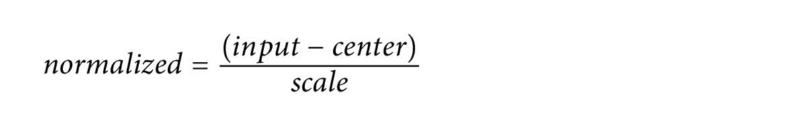

# Machine Learning for Computer Vision
## Machine Learning
AI explores methods by which computers can mimic human capabilities. Machine learning is a subfield of AI that teaches computers to do this by showing them a **large amount of data** and instructing them to learn from it.
Nowadays, image classification is achieved through **convolutional networks**.

# ML Models for Vision
The performance of linear and fully connected neural networks is poor on images.

## A Dataset for Machine Perception
this type of task called machine perception. Specifically, the type of perception is analogous to human sight, so the problem is termed computer vision, and in this case we will solve it through image classification.

### 5-Flowers Dataset
Data format: Storing the images as individual JPEG files is very inefficient. It is better to use TensorFlow Record format.
Your training dataset has to reflect the conditions under which your model will be required to make predictions.

### Reading Image Data
```python
def read_and_decode(filename, reshape_dims):
  # Read the file
  img = tf.io.read_file(filename)
  # Convert the compressed string to a 3D uint8 tensor. (Not the opacity, the fourth channel)
  img = tf.image.decode_jpeg(img, channels=IMG_CHANNELS)
  # Use `convert_image_dtype` to convert to floats in the [0,1] range.
  img = tf.image.convert_image_dtype(img, tf.float32)
  # Resize the image to the desired size.
  return tf.image.resize(img, reshape_dims)
```
The variable `img` here is a tensor that contains an array of bytes. We parse these bytes to convert them into the pixel data.
RGB values are of type `uint8` and are in the range `[0,255]`.
We convert them to floats and scale the values to lie in the range `[0,1]`. This is because **machine learning optimizers are tuned to work well with small numbers**.
Machine learning models are built to work with inputs of known sizes.

#### What’s a Tensor?
A tensor is an array that could have any number of dimensions (the number of dimensions is called the **rank**).

The problem with *numpy* is that they are not hardware-accelerated.
To obtain **hardware acceleration using TensorFlow**, you can convert either numpy
array into a tensor:
```python
tx = tf.convert_to_tensor(x, dtype=tf.float32)
# And you can convert a tensor back into a numpy array using:
x = tx.numpy()
```
All numpy arithmetic is done on the CPU, while the TensorFlow code runs on a **GPU** if one is available.
It is also more efficient if you vectorize your code (to process **batches of images**).

### Visualizing Image Data
```python
def show_image(filename):
  img = read_and_decode(filename, [IMG_HEIGHT, IMG_WIDTH])
  plt.imshow((img.numpy()));
```

### Reading the Dataset File
One way to read a CSV file is to read in text lines using `TextLineDataset`, passing in a function to handle each line as it is read through the `map()` function:
```python
def decode_csv(csv_row):
  record_defaults = ["path", "flower"]
  filename, label_string = tf.io.decode_csv(csv_row, record_defaults)
  img = read_and_decode(filename, [IMG_HEIGHT, IMG_WIDTH])
  return img, label_string

dataset = (tf.data.TextLineDataset(
    "gs://practical-ml-vision-book/flowers_5_jpeg/flower_photos/train_set.csv").
    map(decode_csv))

for img, label in dataset.take(3):
    # The average of all columns (axis=0) and all rows (axis=1),
    # but not to average the RGB values
    avg = tf.math.reduce_mean(img, axis=[0, 1]) # average pixel in the image
    print(label, avg)
```
#### `tf.data.Dataset`
The `tf.data` API makes it possible to handle large amounts of data (even if it doesn’t all fit into memory) by reading only a handful of data elements at a time, and performing transformations as we are reading the data. It does this by using an abstraction called `tf.data.Dataset` to represent a sequence of elements. In our pipeline, each element is a training example that contains two tensors. The first tensor is the image and the second is the label.
[`TextLineDataset`](https://www.tensorflow.org/api_docs/python/tf/data/TextLineDataset) reads text files and assumes that each line is a different element.

The `take()` method truncates the dataset to three items.

## A Linear Model Using Keras
Given a new image, we can compute the weighted average of all its pixel values. We can then use this value to choose between the five types of flowers. Therefore, we will compute five such weighted averages, and choose the flower type based on which output is the largest.


Y<sub>j</sub>=b<sub>j</sub>+Σ<sub>rows</sub> Σ<sub>columns</sub> Σ<sub>channels</sub> w<sub>i</sub>*x<sub>i</sub>

### Keras Model
A Sequential model consists of layers that are connected such that the output of one layer is the input to the next. A layer is a Keras component that takes a tensor as input, applies some TensorFlow operations to that input, and outputs a tensor.
```python
model = tf.keras.Sequential([
    tf.keras.layers.Flatten(input_shape=(IMG_HEIGHT, IMG_WIDTH, 3)),
    tf.keras.layers.Dense(len(CLASS_NAMES))
])
```
The Flatten layer takes a 3D image tensor as input and reshapes it to be a 1D tensor with the same number of values.

To train the model, we need to tell Keras how to optimize the weights.
Compile the model, specifying an optimizer to use, the loss to minimize, and metrics to report.
```python
model.compile(
    optimizer='adam',
    loss=tf.keras.losses.SparseCategoricalCrossentropy(from_logits=True),
    metrics=['accuracy'])
```
#### Prediction function
```python
pred = model.predict(tf.reshape(img, [1, IMG_HEIGHT, IMG_WIDTH, NUM_CHANNELS]))
```
The predicted confidence values are called **logits** and are in the range `–infinity` to `+infinity`.

We can convert the logits to probabilities by applying a function called the `softmax` function to them.
```python
prob = tf.math.softmax(pred)[pred_label_index]
```

#### Probability, Odds, Logits, Sigmoid, and Softmax
Suppose you have an event that can happen with a probability `p`. Then, the probability that it will not happen is `1 – p`. The **odds** that it will happen in any given trial is the probability of the event occurring divided by the probability of it not occurring, or `p / (1 – p)`. For example, if `p=0.25`, then the odds of the event happening are `0.25 / 0.75 = 1:3`. On the other hand, if `p=0.75`, then the odds of it happening are `0.75 / 0.25 = 3:1`.

The **logit** is the natural logarithm of the odds of the event happening. As the probability approaches 0 the logit approaches `–infinity`, and as the probability approaches 1 the logit approaches `+infinity`.

The **sigmoid** is the inverse of the logit function.


The **softmax** is the multiclass counterpart of the sigmoid.


The softmax function is nonlinear and has the effect of **squashing low values and boosting the maximum**.


#### Activation function
Instead of passing the *logits* to the `tf.math.softmax` function we can make things more convenient for end users if we add an activation function to the last layer of the model:
```python
model = tf.keras.Sequential([
    tf.keras.layers.Flatten(input_shape=(IMG_HEIGHT, IMG_WIDTH, 3)),
    tf.keras.layers.Dense(len(CLASS_NAMES), activation='softmax')
])
```
If we do this, then `model.predict()` will return five probabilities (not logits), one for each class.
Any layer in Keras can have an activation function applied to its output.

#### Optimizer
- Stochastic gradient descent (**SGD**): The most basic optimizer.
- **Adagrad** (adaptive gradients) and **Adam**: Improve upon the basic optimizer by adding features that allow for faster convergence.
- **Ftrl**: An optimizer that tends to work well on extremely sparse datasets with many categorical features.

Adam is the tried-and-proven choice for deep learning models. **We recommend using Adam as your optimizer for computer vision problems**.

SGD and all its variants, including Adam, rely on **receiving mini-batches** (often just called batches) of data.

#### Gradient Descent
The hope is that this will converge to a place where the cross-entropy is minimal, although nothing guarantees that this minimum is unique or even that it is the global minimum.


You can compute your gradient on just one example image and update the weights and biases immediately, but doing so on a **batch of, say, 128 images gives a gradient that better represents the constraints imposed by different example images and is therefore likely to converge toward the solution faster**.

#### Training loss
For classification problems, there are strong mathematical reasons to choose cross-entropy as the error to be minimized. **To calculate the cross-entropy, we compare the output probability (p<sub>j</sub> for the jth class) of the model against the true label for that class (L<sub>j</sub>) and sum this up over all the classes**:


If the model gets it exactly correct, this probability will be `1`; `log(1)` is `0`, and so the loss is `0`. If the model gets it exactly wrong, this probability will be `0`; `log(0)` is `–infinity`, and so the loss is `+infinity`, the worst possible loss. **Using cross-entropy as our error measure allows us to tune the weights based on small improvements in the probability assigned to the correct label**.

If your labels are *one-hot encoded*, then, you should use **categorical cross-entropy** as your loss function.
```python
tf.keras.losses.CategoricalCrossentropy(from_logits=False)
```

If your labels will be represented as integer indices, the loss will be specified as:
```python
tf.keras.losses.SparseCategoricalCrossentropy(from_logits=False)
```

##### Why Have Two Ways to Represent the Label?
The sparse representation would be 0 for daisy and 4 for tulip. The sparse representation takes up less space and is therefore much more efficient.

The sparse representation will not work if the problem is a **multilabel multiclass problem**. If an image can contain both daisies and tulips, it is quite straightforward to encode this using the one-hot-encoded representation: `[1 0 0 0 1]`.

**Therefore, we recommend you use the sparse representation for most problems; but remember that one-hot encoding the labels and using the `CategoricalCrossentropy()` loss function will help you handle multilabel multiclass situations**.

#### Error metrics
**Accuracy** is simply the fraction of instances that are classified correctly. The accuracy metric fails when one of the classes is very rare. Indeed, the model can achieve an accuracy of 0.99 simply by identifying all cards as being valid! In such cases, it is common to report two other metrics:
- Precision
- Recall
- F1

By varying the probability threshold, we can obtain different trade-offs in terms of precision and recall. The resulting curve is called the **precision-recall curve**. Another variant of this curve, where the true positive rate is plotted against the false positive rate, is called the receiver operating characteristic (**ROC**) curve. The area under the ROC curve (commonly shortened as **AUC**) is also often used as an aggregate measure of performance.

#### Image Regression
Regression isn’t more complicated than image classification. We merely have to change our final neural network layer, the Dense output layer, from having a sigmoid or softmax activation to None, and change the number of units to the number of regression predictions we want to make from this one image (in this hypothetical case, just one). We should use a regression loss
function, such as mean squared error (MSE):
```python
tf.keras.layers.Dense(units=1, activation=None)
tf.keras.losses.MeanSquaredError()
```

## A Neural Network Using Keras
### Neural Networks
#### Hidden layers
```python
model = tf.keras.Sequential([
    tf.keras.layers.Flatten(input_shape=(IMG_HEIGHT, IMG_WIDTH, 3)),
    tf.keras.layers.Dense(128),
    tf.keras.layers.Dense(len(CLASS_NAMES), activation='softmax')
])
```

If we add a nonlinear activation function A(x) to transform the output of the hidden layer, then the output becomes capable of representing more complex relationships than a
simple linear function.
**The rectified linear unit (ReLU) is the most commonly used activation function for hidden layers**.

The sigmoid function suffers from slow convergence because the weight update at each step is proportional to the gradient, and the gradient near the extremes is very small. The ReLU is more often used so that the weight updates remain the same size in the active part of the function.
The issue with a ReLU is that it is zero for half its domain. This leads to a problem called *dead ReLUs*, where no weight update ever happens. Therefore, some ML practitioners instead use the **Leaky ReLU**, which uses a small negative slope.

#### Learning rate
Also, the smaller the value of the learning rate, the slower the model will converge. Thus, there’s a trade-off between not missing minima and getting the model to converge quickly.

#### Regularization
The more complex model might perform better, but we’d probably need much more data—on the order of hundreds of thousands of images.
It is possible that the model will start to use individual trainable weights to “memorize” the classification answers for individual images in the training dataset.
When this happens, the weight values start to become highly tuned to very specific pixel values and attain very high values. Therefore, **we can reduce the incidence of overfitting by changing the loss to apply a penalty on the weight values themselves**. This sort of penalty applied to the loss function is called **regularization**.

L1 regularization term and L2 regularization term will cause the optimizer to prefer smaller weight values.
**We use L1 if we want a compact model (because we can prune zero weights), whereas we use L2 if we want to limit overfitting to the maximum possible**.
```python
regularizer = tf.keras.regularizers.l1_l2(0, 0.001)
model = tf.keras.Sequential([
    tf.keras.layers.Flatten(input_shape=(
                            IMG_HEIGHT, IMG_WIDTH, IMG_CHANNELS)),
    tf.keras.layers.Dense(num_hidden,
                            kernel_regularizer=regularizer,
                            activation=tf.keras.activations.relu),
    tf.keras.layers.Dense(len(CLASS_NAMES),
                            kernel_regularizer=regularizer,
                            activation='softmax')
])
```
#### Hyperparameter tuning
```python
import kerastuner as kt

# parameterize to the values in the previous cell
def build_model(hp):
  lrate = hp.Float('lrate', 1e-4, 1e-1, sampling='log')
  l1 = 0
  l2 = hp.Choice('l2', values=[0.0, 1e-1, 1e-2, 1e-3, 1e-4])
  num_hidden = hp.Int('num_hidden', 32, 256, 32)

  regularizer = tf.keras.regularizers.l1_l2(l1, l2)

  # NN with one hidden layers
  model = tf.keras.Sequential([
              tf.keras.layers.Flatten(input_shape=(IMG_HEIGHT, IMG_WIDTH, IMG_CHANNELS)),
              tf.keras.layers.Dense(num_hidden,
                                    kernel_regularizer=regularizer,
                                    activation=tf.keras.activations.relu),
              tf.keras.layers.Dense(len(CLASS_NAMES),
                                    kernel_regularizer=regularizer,
                                    activation='softmax')
  ])
  model.compile(optimizer=tf.keras.optimizers.Adam(learning_rate=lrate),
                  loss=tf.keras.losses.SparseCategoricalCrossentropy(from_logits=False),
                  metrics=['accuracy'])
  return model
```
We pass the `build_model()` function into a *Keras Tuner* optimization algorithm. **Bayesian optimization** is an old standby that works well for computer vision problems:
```python
tuner = kt.BayesianOptimization(
    build_model,
    objective=kt.Objective('val_accuracy', 'max'),
    max_trials=10,
    num_initial_points=2,
    overwrite=False) # True to start afresh.

tuner.search(
    train_dataset, validation_data=eval_dataset,
    epochs=5,
    callbacks=[tf.keras.callbacks.EarlyStopping(patience=1)]
)

topN = 1
for x in range(topN):
  print(tuner.get_best_hyperparameters(topN)[x].values)
  print(tuner.get_best_models(topN)[x].summary())
```

### Deep Neural Networks
A deep neural network (DNN) is a neural network with **more than one hidden layer**.
We will need a larger dataset.
Some tricks that we can apply to improve the performance of the DNN: There are two ideas — **dropout** layers and **batch normalization**.

#### Dropout
At each training iteration, the dropout layer drops random neurons from the network, with a probability `p` (typically 25% to 50%).
The net result is that these neurons will not participate in the loss computation this time around, and they will not get weight updates.


The theory behind dropout is that neural networks have so much *freedom* between their numerous layers that it is entirely **possible for one layer to evolve a bad behavior** and for the next layer to compensate for it. This is not an ideal use of neurons. With dropout, there is a high probability that the neurons “fixing” the problem will not be there in a given training round. The bad behavior of the offending layer therefore becomes obvious, and **weights evolve toward a better behavior**. Dropout also helps *spread the information flow throughout the network*, **giving all weights fairly equal amounts of training**, which can help keep the model balanced.

#### Batch normalization
Our input pixel values are in the range `[0, 1]`, however, once we add a hidden layer, the resulting output values will no longer lie in the dynamic range of the activation function for subsequent layers.


*The output values of hidden layer neurons may not be in the dynamic range of the activation function. They might be **(A) too far to the left** (after sigmoid activation, this neuron almost always outputs zero), **(B) too narrow** (after sigmoid activation, this neuron never outputs a clear 0 or 1), or **(C) not too bad** (after sigmoid activation, this neuron will output a fair range of outputs between 0 and 1 across a mini-batch).*

Batch normalization normalizes neuron outputs across a training batch of data by subtracting the average and dividing by the standard deviation.
The trick is to introduce two additional learnable parameters per neuron, called scale and center, and to normalize the input data to the neuron using these values:



This way, the network decides, through machine learning, how much centering and rescaling to apply at each neuron.

During training, neurons’ output statistics are computed across a “sufficient” number of batches using a running exponential average. These stats are then used at inference time. With the `tf.keras.layers.BatchNormalization` layer all this accounting will happen automatically.

- Batch normalization is performed before the activation function is applied, so add a separate `Activation` layer.
- If you use an activation function that is scale-invariant, then you can set `scale=False`. ReLu is scale-invariant. Sigmoid is not.

```python
layers = [tf.keras.layers.Flatten(
      input_shape=(IMG_HEIGHT, IMG_WIDTH, IMG_CHANNELS),
      name='input_pixels')]
  for hno, nodes in enumerate(num_hidden):
    layers.extend([
      tf.keras.layers.Dense(nodes,
                            kernel_regularizer=regularizer,
                            name='hidden_dense_{}'.format(hno)),
      tf.keras.layers.BatchNormalization(scale=False, # ReLU
                                         center=False, # have bias in Dense
                                         name='batchnorm_dense_{}'.format(hno)),
      #move activation to come after batchnorm
      tf.keras.layers.Activation('relu', name='relu_dense_{}'.format(hno)),
      tf.keras.layers.Dropout(rate=dropout_prob,
                             name='dropout_dense_{}'.format(hno)),
    ])

  layers.append(
      tf.keras.layers.Dense(len(CLASS_NAMES),
                            kernel_regularizer=regularizer,
                            activation='softmax',
                            name='flower_prob')
  )
```
The resulting training indicates that these two tricks have improved the ability of the model to generalize and to converge faster.

In general, **you’ll have to experiment with all of these ideas (regularization, early stopping, dropout, batch normalization)** for any model you pick.

# Image Vision
Traditional fully connected neural network layers perform poorly on images because they do not take advantage of the fact that adjacent pixels are highly correlated.
Pixels close to each other work together to create shapes (such as lines and arcs), and these shapes themselves work together to create recognizable parts of an object.

## Pretrained Embeddings
In some sense, all the information contained in the input image is being represented by the penultimate layer, whose output consists of 16 numbers. These 16 numbers that provide a representation of the image are called an embedding.


*The 16 numbers that form the embedding provide a representation of all the information in the entire image.*

### Pretrained Model
We can throw away the last layer, or prediction head, of that model and replace it with our own. The repurposed part of the model can be pretrained from a very large, general-purpose dataset and the knowledge can then be transferred to the actual dataset that we want to classify.

The resulting embedding therefore has the ability to efficiently **compress the information found in a wide variety of images**. As long as the images we want to classify are similar in nature to the ones that MobileNet was trained on.

### Transfer Learning
The process of training a model by replacing its input layer with an image embedding is called *transfer learning*.

The most popular pretrained models are available directly in Keras. They can be loaded by instantiating the corresponding class in `tf.keras.applications.*`.

All image models in TensorFlow Hub use a common image format and expect pixel values as floats in the range `[0,1)`.

#### Pretrained Models in Keras
The most popular pretrained models are available directly in Keras. They can be loaded by instantiating the corresponding class in `tf.keras.applications.*`.
A format conversion function named `tf.keras.applications.<MODEL_NAME>.preprocess_input()` is provided for every model. It converts images with pixel values that are floats in the range `[0, 255]` into the pixel format expected by the pretrained model. A cast to float is necessary before applying `preprocess_input()`.

All the image models in TensorFlow Hub expect pixel values as floats in the range `[0, 1)`.

With the option `include_top=False`, all the models in `tf.keras.applications.*` return a 3D feature map. It’s the user’s responsibility to compute a 1D feature vector from it so that a classification head with dense layers can be appended. You can use `tf.keras.layers.GlobalAveragePooling2D()` or `tf.keras.layers.Flatten()` for this purpose.

Transfer learning is what we recommend any time your dataset is relatively small. **Only when your dataset starts to exceed about five thousand images per label should you start to consider training from scratch**.

### Fine-Tuning
We might be able to get better results if we allow our training loop to **also adapt the pretrained layers**. This technique is called *fine-tuning*. The pretrained weights are used as initial values for the weights of the neural network.
With a learning rate set too high, the pretrained weights are being changed in large steps and all the information learned during pretraining is lost.

There are two techniques that can be used to solve this problem: a **learning rate schedule** and **layer-wise learning rates**.

#### Learning rate schedule

**On the left, a traditional learning rate schedule with exponential decay; on the right, a learning rate schedule that features a warm-up ramp, which is more appropriate for fine-tuning.**

#### Differential learning rate
In differential learning rate we use **a low learning rate for the pretrained layers and a normal learning rate for the layers of our custom classification head**.

We can multiply the learning rate by a factor that varies based on layer depth.

A learning rate ramp-up or a per-layer differential learning rate is not strictly necessary, but in practice it makes the convergence more stable and makes it easier to find working learning rate parameters.

