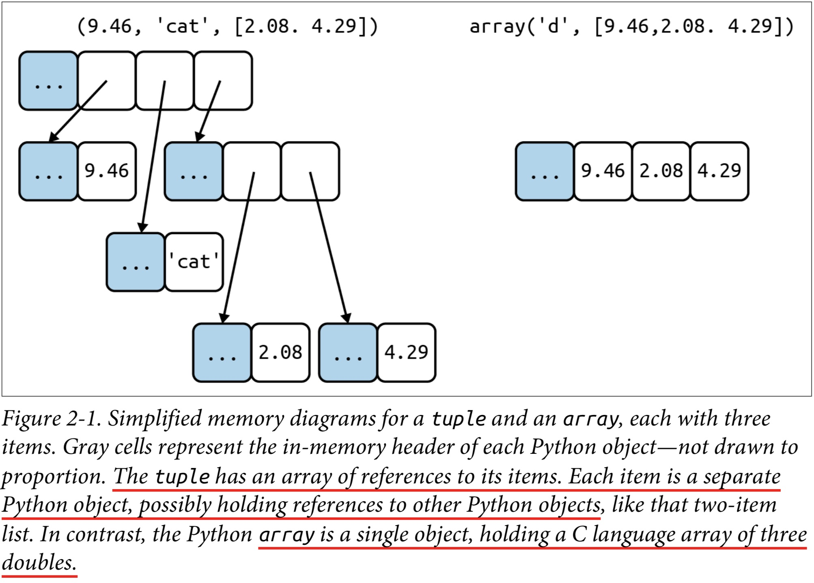
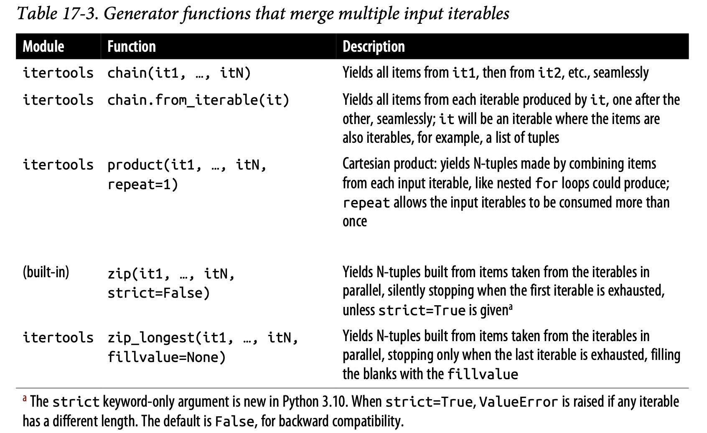

# The Python Data Model
One of the best qualities of Python is its consistency.
Python Data Model is the API that we use to make our own objects play well with the most idiomatic language features.
**You can think of the data model as a description of Python as a framework. It formalizes the interfaces of the building blocks of the language itself, such as sequences, functions, iterators, coroutines, classes, context managers, and so on.**
When we leverage the Python Data Model to build new classes. The Python interpreter invokes special methods to perform basic object operations.
We implement special methods when we want our objects to support and interact with fundamental language constructs (Collections, Attribute access, Iteration, etc.)

*“double underscore before and after.” That’s why the special methods are also known as dunder methods.*

## A Pythonic Card Deck

Demonstrates the power of implementing just two special methods, **`__getitem__`** and **`__len__`**.

```python
import collections

Card = collections.namedtuple('Card', ['rank', 'suit'])

class FrenchDeck:
    ...
    def __len__(self):
        return len(self._cards)

    def __getitem__(self, position):
        return self._cards[position]
```
We use `namedtuple` **to build classes of objects that are just bundles of attributes with no custom methods, like a database record**.

```python
beer_card = Card('7', 'diamonds')
print(beer_card)

> Card(rank='7', suit='diamonds')

print(beer_card.rank)

> '7'
```

Python has a function to get a random item from a sequence: `random.choice`.
```python
from random import choice

deck = FrenchDeck()

choice(deck)

Card(rank='6', suit='spades')
```

Because our `__getitem__` our deck automatically supports slicing.
```python
deck[:3]

[Card(rank='2', suit='spades'),
 Card(rank='3', suit='spades'),
 Card(rank='4', suit='spades')]

deck[12::13]
...
```
By implementing the `__getitem__` special method, our deck is also **iterable** (also in *reverse*)

```python
for card in deck:
    print(card)

for card in reversed(deck):
    print(card)
```
If a collection has no `__contains__` method, the in operator does a sequential scan.
```python
Card('Q', 'hearts') in deck

Card('7', 'beasts') in deck
```
**By implementing the special methods `__len__` and `__getitem__`, our `FrenchDeck` behaves like a standard Python sequence**, allowing it to **benefit from core language features** (e.g., iteration and slicing) **and from the standard library**, as shown by the examples using `random.choice`, `reversed`, and `sorted`.

## How Special Methods Are Used
Special methods are meant to be called by the Python interpreter, and not by you.
The interpreter takes a shortcut when dealing for built-in types like `list`, `str`, `bytearray`: a `struct` called `PyVarObject`, which has an `ob_size` field holding the number of items in the collection. This is much faster than calling a method.

The only special method that is frequently called by user code directly is `__init__`. It is usually better to call the related built-in function (e.g., `len`, `iter`, `str`, etc.). The Python interpreter is the only frequent caller of most special methods.

## String Representation
The **`__repr__`** special method is called by the `repr` built-in to get the string representation of the object for inspection.
The interactive console and debugger call `repr` on the results of the expressions evaluated, as does the `!r` conversion field in the new format string syntax used in f-strings.
The string returned by `__repr__` should be unambiguous and, if possible, match the source code necessary to re-create the represented object.

If you only implement one the special methods `__str__` and `__repr__` in Python, choose `__repr__`.

## Boolean Value of a Custom Type
To determine whether a value `x` is truthy or falsy, Python applies `bool(x)`, which returns either `True` or `False`.

`bool(x)` calls `x.__bool__()` and uses the result. If `__bool__` is not implemented, Python tries to invoke `x.__len__()`, and if that returns `zero`, `bool` returns `False`. Otherwise `bool` returns `True`.

## Collection API


The `Collection` ABC (abstract base classes) unifies the three essential interfaces that every collection should implement:

* `Iterable` to support `for`, unpacking, and other forms of iteration
* `Sized` to support the `len` built-in function
* `Container` to support the `in` operator

Three very important specializations of `Collection` are:
* `Sequence`, formalizing the interface of built-ins like `list` and `str`.
* `Mapping`, implemented by `dict`, `collections.defaultdict`, etc.
* `Set`.

Since Python 3.7, the `dict` type is officially “ordered” (the key insertion order is preserved).

## Why `len` Is Not a Method
*The length is simply read from a field in a C struct*. Getting the number of items in a collection is a common operation and must work efficiently for such basic and diverse types as `str`, `list`,` memoryview`, and so on.
**`len` is not called as a method because it gets special treatment as part of the Python Data Model**.
Compromise between the need for efficient built-in objects and the consistency of the language.

# An Array of Sequences
## Overview of Built-In Sequences
The standard library offers a rich selection of sequence types implemented in C:

* **Container sequences**: Can hold items of different types.
* **Flat sequences**: Hold items of one simple type.

A container sequence holds references to the objects it contains, which may be of any type, while a flat sequence stores the value of its contents in its own memory space, not as distinct Python objects.



Flat sequences are more compact, but they are limited to holding primitive machine values like `bytes`, `integers`, and `floats`.

The *array* is a single object holding the raw values of the floats, while the *tuple* consists of several objects—the tuple itself and each `float` object contained in it.

Another way of grouping sequence types is **by mutability**:
* **Mutable sequences**: `list`, `bytearray`, `array.array`, and `collections.deque`.
* **Immutable sequences**: `tuple`, `str`, and `bytes`.

Keep in mind these common traits: **mutable versus immutable; container versus flat**.

The most fundamental sequence type is the **`list`: a mutable container**.

## List Comprehensions and Generator Expressions
### List Comprehensions and Readability
A listcomp is more explicit. Its goal is always to build a new list.

In Python code, line breaks are ignored inside pairs of `[]`, `{}`, or `()`. So you can build multiline lists, listcomps, tuples, dictionaries, etc.

#### Local Scope Within Comprehensions and Generator Expressions
Variables assigned with the “**Walrus operator**” `:=` remain accessible after those comprehensions or expressions return.
```python
x = 'ABC'
codes = [last := ord(c) for c in x]

print(last)

67
```

### Generator Expressions
**A generator expression saves memory because it yields items one by one using the iterator protocol instead of building a whole list just to feed another constructor**.

Genexps use the same syntax as listcomps, but **are enclosed in parentheses rather than brackets**.

```python
symbols = '$¢£¥€¤'
# If the generator expression is the single argument in a function call,
# there is no need to duplicate the enclosing parentheses
tuple(ord(symbol) for symbol in symbols)

(36, 162, 163, 165, 8364, 164)

array.array('I', (ord(symbol) for symbol in symbols))

array('I', [36, 162, 163, 165, 8364, 164])
```
Here the six-item list of T-shirts is **never built in memory: the generator expression feeds the for loop producing one item at a time**.
Using a generator expression would save the cost of building a list with a million items just to feed the for loop.

## Tuples Are Not Just Immutable Lists
Tuples do double duty: they can be used as immutable lists and also as records with no field names.

### Tuples as Records
Tuple holds the data for one field, and the position of the item gives its meaning.

### Tuples as Immutable Lists
This brings two key benefits:
* Clarity
* **Performance**: A tuple uses less memory than a list of the same length, and it allows Python to do some optimizations.

References in a tuple cannot be deleted or replaced. But if one of those references points to a mutable object, and that object is changed, then the value of the tuple changes.


An object is only hashable if its value cannot ever change. An unhashable tuple cannot be inserted as a `dict` key, or a `set` element.

Performance advantages:

* To evaluate a tuple literal, the Python compiler generates bytecode for a tuple constant in one operation.
* Because of its fixed length, a tuple instance is allocated **the exact memory space it needs**. Instances of list, on the other hand, are allocated with room to spare, to amortize the cost of future appends.
* The references to the items in a tuple are stored in an array in the tuple struct, while a list holds a pointer to an array of references stored elsewhere. The extra indirection makes CPU caches less effective.

## Unpacking Sequences and Iterables
Unpacking works with any iterable object as the data source—including iterators, which don’t support index notation (`[]`).
The iterable yields exactly one item per variable in the receiving end, unless you use a star (`*`) to capture *excess items*.

**Parallel assignment**: assigning items from an iterable to a tuple of variables.

An elegant application of unpacking is **swapping** the values of variables without using a temporary variable:
```python
b,a=a,b
```
Prefixing an argument with `*` when calling a function:
```python
t=(20,8)
quotient, remainder = divmod(*t)
quotient, remainder

(2, 4)
```
### Using `*` to Grab Excess Items
```python
a, b, *rest = range(5)
a, b, rest

(0, 1, [2, 3, 4])
```
In the context of parallel assignment, the `*` prefix can be applied to exactly one variable, but it can appear in any position:
```python
a, *body, c, d = range(5)
a, body, c, d

(0, [1, 2], 3, 4)
```
### Unpacking with `*` in Function Calls and Sequence Literals
In function calls, we can use `*` multiple times:
```python
def fun(a, b, c, d, *rest):
    return a, b, c, d, rest

fun(*[1, 2], 3, *range(4, 7))

(1, 2, 3, 4, (5, 6))
```
The `*` can also be used when defining list, tuple, or set literals
```python
>>> *range(4), 4
(0, 1, 2, 3, 4)
>>> [*range(4), 4]
[0, 1, 2, 3, 4]
>>> {*range(4), 4, *(5, 6, 7)}
{0, 1, 2, 3, 4, 5, 6, 7}
```
### Nested Unpacking
Python will do the right thing if the value has the same nesting structure.
```python
# Each tuple holds a record with four fields, the last of which is a coordinate pair.
metro_areas = [
    ('Tokyo', 'JP', 36.933, (35.689722, 139.691667)),
    ...
]
# By assigning the last field to a nested tuple, we unpack the coordinates.
for name, _, _, (lat, lon) in metro_areas:
    if lon <= 0:
        ...
```
## Pattern Matching with Sequences
```python
def handle_command(self, message):
    # The expression after the match keyword is the subject.
    match message:
        # The first item must be the string 'BEEPER'. The second and third item can be anything,
        # and they will be bound to the variables frequency and times, in that order.
        case ['BEEPER', frequency, times]:
            self.beep(times, frequency)
        case ['NECK', angle]:
            self.rotate_neck(angle)
        # If the number of items does not match, Python proceeds to the next case.
        case ['LED', ident, intensity]:
            self.leds[ident].set_brightness(ident, intensity)
        case ['LED', ident, red, green, blue]:
            self.leds[ident].set_color(ident, red, green, blue)
        # The default case. It will match any subject that did not match a previous pattern.
        case _:
            raise InvalidCommand(message)
```
The **subject** is the data that Python will try to match to the patterns in each case clause.

One key improvement of match over switch is **destructuring**, a more advanced form of unpacking. It is commonly used in languages that support pattern matching, like *Scala* and *Elixir*.

```python
metro_areas = [
    ('Tokyo', 'JP', 36.933, (35.689722, 139.691667)),
    ('Delhi NCR', 'IN', 21.935, (28.613889, 77.208889)),
    ('Mexico City', 'MX', 20.142, (19.433333, -99.133333)),
    ('New York-Newark', 'US', 20.104, (40.808611, -74.020386)),
    ('São Paulo', 'BR', 19.649, (-23.547778, -46.635833)),
]
def main():
    print(f'{"":15} | {"latitude":>9} | {"longitude":>9}')
    for record in metro_areas:
        match record:
            # A case clause has two parts: a pattern and an optional guard with the if keyword,
            # which is evaluated only if the pattern matches, and can reference variables bound in the pattern
            case [name, _, _, (lat, lon)] if lon <= 0:
                # Runs only if the pattern matches and the guard expression is truthy
                print(f'{name:15} | {lat:9.4f} | {lon:9.4f}')
```
In general, a sequence pattern matches the subject if:
1. The subject is a sequence *and*;
2. The subject and the pattern have the same number of items *and*;
3. Each corresponding item matches, including nested items.

Sequence patterns may be written as tuples or lists or any combination of nested tuples and lists (square brackets and parentheses mean the same thing).

Instances of `str`, `bytes`, and `bytearray` are not handled as sequences in the context of match/case. A match subject of one of those types is treated as an "atomic" value.

The `_` symbol is special in patterns: it matches any single item in that position, but it is never bound to the value of the matched item and can appear more than once in a pattern.

You can bind any part of a pattern with a variable using the as keyword:
```python
# coord == (31.1, 121.3)
case [name, _, _, (lat, lon) as coord]:
```
We can make patterns more specific by adding type information.
```python
# In the context of a pattern, that syntax performs a runtime type check:
# The first item must be an instance of str, and both items in the 2-tuple must be instances of float
case [str(name), _, _, (float(lat), float(lon))]:
```
The `*_` matches any number of items, without binding them to a variable, while using
`*extra` instead of `*_` would bind the items to `extra` as a `list` with 0 or more items.
```python
case [str(name), *_, (float(lat), float(lon))]:
```
The optional guard clause starting with if is evaluated only if the pattern matches,
and can reference variables bound in the pattern

[Some examples](https://github.com/gvanrossum/patma/blob/3ece6444ef70122876fd9f0099eb9490a2d630df/EXAMPLES.md)

### Pattern Matching Sequences in an Interpreter
The following example was taken from the [lis.py](https://github.com/fluentpython/lispy/blob/main/original/norvig/lis.py) code of Peter Norvig for the creation of a LISP interprester in Python.
[(How to Write a (Lisp) Interpreter (in Python))](http://norvig.com/lispy.html)
```python
def evaluate(exp: Expression, env: Environment) -> Any:
    "Evaluate an expression in an environment."
    if isinstance(exp, Symbol):      # variable reference
        return env[exp]
    # ... lines omitted
    elif exp[0] == 'quote':          # (quote exp)
        (_, x) = exp
        return x
    elif exp[0] == 'if':             # (if test conseq alt)
        (_, test, consequence, alternative) = exp
        if evaluate(test, env):
            return evaluate(consequence, env)
        else:
            return evaluate(alternative, env)
    elif exp[0] == 'lambda':         # (lambda (parm…) body…)
        (_, parms, *body) = exp
        return Procedure(parms, body, env)
    elif exp[0] == 'define':
        (_, name, value_exp) = exp
        env[name] = evaluate(value_exp, env)
    # ... more lines omitted
```
Using `match/case` in Python ≥ 3.10, we can refactor evaluate as shown below:
```python
def evaluate(exp: Expression, env: Environment) -> Any:
    "Evaluate an expression in an environment."
    match exp:
    # ... lines omitted
        # Match if subject is a two-item sequence starting with 'quote'
        case ['quote', x]:
            return x
        # Match if subject is a four-item sequence starting with 'if'
        case ['if', test, consequence, alternative]:
            if evaluate(test, env):
                return evaluate(consequence, env)
            else:
                return evaluate(alternative, env)
        # Match if subject is a sequence of three or more items starting with 'lambda'.
        # The guard ensures that body is not empty.
        case ['lambda', [*parms], *body] if body:
            return Procedure(parms, body, env)
        # Match if subject is a three-item sequence starting with 'define', followed by an instance of Symbol.
        case ['define', Symbol() as name, value_exp]:
            env[name] = evaluate(value_exp, env)
        # ... more lines omitted
        case _:
            raise SyntaxError(lispstr(exp))
```
In a sequence pattern, `*` can appear only once per sequence. in the `lambda` *case* we have two sequences: the outer and the inner.
The match statement does a lot more than the switch in C-like languages.
Pattern matching is an example of **declarative programming**: *the code describes "what" you want to match, instead of "how" to match it.*

## Slicing
### Why Slices and Ranges Exclude the Last Item
* It’s easy to **see the length** of a slice or range when only the stop position is given: `range(3)` and `my_list[:3]` both produce three items.
* It’s easy to **compute the length** of a slice or range when start and stop are given: just subtract `stop - start`.
* It’s easy to **split a sequence in two parts** at any index `x`, without overlapping: simply get `my_list[:x]` and `my_list[x:]`.

### Slice Objects
Produces a slice object: `slice(a, b, c)`.
It lets you assign names to slices.
```python
DESCRIPTION = slice(6, 40)
UNIT_PRICE = slice(40, 52)

print(item[UNIT_PRICE], item[DESCRIPTION])
```
### Multidimensional Slicing and Ellipsis
Except for `memoryview`, the built-in sequence types in Python are one-dimensional, so they support only one index or slice, and not a tuple of them.
NumPy uses `...` as a shortcut when slicing arrays of many dimensions; for example, if `x` is a four-dimensional array, `x[i, ...]` is a shortcut for `x[i, :, :, :,]`.

### Assigning to Slices
Mutable sequences can be grafted, excised, and otherwise modified in place using slice notation on the lefthand side of an assignment statement or as the target of a `del` statement.
```python
>>> l = list(range(10))
>>> l
[0, 1, 2, 3, 4, 5, 6, 7, 8, 9]
>>> l[2:5] = [20, 30]
>>> l
[0, 1, 20, 30, 5, 6, 7, 8, 9]
>>> del l[5:7]
>>> l
[0, 1, 20, 30, 5, 8, 9]
>>> l[3::2] = [11, 22]
>>> l
[0, 1, 20, 11, 5, 22, 9]
# When the target of the assignment is a slice, the righthand side must be an iterable object, even if it has just one item.
>>> l[2:5] = 100
TypeError: can only assign an iterable
>>> l[2:5] = [100]
>>> l
    [0, 1, 100, 22, 9]
```
## Using `+` and `*` with Sequences
Both `+` and `*` always create a new object, and never change their operands.
```
trying to initialize a list of lists as my_list = [[]] * 3 will result in a list with three references to the same inner list, which is probably not what you want.
```
### Augmented Assignment with Sequences
The augmented assignment operators `+=` and `*=` behave quite differently, depending on the first operand.
The special method that makes `+=` work is `__iadd__` (for “in-place addition”). However, if `__iadd__` is not implemented, Python falls back to calling `__add__`.
```python
a+=b
```
the identity of the object bound to `a` may or may not change, depending on the availability of `__iadd__`.
In general, **for mutable sequences `+=` happens in place**. For immutable sequences, clearly there is no way for that to happen.

```python
l = [1, 2, 3]
idl = id(l)
l *= 2
id(l) == idl  # True, same list

t = (1, 2, 3)
idt = id(t)
t *= 2
id(t) == idt # False, new tuple
```

## `list.sort` Versus the `sorted` Built-In
The `list.sort` method sorts a list in place.
*Python API convention*: functions or methods that change an object in place should return `None` to make it clear to the caller that the receiver was changed, and no new object was created.
In contrast, the built-in function `sorted` creates a new `list` and returns it. It accepts any iterable object as an argument, including immutable sequences and generators. It always returns a newly created `list`.
Both `list.sort` and `sorted` take two optional, keyword-only arguments:
- `reverse`
- `key`: A one-argument function that will be applied to each item to produce its sorting key.

## When a List Is Not the Answer
`array` saves a lot of memory when you need to handle millions of floating-point values.
`deque` is more efficient if you are constantly adding and removing items from opposite ends of a list.
`set` is optimized for fast membership checking, especially if it holds a large number of items.

### Arrays
If a list **only contains numbers**, an `array.array` is a more efficient replacement.
A Python array is as lean as a C array. An `array` of `float` values does not hold full-fledged `float` instances, but only the packed bytes representing their machine values.
When creating an `array`, you provide a **typecode**, a letter to determine the underlying C type used to store each item in the array.
For large sequences of numbers, you could save a lot of memory.
```python
from array import array
from random import random
# 'd' for double-precision floats
floats = array('d', (random() for i in range(10**7)))
floats[-1]

0.5963321947530882

with open('floats.bin', 'wb') as fp:
    floats.tofile(fp)

floats2 = array('d')

# Faster and lighter than reading the numbers from a text file
with open('floats.bin', 'rb') as fp:
    floats2.fromfile(fp, 10**7)

floats2[-1]

0.5963321947530882

floats2 == floats

True
```

### Memory Views
The built-in `memoryview` class is a shared-memory sequence type that lets you handle slices of arrays without copying bytes.
A memoryview is essentially a generalized NumPy array structure in Python itself (without the math). It allows you to share memory between data-structures (things like PIL images, SQLite databases, NumPy arrays, etc.) without first copying. This is very important for large data sets.

### NumPy
NumPy is the reason why Python became mainstream in scientific computing applications.
Implements multi-dimensional, homogeneous arrays and matrix types that hold not only numbers but also user-defined records, and provides efficient element-wise operations.
**SciPy** is a library, written on top of NumPy, offering many scientific computing algorithms from linear algebra, numerical calculus, and statistics. SciPy is fast and reliable because it **leverages the widely used C and Fortran** codebase from the [Netlib](https://www.netlib.org/) Repository.
```python
import numpy as np
a = np.arange(12)
# Change the shape of the array, adding one dimension
a.shape = 3, 4

array([[ 0,  1,  2,  3],
       [ 4,  5,  6,  7],
       [ 8,  9, 10, 11]])

print(a[2])

array([ 8,  9, 10, 11])

print(a[2, 1])

9

print(a[:, 1])

array([1, 5, 9])

```
```python
with open('floats-1M-lines.txt', 'wt') as fp:
    for _ in range(1_000_000):
        fp.write(f'{random()}\n')
floats = np.loadtxt('floats-1M-lines.txt')

print(floats[-3:])

array([0.29150425, 0.33893554, 0.08112756])

floats *= .5
floats[-3:]

array([0.14575213, 0.16946777, 0.04056378])

# Import the high-resolution performance measurement timer
from time import perf_counter as pc

t0 = pc()
floats /= 3
print((pc() - t0) < 0.01)

True

# Save the array in a .npy binary file.
np.save('floats-1M', floats)
# Load the data as a memory-mapped file into another array; this allows efficient
# processing of slices of the array even if it does not fit entirely in memory.
floats2 = np.load('floats-1M.npy', 'r+')
floats2 *= 6

print(floats2[-3:])

memmap([0.29150425, 0.33893554, 0.08112756])
```
Numpy ans Scipy are the foundation of other awesome tools such as the **Pandas** and **scikit-learn**.
Most NumPy and SciPy functions are **implemented in C or C++**, and can leverage all CPU cores.
The [Dask](https://dask.org/) project supports parallelizing NumPy, Pandas, and scikit-learn processing across clusters of machines.

### Deques and Other Queues
The class `collections.deque` is a thread-safe double-ended queue designed for fast inserting and removing from both ends (to keep a list of "**last seen items**").
If a bounded `deque` is full, when you add a new item, it discards an item from the opposite end.
```python
import collections

dq = collections.deque(range(10), maxlen=10)

deque([0, 1, 2, 3, 4, 5, 6, 7, 8, 9])

dq.rotate(3)

deque([7, 8, 9, 0, 1, 2, 3, 4, 5, 6])

dq.rotate(-4)

deque([1, 2, 3, 4, 5, 6, 7, 8, 9, 0])

dq.appendleft(-1)

deque([-1, 1, 2, 3, 4, 5, 6, 7, 8, 9])

dq.extend([11, 22, 33])

deque([3, 4, 5, 6, 7, 8, 9, 11, 22, 33])
# extendleft works by appending each successive item of the iter argument to the left
# of the deque, therefore the final position of the items is reversed.
dq.extendleft([10, 20, 30, 40])

deque([40, 30, 20, 10, 3, 4, 5, 6, 7, 8])
```
Removing items from the middle of a `deque` is not as fast. It is really optimized for appending and popping from the ends.
The `append` and `popleft` operations are atomic, so deque is safe to use as a FIFO queue in *multithreaded applications without the need for locks*.

#### `queue`
This provides the synchronized (i.e., thread-safe) classes `SimpleQueue`, `Queue`, `LifoQueue`, and `PriorityQueue`.
When the queue is full, the insertion of a new item blocks, i.e., it waits until some other thread makes room by taking an item from the queue.

### Soapbox
#### Flat Versus Container Sequences
Container sequences can be nested because they may contain objects of any type, including their own type.
Flat sequences are sequence types that cannot be nested because they only hold simple atomic types like integers, floats, or characters.

#### key Is Brilliant
The optional key argument of `list.sort`, `sorted`, `max`, and `min` is a great idea.
Using key is both simpler and more efficient, **because the key function is invoked only once per item**. That comparison is done in optimized C code and not in a Python function that you wrote.

Using `key` we can sort a mixed bag of numbers and number-like strings.
```python
l = [28, 14, '28', 5, '9', '1', 0, 6, '23', 19]

sorted(l, key=int)

[0, '1', 5, 6, '9', 14, 19, '23', 28, '28']

sorted(l, key=str)

[0, '1', 14, 19, '23', 28, '28', 5, 6, '9']
```

# Dictionaries and Sets
The `dict` type is a fundamental part of Python’s implementation.
Because of their crucial role, Python dicts are highly optimized. **Hash tables** are the engines behind Python’s high-performance `dict`s.
Other built-in types based on hash tables are `set` and `frozenset`. Python sets implement all the fundamental operations from set theory, like union, intersection, subset tests, etc.

## Modern dict Syntax

### `dict` Comprehensions
A *dictcomp* (dict comprehension) builds a dict instance by taking `key:value` pairs from any iterable.
```python
# An iterable of key-value pairs like dial_codes can be passed directly to the dict constructor
dial_codes = [
    (880, 'Bangladesh'),
    (55,  'Brazil'),
    (86,  'China'),
    (91,  'India'),
    (62,  'Indonesia'),
    (81,  'Japan'),
    (234, 'Nigeria'),
    (92,  'Pakistan'),
    (7,   'Russia'),
    (1,   'United States'),
]
country_dial = {country: code for code, country in dial_codes}

{code: country.upper()
    for country, code in sorted(country_dial.items())
    if code < 70}

{55: 'BRAZIL', 62: 'INDONESIA', 7: 'RUSSIA', 1: 'UNITED STATES'}
```
### Unpacking Mappings
We can apply `**` to more than one argument in a function call (unique across all arguments).
```python
func(**{'x': 1}, y=2, **{'z': 3})
```
`**` can be used inside a `dict` literal—also multiple times:
```python
# duplicate keys are allowed. Later occurrences overwrite previous ones
>>> {'a': 0, **{'x': 1}, 'y': 2, **{'z': 3, 'x': 4}}

{'a': 0, 'x': 4, 'y': 2, 'z': 3}
```
### Merging Mappings with `|`
Python 3.9 supports using `|` and `|=` (inplace) to merge mappings:
```python
>>> d1 = {'a': 1, 'b': 3}
>>> d2 = {'a': 2, 'b': 4, 'c': 6}
>>> d1 | d2
{'a': 2, 'b': 4, 'c': 6}

>>> d1
{'a': 1, 'b': 3}
>>> d1 |= d2
>>> d1
{'a': 2, 'b': 4, 'c': 6}
```

## Pattern Matching with Mappings
Different types of patterns can be combined and nested.
```python
def get_creators(record: dict) -> list:
    match record:
        # 'authors' key mapped to a sequence
        case {'type': 'book', 'api': 2, 'authors': [*names]}:
            return names
        # 'author' key mapped to any object
        case {'type': 'book', 'api': 1, 'author': name}:
            return [name]
        case {'type': 'book'}:  # <3>
            raise ValueError(f"Invalid 'book' record: {record!r}")
        # 'director' key mapped to a single object
        case {'type': 'movie', 'director': name}:
            return [name]
        case _:  # <5>
            raise ValueError(f'Invalid record: {record!r}')

>>> b1 = dict(api=1, author='Douglas Hofstadter',
...         type='book', title='Gödel, Escher, Bach')
>>> get_creators(b1)
['Douglas Hofstadter']
>>> from collections import OrderedDict
>>> b2 = OrderedDict(api=2, type='book',
...         title='Python in a Nutshell',
...         authors='Martelli Ravenscroft Holden'.split())
>>> get_creators(b2)
['Martelli', 'Ravenscroft', 'Holden']
```
Useful practices for handling semi-structured data such as JSON records:
- Include a field describing the **kind of record** (e.g., 'type': 'movie')
- Include a field identifying the **schema version** (e.g., 'api': 2') to allow for future evolution of public APIs
- Have case clauses to handle **invalid records** of a specific type (e.g., 'book'), as well as a catch-all

In contrast with sequence patterns, mapping patterns succeed on *partial matches*.
`**extra` match extra key-value pairs, capture them as a `dict`. It must be the last in the pattern.

## Standard API of Mapping Types
To implement a custom mapping, it’s easier to extend `collections.UserDict`, that encapsulate the basic `dict` in their implementation, which in turn is built on a hash table. Therefore, they all share the limitation that the **keys must be hashable**.

### What Is Hashable
**An object is hashable if it has a hash code which never changes during its lifetime** (it needs a `__hash__()` method), and can be compared to other objects (it needs an `__eq__()` method). Hashable objects which compare equal must have the same hash code.

Numeric types and flat immutable types `str` and `bytes` are all hashable. Container types are hashable if they are immutable and all contained objects are also hashable.
A `tuple` is hashable only if all its items are hashable.

The hash code of a correctly implemented object is guaranteed to be constant only within one Python process.

### Inserting or Updating Mutable Values
The end result of this line...
```python
my_dict.setdefault(key, []).append(new_value)
```
...is the same as running...
```python
if key not in my_dict:
    my_dict[key] = []
my_dict[key].append(new_value)
```
...except that the latter code performs at least two searches for key—three if it’s not
found—while **`setdefault`** does it all with a single lookup.

## Automatic Handling of Missing Keys
Sometimes it is convenient to have mappings that return some made-up value when a missing key is searched. There are two main approaches to this.

### `defaultdict`: Another Take on Missing Keys
A `collections.defaultdict` instance **creates items with a default value on demand** whenever a missing key is searched using `d[k]` syntax.

When instantiating a `defaultdict`, you provide a **callable** to produce a default value whenever `__getitem__` is passed a nonexistent key argument.
For example, given a `defaultdict` created as `dd = defaultdict(list)`, if `'new-key'` is not in `dd`, the expression `dd['new-key']` does the following steps:

1. Calls `list()` to create a new list.
2. Inserts the list into dd using `'new-key'` as key.
3. Returns a reference to that `list`.

E.g., in the line:
```python
index = collections.defaultdict(list)
...
    index[word].append(location)
```
If `word` is not initially in the `index`, the `default_factory` is called to produce the missing value, which in this case is an empty list that is then assigned to `index[word]` and **returned**, so the `.append(location)` operation always succeeds.

### The `__missing__` Method
Underlying the way mappings deal with missing keys is the aptly named `__missing__` method. the standard `dict.__getitem__` will call it whenever a key is not found, instead of raising `KeyError`.
```python
class StrKeyDict0(dict):

    def __missing__(self, key):
        # To prevent an infinite recursion
        if isinstance(key, str):
            raise KeyError(key)
        return self[str(key)]

    def get(self, key, default=None):
        try:
            return self[key]
        except KeyError:
            return default

    def __contains__(self, key):
        return key in self.keys() or str(key) in self.keys()
```
A search like `k in my_dict.keys()` is **efficient** in Python 3 even for very large mappings because `dict.keys()` returns a view, which is similar to a `set`.

### Inconsistent Usage of `__missing__` in the Standard Library
- A subclass of dict implementing only `__missing__`, which may be called only on `d[k]`:
```python

class DictSub(dict):
    def __missing__(self, key):
        return self[_upper(key)]

>>> d = DictSub(A = 'letter A')
>>> d['a']  # ✅
'letter A'
>>> d.get('a', '')
''
>>> 'a' in d
False
```

- A subclass of `UserDict` implementing only `__missing__`. The `get` method inherited from `UserDict` calls `__getitem__`. This means `__missing__` may be called to handle lookups with `d[k]` and `d.get(k)`.

```python
class UserDictSub(UserDict):
    def __missing__(self, key):
        return self[_upper(key)]

>>> ud = UserDictSub(A = 'letter A')
>>> ud['a']  # ✅
'letter A'
>>> ud.get('a', '')  # ✅
'letter A'
>>> 'a' in ud
False
```

- A subclass of `abc.Mapping` implementing `__missing__` and `__getitem__` that does not call `__missing__`. The `__missing__` method is never triggered in this class.
```python
class SimpleMappingSub(abc.Mapping):
    ...
    def __getitem__(self, key):
        return self._data[key]
    ...
    # never called by instances of this class
    def __missing__(self, key):
        return self[_upper(key)]

>>> sms = SimpleMappingSub(A = 'letter A')
>>> sms['a']
Traceback (most recent call last):
    ...
KeyError: 'a'
>>> sms.get('a', '')
''
>>> 'a' in sms
False
```
- A subclass of `abc.Mapping` implementing `__missing__` including an implementation of `__getitem__` that calls `__missing__`. The `__missing__` method is triggered in this class for missing key lookups made with `d[k]`, `d.get(k)`, and `k` in `d`.
```python
class MappingMissingSub(SimpleMappingSub):
    def __getitem__(self, key):
        try:
            return self._data[key]
        except KeyError:
            return self[_upper(key)]

>>> mms = MappingMissingSub(A = 'letter A')
>>> mms['a']  # ✅
'letter A'
>>> mms.get('a', '')  # ✅
'letter A'
>>> 'a' in mms  # ✅
True
```
If your subclass implements `__getitem__`, `get`, and `__contains__`, then you can make those methods use `__missing__` or not, depending on your needs.
```python
class DictLikeMappingSub(SimpleMappingSub):
    def __getitem__(self, key):
        try:
            return self._data[key]
        except KeyError:
            return self[_upper(key)]

    def get(self, key, default=None):
        return self._data.get(key, default)

    def __contains__(self, key):
        return key in self._data

>>> dms = DictLikeMappingSub(A = 'letter A')
>>> dms['a']  # ✅
'letter A'
>>> dms.get('a', '')
''
>>> 'a' in dms
False
```

Be careful when subclassing standard library mappings to use `__missing__`, because the base classes support different behaviors by default.
The behavior of `setdefault` and `update` is also affected by key lookup.

## Variations of `dict`
### `collections.OrderedDict`
The most common reason to use OrderedDict is writing code that is **backward compatible** with earlier Python versions (`< 3.6`).

### `collections.ChainMap`
A `ChainMap` instance holds a **list of mappings** that can be searched as one. The lookup is performed on each input mapping in the order it appears in the constructor call, and succeeds as soon as the key is found in one of those mappings.

The `ChainMap` instance does not copy the input mappings, but holds references to them. Updates or insertions to a `ChainMap` only affect the first input mapping.

### `collections.Counter`
A mapping that holds an integer **count for each key**. Updating an existing key adds to its count.
A useful method is `most_common([n])`, which returns an ordered list of tuples with the `n` most common items and their counts.

### `shelve.Shelf`
Provides **persistent storage** for a mapping of string keys to Python objects serialized in the pickle binary format.

Keys and values are saved whenever a new value is assigned to a key.

### Subclassing `UserDict` Instead of `dict`
`UserDict` uses composition: it has an internal `dict` instance, called `data`, which holds the actual items. This avoids undesired recursion when coding special methods like `__setitem__`, and simplifies the coding of `__contains__`.

```python
class StrKeyDict(collections.UserDict):

    def __missing__(self, key):
        if isinstance(key, str):
            raise KeyError(key)
        return self[str(key)]

    def __contains__(self, key):
        return str(key) in self.data

    def __setitem__(self, key, item):
        # Converts any key to a str, avoiding unpleasant surprises if the instance is
        # built or updated with data containing nonstring keys
        self.data[str(key)] = item
```
Because `UserDict` extends `abc.MutableMapping`, the remaining methods that make `StrKeyDict` a full-fledged mapping are inherited from `UserDict`, `MutableMapping`, or `Mapping`.

`MutableMapping.update`: because it uses `self[key] = value` to add items, it ends up calling our implementation of `__setitem__`.

## Immutable Mappings
`MappingProxyType`, which, given a mapping, returns a mappingproxy instance that is a read-only but dynamic proxy for the original mapping. This means that updates to the original mapping can be seen in the mappingproxy, but changes cannot be made through it.
```python
>>> from types import MappingProxyType
>>> d={1:'A'}
>>> d_proxy = MappingProxyType(d)
>>> d_proxy
mappingproxy({1: 'A'})
# Items in d can be seen through d_proxy.
>>> d_proxy[1]
'A'
# Changes cannot be made through d_proxy.
>>> d_proxy[2] = 'x'
Traceback (most recent call last):
File "<stdin>", line 1, in <module>
TypeError: 'mappingproxy' object does not support item assignment
>>> d[2] = 'B'
>>> d_proxy
# d_proxy is dynamic: any change in d is reflected.
mappingproxy({1: 'A', 2: 'B'})
>>> d_proxy[2]
'B'
```

## Dictionary Views
The `dict` instance methods `.keys()`, `.values()`, and `.items()` return instances of classes called `dict_keys`, `dict_values`, and `dict_items`, respectively. These dictionary views are **read-only projections of the internal data structures** used in the `dict` implementation.

```python
>>> d = dict(a=10, b=20, c=30)
>>> values = d.values()
>>> values
dict_values([10, 20, 30])
# We can query the len of a view.
>>> len(values)
3
# Views are iterable
>>> list(values)
[10, 20, 30]
>>> reversed(values)
<dict_reversevalueiterator object at 0x10e9e7310>
# We can’t use [] to get individual items from a view
>>> values[0]
Traceback (most recent call last):
  File "<stdin>", line 1, in <module>
TypeError: 'dict_values' object is not subscriptable
```

A view object is a **dynamic proxy**. If the source dict is updated, you can immediately
see the changes through an existing view.
```python

>>> d['z'] = 99
>>> d
{'a': 10, 'b': 20, 'c': 30, 'z': 99}
>>> values
dict_values([10, 20, 30, 99])
```

## Practical Consequences of How `dict` Works
The hash table implementation of Python’s dict is very efficient.
- Keys must be hashable objects.
- Item access by key is **very fast**, with the possible overhead of a small number of tries to find a matching entry.
- `dict`s inevitably have a significant memory overhead. A hash table needs to store more data per entry, and Python needs to keep at least one-third of the hash table rows empty to remain efficient.
- To save memory, avoid creating instance attributes outside of the `__init__` method. Python’s default behavior is to store instance attributes in a special `__dict__` attribute, which is a dict attached to each instance.

## Set Theory
A set is a collection of unique objects. A basic use case is *removing duplication*.
```python
l = ['spam', 'spam', 'eggs', 'spam', 'bacon', 'eggs']
>>> list(set(l))
['eggs', 'spam', 'bacon']
```
If you want to remove duplicates but also *preserve the order* of the first occurrence of each item, you can now use a plain `dict` to do it:
```python
>>> list(dict.fromkeys(l).keys())
['spam', 'eggs', 'bacon']
```
Set elements must be *hashable*.
`frozenset` is hashable, so you can have frozenset elements inside a `set`.

`set` types implement many set operations as infix operators:
- `a | b` union
- `a & b` intersection  (another way: `set(a).intersection(b)`)
- `a - b` difference
- `a ^ b` symmetric difference (the complement of the intersection)

Smart use of set operations can reduce both the line count and the execution time of Python programs.

### Set Literals
There’s no literal notation for the *empty set*, so we must remember to write `set()`.
Literal set syntax like `{1, 2, 3}` is both faster and more readable than calling the constructor (e.g., `set([1, 2, 3])`). (Python runs a specialized `BUILD_SET` *bytecode*.)

## Practical Consequences of How Sets Work
- Set elements must be hashable objects.
- Membership testing is very efficient.
- Sets have a significant memory overhead.
- Element ordering depends on insertion order, but *not in a useful or reliable way*.
- Algorithm becomes less efficient if the hash table is more than two-thirds full, so Python may need to move and resize the table as it grows.

### Set Operations


## Set Operations on dict Views
`dict_keys` and `dict_items` **implement the special methods to support the powerful set operators** `&` (intersection), `|` (union), `-` (difference), and `^` (symmetric difference).

Even better: the set operators in dictionary views are *compatible with set instances*.

## Chapter Summary
The `update` method allows bulk insertion or overwriting of items from any other mapping, from iterables providing `(key, value)` pairs, and from keyword arguments. Mapping constructors also use update internally, allowing instances to be initialized from mappings, iterables, or keyword arguments. Since Python 3.9, we can also use the `|=` operator to update a mapping, and the `|` operator to create a new one from the union of two mappings.


# Data Class Builders
Build a **simple class that is just a collection of fields**, with little or no extra functionality. That pattern is known as a "*data class*".
Three different class builders:
- `collections.namedtuple`
- `typing.NamedTuple`
- `@dataclasses.dataclass`

## Overview of Data Class Builders
**`namedtuple`**: a factory function that builds a subclass of tuple with the name and fields you specify:
```python
>>> from collections import namedtuple
>>> Coordinate = namedtuple('Coordinate', 'lat lon')
>>> issubclass(Coordinate, tuple)
True
>>> moscow = Coordinate(55.756, 37.617)
>>> moscow
# Useful __repr__
Coordinate(lat=55.756, lon=37.617)
>>> moscow == Coordinate(lat=55.756, lon=37.617)
# Meaningful __eq__
True
```
`typing.NamedTuple` provides the same functionality, adding a **type annotation** to each field:
```python
>>> import typing
>>> Coordinate = typing.NamedTuple('Coordinate', [('lat', float), ('lon', float)])
# Can also be constructed with the fields given as keyword arguments
>>> Coordinate = typing.NamedTuple('Coordinate', lat=float, lon=float)
```
Since Python 3.6, `typing.NamedTuple` can also be used in a class statement. This is much more readable, and makes it easy to override methods or add new ones.
```python
from typing import NamedTuple

class Coordinate(NamedTuple):
    lat: float
    lon: float

    def __str__(self):
        ns = 'N' if self.lat >= 0 else 'S'
        we = 'E' if self.lon >= 0 else 'W'
        return f'{abs(self.lat):.1f}°{ns}, {abs(self.lon):.1f}°{we}'
```
In the `__init__` method generated by `typing.NamedTuple`, the fields appear as parameters in the same order they appear in the class statement.

the `dataclass` decorator supports [PEP 526](https://peps.python.org/pep-0526/) syntax to declare instance attributes. The decorator reads the variable annotations and **automatically generates methods** for your class.
```python
from dataclasses import dataclass

@dataclass(frozen=True)
class Coordinate:
    lat: float
    lon: float

    def __str__(self):
        ns = 'N' if self.lat >= 0 else 'S'
        we = 'E' if self.lon >= 0 else 'W'
        return f'{abs(self.lat):.1f}°{ns}, {abs(self.lon):.1f}°{we}'
```
The `@dataclass` decorator does not depend on inheritance or a metaclass, so it should not interfere with your own use of these mechanisms.
### Main Features


The recommended best practice to get the type hints for the fields information is to call `inspect.get_annotations(MyClass)` (added in Python 3.10) or `typing.get_type_hints(MyClass)` (Python 3.5 to 3.9).

#### Mutable instances
`collections.namedtuple` and `typing.NamedTuple` build tuple subclasses, therefore the instances are *immutable*. By default, `@dataclass` produces *mutable classes*. But the decorator accepts a keyword argument `frozen`.

## Classic Named Tuples
The `collections.namedtuple` function is a factory that builds subclasses of **tuple enhanced with field names, a class name, and an informative `__repr__`**. Classes built with namedtuple **can be used anywhere where tuples are needed**.

Instances of `namedtuple` takes exactly the same amount of memory as a `tuple`.

```python
>>> from collections import namedtuple
# A list of field names, which can be given as an iterable of strings or as
# a single space-delimited string.
>>> City = namedtuple('City', 'name country population coordinates')
# Field values must be passed as separate positional arguments to the constructor
>>> tokyo = City('Tokyo', 'JP', 36.933, (35.689722, 139.691667))
>>> tokyo
City(name='Tokyo', country='JP', population=36.933, coordinates=(35.689722, 139.691667))
# You can access the fields by name or position.
>>> tokyo.coordinates
(35.689722, 139.691667)
>>> tokyo[1]
'JP'
```
As a tuple subclass, `City` **inherits useful methods** such as `__eq__` and the special methods for comparison operators (e.g., `__lt__` for sorting lists):
```python
>>> City._fields
('name', 'country', 'population', 'location')
>>> Coordinate = namedtuple('Coordinate', 'lat lon')
>>> delhi_data = ('Delhi NCR', 'IN', 21.935, Coordinate(28.613889, 77.208889))
# ._make() builds City from an iterable; City(*delhi_data) would do the same.
>>> delhi = City._make(delhi_data)
>>> delhi._asdict()
{'name': 'Delhi NCR', 'country': 'IN', 'population': 21.935, 'location': Coordinate(lat=28.613889, lon=77.208889)}
>>> import json
>>> json.dumps(delhi._asdict())
'{"name": "Delhi NCR", "country": "IN", "population": 21.935, "location": [28.613889, 77.208889]}'
```

`namedtuple` accepts the `defaults` keyword-only argument providing an iterable of N default values for each of **the `N` rightmost fields** of the class.
```python
>>> Coordinate = namedtuple('Coordinate', 'lat lon reference', defaults=['WGS84'])
>>> Coordinate(0, 0)
Coordinate(lat=0, lon=0, reference='WGS84')
>>> Coordinate._field_defaults
{'reference': 'WGS84'}
```

## Typed Named Tuples
```python
from typing import NamedTuple

class Coordinate(NamedTuple):
    # Every instance field must be annotated with a type.
    lat: float
    lon: float
    reference: str = 'WGS84'
```
Classes built by `typing.NamedTuple` don’t have any methods beyond those that `collections.namedtuple` also generates, and those that are inherited from `tuple`.
**The main feature of `typing.NamedTuple` are the type annotations**.

## Type Hints 101
Type hints —a.k.a. *type annotations*— are *ways to declare the expected type* of function arguments, return values, variables, and attributes.
They are not enforced at all by the Python bytecode compiler and interpreter.

### No Runtime Effect
Think about Python type hints as "**documentation that can be verified by IDEs and type checkers.**"
The type hints are intended primarily to support third-party type checkers (Mypy, PyCharm). These are static analysis tools: they check Python source code "at rest," not running code.

### Variable Annotation Syntax
The basic syntax of variable annotation is:
```python
    var_name: some_type
```
In the context of defining a data class, these types are more likely to be useful:
- A concrete class, for example, `str` or `FrenchDeck`.
- A parameterized collection type, like `list[int]`, `tuple[str, float]`, etc.
- `typing.Optional`, for example, `Optional[str]`, to declare a field that can be a `str` or `None`.

You can also initialize the variable with a value. In a `typing.NamedTuple` or `@dataclass` declaration, that value will become the **default** for that attribute if the corresponding argument is omitted in the constructor call:
```python
    var_name: some_type = a_value
```

### The Meaning of Variable Annotations
At import time, when a module is loaded, Python does read them to build the `__annotations__` dictionary that `typing.NamedTuple` and `@dataclass` then use to enhance the class.
```python
class DemoPlainClass:
    # a survives only as an annotation. It doesn’t become a class attribute
    # because no value is bound to it
    a: int
    # b is saved as an annotation, and also becomes a class attribute.
    b: float = 1.1
    # c is just a plain old class attribute, not an annotation.
    c = 'spam'


>>> from demo_plain import DemoPlainClass
>>> DemoPlainClass.__annotations__
{'a': <class 'int'>, 'b': <class 'float'>}
>>> DemoPlainClass.a
    Traceback (most recent call last):
File "<stdin>", line 1, in <module>
AttributeError: type object 'DemoPlainClass' has no attribute 'a'
>>> DemoPlainClass.b
1.1
>>> DemoPlainClass.c
'spam'
```

`__annotations__` special attribute is created by the interpreter to record the type hints that appear in the source code.

#### Inspecting a typing.NamedTuple
```python
import typing
class DemoNTClass(typing.NamedTuple):
    # a becomes an annotation and also an instance attribute.
    a: int
    # b is another annotation, and also becomes an instance attribute with
    # default value 1.1.
    b: float = 1.1
    # c is just a plain old class attribute; no annotation will refer to it.
    c = 'spam'


>>> from demo_nt import DemoNTClass
>>> DemoNTClass.__annotations__
{'a': <class 'int'>, 'b': <class 'float'>}
>>> DemoNTClass.a
<_collections._tuplegetter object at 0x101f0f940>
>>> DemoNTClass.b
<_collections._tuplegetter object at 0x101f0f8b0>
>>> DemoNTClass.c
'spam'


# DemoNTClass also gets a custom docstring
>>> DemoNTClass.__doc__
'DemoNTClass(a, b)'

nt = DemoNTClass(8)
>>> nt.a
8
>>> nt.b
1.1
>>> nt.c
'spam'
```
The `a` and `b` *class attributes* are **descriptors** — think of them as similar to property *getters*: methods that don’t require the explicit call operator `()` to retrieve an instance attribute.
`a` and `b` will work as *read-only instance attributes* —which makes sense when we recall that `DemoNTClass` instances are just *fancy tuples*, and tuples are immutable.

If you try to assign values to `nt.a`, `nt.b`, `nt.c`, or even `nt.z`, you’ll get `Attribute Error` exceptions with subtly different error messages.

#### Inspecting a class decorated with dataclass
```python
from dataclasses import dataclass
@dataclass
class DemoDataClass:
    # a becomes an annotation and also an instance attribute controlled by a descriptor
    a: int
    # b is another annotation, and also becomes an instance attribute with a descriptor
    # and a default value 1.1
    b: float = 1.1
    c = 'spam'


>>> from demo_dc import DemoDataClass
>>> DemoDataClass.__annotations__
{'a': <class 'int'>, 'b': <class 'float'>}
>>> DemoDataClass.__doc__
'DemoDataClass(a: int, b: float = 1.1)'
# There is no attribute named a in DemoDataClass in contrast with DemoNTClass
>>> DemoDataClass.a
Traceback (most recent call last):
  File "<stdin>", line 1, in <module>
AttributeError: type object 'DemoDataClass' has no attribute 'a'
>>> DemoDataClass.b
1.1
>>> DemoDataClass.c
'spam'


>>> dc = DemoDataClass(9)
>>> dc.a
9
>>> dc.b
1.1
>>> dc.c  # c is a class attribute we get via the instance
'spam'


# DemoDataClass instances are mutable
>>> dc.a = 10
>>> dc.b = 'oops'
# Now the dc instance has a c attribute—but that does not change the c class attribute.
>>> dc.c = 'whatever'
# We can add a new z attribute
>>> dc.z = 'secret stash'
```
`a` attribute will only exist in instances of `DemoDataClass`. It will be a *public attribute* that we can get and set, unless the class is *frozen*. But `b` and `c` *exist as class attributes*, with `b` holding the default value for the `b` instance attribute, while `c` *is just a class attribute that will not be bound to the instances*.

## More About `@dataclass`


If the `eq` and `frozen` arguments are both `True`, `@dataclass` produces a suitable `__hash__` method, so the instances will be *hashable*.

### Field Options
The instance fields you declare will become parameters in the generated `__init__`. Python does not allow parameters without defaults after parameters with defaults, therefore *after you declare a field with a default value, all remaining fields must also have default values*.

In function definitions, a mutable default value is easily corrupted when one invocation of the function mutates the default, changing the behavior of further invocations. `@dataclass` uses the default values in the type hints to generate parameters with defaults for `__init__`. To prevent bugs, `@dataclass` rejects the class definition like the following:
```python
@dataclass
class ClubMember:
    name: str
    guests: list = []
```
The solution: use `default_factory`:
```python
from dataclasses import dataclass, field

@dataclass
class ClubMember:
    name: str
    guests: list = field(default_factory=list)
```
Instead of a literal list, the default value is set by calling the `dataclasses.field` function with `default_factory=list`.

The `default_factory` parameter lets you provide a *function, class, or any other callable*, which **will be invoked with zero arguments to build a default value each time an instance of the data class is created**. This way, each instance of `ClubMember` will have its own `list` — **instead of all instances sharing the same list** from the class.

It’s up to you to understand the problem and *remember to use a default factory to set mutable default values*.

Novel syntax for a list field definition:
```python
from dataclasses import dataclass, field

@dataclass
class ClubMember:
    name: str
    # list[str] means “a list of str.”
    guests: list[str] = field(default_factory=list)
```

The new syntax `list[str]` is a **parameterized generic type**: since Python 3.9, the list built-in accepts that *bracket notation* to specify the type of the list items. Prior to Python 3.9 you must import the `List` type from `typing` and use it: `List[str]`.

While `guests: list[str]` says that guests must be a `list` in which every item is a `str`, `guests: list` means that guests can be a `list` of objects of any kind.

Other options of `default_factory`:


If you want to create an `athlete` field with a default value of `False`, and also omit that field from the `__repr__` method, you’d write this:
```python
@dataclass
class ClubMember:
    name: str
    guests: list = field(default_factory=list)
    athlete: bool = field(default=False, repr=False)
```

### Post-init Processing
You may need to do more than assign values to initialize the instance.
When `__post_init__` exists, `@dataclass` will add code to the generated `__init__` to call `__post_init__` as the last step.
Common use cases for `__post_init__` are validation and computing field values based on other fields.
```python
from dataclasses import dataclass
from club import ClubMember

@dataclass
# HackerClubMember extends ClubMember.
class HackerClubMember(ClubMember):
    # all_handles is a class attribute.
    all_handles = set()
    # instance field of type str with an empty string as its default value (optional)
    handle: str = ''

    def __post_init__(self):
        # Get the class of the instance.
        cls = self.__class__
        if self.handle == '':
            self.handle = self.name.split()[0]
        if self.handle in cls.all_handles:
            msg = f'handle {self.handle!r} already exists.'
            raise ValueError(msg)
        cls.all_handles.add(self.handle)
```

### Typed Class Attributes
In the last example, if we add a type hint like `set[...]` to `all_handles`, `@dataclass` will find that annotation and make `all_handles` an *instance field*.

This is how we are supposed to declare `all_handles`:
```python
all_handles: ClassVar[set[str]] = set()
```
`all_handles` is a **class attribute** of type `set`-of-`str`, with an empty `set` as its default value.
*If the type is `ClassVar`, an instance field will not be generated for that attribute.*

### Initialization Variables That Are Not Fields
Sometimes you may need to pass arguments to `__init__` that *are not instance fields*. Such arguments are called **init-only variables** by the `dataclasses` documentation. To declare an argument like that, the dataclasses module provides the pseudotype `InitVar`.
```python
@dataclass
class C:
    i: int
    j: int = None
    database: InitVar[DatabaseType] = None

    def __post_init__(self, database):
        if self.j is None and database is not None:
            self.j = database.lookup('j')
c = C(10, database=my_database)
```
`InitVar` will prevent `@dataclass` from treating `database` as a regular field. It will not be set as an instance attribute.
However, `database` will be one of the arguments that the generated `__init__` will accept, and it will be also passed to `__post_init__`.

### `@dataclass` Example: Dublin Core Resource Record
The Dublin Core Schema is a small set of vocabulary terms that can be used to describe digital resources (video, images, web pages, etc.), as well as physical resources such as books or CDs, and objects like artworks.
```python
# This Enum will provide type-safe values for the Resource.type field
class ResourceType(Enum):
    BOOK = auto()
    EBOOK = auto()
    VIDEO = auto()


@dataclass
class Resource:
    """Media resource description."""
    # identifier is the only required field.
    identifier: str
    # title is the first field with a default.
    # This forces all fields below to provide defaults.
    title: str = '<untitled>'
    creators: list[str] = field(default_factory=list)
    # Can be a datetime.date instance, or None
    date: Optional[date] = None
    type: ResourceType = ResourceType.BOOK             # <5>
    description: str = ''
    language: str = ''
    subjects: list[str] = field(default_factory=list)
```

## Data Class as a Code Smell
If a class is widely used but has no significant behavior of its own, *it’s possible that code dealing with its instances is scattered (and even duplicated) in methods and functions throughout the system* —a recipe for maintenance headaches.

### Data Class as Scaffolding
With time, the class should get its own methods, instead of relying on methods of other classes to operate on its instances. Scaffolding is temporary; eventually your custom class may become fully independent from the builder you used to start it.

### Data Class as Intermediate Representation
A data class can be useful to build records about to be exported to JSON or some other interchange format, or to hold data that was just imported, crossing some system boundary.

## Pattern Matching Class Instances
Class patterns are designed to **match class instances by type** and —optionally— by attributes.
There are three variations of class patterns: *simple*, *keyword*, and *positional*.

### Simple Class Patterns
```python
# Matches a four-item sequence where the first item must be an instance of str,
# and the last item must be a 2-tuple with two instances of float
case [str(name), _, _, (float(lat), float(lon))]:
...

match x:
    # DANGER!!! Not: case float:
    case float():
        do_something_with(x)
```
The simple pattern syntax of `float(x)` is a special case that **applies only to nine blessed built-in types**.

If the class is not one of those nine blessed built-ins, then the argument-like variables represent patterns to be matched against attributes of an instance of that class.

### Keyword Class Patterns
```python
class City(typing.NamedTuple):
    continent: str
    name: str
    country: str

cities = [
    City('Asia', 'Tokyo', 'JP'),
    City('Asia', 'Delhi', 'IN'), ...
]

def match_asian_cities():
    results = []
    for city in cities:
        match city:
            case City(continent='Asia', country=cc):
                results.append(cc)
```
The pattern `City(continent='Asia')` matches any City instance where the continent attribute value is equal to `'Asia'` and the `cc` variable is bound to the `country` attribute of the instance.
Keyword class patterns are very readable, and work with any class that has public
instance attributes, but they are somewhat verbose.

### Positional Class Patterns
```python
def match_asian_countries_pos():
    results = []
    for city in cities:
        match city:
            # matches any City instance where the first attribute value is 'Asia'
            # and the country variable is bound to the third attribute of the instance.
            case City('Asia', _, country):
                results.append(country)
    return results

```

# Object References, Mutability, and Recycling
## Variables Are Not Boxes
The usual “variables as boxes” metaphor actually hinders the understanding of reference variables in object-oriented languages.
**A better metaphor is to think of variables as labels with names attached to objects**.


The `b = a` statement does not copy the contents of box `a` into box `b`. It attaches the label `b` to the object that already has the label `a`.
With reference variables, it makes much more sense to say that the variable is assigned to an object, and not the other way around. After all, the object is created before the assignment.

Python’s assignment statement `x = ...` *binds the x name to the object created or referenced on the righthand side*.

To understand an assignment in Python, read the righthand side first: that’s where the object is created or retrieved. After that, the variable on the left is bound to the object, like a label stuck to it.

Because variables are mere labels, nothing prevents an object from having several labels assigned to it. When that happens, you have *aliasing*.

## Identity, Equality, and Aliases
An object’s identity never changes once it has been created; you may think of it as the object’s address in memory. The `is` operator compares the identity of two objects; the `id()` function returns an integer representing its identity.

### Choosing Between `==` and `is`
The `==` operator compares the **values** of objects (the data they hold), while `is` compares their **identities**.

`a == b` is syntactic sugar for `a.__eq__(b)`. The `__eq__` method inherited from object compares object IDs, so it produces the same result as is. But most built-in types override `__eq__` with more meaningful implementations that actually take into account the values of the object attributes.

### The Relative Immutability of Tuples
Tuples, like most Python collections —lists, dicts, sets, etc.— are containers: they hold references to objects. If the referenced items are mutable, they may change even if the tuple itself does not.

## Copies Are Shallow by Default
Using `list(my_list)` or `my_list[:]` produces a shallow copy (i.e., the outermost container is duplicated, but **the copy is filled with references to the same items held by the original container**). If there are mutable items, this may lead to unpleasant surprises.

```python
# l2 is a shallow copy of l1.
l1 = [3, [66, 55, 44], (7, 8, 9)]
l2 = list(l1)
l1.append(100)
l1[1].remove(55)
print('l1:', l1)
print('l2:', l2)
# For a mutable object like l2[1] the operator += changes the list in place
l2[1] += [33, 22]
# += on a tuple creates a new tuple and rebinds the variable l2[2] here
l2[2] += (10, 11)
print('l1:', l1)
print('l2:', l2)
```


### Deep and Shallow Copies of Arbitrary Objects
Deep copies (i.e., duplicates that do not share references of embedded objects). The `copy` module provides the `deepcopy` and `copy` functions that return deep and shallow copies of arbitrary objects.

## Function Parameters as References
The only mode of parameter passing in Python is call **by sharing**. Call by sharing means that **each formal parameter of the function gets a copy of each reference in the arguments**. In other words, *the parameters inside the function become aliases of the actual arguments*.

The result of this scheme is that a function may change any mutable object passed as a parameter, but it cannot change the identity of those objects (i.e., it cannot altogether replace an object with another).

### Mutable Types as Parameter Defaults: Bad Idea
Allows our APIs to evolve while remaining backward compatible.
**You should avoid mutable objects as default values for parameters**.

If a default value is a mutable object, and you change it, **the change will affect every future call of the function**.

**The issue with mutable defaults explains why None is commonly used as the default value for parameters that may receive mutable values**.

### Defensive Programming with Mutable Parameters
```python
def __init__(self, passengers=None):
    if passengers is None:
        self.passengers = []
    else:
        self.passengers = passengers
```
The problem here is that the bus is aliasing the list that is passed to the constructor. Instead, it should keep its own passenger list.
```python
def __init__(self, passengers=None):
    if passengers is None:
        self.passengers = []
    else:
        self.passengers = list(passengers)
```
Now the argument passed to the `passengers` parameter may be a `tuple` or any other iterable, like a `set` or even database results, because the list constructor accepts any iterable.

Unless a method is explicitly intended to mutate an object received as an argument, you should think twice before aliasing the argument object by simply assigning it to an instance variable in your class. If in doubt, make a copy.

## `del` and Garbage Collection
The first strange fact about `del` is that it’s not a function, it’s a statement.
The second surprising fact is that **`del` deletes references, not objects**. Python’s **garbage collector may discard an object from memory as an indirect result of `del`**, if the deleted variable was the last reference to the object.
```python
a = [1,2]
b = a
del a
b
[1, 2]
# Rebinding b to a different object removes the last remaining reference to [1, 2].
# Now the garbage collector can discard that object.
b = [3]
```
In CPython, the primary algorithm for garbage collection is reference counting. Essentially, each object keeps count of how many references point to it. As soon as that refcount reaches zero, the object is immediately destroyed.

**`del` does not delete objects, but objects may be deleted as a consequence of being unreachable after del is used**.

# Functions as First-Class Objects
Functions in Python are first-class objects. Programming language researchers define a “first-class object” as a program entity that can be:
- Created at runtime
- Assigned to a variable or element in a data structure
- Passed as an argument to a function
- Returned as the result of a function

## Higher-Order Functions
A function that **takes a function as an argument or returns a function as the result** is a higher-order function.
For example, the built-in function `sorted`: the optional `key` argument lets you provide a function to be applied to each item for sorting.

### Modern Replacements for map, filter, and reduce
A *listcomp* or a *genexp* does the job of `map` and `filter` combined, but is more readable.
```python
list(map(factorial, range(6)))
[1, 1, 2, 6, 24, 120]
[factorial(n) for n in range(6)]
[1, 1, 2, 6, 24, 120]
list(map(factorial, filter(lambda n: n % 2, range(6))))
[1, 6, 120]
# List comprehension does the same job, replacing map and filter, and making lambda unnecessary
[factorial(n) for n in range(6) if n % 2]
[1, 6, 120]
```
The common idea of `sum` and `reduce` is to **apply some operation to successive items in a series, accumulating previous results**, thus reducing a series of values to a single value.

Other reducing built-ins are `all` and `any`:
- `all(iterable)`: `True` if there are no falsy elements in the iterable; `all([])` returns `True`.
- `any(iterable)`: `True` if any element of the iterable is truthy; `any([])` returns `False`.

## Anonymous Functions
The `lambda` keyword creates an anonymous function within a Python expression.
The best use of anonymous functions is in the context of an argument list for a higher-order function.
**Outside the limited context of arguments to higher-order functions, anonymous functions are rarely useful in Python**.
A lambda expression creates a function object *just like the* `def` *statement*. That is just one of several kinds of callable objects in Python.

## The Nine Flavors of Callable Objects
The call operator `()` may be applied to other objects besides functions. To determine whether an object is callable, use the `callable()` built-in function.
There are nine callable types:
- User-defined functions
- Built-in functions
- Built-in methods
- Methods
- **Classes**: *When invoked, a class runs its* `__new__` *method to create an instance, then* `__init__` *to initialize it, and finally the instance is returned to the caller*.
- Class instances
- Generator functions: Functions or methods that **use the** `yield` **keyword in their body**. When called, they **return a generator object**.
- Native coroutine functions
- Asynchronous generator functions

Generator functions return iterators.
Native coroutine functions and asynchronous generator functions return objects that only work with the help of an **asynchronous programming** framework, such as *asyncio*.

## User-Defined Callable Types
Arbitrary Python objects may also be made to **behave like functions**. Implementing a `__call__` instance method is all it takes.
```python
class BingoCage:

    def __init__(self, items):
        # Building a local copy prevents unexpected side effects on any list passed as an argument
        self._items = list(items)
        random.shuffle(self._items)

    def pick(self):
        try:
            return self._items.pop()
        except IndexError:
            raise LookupError('pick from empty BingoCage')

    # Shortcut to bingo.pick(): bingo()
    def __call__(self):
        return self.pick()
```
A class implementing `__call__` is an easy way to create **function-like objects** that have some *internal state* that must be kept across invocations.

Another good use case for `__call__` is implementing *decorators*.
The functional approach to creating functions with internal state is to use *closures*.

## From Positional to Keyword-Only Parameters
```python
def tag(name, *content, class_=None, **attrs):
    """Generate one or more HTML tags"""
    if class_ is not None:
        attrs['class'] = class_
    attr_pairs = (f' {attr}="{value}"' for attr, value
                    in sorted(attrs.items()))
    attr_str = ''.join(attr_pairs)
    if content:
        elements = (f'<{name}{attr_str}>{c}</{name}>'
                    for c in content)
        return '\n'.join(elements)
    else:
        return f'<{name}{attr_str} />'
```

```bash
>>> tag('br')
'<br />'

# Any number of arguments after the first are captured by *content as a tuple
>>> tag('p', 'hello')
'<p>hello</p>'
>>> print(tag('p', 'hello', 'world'))
<p>hello</p>
<p>world</p>

# Keyword arguments not explicitly named in the tag signature are captured by **attrs as a dict
>>> tag('p', 'hello', id=33)
'<p id="33">hello</p>'

# The class_ parameter can only be passed as a keyword argument
>>> print(tag('p', 'hello', 'world', class_='sidebar'))
<p class="sidebar">hello</p>
<p class="sidebar">world</p>
>>> tag(content='testing', name="img")
''
>>> my_tag = {'name': 'img', 'title': 'Sunset Boulevard',
...           'src': 'sunset.jpg', 'class': 'framed'}

# Prefixing the my_tag dict with ** passes all its items as separate arguments, which are then bound
# to the named parameters, with the remaining caught by **attrs
>>> tag(**my_tag)
''
```

If you don’t want to support variable positional arguments but still want keyword-only arguments, put a `*` by itself in the signature, like this:
```bash
>>> def f(a, *, b):
... return a, b
...
>>> f(1, b=2)
(1, 2)
>>> f(1, 2)
Traceback (most recent call last):
      File "<stdin>", line 1, in <module>
    TypeError: f() takes 1 positional argument but 2 were given
```

### Positional-Only Parameters
This feature always existed for built-in functions, such as `divmod(a, b)`, which can *only be called with positional parameters, and not as* `divmod(a=10, b=4)`.
**To define a function requiring positional-only parameters, use** `/` **in the parameter list**.

```python
def divmod(a, b, /):
    return(a // b, a % b)
```
All arguments to the left of the `/` are positional-only. After the `/`, you may specify other arguments.
[Other examples of positional-only parameters](https://docs.python.org/3/whatsnew/3.8.html#positional-only-parameters).


## Packages for Functional Programming
Python was not designed to be a functional programming language, but a **functional coding style can be used to good extent**, thanks to first-class functions, pattern matching, and the support of packages like **`operator`** and **`functools`**.

### The `operator` Module
The `operator` module provides **function equivalents for dozens of operators** so you don’t have to code trivial functions like `lambda a, b: a*b`.
```python
from functools import reduce
from operator import mul

def factorial(n):
    # mul is equivalent to lambda a, b: a*b
    return reduce(mul, range(1, n+1))
```

Another group of one-trick lambdas that operator replaces are functions to **pick items from sequences or read attributes from objects**: **`itemgetter`** and **`attrgetter`** are factories that build custom functions to do that.

#### `itemgetter`
A common use of `itemgetter` is sorting a list of tuples by the value of one field:
```python
>>> metro_data = [
... ('Tokyo', 'JP', 36.933, (35.689722, 139.691667)),
... ('Delhi NCR', 'IN', 21.935, (28.613889, 77.208889)),
... ('Mexico City', 'MX', 20.142, (19.433333, -99.133333)),
... ('New York-Newark', 'US', 20.104, (40.808611, -74.020386)),
... ('São Paulo', 'BR', 19.649, (-23.547778, -46.635833)), ... ]
>>>
>>> from operator import itemgetter

# key=itemgetter(1) is equivalent to key=lambda x: x[1]
>>> for city in sorted(metro_data, key=itemgetter(1)):
...     print(city)
```
If you pass *multiple index arguments* to `itemgetter`, the function it builds will *return tuples* with the extracted values.

Because `itemgetter` uses the `[]` operator, it **supports not only sequences but also mappings and any class that implements** ``__getitem__``.

#### `attrgetter`
Creates functions to **extract object attributes by name**. If you pass `attrgetter` several attribute names as arguments, it also returns a tuple of values. If any argument name contains a `.` (dot), `attrgetter` navigates through **nested objects** to retrieve the attribute.
```python
>>> from collections import namedtuple

>>> LatLon = namedtuple('LatLon', 'lat lon')
>>> Metropolis = namedtuple('Metropolis', 'name cc pop coord')

# Note the nested tuple unpacking to extract (lat, lon) and use them to build the LatLon for the coord attribute
>>> metro_areas = [Metropolis(name, cc, pop, LatLon(lat, lon))
...     for name, cc, pop, (lat, lon) in metro_data]

>>> metro_areas[0]
Metropolis(name='Tokyo', cc='JP', pop=36.933, coord=LatLon(lat=35.689722, lon=139.691667))

>>> metro_areas[0].coord.lat
35.689722

>>> from operator import attrgetter

# Define an attrgetter to retrieve the name and the coord.lat nested attribute
>>> name_lat = attrgetter('name', 'coord.lat')

# Use attrgetter again to sort list of cities by latitude
>>> for city in sorted(metro_areas, key=attrgetter('coord.lat')):
...     print(name_lat(city))
```

Function `methodcaller` creates a function on the fly. The function it creates calls a method by name on the object given as argument.

```python
>>> from operator import methodcaller
>>> s = 'The time has come'

# Equivalent to str.upper(s)
>>> upcase = methodcaller('upper')
>>> upcase(s)
'THE TIME HAS COME'
>>> hyphenate = methodcaller('replace', ' ', '-')
>>> hyphenate(s)
'The-time-has-come'
```

[Standard operators as functions](https://docs.python.org/3/library/operator.html#module-operator)

### Freezing Arguments with `functools.partial`
Given a callable, `partial` produces a new callable with **some of the arguments of the original callable bound to predetermined values**. This is useful to **adapt a function that takes one or more arguments to an API that requires a callback with fewer arguments**.

```python
>>> from operator import mul
>>> from functools import partial

# Bind the first positional argument of mul to 3
>>> triple = partial(mul, 3)
>>> triple(7)
21
>>> list(map(triple, range(1, 10)))
[3, 6, 9, 12, 15, 18, 21, 24, 27]
```

Another example:
```python
>>> import unicodedata, functools
>>> nfc = functools.partial(unicodedata.normalize, 'NFC')
>>> s1 = 'café'
>>> s2 = 'cafe\u0301'
>>> s1, s2
('café', 'café')
>>> s1 == s2
False
>>> nfc(s1) == nfc(s2)
True
```

`partial` takes a callable as first argument, followed by an **arbitrary number of positional and keyword arguments to bind**.

```python
>>> from tagger import tag
>>> tag
<function tag at 0x10206d1e0>
>>> from functools import partial

# Fix the first positional argument with 'img' and the class_ keyword argument with 'pic-frame'
>>> picture = partial(tag, 'img', class_='pic-frame')
>>> picture(src='wumpus.jpeg')
''
>>> picture
functools.partial(<function tag at 0x10206d1e0>, 'img', class_='pic-frame')
>>> picture.func
<function tag at 0x10206d1e0>
>>> picture.args
('img',)
>>> picture.keywords
{'class_': 'pic-frame'}
```

# Type Hints in Functions
**Type Hints introduced syntax and semantics for explicit type declarations in function arguments, return values, and variables**. The goal is to help developer tools find bugs in Python codebases via static analysis.
The main beneficiaries are professional software engineers using IDEs and CI (Continuous Integration). The benefits will be lower for other users, given how they interact with Python.

## About Gradual Typing
A gradual type system:
- Is optional: the type checker assumes the Any type when it cannot determine the type of an object.
- Does not catch type errors at runtime: Type hints are used by static type checkers, linters, and IDEs to raise warnings.
- Does not enhance performance

You can add special comments to make the type checker ignore specific lines in your code.

# Decorators and Closures
**Function decorators let us “mark” functions in the source code to enhance their behavior in some way**. This is powerful stuff, but mastering it requires understanding **closures**—which is what we get when **functions capture variables defined outside of their bodies**.

## Decorators 101
**A decorator is a callable that takes another function as an argument (the decorated function)**.
A decorator may perform some processing with the decorated function, and returns it or replaces it with another function or callable object.

In other words, assuming an existing decorator named decorate, this code:
```python
@decorate
def target():
    print('running target()')

# has the same effect as writing this:
def target():
    print('running target()')

target = decorate(target)
```

The end result is the same: at the end of either of these snippets, the target name is bound to whatever function is returned by decorate(target) —*which may be the function initially named target, or may be a different function*.

Strictly speaking, decorators are just syntactic sugar. Sometimes that is actually convenient, especially when doing metaprogramming—changing program behavior at runtime.

Three essential facts make a good summary of decorators:
- **A decorator is a function or another callable**.
- **A decorator may replace the decorated function with a different one**.
- **Decorators are executed immediately when a module is loaded**.

## When Python Executes Decorators
**Decorators run right after the decorated function is defined**. That is usually at import time.
```python
# registry will hold references to functions decorated by @register
registry = []

# register takes a function as an argument
def register(func):
    # Display what function is being decorated, for demonstration
    print(f'running register({func})')
    registry.append(func)
    # Return func: we must return a function; here we return the same received as argument
    return func

@register
def f1():
    print('running f1()')

@register
def f2():
    print('running f2()')

def f3():
    print('running f3()')

def main():
    print('running main()')
    print('registry ->', registry)
    f1()
    f2()
    f3()

if __name__ == '__main__':
    # main() is only invoked if registration.py runs as a script
    main()
```
The output of running registration.py as a script looks like this:
```bash
$ python3 registration.py
running register(<function f1 at 0x100631bf8>)
running register(<function f2 at 0x100631c80>)
running main()
registry -> [<function f1 at 0x100631bf8>, <function f2 at 0x100631c80>] running f1()
running f2()
running f3()
```
Note that register runs (twice) before any other function in the module.

If registration.py is imported (and not run as a script), the output is this:
```python
>>> import registration
running register(<function f1 at 0x10063b1e0>)
running register(<function f2 at 0x10063b268>)

>>> registration.registry
[<function f1 at 0x10063b1e0>, <function f2 at 0x10063b268>]
```

**Function decorators are executed as soon as the module is imported, but the decorated functions only run when they are explicitly invoked**. This highlights the difference between what Pythonistas call *import time* and *runtime*.

## Registration Decorators
- A real decorator is usually defined in one module and applied to functions in other modules.
- In practice, most decorators define an inner function and return it.

**Most decorators do change the decorated function. They usually do it by defining an inner function and returning it to replace the decorated function**. Code that uses inner functions almost always depends on closures to operate correctly.

## Variable Scope Rules
```bash
>>> b = 6
>>> def f2(a):
...     print(a)
...     print(b)
...     b = 9
...
>>> f2(3)
3
Traceback (most recent call last):
  File "<stdin>", line 1, in <module>
  File "<stdin>", line 3, in f2
UnboundLocalError: local variable 'b' referenced before assignment
```
**When Python compiles the body of the function, it decides that `b` is a local variable because it is assigned within the function**. The generated bytecode reflects this decision and will try to fetch `b` from the local scope. When trying to fetch the value of local variable `b`, it discovers that `b` is unbound.

This is not a bug, but a design choice: Python does not require you to declare variables, but **assumes that a variable assigned in the body of a function is local**.
In Javascript if you do forget to declare that a variable is local (with var), *you may clobber a global variable without knowing*.

If we want the interpreter to treat `b` as a global variable and still assign a new value to it within the function, **we use the `global` declaration**:
```python
>>> b = 6
>>> def f3(a):
...     global b
...     print(a)
...     print(b)
...     b = 9
...
>>> f3(3)
3
6
>>> b
9
```
In the preceding examples, we can see two scopes in action:
- **The module global scope**: Made of names assigned to values outside of any class or function block.
- **The function local scope**: Made of names assigned to values as parameters, or directly in the body of the function.

There is one other scope where variables can come from, **which we call `nonlocal` and is fundamental for closures**.

## Closures
**Actually, a closure is a function** —let’s call it `f`— **with an extended scope** that encompasses variables referenced in the body of `f` that are not global variables or local variables of f. Such variables must come **from the local scope of an outer function that encompasses `f`**.

Consider an `avg` function to compute the mean of an ever-growing series of values. Every day a new price is added, and the average is computed taking into account all prices so far.
```python
def make_averager():
    series = []

    def averager(new_value):
        series.append(new_value)
        total = sum(series)
        return total / len(series)

    return averager
```
When invoked, `make_averager` returns an `averager` function object. Each time an `averager` is called, it appends the passed argument to the `series`, and computes the current average.
```bash
>>> avg = make_averager()
>>> avg(10)
10.0
>>> avg(11)
10.5
>>> avg(15) 12.0
```
We call `Averager()` or `make_averager()` to get a callable object `avg` that will update the historical series and calculate the current mean.
Note that `series` is a local variable of `make_averager` because the assignment `series = []` happens in the body of that function. But when `avg(10)` is called, `make_averager` has already returned, and its local scope is long gone.

Within averager, `series` is a **free variable**. This is a technical term meaning a variable that **is not bound in the local scope**.


**To summarize: a closure is a function that retains the bindings of the free variables that exist when the function is defined, so that they can be used later when the function is invoked and the defining scope is no longer available**.

## The `nonlocal` Declaration
```python
def make_averager():
    count = 0
    total = 0

    def averager(new_value):
        nonlocal count, total
        count += 1
        total += new_value
        return total / count

    return averager
```
Without the `nonlocal` statement, the problem is that the statement `count += 1` actually means the same as `count = count + 1`, and then you are implicitly creating a local variable `count`. It is no longer a free variable, and therefore it is not saved in the closure.

To work around this, the **`nonlocal` keyword lets you declare a variable as a free variable even when it is assigned within the function**. If a new value is assigned to a nonlocal variable, **the binding stored in the closure is changed**.

## Variable Lookup Logic
* If there is a `global x` declaration, `x` comes from and is assigned to the `x` global variable module.
* If there is a `nonlocal x` declaration, `x` comes from and is assigned to the `x` local variable of the nearest surrounding function where `x` is defined.
* If `x` is a parameter or is assigned a value in the function body, then `x` is the local variable.
* If `x` is referenced but is not assigned and is not a parameter:
    - `x` will be looked up in the local scopes of the surrounding function bodies (`nonlocal` scopes).
    - If not found in surrounding scopes, it will be read from the module `global` scope.
    - If not found in the global scope, it will be read from `__builtins__.__dict__`.

## Implementing a Simple Decorator
This is the typical behavior of a decorator: **it replaces the decorated function with a new function that accepts the same arguments and (usually) returns whatever the decorated function was supposed to return, while also doing some extra processing**.

In Design Patterns by Gamma et al., the short description of the decorator pattern starts with: "**Attach additional responsibilities to an object dynamically**".

```python
import time
import functools
def clock(func):
    # copy the relevant attributes from func to clocked.
    @functools.wraps(func)
    def clocked(*args, **kwargs):
        t0 = time.perf_counter()
        result = func(*args, **kwargs)
        elapsed = time.perf_counter() - t0
        name = func.__name__
        arg_lst = [repr(arg) for arg in args]
        arg_lst.extend(f'{k}={v!r}' for k, v in kwargs.items())
        arg_str = ', '.join(arg_lst)
        print(f'[{elapsed:0.8f}s] {name}({arg_str}) -> {result!r}')
        return result
    return clocked

# This code...
@clock
def factorial(n):
    return 1 if n < 2 else n*factorial(n-1)

# ...actually does this
def factorial(n):
    return 1 if n < 2 else n*factorial(n-1)
factorial = clock(factorial)
```
**So `factorial` now actually holds a reference to the `clocked` function. From now on, each time `factorial(n)` is called, `clocked(n)` gets executed**.

## Decorators in the Standard Library
Python has three built-in functions that are designed to decorate methods: `property`, `classmethod`, and `staticmethod`.

Some of the most interesting decorators in the standard library are `cache`, `lru_cache`, and `singledispatch` —all from the `functools` module.

### Memoization with `functools.cache`
The `functools.cache` decorator implements [memoization](https://www.wikiwand.com/en/Memoization): **an optimization technique that works by saving the results of previous invocations of an expensive function, avoiding repeat computations on previously used arguments**.

```python
import functools

from clockdeco import clock

# example of stacked decorators: @cache is applied on the function returned by @clock
@functools.cache
@clock
def fibonacci(n):
    if n < 2:
        return n
    return fibonacci(n - 2) + fibonacci(n - 1)


if __name__ == '__main__':
    print(fibonacci(6))
```
`fibonacci(30)` in this example made the 31 calls, while without using `@functools.cache` it made a total of 2,692,537 calls.

**All the arguments taken by the decorated function must be hashable**, because the underlying lru_cache uses a dict to store the results, and the keys are made from the positional and keyword arguments used in the calls.
`@cache` really shines in applications that need to **fetch information from remote APIs**.

**Tip**: `functools.cache` **can consume all available memory** if there is a very large number of cache entries. I consider it more suitable for use in short-lived command-line scripts. **In long-running processes, I recommend using `functools.lru_cache`** with a suitable maxsize parameter.

### Using `lru_cache`
`functools.lru_cache` function is more flexible and compatible with Python 3.8 and earlier versions.
The main advantage of `@lru_cache` is that its memory usage is bounded by the `maxsize` parameter, which has a rather conservative default value of 128 —which **means the cache will hold at most 128 entries at any time**.
The acronym *LRU* stands for **Least Recently Used**, meaning that older entries that have not been read for a while are discarded to make room for new ones.
```python
# maxsize: maximum number of entries to be stored. typed: whether the results of different argument types are stored separately
@lru_cache(maxsize=2**20, typed=True)
def costly_function(a, b):
    ...
```

### Single Dispatch Generic Functions
**If you decorate a plain function with `@singledispatch`, it becomes the entry point for a generic function: a group of functions to perform the same operation in different ways, depending on the type of the first argument**. This is what is meant by the term single dispatch. If more arguments were used to select the specific functions, we’d have multiple dispatch.

When possible, register the specialized functions to handle ABCs (abstract classes) such as `numbers.Integral` and `abc.MutableSequence`, instead of concrete implementations like `int` and `list`. This allows your code to support a greater variety of compatible types.
**The advantage of `@singledispatch` is supporting modular extension: each module can register a specialized function for each type it supports**.

## Parameterized Decorators
How do you make a decorator accept other arguments? The answer is: **make a decorator factory that takes those arguments and returns a decorator, which is then applied to the function to be decorated**.

### A Parameterized Registration Decorator
**Decorator factory**: when called, it *returns the actual decorator that will be applied to the target function*.

```python
registry = set()

def register(active=True):
    def decorate(func):
        print('running register'
              f'(active={active})->decorate({func})')
        if active:
            registry.add(func)
        else:
            registry.discard(func)

        return func
    # register is our decorator factory, so it returns decorate.
    return decorate

@register(active=False)
def f1():
    print('running f1()')

# If no parameters are passed, register must still be called as a function—@register()
# i.e., to return the actual decorator, decorate.
@register()
def f2():
    print('running f2()')

def f3():
    print('running f3()')
```
The main point is that `register()` returns decorate, which is then applied to the decorated function.

If, instead of using the `@` syntax, we used `register` as a regular function, the syntax needed to decorate a function `f` would be `register()(f)` to add `f` to the registry, or `register(active=False)(f)` to not add it.
```python
>>> register()(f3)
>>> register(active=False)(f2)
```
Parameterized decorators usually replace the decorated function, and their construction requires yet another level of nesting.

# Design Patterns with First-Class Functions
**In software engineering, a design pattern is a general recipe for solving a common design problem**.

## Case Study: Refactoring Strategy
The **Strategy pattern**: **Define a family of algorithms, encapsulate each one, and make them interchangeable**. Strategy lets the algorithm vary independently from clients that use it.

If that is the case, then by all means use plain old functions instead of coding single-method classes implementing a single-method interface declared in yet another class. A function is more lightweight than an instance of a user-defined class.

## The Command Pattern
The goal of Command is to decouple an object that invokes an operation (the invoker) from the provider object that implements it (the receiver). In the example from Design Patterns, each invoker is a menu item in a graphical application, and the receivers are the document being edited or the application itself.
*Commands are an object-oriented replacement for callbacks*.

# A Pythonic Object
Thanks to the Python Data Model, your user-defined types can behave as naturally as the built-in types. You just implement the methods needed for your objects to behave as expected.
If you are writing a library or a framework, the programmers who will use your classes may expect them to behave like the classes that Python provides. Fulfilling that expectation is one way of being “Pythonic.”

## Object Representations
Python has two ways of getting a string representation from any object: `__repr__` and `__str__`.
There are two additional special methods to support alternative representations of objects:
- `__bytes__` method is analogous to `__str__`: it’s called by `bytes()` to get the object represented as a byte sequence. It is supposed to return a byte sequence (type `bytes`).
- `__format__`, it is used by f-strings, by the built-in function `format()`, and by the `str.format()` method.

## Vector Class Redux
`Vector2d` uses several special methods to provide operations that a Pythonista expects in a well-designed object.

```python
class Vector2d:
    typecode = 'd'

    def __init__(self, x, y):
        self.x = float(x)
        self.y = float(y)

    def __iter__(self):
        # __iter__ makes a Vector2d iterable; this is what makes unpacking work
        return (i for i in (self.x, self.y))

    def __repr__(self):
        # by reading the name from the type of the instance, I made __repr__ safer to inherit.
        class_name = type(self).__name__
        # because Vector2d is iterable, *self feeds the x and y components to format.
        return '{}({!r}, {!r})'.format(class_name, *self)

    def __str__(self):
        return str(tuple(self))

    def __bytes__(self):
        return (bytes([ord(self.typecode)]) +
                bytes(array(self.typecode, self)))

    def __eq__(self, other):
        return tuple(self) == tuple(other)

    def __abs__(self):
        return math.hypot(self.x, self.y)

    def __bool__(self):
        return bool(abs(self))
```

## `classmethod` Versus `staticmethod`
`classmethod` is used to define a **method that operates on the class and not on instances**. Its most common use is for **alternative constructors**.
`staticmethod` decorator changes a method so that it receives no special first argument. In essence, **a static method is just like a plain function that happens to live in a class body**, instead of being defined at the module level. Good use cases for staticmethod are **very rare**.

## Formatted Displays
The f-strings, the `format()` built-in function, and the `str.format()` method delegate the actual formatting to each type by calling their `.__format__(format_spec)` method. The `format_spec` is a formatting specifier, which is either:
- The second argument in `format(my_obj, format_spec)`, or
- Whatever appears after the *colon* in a replacement field delimited with `{}` inside an f-string.

A format string such as `'{0.mass:5.3e}'` actually uses two separate notations. The '`0.mass`' to the left of the colon is the `field_name` part of the replacement field syntax, and it can be an arbitrary expression in an f-string. The '`5.3e`' after the colon is the formatting specifier.

*Tip*: F-strings don’t make `str.format()` obsolete: most of the time f-strings solve the problem, but sometimes it’s better to specify the formatting string elsewhere, and not where it will be rendered.

The Format Specification Mini-Language is extensible because each class gets to interpret the `format_spec` argument as it likes.
If a class has no `__format__`, the method inherited from object returns `str(my_object)`.

```python
# inside class Vector2d:

    def angle(self):
        return math.atan2(self.y, self.x)

    def __format__(self, fmt_spec=''):
        if fmt_spec.endswith('p'):
            fmt_spec = fmt_spec[:-1]
            coords = (abs(self), self.angle())
            outer_fmt = '<{}, {}>'
        else:
            coords = self
            outer_fmt = '({}, {})'
        components = (format(c, fmt_spec) for c in coords)
        return outer_fmt.format(*components)


>>> format(Vector2d(1, 1), 'p')
'<1.4142135623730951, 0.7853981633974483>'
>>> format(Vector2d(1, 1), '.3ep')
'<1.414e+00, 7.854e-01>'
>>> format(Vector2d(1, 1), '0.5fp')
'<1.41421, 0.78540>'
```

## A Hashable Vector2d
To make a `Vector2d` hashable, we must implement `__hash__`. We also need to make vector **instances immutable**. We’ll do that by making the `x` and `y` components **read-only properties**.
```python
class Vector2d:
    typecode = 'd'

    def __init__(self, x, y):
        self.__x = float(x)
        self.__y = float(y)

    # The @property decorator marks the getter method of a property
    @property
    # The getter method is named after the public property it exposes: x
    def x(self):
        return self.__x

    @property
    def y(self):
        return self.__y

    def __hash__(self):
        return hash((self.x, self.y))

    # Every method that just reads the x, y components can stay as it was, reading the public properties
    # via self.x and self.y instead of the private attribute

    # remaining methods: same as previous Vector2d
```

We now can implement the `__hash__` method. It should return an int and ideally take into account the hashes of the object attributes that are also used in the `__eq__` method, because objects that compare equal should have the same hash.

## Supporting Positional Pattern Matching
To make `Vector2d` work with positional patterns, we need to add a class attribute named `__match_args__` , listing the instance attributes in the order they will be used for positional pattern matching:
```python
class Vector2d:
    __match_args__ = ('x', 'y')


def positional_pattern_demo(v: Vector2d) -> None:
    match v:
        case Vector2d(0, 0):
            print(f'{v!r} is null')
        case Vector2d(0):
            print(f'{v!r} is vertical')
        case Vector2d(_, 0):
            print(f'{v!r} is horizontal')
        case Vector2d(x, y) if x==y:
            print(f'{v!r} is diagonal')
        case _:
            print(f'{v!r} is awesome')
```

## Private and “Protected” Attributes in Python
What we have in Python is a simple mechanism to prevent accidental overwriting of a “private” attribute in a subclass.

**The single underscore prefix** has no special meaning to the Python interpreter when used in attribute names, but **it’s a very strong convention among Python programmers that you should not access such attributes from outside the class**.
Attributes with a single `_` prefix are called "**protected**".

*So, just know that making a variable private in python is about safety and it’s enough to protect them from inadvertent overriding by adding a single leading underscore: e.g.* `self._protected`.

---

*Soapbox*
When we felt the need to avoid accidental updates to the `x` and `y` attributes, we implemented *properties*, but nothing changed elsewhere in the code and in the public interface of `Vector2d`. We are still able to access `my_vector.x` and `my_vector.y`.
This shows that we can always **start our classes in the simplest possible way, with public attributes**, because when (or if) we later need to impose more control with getters and setters, these can be implemented through properties without changing any of the code that already interacts with our objects through the names (e.g., `x` and `y`) that were initially simple public attributes.

Writing getters and setters is the norm in Java—even when those methods do nothing useful. Typing getter/setter calls everywhere is goofy.

**In Python, we can simply use public attributes, knowing we can change them to properties later, if the need arises.**

---

## Saving Memory with `__slots__`
If you define a class attribute named `__slots__` holding a sequence of attribute names, Python uses an alternative storage model for the instance attributes: **the attributes named in `__slots__` are stored in a hidden array or references that use less memory than a dict**.
```python
>>> class ColorPixel(Pixel):
    ...
    __slots__ = ('color',)
```
the RAM footprint of the script grows to 1.55 GiB when instance `__dict__` is used in each of the 10 million Vector2d instances, but that is reduced to 551 MiB when Vector2d has a `__slots__` attribute. **The `__slots__` version is also faster**.

## Overriding Class Attributes
if you write to an instance attribute that does not exist, you create a new instance attribute —e.g., a `typecode` instance attribute— and **the class attribute by the same name is untouched**. However, from then on, whenever the code handling that instance reads `self.typecode`, the **instance typecode will be retrieved, effectively shadowing the class attribute by the same name**.

If you want to change a class attribute, you must set it on the class directly, not through an instance.
```python
>>> Vector2d.typecode = 'f'
```
It’s common practice to subclass just to customize a class data attribute.


# Special Methods for Sequences
`Vector` will behave like a standard Python immutable flat sequence.

## `Vector` Take #1: `Vector2d` Compatible
The best practice for a sequence constructor is to take the data as an iterable argument in the constructor, like all built-in sequence types do.
```python
class Vector:
    typecode = 'd'

    def __init__(self, components):
        self._components = array(self.typecode, components)

    def __iter__(self):
        # To allow iteration, we return an iterator
        return iter(self._components)

    def __repr__(self):
        # To get a limited-length representation of self._components
        components = reprlib.repr(self._components)
        components = components[components.find('['):-1]
        return f'Vector({components})'

    def __str__(self):
        return str(tuple(self))

    def __bytes__(self):
        return (bytes([ord(self.typecode)]) +
                bytes(self._components))

    def __eq__(self, other):
        return tuple(self) == tuple(other)

    def __abs__(self):
        # Equivalent to math.sqrt(sum(x * x for x in self))
        return math.hypot(*self)

    def __bool__(self):
        return bool(abs(self))

    @classmethod
    def frombytes(cls, octets):
        typecode = chr(octets[0])
        memv = memoryview(octets[1:]).cast(typecode)
        return cls(memv)
```

## Protocols and Duck Typing
To create a fully functional sequence type you just need to implement the methods that fulfill the sequence protocol.
In the context of object-oriented programming, **a protocol is an informal interface, defined only in documentation and not in code**. For example, **the sequence protocol in Python entails just the `__len__` and `__getitem__` methods**.

The `FrenchDeck` class takes advantage of many Python facilities because it implements the sequence protocol. We say it is a sequence because it behaves like one, and that is what matters.

---

Using Duck Typing, we do not check types at all. Instead, we **check for the presence of a given method or attribute**.

The name Duck Typing comes from the phrase:
“*If it looks like a duck and quacks like a duck, it’s a duck*”
**Duck-typing emphasis what the object can really do, rather than what the object is**.

*The focus on behavior instead of type is called duck typing*.
---

## `Vector` Take #2: A Sliceable Sequence
Supporting the sequence protocol is really easy if you can delegate to a sequence attribute in your object.
```python
class Vector:
    # many lines omitted # ...
    def __len__(self):
        return len(self._components)
    def __getitem__(self, index):
        return self._components[index]


>>> v1 = Vector([3, 4, 5])
>>> len(v1)
3
>>> v1[0], v1[-1]
(3.0, 5.0)
>>> v7 = Vector(range(7))
>>> v7[1:4]
# A lot of functionality is lost when slicing produces plain arrays
array('d', [1.0, 2.0, 3.0])
```

Consider the built-in sequence types: every one of them, when sliced, produces a new instance of its own type, and not of some other type.

### How Slicing Works
```python
>>> class MySeq:
...     def __getitem__(self, index):
            # Merely returns whatever is passed to it
...         return index
...
>>> s = MySeq()
>>> s[1]
1
>>> s[1:4]
slice(1, 4, None)
# means start at 1, stop at 4, step by 2.
>>> s[1:4:2]
slice(1, 4, 2)
# Surprise: the presence of commas inside the [] means __getitem__ receives a tuple.
>>> s[1:4:2, 9]
(slice(1, 4, 2), 9)
# The tuple may even hold several slice objects.
>>> s[1:4:2, 7:9]
(slice(1, 4, 2), slice(7, 9, None))
```

`slice` is a built-in type.
`indices` method from `slice` exposes the tricky logic that’s implemented in the built-in sequences to gracefully *handle missing or negative indices and slices that are longer than the original sequence*. This method produces **"normalized" tuples of nonnegative start, stop, and stride integers** tailored to a sequence of the given length.

```python
# 'ABCDE'[:10:2] is the same as 'ABCDE'[0:5:2]
>>> slice(None, 10, 2).indices(5) (0, 5, 2)
# 'ABCDE'[-3:] is the same as 'ABCDE'[2:5:1]
>>> slice(-3, None, None).indices(5) (2, 5, 1)
```

### A Slice-Aware `__getitem__`
```python
...
    def __getitem__(self, key):
        if isinstance(key, slice):
            cls = type(self)
            return cls(self._components[key])
        # If we can get an index from key
        index = operator.index(key)
        return self._components[index]


>>> v7 = Vector(range(7))
>>> v7[-1]
6.0
# A slice index creates a new Vector
>>> v7[1:4]
Vector([1.0, 2.0, 3.0])
>>> v7[-1:]
Vector([6.0])
# Vector does not support multidimensional indexing
>>> v7[1,2]
Traceback (most recent call last):
    ...
TypeError: 'tuple' object cannot be interpreted as an integer
```
The `operator.index()` function calls the `__index__` special method, which is intended for the specific purpose of allowing any of the numerous types of integers in NumPy to be used as indexes and slice arguments, and raises Type Error with a very informative message if we can’t get the index from key.

## `Vector` Take #3: Dynamic Attribute Access
It may be convenient to access the first few components with shortcut letters such as `x`, `y`, `z` instead of `v[0]`, `v[1]`, and `v[2]`.

The `__getattr__` method is invoked by the interpreter when attribute lookup fails. If the `x` attribute is not found, then the `__getattr__` method defined in the class of `my_obj` is called with self and the name of the attribute as a string (e.g., `'x'`).
```python
__match_args__ = ('x', 'y', 'z', 't')
def __getattr__(self, name):
    cls = type(self)
    try:
        pos = cls.__match_args__.index(name)
    # .index(name) raises ValueError when name is not found
    except ValueError:
        pos=-1
    # If the pos is within range of the available components, return the component
    if 0 <= pos < len(self._components):
        return self._components[pos]
    msg = f'{cls.__name__!r} object has no attribute {name!r}'
    raise AttributeError(msg)


>>> v = Vector(range(5))
>>> v
Vector([0.0, 1.0, 2.0, 3.0, 4.0])
>>> v.x
0.0
>>>v.x = 10
>>> v.x
10
# The inconsistency is because  Python only calls that method as a fallback, when the object does not have the named attribute.
>>> v
Vector([0.0, 1.0, 2.0, 3.0, 4.0])

def __setattr__(self, name, value):
    cls = type(self)
    if len(name) == 1:
        if name in cls.__match_args__:
            error = 'readonly attribute {attr_name!r}'
        elif name.islower():
            error = "can't set attributes 'a' to 'z' in {cls_name!r}"
        else:
            error = ''
        if error:
            msg = error.format(cls_name=cls.__name__, attr_name=name)
            raise AttributeError(msg)
    super().__setattr__(name, value)
```

The `super()` function provides a way to access methods of superclasses dynamically. It’s used to delegate some task from a method in a subclass to a suitable method in a superclass.
Very often when you implement `__getattr__`, you need to code `__setattr__` as well, to avoid inconsistent behavior in your objects.

## `Vector` Take #4: Hashing and a Faster `==`
`functools.reduce()`: The key idea is to reduce a series of values to a single value. The first argument to `reduce()` is a two-argument function, and the second argument is an iterable.
When you call `reduce(fn, lst)`, `fn` will be applied to the first pair of elements —`fn(lst[0], lst[1])`— producing a first result, `r1`. Then `fn` is applied to `r1` and the next element —`fn(r1, lst[2])`- ... and so on until the last element, when a single result, `rN`, is returned.

```python
class Vector: typecode = 'd'
    # many lines omitted in book listing...
    def __hash__(self):
        # Create a generator expression to lazily compute the hash of each component
        hashes = (hash(x) for x in self._components)
        # the third argument, 0, is the initializer: value returned if the sequence is empty and is used as
        # the first argument in the reducing loop, so it should be the identity value of the operation
        return functools.reduce(operator.xor, hashes, 0)
    def __eq__(self, other):
        return len(self) == len(other) and all(a == b for a, b in zip(self, other))
```

---

**The Awesome zip**
`zip` built-in, which makes it easy to iterate in parallel over two or more iterables by returning tuples that you can unpack into variables, one for each item in the parallel inputs.

```python
>>> zip(range(3), 'ABC')
<zip object at 0x10063ae48>
>>> list(zip(range(3), 'ABC'))
[(0, 'A'), (1, 'B'), (2, 'C')]
# zip stops without warning when one of the iterables is exhausted
>>> list(zip(range(3), 'ABC', [0.0, 1.1, 2.2, 3.3]))
[(0, 'A', 0.0), (1, 'B', 1.1), (2, 'C', 2.2)]

>>> from itertools import zip_longest
# itertools.zip_longest function behaves differently: it uses an optional fillvalue (None by default)
# to complete missing values so it can generate tuples until the last iterable is exhausted
>>> list(zip_longest(range(3), 'ABC', [0.0, 1.1, 2.2, 3.3], fillvalue=-1))
[(0, 'A', 0.0), (1, 'B', 1.1), (2, 'C', 2.2), (-1, -1, 3.3)]

# The zip function can also be used to transpose a matrix
>>>a = [(1, 2, 3),
...     (4, 5, 6)]
>>> list(zip(*a))
[(1, 4),
 (2, 5),
 (3, 6)]
>>>b=[(1,2),
...   (3, 4),
...   (5, 6)]
>>> list(zip(*b))
[(1, 3, 5),
 (2, 4, 6)]
```

---

## `Vector` Take #5: Formatting
Instead of providing a custom display in polar coordinates, `Vector` will use spherical coordinates.
```python
    def angle(self, n):
        r = math.hypot(*self[n:])
        a = math.atan2(r, self[n-1])
        if (n == len(self) - 1) and (self[-1] < 0):
            return math.pi * 2 - a
        else:
            return a

    def angles(self):
        # Create a generator expression to compute all angular coordinates on demand
        return (self.angle(n) for n in range(1, len(self)))

    def __format__(self, fmt_spec=''):
        if fmt_spec.endswith('h'):  # hyperspherical coordinates
            fmt_spec = fmt_spec[:-1]
            # produce genexp to iterate seamlessly over the magni‐ tude and the angular coordinates
            coords = itertools.chain([abs(self)],
                                     self.angles())
            outer_fmt = '<{}>'
        else:
            coords = self
            outer_fmt = '({})'
        components = (format(c, fmt_spec) for c in coords)
        return outer_fmt.format(', '.join(components))
```

---

**Protocols as Informal Interfaces**
“**Protocol**” as a synonym for what we now call **interfaces**. “**Informal interface**” is a reasonable short explanation for “protocol”.
If you want to use a type checker to verify your protocol implementations, then a stricter definition of protocol is required. That’s what `typing.Protocol` provides.

# Interfaces, Protocols, and ABCs


## Two Kinds of Protocols
An object protocol specifies methods which an object must provide to fulfill a role. E.g., the *sequence protocol*: the methods that allow a Python object to behave as a sequence.
Implementing a full protocol may require several methods, but often it is OK to implement only part of it. E.g., your class could have no `__len__` method, but it still behaves as a sequence in some contexts. And that may be enough for our purposes.

- **Dynamic protocol**: the **informal protocols** Python always had. Dynamic protocols are implicit, defined by convention, and **described in the documentation**.
- **Static protocol**: has an **explicit definition**: a `typing.Protocol` subclass, to define one or more methods that a class must implement (or inherit) **to satisfy a static type checker**.

There are two key differences between them:
- An object may implement only part of a dynamic protocol and still be useful; but **to fulfill a static protocol, the object must provide every method declared in the protocol class**.
- Static protocols can be verified by static type checkers, but dynamic protocols can’t.

In addition to static protocols, Python provides **another way of defining an explicit interface in code: an abstract base class (ABC)**.

## Programming Ducks
Two of the most important dynamic protocols in Python: the **sequence** and **iterable** protocols.

### Python Digs Sequences
The philosophy of the Python Data Model is to cooperate with essential dynamic protocols as much as possible. When it comes to sequences, Python tries hard to work with even the simplest implementations.


A correct subclass of `Sequence` must implement `__getitem__` and `__len__` (from `Sized`). All the other methods in `Sequence` are concrete, so subclasses can inherit their implementations —or provide better ones.

### Monkey Patching: Implementing a Protocol at Runtime
Monkey patching is dynamically changing a module, class, or function at runtime, to add features or fix bugs.
The `FrenchDeck` class is missing an essential feature: it cannot be shuffled.
In order to apply `random.shuffle` to an instance of `FrenchDeck`, it must also provide a `__setitem__` method (neeed in mutable sequences).
```python
>>> def set_card(deck, position, card):
...     deck._cards[position] = card
...
>>> FrenchDeck.__setitem__ = set_card
# deck can now be shuffled because I added the necessary method of the mutable sequence protocol.
>>> shuffle(deck)
>>> deck[:5]
[Card(rank='3', suit='hearts'), Card(rank='4', suit='diamonds'), Card(rank='4', suit='clubs'), Card(rank='7', suit='hearts'), Card(rank='9', suit='spades')]
```
This is an example of **monkey patching: changing a class or module at runtime, without touching the source code**.
The dynamic nature of protocols in dynamic duck typing: `random.shuffle` doesn’t care about the class of the argument, it only needs the object to implement methods from the mutable sequence protocol.

### Defensive Programming and “Fail Fast”
Failing fast means **raising runtime errors as soon as possible**, for example, rejecting invalid arguments right a the beginning of a function body.

When you write code that accepts a sequence of items to process internally as a list, don’t enforce a list argument by type checking. Instead, take the argument and immediately build a list from it.
```python
def __init__(self, iterable):
    self._balls = list(iterable)
```
That way you make your code more flexible, because the `list()` constructor handles any iterable that fits in memory. If the argument is not iterable, the call will fail fast with a very clear `TypeError` exception. If you don’t catch the invalid argument in the class constructor, the program will blow up later, when some other method of the class needs to operate on `self._balls` and it is not a list. Then the root cause will be harder to find.
Calling `len()` would reject iterators, and it is usually very cheap, and an invalid argument will raise an error immediately.
If any iterable is acceptable, then call `iter(x)` as soon as possible to obtain an iterator.

## Goose Typing
We use abstract base classes (ABCs) to **define interfaces for explicit type checking at runtime** —also supported by static type checkers.
ABCs introduce **virtual subclasses**, which are classes that don’t inherit from a class but are still recognized by `isinstance()` and `issubclass()`.
Goose typing is a runtime type checking approach that leverages ABCs.

---

*The term "goose typing" was coined to describe the ability in Python to practice duck typing while also using `isinstance` and `issubclass`*.

---

Goose typing entails:
- Subclassing from ABCs to make it explict that you are implementing a previously defined interface.
- Runtime type checking using ABCs instead of concrete classes as the second argument for `isinstance` and `issubclass`.

The use of `isinstance` and `issubclass` becomes more acceptable if you are checking against ABCs instead of concrete classes. If used with concrete classes, type checks limit polymorphism.
It’s usually not OK to have a chain of `if/elif/elif` with isinstance checks performing different actions depending on the type of object: you should be using polymorphism for that.
It’s OK to perform an `isinstance` check against an ABC if you must enforce an API contract: “Dude, you have to implement this if you want to call me,”

### Subclassing an ABC
`FrenchDeck2` is explicitly declared a subclass of `collections.MutableSequence`:
```python
from collections import namedtuple, abc

Card = namedtuple('Card', ['rank', 'suit'])

class FrenchDeck2(abc.MutableSequence):
    ranks = [str(n) for n in range(2, 11)] + list('JQKA')
    suits = 'spades diamonds clubs hearts'.split()

    def __init__(self):
        self._cards = [Card(rank, suit) for suit in self.suits
                                        for rank in self.ranks]

    def __len__(self):
        return len(self._cards)

    def __getitem__(self, position):
        return self._cards[position]

    def __setitem__(self, position, value):
        self._cards[position] = value

    # MutableSequence forces us to implement __delitem__
    def __delitem__(self, position):
        del self._cards[position]

    # We are also required to implement insert
    def insert(self, position, value):
        self._cards.insert(position, value)

```


To write `FrenchDeck2` as a subclass of `MutableSequence`, I had to pay the price of implementing `__delitem__` and `insert`. In return, `FrenchDeck2` inherits five concrete methods from `Sequence`, and another six methods from `MutableSequence`.

### ABCs in the Standard Library
The most widely used ABCs are in `collections.abc`.


### Defining and Using an ABC
Now ABCs have more potential use cases in type hints to support static typing. Using ABCs instead of concrete types in function argument type hints gives more flexibility to the caller.
Let’s assume we are building an ad management framework called *ADAM*. One of its requirements is to support user-provided nonrepeating random-picking classes. To make it clear to *ADAM* users what is expected of a “nonrepeating random-picking” component, we’ll define an ABC.
```python
import abc

class Tombola(abc.ABC):

    # An abstract method is marked with the @abstractmethod decorator, and often its body is empty except for a docstring
    @abc.abstractmethod
    def load(self, iterable):
        """Add items from an iterable."""

    @abc.abstractmethod
    def pick(self):
        """Remove item at random, returning it.

        This method should raise `LookupError` when the instance is empty.
        """

    # An ABC may include concrete methods.
    def loaded(self):
        """Return `True` if there's at least 1 item, `False` otherwise."""
        # Concrete methods in an ABC must rely only on the interface defined by the ABC
        return bool(self.inspect())

    def inspect(self):
        """Return a sorted tuple with the items currently inside."""
        items = []
        while True:
            try:
                items.append(self.pick())
            except LookupError:
                break
        self.load(items)
        return tuple(items)

```
An abstract method can actually have an implementation. Even if it does, subclasses will still be forced to override it, but they will be able to invoke the abstract method with `super()`, adding functionality to it instead of implementing from scratch.
The point of this example is to highlight that it’s OK to provide concrete methods in ABCs, as long as they only depend on other methods in the interface.
```python
>>> from tombola import Tombola
>>> class Fake(Tombola):
    ... def pick(self):
    ...     return 13
    ...
>>> Fake
<class '__main__.Fake'>
>>> f = Fake()
Traceback (most recent call last):
    File "<stdin>", line 1, in <module>
TypeError: Can't instantiate abstract class Fake with abstract method load
```
`Fake` is considered abstract because it failed to implement `load`, one of the abstract methods declared in the `Tombola` ABC.

### ABC Syntax Details
The standard way to declare an ABC is to subclass `abc.ABC` or any other ABC.
It is possible to stack decorators on top of `@abstractmethod`, the preferred way to declare an abstract class method is:
```python
class MyABC(abc.ABC):
    @classmethod
    @abc.abstractmethod
    def an_abstract_classmethod(cls, ...):
        pass
```
The order of stacked function decorators matters, no other decorator may appear between `@abstract` method and the `def` statement.

### Subclassing an ABC
```python
import random

from tombola import Tombola


class BingoCage(Tombola):

    def __init__(self, items):
        self._randomizer = random.SystemRandom()
        self._items = []
        # Delegate initial loading to the .load(...) method.
        self.load(items)

    def load(self, items):
        self._items.extend(items)
        self._randomizer.shuffle(self._items)

    def pick(self):
        try:
            return self._items.pop()
        except IndexError:
            raise LookupError('pick from empty BingoCage')

    def __call__(self):
        self.pick()
```
We can be lazy and just inherit the suboptimal concrete methods from an `ABC`. The methods inherited from `Tombola` are not as fast as they could be for `BingoCage`, but they do provide correct results for any `Tombola` subclass that correctly implements `pick` and `load`.
```python
import random

from tombola import Tombola


class LottoBlower(Tombola):

    def __init__(self, iterable):
        # The initializer accepts any iterable: the argument is used to build a list
        self._balls = list(iterable)

    def load(self, iterable):
        self._balls.extend(iterable)

    def pick(self):
        try:
            position = random.randrange(len(self._balls))
        except ValueError:
            raise LookupError('pick from empty LottoBlower')
        return self._balls.pop(position)

    def loaded(self):
        return bool(self._balls)

    def inspect(self):
        return tuple(self._balls)

```
`list(iterable)` makes our `LottoBlower` flexible because the iterable argument may be any iterable type, we make sure to store its items in a list so we can pop items, produces a copy of the argument, which is a good practice considering we will be removing items from it and the client might not expect that the provided list will be changed.

### A Virtual Subclass of an ABC
The ability to register a class as a virtual subclass of an ABC, **even if it does not inherit from it**. When doing so, we promise that the class faithfully implements the interface defined in the ABC.

---

*In that case, even if that class doesn’t subclass our ABC, it will still be treated as a subclass of the ABC (and thus accepted to have implemented the interface)*.

---

This is done by calling a `register` class method on the ABC. The registered class then becomes a virtual subclass of the ABC, and will be recognized as such by `issubclass`, but it does not inherit any methods or attributes from the ABC.


```python
from random import randrange

from tombola import Tombola

@Tombola.register
class TomboList(list):

    def pick(self):
        # Tombolist inherits its boolean behavior from list, and that returns True if the list is not empty.
        if self:
            position = randrange(len(self))
            return self.pop(position)
        else:
            raise LookupError('pop from empty TomboList')

    load = list.extend

    def loaded(self):
        return bool(self)

    def inspect(self):
        return tuple(self)

# Tombola.register(TomboList)


# because of the registration, the functions issubclass and isinstance act as if TomboList is a subclass of Tombola
>>> from tombola import Tombola
>>> from tombolist import TomboList
>>> issubclass(TomboList, Tombola)
True
>>> t = TomboList(range(100))
>>> isinstance(t, Tombola)
True
```

### Structural Typing with ABCs
Structural typing is about looking at the structure of an object’s public interface to determine its type: an object is consistent-with a type if it implements the methods defined in the type. Dynamic and static duck typing are two approaches to structural typing.

```python
>>> class Struggle:
... def __len__(self): return 23
...
>>> from collections import abc
>>> isinstance(Struggle(), abc.Sized)
True
>>> issubclass(Struggle, abc.Sized)
True
```

Class `Struggle` is considered a subclass of `abc.Sized` by the `issubclass` function because `abc.Sized` implements a special class method named `__subclasshook__`.
The `__subclasshook__` for `Sized` checks whether the class argument has an attribute named `__len__`. If it does, then it is considered a virtual subclass of `Sized`.

## Static Protocols

### The Typed double Function
```python
>>> def double(x):
...     return x*2
...
>>> double(1.5)
3.0
>>> double('A')
'AA'
>>> double([10, 20, 30])
[10, 20, 30, 10, 20, 30]
>>> from fractions import Fraction
>>> double(Fraction(2, 5))
Fraction(4, 5)
```
Before static protocols were introduced, there was no practical way to add type hints to `double` without limiting its possible uses.
Since it’s impossible to name all types that implement a protocol by supporting the required operations, **duck typing could not be described by type hints before Python 3.8**.
```python
from typing import TypeVar, Protocol

T = TypeVar('T')

class Repeatable(Protocol):
    # __mul__ is the essence of the Repeatable protocol
    # Here we use T to make sure the result type is the same as the type of self
    def __mul__(self: T, repeat_count: int) -> T: ...

# the type checker will require that the actual type implements Repeatable
RT = TypeVar('RT', bound=Repeatable)

# Now the type checker is able to verify that the x parameter is an object that can be multiplied by an integer,
# and the return value has the same type as x
def double(x: RT) -> RT:
    return x * 2
```
The nominal type of the actual argument `x` given to `double` is irrelevant as long as it implements `__mul__`.

## Chapter Summary
We contrasted **dynamic and static protocols**, which respectively support **duck typing and static duck typing**.
Both kinds of protocols share the essential characteristic that a class is never required to explicitly declare support for any specific protocol. **A class supports a protocol simply by implementing the necessary methods**.
The main message of this chapter is that we have four complementary ways of programming with interfaces in modern Python, each with different advantages and drawbacks. You are likely to find suitable use cases for each typing scheme in any modern Python codebase of significant size.

# Inheritance: For Better or for Worse
Multiple inheritance is the ability of a class to have more than one base class.
There is a significant backlash against overuse of inheritance in general, because superclasses and subclasses are tightly coupled. Tight coupling means that changes to one part of the program may have unexpected and far-reaching effects in other parts, making systems brittle and hard to understand.

## The `super()` Function
When a subclass overrides a method of a superclass, the overriding method usually needs to call the corresponding method of the superclass.
```python
class LastUpdatedOrderedDict(OrderedDict):
    """Store items in the order they were last updated"""

    def __setitem__(self, key, value):
        # call that method on the superclass
        super().__setitem__(key, value)
        self.move_to_end(key)
```
Invoking an overridden `__init__` method is particularly important to allow super‐classes to do their part in initializing the instance.
```python
def __init__(self, a, b) :
    super().__init__(a, b)
    ... # more initialization code
```
`super` implements logic to handle class hierarchies with multiple inheritance.

```python
class LastUpdatedOrderedDict(OrderedDict):
    """This code works in Python 2 and Python 3"""

    def __setitem__(self, key, value):
        # Both arguments of super are now optional.
        super(LastUpdatedOrderedDict, self).__setitem__(key, value)
        self.move_to_end(key)
```

## Subclassing Built-In Types Is Tricky
there is a major caveat: the code of the built-ins (written in C) usually does not call methods overridden by user-defined classes: CPython has no rule at all for when exactly overridden method of subclasses of built-in types get implicitly called or not.

This built-in behavior is a **violation of a basic rule of object-oriented programming**: the search for methods should always start from the class of the receiver (`self`), even when the call happens inside a method implemented in a superclass. This is what is called “*late binding*”.

Subclassing built-in types like `dict` or `list` or `str` directly is error-prone because the built-in methods mostly ignore user-defined overrides. Instead of subclassing the built-ins, derive your classes from the `collections` module using `UserDict`, `UserList`, and `UserString`, which are designed to be easily extended.

This section covered an issue that applies only to method delegation within the C language code of the built-in types, and only affects classes derived directly from those types. If you subclass a base class coded in Python, such as `UserDict` or `MutableMapping`, you will not be troubled by this.

## Multiple Inheritance and Method Resolution Order
Any language implementing multiple inheritance needs to deal with potential naming conflicts when superclasses implement a method by the same name. This is called the “**diamond problem**”.


```python
class Root:
    def ping(self):
        print(f'{self}.ping() in Root')

    def pong(self):
        print(f'{self}.pong() in Root')

    def __repr__(self):
        cls_name = type(self).__name__
        return f'<instance of {cls_name}>'


class A(Root):
    def ping(self):
        print(f'{self}.ping() in A')
        super().ping()

    def pong(self):
        print(f'{self}.pong() in A')
        super().pong()


class B(Root):
    def ping(self):
        print(f'{self}.ping() in B')
        super().ping()

    # Only the ping method in class B calls super().
    def pong(self):
        print(f'{self}.pong() in B')


class Leaf(A, B):
    def ping(self):
        print(f'{self}.ping() in Leaf')
        super().ping()


>>> leaf1 = Leaf()
>>> leaf1.ping()

<instance of Leaf>.ping() in Leaf
<instance of Leaf>.ping() in A
<instance of Leaf>.ping() in B
<instance of Leaf>.ping() in Root

>>> leaf1.pong()

<instance of Leaf>.pong() in A
<instance of Leaf>.pong() in B
```

The activation sequences are determined by two factors:
- The method resolution order of the `Leaf` class.
- The use of `super()` in each method.

Whether a particular method will be activated in each of the classes depends on whether each implementation calls `super()` or not.

Consider the experiment with the `pong` method. The `Leaf` class does not override it, therefore calling `leaf1.pong()` activates the implementation in the next class of `Leaf.__mro__`: the `A` class. Method `A.pong` calls `super().pong()`. The `B` class is next in the MRO, therefore `B.pong` is activated. But that method doesn’t call `super().pong()`, so the activation sequence ends here.

The MRO takes into account not only the inheritance graph but also the order in which superclasses are listed in a subclass declaration.

**When a method calls `super()`, it is a cooperative method. Cooperative methods enable cooperative multiple inheritance**.

In the `B` class, `ping` cooperates, but `pong` does not.

A noncooperative method can be the cause of subtle bugs. Many coders reading Example 14-4 may expect that when method `A.pong` calls `super.pong()`, that will ultimately activate `Root.pong`. But if `B.pong` is activated before, it drops the ball. That’s why **it is recommended that every method `m` of a nonroot class should call `super().m()`**.

**The activation sequence depends on the order of `A` and `B` in the declaration of each subclass that inherits from both**.

```python
from diamond import A

class U():
    def ping(self):
        print(f'{self}.ping() in U')
        super().ping()

class LeafUA(U, A):
    def ping(self):
        print(f'{self}.ping() in LeafUA')
        super().ping()

class LeafAU(A, U):
    def ping(self):
        print(f'{self}.ping() in LeafAU')
        super().ping()

>>> leaf1 = LeafUA()
>>> leaf1.ping()

<instance of LeafUA>.ping() in LeafUA
<instance of LeafUA>.ping() in U
<instance of LeafUA>.ping() in A
<instance of LeafUA>.ping() in Root

>>> leaf1.pong()

<instance of LeafUA>.pong() in A
<instance of LeafUA>.pong() in Root


>>> leaf2 = LeafAU()
>>> leaf2.ping()

<instance of LeafAU>.ping() in LeafAU
<instance of LeafAU>.ping() in A
<instance of LeafAU>.ping() in Root
>>> leaf2.pong()

<instance of LeafAU>.pong() in A
<instance of LeafAU>.pong() in Root

```

`leaf2.ping()` would never reach `U.ping`, because the `super().ping()` in `A.ping` would activate `Root.ping`, and that method does not call `super()`.

## Mixin Classes
A mixin class is **designed to be subclassed together with at least one other class in a multiple inheritance arrangement**. A mixin is not supposed to be the only base class of a concrete class, because it does not provide all the functionality for a concrete object, but **only adds or customizes the behavior of child or sibling classes**.

### Case-Insensitive Mappings
```python
import collections

def _upper(key):
    try:
        return key.upper()
    except AttributeError:
        return key

class UpperCaseMixin:
    def __setitem__(self, key, item):
        super().__setitem__(_upper(key), item)

    def __getitem__(self, key):
        return super().__getitem__(_upper(key))

    def get(self, key, default=None):
        return super().get(_upper(key), default)

    def __contains__(self, key):
        return super().__contains__(_upper(key))

# UpperCaseMixin must be the first base class, otherwise the methods from UserDict would be called instead.
class UpperDict(UpperCaseMixin, collections.UserDict):
    pass

class UpperCounter(UpperCaseMixin, collections.Counter):
    """Specialized 'Counter' that uppercases string keys"""
```
Since every method of `UpperCaseMixin` calls `super()`, this mixin depends on a sibling class that implements or inherits methods with the same signature. To make its contribution, a mixin usually needs to appear before other classes in the MRO of a subclass that uses it.
```python
>>> d = UpperDict([('a', 'letter A'), (2, 'digit two')])
>>> list(d.keys())
['A', 2]
>>> d['b'] = 'letter B'
>>> 'b' in d
True
>>> d['a'], d.get('B')
('letter A', 'letter B')
>>> list(d.keys())
['A', 2, 'B']

>>> c = UpperCounter('BaNanA')
>>> c.most_common()
[('A', 3), ('N', 2), ('B', 1)]
```


# Operator Overloading
```python
interest = principal * ((1 + rate) ** periods - 1)
```
Operators that appear between operands, like `1 + rate`, are **infix operators**, which make formulas more readable.
Having operator overloading in a high-level, easy-to-use language was probably a key reason for the huge success of Python in data science, including financial and scientific applications.

## Operator Overloading 101
Operator overloading allows user-defined objects to interoperate with infix operators such as `+` and `|`, or unary operators like `-` and `~`.

Python strikes a good balance among flexibility, usability, and safety by imposing some limitations:
- We cannot change the meaning of the operators for the built-in types.
- We cannot create new operators, only overload existing ones.
- A few operators can’t be overloaded: `is`, `and`, `or`, `not` (but the bitwise &, |, ~, can).

## Unary Operators
`-`, implemented by `__neg__`
`+`, implemented by `__pos__`
`~`, implemented by `__invert__`

Simply implement the appropriate special method, which will take just one argument: `self`. Use whatever logic makes sense in your class, but stick to the general rule of operators: always return a new object.
```python
    # inside the Vector class

    def __abs__(self):
        return math.hypot(*self)

    def __neg__(self):
        return Vector(-x for x in self)

    def __pos__(self):
        return Vector(self)

```

## Overloading `+` for Vector Addition
Here we will implement `+` and `*` as mathematical vector operations.

```python
# inside the Vector class

def __add__(self, other):
    # fill out the shortest Vector with zeros
    pairs = itertools.zip_longest(self, other, fillvalue=0.0)
    # A new Vector is built from a generator expression
    return Vector(a + b for a, b in pairs)
```
`__add__` returns a new `Vector` instance, and does not change self or other.

Special methods implementing unary or infix operators should never change the value of the operands. Expressions with such operators are expected to produce results by creating new objects.

```python
>>> v1 = Vector([3, 4, 5])
>>> v1 + (10, 20, 30)
Vector([13.0, 24.0, 35.0])
>>> from vector2d_v3 import Vector2d
>>> v2d = Vector2d(1, 2)
>>> v1 + v2d
Vector([4.0, 6.0, 5.0])
```

## Overloading `*` for Scalar Multiplication

```python
# inside the Vector class

def __mul__(self, scalar):
    try:
        factor = float(scalar)
    except TypeError:
        # If scalar cannot be converted to float, we return NotImplemented to let Python try __rmul__ on the scalar operand
        return NotImplemented
    return Vector(n * scalar for n in self)

def __rmul__(self, scalar):
    return self * scalar
```
We now can multiply `Vectors` by scalar values of the usual, and not so usual, numeric types:
```python
>>> v1 = Vector([1.0, 2.0, 3.0])
>>> 14 * v1
Vector([14.0, 28.0, 42.0])
>>> v1 * True
Vector([1.0, 2.0, 3.0])
>>> from fractions import Fraction
>>> v1 * Fraction(1, 3)
Vector([0.3333333333333333, 0.6666666666666666, 1.0])
```

`NotImplemented`, is a special singleton value that an infix operator special method should return to tell the interpreter it cannot handle a given operand.

## Using `@` as an Infix Operator
You can write `a @ b` to compute the dot product of two NumPy arrays.
The `@` operator is supported by the special methods `__matmul__`, `__rmatmul__`, and `__imatmul__`, named for “matrix multiplication.”

```python
class Vector:
    # many methods omitted in book listing
    def __matmul__(self, other):
        # Both operands must implement __len__ and __iter__
        if (isinstance(other, abc.Sized) and isinstance(other, abc.Iterable)):
            # Could be replaced with a try/except ValueError and add strict=True to the zip call
            if len(self) == len(other):
                return sum(a * b for a, b in zip(self, other))
            else:
                raise ValueError('@ requires vectors of equal length.')
        else:
            return NotImplemented

    def __rmatmul__(self, other):
        return self @ other
```

This is a good example of goose typing in practice.
Our `@` implementation supports other operands that are instances of `abc.Sized` and `abc.Iterable`.
Our `Vector` class does not subclass either `abc.Sized` or `abc.Iterable`, but it does pass the `isinstance` checks against those ABCs because it **has the necessary methods**.

## Rich Comparison Operators


Let’s review and improve the behavior of the `Vector.__eq__` method.

```python
def __eq__(self, other):
    if isinstance(other, Vector):
        return (len(self) == len(other) and all(a == b for a, b in zip(self, other)))
    else:
        return NotImplemented


>>> va = Vector([1.0, 2.0, 3.0])
>>> vb = Vector(range(1, 4))
>>> va == vb
True
>>> vc = Vector([1, 2])
>>> from vector2d_v3 import Vector2d
>>> v2d = Vector2d(1, 2)
>>> vc == v2d
True
>>> t3 = (1, 2, 3)
>>> va == t3
False

# when __eq__ is defined and does not return NotImplemented, __ne__ returns that result negated
>>> va != vb
False
>>> vc != v2d
False
>>> va != (1, 2, 3)
True
```

## Augmented Assignment Operators
Augmented assignment works with immutable receivers by creating new instances and rebinding the lefthand variable.
If you have `__add__`, then `+=` will work with no additional code.
Iif you do implement an in-place operator method such as `__iadd__`, that method is called to compute the result of `a += b`. As the name says, those operators are expected to change the lefthand operand in place, and not create a new object as the result.

```python
from tombola import Tombola
from bingo import BingoCage

class AddableBingoCage(BingoCage):
    def __add__(self, other):
        if isinstance(other, Tombola):
            return AddableBingoCage(self.inspect() + other.inspect())
        else:
            return NotImplemented
    def __iadd__(self, other):
        if isinstance(other, Tombola):
            other_iterable = other.inspect()
        else:
            try:
                other_iterable = iter(other)
            except TypeError:
                raise TypeError('right operand in += must be Tombola or an iterable')
        self.load(other_iterable)
        # The result is produced by returning self, after it has been modified
        return self
```

## Chapter Summary
Unary and infix operators are supposed to produce results by creating new objects, and should never change their operands. To support operations with other types, we return the `NotImplemented` special value, allowing the interpreter to try again by swapping the operands and calling the reverse special method for that operator.
Duck typing is more flexible, but explicit type checking is more predictable.
In general, libraries should leverage **duck typing**—opening the door for objects regardless of their types, as long as they **support the necessary operations**. However, Python’s operator dispatch algorithm may produce misleading error messages or unexpected results when combined with duck typing. For this reason, the **discipline of type checking using isinstance calls against ABCs** is often useful when writing special methods for operator overloading. That’s the technique dubbed **goose typing**, which is a good compromise between flexibility and safety, because existing or future user-defined types can be declared as actual or virtual subclasses of an ABC.

# Iterators, Generators, and Classic Coroutines
If the data doesn’t fit in memory, we need to **fetch the items lazily—one at a time and on demand. That’s what an iterator does**.
Every standard collection in Python is iterable. **An iterable is an object that provides an iterator**.

## A Sequence of Words
`Sentence` class: you give its constructor a string with some text, and then you can iterate word by word.

```python
import re
import reprlib

RE_WORD = re.compile(r'\w+')


class Sentence:

    def __init__(self, text):
        self.text = text
        self.words = RE_WORD.findall(text)

    def __getitem__(self, index):
        return self.words[index]

    # __len__ is not needed to make an iterable
    def __len__(self):
        return len(self.words)

    def __repr__(self):
        return 'Sentence(%s)' % reprlib.repr(self.text)


>>> s = Sentence('"The time has come," the Walrus said,')

# Being iterable, Sentence objects can be used as input to build lists and other iterable types
>>> list(s)
['The', 'time', 'has', 'come', 'the', 'Walrus', 'said']
```

## Why Sequences Are Iterable: The `iter` Function
Whenever Python **needs to iterate** over an object `x`, it automatically **calls `iter(x)`**.
The `iter` built-in function:
1. Checks whether the object implements **`__iter__`, and calls that to obtain an iterator**.
2. If `__iter__` is not implemented, but `__getitem__` is, then `iter()` creates an iterator that tries to fetch items by index, starting from `0` (zero).

That is why all Python sequences are iterable: by definition, they all implement `__getitem__`. In fact, the standard sequences also implement `__iter__`.
**An object is considered iterable not only when it implements the special method `__iter__`, but also when it implements `__getitem__`**.

If a class provides `__getitem__`, **the `iter()` built-in accepts an instance of that class as iterable and builds an iterator from the instance**. Python’s iteration machinery will call `__getitem__` with indexes starting from `0`, and will take an `IndexError` as a signal that there are no more items.

In the **goose-typing approach**, the definition for an iterable is simpler but not as flexible: **an object is considered iterable if it implements the `__iter__` method**.

**The `iter()` built-in is more often used by Python itself than by our own code**.

### Using iter with a Callable
**We can call `iter()` with two arguments to create an iterator from a function or any callable object**. The first argument must be a callable to be invoked repeatedly (with no arguments) to produce values, and the second argument is a sentinel.

```python
>>> def d6():
...     return randint(1, 6)
...
>>> d6_iter = iter(d6, 1)
>>> d6_iter
<callable_iterator object at 0x10a245270>

# The d6_iter object in the example becomes useless once exhausted
>>> for roll in d6_iter:
...     print(roll)
...
4
3
6
3
```

## Iterables Versus Iterators
**iterable: Any object from which the iter built-in function can obtain an iterator**.
The relationship between iterables and iterators: **Python obtains iterators from iterables**.
```python
# 'ABC' is the iterable here (there is an iterator behind the curtain)
>>> s = 'ABC'
>>> for char in s:
...     print(char)
...
A
B
C

>>> s = 'ABC'
>>> it = iter(s)
>>> while True:
...     try:
            # Repeatedly call next on the iterator to obtain the next item
...         print(next(it))
...     except StopIteration:
            # when there are no further items
...         del it
...         break
...
A
B
C
```

Python’s **standard interface for an iterator has two methods**:
- `__next__`: Returns the **next item in the series**, raising `StopIteration` if there are no more.
- `__iter__`: Returns `self`.


```python
>>> s3 = Sentence('Life of Brian')
>>> it = iter(s3)
>>> next(it)
'Life'
>>> next(it)
'of'
>>> next(it)
'Brian'
>>> next(it)
Traceback (most recent call last):
...
StopIteration

# StopIteration makes the iterator look like it’s empty
>>> list(it)
[]
# To go over the sentence again, a new iterator must be built.
>>> list(iter(s3))
['Life', 'of', 'Brian']
```

There is no way to check whether there are remaining items, other than to call `next()` and catch `StopIteration`. Also, **it’s not possible to “reset” an iterator**. If you need to start over, you need to call `iter()` on the iterable that built the iterator in the first place.

## Sentence Classes with `__iter__`

### Sentence Take #2: A Classic Iterator
The `Sentence` class in Example 17-4 is iterable because it implements the `__iter__` special method, which builds and returns a `SentenceIterator`. That’s how an iterable and an iterator are related.
```python
class Sentence:

    def __init__(self, text):
        self.text = text
        self.words = RE_WORD.findall(text)

    def __repr__(self):
        return f'Sentence({reprlib.repr(self.text)})'

    # This version has no __getitem__, to make it clear that the class is iterable because it implements __iter__
    def __iter__(self):
        # __iter__ fulfills the iterable protocol by instantiating and returning an iterator
        return SentenceIterator(self.words)


class SentenceIterator:

    def __init__(self, words):
        self.words = words
        self.index = 0

    # iterators are supposed to implement both __next__ and __iter__
    def __next__(self):
        try:
            word = self.words[self.index]
        except IndexError:
            raise StopIteration()
        self.index += 1
        return word

    def __iter__(self):
        return self
```
### Don’t Make the `Iterable` an `Iterator` for Itself
To be clear: **iterables have an `__iter__` method that instantiates a new iterator every time**. Iterators implement a `__next__` method that returns individual items, and an `__iter__` method that returns `self`.
Therefore, **iterators are also iterable, but iterables are not iterators**.

A proper implementation of the pattern requires each call to `iter(my_iterable)` to create a new, independent, iterator. That is why we need the `SentenceIterator` class in this example.

### Sentence Take #3: A Generator Function
A Pythonic implementation of the same functionality uses a **generator, avoiding all the work to implement the `SentenceIterator` class**.
```python
class Sentence:

    def __init__(self, text):
        self.text = text
        self.words = RE_WORD.findall(text)

    def __repr__(self):
        return 'Sentence(%s)' % reprlib.repr(self.text)

    def __iter__(self):
        for word in self.words:
            yield word
```
A generator function doesn’t raise `StopIteration`: it simply exits when it’s done producing values.

The iterator in this example is in fact **a generator object, built automatically when the `__iter__` method is called**, because `__iter__` here is a generator function.

## How a Generator Works
Any Python **function that has the `yield` keyword in its body is a generator function**: a function which, when called, **returns a generator object**. In other words, **a generator function is a generator factory**.

**A generator function has a `yield` keyword somewhere in its body**.
```python
>>> def gen_123():
...     yield 1
...     yield 2
...     yield 3
...
>>> gen_123
<function gen_123 at 0x...>
# when invoked, gen_123() returns a generator object
>>> gen_123()
<generator object gen_123 at 0x...>
# Generator objects implement the Iterator interface, so they are also iterable
>>> for i in gen_123():
...     print(i)
1
2
3
>>> g = gen_123()
# Because g is an iterator, calling next(g) fetches the next item produced by yield
>>> next(g)
1
>>> next(g)
2
>>> next(g)
3
# When the generator function returns, the generator object raises StopIteration
>>> next(g)
Traceback (most recent call last):
  ...
StopIteration
```
**Generator objects implement the Iterator interface, so they are also iterable**.

**A generator function builds a generator object that wraps the body of the function**. When we invoke **`next()`** on the generator object, **execution advances to the next `yield`** in the function body, and the `next()` call evaluates to the value yielded when the function body is suspended. Finally, the enclosing generator object created by Python raises `StopIteration` when the function body returns, in accordance with the `Iterator` protocol.

A generator yields values. **A generator doesn’t “return” values in the usual way**: the return statement in the body of a generator function causes `StopIteration` to be raised by the generator object.


```python
>>> def gen_AB():
...     print('start')
        # The first call to next() in the for loop prints 'start' and stops at the first yield, producing the value 'A'
...     yield 'A'
...     print('continue')
...     yield 'B'
        # The third call to next() prints 'end.' and the generator object raises StopIteration
...     print('end.')
...
# The for machinery does the equivalent of g = iter(gen_AB()) to get a generator object, and then next(g) at each iteration
>>> for c in gen_AB():
        # This output will appear only after the output of the print calls inside the generator function
...     print('-->', c)
...
# comes from print('start')
start
# yield 'A' in the generator body yields the value A consumed by the for loop, which gets assigned to the c variable
--> A
# The second call to next(g) advances the generator body from yield 'A' to yield 'B'
continue
--> B
# The third call to next(it) advances to the end of the body of the function
end.
>>>
```
When the generator function runs to the end, the generator object **raises `StopIteration`**. The **for loop machinery catches that exception, and the loop terminates cleanly**.

***`__iter__` is a generator function which, when called, builds a generator object that implements the `Iterator` interface***.

A lazy implementation postpones producing values to the last possible moment. This saves memory and may avoid wasting CPU cycles.

## Lazy Sentences
### Sentence Take #4: Lazy Generator
The `Iterator` interface is designed to be **lazy: `next(my_iterator)` yields one item at a time. The opposite of lazy is eager**.

Our `Sentence` implementations so far have not been lazy because the `__init__` **eagerly builds a list of all words in the text**, binding it to the `self.words` attribute. **This requires processing the entire text**, and the list may **use as much memory as the text itself**.

```python
class Sentence:

    def __init__(self, text):
        self.text = text

    def __repr__(self):
        return f'Sentence({reprlib.repr(self.text)})'

    def __iter__(self):
        # re.finditer function is a lazy version of re.findall, it returns a generator
        for match in RE_WORD.finditer(self.text):
            # Extracts the matched text from the MatchObject instance
            yield match.group()
```
`finditer` builds an iterator over the matches of `RE_WORD` on `self.text`, yielding `MatchObject` instances.


### Sentence Take #5: Lazy Generator Expression
**As a list comprehension builds lists, a generator expression builds generator objects**.
```python
>>> def gen_AB():
...     print('start')
...     yield 'A'
...     print('continue')
...     yield 'B'
...     print('end.')
...
# ist comprehension eagerly iterates over the items yielded by the generator object
>>> res1 = [x*3 for x in gen_AB()]
start
continue
end.
>>> for i in res1:
...     print('-->', i)
...
--> AAA
--> BBB

# The generator is not consumed here
>>> res2 = (x*3 for x in gen_AB())
>>> res2
<generator object <genexpr> at 0x10063c240>
>>> for i in res2:
...     print('-->', i)
...
start
--> AAA
continue
--> BBB
end.
```
Only when the `for` loop iterates over `res2`, this generator gets items from `gen_AB`. **Each iteration of the for loop implicitly calls `next(res2)`, which in turn calls `next()` on the generator object returned by `gen_AB()`, advancing it to the next `yield`**.

```python
class Sentence:

    def __init__(self, text):
        self.text = text

    def __repr__(self):
        return f'Sentence({reprlib.repr(self.text)})'

    def __iter__(self):
        return (match.group() for match in RE_WORD.finditer(self.text))
```

The `__iter__` method, which here is not a generator function (it has no `yield`) but uses a generator expression to build a generator and then returns it.
**Generator expressions are syntactic sugar**: they can always be replaced by generator functions, but **sometimes are more convenient**.

## When to Use Generator Expressions
**Generator functions are more flexible**: we can code complex logic with multiple statements.
For the simpler cases, **a generator expression is easier to read at a glance**.

Rule of thumb: if the generator expression spans more than a couple of lines, I prefer to code a generator function for the sake of readability.

When a generator expression is passed as the single argument to a function or constructor, you don’t need to write a set of parentheses for the function call and another to enclose the generator expression. A single pair will do:
```python
Vector(n * scalar for n in self)
```
However, if there are more function arguments after the generator expression, you need to enclose it in parentheses.

### Contrasting Iterators and Generators
- ***iterator***: General term for any **object that implements a `__next__` method**. Iterators are designed to **produce data that is consumed by the client code (via a `for` loop or other iterative feature)**. In practice, most iterators we use in Python are generators.
- ***generator***: **An iterator built by the Python compiler**. We use the **`yield` keyword to make a generator function**, which is a *factory of generator objects*. A *generator expression* is another way to build a generator object. Generator objects provide `__next__`, so **they are iterators**.

***Generator expression: an expression that returns an iterator***.

But the objects returned in both cases are generator objects, according to Python:
```python
>>> def g():
...     yield 0
...
>>> g()
<generator object g at 0x10e6fb290>
>>> ge = (c for c in 'XYZ')
>>> ge
<generator object <genexpr> at 0x10e936ce0>
>>> type(g()), type(ge)
(<class 'generator'>, <class 'generator'>)
```

## An Arithmetic Progression Generator

```python
class ArithmeticProgression:

    def __init__(self, begin, step, end=None):
        self.begin = begin
        self.step = step
        self.end = end

    def __iter__(self):
        # Get the type of adding self.begin and self.step
        result_type = type(self.begin + self.step)
        result = result_type(self.begin)
        forever = self.end is None
        index = 0
        while forever or result < self.end:
            yield result
            index += 1
            # This avoids the cumulative effect of floating-point errors after successive additions
            result = self.begin + self.step * index


>>> ap = ArithmeticProgression(0, 1, 3)
>>> list(ap)
[0, 1, 2]
>>> ap = ArithmeticProgression(1, .5, 3)
>>> list(ap)
[1.0, 1.5, 2.0, 2.5]
>>> ap = ArithmeticProgression(0, 1/3, 1)
>>> list(ap)
[0.0, 0.3333333333333333, 0.6666666666666666]
>>> from fractions import Fraction
>>> ap = ArithmeticProgression(0, Fraction(1, 3), 1)
>>> list(ap)
[Fraction(0, 1), Fraction(1, 3), Fraction(2, 3)]
>>> from decimal import Decimal
>>> ap = ArithmeticProgression(0, Decimal('.1'), .3)
>>> list(ap)
[Decimal('0'), Decimal('0.1'), Decimal('0.2')]
```
If the whole point of a class is to build a generator by implementing `__iter__`, **we can replace the class with a generator function**. A generator function is, after all, **a generator factory**.
```python
def aritprog_gen(begin, step, end=None):
    result = type(begin + step)(begin)
    forever = end is None
    index = 0
    while forever or result < end:
        yield result
        index += 1
        result = begin + step * index


>>> ap = aritprog_gen(1, .5, 3)
>>> list(ap)
[1.0, 1.5, 2.0, 2.5]
>>> ap = aritprog_gen(0, 1/3, 1)
>>> list(ap)
[0.0, 0.3333333333333333, 0.6666666666666666]
>>> from fractions import Fraction
>>> ap = aritprog_gen(0, Fraction(1, 3), 1)
>>> list(ap)
[Fraction(0, 1), Fraction(1, 3), Fraction(2, 3)]
>>> from decimal import Decimal
>>> ap = aritprog_gen(0, Decimal('.1'), .3)
>>> list(ap)
[Decimal('0'), Decimal('0.1'), Decimal('0.2')]
```

### Arithmetic Progression with `itertools`
The `itertools` module in Python 3.10 has **20 generator functions** that can be combined in a variety of interesting ways.

`itertools.count` function returns a generator that yields numbers. You can provide optional start and step values:
```python
>>> import itertools
>>> gen = itertools.count(1, .5)
>>> next(gen)
1
>>> next(gen)
1.5
>>> next(gen)
2.0
>>> next(gen)
2.5
```

`itertools.takewhile` function returns a generator that consumes another generator and stops when a given predicate evaluates to `False`:
```python
>>> gen = itertools.takewhile(lambda n: n < 3, itertools.count(1, .5))
>>> list(gen)
[1, 1.5, 2.0, 2.5]
```

```python
import itertools

# This is not a generator function: it has no yield in its body.
# But it returns a generator, just as a generator function does
def aritprog_gen(begin, step, end=None):
    first = type(begin + step)(begin)
    ap_gen = itertools.count(first, step)
    if end is None:
        return ap_gen
    return itertools.takewhile(lambda n: n < end, ap_gen)
```

## Generator Functions in the Standard Library
In this section I want to focus on general-purpose **functions that take arbitrary iterables as arguments and return generators that yield selected, computed, or rearranged items**.

**Filtering generator functions**: they yield a **subset of items** produced by the input iterable, without changing the items themselves.
Most functions take a **predicate**, which is a one-argument Boolean function that will be applied to each item in the input to **determine whether the item is included in the output**.


```python
>>> def vowel(c):
... return c.lower() in 'aeiou'
...
>>> list(filter(vowel, 'Aardvark'))
['A', 'a', 'a']
>>> import itertools
>>> list(itertools.filterfalse(vowel, 'Aardvark'))
['r', 'd', 'v', 'r', 'k']
>>> list(itertools.dropwhile(vowel, 'Aardvark'))
['r', 'd', 'v', 'a', 'r', 'k']
>>> list(itertools.takewhile(vowel, 'Aardvark'))
['A', 'a']
>>> list(itertools.compress('Aardvark', (1, 0, 1, 1, 0, 1)))
['A', 'r', 'd', 'a']
>>> list(itertools.islice('Aardvark', 4))
['A', 'a', 'r', 'd']
>>> list(itertools.islice('Aardvark', 4, 7))
['v', 'a', 'r']
>>> list(itertools.islice('Aardvark', 1, 7, 2))
['a', 'd', 'a']
```

**Mapping generators**: they yield **items computed from each individual item** in the input iterable (or iterables). The generators yield one result per item in the input iterables. If the input comes from more than one iterable, the output stops as soon as the first input iterable is exhausted.


```python
>>>sample=[5,4,2,8,7,6,3,0,9,1]
>>> import itertools
>>> list(itertools.accumulate(sample))
[5, 9, 11, 19, 26, 32, 35, 35, 44, 45]
>>> list(itertools.accumulate(sample, min))
[5, 4, 2, 2, 2, 2, 2, 0, 0, 0]
>>> list(itertools.accumulate(sample, max))
[5, 5, 5, 8, 8, 8, 8, 8, 9, 9]
>>> import operator
>>> list(itertools.accumulate(sample, operator.mul))
[5, 20, 40, 320, 2240, 13440, 40320, 0, 0, 0]
# Factorials from 1! to 10!
>>> list(itertools.accumulate(range(1, 11), operator.mul))
[1, 2, 6, 24, 120, 720, 5040, 40320, 362880, 3628800]

>>> list(enumerate('albatroz', 1))
[(1, 'a'), (2, 'l'), (3, 'b'), (4, 'a'), (5, 't'), (6, 'r'), (7, 'o'), (8, 'z')]
>>> import operator
>>> list(map(operator.mul, range(11), range(11)))
[0, 1, 4, 9, 16, 25, 36, 49, 64, 81, 100]
# Multiplying numbers from two iterables in parallel:
>>> list(map(operator.mul, range(11), [2, 4, 8]))
[0, 4, 16]
# This is what the zip built-in function does:
>>> list(map(lambda a, b: (a, b), range(11), [2, 4, 8]))
[(0, 2), (1, 4), (2, 8)]
>>> import itertools
>>> list(itertools.starmap(operator.mul, enumerate('albatroz', 1)))
['a', 'll', 'bbb', 'aaaa', 'ttttt', 'rrrrrr', 'ooooooo', 'zzzzzzzz']
>>> sample=[5,4,2,8,7,6,3,0,9,1]
>>> list(itertools.starmap(lambda a, b: b / a, enumerate(itertools.accumulate(sample), 1)))
[5.0, 4.5, 3.6666666666666665, 4.75, 5.2, 5.333333333333333, 5.0, 4.375, 4.888888888888889, 4.5]
```

**Group of merging generators**: all of these yield items from multiple input iterables.



```python
>>> list(itertools.chain('ABC', range(2)))
['A', 'B', 'C', 0, 1]
>>> list(itertools.chain(enumerate('ABC')))
[(0, 'A'), (1, 'B'), (2, 'C')]
# chain.from_iterable takes each item from the iterable, and chains them in sequence,
# as long as each item is itself iterable
>>> list(itertools.chain.from_iterable(enumerate('ABC')))
[0, 'A', 1, 'B', 2, 'C']
>>> list(zip('ABC', range(5), [10, 20, 30, 40]))
[('A', 0, 10), ('B', 1, 20), ('C', 2, 30)]
>>> list(itertools.zip_longest('ABC', range(5)))
[('A', 0), ('B', 1), ('C', 2), (None, 3), (None, 4)]
>>> list(itertools.zip_longest('ABC', range(5), fillvalue='?'))
[('A', 0), ('B', 1), ('C', 2), ('?', 3), ('?', 4)]
```

`itertools.product` generator is a lazy way of computing **Cartesian products**:
```python
>>> list(itertools.product('ABC', range(2)))
[('A', 0), ('A', 1), ('B', 0), ('B', 1), ('C', 0), ('C', 1)]
>>> suits = 'spades hearts diamonds clubs'.split()
>>> list(itertools.product('AK', suits))
[('A', 'spades'), ('A', 'hearts'), ('A', 'diamonds'), ('A', 'clubs'), ('K', 'spades'), ('K', 'hearts'), ('K', 'diamonds'), ('K', 'clubs')]
>>> list(itertools.product('ABC'))
[('A',), ('B',), ('C',)]
# The repeat=N keyword argument tells the product to consume each input iterable N times
>>> list(itertools.product('ABC', repeat=2))
[('A', 'A'), ('A', 'B'), ('A', 'C'), ('B', 'A'), ('B', 'B'), ('B', 'C'), ('C', 'A'), ('C', 'B'), ('C', 'C')]
>>> list(itertools.product(range(2), repeat=3))
[(0, 0, 0), (0, 0, 1), (0, 1, 0), (0, 1, 1), (1, 0, 0), (1, 0, 1), (1, 1, 0), (1, 1, 1)]
>>> rows = itertools.product('AB', range(2), repeat=2)
>>> for row in rows: print(row)
...
('A', 0, 'A', 0)
('A', 0, 'A', 1)
('A', 0, 'B', 0)
...
```

Some generator functions expand the input by yielding more than one value per input item.


```python
>>> ct = itertools.count()
>>> next(ct)
0
>>> next(ct), next(ct), next(ct)
(1, 2, 3)
# I can build a list from a count generator if it is limited by islice or takewhile
>>> list(itertools.islice(itertools.count(1, .3), 3))
[1, 1.3, 1.6]
>>> cy = itertools.cycle('ABC')
>>> next(cy)
'A'
# A list can only be built if limited by islice
>>> list(itertools.islice(cy, 7))
['B', 'C', 'A', 'B', 'C', 'A', 'B']
# pairwise yields a 2-tuple with that item and the next, if there is a next item
>>> list(itertools.pairwise(range(7)))
[(0, 1), (1, 2), (2, 3), (3, 4), (4, 5), (5, 6)]
>>> rp = itertools.repeat(7)
>>> next(rp), next(rp)
(7, 7)
>>> list(itertools.repeat(8, 4))
[8, 8, 8, 8]
# A common use of repeat: providing a fixed argument in map
>>> list(map(operator.mul, range(11), itertools.repeat(5)))
[0, 5, 10, 15, 20, 25, 30, 35, 40, 45, 50]
```

The `combinations`, `combinations_with_replacement`, and `permutations` generator functions —together with `product`— are called the **combinatorics generators**.

```python
# All combinations of len()==2
>>> list(itertools.combinations('ABC', 2))
[('A', 'B'), ('A', 'C'), ('B', 'C')]
# All combinations of len()==2, including combinations with repeated items
>>> list(itertools.combinations_with_replacement('ABC', 2))
[('A', 'A'), ('A', 'B'), ('A', 'C'), ('B', 'B'), ('B', 'C'), ('C', 'C')]
# All permutations of len()==2
>>> list(itertools.permutations('ABC', 2))
[('A', 'B'), ('A', 'C'), ('B', 'A'), ('B', 'C'), ('C', 'A'), ('C', 'B')]
# Cartesian product from 'ABC' and 'ABC' (that’s the effect of repeat=2)
>>> list(itertools.product('ABC', repeat=2))
[('A', 'A'), ('A', 'B'), ('A', 'C'), ('B', 'A'), ('B', 'B'), ('B', 'C'), ('C', 'A'), ('C', 'B'), ('C', 'C')]
```

The last group of generator functions are designed to yield all items in the input iterables, but rearranged in some way. The `reversed` built-in yield the items from last to first, it only works with a sequence with a known length. But it avoids the cost of making a reversed copy of the sequence by yielding each item as needed.


```python
>>> list(itertools.groupby('LLLLAAGGG'))
[('L', <itertools._grouper object at 0x102227cc0>),
('A', <itertools._grouper object at 0x102227b38>),
('G', <itertools._grouper object at 0x102227b70>)]
>>> for char, group in itertools.groupby('LLLLAAAGG'):
...     print(char, '->', list(group))
...
L -> ['L', 'L', 'L', 'L']
A -> ['A', 'A',]
G -> ['G', 'G', 'G']
>>> animals = ['duck', 'eagle', 'rat', 'giraffe', 'bear', 'bat', 'dolphin', 'shark', 'lion']
>>> animals.sort(key=len)
>>> animals
['rat', 'bat', 'duck', 'bear', 'lion', 'eagle', 'shark', 'giraffe', 'dolphin']
>>> for length, group in itertools.groupby(animals, len):
...     print(length, '->', list(group))
...
3 -> ['rat', 'bat']
4 -> ['duck', 'bear', 'lion']
5 -> ['eagle', 'shark']
7 -> ['giraffe', 'dolphin']
# reverse generator iterates over animals from right to left
>>> for length, group in itertools.groupby(reversed(animals), len):
...     print(length, '->', list(group))
...
7 -> ['dolphin', 'giraffe']
5 -> ['shark', 'eagle']
4 -> ['lion', 'bear', 'duck']
3 -> ['bat', 'rat']
```

`iterator.tee` has a unique behavior: it **yields multiple generators from a single input iterable, each yielding every item from the input**.
```python
>>> list(itertools.tee('ABC'))
[<itertools._tee object at 0x10222abc8>, <itertools._tee object at 0x10222ac08>]
>>> g1, g2 = itertools.tee('ABC')
>>> next(g1)
'A'
>>> next(g2)
'A'
>>> next(g2)
'B'
>>> list(g1)
['B', 'C']
>>> list(g2)
['C']
>>> list(zip(*itertools.tee('ABC')))
[('A', 'A'), ('B', 'B'), ('C', 'C')]
```

## Iterable Reducing Functions
The following functions take an iterable and return a single result. They are known as “reducing,” “folding,” or “accumulating” functions.
`all` and `any` short-circuit—i.e., they **stop consuming the iterator as soon as the result is determined**.


## Subgenerators with `yield from`
Allows a generator to delegate work to a subgenerator.

