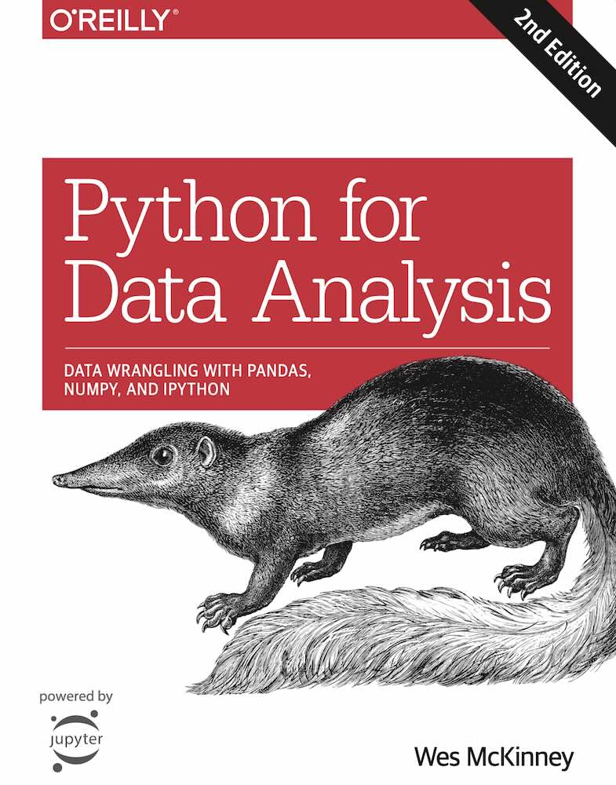

# Numpy
One of the reasons NumPy is so important for numerical computations in Python is because it is designed for efficiency on large arrays of data:
- NumPy internally stores data in a *contiguous block of memory*.
- NumPy operations perform complex computations *on entire arrays without the need for Python for loops*.

NumPy-based algorithms are generally 10 to 100 times faster (or more) than their pure Python counterparts and use significantly less memory.

## `ndarray`: A Multidimensional Array Object
An `ndarray` is a generic **multidimensional container for homogeneous data**; that is, all of the elements must be the same type.
```python
import numpy as np
# Generate some random data
data = np.random.randn(2, 3)
data

array([[-0.2047,  0.4789, -0.5194],
       [-0.5557,  1.9658,  1.3934]])

print(data * 10)

[[ -2.0471   4.7894  -5.1944]
 [ -5.5573  19.6578  13.9341]]

print(data + data)

[[-0.4094  0.9579 -1.0389]
 [-1.1115  3.9316  2.7868]]

print(data.shape)

(2, 3)

print(data.dtype)

float64

data2 = [[1, 2, 3, 4], [5, 6, 7, 8]]
arr2 = np.array(data2)
arr2

array([[1, 2, 3, 4],
       [5, 6, 7, 8]])

print(arr2.ndim)

2
arr2.shape

(2, 4)
```

### Creating ndarrays
`array` function. This accepts any sequence-like object (including other arrays) and produces a new NumPy array:
```python
data1 = [6, 7.5, 8, 0, 1]
arr1 = np.array(data1)

print(arr1)

array([ 6. ,  7.5,  8. ,  0. ,  1. ])
```

**`zeros`** and **`ones`** create arrays of 0s or 1s, respectively, with a given length or shape. **`empty`** creates an array without initializing its values to any particular value.
```python
print(np.zeros(10))

[ 0.  0.  0.  0.  0.  0.  0.  0.  0.  0.]

print(np.zeros((3, 6)))

[[ 0.  0.  0.  0.  0.  0.]
 [ 0.  0.  0.  0.  0.  0.]
 [ 0.  0.  0.  0.  0.  0.]]

print(np.empty((2, 3, 2)))

[[[ -1.4917e-154  -2.6868e+154]
  [  3.4585e-323   0.0000e+000]
  [  0.0000e+000   4.1940e+175]]

 [[  1.0510e-046   3.6035e+175]
  [  2.8073e-032   5.3956e-062]
  [  2.7689e-057   1.7908e+160]]]
```
**`arange`** is an *array-valued version of the built-in Python range function*:
```python
np.arange(15)

array([ 0,  1,  2,  3,  4,  5,  6,  7,  8,  9, 10, 11, 12, 13, 14])
```

### Data Types for ndarrays
Explicitly convert or cast an array from one dtype to another using ndarray’s **`astype`** method:
```python
arr = np.array([1, 2, 3, 4, 5])
print(arr.dtype)

int64

float_arr = arr.astype(np.float64)
print(float_arr.dtype)

float64

arr = np.array([3.7, -1.2, -2.6, 0.5, 12.9, 10.1])

print(arr)

[  3.7  -1.2  -2.6   0.5  12.9  10.1]

print(arr.astype(np.int32))                 # floating-point to integers: truncated

[ 3 -1 -2  0 12 10]

print(arr.astype(np.uint8))

[  3 255 254   0  12  10]
```

### Arithmetic with NumPy Arrays
Arrays enable you to express batch operations on data without writing any for loops. NumPy users call this ***vectorization***. Any arithmetic operations between equal-size arrays applies the operation **element-wise**:
```python
arr = np.array([[1., 2., 3.], [4., 5., 6.]])
print(arr)

[[ 1.  2.  3.]
 [ 4.  5.  6.]]

print(arr * arr)

[[  1.   4.   9.]
 [ 16.  25.  36.]]

print(arr - arr)

[[ 0.  0.  0.]
 [ 0.  0.  0.]]

print(1 / arr)                  # Operations with scalars propagates to each element

[[ 1.      0.5     0.3333]
 [ 0.25    0.2     0.1667]]

print(arr ** 0.5)

[[ 1.      1.4142  1.7321]
 [ 2.      2.2361  2.4495]]
```

**Comparisons between arrays** of the same size yield *boolean arrays*:
```python
arr2 = np.array([[0., 4., 1.], [7., 2., 12.]])

print(arr)

[[1. 2. 3.]
 [4. 5. 6.]]

print(arr2)

[[ 0.  4.  1.]
 [ 7.  2. 12.]]

print(arr2 > arr)

[[False  True False]
 [ True False  True]]
```
Operations between differently sized arrays is called ***broadcasting***.

### Basic Indexing and Slicing
```python
arr = np.arange(10)
print(arr)

[0 1 2 3 4 5 6 7 8 9]

print(arr[5])

5

print(arr[5:8])

[5 6 7]

arr[5:8] = 12

print(arr)

[ 0  1  2  3  4 12 12 12  8  9]
```
**Array slices are views** on the original array. This means that the *data is not copied*, and any **modifications to the view will be reflected in the source array**.


# Pandas
## Series
A Series is a **one-dimensional array-like object** containing a sequence of values and an associated array of data labels, called its **index**.

You can use *labels in the index* when selecting single values or a set of values:
```python
obj2 = pd.Series([4, 7, -5, 3], index=['d', 'b', 'a', 'c'])

obj2['a']
-5

obj2['d'] = 6

obj2[['c', 'a', 'd']]
c   3
a   -5
d   6
```

Another way to think about a Series is as a **fixed-length, ordered dict**, as it is a mapping of index values to data values.

You can create a Series from a Python dict:
```python
sdata = {'Ohio': 35000, 'Texas': 71000, 'Oregon': 16000, 'Utah': 5000}
obj3 = pd.Series(sdata)

obj3

Ohio      35000
Oregon    16000
Texas     71000
Utah       5000
dtype: int64
```

**NaN** (not a number), is considered in pandas to mark missing or NA values. The **`isnull` and `notnull`** functions in pandas should be used to detect missing data:
```python
obj4 = pd.Series(sdata, index=['California', 'Ohio', 'Oregon', 'Texas'])
obj4

California      NaN
Ohio            35000.0
Oregon          16000.0
Texas           71000.0
dtype: float64


pd.isnull(obj4)

California      True
Ohio            False
Oregon          False
Texas           False
dtype: bool
```

## Dataframe
A DataFrame represents a rectangular table of data and contains an ordered collection of columns, and has both a row and column index; it **can be thought of as a dict of Series** all sharing the same index.
```python
data = {'state': ['Ohio', 'Ohio', 'Ohio', 'Nevada', 'Nevada', 'Nevada'],
        'year': [2000, 2001, 2002, 2001, 2002, 2003],
        'pop': [1.5, 1.7, 3.6, 2.4, 2.9, 3.2]}
frame = pd.DataFrame(data)

frame
    pop   state  year
0  1.5    Ohio  2000
1  1.7    Ohio  2001
2  3.6    Ohio  2002
3  2.4  Nevada  2001
4  2.9  Nevada  2002
5  3.2  Nevada  2003
```

A column in a DataFrame **can be retrieved as a Series either by dict-like notation or by attribute**:
```python
frame2['state']    # frame2.state

one        Ohio
two        Ohio
three      Ohio
four     Nevada
five     Nevada
six      Nevada
Name: state, dtype: object
```

If you assign a Series, its labels will be realigned exactly to the DataFrame’s index, inserting missing values in any holes:
```python
val = pd.Series([-1.2, -1.5, -1.7], index=['two', 'four', 'five'])
frame2['debt'] = val

frame2

        year   state  pop  debt
one    2000    Ohio  1.5   NaN
two    2001    Ohio  1.7  -1.2
three  2002    Ohio  3.6   NaN
four   2001  Nevada  2.4  -1.5
five   2002  Nevada  2.9  -1.7
six    2003  Nevada  3.2   NaN
```
Assigning a column that doesn’t exist will *create a new column*.

The column returned from indexing a DataFrame is a **view on the underlying data, not a copy**. The column can be explicitly copied with the Series’s `copy` method.

**Dicts of Series** are treated in much the same way:
```python
pdata = {'Ohio': frame3['Ohio'][:-1],
         'Nevada': frame3['Nevada'][:2]}

pd.DataFrame(pdata)

        Nevada  Ohio
2000     NaN   1.5
2001     2.4   1.7
```

The `values` attribute returns the data contained in the DataFrame as a two-dimensional ndarray:
```python
frame3.values

array([[ nan,  1.5],
        [ 2.4,  1.7],
        [ 2.9,  3.6]])
```

## Index object
An Index also behaves like a *fixed-size set*, but unlike sets, a pandas Index can contain **duplicate labels**. Selections with duplicate labels will select *all occurrences of that label*.

## Essential Functionality

### Reindexing
Method `reindex`, which means to create a new object with the data conformed to a new index.
```python
obj = pd.Series([4.5, 7.2, -5.3, 3.6], index=['d', 'b', 'a', 'c'])
obj

d    4.5
b    7.2
a   -5.3
c    3.6
dtype: float64

obj2 = obj.reindex(['a', 'b', 'c', 'd', 'e'])
obj2

a   -5.3
b    7.2
c    3.6
d    4.5
e    NaN
dtype: float64
```

For ordered data like time series, it may be desirable to do some **interpolation** or filling of values when reindexing. The method option allows us to do this, using a method such as `ffill`, which forward-fills the values:
```python
obj3 = pd.Series(['blue', 'purple', 'yellow'], index=[0, 2, 4])
obj3

0      blue
2    purple
4    yellow
dtype: object

obj3.reindex(range(6), method='ffill')

0      blue
1      blue
2    purple
3    purple
4    yellow
5    yellow
dtype: object
```

When passed only a sequence, it *reindexes the rows in the result*:
```python
frame = pd.DataFrame(np.arange(9).reshape((3, 3)),
                     index=['a', 'c', 'd'],
                     columns=['Ohio', 'Texas', 'California'])
print(frame)

    Ohio  Texas  California
a     0      1           2
c     3      4           5
d     6      7           8

frame2 = frame.reindex(['a', 'b', 'c', 'd'])

print(frame2)

   Ohio  Texas  California
a   0.0    1.0         2.0
b   NaN    NaN         NaN
c   3.0    4.0         5.0
d   6.0    7.0         8.0
```
The columns can be reindexed with the *columns keyword*:
```python
states = ['Texas', 'Utah', 'California']
frame.reindex(columns=states)

	Texas	Utah	California
a	1	NaN	2
c	4	NaN	5
d	7	NaN	8
```

you can reindex more succinctly by label-indexing with `loc`:
```python
frame.loc[['a', 'b', 'c', 'd'], states]

	Texas	Utah	California
a	1.0	NaN	2.0
b	NaN	NaN	NaN
c	4.0	NaN	5.0
d	7.0	NaN	8.0
```

### Dropping Entries from an Axis
`drop` method will return a new object with the indicated value or values deleted from an axis:
```python
obj = pd.Series(np.arange(5.), index=['a', 'b', 'c', 'd', 'e'])
print(obj)

a    0.0
b    1.0
c    2.0
d    3.0
e    4.0
dtype: float64

new_obj = obj.drop('c')

print(obj.drop(['d', 'c']))

a    0.0
b    1.0
e    4.0
dtype: float64
```

With DataFrame, index values can be deleted from either axis.
```python
data = pd.DataFrame(np.arange(16).reshape((4, 4)),
                    index=['Ohio', 'Colorado', 'Utah', 'New York'],
                    columns=['one', 'two', 'three', 'four'])


                one	two	three	four
Ohio    	0	1	2	3
Colorado	4	5	6	7
Utah    	8	9	10	11
New York	12	13	14	15

print(data.drop(['Colorado', 'Ohio']))      # axis=0

          one  two  three  four
Utah        8    9     10    11
New York   12   13     14    15

print(data.drop('two', axis=1))             # axis='columns'

          one  three  four
Ohio        0      2     3
Colorado    4      6     7
Utah        8     10    11
New York   12     14    15

obj.drop('c', inplace=True)

a    0.0
b    1.0
d    3.0
e    4.0
```

### Indexing, Selection, and Filtering

#### Series
You can use the Series’s index values instead of only integers:
```python
obj = pd.Series(np.arange(4.), index=['a', 'b', 'c', 'd'])
print(obj)

a    0.0
b    1.0
c    2.0
d    3.0
dtype: float64

print(obj['b'])                 # print(obj[1])

1.0

print(obj[2:4])

c    2.0
d    3.0
dtype: float64

print(obj[['b', 'a', 'd']])

b    1.0
a    0.0
d    3.0
dtype: float64

print(obj[[1, 3]])

b    1.0
d    3.0
dtype: float64

print(obj[obj < 2])

a    0.0
b    1.0
dtype: float64

print(obj['b':'c'])             # inclusive

b    1.0
c    2.0
dtype: float64

obj['b':'c'] = 5

a    0.0
b    5.0
c    5.0
d    3.0
dtype: float64
```

#### Dataframe
Indexing into a DataFrame is for *retrieving one or more columns*:
```python
data = pd.DataFrame(np.arange(16).reshape((4, 4)),
                    index=['Ohio', 'Colorado', 'Utah', 'New York'],
                    columns=['one', 'two', 'three', 'four'])
print(data)

          one  two  three  four
Ohio        0    1      2     3
Colorado    4    5      6     7
Utah        8    9     10    11
New York   12   13     14    15

print(data['two'])

Ohio         1
Colorado     5
Utah         9
New York    13
Name: two, dtype: int64

print(type(data['two']))

<class 'pandas.core.series.Series'>

print(data[['three', 'one']])

          three  one
Ohio          2    0
Colorado      6    4
Utah         10    8
New York     14   12

print(type(data[['three', 'one']]))

<class 'pandas.core.frame.DataFrame'>
```

Special cases:
```python
print(data[:2])                     # slicing

          one  two  three  four
Ohio        0    1      2     3
Colorado    4    5      6     7

print(data[data['three'] > 5])      # boolean

          one  two  three  four
Colorado    4    5      6     7
Utah        8    9     10    11
New York   12   13     14    15
```

The row selection syntax `data[:2]` is provided as a convenience. **Passing a single element or a list to the `[]` operator selects columns**.

Indexing with a **boolean DataFrame**:
```python
print(data < 5)

            one    two  three   four
Ohio       True   True   True   True
Colorado   True  False  False  False
Utah      False  False  False  False
New York  False  False  False  False

data[data < 5] = 0

print(data)

          one  two  three  four
Ohio        0    0      0     0
Colorado    0    5      6     7
Utah        8    9     10    11
New York   12   13     14    15
```

##### Selection with loc and iloc
The special indexing operators `loc` and `iloc`. They enable you to ***select a subset of the rows and columns*** from a DataFrame with NumPy-like notation using either **axis labels (`loc`) or integers (`iloc`)**.

Let’s select a single row and multiple columns **by label with loc**:
```python
data.loc['Colorado', ['two', 'three']]      # rows, columns selector

two      5                                  # Series with columns values as index
three    6
Name: Colorado, dtype: int64
```

Similar selections with **integers using iloc**:
```python
print(data.iloc[2, [3, 0, 1]])              # single row, multiple columns

four    11                                  # Series with columns values as index
one      8
two      9
Name: Utah, dtype: int64

print(data.iloc[2])                         # single row, all columns

one       8                                 # Series with columns values as index
two       9
three    10
four     11
Name: Utah, dtype: int64

print(data.iloc[[1, 2], [3, 0, 1]])         # multiple rows, multiple columns

          four  one  two                    # Dataframe
Colorado     7    0    5
Utah        11    8    9
```

Both indexing functions work with slices in addition to single labels or lists of labels:
```python
print(data.loc[:'Utah', 'two'])         # Multiple rows, one column

Ohio        0                           # Series with index values as index
Colorado    5
Utah        9
Name: two, dtype: int64


print(data.iloc[:, :3][data.three > 5]) # Multiple rows, multiple values, rows selector

          one  two  three               # Dataframe
Colorado    0    5      6
Utah        8    9     10
New York   12   13     14
```

**Indexing options with DataFrame**
- `df[val]`
    - Select **single column or sequence of columns** from the DataFrame; special case conveniences: **boolean array** (filter rows), **slice** (slice rows), or **boolean DataFrame** (set values based on some criterion)
- `df.loc[val]`
    - Selects **single row or subset of rows** from the DataFrame **by label**
- `df.loc[:, val]`
    - Selects **single column or subset of columns** by label
- `df.loc[val1, val2]`
    - Select **both rows and columns by label**
- `df.iloc[where]`
    - Selects **single row or subset of rows** from the DataFrame **by integer position**
- `df.iloc[:, where]`
    - Selects **single column or subset of columns by integer position**
- `df.iloc[where_i, where_j]`
    - Select **both rows and columns by integer position**
- `df.at[label_i, label_j]`
    - Select a **single scalar value by row and column label**
- `df.iat[i, j]`
    - Select a **single scalar value by row and column position (integers)**
- `reindex` method
    - Select either rows or columns by labels
- `get_value`, `set_value` methods
    - Select single value by row and column label

If you have an axis index containing integers, data selection will always be label-oriented. For more precise handling, use loc (for labels) or iloc (for integers)
```python
ser = pd.Series(np.arange(3.))

print(ser[:1])

0    0.0
dtype: float64

print(ser.loc[:1])

0    0.0
1    1.0
dtype: float64

print(ser.iloc[:1])

0    0.0
dtype: float64
```

### Arithmetic and Data Alignment
When you are adding together objects, if any index pairs are not the same, the respective **index in the result will be the union of the index pairs**. For users with database experience, this is similar to an automatic *outer join* on the index labels.
The internal data alignment introduces *missing values* in the label locations that *don’t overlap*.
```python
s1 = pd.Series([7.3, -2.5, 3.4, 1.5], index=['a', 'c', 'd', 'e'])
s2 = pd.Series([-2.1, 3.6, -1.5, 4, 3.1],
               index=['a', 'c', 'e', 'f', 'g'])
print(s1)

a    7.3
c   -2.5
d    3.4
e    1.5
dtype: float64

print(s2)

a   -2.1
c    3.6
e   -1.5
f    4.0
g    3.1
dtype: float64


s1 + s2

a    5.2
c    1.1
d    NaN
e    0.0
f    NaN
g    NaN
dtype: float64


# In Dataframes alignment is performed on both the rows and the columns:

df1 = pd.DataFrame(np.arange(9.).reshape((3, 3)), columns=list('bcd'),
                   index=['Ohio', 'Texas', 'Colorado'])
df2 = pd.DataFrame(np.arange(12.).reshape((4, 3)), columns=list('bde'),
                   index=['Utah', 'Ohio', 'Texas', 'Oregon'])
print(df1)

            b    c    d
Ohio      0.0  1.0  2.0
Texas     3.0  4.0  5.0
Colorado  6.0  7.0  8.0

print(df2)

          b     d     e
Utah    0.0   1.0   2.0
Ohio    3.0   4.0   5.0
Texas   6.0   7.0   8.0
Oregon  9.0  10.0  11.0

print(df1 + df2)

            b   c     d   e
Colorado  NaN NaN   NaN NaN
Ohio      3.0 NaN   6.0 NaN
Oregon    NaN NaN   NaN NaN
Texas     9.0 NaN  12.0 NaN
Utah      NaN NaN   NaN NaN
```

#### Arithmetic methods with fill values

```python
df1 = pd.DataFrame(np.arange(12.).reshape((3, 4)),
                   columns=list('abcd'))
df2 = pd.DataFrame(np.arange(20.).reshape((4, 5)),
                   columns=list('abcde'))
df2.loc[1, 'b'] = np.nan
print(df1)

     a    b     c     d
0  0.0  1.0   2.0   3.0
1  4.0  5.0   6.0   7.0
2  8.0  9.0  10.0  11.0

print(df2)

      a     b     c     d     e
0   0.0   1.0   2.0   3.0   4.0
1   5.0   NaN   7.0   8.0   9.0
2  10.0  11.0  12.0  13.0  14.0
3  15.0  16.0  17.0  18.0  19.0

print(df1 + df2)

      a     b     c     d   e               # NA values in locations don’t overlap
0   0.0   2.0   4.0   6.0 NaN
1   9.0   NaN  13.0  15.0 NaN
2  18.0  20.0  22.0  24.0 NaN
3   NaN   NaN   NaN   NaN NaN

print(df1.add(df2, fill_value=0))           # add method with an argument to fill_value

      a     b     c     d     e
0   0.0   2.0   4.0   6.0   4.0
1   9.0   5.0  13.0  15.0   9.0
2  18.0  20.0  22.0  24.0  14.0
3  15.0  16.0  17.0  18.0  19.0
```

#### Operations between DataFrame and Series
Arithmetic between DataFrame and Series matches the index of the Series on the DataFrame’s columns, **broadcasting down the rows**:
```python
frame = pd.DataFrame(np.arange(12.).reshape((4, 3)),
                     columns=list('bde'),
                     index=['Utah', 'Ohio', 'Texas', 'Oregon'])
series = frame.iloc[0]
print(frame)

          b     d     e
Utah    0.0   1.0   2.0
Ohio    3.0   4.0   5.0
Texas   6.0   7.0   8.0
Oregon  9.0  10.0  11.0

print(series)

b    0.0
d    1.0
e    2.0
Name: Utah, dtype: float64

print(frame - series)

          b    d    e
Utah    0.0  0.0  0.0
Ohio    3.0  3.0  3.0
Texas   6.0  6.0  6.0
Oregon  9.0  9.0  9.0
```

If an index value is not found in either the DataFrame’s columns or the Series’s index, the objects will be **reindexed to form the union**:
```python
series2 = pd.Series(range(3), index=['b', 'e', 'f'])
print(frame + series2)

          b   d     e   f
Utah    0.0 NaN   3.0 NaN
Ohio    3.0 NaN   6.0 NaN
Texas   6.0 NaN   9.0 NaN
Oregon  9.0 NaN  12.0 NaN
```

If you want to instead **broadcast over the columns**, matching on the rows, you have to use one of the arithmetic methods:
```python
series3 = frame['d']
print(frame)

          b     d     e
Utah    0.0   1.0   2.0
Ohio    3.0   4.0   5.0
Texas   6.0   7.0   8.0
Oregon  9.0  10.0  11.0

print(series3)

Utah       1.0
Ohio       4.0
Texas      7.0
Oregon    10.0
Name: d, dtype: float64

print(frame.sub(series3, axis='index'))     # axis to match on (axis='index' or axis=0)

          b    d    e
Utah   -1.0  0.0  1.0
Ohio   -1.0  0.0  1.0
Texas  -1.0  0.0  1.0
Oregon -1.0  0.0  1.0
```

### Function Application and Mapping
*NumPy ufuncs* (element-wise array methods) also work with pandas objects:
```python
frame = pd.DataFrame(np.random.randn(4, 3), columns=list('bde'),
                     index=['Utah', 'Ohio', 'Texas', 'Oregon'])
print(frame)

               b         d         e
Utah   -0.204708  0.478943 -0.519439
Ohio   -0.555730  1.965781  1.393406
Texas   0.092908  0.281746  0.769023
Oregon  1.246435  1.007189 -1.296221

print(np.abs(frame))

               b         d         e
Utah    0.204708  0.478943  0.519439
Ohio    0.555730  1.965781  1.393406
Texas   0.092908  0.281746  0.769023
Oregon  1.246435  1.007189  1.296221
```

#### `apply` method
**Applying a function on one-dimensional arrays to each column or row**. DataFrame’s `apply` method does exactly this:

**`apply` works on a row / column basis of a DataFrame.**
```python
f = lambda x: x.max() - x.min()

frame.apply(f)                      # axis=0, axis='rows'
                                    # The same with frame.max() - frame.min()
b    1.802165
d    1.684034
e    2.689627
dtype: float64

frame.apply(f, axis='columns')      # axis=1, the function will be invoked
                                    # once per row instead

Utah      0.998382
Ohio      2.521511
Texas     0.676115
Oregon    2.542656
dtype: float64
```
Function f, is invoked once on each column (row) in frame. The result is a Series having the columns (rows) of frame as its index.

The function passed to apply **can also return a Series** with multiple values:
```python
def f(x):
    return pd.Series([x.min(), x.max()], index=['min', 'max'])

print(frame.apply(f))

            b         d         e
min -0.555730  0.281746 -1.296221
max  1.246435  1.965781  1.393406

print(frame.apply(f, axis=1))

             min       max
Utah   -0.519439  0.478943
Ohio   -0.555730  1.965781
Texas   0.092908  0.769023
Oregon -1.296221  1.246435
```

#### `applymap` method
This method applies a function that accepts and returns a scalar to **every element of a DataFrame**.

**`applymap` works element-wise on a DataFrame.**
```python
format = lambda x: '%.2f' % x

print(frame.applymap(format))

            b     d      e
Utah    -0.20  0.48  -0.52
Ohio    -0.56  1.97   1.39
Texas    0.09  0.28   0.77
Oregon   1.25  1.01  -1.30
```

#### `map` method
Series has a `map` method for applying an element-wise function.

**`map` works element-wise on a Series.**
```python
frame['e'].map(format)

Utah      -0.52
Ohio       1.39
Texas      0.77
Oregon    -1.30
Name: e, dtype: object
```

**Summing up, apply works on a row / column basis of a DataFrame, applymap works element-wise on a DataFrame, and map works element-wise on a Series.**

### Sorting and Ranking

#### Sorting by index
To sort lexicographically **by row or column index**, use the sort_index method:
```python
obj = pd.Series(range(4), index=['d', 'a', 'b', 'c'])

obj.sort_index()

a    1
b    2
c    3
d    0
dtype: int64
```

With a *DataFrame*, you can sort by index *on either axis*:
```python
frame = pd.DataFrame(np.arange(8).reshape((2, 4)),
                     index=['three', 'one'],
                     columns=['d', 'a', 'b', 'c'])

print(frame.sort_index())

       d  a  b  c
one    4  5  6  7
three  0  1  2  3

print(frame.sort_index(axis=1))                 # ascending=True

       a  b  c  d
three  1  2  3  0
one    5  6  7  4
```

#### Sorting by value
To sort a Series *by its values*, use its **`sort_values`** method:
```python
obj = pd.Series([4, 7, -3, 2])

obj.sort_values()                               # Missing values are sorted to the end

2   -3
3    2
0    4
1    7
dtype: int64
```
When **sorting a DataFrame**, you can use the data in one or more columns as the sort keys.
```python
frame = pd.DataFrame({'b': [4, 7, -3, 2], 'a': [0, 1, 0, 1]})

print(frame)

   a  b
0  0  4
1  1  7
2  0 -3
3  1  2

print(frame.sort_values(by='b'))

   a  b
2  0 -3
3  1  2
0  0  4
1  1  7

print(frame.sort_values(by=['a', 'b']))

   a  b
2  0 -3
0  0  4
3  1  2
1  1  7
```

#### Ranking
In statistics, ranking is the data transformation in which **numerical or ordinal values are replaced by their rank when the data are sorted**. For example, the numerical data 3.4, 5.1, 2.6, 7.3 are observed, the ranks of these data items would be 2, 3, 1 and 4 respectively. For example, the ordinal data hot, cold, warm would be replaced by 3, 1, 2.

The `rank` methods for Series and DataFrame are the place to look; by default rank breaks ties by assigning each group the mean rank:
```python
obj = pd.Series([7, -5, 7, 4, 2, 0, 4])

obj.rank()                                  # method='average'

0    6.5
1    1.0
2    6.5
3    4.5
4    3.0
5    2.0
6    4.5
dtype: float64

obj.rank(method='first')

0    6.0
1    1.0
2    7.0
3    4.0
4    3.0
5    2.0
6    5.0
dtype: float64
```

DataFrame can compute ranks over the rows or the columns:
```python
frame = pd.DataFrame({'b': [4.3, 7, -3, 2], 'a': [0, 1, 0, 1],
                      'c': [-2, 5, 8, -2.5]})
print(frame)

   a    b    c
0  0  4.3 -2.0
1  1  7.0  5.0
2  0 -3.0  8.0
3  1  2.0 -2.5

print(frame.rank(axis='columns'))

     a    b    c
0  2.0  3.0  1.0
1  1.0  3.0  2.0
2  2.0  1.0  3.0
3  2.0  3.0  1.0

print(frame.rank(axis='rows', method='dense'))

     a    b    c
0  1.0  3.0  2.0
1  2.0  4.0  3.0
2  1.0  1.0  4.0
3  2.0  2.0  1.0
```

### Axis Indexes with Duplicate Labels
It’s not mandatory that the labels be unique.
```python
obj = pd.Series(range(5), index=['a', 'a', 'b', 'b', 'c'])
obj

a    0
a    1
b    2
b    3
c    4
dtype: int64

obj.index.is_unique

False
```

Indexing a label with multiple entries returns a Series, while single entries return a scalar value:
```python
print(obj['a'])

a    0
a    1
dtype: int64

print(obj['c'])

4
```

The same logic extends to indexing rows in a DataFrame:
```python
df = pd.DataFrame(np.random.randn(4, 3), index=['a', 'a', 'b', 'b'])

print(df)

          0         1         2
a  0.274992  0.228913  1.352917
a  0.886429 -2.001637 -0.371843
b  1.669025 -0.438570 -0.539741
b  0.476985  3.248944 -1.021228

print(df.loc['b'])

          0         1         2
b  1.669025 -0.438570 -0.539741
b  0.476985  3.248944 -1.021228
```

## Summarizing and Computing Descriptive Statistics
The category of reductions or summary statistics, methods that extract a single value (like the sum or mean) from a Series or a Series of values from the rows or columns of a DataFrame. They have built-in handling for missing data.

NA values are excluded unless the entire slice (row or column in this case) is NA.
```python
df = pd.DataFrame([[1.4, np.nan], [7.1, -4.5],
                   [np.nan, np.nan], [0.75, -1.3]],
                  index=['a', 'b', 'c', 'd'],
                  columns=['one', 'two'])

print(df)

    one  two
a  1.40  NaN
b  7.10 -4.5
c   NaN  NaN
d  0.75 -1.3

df.sum()                                        # axis='rows', axis=0

one    9.25
two   -5.80
dtype: float64

df.sum(axis='columns')                          # axis=1

a    1.40
b    2.60
c     NaN
d   -0.55
dtype: float64

df.mean(axis='columns', skipna=False)

a      NaN
b    1.300
c      NaN
d   -0.275
dtype: float64
```

`idxmin` and `idxmax`, return indirect statistics like the *index value where the minimum or maximum values* are attained:
```python
df.idxmax()

one    b
two    d
dtype: object

print(df.idxmin(axis=1))

a    one
b    two
c    NaN
d    two
dtype: object
```

Other methods are *accumulations*:
```python
print(df.cumsum())

    one  two
a  1.40  NaN
b  8.50 -4.5
c   NaN  NaN
d  9.25 -5.8

print(df.cumsum(axis=1))

    one   two
a  1.40   NaN
b  7.10  2.60
c   NaN   NaN
d  0.75 -0.55
```

`describe` produces multiple summary statistics in one shot (different for numeric and non-numeric data):
```python
df.describe()

            one       two
count  3.000000  2.000000
mean   3.083333 -2.900000
std    3.493685  2.262742
min    0.750000 -4.500000
25%    1.075000 -3.700000
50%    1.400000 -2.900000
75%    4.250000 -2.100000
max    7.100000 -1.300000

obj = pd.Series(['a', 'a', 'b', 'c'] * 4)
print(obj.describe())                           # non-numeric data

count     16
unique     3
top        a
freq       8
dtype: object
```

### Correlation and Covariance
**`corr`** method of Series computes the correlation of the overlapping, non-NA, aligned-by-index values in two Series. Relatedly, **`cov`** computes the covariance:
```python
print(price)
print(volume)

                  AAPL         GOOG         IBM        MSFT
Date
2016-08-16   25.645245   777.140015  128.306335   53.246872
2016-08-17   25.607737   779.909973  128.098724   53.358116
2016-08-18   25.574909   777.500000  128.833298   53.395203
...                ...          ...         ...         ...

                   AAPL     GOOG        IBM        MSFT
Date
2016-08-16  135177600.0  1028000  2210200.0  20523500.0
2016-08-17  101424000.0   924200  3225900.0  18856400.0
2016-08-18   87938800.0   719400  3652000.0  14214300.0
...                 ...      ...        ...         ...

returns = price.pct_change()

print(returns.head())

                AAPL      GOOG       IBM      MSFT
Date
2016-08-16       NaN       NaN       NaN       NaN
2016-08-17 -0.001463  0.003564 -0.001618  0.002089
2016-08-18 -0.001282 -0.003090  0.005734  0.000695
2016-08-19  0.002567 -0.002675 -0.008181  0.000347
2016-08-22 -0.007772 -0.004217 -0.000250  0.000868


print(returns['MSFT'].corr(returns['IBM']))         # returns.MSFT.corr(returns.IBM)

0.517451866594

print(returns['MSFT'].cov(returns['IBM']))

0.00014529595094
```

DataFrame’s **`corr`** and **`cov`** methods, on the other hand, return a full **correlation or covariance matrix** as a DataFrame:
```python
print(returns.corr())

          AAPL      GOOG       IBM      MSFT
AAPL  1.000000  0.661975  0.441103  0.735550
GOOG  0.661975  1.000000  0.484141  0.775723
IBM   0.441103  0.484141  1.000000  0.517452
MSFT  0.735550  0.775723  0.517452  1.000000

print(returns.cov())

          AAPL      GOOG       IBM      MSFT
AAPL  0.000361  0.000212  0.000137  0.000240
GOOG  0.000212  0.000283  0.000133  0.000224
IBM   0.000137  0.000133  0.000268  0.000145
MSFT  0.000240  0.000224  0.000145  0.000294
```

DataFrame’s `corrwith` method computes pairwise correlations between a DataFrame’s columns or rows with another Series or DataFrame.
```python
print(returns.corrwith(returns.IBM))


AAPL    0.441103
GOOG    0.484141
IBM     1.000000
MSFT    0.517452
dtype: float64
```

Passing a DataFrame computes the correlations of matching column names.
```python
print(returns.corrwith(volume))

AAPL   -0.063093
GOOG   -0.119371
IBM    -0.104074
MSFT   -0.057059
dtype: float64
```

### Unique Values, Value Counts, and Membership
**`unique`**, which gives you an array of the unique values in a Series:
```python
obj = pd.Series(['c', 'a', 'd', 'a', 'a', 'b', 'b', 'c', 'c'])

uniques = obj.unique()
uniques

array(['c', 'a', 'd', 'b'], dtype=object)
```

**`value_counts`** computes a Series containing value frequencies:
```python
print(obj.value_counts())

c    3                                          # sorted by value in descending order
a    3
b    2
d    1
dtype: int64

print(obj.value_counts().index)

Index(['c', 'a', 'b', 'd'], dtype='object')

print(obj.value_counts().values)

[3 3 2 1]

pd.value_counts(obj.values, sort=False)         # top-level pandas method

a    3
d    1
c    3
b    2
dtype: int64
```

**`isin`** performs a vectorized set membership check and can be useful in *filtering a dataset* down to a subset of values in a Series or column in a DataFrame:
```python
print(obj)

0    c
1    a
2    d
3    a
4    a
5    b
6    b
7    c
8    c
dtype: object

mask = obj.isin(['b', 'c'])
print(mask)

0     True
1    False
2    False
3    False
4    False
5     True
6     True
7     True
8     True
dtype: bool

print(obj[mask])

0    c
5    b
6    b
7    c
8    c
dtype: object
```

`Index.get_indexer` method, which gives you an index array from an array of possibly non-distinct values into another array of distinct values
```python
to_match = pd.Series(['c', 'a', 'b', 'b', 'c', 'a'])
unique_vals = pd.Series(['c', 'b', 'a'])
pd.Index(unique_vals).get_indexer(to_match)

array([0, 2, 1, 1, 0, 2])
```

To compute a histogram on multiple related columns in a DataFrame:
```python
data = pd.DataFrame({'Qu1': [1, 3, 4, 3, 4],
                     'Qu2': [2, 3, 1, 2, 3],
                     'Qu3': [1, 5, 2, 4, 4]})
print(data)

   Qu1  Qu2  Qu3
0    1    2    1
1    3    3    5
2    4    1    2
3    3    2    4
4    4    3    4

result = data.apply(pd.value_counts).fillna(0)
print(result)

   Qu1  Qu2  Qu3
1  1.0  1.0  1.0
2  0.0  2.0  1.0
3  2.0  2.0  0.0
4  2.0  0.0  2.0
5  0.0  0.0  1.0
```
The row labels in the result are the distinct values occurring in all of the columns. The values are the respective counts of these values in each column.

# Data Loading, Storage, and File Formats
## Reading and Writing Data in Text Format

**`read_csv`** and **`read_table`** functions are likely the ones you’ll use the most. These functions *convert text data into a DataFrame*.
`pandas.read_csv`, perform **type inference**, that means you don’t necessarily have to specify which columns are numeric, integer, boolean, or string. Other data formats, like HDF5, Feather, and msgpack, have the data types stored in the format.

### `read_csv`
The same as `read_table` and specified the delimiter:
```python
df = pd.read_csv('examples/ex1.csv') = pd.read_table('examples/ex1.csv', sep=',')
```

A file will `not always have a header row`. In this case pandas to assign default column names, or you can specify names yourself, with the **`names` option**:
```python
print(pd.read_csv('examples/ex2.csv', header=None))

   0   1   2   3      4
0  1   2   3   4  hello
1  5   6   7   8  world
2  9  10  11  12    foo

print(pd.read_csv('examples/ex2.csv', names=['a', 'b', 'c', 'd', 'message']))

   a   b   c   d message
0  1   2   3   4   hello
1  5   6   7   8   world
2  9  10  11  12     foo
```

To specify a *column as the index*:
```python
names = ['a', 'b', 'c', 'd', 'message']
pd.read_csv('examples/ex2.csv', names=names, index_col='message')

         a   b   c   d
message
hello    1   2   3   4
world    5   6   7   8
foo      9  10  11  12
```

Hierarchical index from multiple columns:
```python
parsed = pd.read_csv('examples/csv_mindex.csv',
                     index_col=['key1', 'key2'])
print(parsed)

           value1  value2
key1 key2
one  a          1       2
     b          3       4
     c          5       6
     d          7       8
two  a          9      10
     b         11      12
     c         13      14
     d         15      16
```

A table might not have a fixed delimiter, and you can pass a regular expression as a delimiter for read_table with the *`sep` option*:
```python
result = pd.read_table('examples/ex3.txt', sep='\s+')
print(result)

            A         B         C           # Because one fewer column, infers the first column as index
aaa -0.264438 -1.026059 -0.619500
bbb  0.927272  0.302904 -0.032399
ccc -0.264273 -0.386314 -0.217601
ddd -0.871858 -0.348382  1.100491
```

#### Handling missing values
Missing data is usually either not present (empty string) or marked by some **sentinel** value.

```python
!cat examples/ex5.csv

something,a,b,c,d,message
one,1,2,3,4,NA
two,5,6,,8,world
three,9,10,11,12,foo

result = pd.read_csv('examples/ex5.csv')
print(result)

  something  a   b     c   d message
0       one  1   2   3.0   4     NaN
1       two  5   6   NaN   8   world
2     three  9  10  11.0  12     foo

print(pd.isnull(result))

   something      a      b      c      d  message
0      False  False  False  False  False     True
1      False  False  False   True  False    False
2      False  False  False  False  False    False
```

The **`na_values` option** can take either a list or set of strings to consider missing values:
```python
result = pd.read_csv('examples/ex5.csv', na_values=['NULL'])
print(result)

  something  a   b     c   d message
0       one  1   2   3.0   4     NaN
1       two  5   6   NaN   8   world
2     three  9  10  11.0  12     foo
```

keep_default_na option, indicates whether or not to include the default NaN values when parsing the data. Depending on whether na_values is passed in, the behavior may change:
```python
result = pd.read_csv('examples/ex5.csv', na_values=[''], keep_default_na=False)

print(result)

  something  a   b     c   d message
0       one  1   2   3.0   4      NA
1       two  5   6   NaN   8   world
2     three  9  10  11.0  12     foo

print(pd.isnull(result))

   something      a      b      c      d  message
0      False  False  False  False  False    False
1      False  False  False   True  False    False
2      False  False  False  False  False    False
```

Different **NA sentinels** can be specified for each column in a dict:
```python
sentinels = {'message': ['foo', 'NA'], 'something': ['two']}
print(pd.read_csv('examples/ex5.csv', na_values=sentinels))

  something  a   b     c   d message
0       one  1   2   3.0   4     NaN
1       NaN  5   6   NaN   8   world
2     three  9  10  11.0  12     NaN
```

Some useful options:
- `header`: defaults to 0 (first row), but should be *None if there is no header row*
- `index_col`: Column numbers or names to use as the row index; a single name/number or a list of them for a *hierarchical index*
- `names`: List of column names for result, combine with header=None.
- `na_values`: Sequence of values to replace with NA.
- `keep_default_na`: Wheter to keep the default values for NA (‘’, ..., ‘NA’, ‘NULL’, ‘NaN’, ‘n/a’, ‘nan’, ‘null’). Use in combination with `na_values` for different behavior.
- `parse_dates`: Parse data to datetime. Can combine multiple columns together. Use with `keep_date_col`.

### Reading Text Files in Pieces
When processing very large files you may only want to read in a *small piece of a file* (`nrows`) or *iterate through smaller chunks* (`chunksize`):
```python
print(pd.read_csv('examples/ex6.csv', nrows=5))

        one       two     three      four key
0  0.467976 -0.038649 -0.295344 -1.824726   L
1 -0.358893  1.404453  0.704965 -0.200638   B
2 -0.501840  0.659254 -0.421691 -0.057688   G
3  0.204886  1.074134  1.388361 -0.982404   R
4  0.354628 -0.133116  0.283763 -0.837063   Q

chunker = pd.read_csv('examples/ex6.csv', chunksize=1000)

tot = pd.Series([])
for piece in chunker:
    tot = tot.add(piece['key'].value_counts(), fill_value=0)

tot = tot.sort_values(ascending=False)
print(tot[:10])

E    368.0
X    364.0
L    346.0
O    343.0
Q    340.0
M    338.0
J    337.0
F    335.0
K    334.0
H    330.0
dtype: float64
```

TextParser is also equipped with a `get_chunk` method that enables you to read pieces of an arbitrary size. Also works with the `iterator` option:
```python
with pd.read_csv("tmp.sv", sep="|", iterator=True) as reader:
    reader.get_chunk(5)
```

### Writing Data to Text Format
DataFrame’s **`to_csv`** method:
```python
data.to_csv('examples/out.csv', sep='|')        # Other delimiters can be used
!cat examples/out.csv

|something|a|b|c|d|message
0|one|1|2|3.0|4|
1|two|5|6||8|world
2|three|9|10|11.0|12|foo

data.to_csv(sys.stdout, na_rep='NULL')          # Denote empty strings with sentinel

,something,a,b,c,d,message
0,one,1,2,3.0,4,NULL
1,two,5,6,NULL,8,world
2,three,9,10,11.0,12,foo

data.to_csv(sys.stdout, index=False, header=False)

one,1,2,3.0,4,                                  # Disable rows and columns labels
two,5,6,,8,world
three,9,10,11.0,12,foo

data.to_csv(sys.stdout, index=False, columns=['a', 'b', 'c'])

a,b,c                                           # Write only a subset of the columns
1,2,3.0
5,6,
9,10,11.0
```
Series also has a to_csv method:
```python
dates = pd.date_range('1/1/2000', periods=7)
ts = pd.Series(np.arange(7), index=dates)
ts.to_csv('examples/tseries.csv')
!cat examples/tseries.csv

,0
2000-01-01,0
2000-01-02,1
2000-01-03,2
2000-01-04,3
2000-01-05,4
2000-01-06,5
2000-01-07,6
```

### JSON Data
JSON is one of the standard formats for sending data by HTTP request between web browsers and other applications.

#### `json.loads` and `json.dumps`
To convert a **JSON string to Python form**, use `json.loads`:
```python
import json

obj = """
{"name": "Wes",
 "places_lived": ["United States", "Spain", "Germany"],
 "pet": null,
 "siblings": [{"name": "Scott", "age": 30, "pets": ["Zeus", "Zuko"]},
              {"name": "Katie", "age": 38,
               "pets": ["Sixes", "Stache", "Cisco"]}]
}
"""

result = json.loads(obj)

print(type(result))

<class 'dict'>

print(result)

{'name': 'Wes',
 'places_lived': ['United States', 'Spain', 'Germany'],
 'pet': None,
 'siblings': [{'name': 'Scott', 'age': 30, 'pets': ['Zeus', 'Zuko']},
  {'name': 'Katie', 'age': 38, 'pets': ['Sixes', 'Stache', 'Cisco']}]}
```

`json.dumps`, on the other hand, **converts a Python object back to JSON**:
```python
asjson = json.dumps(result)
asjson

'{"name": "Wes", "places_lived": ["United States", "Spain", "Germany"], "pet": null, "siblings": [{"name": "Scott", "age": 30, "pets": ["Zeus", "Zuko"]}, {"name": "Katie", "age": 38, "pets": ["Sixes", "Stache", "Cisco"]}]}'
```
You can pass a list of dicts to the **DataFrame constructor** and select a sub‐set of the data fields:
```python
siblings = pd.DataFrame(result['siblings'], columns=['name', 'age'])

print(siblings)

    name  age
0  Scott   30
1  Katie   38
```

**`pandas.read_json`** can automatically convert JSON datasets in specific arrangements into a Series or DataFrame:
```python
!cat examples/example.json

[{"a": 1, "b": 2, "c": 3},
 {"a": 4, "b": 5, "c": 6},
 {"a": 7, "b": 8, "c": 9}]

data = pd.read_json('examples/example.json')    # assume each object in the JSON array
                                                # is a row in the table:
print(data)

   a  b  c
0  1  2  3
1  4  5  6
2  7  8  9
```

To export data from pandas to JSON, one way is to use the **`to_json`** methods on Series and DataFrame:
```python
print(data.to_json())

{"a":{"0":1,"1":4,"2":7},"b":{"0":2,"1":5,"2":8},"c":{"0":3,"1":6,"2":9}}

print(data.to_json(orient='records'))

[{"a":1,"b":2,"c":3},{"a":4,"b":5,"c":6},{"a":7,"b":8,"c":9}]
```
### XML and HTML: Web Scraping
`read_html` automatically parse tables out of HTML files as DataFrame objects. By default it searches for and attempts to parse all tabular data contained within <table> tags.

Using `lxml.objectify`, we parse a xml file and get a reference to the root node.

## Binary Data Formats

### Pickle Serialization
Pandas objects all have a `to_pickle` method that writes the data to disk in pickle format and you can read it using `pandas.read_pickle`:
```python
frame = pd.read_csv('examples/ex1.csv')
print(frame)
frame.to_pickle('examples/frame_pickle')

   a   b   c   d message
0  1   2   3   4   hello
1  5   6   7   8   world
2  9  10  11  12     foo

pd.read_pickle('examples/frame_pickle')
```

### HDF5 Format
HDF5 is a well-regarded file format intended for storing large quantities of scientific array data. Each **HDF5 file can store multiple datasets**, supporting metadata and on-the-fly compression. HDF5 can be a good choice for working with very large datasets that don’t fit into memory.
Pandas provides a high-level interface with the `HDFStore` class that works like a dict:
```python
frame = pd.DataFrame({'a': np.random.randn(100)})
store = pd.HDFStore('mydata.h5')
store['obj1'] = frame
store['obj1_col'] = frame['a']

print(store['obj1'])                    # To retrive an object

           a
0   1.127481
1  -0.568363
..       ...
99  0.865990
```
HDFStore supports two **storage schemas**, 'fixed' and 'table'. The latter is generally slower, but it *supports query operations* using a special syntax:
```python
store.put('obj2', frame, format='table')        # The same as store['obj2'] = frame

print(store.select('obj2', where=['index >= 10 and index <= 15']))

           a
10  1.047184
11  0.923948
12 -0.114150
13  0.405802
14  0.288452
15 -0.434788

store.close()

frame.to_hdf('mydata.h5', 'obj3', format='table')
pd.read_hdf('mydata.h5', 'obj3', where=['index < 5'])

          a
0 -0.204708
1  0.478943
2 -0.519439
3 -0.555730
4  1.965781
```
Since many data analysis problems are I/O-bound (rather than CPU-bound), using a tool like HDF5 can massively accelerate your applications.

## Interacting with Databases
The **SQLAlchemy project** is a popular Python SQL toolkit that abstracts away many of the common differences between SQL databases. pandas has a `read_sql` function that enables you to read data easily from a general SQLAlchemy connection.
```python
import sqlalchemy as sqla
db = sqla.create_engine('sqlite:///mydata.sqlite')
print(pd.read_sql('select * from test', db))

             a           b     c  d
0      Atlanta     Georgia  1.25  6
1  Tallahassee     Florida  2.60  3
2   Sacramento  California  1.70  5
```

# Data Cleaning and Preparation
## Handling Missing Data
For numeric data, pandas uses the floating-point value NaN (Not a Number) to represent missing data. We call this a sentinel value:
```python
string_data = pd.Series(['aardvark', 'artichoke', np.nan, 'avocado'])
print(string_data)

0     aardvark
1    artichoke
2          NaN
3      avocado
dtype: object

print(string_data.isnull())

0    False
1    False
2     True
3    False
dtype: bool

string_data[0] = None

string_data.isnull()                # None value is also treated as NA in object arrays

0     True
1    False
2     True
3    False
dtype: bool
```

### Filtering Out Missing Data
#### `dropna`
On a *Series*, it returns the Series with only the non-null data and index values:
```python
from numpy import nan as NA
data = pd.Series([1, NA, 3.5, NA, 7])

data.dropna()                       # The same as data[data.notnull()]

0    1.0
2    3.5
4    7.0
dtype: float64
```
With *DataFrame* you may want to **drop rows or columns that are all NA or only those containing any NAs**. dropna by default drops any row containing a missing value:
```python
data = pd.DataFrame([[1., 6.5, 3.], [1., NA, NA],
                     [NA, NA, NA], [NA, 6.5, 3.]])
cleaned = data.dropna()
print(data)

     0    1    2
0  1.0  6.5  3.0
1  1.0  NaN  NaN
2  NaN  NaN  NaN
3  NaN  6.5  3.0

print(cleaned)

     0    1    2
0  1.0  6.5  3.0

print(data.dropna(how='all'))           # To drop rows that are all NA

     0    1    2   4
0  1.0  6.5  3.0 NaN
1  1.0  NaN  NaN NaN
3  NaN  6.5  3.0 NaN

data[4] = NA

print(data)

     0    1    2   4
0  1.0  6.5  3.0 NaN
1  1.0  NaN  NaN NaN
2  NaN  NaN  NaN NaN
3  NaN  6.5  3.0 NaN

print(data.dropna(axis=1, how='all'))           # To drop columns pass axis=1

     0    1    2
0  1.0  6.5  3.0
1  1.0  NaN  NaN
2  NaN  NaN  NaN
3  NaN  6.5  3.0
```

Suppose you want to *keep only rows containing a certain number of observations*. You can indicate this with the thresh argument:
```python
df = pd.DataFrame(np.random.randn(7, 3))
df.iloc[:4, 1] = NA
df.iloc[:2, 2] = NA
print(df)

          0         1         2
0 -0.204708       NaN       NaN
1 -0.555730       NaN       NaN
2  0.092908       NaN  0.769023
3  1.246435       NaN -1.296221
4  0.274992  0.228913  1.352917
5  0.886429 -2.001637 -0.371843
6  1.669025 -0.438570 -0.539741

print(df.dropna())

          0         1         2
4  0.274992  0.228913  1.352917
5  0.886429 -2.001637 -0.371843
6  1.669025 -0.438570 -0.539741

print(df.dropna(thresh=2))

          0         1         2
2  0.092908       NaN  0.769023
3  1.246435       NaN -1.296221
4  0.274992  0.228913  1.352917
5  0.886429 -2.001637 -0.371843
6  1.669025 -0.438570 -0.539741
```

### Filling In Missing Data
Rather than filtering out missing data you may want to *fill in the “holes”*. Calling fillna with a constant replaces missing values with that value:
```python
print(df.fillna(0))

          0         1         2
0 -0.204708  0.000000  0.000000
1 -0.555730  0.000000  0.000000
2  0.092908  0.000000  0.769023
3  1.246435  0.000000 -1.296221
4  0.274992  0.228913  1.352917
5  0.886429 -2.001637 -0.371843
6  1.669025 -0.438570 -0.539741

df.fillna({1: 0.5, 2: 0})           # Use a different fill value for each column:

          0         1         2
0 -0.204708  0.500000  0.000000
1 -0.555730  0.500000  0.000000
2  0.092908  0.500000  0.769023
3  1.246435  0.500000 -1.296221
4  0.274992  0.228913  1.352917
5  0.886429 -2.001637 -0.371843
6  1.669025 -0.438570 -0.539741

df = pd.DataFrame(np.random.randn(6, 3))
df.iloc[2:, 1] = NA
df.iloc[4:, 2] = NA

print(df)

          0         1         2
0  0.476985  3.248944 -1.021228
1 -0.577087  0.124121  0.302614
2  0.523772       NaN  1.343810
3 -0.713544       NaN -2.370232
4 -1.860761       NaN       NaN
5 -1.265934       NaN       NaN

print(df.fillna(method='ffill'))            # Interpoltation method

          0         1         2
0  0.476985  3.248944 -1.021228
1 -0.577087  0.124121  0.302614
2  0.523772  0.124121  1.343810
3 -0.713544  0.124121 -2.370232
4 -1.860761  0.124121 -2.370232
5 -1.265934  0.124121 -2.370232

print(df.fillna(method='ffill', limit=2))

          0         1         2
0  0.476985  3.248944 -1.021228
1 -0.577087  0.124121  0.302614
2  0.523772  0.124121  1.343810
3 -0.713544  0.124121 -2.370232
4 -1.860761       NaN -2.370232
5 -1.265934       NaN -2.370232
```

## Data Transformation
### Removing Duplicates
DataFrame method `duplicated` returns a boolean Series indicating whether each row is a duplicate:
```python
data = pd.DataFrame({'k1': ['one', 'two'] * 3 + ['two'],
                     'k2': [1, 1, 2, 3, 3, 4, 4]})
print(data)

    k1  k2
0  one   1
1  two   1
2  one   2
3  two   3
4  one   3
5  two   4
6  two   4

print(data.duplicated())

0    False
1    False
2    False
3    False
4    False
5    False
6     True
dtype: bool

```
#### `drop_duplicates`
Returns a DataFrame where the duplicated array is False:
```python
print(data.drop_duplicates())

    k1  k2
0  one   1
1  two   1
2  one   2
3  two   3
4  one   3
5  two   4

data['v1'] = range(7)
print(data.drop_duplicates(['k1']))             # Specify any subset of columns

    k1  k2  v1
0  one   1   0
1  two   1   1
                                                # By default keep the first observed
                                                # value combination
print(data.drop_duplicates(['k1', 'k2'], keep='last'))

    k1  k2  v1
0  one   1   0
1  two   1   1
2  one   2   2
3  two   3   3
4  one   3   4
6  two   4   6
```

### Transforming Data Using a Function or Mapping
Perform some transformation based on the values in an array, Series, or column in a DataFrame.
```python
data = pd.DataFrame({'food': ['bacon', 'pulled pork', 'bacon',
                              'Pastrami', 'corned beef', 'Bacon',
                              'pastrami', 'honey ham', 'nova lox'],
                     'ounces': [4, 3, 12, 6, 7.5, 8, 3, 5, 6]})
print(data)

          food  ounces
0        bacon     4.0
1  pulled pork     3.0
2        bacon    12.0
3     Pastrami     6.0
4  corned beef     7.5
5        Bacon     8.0
6     pastrami     3.0
7    honey ham     5.0
8     nova lox     6.0
```

The map method on a Series accepts a function or dict-like object containing a mapping:
```python
meat_to_animal = {
  'bacon': 'pig',
  'pulled pork': 'pig',
  'pastrami': 'cow',
  'corned beef': 'cow',
  'honey ham': 'pig',
  'nova lox': 'salmon'
}

lowercased = data['food'].str.lower()
data['animal'] = lowercased.map(meat_to_animal)
print(data)

          food  ounces  animal
0        bacon     4.0     pig
1  pulled pork     3.0     pig
2        bacon    12.0     pig
3     Pastrami     6.0     cow
4  corned beef     7.5     cow
5        Bacon     8.0     pig
6     pastrami     3.0     cow
7    honey ham     5.0     pig
8     nova lox     6.0  salmon

                                                    # The same as
data['animal'] = data['food'].map(lambda x: meat_to_animal[x.lower()])
```

### Replacing Values
**`replace`** provides a simpler and more flexible way to modify a subset of values:
```python
data = pd.Series([1., -999., 2., -999., -1000., 3.])
data

0       1.0
1    -999.0
2       2.0
3    -999.0
4   -1000.0
5       3.0
dtype: float64

data.replace(-999, np.nan)

0       1.0
1       NaN
2       2.0
3       NaN
4   -1000.0
5       3.0
dtype: float64

data.replace([-999, -1000], np.nan)                 # Replace multiple values at once

0    1.0
1    NaN
2    2.0
3    NaN
4    NaN
5    3.0
dtype: float64

                                                    # Use a different replacement
                                                    # for each value
data.replace([-999, -1000], [np.nan, 0])

0    1.0
1    NaN
2    2.0
3    NaN
4    0.0
5    3.0
dtype: float64

data.replace({-999: np.nan, -1000: 0})              # Can also be a dict:

0    1.0
1    NaN
2    2.0
3    NaN
4    0.0
5    3.0
dtype: float64
```
### Renaming Axis Indexes
Axis labels can be similarly transformed by a function or mapping using the `map` method:
```python
data = pd.DataFrame(np.arange(12).reshape((3, 4)),
                    index=['Ohio', 'Colorado', 'New York'],
                    columns=['one', 'two', 'three', 'four'])
print(data)

          one  two  three  four
Ohio        0    1      2     3
Colorado    4    5      6     7
New York    8    9     10    11

transform = lambda x: x[:4].upper()

data.index = data.index.map(transform)
print(data)

      one  two  three  four
OHIO    0    1      2     3
COLO    4    5      6     7
NEW     8    9     10    11
```
To create a transformed version of a dataset without modifying the original, a useful method is `rename`:
```python
data.rename(index=str.title, columns=str.upper)

      ONE  TWO  THREE  FOUR
Ohio    0    1      2     3
Colo    4    5      6     7
New     8    9     10    11

data.rename(index={'OHIO': 'INDIANA'},
            columns={'three': 'peekaboo'})

         one  two  peekaboo  four
INDIANA    0    1         2     3
COLO       4    5         6     7
NEW        8    9        10    11
```

### Discretization and Binning
Continuous data is often discretized or otherwise separated into “**bins**” for analysis.
#### `cut` function
```python
ages = [20, 22, 25, 27, 21, 23, 37, 31, 61, 45, 41, 32]

bins = [18, 25, 35, 60, 100]
cats = pd.cut(ages, bins)
print(cats)

[(18, 25], (18, 25], (18, 25], (25, 35], ..., (25, 35], (35, 60], (35, 60], (25, 35]]
Length: 12
Categories (4, interval[int64]): [(18, 25] < (25, 35] < (35, 60] < (60, 100]]

print(cats.codes)

[0 0 0 1 0 0 2 1 3 2 2 1]

print(cats.categories)

IntervalIndex([(18, 25], (25, 35], (35, 60], (60, 100]],
              closed='right',
              dtype='interval[int64]')

print(pd.value_counts(cats))                        # The bin counts

(18, 25]     5
(35, 60]     3
(25, 35]     3
(60, 100]    1
dtype: int64
                                            # parenthesis means that the side is open,
                                            # while the square bracket means it is
                                            # closed (inclusive).
pd.cut(ages, [18, 26, 36, 61, 100], right=False)

[[18, 26), [18, 26), [18, 26), ..., [61, 100), [36, 61), [36, 61), [26, 36)]
Length: 12
Categories (4, interval[int64]): [[18, 26) < [26, 36) < [36, 61) < [61, 100)]


group_names = ['Youth', 'YoungAdult', 'MiddleAged', 'Senior']
pd.cut(ages, bins, labels=group_names)      # You can also pass your own bin names

['Youth', 'Youth', 'Youth', 'YoungAdult',, ..., 'Senior', 'MiddleAged', 'YoungAdult']
Length: 12
Categories (4, object): ['Youth' < 'YoungAdult' < 'MiddleAged' < 'Senior']


                                            # Compute equal-length bins based on the
                                            # minimum and maximum values in the data.
data = np.random.rand(20)
eq_spcd = pd.cut(data, 4, precision=2)      # Limits the precision to two digits

print(eq_spcd)

[(0.34, 0.55], (0.34, 0.55], ..., (0.34, 0.55], (0.34, 0.55], (0.12, 0.34]]
Length: 20
Categories (4, interval[float64]): [(0.12, 0.34] < (0.34, 0.55] <
                                    (0.55, 0.76] < (0.76, 0.97]]

pd.value_counts(eq_spcd)

(0.72, 0.96]     8
(0.012, 0.25]    5
(0.49, 0.72]     4
(0.25, 0.49]     3
dtype: int64
```
The object pandas returns is a special `Categorical` object. The output you see describes the bins computed by `pandas.cut`. You can treat it like an array of strings indicating the bin name.

#### `qcut` bins based on sample quantiles
Since `qcut` uses sample quantiles instead, by definition you will obtain roughly equal-size bins:
```python
data = np.random.randn(1000)  # Normally distributed
cats = pd.qcut(data, 4)  # Cut into quartiles

print(cats)

[(-0.0265, 0.62], (0.62, 3.928], (-0.68, -0.0265], ..., (0.62, 3.928], (-0.68, -0.0265]]
Length: 1000
Categories (4, interval[float64]): [(-2.94999, -0.68] < (-0.68, -0.0265] <
                                    (-0.0265, 0.62] < (0.62, 3.928]]


pd.value_counts(cats)

(0.62, 3.928]                   250
(-0.0265, 0.62]                 250
(-0.68, -0.0265]                250
(-2.9499999999999997, -0.68]    250
dtype: int64


cats2 = pd.qcut(data, [0, 0.1, 0.5, 0.9, 1.])       # You can pass your own quantiles
print(cats2)

[(-0.0265, 1.286], (-0.0265, 1.286], ..., (-0.0265, 1.286], (-1.187, -0.0265]]
Length: 1000
Categories (4, interval[float64]): [(-2.9499, -1.187] < (-1.187, -0.0265] <
                                    (-0.0265, 1.286] < (1.286, 3.928]]

print(pd.value_counts(cats2))

(-0.0265, 1.286]                 400
(-1.187, -0.0265]                400
(1.286, 3.928]                   100
(-2.9499999999999997, -1.187]    100
dtype: int64
```

### Detecting and Filtering Outliers
Suppose you wanted to find rows which values in any of the columns exceeding 3 in absolute value, you can use the `any` method on a boolean DataFrame:
```python
data = pd.DataFrame(np.random.randn(1000, 4))
print(data.describe())

                 0            1            2            3
count  1000.000000  1000.000000  1000.000000  1000.000000
mean      0.016337    -0.013324    -0.046595    -0.036139
std       1.017826     0.998623     0.970669     0.983259
min      -2.901765    -3.508448    -3.087639    -3.066981
25%      -0.713950    -0.682302    -0.726247    -0.716703
50%       0.016486    -0.022984    -0.025716    -0.052489
75%       0.743954     0.693382     0.626514     0.616451
max       3.004068     3.961734     3.039873     3.389719

col = data[2]
print(col[np.abs(col) > 3])

417    3.039873
797   -3.087639
Name: 2, dtype: float64

                                        # Select rows which any column value > abs(3)
print(np.abs(data[(np.abs(data) > 3).any(1)]) > 3)

         0      1      2      3
211  False   True  False  False
220   True  False  False  False
292  False  False  False   True
376  False   True  False  False
402  False  False  False   True
417  False  False   True  False
439  False   True  False  False
600  False  False  False   True
797  False  False   True  False
874  False   True  False  False

print(data[(np.abs(data) > 3).any(1)])

            0         1         2         3
211  1.481675  3.113495  0.837764  2.257483
220  3.004068 -0.344172 -0.310593 -1.246154
292  0.151798 -2.436584 -0.095799  3.389719
376 -0.888403 -3.089560  0.898763 -0.837477
402  1.492226 -0.655538 -0.718596 -3.066981
417  0.040141  0.360827  3.039873 -0.736824
439 -0.148032 -3.508448 -1.505830  0.006500
600  0.733272  0.623477  0.357085  3.153123
797  0.100989 -0.694585 -3.087639  1.379808
874 -0.523147  3.961734 -0.819945  1.442860


                                            # Cap values outside the inter‐ val –3 to 3
data[np.abs(data) > 3] = np.sign(data) * 3
print(data.describe())

                 0            1            2            3
count  1000.000000  1000.000000  1000.000000  1000.000000
mean      0.016333    -0.013801    -0.046547    -0.036615
std       1.017814     0.992965     0.970272     0.981285
min      -2.901765    -3.000000    -3.000000    -3.000000
25%      -0.713950    -0.682302    -0.726247    -0.716703
50%       0.016486    -0.022984    -0.025716    -0.052489
75%       0.743954     0.693382     0.626514     0.616451
max       3.000000     3.000000     3.000000     3.000000
```
The function `np.sign(x)` returns `-1 if x < 0, 0 if x == 0, 1 if x > 0`.

### Permutation and Random Sampling
**Permuting** (randomly reordering) is easy to do using the `numpy.random.permutation` function.
```python
df = pd.DataFrame(np.arange(5 * 4).reshape((5, 4)))
sampler = np.random.permutation(5)
sampler

array([4, 1, 3, 0, 2])

print(df)

    0   1   2   3
0   0   1   2   3
1   4   5   6   7
2   8   9  10  11
3  12  13  14  15
4  16  17  18  19

print(df.take(sampler))                 # The same as df.iloc[sampler]

    0   1   2   3
4  16  17  18  19
1   4   5   6   7
3  12  13  14  15
0   0   1   2   3
2   8   9  10  11
```

To select a *random subset without replacement*, you can use the `sample` method on Series and DataFrame:
```python
print(df.sample(n=3))

    0   1   2   3
3  12  13  14  15
1   4   5   6   7
4  16  17  18  19
```
To generate a *sample with replacement*:
```python
choices = pd.Series([5, 7, -1, 6, 4])
draws = choices.sample(n=10, replace=True)
draws

0    5
2   -1
4    4
0    5
3    6
0    5
1    7
0    5
4    4
4    4
dtype: int64
```

### Computing Indicator/Dummy Variables
Converting a categorical variable into a “**dummy**” or “**indicator**” matrix: one that takes only the value 0 or 1 to indicate the absence or presence of some categorical effect. If a column in a DataFrame has k distinct values, you would derive a matrix or DataFrame with k columns containing all 1s and 0s.
```python
df = pd.DataFrame({'key': ['b', 'b', 'a', 'c', 'a', 'b'],
                   'data1': range(6)})
print(df)

  key  data1
0   b      0
1   b      1
2   a      2
3   c      3
4   a      4
5   b      5

print(pd.get_dummies(df))

   data1  key_a  key_b  key_c
0      0      0      1      0
1      1      0      1      0
2      2      1      0      0
3      3      0      0      1
4      4      1      0      0
5      5      0      1      0

dummies = pd.get_dummies(df['key'], prefix='key')       # Add prefix
df_with_dummy = df[['data1']].join(dummies)             # Merge with the other data
print(df_with_dummy)

   data1  key_a  key_b  key_c
0      0      0      1      0
1      1      0      1      0
2      2      1      0      0
3      3      0      0      1
4      4      1      0      0
5      5      0      1      0
```

A useful recipe for statistical applications is to combine get_dummies with a discreti‐ zation function like cut:
```python
np.random.seed(12345)
values = np.random.rand(10)
print(values)

[0.9296 0.3164 0.1839 0.2046 0.5677 0.5955 0.9645 0.6532 0.7489 0.6536]

bins = [0, 0.2, 0.4, 0.6, 0.8, 1]
print(pd.get_dummies(pd.cut(values, bins)))

   (0.0, 0.2]  (0.2, 0.4]  (0.4, 0.6]  (0.6, 0.8]  (0.8, 1.0]
0           0           0           0           0           1
1           0           1           0           0           0
2           1           0           0           0           0
3           0           1           0           0           0
4           0           0           1           0           0
5           0           0           1           0           0
6           0           0           0           0           1
7           0           0           0           1           0
8           0           0           0           1           0
9           0           0           0           1           0
```

## String Manipulation
Pandas enables you to apply string and regular expressions concisely on whole arrays of data, additionally handling the annoyance of missing data.

### String Object Methods
```python
val = 'a,b,  guido'
val.split(',')

['a', 'b', '  guido']

pieces = [x.strip() for x in val.split(',')]
pieces

['a', 'b', 'guido']

'::'.join(pieces)

'a::b::guido'

'guido' in val

print(val.index(','))               # Difference between find and index is that index
                                    # raises an exception if the string isn’t found
                                    # (versus returning –1):
1

print(val.find(':'))

-1

val.count(',')

2

print(val.replace(',', '::'))

a::b::  guido

print(val.replace(',', ''))

ab  guido
```

### Regular Expressions
A single expression, commonly called a **regex**, is a string formed according to the regular expression language. Python’s built-in **`re` module** is responsible for applying regular expressions to strings.
The re module functions fall into three categories: *pattern matching, substitution, and splitting*.

Creating a regex object with re.compile is highly recommended if you intend to apply the same expression to many strings; doing so will save CPU cycles.
```python
import re
text = "foo    bar\t baz  \tqux"
re.split('\s+', text)

['foo', 'bar', 'baz', 'qux']
                                        # First compile and then split (recommended)
regex = re.compile('\s+')
regex.split(text)

['foo', 'bar', 'baz', 'qux']
```
#### `findall`, `search` and `match` methods
`findall` returns all matches in a string.
```python
regex.findall(text)

['    ', '\t ', '  \t']

text = """Dave dave@google.com
Steve steve@gmail.com
Rob rob@gmail.com
Ryan ryan@yahoo.com
"""
pattern = r'[A-Z0-9._%+-]+@[A-Z0-9.-]+\.[A-Z]{2,4}'

# re.IGNORECASE makes the regex case-insensitive
regex = re.compile(pattern, flags=re.IGNORECASE)

regex.findall(text)

['dave@google.com', 'steve@gmail.com', 'rob@gmail.com', 'ryan@yahoo.com']
```
`search` returns only the first match.
`search` returns a special *match object* for the first match. The match object can only tell us the start and end position of the pattern in the string.
```python
m = regex.search(text)
print(m)

<_sre.SRE_Match object; span=(5, 20), match='dave@google.com'>

print(text[m.start():m.end()])

dave@google.com
```
`match` match pattern at start of string and optionally segment pattern components into *groups*; if the pattern matches, returns a *match object*, and otherwise None
```python
print(regex.match(text))

None
```
`sub` will return a new string with occurrences of the pattern replaced by the a new string:
```python
print(regex.sub('REDACTED', text))

Dave REDACTED
Steve REDACTED
Rob REDACTED
Ryan REDACTED
```
#### Groups
To segment each address into its three components: username, domain name, and domain suffix, put parentheses around the parts of the pattern to segment:
```python
pattern = r'([A-Z0-9._%+-]+)@([A-Z0-9.-]+)\.([A-Z]{2,4})'
regex = re.compile(pattern, flags=re.IGNORECASE)

m = regex.match('wesm@bright.net')
m.groups()

('wesm', 'bright', 'net')

regex.findall(text)

[('dave', 'google', 'com'),
 ('steve', 'gmail', 'com'),
 ('rob', 'gmail', 'com'),
 ('ryan', 'yahoo', 'com')]
```
`sub` also has access to groups in each match using special symbols like \1 and \2:
```python
print(regex.sub(r'Username: \1, Domain: \2, Suffix: \3', text))

Dave Username: dave, Domain: google, Suffix: com
Steve Username: steve, Domain: gmail, Suffix: com
Rob Username: rob, Domain: gmail, Suffix: com
Ryan Username: ryan, Domain: yahoo, Suffix: com
```

### Vectorized String Functions in pandas
Series has array-oriented methods for string operations that skip NA values. These are accessed through Series’s **`str` attribute**.
```python
data = {'Dave': 'dave@google.com', 'Steve': 'steve@gmail.com',
        'Rob': 'rob@gmail.com', 'Wes': np.nan}
data = pd.Series(data)
print(data)

Dave     dave@google.com
Steve    steve@gmail.com
Rob        rob@gmail.com
Wes                  NaN
dtype: object

print(data.isnull())

Dave     False
Steve    False
Rob      False
Wes       True
dtype: bool

data.str.contains('gmail')

Dave     False
Steve     True
Rob       True
Wes        NaN
dtype: object
```
**Regular expressions** can be used:
- `match()`
    - Use `re.match` with the passed regular expression on each element, returning matched groups as list.
    - Call `re.match()` on each element, returning a boolean.
- `extract()`
    - Use a regular expression with groups to extract one or more strings from a Series of strings; the result will be a DataFrame with one column per group
    - Call re.match() on each element, returning matched groups as strings.
- `findall()`
    - Compute list of all occurrences of pattern/regex for each string
    - Call re.findall() on each element
- `replace()`
    - Replace occurrences of pattern with some other string
- `contains()`
    - Call re.search() on each element, returning a boolean
- `count()`
    - Count occurrences of pattern
- `split()`
    - Equivalent to str.split(), but accepts regexps
- `rsplit()`
    - Equivalent to str.rsplit(), but accepts regexps
```python
print(pattern)

([A-Z0-9._%+-]+)@([A-Z0-9.-]+)\.([A-Z]{2,4})

data.str.findall(pattern, flags=re.IGNORECASE)

Dave     [(dave, google, com)]
Steve    [(steve, gmail, com)]
Rob        [(rob, gmail, com)]
Wes                        NaN
dtype: object

matches = data.str.match(pattern, flags=re.IGNORECASE)
print(matches)

Dave     True
Steve    True
Rob      True
Wes       NaN
dtype: object
```

# Data Wrangling: Join, Combine, and Reshape
## Hierarchical Indexing
Hierarchical indexing is an important feature of pandas that enables you to have multiple (two or more) index levels on an axis. It provides a way for you to *work with higher dimensional data in a lower dimensional form*.
```python
data = pd.Series(np.random.randn(9),
                 index=[['a', 'a', 'a', 'b', 'b', 'c', 'c', 'd', 'd'],
                        [1, 2, 3, 1, 3, 1, 2, 2, 3]])
print(data)

a  1   -0.204708
   2    0.478943
   3   -0.519439
b  1   -0.555730
   3    1.965781
c  1    1.393406
   2    0.092908
d  2    0.281746
   3    0.769023
dtype: float64

print(data.index)

MultiIndex([('a', 1),                   # MultiIndex object
            ('a', 2),
            ('a', 3),
            ('b', 1),
            ('b', 3),
            ('c', 1),
            ('c', 2),
            ('d', 2),
            ('d', 3)],
           )
```
With a hierarchically indexed object, so-called partial indexing:
```python
print(data['b'])

1   -0.555730
3    1.965781
dtype: float64

print(data['b':'c'])

b  1   -0.555730
   3    1.965781
c  1    1.393406
   2    0.092908
dtype: float64

print(data.loc[['b', 'd']])

b  1   -0.555730
   3    1.965781
d  2    0.281746
   3    0.769023
dtype: float64

data.loc[:, 2]                      # Selection from an "inner" level

a    0.478943
c    0.092908
d    0.281746
dtype: float64

data.loc[['a','b'], [1,3]]

a  1   -0.204708
   3   -0.519439
b  1   -0.555730
   3    1.965781
dtype: float64
```

### `stack` and `unstack` methods
You could rearrange the data into a DataFrame using its unstack method:
```python
print(data.unstack())

          1         2         3
a -0.204708  0.478943 -0.519439
b -0.555730       NaN  1.965781
c  1.393406  0.092908       NaN
d       NaN  0.281746  0.769023

print(data.unstack().stack())

a  1   -0.204708
   2    0.478943
   3   -0.519439
b  1   -0.555730
   3    1.965781
c  1    1.393406
   2    0.092908
d  2    0.281746
   3    0.769023
dtype: float64
```

With a **DataFrame**, either axis can have a hierarchical index:
```python
frame = pd.DataFrame(np.arange(12).reshape((4, 3)),
                     index=[['a', 'a', 'b', 'b'], [1, 2, 1, 2]],
                     columns=[['Ohio', 'Ohio', 'Colorado'],
                              ['Green', 'Red', 'Green']])
print(frame)

     Ohio     Colorado
    Green Red    Green
a 1     0   1        2
  2     3   4        5
b 1     6   7        8
  2     9  10       11

print(frame['Ohio'])                # partial column indexing select groups of columns

color      Green  Red
key1 key2
a    1         0    1
     2         3    4
b    1         6    7
     2         9   10
```

### Reordering and Sorting Levels
`swaplevel` rearranges the order of the levels on an axis and `sort_index` sorts the data using only the values in a single level:
```python
print(frame.swaplevel('key1', 'key2'))

state      Ohio     Colorado
color     Green Red    Green
key2 key1
1    a        0   1        2
2    a        3   4        5
1    b        6   7        8
2    b        9  10       11

print(frame.sort_index(level=1))

state      Ohio     Colorado
color     Green Red    Green
key1 key2
a    1        0   1        2
b    1        6   7        8
a    2        3   4        5
b    2        9  10       11

print(frame.swaplevel(0, 1).sort_index(level=0))

state      Ohio     Colorado
color     Green Red    Green
key2 key1
1    a        0   1        2
     b        6   7        8
2    a        3   4        5
     b        9  10       11
```
### Summary Statistics by Level
Specify the level you want to aggregate by on a particular axis
```python
print(frame.sum(level='key2'))

state  Ohio     Colorado
color Green Red    Green
key2
1         6   8       10
2        12  14       16

print(frame.sum(level='color', axis=1))

color      Green  Red
key1 key2
a    1         2    1
     2         8    4
b    1        14    7
     2        20   10
```

### Indexing with a DataFrame’s columns
#### `set_index`
This function will create a new DataFrame using one or more of its columns as the index:
```python
frame = pd.DataFrame({'a': range(7), 'b': range(7, 0, -1),
                      'c': ['one', 'one', 'one', 'two', 'two',
                            'two', 'two'],
                      'd': [0, 1, 2, 0, 1, 2, 3]})
print(frame)

   a  b    c  d
0  0  7  one  0
1  1  6  one  1
2  2  5  one  2
3  3  4  two  0
4  4  3  two  1
5  5  2  two  2
6  6  1  two  3

frame2 = frame.set_index(['c', 'd'])
print(frame2)

       a  b
c   d
one 0  0  7
    1  1  6
    2  2  5
two 0  3  4
    1  4  3
    2  5  2
    3  6  1

print(frame.set_index(['c', 'd'], drop=False))              # Do not remove columns

       a  b    c  d
c   d
one 0  0  7  one  0
    1  1  6  one  1
    2  2  5  one  2
two 0  3  4  two  0
    1  4  3  two  1
    2  5  2  two  2
    3  6  1  two  3
```
#### `reset_index`
Does the opposite of `set_index`; the hierarchical index levels are moved into the columns:
```python
print(frame2.reset_index())

     c  d  a  b
0  one  0  0  7
1  one  1  1  6
2  one  2  2  5
3  two  0  3  4
4  two  1  4  3
5  two  2  5  2
6  two  3  6  1
```

## Combining and Merging Datasets
### `merge`: Database-Style DataFrame Joins
Merge or join operations combine datasets by **linking rows using one or more keys**.
```python
df1 = pd.DataFrame({'key': ['b', 'b', 'a', 'c', 'a', 'a', 'b'],
                    'data1': range(7)})
df2 = pd.DataFrame({'key': ['a', 'b', 'd'],
                    'data2': range(3)})
print(df1)

  key  data1
0   b      0
1   b      1
2   a      2
3   c      3
4   a      4
5   a      5
6   b      6

print(df2)

  key  data2
0   a      0
1   b      1
2   d      2

pd.merge(df1, df2)

print(pd.merge(df1, df2, on='key'))             # by default 'inner'

  key  data1  data2
0   b      0      1
1   b      1      1
2   b      6      1
3   a      2      0
4   a      4      0
5   a      5      0

df3 = pd.DataFrame({'lkey': ['b', 'b', 'a', 'c', 'a', 'a', 'b'],
                    'data1': range(7)})
df4 = pd.DataFrame({'rkey': ['a', 'b', 'd'],
                    'data2': range(3)})
print(pd.merge(df3, df4, left_on='lkey', right_on='rkey'))

  lkey  data1 rkey  data2                       # many-to-one join
0    b      0    b      1
1    b      1    b      1
2    b      6    b      1
3    a      2    a      0
4    a      4    a      0
5    a      5    a      0


print(pd.merge(df1, df2, how='left'))

  key  data1  data2
0   b      0    1.0
1   b      1    1.0
2   a      2    0.0
3   c      3    NaN
4   a      4    0.0
5   a      5    0.0
6   b      6    1.0

print(pd.merge(df1, df2, how='right'))
  key  data1  data2
0   a    2.0      0
1   a    4.0      0
2   a    5.0      0
3   b    0.0      1
4   b    1.0      1
5   b    6.0      1
6   d    NaN      2

print(pd.merge(df1, df2, how='outer'))

  key  data1  data2
0   b    0.0    1.0
1   b    1.0    1.0
2   b    6.0    1.0
3   a    2.0    0.0
4   a    4.0    0.0
5   a    5.0    0.0
6   c    3.0    NaN
7   d    NaN    2.0
```
Different join types with `how` argument:
- `inner`: The keys in the result are the intersec‐ tion, or the common set found in both tables.
- `left`: Use all key combinations found in the left table.
- `right`: Use all key combinations found in the right table.
- `outer`: Use all key combinations observed in both tables together, Combining the effect of applying both left and right joins

*Many-to-many* joins form the **Cartesian product** of the rows:
```python
df1 = pd.DataFrame({'key': ['b', 'b', 'a', 'c', 'a', 'b'],
                    'data1': range(6)})
df2 = pd.DataFrame({'key': ['a', 'b', 'a', 'b', 'd'],
                    'data2': range(5)})
print(df1)

  key  data1
0   b      0
1   b      1
2   a      2
3   c      3
4   a      4
5   b      5

print(df2)

  key  data2
0   a      0
1   b      1
2   a      2
3   b      3
4   d      4

print(pd.merge(df1, df2, on='key', how='left'))

   key  data1  data2
0    b      0    1.0
1    b      0    3.0
2    b      1    1.0
3    b      1    3.0
4    a      2    0.0
5    a      2    2.0
6    c      3    NaN
7    a      4    0.0
8    a      4    2.0
9    b      5    1.0
10   b      5    3.0


print(pd.merge(df1, df2, how='inner'))

  key  data1  data2
0   b      0      1
1   b      0      3
2   b      1      1
3   b      1      3
4   b      5      1
5   b      5      3
6   a      2      0
7   a      2      2
8   a      4      0
9   a      4      2
```
To merge *with multiple keys*. Think of the multiple keys as forming an array of tuples to be used as a single join key:
```python
left = pd.DataFrame({'key1': ['foo', 'foo', 'bar'],
                     'key2': ['one', 'two', 'one'],
                     'lval': [1, 2, 3]})
right = pd.DataFrame({'key1': ['foo', 'foo', 'bar', 'bar'],
                      'key2': ['one', 'one', 'one', 'two'],
                      'rval': [4, 5, 6, 7]})

print(left)

  key1 key2  lval
0  foo  one     1
1  foo  two     2
2  bar  one     3

print(right)

  key1 key2  rval
0  foo  one     4
1  foo  one     5
2  bar  one     6
3  bar  two     7

print(pd.merge(left, right, on=['key1', 'key2'], how='outer'))

  key1 key2  lval  rval
0  foo  one   1.0   4.0
1  foo  one   1.0   5.0
2  foo  two   2.0   NaN
3  bar  one   3.0   6.0
4  bar  two   NaN   7.0

print(pd.merge(left, right, on=['key1', 'key2'], how='inner'))

  key1 key2  lval  rval
0  foo  one     1     4
1  foo  one     1     5
2  bar  one     3     6

print(pd.merge(left, right, on=['key1', 'key2'], how='left'))

  key1 key2  lval  rval
0  foo  one     1   4.0
1  foo  one     1   5.0
2  foo  two     2   NaN
3  bar  one     3   6.0

print(pd.merge(left, right, on=['key1', 'key2'], how='right'))

  key1 key2  lval  rval
0  foo  one   1.0     4
1  foo  one   1.0     5
2  bar  one   3.0     6
3  bar  two   NaN     7
```
Overlapping column names. `suffixes` option for specifying strings to append to overlapping names:
```python
print(pd.merge(left, right, on='key1'))

  key1 key2_x  lval key2_y  rval
0  foo    one     1    one     4
1  foo    one     1    one     5
2  foo    two     2    one     4
3  foo    two     2    one     5
4  bar    one     3    one     6
5  bar    one     3    two     7

print(pd.merge(left, right, on='key1', suffixes=('_left', '_right')))

  key1 key2_left  lval key2_right  rval
0  foo       one     1        one     4
1  foo       one     1        one     5
2  foo       two     2        one     4
3  foo       two     2        one     5
4  bar       one     3        one     6
5  bar       one     3        two     7
```
### Merging on Index
If the merge key(s) in a DataFrame will be found in its index, you can pass left_index=True or right_index=True (or both):
```python
left1 = pd.DataFrame({'key': ['a', 'b', 'a', 'a', 'b', 'c'],
                      'value': range(6)})
right1 = pd.DataFrame({'group_val': [3.5, 7]}, index=['a', 'b'])

print(left1)

  key  value
0   a      0
1   b      1
2   a      2
3   a      3
4   b      4
5   c      5

print(right1)

   group_val
a        3.5
b        7.0

print(pd.merge(left1, right1, left_on='key', right_index=True))

  key  value  group_val
0   a      0        3.5
2   a      2        3.5
3   a      3        3.5
1   b      1        7.0
4   b      4        7.0

print(pd.merge(left1, right1, left_on='key', right_index=True, how='outer'))

  key  value  group_val
0   a      0        3.5
2   a      2        3.5
3   a      3        3.5
1   b      1        7.0
4   b      4        7.0
5   c      5        NaN
```
With hierarchically indexed data you have to indicate multiple columns to merge on as a list:
```python
lefth = pd.DataFrame({'key1': ['Ohio', 'Ohio', 'Ohio',
                               'Nevada', 'Nevada'],
                      'key2': [2000, 2001, 2002, 2001, 2002],
                      'data': np.arange(5.)})
righth = pd.DataFrame(np.arange(12).reshape((6, 2)),
                      index=[['Nevada', 'Nevada', 'Ohio', 'Ohio',
                              'Ohio', 'Ohio'],
                             [2001, 2000, 2000, 2000, 2001, 2002]],
                      columns=['event1', 'event2'])
print(lefth)

     key1  key2  data
0    Ohio  2000   0.0
1    Ohio  2001   1.0
2    Ohio  2002   2.0
3  Nevada  2001   3.0
4  Nevada  2002   4.0

print(righth)

             event1  event2
Nevada 2001       0       1
       2000       2       3
Ohio   2000       4       5
       2000       6       7
       2001       8       9
       2002      10      11

print(pd.merge(lefth, righth, left_on=['key1', 'key2'], right_index=True))

     key1  key2  data  event1  event2
0    Ohio  2000   0.0       4       5
0    Ohio  2000   0.0       6       7
1    Ohio  2001   1.0       8       9
2    Ohio  2002   2.0      10      11
3  Nevada  2001   3.0       0       1

print(pd.merge(lefth, righth, left_on=['key1', 'key2'],
         right_index=True, how='outer'))

     key1  key2  data  event1  event2
0    Ohio  2000   0.0     4.0     5.0
0    Ohio  2000   0.0     6.0     7.0
1    Ohio  2001   1.0     8.0     9.0
2    Ohio  2002   2.0    10.0    11.0
3  Nevada  2001   3.0     0.0     1.0
4  Nevada  2002   4.0     NaN     NaN
4  Nevada  2000   NaN     2.0     3.0


# Using the indexes of both sides of the merge:

left2 = pd.DataFrame([[1., 2.], [3., 4.], [5., 6.]],
                     index=['a', 'c', 'e'],
                     columns=['Ohio', 'Nevada'])
right2 = pd.DataFrame([[7., 8.], [9., 10.], [11., 12.], [13, 14]],
                      index=['b', 'c', 'd', 'e'],
                      columns=['Missouri', 'Alabama'])
print(left2)

   Ohio  Nevada
a   1.0     2.0
c   3.0     4.0
e   5.0     6.0

print(right2)

   Missouri  Alabama
b       7.0      8.0
c       9.0     10.0
d      11.0     12.0
e      13.0     14.0

print(pd.merge(left2, right2, how='outer', left_index=True, right_index=True))

   Ohio  Nevada  Missouri  Alabama
a   1.0     2.0       NaN      NaN
b   NaN     NaN       7.0      8.0
c   3.0     4.0       9.0     10.0
d   NaN     NaN      11.0     12.0
e   5.0     6.0      13.0     14.0
```
**`join` instance for merging by index** to combine together many DataFrame objects having *the same or similar indexes but non-overlapping columns*:
```python
print(left2.join(right2, how='outer'))

   Ohio  Nevada  Missouri  Alabama
a   1.0     2.0       NaN      NaN
b   NaN     NaN       7.0      8.0
c   3.0     4.0       9.0     10.0
d   NaN     NaN      11.0     12.0
e   5.0     6.0      13.0     14.0

# Also supports joining the index of the passed DataFrame on one of the columns

print(left1.join(right1, on='key'))

  key  value  group_val
0   a      0        3.5
1   b      1        7.0
2   a      2        3.5
3   a      3        3.5
4   b      4        7.0
5   c      5        NaN

another = pd.DataFrame([[7., 8.], [9., 10.], [11., 12.], [16., 17.]],
                       index=['a', 'c', 'e', 'f'],
                       columns=['New York', 'Oregon'])
print(another)

   New York  Oregon
a       7.0     8.0
c       9.0    10.0
e      11.0    12.0
f      16.0    17.0

print(left2.join([right2, another]))                # Pass a list of DataFrames to join

   Ohio  Nevada  Missouri  Alabama  New York  Oregon
a   1.0     2.0       NaN      NaN       7.0     8.0
c   3.0     4.0       9.0     10.0       9.0    10.0
e   5.0     6.0      13.0     14.0      11.0    12.0

print(left2.join([right2, another], how='outer'))

   Ohio  Nevada  Missouri  Alabama  New York  Oregon
a   1.0     2.0       NaN      NaN       7.0     8.0
c   3.0     4.0       9.0     10.0       9.0    10.0
e   5.0     6.0      13.0     14.0      11.0    12.0
b   NaN     NaN       7.0      8.0       NaN     NaN
d   NaN     NaN      11.0     12.0       NaN     NaN
f   NaN     NaN       NaN      NaN      16.0    17.0
```
### Concatenating Along an Axis
Another kind of data combination operation is referred to interchangeably as **concatenation, binding, or stacking**.
NumPy’s concatenate function:
```python
arr = np.arange(12).reshape((3, 4))
print(arr)

[[ 0  1  2  3]
 [ 4  5  6  7]
 [ 8  9 10 11]]

print(np.concatenate([arr, arr], axis=0))

[[ 0  1  2  3]
 [ 4  5  6  7]
 [ 8  9 10 11]
 [ 0  1  2  3]
 [ 4  5  6  7]
 [ 8  9 10 11]]

print(np.concatenate([arr, arr], axis=1))

[[ 0  1  2  3  0  1  2  3]
 [ 4  5  6  7  4  5  6  7]
 [ 8  9 10 11  8  9 10 11]]
```
#### The **`concat`** function
```python
s1 = pd.Series([0, 1], index=['a', 'b'])
s2 = pd.Series([2, 3, 4], index=['c', 'd', 'e'])
s3 = pd.Series([5, 6], index=['f', 'g'])

print(s1)

a    0
b    1
dtype: int64

print(s2)

c    2
d    3
e    4
dtype: int64

print(s3)

f    5
g    6
dtype: int64


print(pd.concat([s1, s2, s3]))          # By default axis=0, producing another Series

a    0
b    1
c    2
d    3
e    4
f    5
g    6
dtype: int64


print(pd.concat([s1, s2, s3], axis=1))

                                        # The result will instead be a DataFrame
     0    1    2
a  0.0  NaN  NaN
b  1.0  NaN  NaN
c  NaN  2.0  NaN
d  NaN  3.0  NaN
e  NaN  4.0  NaN
f  NaN  NaN  5.0
g  NaN  NaN  6.0


s4 = pd.concat([s1, s3])

print(s4)

a    0
b    1
f    5
g    6
dtype: int64

print(pd.concat([s1, s4], axis=1))

     0  1
a  0.0  0
b  1.0  1
f  NaN  5
g  NaN  6

print(pd.concat([s1, s4], axis=1, join='inner'))

   0  1
a  0  0
b  1  1

result = pd.concat([s1, s1, s3], keys=['one', 'two', 'three'])
print(result)
                                        # Keys forms a hierarchical index along the concatenation axis
one    a    0
       b    1
two    a    0
       b    1
three  f    5
       g    6
dtype: int64

print(result.unstack())                 # Concatenated pieces are not identifiable in the result

         a    b    f    g
one    0.0  1.0  NaN  NaN
two    0.0  1.0  NaN  NaN
three  NaN  NaN  5.0  6.0

                                        # In the case of combining Series or DataFrames along axis=1,
                                        # the keys become the DataFrame column headers

print(pd.concat([s1, s2, s3], axis=1, keys=['one', 'two', 'three']))

   one  two  three
a  0.0  NaN    NaN
b  1.0  NaN    NaN
c  NaN  2.0    NaN
d  NaN  3.0    NaN
e  NaN  4.0    NaN
f  NaN  NaN    5.0
g  NaN  NaN    6.0


df1 = pd.DataFrame(np.arange(6).reshape(3, 2), index=['a', 'b', 'c'],
                   columns=['one', 'two'])
df2 = pd.DataFrame(5 + np.arange(4).reshape(2, 2), index=['a', 'c'],
                   columns=['three', 'four'])
print(df1)

   one  two
a    0    1
b    2    3
c    4    5

print(df2)

   three  four
a      5     6
c      7     8

print(pd.concat([df1, df2], axis=1, keys=['level1', 'level2']))

  level1     level2
     one two  three four
a      0   1    5.0  6.0
b      2   3    NaN  NaN
c      4   5    7.0  8.0


print(pd.concat({'level1': df1, 'level2': df2}, axis=1))

                                                # the dict’s keys will be used for the keys option
  level1     level2
     one two  three four
a      0   1    5.0  6.0
b      2   3    NaN  NaN
c      4   5    7.0  8.0

                                                # name the created axis levels

print(pd.concat([df1, df2], axis=1, keys=['level1', 'level2'],
          names=['upper', 'lower']))

upper level1     level2
lower    one two  three four
a          0   1    5.0  6.0
b          2   3    NaN  NaN
c          4   5    7.0  8.0


df1 = pd.DataFrame(np.random.randn(3, 4), columns=['a', 'b', 'c', 'd'])
df2 = pd.DataFrame(np.random.randn(2, 3), columns=['b', 'd', 'a'])

print(df1)

          a         b         c         d
0  1.246435  1.007189 -1.296221  0.274992
1  0.228913  1.352917  0.886429 -2.001637
2 -0.371843  1.669025 -0.438570 -0.539741

print(df2)

          b         d         a
0  0.476985  3.248944 -1.021228
1 -0.577087  0.124121  0.302614

print(pd.concat([df1, df2], ignore_index=True))
                                                # Do not preserve indexes along concatenation axis,
                                                # instead producing a new range (total_length) index
          a         b         c         d
0  1.246435  1.007189 -1.296221  0.274992
1  0.228913  1.352917  0.886429 -2.001637
2 -0.371843  1.669025 -0.438570 -0.539741
3 -1.021228  0.476985       NaN  3.248944
4  0.302614 -0.577087       NaN  0.124121
```
### Combining Data with Overlap
**`combine_first`** method performs the equivalent of NumPy’s `where` function, which performs the array-oriented equivalent of an if-else expression:
```python
a = pd.Series([np.nan, 2.5, np.nan, 3.5, 4.5, np.nan],
              index=['f', 'e', 'd', 'c', 'b', 'a'])
b = pd.Series(np.arange(len(a), dtype=np.float64),
              index=['f', 'e', 'd', 'c', 'b', 'a'])
b[-1] = np.nan

print(a)

f    NaN
e    2.5
d    NaN
c    3.5
b    4.5
a    NaN
dtype: float64

print(b)

f    0.0
e    1.0
d    2.0
c    3.0
b    4.0
a    NaN
dtype: float64

print(np.where(pd.isnull(a), b, a))

[0.  2.5 2.  3.5 4.5 nan]


print(b.combine_first(a))

f    0.0
e    1.0
d    2.0
c    3.0
b    4.0
a    NaN
dtype: float64


print(b[:-2].combine_first(a[2:]))

a    NaN
b    4.5
c    3.0
d    2.0
e    1.0
f    0.0
dtype: float64
```
With DataFrames, `combine_first` does the same thing column by column, so you can think of it as "*patching*" missing data in the calling object with data from the object you pass
```python
df1 = pd.DataFrame({'a': [1., np.nan, 5., np.nan],
                    'b': [np.nan, 2., np.nan, 6.],
                    'c': range(2, 18, 4)})
df2 = pd.DataFrame({'a': [5., 4., np.nan, 3., 7.],
                    'b': [np.nan, 3., 4., 6., 8.]})
print(df1)

     a    b   c
0  1.0  NaN   2
1  NaN  2.0   6
2  5.0  NaN  10
3  NaN  6.0  14

print(df2)

     a    b
0  5.0  NaN
1  4.0  3.0
2  NaN  4.0
3  3.0  6.0
4  7.0  8.0

print(df1.combine_first(df2))

     a    b     c
0  1.0  NaN   2.0
1  4.0  2.0   6.0
2  5.0  4.0  10.0
3  3.0  6.0  14.0
4  7.0  8.0   NaN
```

## Reshaping and Pivoting
Operations for rearranging tabular data referred to as **reshape or pivot operations**.
### Reshaping with Hierarchical Indexing
- **`stack`**
This “rotates” or pivots **from the columns in the data to the rows**
- **`unstack`**
This pivots **from the rows into the columns**
```python
data = pd.DataFrame(np.arange(6).reshape((2, 3)),
                    index=pd.Index(['Ohio', 'Colorado'], name='state'),
                    columns=pd.Index(['one', 'two', 'three'],
                    name='number'))
print(data)

number    one  two  three
state
Ohio        0    1      2
Colorado    3    4      5

result = data.stack()

print(result)

state     number
Ohio      one       0
          two       1
          three     2
Colorado  one       3
          two       4
          three     5
dtype: int64

print(result.unstack())

number    one  two  three
state
Ohio        0    1      2
Colorado    3    4      5

                                            # Can unstack a different level
print(result.unstack('state'))              # Same as result.unstack(0)

state   Ohio  Colorado
number
one        0         3
two        1         4
three      2         5


s1 = pd.Series([0, 1, 2, 3], index=['a', 'b', 'c', 'd'])
s2 = pd.Series([4, 5, 6], index=['c', 'd', 'e'])
data2 = pd.concat([s1, s2], keys=['one', 'two'])

print(data2)

one  a    0
     b    1
     c    2
     d    3
two  c    4
     d    5
     e    6
dtype: int64

print(data2.unstack())                  # Missing data if all of the values in the
                                        # level aren’t found in each of the subgroups

       a    b    c    d    e
one  0.0  1.0  2.0  3.0  NaN
two  NaN  NaN  4.0  5.0  6.0


print(data2.unstack().stack(dropna=False))

                                        # Stacking filters out missing data by default
one  a    0.0
     b    1.0
     c    2.0
     d    3.0
     e    NaN
two  a    NaN
     b    NaN
     c    4.0
     d    5.0
     e    6.0
dtype: float64


df = pd.DataFrame({'left': result, 'right': result + 5},
                  columns=pd.Index(['left', 'right'], name='side'))
print(df)

side             left  right
state    number
Ohio     one        0      5
         two        1      6
         three      2      7
Colorado one        3      8
         two        4      9
         three      5     10

print(df.unstack('state'))              # The level unstacked becomes the lowest level
                                        # in the result

side   left          right
state  Ohio Colorado  Ohio Colorado
number
one       0        3     5        8
two       1        4     6        9
three     2        5     7       10


print(df.unstack('state').stack('side'))
                                            # Indicate the name of the axis to stack
state         Colorado  Ohio
number side
one    left          3     0
       right         8     5
two    left          4     1
       right         9     6
three  left          5     2
       right        10     7
```
### Pivoting “Long” to “Wide” Format
A common way to store multiple time series in databases and CSV is in **so-called long or stacked format**.
```python
data = pd.read_csv('examples/macrodata.csv')

                                        # PeriodIndex combines the year and quarter
                                        # columns to create a kind of time interval
                                        # type

periods = pd.PeriodIndex(year=data.year, quarter=data.quarter,
                         name='date')
columns = pd.Index(['realgdp', 'infl', 'unemp'], name='item')
data = data.reindex(columns=columns)
data.index = periods.to_timestamp('D', 'end')
print(data.head())

item                            realgdp  infl  unemp
date
1959-03-31 23:59:59.999999999  2710.349  0.00    5.8
1959-06-30 23:59:59.999999999  2778.801  2.34    5.1
1959-09-30 23:59:59.999999999  2775.488  2.74    5.3
1959-12-31 23:59:59.999999999  2785.204  0.27    5.6
1960-03-31 23:59:59.999999999  2847.699  2.31    5.2


ldata = data.stack().reset_index().rename(columns={0: 'value'})

print(ldata[:10])

                           date     item     value
0 1959-03-31 23:59:59.999999999  realgdp  2710.349
1 1959-03-31 23:59:59.999999999     infl     0.000
2 1959-03-31 23:59:59.999999999    unemp     5.800
3 1959-06-30 23:59:59.999999999  realgdp  2778.801
4 1959-06-30 23:59:59.999999999     infl     2.340
5 1959-06-30 23:59:59.999999999    unemp     5.100
6 1959-09-30 23:59:59.999999999  realgdp  2775.488
7 1959-09-30 23:59:59.999999999     infl     2.740
8 1959-09-30 23:59:59.999999999    unemp     5.300
9 1959-12-31 23:59:59.999999999  realgdp  2785.204
```
This is *the so-called long format* for multiple time series. Each row in the table represents a single observation.
#### `pivot` method
You might prefer to have a DataFrame containing one column per distinct item value indexed by timestamps in the date column. DataFrame’s `pivot` method performs exactly this transformation:
```python
                                # First two values passed are the row and column index.
                                # An optional value column to fill the DataFrame
pivoted = ldata.pivot('date', 'item', 'value')
print(pivoted)

item                           infl    realgdp  unemp
date
1959-03-31 23:59:59.999999999  0.00   2710.349    5.8
1959-06-30 23:59:59.999999999  2.34   2778.801    5.1
1959-09-30 23:59:59.999999999  2.74   2775.488    5.3
1959-12-31 23:59:59.999999999  0.27   2785.204    5.6
1960-03-31 23:59:59.999999999  2.31   2847.699    5.2
...                             ...        ...    ...
2008-09-30 23:59:59.999999999 -3.16  13324.600    6.0
2008-12-31 23:59:59.999999999 -8.79  13141.920    6.9
2009-03-31 23:59:59.999999999  0.94  12925.410    8.1
2009-06-30 23:59:59.999999999  3.37  12901.504    9.2
2009-09-30 23:59:59.999999999  3.56  12990.341    9.6


ldata['value2'] = np.random.randn(len(ldata))
print(ldata[:10])

                           date     item     value    value2
0 1959-03-31 23:59:59.999999999  realgdp  2710.349  0.523772
1 1959-03-31 23:59:59.999999999     infl     0.000  0.000940
2 1959-03-31 23:59:59.999999999    unemp     5.800  1.343810
3 1959-06-30 23:59:59.999999999  realgdp  2778.801 -0.713544
4 1959-06-30 23:59:59.999999999     infl     2.340 -0.831154
5 1959-06-30 23:59:59.999999999    unemp     5.100 -2.370232
6 1959-09-30 23:59:59.999999999  realgdp  2775.488 -1.860761
7 1959-09-30 23:59:59.999999999     infl     2.740 -0.860757
8 1959-09-30 23:59:59.999999999    unemp     5.300  0.560145
9 1959-12-31 23:59:59.999999999  realgdp  2785.204 -1.265934


pivoted = ldata.pivot('date', 'item')       # By omitting the last argument, you obtain
                                            # a DataFrame with hierarchical columns
print(pivoted[:5])

                              value                    value2            \
item                           infl   realgdp unemp      infl   realgdp  unemp
date
1959-03-31 23:59:59.999999999  0.00  2710.349   5.8  0.000940  0.523772  1.343810
1959-06-30 23:59:59.999999999  2.34  2778.801   5.1 -0.831154 -0.713544  2.370232
1959-09-30 23:59:59.999999999  2.74  2775.488   5.3 -0.860757 -1.860761  0.560145
1959-12-31 23:59:59.999999999  0.27  2785.204   5.6  0.119827 -1.265934  1.063512
1960-03-31 23:59:59.999999999  2.31  2847.699   5.2 -2.359419  0.332883  0.199543

print(pivoted['value'][:5])

item                           infl   realgdp  unemp
date
1959-03-31 23:59:59.999999999  0.00  2710.349    5.8
1959-06-30 23:59:59.999999999  2.34  2778.801    5.1
1959-09-30 23:59:59.999999999  2.74  2775.488    5.3
1959-12-31 23:59:59.999999999  0.27  2785.204    5.6
1960-03-31 23:59:59.999999999  2.31  2847.699    5.2
```
Note that pivot is equivalent to creating a hierarchical index using set_index fol‐ lowed by a call to unstack:
```python
unstacked = ldata.set_index(['date', 'item']).unstack('item')
print(unstacked[:7])


                              value                    value2            \
item                           infl   realgdp unemp      infl   realgdp  unemp
date
1959-03-31 23:59:59.999999999  0.00  2710.349   5.8  0.000940  0.523772  1.343810
1959-06-30 23:59:59.999999999  2.34  2778.801   5.1 -0.831154 -0.713544  2.370232
1959-09-30 23:59:59.999999999  2.74  2775.488   5.3 -0.860757 -1.860761  0.560145
1959-12-31 23:59:59.999999999  0.27  2785.204   5.6  0.119827 -1.265934  -1.063512
1960-03-31 23:59:59.999999999  2.31  2847.699   5.2 -2.359419  0.332883  -0.199543
1960-06-30 23:59:59.999999999  0.14  2834.390   5.2 -0.970736 -1.541996  -1.307030
1960-09-30 23:59:59.999999999  2.70  2839.022   5.6  0.377984  0.286350  -0.753887

```
### Pivoting “Wide” to “Long” Format
#### `melt`
The inverse operation to pivot for DataFrames. It **merges multiple columns into one**, producing a DataFrame that is longer than the input.
```python
df = pd.DataFrame({'key': ['foo', 'bar', 'baz'],
                   'A': [1, 2, 3],
                   'B': [4, 5, 6],
                   'C': [7, 8, 9]})
print(df)

   key  A  B  C
0  foo  1  4  7
1  bar  2  5  8
2  baz  3  6  9

melted = pd.melt(df, ['key'])           # 'key' is the group indicator
print(melted)

   key variable  value
0  foo        A      1
1  bar        A      2
2  baz        A      3
3  foo        B      4
4  bar        B      5
5  baz        B      6
6  foo        C      7
7  bar        C      8
8  baz        C      9
                                        # Using pivot, we can reshape back to the
                                        # original layout
reshaped = melted.pivot('key', 'variable', 'value')
print(reshaped.reset_index())

variable  key  A  B  C
0         bar  2  5  8
1         baz  3  6  9
2         foo  1  4  7
                                        # Specify a subset of columns to use as value
                                        # columns
print(pd.melt(df, id_vars=['key'], value_vars=['A', 'B']))

   key variable  value
0  foo        A      1
1  bar        A      2
2  baz        A      3
3  foo        B      4
4  bar        B      5
5  baz        B      6

                                    # melt can be used without any group identifiers
print(pd.melt(df, value_vars=['A', 'B', 'C']))

  variable  value
0        A      1
1        A      2
2        A      3
3        B      4
4        B      5
5        B      6
6        C      7
7        C      8
8        C      9

print(pd.melt(df, value_vars=['key', 'A', 'B']))

  variable value
0      key   foo
1      key   bar
2      key   baz
3        A     1
4        A     2
5        A     3
6        B     4
7        B     5
8        B     6
```

# Plotting and Visualization
To set this up, execute the following statement in a Jupyter notebook:
```python
%matplotlib notebook
```
## A Brief matplotlib API Primer
```python
import matplotlib.pyplot as plt

plt.plot(np.arange(10))
```
### Figures and Subplots
`figsize` will guarantee the figure has a certain size and aspect ratio if saved to disk

Plots in matplotlib reside within a Figure object. You have to create one or more **subplots** using `add_subplot`:
```python
fig = plt.figure()
ax1 = fig.add_subplot(2, 2, 1)
ax2 = fig.add_subplot(2, 2, 2)
ax3 = fig.add_subplot(2, 2, 3)

# Plots in Jupyter notebooks are reset after each cell is evaluated, so for more complex plots you must put all of the plotting commands in a single notebook cell.
```
matplotlib draws on the last figure and subplot used (creating one if necessary).

Objects returned by `fig.add_subplot` here are `AxesSubplot` objects, on which you can directly plot by calling each one’s instance method.

**`plt.subplots`** creates a new figure and returns a NumPy array containing the created subplot objects.
```python
fig, axes = plt.subplots(2, 3)              # axes array can be easily indexed like
                                            # a two-dimensional array
```
`sharex` and `sharey` when you’re comparing data on the same scale.

#### Adjusting the spacing around subplots
This spacing is all specified relative to the height and width of the plot, the plot will dynamically adjust itself.
The `subplots_adjust` method on Figure objects, also available as a top-level function:
```python
plt.subplots_adjust(wspace=0, hspace=0)
```
`wspace` and `hspace` controls the percent of *the figure width and figure height to use as spacing between subplots*.

### Colors, Markers, and Line Styles
A string abbreviation indicating color and line style. You can use any color on the spectrum by specifying its hex code (e.g., '#CECECE').
```python
fig, ax = plt.subplots(2,2)
ax[0,0].plot(np.arange(10), np.arange(10), 'g--')               # green dashes
ax[0,1].plot(np.arange(10), np.arange(10)**2,
             color='red', linestyle='-')
ax[1,0].plot(np.arange(-3.14, 3.14, 0.01),
             np.sin(np.arange(-3.14, 3.14, 0.01)),
             color='#0ECEFE', linestyle='-.')
ax[1,1].plot(np.arange(-10,11), np.arange(-10,11)**2,
             color='m', linestyle='--')
```
Line plots can additionally have *markers* to highlight the actual data points.
```python
plt.plot(randn(30).cumsum(), color='k', marker='o', linestyle='dashed')
# The same as:
plt.plot(randn(30).cumsum(), 'ko--')
```
Points are linearly interpolated by default. This can be altered with the `drawstyle` option:
```python
data = np.random.randn(30).cumsum()
plt.plot(data, 'k--', label='Default')
plt.plot(data, 'k-', drawstyle='steps-post', label='steps-post')
plt.legend(loc='best')
```
[Documentación](https://matplotlib.org/stable/api/_as_gen/matplotlib.axes.Axes.plot.html)

### Ticks, Labels, and Legends
There are two main ways to do things: using the procedural pyplot interface and the more *object-oriented native matplotlib API*.
The pyplot interface consists of methods like `xlim`, `xticks`, and `xticklabels`, called with no arguments (get) and called with arguments (set).
All such methods act on the active or most recently created AxesSubplot.

In the matplotlib API there are two methods for each one of the pyplot interface, e.g., `ax.get_xlim` and `ax.set_xlim` for `xlim`.

#### Setting the title, axis labels, ticks, and ticklabels
```python
fig = plt.figure()
ax = fig.add_subplot(1, 1, 1)
ax.plot(np.random.randn(1000).cumsum())

                                        # Where to place the ticks along the data range
ax.set_xticks([0, 250, 500, 750, 1000])

                                        # Set any other values as the labels
ax.set_xticklabels(['one', 'two', 'three', 'four', 'five'],
                    rotation=30, fontsize='small')
                                        # Gives a name to the x-axis
ax.set_title('My first matplotlib plot')
                                        # Gives a name to the subplot title
ax.set_xlabel('Stages')
```
The `axes` class has a `set` method that allows batch setting of plot properties.
```python
props = {
    'xticks': [0, 250, 500, 750, 1000],
    'xticklabels': ['one', 'two', 'three', 'four', 'five'],
    'title': 'My first matplotlib plot',
    'xlabel': 'Stages'
}
ax.set(**props)
```
#### Adding legends
The easiest is to pass the `label` argument when adding each piece of the plot and then call either `ax.legend()` or `plt.legend()`:
```python
from numpy.random import randn
fig = plt.figure(); ax = fig.add_subplot(1, 1, 1)
ax.plot(randn(1000).cumsum(), 'k', label='one')
ax.plot(randn(1000).cumsum(), 'k--', label='two')
ax.plot(randn(1000).cumsum(), 'k.', label='three')

ax.plot(randn(1000).cumsum(), 'k:')     # Exclude from the legend (label='_nolegend_')

ax.legend(loc='best')                       # Where to place the legend
```
### Annotations and Drawing on a Subplot
You can add annotations and text using the `text`, `arrow`, and `annotate` functions.
```python
ax.annotate(label, xy=(date, spx.asof(date) + 75),
                xytext=(date, spx.asof(date) + 225),
                arrowprops=dict(facecolor='black', headwidth=4, width=2,
                                headlength=4),
                horizontalalignment='left', verticalalignment='top')
```
[Documentation](https://matplotlib.org/stable/api/_as_gen/matplotlib.axes.Axes.annotate.html
)

Some of the *patches*, like Rectangle and Circle, are found in `matplotlib.pyplot`, but the full set is located in `matplotlib.patches`.
```python
fig = plt.figure()
ax = fig.add_subplot(1, 1, 1)
rect = plt.Rectangle((0.2, 0.75), 0.4, 0.15, color='k', alpha=0.3)
circ = plt.Circle((0.7, 0.2), 0.15, color='b', alpha=0.3)
pgon = plt.Polygon([[0.15, 0.15], [0.35, 0.4], [0.2, 0.6]],
                    color='g', alpha=0.5)

                        # Create the patch object and add it to a subplot
ax.add_patch(rect)
ax.add_patch(circ)
ax.add_patch(pgon)
```

### Saving Plots to File
`plt.savefig` method is equivalent to the figure object’s `savefig` instance method.
```python
plt.savefig('figpath.png', dpi=400, bbox_inches='tight')
```
Options:
- `dpi`: The figure resolution in dots per inch; defaults to 100 out of the box but can be configured.
- `bbox_inches`: The portion of the figure to save; if 'tight' is passed, will attempt to *trim the empty space around the figure*.

### matplotlib Configuration
Set of global parameters governing figure size, subplot spacing, colors, font sizes, grid styles, and so on. One way is with the `rc` method:
```python
plt.rc('figure', figsize=(10, 10))

font_options = {'family' : 'monospace',
                'weight' : 'bold',
                'size'   : 'small'}
plt.rc('font', **font_options)
```
A configuration file .matplotlibrc in the matplotlib/mpl-data directory, it will be loaded each time you use matplotlib.

## Plotting with pandas and seaborn
**Series** and DataFrame each have a `plot` attribute for making some basic plot types.
```python
s = pd.Series(np.random.randn(10).cumsum(), index=np.arange(0, 100, 10))

s.plot()                # Index is passed for plotting on the x-axis (use_index=False)
```
**DataFrame’s** plot method plots each of its columns as a different line on the same subplot, creating a legend automatically.
```python
df = pd.DataFrame(np.random.randn(10, 4).cumsum(0),
                  columns=['A', 'B', 'C', 'D'],
                  index=np.arange(0, 100, 10))
df.plot()
```
Most of pandas’s plotting methods accept an optional `ax` parameter, which can be a matplotlib subplot object.
Additional *keyword arguments* to plot are passed through to the respective matplotlib plotting function.

### Bar Plots
The `plot.bar()` and `plot.barh()` make vertical and horizontal bar plots. The Series or DataFrame index will be used as the ticks:
```python
fig, axes = plt.subplots(2, 1)
data = pd.Series(np.random.rand(16), index=list('abcdefghijklmnop'))
data.plot.bar(ax=axes[0], color='k', alpha=0.7)
data.plot.barh(ax=axes[1], color='k', alpha=0.7)
```
With a DataFrame, bar plots group the values in each row together in a **group in bars**.

Stacked bar plots from a DataFrame by passing `stacked=True`.

#### Seaborn
```python
import seaborn as sns
tips['tip_pct'] = tips['tip'] / (tips['total_bill'] - tips['tip'])

fig, axes = plt.subplots(2, sharex=True)
sns.barplot(x='tip_pct', y='day', data=tips, orient='h', ax=axes[0])
sns.barplot(x='tip_pct', y='day', data=tips, orient='h', ci='sd', ax=axes[1])
```
Because there are multiple observations for each value in the day, the bars are the average value of tip_pct. The black lines drawn on the bars represent the **95% confidence interval**.

`seaborn.barplot` has a **`hue`** option that enables us to split by an additional categorical value:
```python
sns.barplot(x='tip_pct', y='day', hue='time', data=tips, orient='h')
```
You can switch between different **plot appearances** using `seaborn.set`:
```python
sns.set(style="whitegrid")
```

### Histograms and Density Plots
A **histogram** is a kind of bar plot that gives a discretized display of value frequency. The data points are split into discrete, evenly spaced bins:
```python
tips['tip_pct'].plot.hist(bins=50)
```
A **density plot**, which is formed by computing an **estimate of a continuous probability distribution** that might have generated the observed data. The usual procedure is to approximate this distribution as a mixture of “*kernels*”—that is, simpler distributions like the normal distribution. Thus, density plots are also known as *kernel density estimate (KDE) plots*.
```python
tips['tip_pct'].plot.density()
```
#### Seaborn
`distplot` method can plot both a histogram and a continuous density estimate simultaneously:
```python
comp1 = np.random.normal(0, 1, size=200)
comp2 = np.random.normal(10, 2, size=200)
values = pd.Series(np.concatenate([comp1, comp2]))
sns.displot(values, bins=100, color='k')
```
### Scatter or Point Plots
Scatter plots can be a useful way of examining the relationship between two one-dimensional data series.
Seaborn’s `regplot` method, which makes a *scatter plot and fits a linear regression line*.
```python
sns.regplot('m1', 'unemp', data=trans_data)
```
Look at all the scatter plots among a group of variables; this is known as a *pairs plot or scatter plot matrix*.
```python
sns.pairplot(trans_data, diag_kind='kde', plot_kws={'alpha': 0.2})
                                            # To pass down configuration options to
                                            # the individual plotting calls
```
### Facet Grids and Categorical Data
If additional grouping dimensions, one way to visualize data with many categorical variables is to use a **facet grid**.
`factorplot` simplifies making many kinds of faceted plots:
```python
sns.factorplot(x='day', y='tip_pct', hue='time', col='smoker',
               kind='bar', data=tips[tips.tip_pct < 1])

                                                    # Adding one row per time value
sns.factorplot(x='day', y='tip_pct', row='time',
               col='smoker',
               kind='bar', data=tips[tips.tip_pct < 1])
```
**Box plots** shows the median, quartiles, and outliers.
```python
sns.factorplot(x='tip_pct', y='day', kind='box',
               data=tips[tips.tip_pct < 0.5])
```
[Seaborn documentation](https://seaborn.pydata.org/)

# Data Aggregation and Group Operations
pandas provides a flexible **`groupby`** interface, enabling you to slice, dice, and summarize datasets in a natural way. It allows you to:
- Split a pandas object into pieces using one or more keys
- Calculate group summary statistics
- Apply within-group transformations or other manipulations
- Compute pivot tables and cross-tabulations
- Perform quantile analysis and other statistical group analyses

## GroupBy Mechanics
**split-apply-combine** for describing group operations: split into groups based on one or more keys that you provide, a function is applied to each group producing a new value, and finally, the results of all those function applications are combined into a result object.

Grouping key can be:
- A list or array of values
- Column name in a DataFrame
- A dict or Series giving a correspondence
- A function

```python
df = pd.DataFrame({'key1' : ['a', 'a', 'b', 'b', 'a'],
                   'key2' : ['one', 'two', 'one', 'two', 'one'],
                   'data1' : np.random.randn(5),
                   'data2' : np.random.randn(5)})
print(df)

  key1 key2     data1     data2
0    a  one -0.204708  1.393406
1    a  two  0.478943  0.092908
2    b  one -0.519439  0.281746
3    b  two -0.555730  0.769023
4    a  one  1.965781  1.246435

grouped = df['data1'].groupby(df['key1'])
```
This grouped variable is now a [GroupBy](https://pandas.pydata.org/docs/reference/groupby.html) object. It has not actually computed anything yet except for some intermediate data about the group key `df['key1']`.
```python
grouped.mean()

key1
a    0.746672
b   -0.537585
Name: data1, dtype: float64
```
The data (a Series) has been aggregated according to the group key, producing a new Series that is now *indexed by the unique values in the 'key1' column*.

Grouping the data using two keys resulting in a Series that has a *hierarchical index*:
```python
means = df['data1'].groupby([df['key1'], df['key2']]).mean()

print(means)
key1  key2
a     one     0.880536
      two     0.478943
b     one    -0.519439
      two    -0.555730
Name: data1, dtype: float64

print(means.unstack())

key2       one       two
key1
a     0.880536  0.478943
b    -0.519439 -0.555730
```
Group keys could be any arrays of the right length:
```python
states = np.array(['Ohio', 'California', 'California', 'Ohio', 'Ohio'])
years = np.array([2005, 2005, 2006, 2005, 2006])
df['data1'].groupby([states, years]).mean()

California  2005    0.478943
            2006   -0.519439
Ohio        2005   -0.380219
            2006    1.965781
Name: data1, dtype: float64
```

If the grouping information is found in the same DataFrame you can pass column names:
```python
print(df.groupby('key1').mean())

         data1     data2
key1
a     0.746672  0.910916
b    -0.537585  0.525384

print(df.groupby(['key1', 'key2']).mean())

              data1     data2
key1 key2
a    one   0.880536  1.319920
     two   0.478943  0.092908
b    one  -0.519439  0.281746
     two  -0.555730  0.769023
```
Because `df['key2']` is not numeric data, it is said to be a *nuisance column*, which is therefore excluded from the result.

GroupBy's method `size` returns a Series containing group sizes:
```python
df.groupby(['key1', 'key2']).size()

key1  key2
a     one     2
      two     1
b     one     1
      two     1
dtype: int64
```
### Iterating Over Groups
Iteration generates a sequence of 2-tuples containing the group name along with the chunk of data:
```python
for name, group in df.groupby('key1'):
    print(name)
    print(group)

a
  key1 key2     data1     data2
0    a  one -0.204708  1.393406
1    a  two  0.478943  0.092908
4    a  one  1.965781  1.246435

b
  key1 key2     data1     data2
2    b  one -0.519439  0.281746
3    b  two -0.555730  0.769023

                                                        # In the case of multiple keys
for (k1, k2), group in df.groupby(['key1', 'key2']):
    print((k1, k2))
    print(group)

('a', 'one')
  key1 key2     data1     data2
0    a  one -0.204708  1.393406
4    a  one  1.965781  1.246435

('a', 'two')
  key1 key2     data1     data2
1    a  two  0.478943  0.092908

('b', 'one')
  key1 key2     data1     data2
2    b  one -0.519439  0.281746

('b', 'two')
  key1 key2    data1     data2
3    b  two -0.55573  0.769023

pieces = dict(list(df.groupby('key1')))
print(pieces['b'])
                                        # Computing a dict of the data pieces
  key1 key2     data1     data2
2    b  one -0.519439  0.281746
3    b  two -0.555730  0.769023
```
You can group on any of the other axes:
```python
print(df.dtypes)
grouped = df.groupby(df.dtypes, axis=1)

key1      object
key2      object
data1    float64
data2    float64
dtype: object

for dtype, group in grouped:
    print(dtype)
    print(group)

float64
      data1     data2
0 -0.204708  1.393406
1  0.478943  0.092908
2 -0.519439  0.281746
3 -0.555730  0.769023
4  1.965781  1.246435
object
  key1 key2
0    a  one
1    a  two
2    b  one
3    b  two
4    a  one
```
### Selecting a Column or Subset of Columns
Especially for large datasets, it may be desirable to aggregate only a few columns:
```python
print(df.groupby(['key1', 'key2'])[['data2']].mean())

              data2
key1 key2
a    one   1.319920
     two   0.092908
b    one   0.281746
     two   0.769023


s_grouped = df.groupby(['key1', 'key2'])['data2']

print(s_grouped)

<pandas.core.groupby.generic.SeriesGroupBy object at 0x13f63f518>

print(s_grouped.mean())

key1  key2
a     one     1.319920
      two     0.092908
b     one     0.281746
      two     0.769023
Name: data2, dtype: float64
```
The object returned by this indexing operation is a *grouped DataFrame if a list or array* is passed or a *grouped Series if only a single column name* is passed as a scalar.

### Grouping with Dicts and Series
```python
people = pd.DataFrame(np.random.randn(5, 5),
                      columns=['a', 'b', 'c', 'd', 'e'],
                      index=['Joe', 'Steve', 'Wes', 'Jim', 'Travis'])
people.iloc[2:3, [1, 2]] = np.nan # Add a few NA values
print(people)

               a         b         c         d         e
Joe     1.007189 -1.296221  0.274992  0.228913  1.352917
Steve   0.886429 -2.001637 -0.371843  1.669025 -0.438570
Wes    -0.539741       NaN       NaN -1.021228 -0.577087
Jim     0.124121  0.302614  0.523772  0.000940  1.343810
Travis -0.713544 -0.831154 -2.370232 -1.860761 -0.860757

mapping = {'a': 'red', 'b': 'red', 'c': 'blue',
           'd': 'blue', 'e': 'red', 'f' : 'orange'}
                                                # Unused grouping keys are OK ('f')
by_column = people.groupby(mapping, axis=1)
print(by_column.sum())

            blue       red
Joe     0.503905  1.063885
Steve   1.297183 -1.553778
Wes    -1.021228 -1.116829
Jim     0.524712  1.770545
Travis -4.230992 -2.405455
                                            # The same functionality holds for Series
map_series = pd.Series(mapping)
print(map_series)

a       red
b       red
c      blue
d      blue
e       red
f    orange
dtype: object

print(people.groupby(map_series, axis=1).count())

        blue  red
Joe        2    3
Steve      2    3
Wes        1    2
Jim        2    3
Travis     2    3
```
### Grouping with Functions
Any function passed as a group key will be **called once per index value**, with the return values being used as the group names.
```python
print(people.groupby(len).sum())

          a         b         c         d         e
3  0.591569 -0.993608  0.798764 -0.791374  2.119639
5  0.886429 -2.001637 -0.371843  1.669025 -0.438570
6 -0.713544 -0.831154 -2.370232 -1.860761 -0.860757
```
Mixing functions with arrays, dicts, or Series is not a problem as everything gets converted to arrays internally
```python
key_list = ['one', 'one', 'one', 'two', 'two']
print(people.groupby([len, key_list]).min())

              a         b         c         d         e
3 one -0.539741 -1.296221  0.274992 -1.021228 -0.577087
  two  0.124121  0.302614  0.523772  0.000940  1.343810
5 one  0.886429 -2.001637 -0.371843  1.669025 -0.438570
6 two -0.713544 -0.831154 -2.370232 -1.860761 -0.860757
```
### Grouping by Index Levels
To aggregate using one of the levels of an axis index, pass the level number or name using the level keyword:
```python
columns = pd.MultiIndex.from_arrays([['US', 'US', 'US', 'JP', 'JP'],
                                    [1, 3, 5, 1, 3]],
                                    names=['cty', 'tenor'])
hier_df = pd.DataFrame(np.random.randn(4, 5), columns=columns)
print(hier_df)

cty          US                            JP
tenor         1         3         5         1         3
0      0.560145 -1.265934  0.119827 -1.063512  0.332883
1     -2.359419 -0.199543 -1.541996 -0.970736 -1.307030
2      0.286350  0.377984 -0.753887  0.331286  1.349742
3      0.069877  0.246674 -0.011862  1.004812  1.327195

print(hier_df.groupby(level='cty', axis=1).count())

cty  JP  US
0     2   3
1     2   3
2     2   3
3     2   3
```
## Data Aggregation
**Aggregations refer to any data transformation that produces scalar values from arrays.**
Many common aggregations, have optimized implementations, such as: `count, sum, mean, median, std, var, min, max, prod, first, last`.

You can use aggregations of your own devising and additionally call any method that is also defined on the grouped object:
```python
print(df)

  key1 key2     data1     data2
0    a  one -0.204708  1.393406
1    a  two  0.478943  0.092908
2    b  one -0.519439  0.281746
3    b  two -0.555730  0.769023
4    a  one  1.965781  1.246435

grouped = df.groupby('key1')

print(grouped['data1'].quantile(0.9))

key1
a    1.668413
b   -0.523068
Name: data1, dtype: float64
```
While `quantile` is not explicitly implemented for `GroupBy`, it is a Series method and thus available for use. Internally, `GroupBy` efficiently slices up the Series, calls `piece.quantile(0.9)` for each piece, and then assembles those results together into the result object.

To use your own aggregation functions, pass any function that aggregates an array to the `aggregate` or `agg` method:
```python
def peak_to_peak(arr):
    return arr.max() - arr.min()
print(grouped.agg(peak_to_peak))

         data1     data2
key1
a     2.170488  1.300498
b     0.036292  0.487276
```
*Custom aggregation functions are generally much slower than the optimized functions.*

### Column-Wise and Multiple Function Application
To aggregate *using a different function depending on the column*, or multiple functions at once:
```python
tips = pd.read_csv('examples/tips.csv')
# Add tip percentage of total bill
tips['tip_pct'] = tips['tip'] / tips['total_bill']
print(tips[:6])

   total_bill   tip smoker  day    time  size   tip_pct
0       16.99  1.01     No  Sun  Dinner     2  0.059447
1       10.34  1.66     No  Sun  Dinner     3  0.160542
2       21.01  3.50     No  Sun  Dinner     3  0.166587
3       23.68  3.31     No  Sun  Dinner     2  0.139780
4       24.59  3.61     No  Sun  Dinner     4  0.146808
5       25.29  4.71     No  Sun  Dinner     4  0.186240

grouped = tips.groupby(['day', 'smoker'])

grouped_pct = grouped['tip_pct']
                                    # You can pass the name of the function as a string
grouped_pct.agg('mean')

day   smoker
Fri   No        0.151650
      Yes       0.174783
Sat   No        0.158048
      Yes       0.147906
Sun   No        0.160113
      Yes       0.187250
Thur  No        0.160298
      Yes       0.163863
Name: tip_pct, dtype: float64
```
If you pass a list of functions or function names instead, you get back a DataFrame with column names taken from the functions:
```python
print(grouped_pct.agg(['mean', 'std', peak_to_peak]))

                 mean       std  peak_to_peak
day  smoker
Fri  No      0.151650  0.028123      0.067349
     Yes     0.174783  0.051293      0.159925
Sat  No      0.158048  0.039767      0.235193
     Yes     0.147906  0.061375      0.290095
Sun  No      0.160113  0.042347      0.193226
     Yes     0.187250  0.154134      0.644685
Thur No      0.160298  0.038774      0.193350
     Yes     0.163863  0.039389      0.151240
```
Pass a list of (name, function) tuples where the first element of each tuple will be used as the DataFrame column names:
```python
                            # You can think of a list of 2-tuples as an ordered mapping
print(grouped_pct.agg([('foo', 'mean'), ('bar', np.std)]))

                  foo       bar
day  smoker
Fri  No      0.151650  0.028123
     Yes     0.174783  0.051293
Sat  No      0.158048  0.039767
     Yes     0.147906  0.061375
Sun  No      0.160113  0.042347
     Yes     0.187250  0.154134
Thur No      0.160298  0.038774
     Yes     0.163863  0.039389
```
With a DataFrame you can specify a list of functions to apply to all of the columns or different functions per column:
```python
functions = ['count', 'mean', 'max']
result = grouped['tip_pct', 'total_bill'].agg(functions)
print(result)

            tip_pct                     total_bill
              count      mean       max      count       mean    max
day  smoker
Fri  No           4  0.151650  0.187735          4  18.420000  22.75
     Yes         15  0.174783  0.263480         15  16.813333  40.17
Sat  No          45  0.158048  0.291990         45  19.661778  48.33
     Yes         42  0.147906  0.325733         42  21.276667  50.81
Sun  No          57  0.160113  0.252672         57  20.506667  48.17
     Yes         19  0.187250  0.710345         19  24.120000  45.35
Thur No          45  0.160298  0.266312         45  17.113111  41.19
     Yes         17  0.163863  0.241255         17  19.190588  43.11


print(result['tip_pct'])

             count      mean       max
day  smoker
Fri  No          4  0.151650  0.187735
     Yes        15  0.174783  0.263480
Sat  No         45  0.158048  0.291990
     Yes        42  0.147906  0.325733
Sun  No         57  0.160113  0.252672
     Yes        19  0.187250  0.710345
Thur No         45  0.160298  0.266312
     Yes        17  0.163863  0.241255
                                                    # List of tuples with custom names

ftuples = [('Durchschnitt', 'mean'), ('Abweichung', np.var)]
print(grouped['tip_pct', 'total_bill'].agg(ftuples))

                 tip_pct              total_bill
            Durchschnitt Abweichung Durchschnitt  Abweichung
day  smoker
Fri  No         0.151650   0.000791    18.420000   25.596333
     Yes        0.174783   0.002631    16.813333   82.562438
Sat  No         0.158048   0.001581    19.661778   79.908965
     Yes        0.147906   0.003767    21.276667  101.387535
Sun  No         0.160113   0.001793    20.506667   66.099980
     Yes        0.187250   0.023757    24.120000  109.046044
Thur No         0.160298   0.001503    17.113111   59.625081
     Yes        0.163863   0.001551    19.190588   69.808518
```
To apply potentially different functions to one or more of the columns, pass a dict to `agg` that contains a mapping of column names to any of the function specifications:
```python
print(grouped.agg({'tip' : np.max, 'size' : 'sum'}))

               tip  size
day  smoker
Fri  No       3.50     9
     Yes      4.73    31
Sat  No       9.00   115
     Yes     10.00   104
Sun  No       6.00   167
     Yes      6.50    49
Thur No       6.70   112
     Yes      5.00    40

print(grouped.agg({'tip_pct' : ['min', 'max', 'mean', 'std'],
             'size' : 'sum'}))

              tip_pct                               size
                  min       max      mean       std  sum
day  smoker
Fri  No      0.120385  0.187735  0.151650  0.028123    9
     Yes     0.103555  0.263480  0.174783  0.051293   31
Sat  No      0.056797  0.291990  0.158048  0.039767  115
     Yes     0.035638  0.325733  0.147906  0.061375  104
Sun  No      0.059447  0.252672  0.160113  0.042347  167
     Yes     0.065660  0.710345  0.187250  0.154134   49
Thur No      0.072961  0.266312  0.160298  0.038774  112
     Yes     0.090014  0.241255  0.163863  0.039389   40
```
A DataFrame will have hierarchical columns only if multiple functions are applied to at least one column.

### Returning Aggregated Data Without Row Indexes
To avoid that the aggregated come back with an index, potentially hierarchical, composed from the unique group key combinations pass `as_index=False` to `groupby`:
```python
print(tips.groupby(['day', 'smoker'], as_index=False).mean())

    day smoker  total_bill       tip      size   tip_pct
0   Fri     No   18.420000  2.812500  2.250000  0.151650
1   Fri    Yes   16.813333  2.714000  2.066667  0.174783
2   Sat     No   19.661778  3.102889  2.555556  0.158048
3   Sat    Yes   21.276667  2.875476  2.476190  0.147906
4   Sun     No   20.506667  3.167895  2.929825  0.160113
5   Sun    Yes   24.120000  3.516842  2.578947  0.187250
6  Thur     No   17.113111  2.673778  2.488889  0.160298
7  Thur    Yes   19.190588  3.030000  2.352941  0.163863
```
This is the same as applying `reset_index` on the result, but using the `as_index=False` method avoids some unnecessary computations.

## Apply: General split-apply-combine
**`apply`** splits the object being manipulated into pieces, invokes the passed function on each piece, and then attempts to concatenate the pieces together.
```python
def top(df, n=5, column='tip_pct'):
    # Only needs to return a pandas object or a scalar value
    return df.sort_values(by=column)[-n:]
print(top(tips, n=6))

     total_bill   tip smoker  day    time  size   tip_pct
109       14.31  4.00    Yes  Sat  Dinner     2  0.279525
183       23.17  6.50    Yes  Sun  Dinner     4  0.280535
232       11.61  3.39     No  Sat  Dinner     2  0.291990
67         3.07  1.00    Yes  Sat  Dinner     1  0.325733
178        9.60  4.00    Yes  Sun  Dinner     2  0.416667
172        7.25  5.15    Yes  Sun  Dinner     2  0.710345

print(tips.groupby('smoker').apply(top))

            total_bill   tip smoker   day    time  size   tip_pct
smoker
No     88        24.71  5.85     No  Thur   Lunch     2  0.236746
       185       20.69  5.00     No   Sun  Dinner     5  0.241663
       51        10.29  2.60     No   Sun  Dinner     2  0.252672
       149        7.51  2.00     No  Thur   Lunch     2  0.266312
       232       11.61  3.39     No   Sat  Dinner     2  0.291990
Yes    109       14.31  4.00    Yes   Sat  Dinner     2  0.279525
       183       23.17  6.50    Yes   Sun  Dinner     4  0.280535
       67         3.07  1.00    Yes   Sat  Dinner     1  0.325733
       178        9.60  4.00    Yes   Sun  Dinner     2  0.416667
       172        7.25  5.15    Yes   Sun  Dinner     2  0.710345
```
The `top` function is called on each row group from the DataFrame, and then the results are glued together using `pandas.concat`, labeling the pieces with the group names.

If you pass a function to apply that takes other arguments or keywords, you can pass these after the function:
```python
print(tips.groupby(['smoker', 'day']).apply(top, n=1, column='total_bill'))

                 total_bill    tip smoker   day    time  size   tip_pct
smoker day
No     Fri  94        22.75   3.25     No   Fri  Dinner     2  0.142857
       Sat  212       48.33   9.00     No   Sat  Dinner     4  0.186220
       Sun  156       48.17   5.00     No   Sun  Dinner     6  0.103799
       Thur 142       41.19   5.00     No  Thur   Lunch     5  0.121389
Yes    Fri  95        40.17   4.73    Yes   Fri  Dinner     4  0.117750
       Sat  170       50.81  10.00    Yes   Sat  Dinner     3  0.196812
       Sun  182       45.35   3.50    Yes   Sun  Dinner     3  0.077178
       Thur 197       43.11   5.00    Yes  Thur   Lunch     4  0.115982
```
You can disable the hierarchical index formed from the group keys along with the indexes of each piece of the original object by passing `group_keys=False` to groupby:
```python
print(tips.groupby('smoker', group_keys=False).apply(top))

     total_bill   tip smoker   day    time  size   tip_pct
88        24.71  5.85     No  Thur   Lunch     2  0.236746
185       20.69  5.00     No   Sun  Dinner     5  0.241663
51        10.29  2.60     No   Sun  Dinner     2  0.252672
149        7.51  2.00     No  Thur   Lunch     2  0.266312
232       11.61  3.39     No   Sat  Dinner     2  0.291990
109       14.31  4.00    Yes   Sat  Dinner     2  0.279525
183       23.17  6.50    Yes   Sun  Dinner     4  0.280535
67         3.07  1.00    Yes   Sat  Dinner     1  0.325733
178        9.60  4.00    Yes   Sun  Dinner     2  0.416667
172        7.25  5.15    Yes   Sun  Dinner     2  0.710345
```
### Quantile and Bucket Analysis
`cut` and `qcut` are tools for slicing data up into buckets with bins of your choosing or by sample quantiles.
```python
frame = pd.DataFrame({'data1': np.random.randn(1000),
                      'data2': np.random.randn(1000)})
quartiles = pd.cut(frame.data1, 4)
quartiles[:10]

0     (-1.23, 0.489]
1    (-2.956, -1.23]
2     (-1.23, 0.489]
3     (0.489, 2.208]
4     (-1.23, 0.489]
5     (0.489, 2.208]
6     (-1.23, 0.489]
7     (-1.23, 0.489]
8     (0.489, 2.208]
9     (0.489, 2.208]
Name: data1, dtype: category
Categories (4, interval[float64]): [(-2.956, -1.23] < (-1.23, 0.489] < (0.489, 2.208] < (2.208, 3.928]]
```
The Categorical object returned by `cut` can be passed directly to groupby:
```python
def get_stats(group):
    return {'min': group.min(), 'max': group.max(),
            'count': group.count(), 'mean': group.mean()}
grouped = frame.data2.groupby(quartiles)
print(grouped.apply(get_stats).unstack())

                      min       max  count      mean
data1
(-2.956, -1.23] -3.399312  1.670835   95.0 -0.039521
(-1.23, 0.489]  -2.989741  3.260383  598.0 -0.002051
(0.489, 2.208]  -3.745356  2.954439  297.0  0.081822
(2.208, 3.928]  -1.929776  1.765640   10.0  0.024750
```
These were equal-length buckets (`(x.min() - x.max()) / n_bins`); to compute equal-size buckets based on sample quantiles, use `qcut`.
```python
# Return quantile numbers
grouping = pd.qcut(frame.data1, 10, labels=False)
grouped = frame.data2.groupby(grouping)
print(grouped.apply(get_stats).unstack())

            min       max  count      mean
data1
0     -3.399312  1.670835  100.0 -0.049902
1     -1.950098  2.628441  100.0  0.030989
2     -2.925113  2.527939  100.0 -0.067179
3     -2.315555  3.260383  100.0  0.065713
4     -2.047939  2.074345  100.0 -0.111653
5     -2.989741  2.184810  100.0  0.052130
6     -2.223506  2.458842  100.0 -0.021489
7     -3.056990  2.954439  100.0 -0.026459
8     -3.745356  2.735527  100.0  0.103406
9     -2.064111  2.377020  100.0  0.220122
```
### Example: Filling Missing Values with Group-Specific Values
To impute (fill in) the null (NA) values using a fixed value or some value derived from the data, `fillna` is the right tool to use:
```python
s = pd.Series(np.random.randn(6))
s[::2] = np.nan
print(s)

0         NaN
1   -0.932492
2         NaN
3   -1.413243
4         NaN
5    0.251270
dtype: float64

print(s.fillna(s.mean()))

0   -0.698155
1   -0.932492
2   -0.698155
3   -1.413243
4   -0.698155
5    0.251270
dtype: float64
```
Suppose you need the fill value to vary by group (i.e., the mean of each group):
```python
states = ['Ohio', 'New York', 'Vermont', 'Florida',
          'Oregon', 'Nevada', 'California', 'Idaho']
group_key = ['East'] * 4 + ['West'] * 4
data = pd.Series(np.random.randn(8), index=states)
print(data)

Ohio          0.452252
New York     -0.744245
Vermont      -1.943573
Florida       0.146504
Oregon       -0.016703
Nevada       -0.928715
California   -2.024653
Idaho        -1.460237
dtype: float64

data[['Vermont', 'Nevada', 'Idaho']] = np.nan

print(data)

Ohio          0.452252
New York     -0.744245
Vermont            NaN
Florida       0.146504
Oregon       -0.016703
Nevada             NaN
California   -2.024653
Idaho              NaN
dtype: float64

print(data.groupby(group_key).mean())

East   -0.048496
West   -1.020678
dtype: float64


fill_mean = lambda g: g.fillna(g.mean())
data.groupby(group_key).apply(fill_mean)

Ohio          0.922264
New York     -2.153545
Vermont      -0.535707
Florida      -0.375842
Oregon        0.329939
Nevada        0.717926
California    1.105913
Idaho         0.717926
dtype: float64
```
You might have predefined fill values in your code that vary by group:
```python
fill_values = {'East': 0.5, 'West': -1}
fill_func = lambda g: g.fillna(fill_values[g.name])
data.groupby(group_key).apply(fill_func)
                                                    # The groups have a name attribute
Ohio          0.922264
New York     -2.153545
Vermont       0.500000
Florida      -0.375842
Oregon        0.329939
Nevada       -1.000000
California    1.105913
Idaho        -1.000000
dtype: float64
```
### Example: Random Sampling and Permutation
Here we use the `sample` method for Series to construct a deck of English-style playing cards:
```python
# Hearts, Spades, Clubs, Diamonds
suits = ['H', 'S', 'C', 'D']
card_val = (list(range(1, 11)) + [10] * 3) * 4
base_names = ['A'] + list(range(2, 11)) + ['J', 'K', 'Q']
cards = []
for suit in ['H', 'S', 'C', 'D']:
    cards.extend(str(num) + suit for num in base_names)

deck = pd.Series(card_val, index=cards)

deck[:13]

AH      1
2H      2
3H      3
4H      4
5H      5
6H      6
7H      7
8H      8
9H      9
10H    10
JH     10
KH     10
QH     10
dtype: int64
                                        # Drawing a hand of five cards from the deck
def draw(deck, n=5):
    return deck.sample(n)
draw(deck)

AD     1
8C     8
5H     5
KC    10
2C     2
dtype: int64
                                        # You wanted two random cards from each suit
get_suit = lambda card: card[-1] # last letter is suit
deck.groupby(get_suit, group_keys=False).apply(draw, n=2)

KC    10
JC    10
AD     1
5D     5
5H     5
6H     6
7S     7
KS    10
dtype: int64
```
### Example: Group Weighted Average and Correlation
Operations between columns in a DataFrame or two Series, such as a group weighted average, are possible:
```python
df = pd.DataFrame({'category': ['a', 'a', 'a', 'a',
                                'b', 'b', 'b', 'b'],
                   'data': np.random.randn(8),
                   'weights': np.random.rand(8)})
print(df)

  category      data   weights
0        a  1.561587  0.383597
1        a  0.406510  0.061095
2        a  0.359244  0.824554
3        a -0.614436  0.381261
4        b -1.691656  0.132297
5        b  0.758701  0.876379
6        b -0.682273  0.510716
7        b -1.038534  0.324901

grouped = df.groupby('category')
get_wavg = lambda g: np.average(g['data'], weights=g['weights'])
grouped.apply(get_wavg)

category
a    0.415516
b   -0.132713
dtype: float64
```
As another example, consider a financial dataset containing end-of-day prices for a few stocks and the S&P 500 index (the SPX symbol), and want to compute a DataFrame consisting of the *yearly correlations* of daily returns (computed from percent changes) with SPX:
```python
close_px = pd.read_csv('examples/stock_px_2.csv', parse_dates=True,
                       index_col=0)
print(close_px.info())

<class 'pandas.core.frame.DataFrame'>
DatetimeIndex: 2214 entries, 2003-01-02 to 2011-10-14
Data columns (total 4 columns):
 #   Column  Non-Null Count  Dtype
---  ------  --------------  -----
 0   AAPL    2214 non-null   float64
 1   MSFT    2214 non-null   float64
 2   XOM     2214 non-null   float64
 3   SPX     2214 non-null   float64
dtypes: float64(4)
memory usage: 86.5 KB
None

print(close_px[-4:])

              AAPL   MSFT    XOM      SPX
2011-10-11  400.29  27.00  76.27  1195.54
2011-10-12  402.19  26.96  77.16  1207.25
2011-10-13  408.43  27.18  76.37  1203.66
2011-10-14  422.00  27.27  78.11  1224.58


spx_corr = lambda x: x.corrwith(x['SPX'])
                                                # Percent change on close_px
rets = close_px.pct_change().dropna()
print(close_px)

              AAPL   MSFT    XOM      SPX
2003-01-02    7.40  21.11  29.22   909.03
2003-01-03    7.45  21.14  29.24   908.59
2003-01-06    7.45  21.52  29.96   929.01
2003-01-07    7.43  21.93  28.95   922.93
2003-01-08    7.28  21.31  28.83   909.93
...            ...    ...    ...      ...
2011-10-10  388.81  26.94  76.28  1194.89
2011-10-11  400.29  27.00  76.27  1195.54
2011-10-12  402.19  26.96  77.16  1207.25
2011-10-13  408.43  27.18  76.37  1203.66
2011-10-14  422.00  27.27  78.11  1224.58

[2214 rows x 4 columns]

print(rets)

                AAPL      MSFT       XOM       SPX
2003-01-03  0.006757  0.001421  0.000684 -0.000484
2003-01-06  0.000000  0.017975  0.024624  0.022474
2003-01-07 -0.002685  0.019052 -0.033712 -0.006545
2003-01-08 -0.020188 -0.028272 -0.004145 -0.014086
2003-01-09  0.008242  0.029094  0.021159  0.019386
...              ...       ...       ...       ...
2011-10-10  0.051406  0.026286  0.036977  0.034125
2011-10-11  0.029526  0.002227 -0.000131  0.000544
2011-10-12  0.004747 -0.001481  0.011669  0.009795
2011-10-13  0.015515  0.008160 -0.010238 -0.002974
2011-10-14  0.033225  0.003311  0.022784  0.017380

[2213 rows x 4 columns]

get_year = lambda x: x.year
by_year = rets.groupby(get_year)            # Group these percent changes by year
print(by_year.apply(spx_corr))

          AAPL      MSFT       XOM  SPX
2003  0.541124  0.745174  0.661265  1.0
2004  0.374283  0.588531  0.557742  1.0
2005  0.467540  0.562374  0.631010  1.0
2006  0.428267  0.406126  0.518514  1.0
2007  0.508118  0.658770  0.786264  1.0
2008  0.681434  0.804626  0.828303  1.0
2009  0.707103  0.654902  0.797921  1.0
2010  0.710105  0.730118  0.839057  1.0
2011  0.691931  0.800996  0.859975  1.0

                                                # Compute inter-column correlations.
by_year.apply(lambda g: g['AAPL'].corr(g['MSFT']))

2003    0.480868
2004    0.259024
2005    0.300093
2006    0.161735
2007    0.417738
2008    0.611901
2009    0.432738
2010    0.571946
2011    0.581987
dtype: float64
```
### Example: Group-Wise Linear Regression
Define `regress` function which executes an ordinary least squares (OLS) regression on each chunk of data:
```python
import statsmodels.api as sm
def regress(data, yvar, xvars):
    Y = data[yvar]
    X = data[xvars]
    X['intercept'] = 1.
    result = sm.OLS(Y, X).fit()
    return result.params

print(by_year.apply(regress, 'AAPL', ['SPX']))

           SPX  intercept
2003  1.195406   0.000710
2004  1.363463   0.004201
2005  1.766415   0.003246
2006  1.645496   0.000080
2007  1.198761   0.003438
2008  0.968016  -0.001110
2009  0.879103   0.002954
2010  1.052608   0.001261
2011  0.806605   0.001514
```
## Pivot Tables and Cross-Tabulation
A pivot table is a data summarization tool. It aggregates a table of data by one or more keys, arranging the data in a rectangle with *some of the group keys along the rows and some along the columns*. Pivot tables are made possible through the **groupby facility combined with reshape operations utilizing hierarchical indexing**.

DataFrame has a **`pivot_table`** method, and there is also a top-level pandas.`pivot_table` function:
```python
tips.pivot_table(index=['day', 'smoker'])       # Default aggfunc type is `np.mean`

# The same as tips.groupby(['day', 'smoker']).apply(np.mean)

                 size       tip   tip_pct  total_bill
day  smoker
Fri  No      2.250000  2.812500  0.151650   18.420000
     Yes     2.066667  2.714000  0.174783   16.813333
Sat  No      2.555556  3.102889  0.158048   19.661778
     Yes     2.476190  2.875476  0.147906   21.276667
Sun  No      2.929825  3.167895  0.160113   20.506667
     Yes     2.578947  3.516842  0.187250   24.120000
Thur No      2.488889  2.673778  0.160298   17.113111
     Yes     2.352941  3.030000  0.163863   19.190588


                                        # Agg only tip_pct and size, and group by time
tips.pivot_table(['tip_pct', 'size'], index=['time', 'day'], columns='smoker')

                 size             tip_pct
smoker             No       Yes        No       Yes
time   day
Dinner Fri   2.000000  2.222222  0.139622  0.165347
       Sat   2.555556  2.476190  0.158048  0.147906
       Sun   2.929825  2.578947  0.160113  0.187250
       Thur  2.000000       NaN  0.159744       NaN
Lunch  Fri   3.000000  1.833333  0.187735  0.188937
       Thur  2.500000  2.352941  0.160311  0.163863
```
Include *partial totals*. This has the effect of adding *All* row and column labels, with corresponding values being the group statistics for all the data within a single tier:
```python
print(tips.pivot_table(['tip_pct', 'size'], index=['time', 'day'],
                 columns='smoker', margins=True))

                 size                       tip_pct
smoker             No       Yes       All        No       Yes       All
time   day
Dinner Fri   2.000000  2.222222  2.166667  0.139622  0.165347  0.158916
       Sat   2.555556  2.476190  2.517241  0.158048  0.147906  0.153152
       Sun   2.929825  2.578947  2.842105  0.160113  0.187250  0.166897
       Thur  2.000000       NaN  2.000000  0.159744       NaN  0.159744
Lunch  Fri   3.000000  1.833333  2.000000  0.187735  0.188937  0.188765
       Thur  2.500000  2.352941  2.459016  0.160311  0.163863  0.161301
All          2.668874  2.408602  2.569672  0.159328  0.163196  0.160803

                                                # Use a different aggregation function
print(tips.pivot_table('tip_pct',
                        index=['time', 'smoker'], columns='day',
                        aggfunc=len, margins=True))

day             Fri   Sat   Sun  Thur    All
time   smoker
Dinner No       3.0  45.0  57.0   1.0  106.0
       Yes      9.0  42.0  19.0   NaN   70.0
Lunch  No       1.0   NaN   NaN  44.0   45.0
       Yes      6.0   NaN   NaN  17.0   23.0
All            19.0  87.0  76.0  62.0  244.0

                                                # Pass a fill_value
print(tips.pivot_table('tip_pct',
                        index=['time', 'size', 'smoker'],
                        columns='day', aggfunc='mean', fill_value=0))

day                      Fri       Sat       Sun      Thur
time   size smoker
Dinner 1    No      0.000000  0.137931  0.000000  0.000000
            Yes     0.000000  0.325733  0.000000  0.000000
       2    No      0.139622  0.162705  0.168859  0.159744
            Yes     0.171297  0.148668  0.207893  0.000000
       3    No      0.000000  0.154661  0.152663  0.000000
...                      ...       ...       ...       ...
Lunch  3    Yes     0.000000  0.000000  0.000000  0.204952
       4    No      0.000000  0.000000  0.000000  0.138919
            Yes     0.000000  0.000000  0.000000  0.155410
       5    No      0.000000  0.000000  0.000000  0.121389
       6    No      0.000000  0.000000  0.000000  0.173706
```
### Cross-Tabulations: Crosstab
A cross-tabulation is a special case of a pivot table that **computes group frequencies**:
```python
print(data)

   Sample Nationality    Handedness
0       1         USA  Right-handed
1       2       Japan   Left-handed
2       3         USA  Right-handed
3       4       Japan  Right-handed
4       5       Japan   Left-handed
5       6       Japan  Right-handed
6       7         USA  Right-handed
7       8         USA   Left-handed
8       9       Japan  Right-handed
9      10         USA  Right-handed
```
Summarize this data by nationality and handedness:
```python
pd.crosstab(data.Nationality, data.Handedness, margins=True)

Handedness   Left-handed  Right-handed  All
Nationality
Japan                  2             3    5
USA                    1             4    5
All                    3             7   10
```
The first two arguments to crosstab can each either be an array or Series or a list of arrays:
```python
pd.crosstab([tips.time, tips.day], tips.smoker, margins=True)

smoker        No  Yes  All
time   day
Dinner Fri     3    9   12
       Sat    45   42   87
       Sun    57   19   76
       Thur    1    0    1
Lunch  Fri     1    6    7
       Thur   44   17   61
All          151   93  244
```

# Time Series
**Anything that is observed or measured at many points in time forms a time series**. Many time series are fixed frequency, which is to say that data points occur at regular intervals according to some rule. Time series can also be irregular without a fixed unit of time or offset between units. How you mark and refer to time series data depends on the application:
- *Timestamps*
- *Fixed periods* (special cases of intervals)
- *Intervals of time*

The simplest and most widely used kind of time series are those indexed by timestamp.
You can efficiently work with very large time series and easily slice and dice, aggregate, and resample irregular- and fixed-frequency time series.

## Date and Time Data Types and Tools
`datetime` stores both the date and time down to the microsecond. `timedelta` represents the temporal difference between two datetime objects:
```python
from datetime import datetime
now = datetime.now()
print(now)

2022-02-06 11:53:56.597592

print(now.year, now.month, now.day)

2022 2 6

delta = datetime(2011, 1, 7) - datetime(2008, 6, 24, 8, 15)
print(delta)

926 days, 15:45:00

print(delta.days)

926

print(delta.seconds)

56700

from datetime import timedelta
start = datetime(2011, 1, 7)
print(start + timedelta(12))

2011-01-19 00:00:00

print(start - 2 * timedelta(12))

2010-12-14 00:00:00
```
Types in datetime module:
- **date**: calendar date (year, month, day)
- **time**: time of day as hours, minutes, seconds, and microseconds
- **datetime**: both date and time
- **timedelta** difference between two datetime values (as days, seconds, and microseconds)

### Converting Between String and Datetime
Format `datetime` objects and pandas `Timestamp` objects **as strings** using the `strftime` method, or **from strings** to dates using date `time.strptime`:
```python
datetime(2011, 1, 3).strftime('%Y-%m-%d')

2011-01-03


datetime.strptime('2011-01-03', '%Y-%m-%d')

2011-01-03 00:00:00


[datetime.strptime(x, '%m/%d/%Y') for x in ['7/6/2011', '8/6/2011']]

[datetime.datetime(2011, 7, 6, 0, 0), datetime.datetime(2011, 8, 6, 0, 0)]
```

The complete list of the format codes:

`%Y` Four-digit year
`%y` Two-digit year
`%m` Two-digit month [01, 12]
`%d` Two-digit day [01, 31]
`%H` Hour (24-hour clock) [00, 23]
`%I` Hour (12-hour clock) [01, 12]
`%M` Two-digit minute [00, 59]
`%S` Second [00, 61] (seconds 60, 61 account for leap seconds)
`%w` Weekday as integer [0 (Sunday), 6]
`%U` Week number of the year [00, 53]
`%W` Week number of the year [00, 53]
`%z` UTC time zone offset as `+HHMM` or `-HHMM`
`%F` Shortcut for `%Y-%m-%d` (e.g.,2012-4-18)
`%D` Shortcut for `%m/%d/%y` (e.g.,04/18/12)

For **common date formats** you can use the `parser.parse` method in the third-party `dateutil` package (not highly recommended):

```python
from dateutil.parser import parse

parse('2011-01-03')

datetime.datetime(2011, 1, 3, 0, 0)

parse('Jan 31, 1997 10:45 PM')

datetime.datetime(1997, 1, 31, 22, 45)

parse('6/12/2011', dayfirst=True)           # day appearing before month

datetime.datetime(2011, 12, 6, 0, 0)
```
In a `DataFrame` the `to_datetime` method parses many different kinds of date representations:
```python
datestrs = ['2011-07-06 12:00:00', '2011-08-06 00:00:00']
print(pd.to_datetime(datestrs))

DatetimeIndex(['2011-07-06 12:00:00', '2011-08-06 00:00:00'], dtype='datetime64[ns]', freq=None)

# Values that should be considered missing (None, empty string, etc.)
idx = pd.to_datetime(datestrs + [None])
print(idx)

DatetimeIndex(['2011-07-06 12:00:00', '2011-08-06 00:00:00', 'NaT'], dtype='datetime64[ns]', freq=None)

print(idx[2])

NaT

print(pd.isnull(idx))

[False False  True]
```
`NaT` (Not a Time) is pandas’s null value for timestamp data.

`datetime` objects also have a number of locale-specific formatting options for systems in other countries or languages.

`%a` Abbreviated weekday name
`%A` Full weekday name
`%b` Abbreviated month name
`%B` Full month name
`%c` Full date and time (e.g., ‘Tue 01 May 2012 04:20:57 PM’)
`%p` Locale equivalent of AM or PM
`%x` Locale-appropriate formatted date
`%X` Locale-appropriate time (e.g., ’04:24:12 PM’)

## Time Series Basics
A basic kind of time series object in pandas is a `Series` indexed by timestamps:
```python
from datetime import datetime
dates = [datetime(2011, 1, 2), datetime(2011, 1, 5),
         datetime(2011, 1, 7), datetime(2011, 1, 8),
         datetime(2011, 1, 10), datetime(2011, 1, 12)]
ts = pd.Series(np.random.randn(6), index=dates)

print(ts)

2011-01-02   -0.204708
2011-01-05    0.478943
2011-01-07   -0.519439
2011-01-08   -0.555730
2011-01-10    1.965781
2011-01-12    1.393406
dtype: float64
```
Under the hood, these datetime objects have been put in a `DatetimeIndex`:
```python
ts.index

DatetimeIndex(['2011-01-02', '2011-01-05', '2011-01-07', '2011-01-08',
               '2011-01-10', '2011-01-12'],
              dtype='datetime64[ns]', freq=None)

print(ts + ts[::2])         # Arithmetic operations automatically align on the dates

2011-01-02   -0.409415
2011-01-05         NaN
2011-01-07   -1.038877
2011-01-08         NaN
2011-01-10    3.931561
2011-01-12         NaN
dtype: float64

# pandas stores timestamps using NumPy’s datetime64 data type at the nanosecond resolution
ts.index.dtype

dtype('<M8[ns]')

# Scalar values from a DatetimeIndex are pandas Timestamp objects:
ts.index[0]

Timestamp('2011-01-02 00:00:00')
```

A `Timestamp` can be substituted anywhere you would use a datetime object. Additionally, it can store **frequency information** (if any) and understands how to do **time zone conversions** and other kinds of manipulations.

### Indexing, Selection, Subsetting
Time series behaves like any other `pandas.Series` when you are indexing and selecting data based on label:
```python
stamp = ts.index[2]
ts[stamp]

-0.5194387150567381

print(ts['1/10/2011'])      # you can also pass a string that is interpretable as a date

1.9657805725027142

print(ts['20110110'])

1.9657805725027142

longer_ts = pd.Series(np.random.randn(1000),
                      index=pd.date_range('1/1/2000', periods=1000))

print(longer_ts['2001'])        # a year or a year and month can be passed to easily select slices of data

2001-01-01    1.599534
2001-01-02    0.474071
2001-01-03    0.151326
2001-01-04   -0.542173
2001-01-05   -0.475496
                ...
2001-12-27    0.057874
2001-12-28   -0.433739
2001-12-29    0.092698
2001-12-30   -1.397820
2001-12-31    1.457823
Freq: D, Length: 365, dtype: float64


print(longer_ts['2001-05'])                 # This also works if you specify the month

2001-05-01   -0.622547
2001-05-02    0.936289
2001-05-03    0.750018
2001-05-04   -0.056715
2001-05-05    2.300675
                ...
2001-05-27    0.235477
2001-05-28    0.111835
2001-05-29   -1.251504
2001-05-30   -2.949343
2001-05-31    0.634634
Freq: D, Length: 31, dtype: float64


print(ts[datetime(2011, 1, 7):])            # Slicing with datetime objects

2011-01-07   -0.519439
2011-01-08   -0.555730
2011-01-10    1.965781
2011-01-12    1.393406
dtype: float64

print(ts['1/6/2011':'1/11/2011'])           # slice to perform a range query
                                            # slicing in this manner produces views on the source time series
2011-01-07   -0.519439
2011-01-08   -0.555730
2011-01-10    1.965781
dtype: float64

print(ts.truncate(after='1/9/2011'))        # truncate slices a Series between two dates (eq.)

2011-01-02   -1.559827
2011-01-05    1.561669
2011-01-07   -1.276156
2011-01-08   -0.171304
dtype: float64
```
All of this holds true for `DataFrame` indexing on its rows
```python
dates = pd.date_range('1/1/2000', periods=100, freq='W-WED')
long_df = pd.DataFrame(np.random.randn(100, 4),
                       index=dates,
                       columns=['Colorado', 'Texas',
                                'New York', 'Ohio'])
print(long_df.loc['5-2001'])

            Colorado     Texas  New York      Ohio
2001-05-02  1.850803 -0.535566  0.135390 -0.649099
2001-05-09  0.936982  1.400351  2.466370  1.883617
2001-05-16  0.977974 -1.457378 -0.091423 -0.858247
2001-05-23  0.483339 -1.710779 -0.206212 -0.085112
2001-05-30 -0.217330  1.787580  0.812077  1.560095
```
### Time Series with Duplicate Indices
May be multiple data observations falling on a particular timestamp:
```python
dates = pd.DatetimeIndex(['1/1/2000', '1/2/2000', '1/2/2000',
                          '1/2/2000', '1/3/2000'])
dup_ts = pd.Series(np.arange(5), index=dates)
print(dup_ts)

2000-01-01    0
2000-01-02    1
2000-01-02    2
2000-01-02    3
2000-01-03    4
dtype: int64

                        # Check if it is not unique by the is_unique property:
print(dup_ts.index.is_unique)

False
                        # Indexing into this time series will now either produce scalar values...
print(dup_ts['1/3/2000'])  # not duplicated

4
                        # ... or slices depending on whether a timestamp is duplicated:
print(dup_ts['1/2/2000'])  # duplicated

2000-01-02    1
2000-01-02    2
2000-01-02    3
dtype: int64
```
One way to aggregate the data having non-unique timestamps is to use `groupby` and pass `level=0`:
```python
grouped = dup_ts.groupby(level=0)
print(grouped.mean())

2000-01-01    0
2000-01-02    2
2000-01-03    4
dtype: int64

print(grouped.count())

2000-01-01    1
2000-01-02    3
2000-01-03    1
dtype: int64
```

## Date Ranges, Frequencies, and Shifting

### Generating Date Ranges
`pandas.date_range` is responsible for generating a DatetimeIndex with an indicated length according to a particular frequency:

```python
index = pd.date_range('2012-04-01', '2012-06-01')
print(index)

# By default, date_range generates daily timestamps.
DatetimeIndex(['2012-04-01', '2012-04-02', '2012-04-03', '2012-04-04',
               '2012-04-05', '2012-04-06', '2012-04-07', '2012-04-08',
                ...
               '2012-05-27', '2012-05-28', '2012-05-29', '2012-05-30',
               '2012-05-31', '2012-06-01'],
              dtype='datetime64[ns]', freq='D')


# If you pass only a start or end date, you must pass a number of periods to generate:
print(pd.date_range(start='2012-04-01', periods=20))
DatetimeIndex(['2012-04-01', '2012-04-02', '2012-04-03', '2012-04-04',
                ...
               '2012-04-17', '2012-04-18', '2012-04-19', '2012-04-20'],
              dtype='datetime64[ns]', freq='D')

print(pd.date_range(end='2012-06-01', periods=20))
DatetimeIndex(['2012-05-13', '2012-05-14', '2012-05-15', '2012-05-16',
                ...
               '2012-05-29', '2012-05-30', '2012-05-31', '2012-06-01'],
              dtype='datetime64[ns]', freq='D')

# The start and end dates define strict boundaries for the generated date index
# =nly dates falling on or inside the date interval will be included
pd.date_range('2000-01-01', '2000-12-01', freq='BM')  # business end of month

DatetimeIndex(['2000-01-31', '2000-02-29', '2000-03-31', '2000-04-28',
               '2000-05-31', '2000-06-30', '2000-07-31', '2000-08-31',
               '2000-09-29', '2000-10-31', '2000-11-30'],
              dtype='datetime64[ns]', freq='BM')

# by default preserves the time of the start or end timestamp
pd.date_range('2012-05-02 12:56:31', periods=5)

DatetimeIndex(['2012-05-02 12:56:31', '2012-05-03 12:56:31',
               '2012-05-04 12:56:31', '2012-05-05 12:56:31',
               '2012-05-06 12:56:31'],
              dtype='datetime64[ns]', freq='D')

# Normalized to midnight
pd.date_range('2012-05-02 12:56:31', periods=5, normalize=True)

DatetimeIndex(['2012-05-02', '2012-05-03', '2012-05-04', '2012-05-05',
               '2012-05-06'],
              dtype='datetime64[ns]', freq='D')
```
### Frequencies and Date Offsets
Frequencies in pandas are composed of a *base frequency* and a multiplier. Base frequencies are typically referred to by a string alias, like 'M' for monthly or 'H' for hourly.
```python
pd.date_range('2000-01-01', '2000-01-03 23:59', freq='4h')

DatetimeIndex(['2000-01-01 00:00:00', '2000-01-01 04:00:00',
               '2000-01-01 08:00:00', '2000-01-01 12:00:00',
                ...
               '2000-01-03 16:00:00', '2000-01-03 20:00:00'],
              dtype='datetime64[ns]', freq='4H')

pd.date_range('2000-01-01', periods=10, freq='1h30min')

DatetimeIndex(['2000-01-01 00:00:00', '2000-01-01 01:30:00',
               '2000-01-01 03:00:00', '2000-01-01 04:30:00',
                ...
               '2000-01-01 12:00:00', '2000-01-01 13:30:00'],
              dtype='datetime64[ns]', freq='90T')
```
#### Week of month dates
```python
                                                # the third Friday of each month
rng = pd.date_range('2012-01-01', '2012-09-01', freq='WOM-3FRI')
list(rng)

[Timestamp('2012-01-20 00:00:00', freq='WOM-3FRI'),
 Timestamp('2012-02-17 00:00:00', freq='WOM-3FRI'),
 Timestamp('2012-03-16 00:00:00', freq='WOM-3FRI'),
 Timestamp('2012-04-20 00:00:00', freq='WOM-3FRI'),
 Timestamp('2012-05-18 00:00:00', freq='WOM-3FRI'),
 Timestamp('2012-06-15 00:00:00', freq='WOM-3FRI'),
 Timestamp('2012-07-20 00:00:00', freq='WOM-3FRI'),
 Timestamp('2012-08-17 00:00:00', freq='WOM-3FRI')]
```

# Advanced pandas
## Categorical Data
**`Categorical`** type can achieve better performance and memory use in some pandas operations.

### Background and Motivation
A best practice is to use so-called dimension tables containing the distinct values and storing the primary observations as integer keys referencing the dimension table:
```python
values = pd.Series([0, 1, 0, 0] * 2)
dim = pd.Series(['apple', 'orange'])
print(values)

0    0
1    1
2    0
3    0
4    0
5    1
6    0
7    0
dtype: int64

print(dim)

0     apple
1    orange
dtype: object
```
Use the `take` method to restore the original Series of strings:
```python
dim.take(values)

0     apple
1    orange
0     apple
0     apple
0     apple
1    orange
0     apple
0     apple
dtype: object
```
This representation as integers is called the **categorical or dictionary-encoded** representation. The array of distinct values can be called the *categories, dictionary, or levels of the data*. The integer values that reference the categories are called the **category codes** or simply **codes**.

### Categorical Type in pandas
pandas has a special `Categorical` type for holding data that uses the integer-based categorical representation or encoding, and we can convert an array of strings to categorical by calling `astype('category')`:
```python
fruits = ['apple', 'orange', 'apple', 'apple'] * 2
N = len(fruits)
df = pd.DataFrame({'fruit': fruits,
                   'basket_id': np.arange(N),
                   'count': np.random.randint(3, 15, size=N),
                   'weight': np.random.uniform(0, 4, size=N)},
                  columns=['basket_id', 'fruit', 'count', 'weight'])
print(df)

   basket_id   fruit  count    weight
0          0   apple      5  3.858058
1          1  orange      8  2.612708
2          2   apple      4  2.995627
3          3   apple      7  2.614279
4          4   apple     12  2.990859
5          5  orange      8  3.845227
6          6   apple      5  0.033553
7          7   apple      4  0.425778

fruit_cat = df['fruit'].astype('category')
print(fruit_cat)

0     apple
1    orange
2     apple
3     apple
4     apple
5    orange
6     apple
7     apple
Name: fruit, dtype: category
Categories (2, object): ['apple', 'orange']

c = fruit_cat.values
type(c)

pandas.core.arrays.categorical.Categorical          # An instance of pandas.Categorical
```
The `Categorical` object has `categories` and `codes` attributes:
```python
print(c.categories)

Index(['apple', 'orange'], dtype='object')

print(c.codes)

array([0, 1, 0, 0, 0, 1, 0, 0], dtype=int8)

df['fruit'] = df['fruit'].astype('category')        # Convert a column to categorical
print(df.fruit)

0     apple
1    orange
2     apple
3     apple
4     apple
5    orange
6     apple
7     apple
Name: fruit, dtype: category
Categories (2, object): ['apple', 'orange']

                                        # Directly from other types of Python sequences
my_categories = pd.Categorical(['foo', 'bar', 'baz', 'foo', 'bar'])
print(my_categories)

['foo', 'bar', 'baz', 'foo', 'bar']
Categories (3, object): ['bar', 'baz', 'foo']
```
If you have obtained categorical encoded data from another source, you can use the alternative `from_codes` constructor:
```python
categories = ['foo', 'bar', 'baz']
codes = [0, 1, 2, 0, 0, 1]
my_cats_2 = pd.Categorical.from_codes(codes, categories)
print(my_cats_2)

['foo', 'bar', 'baz', 'foo', 'foo', 'bar']
Categories (3, object): ['foo', 'bar', 'baz']
```
Unless explicitly specified, categorical conversions assume no specific ordering of the categories. You can indicate that the categories have a meaningful ordering:
```python
ordered_cat = pd.Categorical.from_codes(codes, categories,
                                        ordered=True)
print(ordered_cat)

['foo', 'bar', 'baz', 'foo', 'foo', 'bar']
Categories (3, object): ['foo' < 'bar' < 'baz']
```
An unordered categorical instance can be made ordered with `as_ordered`:
```python
print(my_cats_2.as_ordered())

['foo', 'bar', 'baz', 'foo', 'foo', 'bar']
Categories (3, object): ['foo' < 'bar' < 'baz']
```
Categorical data need not be strings and can consist of any immutable value types.

### Computations with Categoricals
Some parts of pandas, like the `groupby` function, perform better when working with categoricals.
```python
np.random.seed(12345)
draws = np.random.randn(1000)

bins = pd.qcut(draws, 4)
print(bins)

[(-0.684, -0.0101], (-0.0101, 0.63], (-0.684, -0.0101], ..., (0.63, 3.928]]
Length: 1000
Categories (4, interval[float64]): [(-2.94, -0.684] < (-0.684, -0.0101] < (-0.0101, 0.63] < (0.63, 3.928]]
```
The exact sample quartiles may be less useful for producing a report
than *quartile names*.
```python
bins = pd.qcut(draws, 4, labels=['Q1', 'Q2', 'Q3', 'Q4'])
print(bins)

['Q2', 'Q3', 'Q2', 'Q2', 'Q4', ..., 'Q3', 'Q2', 'Q1', 'Q3', 'Q4']
Length: 1000
Categories (4, object): ['Q1' < 'Q2' < 'Q3' < 'Q4']

print(bins.codes[:10])

[1 2 1 1 3 3 2 2 3 3]
```
We can use groupby to extract some summary statistics:
```python
bins = pd.Series(bins, name='quartile')
results = (pd.Series(draws)
           .groupby(bins)
           .agg(['count', 'min', 'max'])
           .reset_index())
print(results)

  quartile  count       min       max
0       Q1    250 -2.949343 -0.685484
1       Q2    250 -0.683066 -0.010115
2       Q3    250 -0.010032  0.628894
3       Q4    250  0.634238  3.927528
```
The 'quartile' column in the result retains the original categorical information, including ordering, from bins:
```python
print(results['quartile'])

0    Q1
1    Q2
2    Q3
3    Q4
Name: quartile, dtype: category
Categories (4, object): ['Q1' < 'Q2' < 'Q3' < 'Q4']
```
#### Better performance with categoricals
Converting to categorical can yield substantial overall performance gains. I.e., significantly less memory.
```python
N = 10000000
draws = pd.Series(np.random.randn(N))
labels = pd.Series(['foo', 'bar', 'baz', 'qux'] * (N // 4))

categories = labels.astype('category')

print(labels.memory_usage())

80000128

print(categories.memory_usage())

10000320

                                    # The conversion to category is a one-time cost:
%time _ = labels.astype('category')

CPU times: user 424 ms, sys: 34 ms, total: 458 ms
Wall time: 456 ms
```
### Categorical Methods
Series containing categorical data have several special methods that provides convenient access to the categories and codes:
```python
s = pd.Series(['a', 'b', 'c', 'd'] * 2)
cat_s = s.astype('category')
print(cat_s)

0    a
1    b
2    c
3    d
4    a
5    b
6    c
7    d
dtype: category
Categories (4, object): ['a', 'b', 'c', 'd']
```
The special attribute `cat` provides access to categorical methods:
```python
print(cat_s.cat.codes)

0    0
1    1
2    2
3    3
4    0
5    1
6    2
7    3
dtype: int8

print(cat_s.cat.categories)

Index(['a', 'b', 'c', 'd'], dtype='object')
```
The `set_categories` method can extends beyond the four values observed in the data:
```python
actual_categories = ['a', 'b', 'c', 'd', 'e']
cat_s2 = cat_s.cat.set_categories(actual_categories)
print(cat_s2)

0    a
1    b
2    c
3    d
4    a
5    b
6    c
7    d
dtype: category
Categories (5, object): ['a', 'b', 'c', 'd', 'e']

print(cat_s.value_counts())

d    2
c    2
b    2
a    2
dtype: int64

print(cat_s2.value_counts())

d    2
c    2
b    2
a    2
e    0
dtype: int64
```
We use the `remove_unused_categories` method to trim unobserved categories:
```python
cat_s3 = cat_s[cat_s.isin(['a', 'b'])]
print(cat_s3)

0    a
1    b
4    a
5    b
dtype: category
Categories (4, object): ['a', 'b', 'c', 'd']

print(cat_s3.cat.remove_unused_categories())

0    a
1    b
4    a
5    b
dtype: category
Categories (2, object): ['a', 'b']
```
#### Creating dummy (one-hot) variables for modeling
You’ll often transform categorical data into dummy variables, also known as one-hot encoding. That is a DataFrame with a column for each distinct category; these columns contain 1s for occurrences of a given category and 0 otherwise.

`pandas.get_dummies` function converts this one-dimensional categorical data into a DataFrame containing the dummy variable:
```python
cat_s = pd.Series(['a', 'b', 'c', 'd'] * 2, dtype='category')

print(pd.get_dummies(cat_s))

   a  b  c  d
0  1  0  0  0
1  0  1  0  0
2  0  0  1  0
3  0  0  0  1
4  1  0  0  0
5  0  1  0  0
6  0  0  1  0
7  0  0  0  1
```
## Advanced GroupBy Use
### Group Transforms and "Unwrapped" GroupBys
**`transform`**, which is similar to `apply` but imposes more constraints on the kind of function you can use:
- It can produce a scalar value to be broadcast to the shape of the group.
- It can produce an object of the same shape as the input group
- It must not mutate its input

```python
df = pd.DataFrame({'key': ['a', 'b', 'c'] * 4,
                   'value': np.arange(12.)})
print(df)

   key  value
0    a    0.0
1    b    1.0
2    c    2.0
3    a    3.0
4    b    4.0
5    c    5.0
6    a    6.0
7    b    7.0
8    c    8.0
9    a    9.0
10   b   10.0
11   c   11.0

g = df.groupby('key').value
print(g.mean())

key
a    4.5
b    5.5
c    6.5
Name: value, dtype: float64
```
To produce a Series of the same shape as df['value'] but with values replaced by the average grouped by 'key':
```python
print(g.transform(lambda x: x.mean()))

0     4.5
1     5.5
2     6.5
3     4.5
4     5.5
5     6.5
6     4.5
7     5.5
8     6.5
9     4.5
10    5.5
11    6.5
Name: value, dtype: float64

                                        # String alias
print(g.transform('mean'))

0     4.5
1     5.5
2     6.5
3     4.5
4     5.5
5     6.5
6     4.5
7     5.5
8     6.5
9     4.5
10    5.5
11    6.5
Name: value, dtype: float64
```
Like apply, transform works with functions that return Series, but the result must be the same size as the input:
```python
print(g.transform(lambda x: x * 2))

0      0.0
1      2.0
2      4.0
3      6.0
4      8.0
5     10.0
6     12.0
7     14.0
8     16.0
9     18.0
10    20.0
11    22.0
Name: value, dtype: float64

print(g.transform(lambda x: x.rank(ascending=False)))

0     4.0
1     4.0
2     4.0
3     3.0
4     3.0
5     3.0
6     2.0
7     2.0
8     2.0
9     1.0
10    1.0
11    1.0
Name: value, dtype: float64
```
Consider a group transformation function composed from simple aggregations:
```python
def normalize(x):
    return (x - x.mean()) / x.std()

g.transform(normalize)                  # The same as g.apply(normalize)

0    -1.161895
1    -1.161895
2    -1.161895
3    -0.387298
4    -0.387298
5    -0.387298
6     0.387298
7     0.387298
8     0.387298
9     1.161895
10    1.161895
11    1.161895
Name: value, dtype: float64
```
So-called *unwrapped group operation*:
```python
g.transform('mean')
normalized = (df['value'] - g.transform('mean')) / g.transform('std')
print(normalized)

0    -1.161895
1    -1.161895
2    -1.161895
3    -0.387298
4    -0.387298
5    -0.387298
6     0.387298
7     0.387298
8     0.387298
9     1.161895
10    1.161895
11    1.161895
Name: value, dtype: float64
```
##  Techniques for Method Chaining
```python
df = load_data()
df2 = df[df['col2'] < 0]
df2['col1_demeaned'] = df2['col1'] - df2['col1'].mean()
result = df2.groupby('key').col1_demeaned.std()
```
`DataFrame.assign` method is a functional alternative to column assignments of the form `df[k] = v`. Rather than modifying the object in-place, it returns a new DataFrame with the indicated modifications.
```python
# Usual non-functional way
df2 = df.copy()
df2['k'] = v

# Functional assign way
df2 = df.assign(k=v)
```
`assign` and many other pandas functions accept function-like arguments, also known as **callables**:
```python
df = load_data()
df2 = df[df['col2'] < 0]
                                    # can be rewritten as
df = (load_data()
      [lambda x: x['col2'] < 0])
```
So the function passed into `[]` is then bound to the object at that stage of the method chain.
```python
result = (load_data()
          [lambda x: x.col2 < 0]
          .assign(col1_demeaned=lambda x: x.col1 - x.col1.mean())
          .groupby('key')
          .col1_demeaned.std())
```
### The pipe Method
**`pipe`** method helps to use your own functions or functions from third-party libraries:
```python
a = f(df, arg1=v1)
b = g(a, v2, arg3=v3)
c = h(b, arg4=v4)
```
When using functions that accept and return Series or DataFrame objects, you can rewrite this using calls to `pipe`:
```python
result = (df.pipe(f, arg1=v1)
          .pipe(g, v2, arg3=v3)
          .pipe(h, arg4=v4))
```
`f(df)` and `df.pipe(f)` are equivalent

A potentially useful pattern for pipe is to generalize sequences of operations into reusable functions.
```python
g = df.groupby(['key1', 'key2'])
df['col1'] = df['col1'] - g.transform('mean')
```
To demean more than one column and easily change the group keys. Additionally, you might want to perform this transformation in a method chain:
```python
def group_demean(df, by, cols):
    result = df.copy()
    g = df.groupby(by)
    for c in cols:
        result[c] = df[c] - g[c].transform('mean')
    return result

result = (df[df.col1 < 0]
          .pipe(group_demean, ['key1', 'key2'], ['col1']))
```

# Introduction to Modeling Libraries in Python
## Interfacing Between pandas and Model Code
An important part of the model development process is called *feature engineering* in machine learning. This can describe any **data transformation or analytics that extract information from a raw dataset** that may be useful in a modeling context.

The point of contact between pandas and other analysis libraries is usually NumPy arrays. To turn a DataFrame into a NumPy array, use the `.values` property:
```python
import pandas as pd
import numpy as np
data = pd.DataFrame({
    'x0': [1, 2, 3, 4, 5],
    'x1': [0.01, -0.01, 0.25, -4.1, 0.],
    'y': [-1.5, 0., 3.6, 1.3, -2.]})

print(data)

   x0    x1    y
0   1  0.01 -1.5
1   2 -0.01  0.0
2   3  0.25  3.6
3   4 -4.10  1.3
4   5  0.00 -2.0

print(data.columns)

Index(['x0', 'x1', 'y'], dtype='object')

print(data.values)

[[ 1.    0.01 -1.5 ]
 [ 2.   -0.01  0.  ]
 [ 3.    0.25  3.6 ]
 [ 4.   -4.1   1.3 ]
 [ 5.    0.   -2.  ]]

                                                    # To convert back to a DataFrame
df2 = pd.DataFrame(data.values, columns=['one', 'two', 'three'])
print(df2)

   one   two  three
0  1.0  0.01   -1.5
1  2.0 -0.01    0.0
2  3.0  0.25    3.6
3  4.0 -4.10    1.3
4  5.0  0.00   -2.0

model_cols = ['x0', 'x1']               # To use a subset of the columns use .loc
data.loc[:, model_cols].values

array([[ 1.  ,  0.01],
       [ 2.  , -0.01],
       [ 3.  ,  0.25],
       [ 4.  , -4.1 ],
       [ 5.  ,  0.  ]])
```
Suppose we had a non-numeric column and want to replace the 'category' column with dummy variables:
```python
data['category'] = pd.Categorical(['a', 'b', 'a', 'a', 'b'],
                                  categories=['a', 'b'])
print(data)

   x0    x1    y category
0   1  0.01 -1.5        a
1   2 -0.01  0.0        b
2   3  0.25  3.6        a
3   4 -4.10  1.3        a
4   5  0.00 -2.0        b

dummies = pd.get_dummies(data.category, prefix='category')
data_with_dummies = data.drop('category', axis=1).join(dummies)
print(data_with_dummies)

   x0    x1    y  category_a  category_b
0   1  0.01 -1.5           1           0
1   2 -0.01  0.0           0           1
2   3  0.25  3.6           1           0
3   4 -4.10  1.3           1           0
4   5  0.00 -2.0           0           1
```
